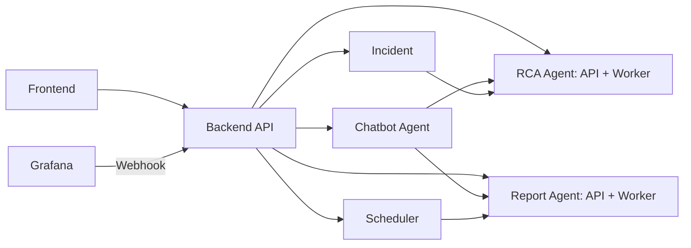

# DSX GPU Operations

CPC-1·CPC-2의 GPU·Node·Pod 관측을 CSC에서 연결해 **장애 원인 조사와 운영 개선 검토를 지원하는 서비스**입니다. 대시보드와 공통 Assistant에서 대상을 선택하고, 조사·보고서·근거·후속 조치 기록까지 같은 흐름으로 확인합니다.

이 저장소는 DSX의 설계 결정, 개발 명세, 구조도, 화면 시안과 검수·인계 기준을 관리합니다. **현재 개발 기준은 2026-09-17 모듈 분리 개정본 v1.2**입니다. 문서와 화면 시안이 준비된 단계이며 실제 Backend·DB·LLM 통합과 제품 검수의 완료를 뜻하지 않습니다.

[개발 문서 목록](<../output/deliverables-20260917-v1.2/00_산출물_안내.md>) · [화면설계](<../output/deliverables-20260917-v1.2/08_GUI_화면설계서.md>) · [현재 모듈 구조](<../output/deliverables-20260917-v1.2/00_산출물_안내.md>) · [통합 검토 반영 내역](<../output/deliverables-20260917-v1.2/09_통합검토_반영내역.md>)

## 처음 읽는 순서

React 기반 프론트엔드는 루트의 [`frontend/`](../frontend/README.md)에 있습니다. `cd frontend`, `npm ci`, `npm run dev`로 실행합니다. 현재는 7개 메뉴·조사/보고서/일정·지식·모델 설정을 확인할 수 있는 **데모 데이터 기반 프론트엔드**이며, 실제 Backend·인증·LLM·예약 실행은 아직 연결되지 않았습니다. [프론트엔드 검증 기록](../frontend/QA.md)에 실행 결과와 미검증 범위를 분리했습니다.

1. 이 README에서 서비스 목적·구조·현재 상태를 확인합니다.
2. [요구사항·개발 범위](<../output/deliverables-20260917-v1.2/01_요구사항_개발범위_정의서.md>)에서 담당 기능과 완료 조건을 확인합니다.
3. 개발 역할에 따라 API·데이터·Agent·프론트엔드 명세를 읽습니다.
4. [테스트 기준](<../output/deliverables-20260917-v1.2/05_테스트_검수_기준서.md>)과 [운영 인계서](<../output/deliverables-20260917-v1.2/06_배포_운영_인계서.md>)에 구현 결과와 실환경 증거를 연결합니다.

## 제공할 기능

Agent는 **Chatbot·GPU Node RCA·운영보고서** 세 개의 독립 실행·배포 모듈입니다. Chatbot은 일반 대화·조회·요청 해석·결과 설명을 맡으며, 긴 전문 분석을 해당 Agent의 작업으로 접수합니다.

| 영역 | 주요 기능 |
|---|---|
| 관제·관측 | CPC·Node·GPU·Pod 조회, 현재/과거 관계, 메트릭·로그·관측 품질·사건 확인 |
| RCA | Grafana 알림 또는 사용자 증상에서 조사 시작, 관련 작업·원인 후보·지지/반박 근거·다음 점검 제공 |
| 운영보고서 | 현재 할당 명세, 기간별 할당·활동·사건·전력 비교, 개선 검토 대상과 한계 제시 |
| 작업·일정 | 영속 작업 목록, 진행·취소·재시도·시도 이력, 일·주·월 정기 보고서와 발생 이력 |
| 공통 Assistant | 화면의 대상·기간·결과 맥락을 이어 질문, 허용 조회, 전문 작업 접수와 결과 연결 |
| 지식·설정 | Runbook·정책의 검토/발행, 등록 조사 절차 열람, 사내 모델·라우팅·연결 관리 |
| 검토·공유 | 운영자 검토와 실제 조치 기록, 재분석, 저장 보고서의 HTML·집계 CSV 출력 |

### RCA 업무 R01~R09

| ID | 업무 | 결과를 읽는 기준 |
|---|---|---|
| R01 | 알려진 오류 조사 | 장비·버전과 호환되는 지식 및 점검 근거 |
| R02 | GPU → Pod 조사 | 현재 관계와 사건 시점 관계 구분 |
| R03 | Pod → GPU 조사 | GPU가 미확정인 Pod도 접수, 배치·관계·활동 별도 판단 |
| R04 | 작업 영향 확인 | 같은 장비에 있었다는 사실과 실제 작업 실패 구분 |
| R05 | 미등록·불명 증상 조사 | 원인 후보, 부족 입력, 다음 확인과 종료 사유 |
| R06 | 재발 위치 비교 | 장비·작업의 위치와 사건 이력을 비교 |
| R07 | 공통 장애 범위 확인 | 공통점과 토폴로지 근거의 한계 표시 |
| R08 | 조치 검토 대상 확인 | 현재 관계와 조치 전 확인 사항 제공 |
| R09 | 조치 후 관측 | 장비 회복과 실제 업무 복구를 각각 확인 |

### 운영보고서 업무 O01~O11

| ID | 업무 | 주요 산출 |
|---|---|---|
| O01 | 장비·Node 변화 | 현재 상태와 기간 변화 |
| O02 | 할당 명세·시간 | 현재 전용 할당, 근거가 있는 기간 GPU-hours |
| O03 | 저활동 후보 | 관측 저활동 시간, 검토 후보·보류 사유 |
| O04 | 다중 GPU 편차 | 같은 작업의 장치별 활동 차이 |
| O05 | 반복 사건·정비 순서 | 중복 제거 사건 수, 관측 시간당 발생률 |
| O06 | 사건 당시 작업 | 사건 시점의 관계와 확인된 영향 |
| O07 | 배치 대기·용량 검토 | 유효 미배치 요청과 용량 조건 |
| O08 | Namespace·프로젝트 배분 | 확인된 소유권·귀속 범위의 자원 배분 |
| O09 | GPU 에너지 | 실제 전력·에너지 자료에 근거한 산출 |
| O10 | 조치 전후 변화 | 전후 수치·실제 조치 기록·비교 조건 |
| O11 | 관측 품질 | 공동 관측률, 누락·신선도·분석 가능 범위 |

세부 입력·산식·출력과 보류 조건은 [Agent 명세](<../output/deliverables-20260917-v1.2/04_Agent_동작_판단_명세서.md>)를 따릅니다. P0는 기본 흐름의 선행 구현, P1은 전문 분석·운영 완성 순서이며 **둘 다 개발 범위**입니다. 일·주·월 정기 보고서는 P0에 포함됩니다.

## 구조

Backend는 프론트엔드 연결점이며 다른 모듈을 내부 API로 호출합니다. 다음 6개 모듈은 각각 독립 실행·배포합니다.



각 Agent의 접수·실행, Incident의 사건 처리, Scheduler의 달력 실행은 해당 모듈이 소유합니다. Backend는 입력 검증·내부 호출·응답 조합과 공통 읽기·설정 API를 담당합니다. 공통 조회·계산·Knowledge·LLM·저장 코드는 라이브러리로 재사용합니다.

초기 업무 DB는 PostgreSQL 하나를 공유하고 모듈별 쓰기 책임을 구분합니다. 자동 요청은 생산 모듈이 업무와 전달 의도를 함께 저장한 뒤 목적지 Agent API로 전달합니다. Agent가 job을 커밋한 뒤 job_id를 연결하므로 ‘전달 중’과 ‘작업 접수 완료’를 구분합니다. 응답 유실·재시작은 같은 전달 키로 복구합니다.

CPC의 기존 관측은 관측 Gateway·Mimir/Loki를 활용하고 추론은 사내 Endpoint를 사용합니다. 물리 서버·복제 수와 기술 스택은 배포 검증 후 확정합니다. [전체 모듈 구조·문서 목록](../output/deliverables-20260917-v1.2/00_산출물_안내.md)과 [공통 호출 계약](../output/deliverables-20260917-v1.2/15_모듈간_호출과_공통실행_계약.md)이 현재 기준입니다.

## 구현에서 유지할 판단·실행 기준

| 기준 | 합의 내용 |
|---|---|
| 식별과 시간 | CPC·GPU UUID·Pod UID와 기준 시각을 함께 사용. 현재 매핑을 과거에 복사하지 않음 |
| 세 가지 상태 | Pod의 Node 배치, GPU 관계, 활동을 독립 판단. Pending·VRAM 사용·같은 Node만으로 GPU 할당/사용을 확정하지 않음 |
| 관측의 한계 | 0은 유효한 관측값, 미확인·누락은 null과 사유. 공유/MIG를 전용 물리 GPU와 분리 |
| 수치와 설명 | 조회·집계는 코드가 결정적으로 계산. LLM은 조사 선택·해석·설명을 담당하고 수치는 저장 값·단위·대상·기간·근거에 연결 |
| 저활동 후보 | 같은 전용 GPU·Pod UID·관측 할당 episode의 60분 창, utilization 5% 미만, 공동 관측률 95% 이상, 유효시간 중 저활동 비율 90% 이상 |
| 짧은 할당 | 60분 미만은 관측 시간만 제공하고 장시간 후보는 보류. 서로 다른 Pod의 짧은 할당을 합치지 않음 |
| 이력과 차트 | 보존된 Mimir 원본 시각·관계·수집 품질로 이력을 복원. 차트 표시 간격이 저장 결과의 수치를 바꾸지 않음 |
| 권한 | 역할·CPC·Namespace·장비 관측 권한의 조합을 서버에서 검증. 결과·근거·지식·Assistant·출력에도 적용 |
| 상태 표시 | `job.status`, `result_status`, 주제/목적별 상태, `quality`, `narrative_status`를 구분. 설명 실패만으로 계산·근거를 버리지 않음 |
| 재시도·일정 | 멱등 키·조건부 변경·시도 이력·누적 예산 유지. 일정 revision의 효력과 이미 접수한 기간을 보존 |
| 일반 대화 | Chatbot은 제한시간 내 동기 JSON 응답과 메시지 ID 재조회. 대기 화면 닫기와 전문 작업 취소 구분 |
| 지식과 복구 | 호환되는 발행 revision을 사용. Healthy·알림 해제·로그 부재만으로 장비 회복이나 업무 복구를 확정하지 않음 |

5%·60분·95%·90%의 기존 수치는 유지하고, 후보 적격성·시간창·결과 구조를 보완한 실행 기준은 v1.1로 기록합니다. 저활동 후보는 자원 낭비·회수 가능의 확정 판정이 아닙니다. 실제 조치는 운영자가 판단·수행하며 권고와 수행 기록을 분리합니다.

## 화면과 시안 확인

DESIGN 05의 7개 메뉴와 S01~S16/S07B를 유지합니다. 공통 Assistant는 전역 패널과 펼친 대화에서 같은 맥락을 사용합니다.

| 메뉴 | 화면 |
|---|---|
| 운영 대시보드 | S01 |
| 자산·관측 | S02 장비/GPU, S03 작업 연결, S04 관측 품질 |
| RCA 조사 | S05 목록, S06 요청, S07 사건 결과, S07B 직접 조사 결과 |
| 운영 분석·보고서 | S08 주제, S09 요청·일정, S10 결과 |
| 작업 이력 | S11 작업 목록·상세 |
| 지식·Runbook | S12 |
| 연결·설정 | S13 모델, S14 모델 지정, S15 데이터 연결 |
| 전역 기능 | S16 공통 Assistant |

이전 화면 구성은 아래 PDF의 Git 기록과 DESIGN 05 캡처에서 확인할 수 있습니다. 현재 실행 가능한 데모 프론트엔드는 위의 frontend 실행 안내를 따릅니다.

v1.1에서 보완한 Pod 조사·KB 관리·일정·권한·복구 흐름은 아래 최신 명세가 구현 기준이며, 기존 이미지에 모두 반영된 상태는 아닙니다.

[이전 프론트엔드 PDF](https://github.com/uclix-nvidia-sw/gpu-ops-advisor/blob/fa79de88f131333c48516d676ee811944d8d698a/output/deliverables-20260916-v1.1/07_%ED%94%84%EB%A1%A0%ED%8A%B8%EC%97%94%EB%93%9C_%EA%B0%9C%EB%B0%9C%EB%AA%85%EC%84%B8%EC%84%9C.pdf) · [이전 화면설계 PDF](https://github.com/uclix-nvidia-sw/gpu-ops-advisor/blob/fa79de88f131333c48516d676ee811944d8d698a/output/deliverables-20260916-v1.1/08_GUI_%ED%99%94%EB%A9%B4%EC%84%A4%EA%B3%84%EC%84%9C.pdf) · [DESIGN 05 시안 기록](<../output/gui-design-20260916/README.md>)

## 개발 문서

현행 문서는 `output/deliverables-20260917-v1.2/`에 있습니다. README는 진입점이며 필드·상태·산식의 상세 원본은 다음 문서입니다.

| 번호 | 문서 | 기준 |
|---|---|---|
| 00 | [산출물 안내](<../output/deliverables-20260917-v1.2/00_산출물_안내.md>) | 버전·목록·출처·검증 상태 |
| 01 | [요구사항·개발 범위](<../output/deliverables-20260917-v1.2/01_요구사항_개발범위_정의서.md>) | F01~F14, N01~N05, P0/P1·완료 조건 |
| 02 | [Backend·API 명세](<../output/deliverables-20260917-v1.2/02_백엔드_API_작업명세서.md>) | 프론트엔드 API·DTO·권한·내부 라우팅 |
| 03 | [데이터 설계](<../output/deliverables-20260917-v1.2/03_데이터_설계서.md>) | D01~D14, 식별·관측·이력·DB·보존 |
| 04 | [Agent 동작·판단 명세](<../output/deliverables-20260917-v1.2/04_Agent_동작_판단_명세서.md>) | Agent 공통 산식·정책·출력 |
| 05 | [테스트·검수 기준](<../output/deliverables-20260917-v1.2/05_테스트_검수_기준서.md>) | T01~T48, 고정 사례·기대값·실행 증거 |
| 06 | [배포·운영 인계](<../output/deliverables-20260917-v1.2/06_배포_운영_인계서.md>) | C01~C12, CPC별 활성화·설정·복원·담당 |
| 07 | [프론트엔드 개발 명세](<../output/deliverables-20260917-v1.2/07_프론트엔드_개발명세서.md>) | 화면·API·접근성·AC01~AC15·요구사항 추적 |
| 08 | [GUI 화면설계](<../output/deliverables-20260917-v1.2/08_GUI_화면설계서.md>) | 화면별 입력·행동·결과·예외·완료 경로 |
| 09 | [통합 검토 반영 내역](<../output/deliverables-20260917-v1.2/09_통합검토_반영내역.md>) | 모듈 분리 변경·요구사항·검수 추적 |
| 10 | [Chatbot Agent](../output/deliverables-20260917-v1.2/10_Chatbot_Agent_모듈_설계서.md) | 일반 대화·전문 요청 전달 |
| 11 | [RCA Agent](../output/deliverables-20260917-v1.2/11_RCA_Agent_모듈_설계서.md) | 접수 API·Worker·R01~R09 |
| 12 | [보고서 Agent](../output/deliverables-20260917-v1.2/12_보고서_Agent_모듈_설계서.md) | 접수 API·Worker·O01~O11·HTML/CSV |
| 13 | [Incident](../output/deliverables-20260917-v1.2/13_Incident_모듈_설계서.md) | 알림 정규화·사건·RCA 전달 |
| 14 | [Scheduler](../output/deliverables-20260917-v1.2/14_Scheduler_모듈_설계서.md) | 일정·발생·보고서 전달 |
| 15 | [모듈 간 호출·공통 실행](../output/deliverables-20260917-v1.2/15_모듈간_호출과_공통실행_계약.md) | 내부 계약·전달 복구·작업·예산 |

[이전 v1.1 ZIP](<../output/DSX_통합개정산출물_v1.1_20260916.zip>)은 당시 문서·PDF·출처 묶음입니다. v1.2는 Markdown 16종이며 이전 PDF·ZIP은 최신 모듈 경계를 반영하지 않습니다. 이후 변경은 저장소의 최신 Markdown과 이 README의 기준 버전을 따르며, 날짜·버전이 붙은 ZIP은 당시 배포본으로 보존합니다.

## 현재 상태와 다음 개발 단계

| 영역 | 2026-09-16 기준 |
|---|---|
| 설계·명세 | 6개 독립 모듈을 반영한 v1.2 설계·문서 간 대조 |
| 화면 시안 | DESIGN 05 화면 캡처와 기존 시각 검증 기록 존재. 최신 계약의 실제 서비스 연결은 후속 구현 |
| 기존 관측 기반 | 두 CPC의 중앙 조회·매핑 활용 기록 존재 |
| CPC-2 직접 수집 | Alloy 직접 수집, 일부 target·동시점 Pod UID 조인·GPU_UTIL 0값의 짧은 확인 기록 존재 |
| 추가 관측 검증 | CPC-1 직접 경로 전환, 최종 재배포 후 Loki 최신 수신, 장기 이력·부하 반응·내구성 등 대상별 확인 필요 |
| Backend 통합·제품 검수 | T01~T48 전체 NOT RUN. 실제 앱 배포 패키지·migration·복원 명령은 구현 후 연결 |
| 운영값·WBS | 담당자·일정, 인증·Endpoint·한도·성능·보존·RPO/RTO는 C01~C12와 후속 WBS에서 확정 |

CPC-2의 일부 확인 기록을 두 CPC 전체의 제품 검수 PASS로 확장하지 않습니다. 실환경 활성 여부는 [인계서 C04](<../output/deliverables-20260917-v1.2/06_배포_운영_인계서.md>)의 **CPC × R/O 40행**에서 모의 정상·실환경 정상·부족 처리를 각각 기록합니다. 현재 조회가 된다는 사실만으로 기간별 GPU-hours나 업무 복구까지 확인된 것은 아닙니다.

개발은 다음 순서로 연결합니다. 상세 일정과 담당은 WBS에 배정합니다.

1. **권한·관측 연결:** 인증, CPC/Namespace 범위, 대상·관계·근거 조회.
2. **영속 작업과 결과:** Backend·각 Agent 내부 API·PostgreSQL, 영속 전달·알림/사용자 접수, 결과 저장·재조회, 취소·재시도·복구.
3. **사용자 업무 완성:** 공통 Assistant, 일·주·월 일정, KB·모델 관리, 전체 R/O 주제와 검토·출력 연결.
4. **실환경 검수·인계:** CPC별 활성 범위, 권한·장애·부하·복원 시험, 운영 설정·담당·증거 확정.

## 기존 기록과 결정 배경

현재 개발에 필요한 기록과 출처 사본을 유지합니다. 대체된 구조도·중복 자료는 Git 이력에서 확인할 수 있습니다. 이전 문서의 실험·제안·확인 시점은 해당 기록의 범위로 읽습니다.

| 기록 | README에 반영한 맥락 |
|---|---|
| [9/8 통합 아키텍처 복원](<../output/final/DSX_통합_아키텍처_복원_2026-09-08.md>) · [구성·연동 기술기록](<../output/final/DSX_구성_연동_기술기록_2026-09-08.md>) | CPC/CSC·수집·저장 기반과 환경별 실험 기록 |
| [메모리 대조와 설계결정](<../output/deliverables-20260916-v1.1/sources/메모리_대조와_설계결정_20260915.md>) | 두 전문 Agent·공통 Assistant, 직접 Webhook, 관측·업무·추론 저장 역할 |
| [공통 수집환경과 Agent 업무](<../output/share/DSX_CPC_공통수집환경과_Agent업무_2026-09-15.md>) · [데이터 근거와 기능 매핑](<../output/share/DSX_수집데이터_근거대조와_기능매핑_2026-09-15.md>) | 양 CPC의 공통 활용 기반과 실제 확인 범위 |
| [RCA 역할 설계](<../output/share/DSX_GPU_RCA_Agent_역할과_데이터설계_v1.0.md>) · [보고서 역할 설계](<../output/share/DSX_GPU_운영보고서_Agent_역할과_데이터설계_v1.1.md>) | R/O 전체 업무와 필요한 데이터 경계 |
| [공통판단 기준](<../output/share/DSX_Agent_공통판단기준과_인사이트사례_v1.0.md>) · [KB v2.0 검토](<../output/share/DSX_KB_v2.0_구조_검토의견_및_설계확정조건.md>) | 결정적 계산·수치 기준·발행 지식·등록 절차의 역할 |
| [이전 Backend 구조 v2](<../output/architecture-backend-20260916-v2/구성_설명.md>) | API 서버·두 Worker·공유 모듈. 사이트·인증 관련 추가안은 후속 검토 |
| [외부 검토와 출처 묶음](<../output/deliverables-20260916-v1.1/sources/출처_안내.md>) · [원문 지문](<../output/deliverables-20260916-v1.1/sources/원문_목록과_지문.json>) | v1.1에서 대조한 원문 15개와 고정 버전 |

별도 Mapper 상시 서비스를 새로 두기보다 기존 매핑과 보존 관측을 공통 도구에서 조회·복원합니다. 알림 경로는 Grafana 관리형 Alerting의 직접 Webhook을 사용합니다. 예전 자료의 Ruler/Alertmanager 경로, Exchange/NATS 실험, 서비스 5개 분리안은 현행 필수 구성으로 적용하지 않습니다.

CPC-2의 최신 수집 진행안은 KSM·GPU Exporter를 Alloy가 직접 수집하는 경로입니다. Exporter 작업 라벨과 KSM의 동시점 UID 조인 기록을 활용하며, 전환 전 Prometheus remote_write·Alloy 수신 경로와 구분합니다. 기존 Prometheus 모니터링의 제거를 뜻하지 않고 CPC-1 전환 상태는 별도로 확인합니다.

## 저장소 구성과 사용

현재 개발 기준은 모듈 분리 명세 v1.2입니다. 이전 Backend 구조도 v2는 당시 설계 기록이며 현재 모듈 경계는 v1.2의 00·10~15를 따릅니다. 사이트·인증 제품의 세부 설계는 후속 검토 대상입니다.

```text
.
├── README.md
├── docs/README.md
├── output/
│   ├── deliverables-20260917-v1.2/   # 현행 모듈 분리 명세 16종
│   ├── deliverables-20260916-v1.1/   # 이전 명세·PDF·출처 사본
│   ├── architecture-backend-20260916-v2/ # 이전 구조도·편집 원본
│   ├── gui-design-20260916/         # DESIGN 05 화면 캡처·안내
│   ├── share/                      # 역할·판단·수집·KB 기록
│   └── final/                      # 기존 환경 복원 기록과 근거
├── review/                         # 개발 착수 분석
├── references/                     # 과거 원문 ZIP·지문·근거 메모
└── tools/check_links.py            # 로컬 링크·자산 경로 검사
```

이전 구조의 참고 이미지는 [전체 Backend](<../output/architecture-backend-20260916-v2/dsx-full-backend.png>)와 [Backend 상세](<../output/architecture-backend-20260916-v2/dsx-backend-detail.png>)를 확인합니다. [화면 이미지 목록](<../output/gui-design-20260916/screens/README.md>)은 FE 구현의 배치 참고 자료입니다.

[보존 자료 안내](<../references/저장소_묶음_안내.md>)의 ZIP·파일 지문은 과거 배포 시점의 기록입니다. 현재 파일 목록은 Git을 기준으로 확인합니다.

저장소 루트에서 Python 3.9 이상으로 링크를 검사합니다.

```bash
python tools/check_links.py
```

## GitHub에서 변경을 관리하는 기준

- 편집 가능한 Markdown·설계 원본을 기준으로 변경하고, PDF·ZIP에는 대응 버전과 날짜를 유지합니다. 과거 배포본과 출처 원문은 보존합니다.
- 기능 변경에는 해당 `F/N`, 전문 업무에는 `R/O`, 화면에는 `S/AC`, 검수에는 `T` ID를 연결합니다. 상세 대응은 05·07의 추적표를 사용합니다.
- API·상태·scope 변경은 02·03·07·08, 산식·판단 변경은 03·04·05와 함께 맞춥니다. 구현에 필요한 운영값은 06에 연결합니다.
- PR에는 변경 목적·영향 기능·문서 버전·검증 결과·남은 확인을 적습니다. `NOT RUN`, `PASS`, `FAIL`, `BLOCKED`와 적용 제외 사유를 실제 증거에 맞춰 기록합니다.
- 인증정보는 Secret 참조로 관리합니다. C01~C12에는 필요한 설정 위치와 담당·검증 기록을 남기며 비밀 원문을 넣지 않습니다.

## 개발 범위 밖

자동 GPU reset·Node 재부팅·cordon/drain·Pod 종료·자원 재배치·전력 제어, 냉각/BMS/DCIM·Digital Twin 제어, Exchange/NATS 신규 도입, Run:ai API·quota·대기열 신규 연동, 과금·청구·검증되지 않은 절감액 확정은 기본 개발 범위에 포함하지 않습니다.

기존 CPC 수집 기반은 활용하며 서비스 연동에 필요한 결함 수정과 추가 필드 검증은 포함합니다. 상세 범위 변경은 [요구사항 정의서](<../output/deliverables-20260917-v1.2/01_요구사항_개발범위_정의서.md>)에 먼저 반영합니다.
