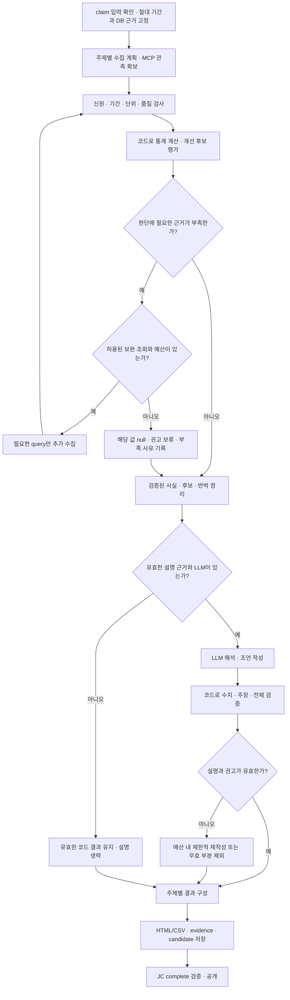

# 보고서 Agent 워크플로우 검토안

2026-09-28 최초 검토 · 코드 기준 `fedd2b6`. 2026-09-30 합의한 Orchestrator·병렬 수집·Synthesis 흐름은 [12번 설계서](../../specs/ops-agent/12_보고서_Agent_모듈_설계서.md)의 추가 개발 목표로 반영했다. 구현 기준은 12/04/14, 검수는 05를 따르며 이 문서는 검토 근거와 요약 도면을 보존한다. 제품 코드·DB·배포는 변경하지 않았다.

[인터랙티브 워크플로우](report-agent.workflow.html) · [JSON 원본](report-agent.workflow.json) · [생성 검증 기록](delivery-receipt.json) · [브라우저 검증 기록](report-agent.workflow.visual-check.json)

2026-09-30: [상세 Mermaid 흐름도](detailed-workflow.md)를 추가했다. 의뢰·예약·배분, 근거 수집·통계, 개선 조언·검증, 저장·공개·공통 중단의 네 흐름으로 분기와 재시도를 설명한다. 아래 기존 HTML과 검증 기록은 2026-09-28 요약 도면의 기록이다.

같은 날 수집 구조 합의: 긴 Grafana 조회에 대비해 RCA와 같은 Orchestrator·query별 병렬 Observation Sub-agent 구조를 개발 목표로 채택했다. 전체 예산·동시성·취소를 공유 관리하고 통계·Synthesis로 취합한다. 실제 지연 개선은 미검증이며 구현은 대기 중이다. 상세 Mermaid의 수집 절을 최신 목표로 따른다.

## 1. 검토 결론

보고서 Agent는 기간 통계와 공개 RCA 결과를 엮어 **어디를 더 확인하고, 어떤 운영 변경을 검토하며, 변경 후 무엇으로 효과를 확인할지** 제안한다. 계산은 코드, 근거 해석과 설명은 LLM, 실행 여부는 사람이 맡는다.

일정은 Backend 내부 스케줄러에 등록한다. 예약 시점이 되면 Backend가 보고서 작업을 JC에 접수하고, 상시 실행 중인 Ops Worker가 claim하여 처리한다. 예약마다 Agent 프로세스를 새로 띄우거나 Backend가 Agent를 직접 호출하는 구조가 아니다. 즉시 보고서는 일정 등록 없이 Backend에서 JC로 접수한다.

RCA의 근거 확보 → 분석 → 검증 → 필요 시 보완 조사 구조는 참고하되, 보고서는 요청한 기간·주제에 대한 결정적 집계에서 출발한다. 보고서를 위해 새 RCA를 실행하거나 Runbook 검색을 기본 단계로 추가하지 않는다. 내부 단계와 Observation Sub-agent는 한 Worker의 NAT 워크플로 안에서 실행하며 별도 서비스나 JC 작업으로 분리하지 않는다.

## 2. 현재 구현과 확장 목표

| 영역 | 확인한 현재 동작 | 이번 검토안 |
|---|---|---|
| 접수·일정 | Backend의 일정 revision, occurrence, outbox와 즉시 요청 접수 | 기존 구조 유지 |
| 실행·공개 | Worker claim/heartbeat, 후보·근거 저장, JC complete·공개 | 기존 소유권과 lease·취소·deadline 유지 |
| 수집 | 주제별 PLAN의 query ID를 합쳐 순차 MCP 조회, DB 사건·공개 RCA·조치 기록 고정 | query별 병렬 Observation Sub-agent·전체 예산 관리, 부족한 판단 근거의 제한적 보완 조회 |
| 통계 | O01~O11 분기와 공통 산식, 주제별 ready/partial/blocked | OP-01~04의 그룹·사건·당시 작업·혼합 결과 소비 보완 |
| 현재 권고 | O03에 작업 목적·예외 확인 권고가 있고 eligibility=withheld | 여러 주제의 근거를 연결해 운영 개선 후보와 권고 자격을 평가 |
| LLM | 제공된 fact_ids 선택과 유효 ID 검사 | 검증된 수치·후보를 해석하고 전제·반박·확인 방법을 설명 |
| 검증 | 결과 형식·근거 참조·저장/공개 계약 | 주장과 근거의 의미 일치, 권고 전제, 후속 조회 허용성 검사 보강 |

`recommendations` 필드의 존재만으로 클러스터 최적화 조언이 구현됐다고 보지 않는다. 현재 O03 권고는 업무 목적 미확인 때문에 보류된다. LLM도 자유롭게 개선안을 생성하는 상태가 아니다.

## 3. 접수부터 공개까지

HTML은 ①→⑫ 순서다. 첫 줄은 왼쪽→오른쪽, 둘째 줄은 오른쪽→왼쪽, 셋째 줄은 왼쪽→오른쪽으로 읽는다. 화살표는 업무 진행이며 네트워크 호출 방향을 모두 그린 것은 아니다. 특히 ③→④는 Worker의 claim에 대한 JC 응답이다.

1. **Frontend 의뢰:** 클러스터·Namespace 등 범위, 주제, 그룹, 기간/비교 기간, 시간대와 반복 주기를 입력한다. 등록 시 분석 대상 기간과 실행 예정 시각을 구분한다.
2. **Backend 일정:** 일정과 revision을 저장한다. 예약 시점에 완료된 달력 기간을 절대 time_range로 고정하고 occurrence와 outbox를 같은 트랜잭션으로 만든다. catch-up 제한·중복 기간은 기존 missed 사유를 보존한다.
3. **JC 접수:** outbox가 kind=report 작업을 멱등 접수한다. JC가 큐·용량·attempt·lease를 관리한다. 즉시 요청도 같은 report 실행 경로에 합류한다.
4. **Ops Worker 인수:** claim 입력을 재검증하고 실행 예산을 적용한다. 지연 실행돼도 분석 기간을 현재 시각으로 다시 계산하지 않는다.
5. **근거 확보:** DB의 data_cutoff_at, 사건 snapshot, 공개 RCA result ID/hash, 실제 조치 기록을 고정한다. MCP로 해당 범위·기간의 메트릭·관련 로그·매핑 이력을 읽고 응답 snapshot과 수집 품질을 보존한다. MCP 원천 자체가 DB와 같은 트랜잭션 snapshot이라는 뜻은 아니다.
6. **통계 계산:** 대상 신원·단위·유효 구간·중복·분모를 검사한 후 수치를 계산한다. 현재 OP-01~04와 criteria 1.2 목표는 아직 보완 대상이다.
7. **개선 후보 도출 — 확장:** 주제별 규칙과 검증된 운영 정책을 사용해 저활동·배치 대기·편차·반복 사건·에너지 관련 검토 대상을 만든다. 운영 임계값을 임의로 확정하지 않는다.
8. **근거 기반 조언 — 확장:** LLM에 검증된 수치, 공개 RCA의 원인 수준, 후보, 반박 근거, 한계를 제공한다. 대상·이유·전제·다음 행동·확인 지표를 작성한다.
9. **결과 검증 — 보강:** 수치·근거 참조뿐 아니라 대상·시각·주장 의미와 권고 전제를 검사한다. 유효한 통계와 권고만 유지하며 보류 사유를 남긴다.
10. **저장:** 저장 수치로 HTML/CSV와 checksum을 만들고 자기 attempt의 evidence·candidate를 저장한다. 파일/DB 저장 실패는 성공이 아니다.
11. **공개:** Worker가 complete를 요청하고 JC가 attempt·lease·취소·schema/hash 등 실행 계약을 검증해 공개 결과를 확정한다. JC는 분석의 업무적 타당성을 대신 판정하지 않는다.
12. **조회·운영 검토:** Backend를 통해 공개 결과를 조회한다. 다운로드는 Backend가 저장된 공개 결과로 렌더링한다. 사람이 권고를 검토·실행하고 실제 조치 기록을 남기면, 후속 보고서의 O10에서 전후 변화를 비교한다.

## 4. Agent 내부 판단 흐름 제안

아래 보완 조회·후보/설명 생성·의미 검증 루프는 **추가 개발 제안**이다. 현재 코드는 정해진 PLAN을 순차 수집·계산한 뒤 fact_ids 설명을 요청한다. 기존 수집기의 응답 크기 초과 분할 재조회와 새로운 판단 보완 루프를 구분한다.

보완 조회는 원래 scope·기간, 등록 query와 정책, 남은 호출/토큰 예산·deadline·유효 lease 안에서만 허용한다. 동일 근거를 재사용하고 새 정보를 얻을 수 없는 반복은 종료한다. 최초 버전에서는 코드가 부족 입력을 query에 연결하는 방식으로 충분하며 자유 SQL/PromQL/쉘 생성은 필요하지 않다.

설명 형식 오류만으로 MCP를 다시 조회하지 않는다. 재작성도 별도 무한 루프가 아니라 남은 예산 안의 제한된 처리이며, 실패하면 유효한 부분과 narrative_status를 보존한다. 호출 횟수·품질 임계값은 기존 설정과 후속 합의 대상이다.

이 도식은 유효한 실행권이 유지되는 업무 흐름이다. 모든 단계에서 취소·deadline·lease 만료는 실행 종료 계약이 우선한다. 원격 LLM 종료가 불명확하면 기존 fail·격리 경로를 따르며 부분 보고서 발행으로 우회하지 않는다.

## 5. 통계가 어떤 조언으로 이어지는가

아래는 설계 예시이며 실제 클러스터의 발견이나 실행 권고가 아니다.

| 운영 질문 | 통계·근거 | 제안할 조언 | 보류 조건 |
|---|---|---|---|
| 할당을 오래 유지하지만 활동이 낮은가? | O02/O03: 같은 할당 episode의 시간·활동, 업무 예외 | 담당자에게 예약·초기화·체크포인트·추론 대기 목적 확인 후 요청량/운영 시간 조정 검토 | 할당·활동·업무 목적 미확인. 낮은 활동만으로 낭비 확정 금지 |
| GPU가 남아 보이는데 왜 대기하는가? | O07/O08: 유효 미배치 요청, 자원 단위, 노드별 용량·배치 제약 | 검증된 제약에 따라 요청 크기·배치 조건·배분 정책 검토 | Pending phase만 있거나 scheduler 계약 없음. 부족량·단편화 확정 금지 |
| 다중 GPU 작업의 편차를 줄일 수 있는가? | O04: 같은 작업·동시 구간의 장치별 활동, 관련 로그 | 작업 분할·입력 공급·통신 프로파일 추가 확인 | 서로 다른 작업, 동시 관측 없음. 병목/불량 확정 금지 |
| 어떤 장비를 먼저 점검할까? | O05/O06: 같은 사건 정의의 건수/유효 관측시간, 공개 RCA와 당시 작업 | 근거가 비교 가능한 범위에서 점검 대상을 정리하고 RCA 권고 인용 | 분모·그룹 불명, RCA 미완료. 원인 없음이나 전체 정비 순위로 대체 금지 |
| 에너지 사용을 줄일 여지가 있는가? | O09/O10: 실제 전력 적분, 실제 조치·동일 대상 전후 관측 | 운영 패턴과 사용 시간 검토, 변경 후 비교 계획 제시 | power limit만 있음, 업무량 불명. 임의 절감률·금액·인과 효과 생성 금지 |
| 무엇을 더 수집해야 판단이 나아지는가? | O11: 신선도·공백·매핑·분모와 영향받는 주제 | 누락된 생산자 계약·이력·기대 대상 보완 제안 | 기대 분모 없으면 전체 커버리지 대신 확인 범위만 표시 |

권고는 **대상 → 관측 사실 → 해석 → 전제/반박 → 다음 행동 → 확인 지표** 순서로 제시한다. 기존 recommendations의 text, preconditions, eligibility, reason, evidence_refs, value_refs, execution=not_performed를 활용한다. 우선순위는 근거가 있는 범위에서 설명하며 임의 가중 종합 점수는 만들지 않는다. 새로운 priority/expected_savings 등의 공개 필드를 합의 없이 추가하지 않는다.

최종 보고서는 요청 개요·데이터 기준시각, 핵심 요약, 주제별 통계/비교, 사건·공개 RCA 요약, 개선 권고와 보류 항목, 데이터 품질·한계, 근거 참조 순서로 읽게 한다. 표·본문·다운로드는 동일한 저장 수치를 참조한다.

## 6. 실패·부족 근거 처리

| 상황 | 결과 |
|---|---|
| 사건은 있으나 RCA가 없거나 미완료 | 미분석/미완료를 표시. 사용량·에너지 등 독립 주제는 계속 처리 |
| 메트릭/매핑/분모 일부 부족 | 해당 값은 null과 사유, 주제는 partial/blocked. 독립적인 유효 통계 보존 |
| 권고의 업무 전제 미확인 | eligibility=withheld, 다음 확인 사항 명시 |
| LLM 미설정·예산 부족·확정된 실패 | 유효 코드 결과 유지, narrative_status=omitted/failed. 의미 검증 실패 설명은 제외 |
| 취소·deadline·lease 만료·원격 추론 종료 불명 | 기존 Worker/JC 종료·격리 계약 우선. 성공이나 강제 부분 공개로 처리하지 않음 |
| JC 일시 불가 | 정기 접수는 outbox에서 재시도하되 dispatch 기한·기존 상태 전이를 적용 |
| Worker 불가 | JC에 접수한 작업은 큐·기존 만료 정책에 따라 관리 |
| candidate/파일 저장 실패 또는 complete 거절 | 공개 완료로 표시하지 않음. 같은 complete 전송 재시도는 새 candidate 재계산과 구분 |

보고서의 result_status와 JC job 상태는 다른 축이다. 적법하게 공개된 작업도 주제별 partial/blocked를 포함할 수 있으며, 이를 전체 데이터가 완전하다는 뜻으로 표시하지 않는다.

## 7. 구현 전에 이어갈 작업

기존 [12번 Ops 명세](../../specs/ops-agent/12_보고서_Agent_모듈_설계서.md)의 OP-01~04를 우선 연결한다. 요청 그룹·사건 정의·재발/발생률·사건 당시 작업 연결이 불안정하면 개선 후보의 근거도 불안정하다. 산식·그룹 기준은 [04 §5.5](../../specs/common/04_Agent_동작_판단_명세서.md#55-보고서-그룹과-사건-통계--추가-개발-목표-12)를 단일 기준으로 사용한다.

그다음 주제별 후보 규칙과 권고 전제, 설명 의미 검증, 제한적 보완 조회를 연결한다. 보고서 전용 로직은 Ops에 두고 양 Worker가 실제로 공유하는 계산·관측·실행 코드만 공통 Python에 둔다. Backend/Frontend는 보류 권고·수치 참조·데이터 품질 표시를 함께 확인한다. 조언별 기대 효과를 수치화하려면 별도 검증 산식과 데이터 계약이 필요하다.

검수 사례는 RCA 미완료와 독립 통계 공존, 동일 표본의 그룹별 계산, legacy/새 에피소드 혼합, 보고서 작성 중 신규 RCA 공개, 업무 목적 미확인 권고 보류, LLM의 근거 없는 수치/인과 주장 제거, 보완 조회 예산 소진, 저장 실패/취소 시 미공개를 포함한다. 이 사례를 실행했다는 뜻은 아니다.

## 8. 자료와 코드 근거

| 확인 대상 | 근거 |
|---|---|
| RCA와 보고서 역할·경계 | [프로젝트 지침](../../../CLAUDE.md), [RCA 명세 §2](../../specs/rca-agent/11_RCA_Agent_모듈_설계서.md), [Ops 명세](../../specs/ops-agent/12_보고서_Agent_모듈_설계서.md) |
| 일정·occurrence·outbox | [schedules.go](../../../backend/internal/api/schedules.go): materialize, RunScheduler, GenerateOccurrences, DeliverPending |
| 즉시 보고서 접수 | [proxy.go](../../../backend/internal/api/proxy.go): report 입력·의도 저장과 /jobs/report 요청 |
| 계획·통계·O03 권고 | [workflow.py](../../../ops-agent/src/ops_agent/workflow.py): PLAN, calculate, run |
| 현재 LLM 역할 | [prompts.py](../../../ops-agent/src/ops_agent/prompts.py), [llm.py](../../../shared/python/src/agent_common/llm.py): explain |
| DB snapshot·공개 RCA·저장 | [store.py](../../../shared/python/src/agent_common/store.py): read_context, save |
| 실행·실패·저장 순서 | [worker.py](../../../shared/python/src/agent_common/worker.py), [DB 소유권](../../../shared/README.md) |
| 수집·산식·기존 검수 범위 | [Agent 실행 안내](../../../agents/README.md), [Agent QA](../../../agents/QA.md), [보고서 관측 테스트](../../../agents/tests/test_report_observation.py) |
| 기존 외부 호출 시퀀스 | [정기 접수](../archify/gpu-ops-advisor.sequence-report-schedule.html), [보고서 실행](../archify/gpu-ops-advisor.sequence-report-execution.html) |

기존 QA의 fixture 검증을 운영 데이터·LLM 품질 검수로 확대 해석하지 않는다. 이 검토는 현재 checkout 정적 분석이며 다른 작업의 RCA 변경은 수정하지 않았다.

## 9. 도면 검증

Archify workflow v2, showcase. 12개 노드의 번호 순서로 본 경로를 표시한다. 행을 되돌아 읽는 배치라 왼쪽→오른쪽만 허용하는 선택적 mainPath lint 대신 semanticChecks로 시작·종료와 전체 도달 경로를 검사한다. Agent 내부 무라벨 선은 인접 단계의 순차 진행 자체가 의미여서 별도 문구를 중복하지 않았다.

- **통과:** validate 및 deliver 9/9, composition 오류 0·경고 0. 소스/HTML의 SHA-256과 크기는 생성 검증 기록에 보존.
- **통과:** 실제 Chrome visual-check, 1440×900·1600×1000·1920×1080·2048×1320에서 가로/세로 넘침 없음.
- **통과:** 1440×900 밝은 테마와 2048×1320 어두운 테마의 실제 캡처를 이미지로 검토. 노드·선·문구·카드 가림 없음.
- **통과:** 저장소 루트에서 번들 Python으로 `tools/check_links.py` 실행 — 90개 문서·739개 로컬 링크/자산, 오류 0. `git diff --check` 오류 0. 생성·화면 검토 요약은 [검토 기록](review-receipt.json)에 보존.
- **미실행:** Viewer의 검색·focus·export 직접 조작. 자동 화면 검사를 이 기능들의 검증으로 해석하지 않음.
- **해당 없음:** 제품 실행 테스트·DB/E2E·실환경 분석 품질 검수. 변경은 설계 문서와 시각화뿐이다.

본문은 한국어이며 Archify 고정 Viewer UI와 HTML lang은 영어 기본값이다. 생성 HTML은 직접 수정하지 않고 JSON 수정 후 validate → deliver → visual-check 순서로 재생성한다.

## 10. 저장소 반영 검토

2026-09-28 · RCA 구현 커밋 `c1f32a7` 기준으로 Ops의 PLAN 순차 수집·결정적 계산·fact_ids 설명, Store의 공개 RCA ID/hash 고정, Worker의 파일/후보 저장 후 JC 공개 경로를 재확인했다. 기존 검토안은 이 동작과 충돌하지 않으며, ⑦~⑨ 및 내부 보완 조회 루프는 후속 개발 제안으로 유지한다. RCA의 병렬 Observation·Synthesis 구현 완료가 Ops의 같은 기능 구현 완료를 뜻하지 않는다. 최신 RCA 상태는 [인수인계 문서](../../../rcca-agent/HANDOFF.md)를 따른다.

JSON 원본, 생성 HTML, 생성/브라우저/시각 검토 기록과 네 장의 캡처를 함께 보관한다. 생성 당시의 해시·크기를 실제 원본/HTML과 대조하고 밝은/어두운 캡처를 재검토했다. 기존 HTML·JSON·캡처는 재생성하지 않았다. 이 폴더의 생성 HTML·도식 원본 JSON은 `.gitattributes`에서 줄바꿈 변환을 제외해 다른 PC에서도 기록된 해시가 유지되도록 했다. 브라우저 자동 검사는 기존 기록이며 이번 반영에서 재실행하지 않았다. 문서와 Ops README에서 검토안으로 연결하고 제품 실행 코드는 변경하지 않는다.

검증 JSON의 절대 경로는 생성 당시 PC의 이력이다. 다른 PC에서 같은 경로를 만들 필요 없이 이 폴더의 상대 경로로 HTML과 원본을 연다. 캡처 모음 HTML의 `perceptual visual review pending`은 자동 생성 시점의 문구이며, 이후 이미지 검토 결과는 별도 [검토 기록](review-receipt.json)을 따른다. Viewer 검색·focus·export 직접 조작과 운영 데이터 분석 품질은 여전히 미검증이다.

이번 반영 검증: 저장소 루트의 `.local/rca-dev-venv/Scripts/python.exe tools/check_links.py` — 92개 문서·802개 로컬 링크/자산, 오류 0. 원본/HTML 해시·크기, JSON 구문, 캡처·HTML 자산 참조, 자격 증명 패턴 검사를 통과했다. 제품 코드 변경이 없어 실행·DB/E2E 검사는 다시 수행하지 않았다.
