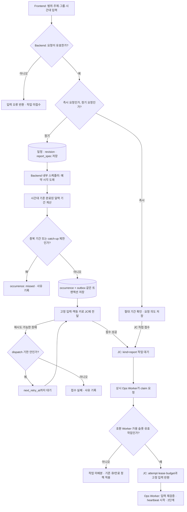
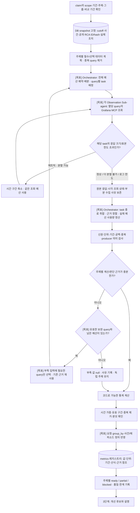
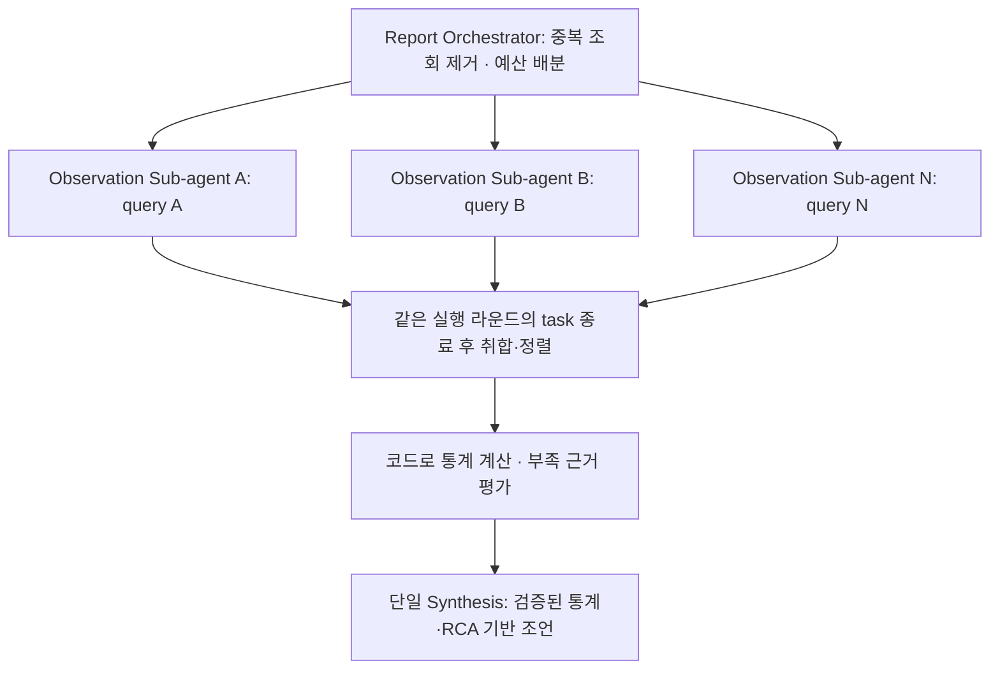
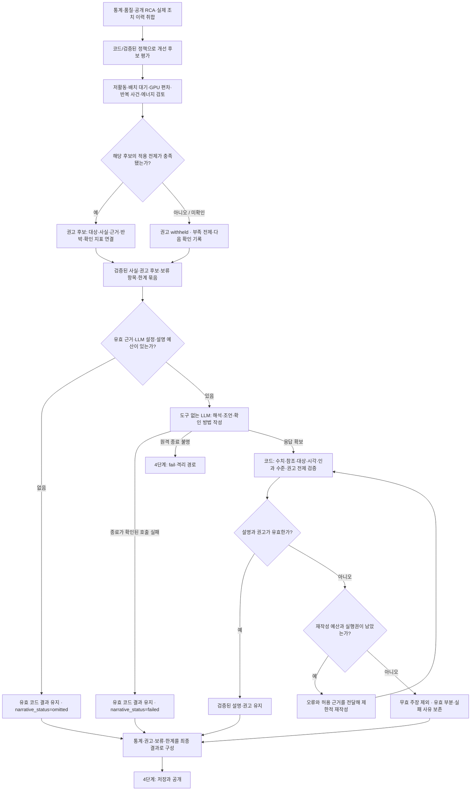
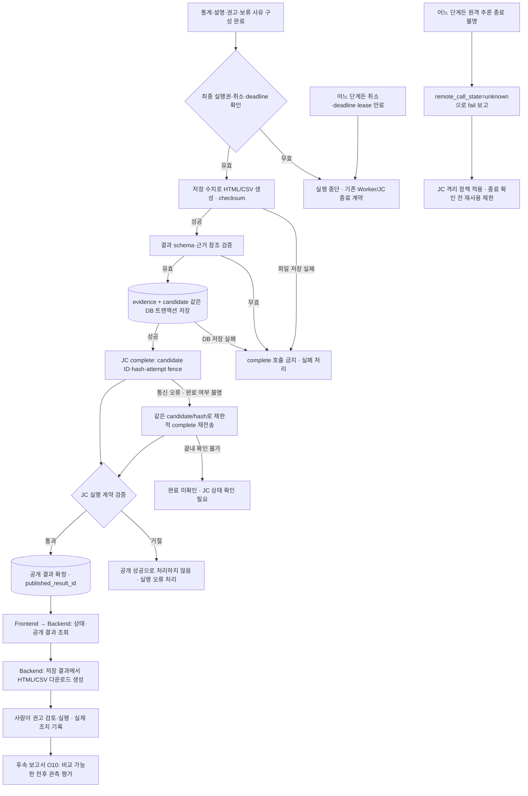

# 보고서 Agent 상세 워크플로우

2026-09-30 · 코드 대조 기준 `185ea2b` · 추가 개발 목표의 상세도. 합의한 내용은 [12번 보고서 설계서](../../specs/ops-agent/12_보고서_Agent_모듈_설계서.md)에 반영했으며 구현 시 12/04/14와 05 T60~T65를 기준으로 사용한다. 제품 구현·실환경 검증 완료를 뜻하지 않는다.

기존 [검토안과 코드 근거](README.md)를 바탕으로, [RCA workflow](../../specs/rca-agent/11_RCA_Agent_모듈_설계서.md)의 수집·충분성 판정·해석·검증 구조를 보고서에 맞게 구체화했다. Orchestrator와 Observation Sub-agent는 같은 Ops Worker 안에서 동작하며 별도 서비스·JC job·큐·스케줄러를 추가하지 않는다.

**현행:** Backend 일정/즉시 요청 → JC → Worker, DB snapshot, 주제별 MCP 조회·계산, 사실 ID 선택, 저장·공개.

**추가 개발 목표:** 그룹·에피소드 집계 보완, 부족 근거에 대한 제한적 보완 조회, 여러 통계를 연결한 개선 조언, 주장·권고의 의미 검증. 아래 도식의 `[목표]`는 이 구분을 나타낸다. 현재 O03의 기본 권고는 업무 목적 미확인으로 withheld이며, 현재 LLM은 제공된 fact_ids 선택만 수행한다.

**2026-09-30 수집 구조 합의:** 장기간·다중 주제 Grafana 조회의 지연에 대비해 RCA와 같은 `Orchestrator → query별 병렬 Observation Sub-agent → 취합` 구조를 개발 목표로 채택한다. 현재 보고서 수집은 순차 실행이며 실제 병목이나 속도 개선은 아직 측정하지 않았다. 구현은 기존 개발 대기 방침을 유지한다.

## 1. Frontend 의뢰 → Backend 일정 → JC 배분

스케줄러는 Agent 프로세스를 실행하는 대신 JC에 작업을 등록한다. Worker가 늦게 가져가도 분석 기간은 바뀌지 않는다. 즉시 요청의 접수 오류는 Backend API의 기존 오류·멱등 재요청 계약을 따르며, 정기 outbox 경로로 조용히 바꾸지 않는다. 장기 장애 시 작업 보존 여부·종료는 기존 dispatch/job 만료 정책에 따른다.

## 2. 근거 고정 → 수집 → 품질 확인 → 통계

DB snapshot과 MCP 원천의 일관성은 다르다. 작성 중 공개된 새 RCA는 기존 snapshot에 섞지 않고, MCP 응답은 실제 조회 시점과 범위를 별도로 보존한다. 보고서에서 새 RCA를 실행하지 않는다. 보완 조회는 원래 범위·주제·기간(명시된 비교 기간 포함)과 허용 query 안에서만 수행한다. 조회 한도·실행시간을 소진하면 불완전성을 기록하고, 유효 lease 안에서 가능한 결과를 구성한다. 취소·deadline 종료는 4단계의 공통 종료 경로가 우선한다.

### 병렬 수집의 작업 단위

- O01~O11별로 Agent를 만들지 않는다. 동일 query·범위·기간은 한 번 조회하고 여러 주제가 결과를 재사용한다. O10 비교 기간은 현재 기간과 다른 조회 작업으로 구분한다.
- 각 Sub-agent는 독립적인 수집 상태와 할당 예산을 가진 코드 task다. 조회마다 LLM을 호출하지 않는다. 위 상세 흐름의 응답 분할·재조회는 해당 task 내부에서만 수행한다.
- RCA의 예산 예약·동시성 제한·형제 실패 격리·취소 회수 방식을 재사용한다. 전체 query/discovery 예산과 deadline을 지키며, task마다 전체 한도를 새로 부여하지 않는다. 공유 구현은 실제 공통 부분만 추출하고 RCA 전용 정책은 복사하지 않는다.
- 한 조회 실패는 해당 근거를 unavailable/partial로 남기고 독립 조회의 유효 결과를 보존한다. 취소 시 모든 task를 회수하고 종료하지 않은 task를 남기지 않는다.
- 동시 실행 한도는 Grafana 부하와 대표 기간의 수집시간을 보고 결정한다. RCA의 기본값 3은 출발점 후보이며 보고서의 확정값은 아니다. 동일 범위·기간에서 순차/병렬의 결과·누락 상태·호출량·소요시간을 비교하고 timeout·취소·부분 실패를 검수한다. 이 비교는 아직 실행하지 않았다.

### 어떤 자료를 어느 통계에 쓰는가

| 묶음 | 주제 | 우선 자료와 계산 경계 |
|---|---|---|
| 현황·자원 사용 | O01 장비/Node, O02 할당, O03 저활동, O04 다중 GPU 편차 | 기간 메트릭과 당시 GPU–Pod/할당 관계. 관측 연결·독점 할당·실제 연산량을 구분 |
| 사건·작업 영향 | O05 반복 사건, O06 사건 당시 작업 | 사건 이력·공개 RCA·당시 매핑·중단 관측. 알림 수≠사건 수, 연결≠중단 원인 |
| 배치·배분 | O07 미배치 요청/용량, O08 Namespace·프로젝트 | 유효 요청·binding·배치 제약·확인된 소유 관계. Pending만으로 GPU 부족 확정 금지 |
| 에너지·변화 | O09 에너지, O10 조치 전후 | 실제 전력 적분·수행된 조치 기록·비교 가능한 전후 구간. 관측 차이≠조치 인과 효과 |
| 수집 품질 | O11 | freshness·공백·기대 대상·주기·귀속. 분모 불명 시 전체 커버리지 null |

산식과 지원 그룹은 [공통 판단 명세](../../specs/common/04_Agent_동작_판단_명세서.md), 미구현 항목은 [Ops OP-01~04](../../specs/ops-agent/12_보고서_Agent_모듈_설계서.md)를 따른다. 새 산식 기준과 기존 결과를 조용히 혼합하지 않는다.

## 3. 통계 → 개선 후보 → 근거 기반 조언 → 검증

이 절은 현행 통계/사실 선택을 확장하는 **목표 흐름**이다. 기존 결과 필드와 Worker를 활용하며, 아래 설명을 새로운 공개 필드나 상태 enum의 확정으로 해석하지 않는다.

설명 형식 오류는 MCP 재조회 사유가 아니다. 추가 근거가 필요한 경우에만 2단계의 코드가 승인한 보완 계획으로 돌아간다. LLM에 SQL/PromQL/쉘·저장·공개 도구를 주지 않는다. 재작성 횟수는 기존 예산 내에서 제한하며 운영값은 별도 합의한다. 병렬 수집 구조는 RCA와 맞추되, RCA의 재조사 횟수·예산 분할 비율·Runbook 정책을 보고서에 그대로 적용하지 않는다.

| 개선 후보 | 권고에 필요한 전제 | 조언의 도착점 |
|---|---|---|
| 낮은 활동의 장시간 할당 | 동일 할당 episode·활동 관측·업무 예외 | 예약/대기 목적 확인 후 요청량·사용 시간 조정 검토 |
| 대기 작업과 유휴 자원의 공존 | 유효 미배치 요청·노드별 용량·배치 제약 | 요청 크기·배치 조건·배분 정책 검토 |
| 다중 GPU 활동 편차 | 같은 작업·동시 유효 구간·프로파일 근거 | 입력 공급·분할·통신 추가 점검 |
| 반복 사건과 정비 대상 | 같은 사건 정의·관측 분모·공개 RCA 수준 | 비교 가능한 범위의 점검 우선순위와 RCA 권고 인용 |
| 높은 에너지 또는 전후 변화 | 실제 전력·동일 대상·수행 조치·업무량 | 운영 패턴 검토와 변경 후 재측정 계획 |

권고는 `대상 → 관측 사실 → 해석 → 전제/반박 → 다음 행동 → 확인 지표`로 읽히게 한다. 새 절감률·비용·종합 점수를 만들어 넣지 않는다. 예를 들어 저활동 관측은 즉시 GPU 회수 명령으로 연결하지 않고, 업무 목적과 예외를 확인한 뒤 사람이 조정을 검토하게 한다.

## 4. 최종 검사 → 저장 → JC 공개 / 공통 중단

JC는 실행 계약과 결과 봉투를 검증하고 공개를 확정한다. 통계·주장의 업무적 타당성 검증은 Agent 책임이다. `succeeded`는 모든 주제의 데이터가 완전하다는 뜻이 아니므로 `result_status`, 주제별 `partial/blocked`, `narrative_status`, 권고의 `eligibility`를 별도로 표시한다. complete 응답을 못 받았다는 이유로 이미 공개됐을 수 있는 결과를 새 candidate로 다시 계산하지 않는다.

## 검토 범위

관련 설계 문서와 Mermaid 원본을 갱신했다. 연결·분기·상태 의미는 현재 코드와 기존 명세에 정적으로 대조했다. 렌더링 확인과 제품 실행·DB/E2E·운영 LLM/Grafana 품질 검수는 실행하지 않았다. 문서 링크 검사는 완료 시 실행 결과를 따른다.
