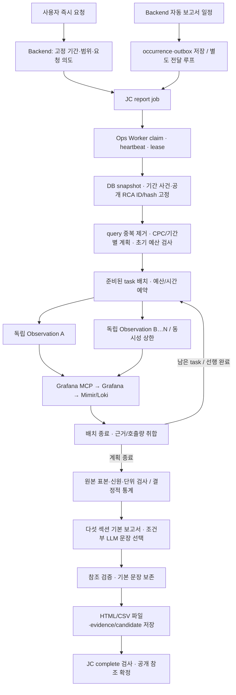

# 보고서 Agent 현재 실행 흐름

[12번 설계서](../../specs/ops-agent/12_보고서_Agent_모듈_설계서.md) · [Archify](../archify/gpu-ops-advisor.html#sequence-report-collection)

JC→Worker는 claim 응답이며 JC가 Worker 실행 API를 호출하는 구조가 아니다. 저장과 공개는 별도이며 취소·lease·deadline 검사는 모든 경로에 적용한다. MCP 수집 실패를 DB 조회로 대체하지 않는다.

## 계획과 의존성

- 작업 단위는 query+CPC+절대 기간이다. O10 비교 기간은 분리하며 시간 chunk 안에서 중첩 병렬화하지 않는다.
- 같은 CPC·기간·Prometheus metric은 선행 완료 응답 재사용을 위해 순서를 둔다. 실제 요청 키가 일치하는 완전한 응답만 재사용한다.
- O08 단독 namespace D06은 D01/D08 완료 후 검증된 Pod namespace로 범위를 좁힌다. 불완전·후보 없음이면 기존 범위를 조회한다.
- 전체 초기 호출량을 예약하고 준비된 task를 상한까지 배치 실행한다. 배치 종료 후 미사용 예산을 재배분한다. 동시성 기본 예시는 3, 1이면 순차다.
- 독립 task 실패는 해당 evidence에 남긴다. 취소는 모든 실행 task를 회수하고 상위 Worker로 전파한다. 저장된 quality.collection에서 의존성·예약/실사용량·시작 offset·소요시간·미완료 구간을 확인한다.

## 현재 구현과 남은 목표

현재 모델은 검증된 사실과 코드가 만든 보고서 문장의 참조·순서를 선택한다. 수치·단위·권고 전제를 생성하지 않는다. 확정 실패에는 기본 보고서를 보존하고 원격 종료 불명에는 기존 fail/격리 계약을 적용한다.

판단 부족에 따른 추가 관측 라운드, 개선 후보·전제·반박을 해석하는 자유 생성형 Synthesis와 의미 검증은 후속 목표다. RCA의 최대 1회 재조사가 보고서에도 구현됐다는 뜻은 아니다. 추가 조건·상한은 12/04/14, 검수 기대값은 [05 T60~T65](../../specs/05_테스트_검수_기준서.md)를 따른다.

[Agent QA](../../../agents/QA.md)의 고정 지연 비교는 병렬 실행과 결과 보존을 검증한다. 실제 운영 자료의 일간·주간·월간 완료 시간·Grafana 부하·모델 품질을 보장하지 않는다.
