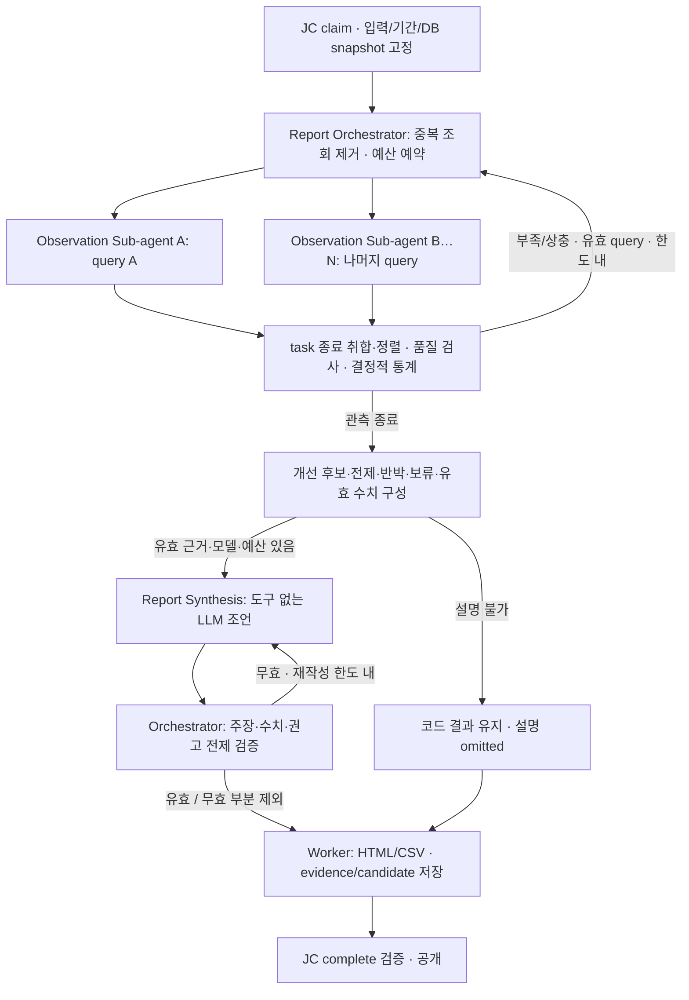

# 12. 보고서 Agent 모듈 설계서

## 기간 수집·예산 분리 — 2026-10-01

Ops 전용 `report.limits`를 추가했다. 배포 예시는 `max_queries=2048`, `chunk_seconds=86400`, `max_rows=50000`이며 공통/RCA `limits`의 48회·1시간·5000표본은 그대로다. Ops만 원본 프로필의 복사본에 세 키를 적용하고 양수 정수 외 값·알 수 없는 키는 거절한다. `report`가 없는 사용자 설정은 기존 limits로 동작하므로 자동으로 한도가 늘지 않는다. 응답 바이트(2MiB)·전체 deadline(900초)·허용 기간(31일)·도구 timeout·동시성은 늘리지 않는다. 초기 조회량은 기간/구간 길이 × query × CPC로 계산하며 비교 기간은 별도 task다. 재사용 전 추정이므로 실제 호출 수와 같지 않고, 데이터 밀도·분할 횟수나 성공을 예측하는 값도 아니다.

[Ops collection](../../../ops-agent/src/ops_agent/collection.py)은 실제 관측 조회 전에 전체 계획의 설정/기간/초기 호출량을 검사한다. 초과하면 Grafana 조회 없이 사유와 미수집 구간을 남긴다. task는 query+CPC 단위로 순차 실행하고 남은 task의 초기 호출량을 예약한 뒤 여유 예산·남은 시간을 배분한다. 한 task의 재분할이 다른 task의 호출 예산을 전부 소비하지 못한다. 이미 소진한 호출은 반환하지 않으며 순차 완료 후 미사용 예산만 다음 task에 배분한다. 후속 재조사·병렬화는 이번 범위가 아니다.

하루를 최대 시작 구간으로 사용하고 기간이 짧으면 그 전체를 조회한다. 큰 응답은 변경하지 않은 공통 Observation의 기존 크기 기반 축소로 다시 조회한다. 원본 시각·표본을 그대로 보존하며 시간 평균/다운샘플링으로 대체하지 않는다. 같은 CPC의 완전한 동일 응답 재사용과 O08의 검증된 Namespace에 대한 D06 범위 축소를 유지한다. query/CPC 실패·시간 소진은 해당 범위에 기록하고 취소는 상위 실행 계약으로 전파한다.

`quality.collection`에 계획 상태/사유·적용 limits·예상/실제 호출량과 task별 요청 기간, 응답 완료/데이터 응답/빈 응답/미완료 시간 및 근거별 구간을 저장한다. 응답 완료는 원본 표본의 연속성·GPU 커버리지·계산 가능성을 뜻하지 않는다. 완전한 빈 응답과 미조회·오류·불완전 응답은 구분한다. 구 결과는 진단을 추정해 채우지 않는다. UI는 요청 직전 정확한 기간(정기는 완료된 달력 기간)을 보여주고 Worker의 수집 전 검사를 안내하며 결과에서 대상별 구간을 펼쳐 확인한다. 접수 전에 Worker의 실효 설정을 제공하는 별도 Backend API는 추가하지 않았으므로 이 화면은 서버 예산 통과 판정이 아니다. 저장 narrative에도 수집 중단/미완료를 넣어 기존 HTML 다운로드에 전달한다. CSV 수치 계약은 유지한다.

명세 영향: OP-05의 계획/예산 배분 일부를 순차 방식으로 구현한 것이며 전체 병렬 Observation/Synthesis 완료가 아니다. 기존 §0.3의 “한도를 늘리지 않는다”는 당시 UI 변경 범위였고 이번 변경은 Ops 전용 한도 추가로 명시적으로 보완한다. 산식·criteria·입력/결과 schema 버전·JC claim/lease/공개 경로는 유지한다. RCA 소스와 공통 Python은 변경하지 않는다. 숫자는 초기 배포 예시이며 운영 성능 보장값이 아니다. 실제 일간·주간·월간 데이터의 응답량·수집시간·메모리·미완료 여부를 배포 후 측정해 조정해야 한다.

## 최종 보고서 — 2026-09-30

최신 main의 Namespace 집계·GPU 시간 설명·수집 재사용/범위 축소는 유지한다. 모든 정상 종료 경로에서 계산이 끝난 뒤 [report.py](../../../ops-agent/src/ops_agent/report.py)가 분석 범위와 결과·확인된 운영 현황·권고와 실행 조건·추가 확인·분석 한계를 구성한다. 모델이 구성돼 있으면 기존 reference-only `explain`을 한 번 사용해 문장 우선순위를 정한다. 선택되지 않은 문장도 보존하며 모델은 수치·조건·권고를 생성하거나 계산 품질을 승격하지 않는다.

수치가 전혀 없거나 모델 미설정·확정 오류·무효 응답이어도 결정적 기본 보고서를 남긴다. `quality.report.status=complete`는 보고서 구성 완료이며 topic/result_status의 partial/blocked와 별개다. `narrative_status`와 `quality.narrative_reason`은 모델 편집 상태다. 실제 HTTP 호출은 token/deadline과 전송 재시도에 따르며 원격 종료 불명·취소·lease 상실은 기존 fail/격리 계약을 유지한다.

기존 `narrative` 배열에 다섯 title/text/ref 섹션을 저장하고 화면·Worker HTML·Backend HTML에 표시한다. CSV 수치·단위, 공개 RCA 참조, 기존 snapshot/hash와 DB schema는 유지한다. 구 결과는 재작성하지 않고 기존 narrative 표시를 유지한다. 병렬 Observation·자유 생성형 Synthesis 등 OP-05/06 전체 구현 완료는 아니다. 실제 모델/Grafana 품질과 운영 배포는 별도 검수다.

버전 1.3 · 모듈 report · 독립 실행·배포 · O01~O11 · NVIDIA NeMo Agent Toolkit(NAT) 적용 설계

2026-09-30 개발 목표 갱신: **Report Orchestrator → query별 병렬 Observation Sub-agent → 결정적 통계 → 도구 없는 Report Synthesis → 검증·저장·JC 공개**를 채택한다. [상세 Mermaid 흐름도](../../architecture/report-agent-workflow/detailed-workflow.md)의 합의를 이 문서에 반영했다. 코드 `185ea2b`의 보고서 실행은 여전히 순차 수집·계산·fact_ids 선택이며, 아래 병렬 수집·종합 조언은 미구현 목표다. 접수 계약 1.3·결과 스키마 1.1은 유지하고 기존 집계 변경 목표 criteria 1.2와 구분한다. 이번 변경은 문서이며 제품 구현은 대기 중이다.

## 0. 현재 구현 분석과 업그레이드 작업

2026-09-23 · 코드 대조 기준 `d391f3d`. O01~O11 분기가 존재한다는 사실과 각 업무의 산식·그룹·실환경 입력이 충족됐다는 판단을 구분한다. 아래는 코드 정적 대조이며 운영 데이터로 재현한 결과가 아니다.

| 작업 | 현재 구현·코드 근거 | 문제·영향 | 업그레이드 목표·완료 조건 |
|---|---|---|---|
| OP-01 요청 그룹 반영 | [공통 입력 검증](../../../shared/python/src/agent_common/contracts.py)은 `group_by`를 받지만 [calculate/run](../../../ops-agent/src/ops_agent/workflow.py)은 이 값을 읽지 않고 주제별 고정 대상/그룹으로 계산한다 | 요청에서 선택한 그룹이 실제 집계 기준으로 적용된다고 보장할 수 없다 | 04 §5.5의 주제별 지원 그룹·신원·산식을 기존 계산에 연결한다. 미지원 조합은 요청 그룹을 수행한 것처럼 표시하지 않고 사유를 반환한다. 동일 표본의 cluster/namespace 등 지원 그룹별 기대값·합계·단위를 검사한다 |
| OP-02 사건·재발 집계 | O05는 incident ID로 중복을 제거하고 조회된 전체 사건 시각의 평균 간격을 산출한다. `incident_rate`는 항상 분모 부족 사유의 null이다 | 서로 다른 장비·component 사건의 간격이 같은 고장의 재발 간격으로 읽힐 수 있다. 분모가 있는 04의 발생률 예도 현재 분기에서는 계산되지 않는다 | 13의 사건/에피소드·`prior_incident_id`와 04 §5.5의 그룹·기간·분모 규칙을 구현한다. 알림 수·사건 수·RCA 수를 분리하고, 검증된 분모가 있을 때만 발생률을 계산한다. 그룹 간 교차 재발을 만들지 않고 legacy 사건의 그룹 미확정은 사유를 남긴다 |
| OP-03 사건 당시 작업 연결 | O06은 `target.gpu_uuid`와 당시 매핑을 결합하며 `impact_status=not_assessed`와 작업 중단 증거 부족을 남긴다 | 신규 사건은 machine/component 범위이고 GPU UUID가 없을 수 있다. UUID 직접 비교만으로는 연결 대상을 찾지 못한다. 연결 자체도 업무 중단의 증명이 아니다 | 확인된 사건 범위에서 당시 장비/GPU/Pod 신원을 근거로 연결한다. 불명 신원을 이름·문구로 생성하지 않으며 근거가 없으면 partial/blocked를 유지한다. 단일 GPU·복수 GPU·UUID 없음·현재 매핑만 있는 경우를 분리 검사한다 |
| OP-04 구·신규 사건/RCA 소비 | [Store.read_context()](../../../shared/python/src/agent_common/store.py)는 repeatable-read 안에서 기간 사건과 공개 RCA ID/hash를 고정한다 | 에피소드 변경 후에도 SQL 조회 성공만으로 건수·재발·목적의 의미가 같다고 볼 수 없다. 분석 생략 사건은 RCA 결과가 없을 수 있다 | 1.3/1.4 혼합 사건, 이전 미조치로 RCA 생략된 사건, 작성 중 새 결과 공개를 검사한다. 생략/미완료를 원인 없음으로 바꾸지 않고 공개된 결과만 인용한다. 독립 관측 주제와 기존 HTML/CSV 수치를 보존한다 |

OP-02/03/04는 Incident·RCA·Backend/Frontend의 계약 소비 변경과 함께 진행한다. OP-01/02는 [04 §5.5](../common/04_Agent_동작_판단_명세서.md#55-보고서-그룹과-사건-통계--추가-개발-목표-12)의 그룹 지원 표·기간 포함·재발/발생률 계약으로 개발한다. 새 보고서 산식은 versions.criteria=1.2로 구분하고 접수 계약 1.3·결과 스키마 1.1은 유지한다. 현재 관측 부족을 LLM 설명으로 메우거나 보고서에서 새 RCA를 실행하지 않는다.

검수 연결: [05](../05_테스트_검수_기준서.md)의 T21/T22/T25/T27/T36/T37/T48/T57/T58. [관측·할당 회귀](../../../agents/tests/test_report_observation.py)와 [Worker E2E](../../../agents/tests/test_e2e.py)를 출발점으로 위 계산/혼합 사례를 추가하고, 공통 Observation 변경 시 두 Worker를 검사한다. **이번 상태: 정적 대조 완료, 신규 산식·에피소드 소비·실환경 검수 미실행.**

### 0.1 재개발 추가 항목 — 2026-09-30

| 작업 | 현재 구현과 차이 | 개발 목표·완료 조건 |
|---|---|---|
| OP-05 수집 오케스트레이션 | run은 중복 query ID를 합쳐 하나의 Observation으로 순차 조회한다 | RCA의 task별 예산 예약·동시성 제한·실패 격리·취소 회수 방식을 재사용한다. 주제별 Agent를 만들지 않고 조회 단위로 배분하며, 비교 기간을 구분한다. 고정 응답에서 순차/병렬의 수치·품질 의미 일치, 예산·동시성 상한, 취소 후 생존 task 없음 검증 |
| OP-06 종합 조언·의미 검증 | LLM은 fact_ids 선택만 수행한다. O03은 작업 목적 확인 권고를 withheld로 제공한다 | 검증된 통계·공개 RCA·반박/한계를 단일 Synthesis에 전달한다. 수치·대상·기간·원인 수준·권고 전제를 코드로 검사하고 무효 주장만 제외한다. 도구 없는 설명·제한적 재작성·실패 시 유효 결과 보존 검증 |
| OP-07 결과 소비·출력 | 화면/다운로드는 수치·수집 품질 표시 중심이다 | 기존 topics/facts/findings/recommendations와 value_refs로 개선 권고·보류·전제·확인 방법을 제공한다. Backend/Frontend가 eligibility·실행 사실·설명 실패를 구분하고 구 결과·HTML/CSV 수치를 보존하는지 검증 |

OP-05~07은 [05](../05_테스트_검수_기준서.md)의 T60~T65와 연결한다. OP-01~04의 데이터·산식 보완도 계속 필요하며, 병렬화나 LLM 설명이 이를 대신하지 않는다. 운영 데이터 의미·실제 수집 지연과 속도 개선은 미검증이다.

### 0.2 Namespace 관측 초안 — 2026-09-30

사용자 검토용 초안 구현이다. OP-01 중 O08의 namespace 및 cluster+namespace 조합만 `versions.criteria=1.2` 입력에서 지원한다. 이때 조회는 D01/D02/D06/D08이며 나머지 주제·기존 criteria 경로는 유지한다. 전체 OP-01 또는 OP-05~07 완료가 아니다. 공유 설정·RCA·Backend/Frontend는 변경하지 않는다.

- 연결 관측 시간은 기존 `observed_namespace_hours`를 재사용한다. `namespace_activity_valid_hours`는 평균에 채택한 연결∩활동 시간, `namespace_connected_gpu_util`은 그 시간 가중 활동률이다. 신원·단위·0~100 범위·동시 충돌·공유/MIG·모델 비교 가능성을 확인한다. 두 namespace의 순차 사용은 보존하고 동시 공유는 활동 귀속을 보류한다.
- 대상은 항상 cluster_id+namespace이며 이름 없는 신원을 정상 그룹에 합치지 않는다. 요청한 namespace의 유효 연결 자체가 없으면 시간·평균은 null이다. 연결은 있지만 사용할 활동 표본이 없으면 유효 활동시간은 0, 평균은 null이다. 유효 0%는 수치 0으로 보존한다.
- 명세상 미지원 축은 unsupported_group_by, 지원 표에 있지만 아직 구현하지 않은 조합은 group_by_not_implemented로 blocked다. 다른 주제는 계속한다. 전체 기대 대상 분모·독점 할당·namespace 실사용률·회수 가능성을 추정하지 않는다. 결과는 관측 범위의 partial 또는 blocked이며 권고를 생성하지 않는다.
- 기준 버전은 JC claim에서만 읽고 Worker가 바꾸지 않는다. 기본 JC/Helm 전역 설정은 유지한다. 정식 활성화 전 보고서 전용 1.2 프로필 적용, 한글 지표/사유와 관측 한계의 화면·다운로드 표시, 실제 Grafana 자료 검수를 별도 완료해야 한다.

고정 사례는 [namespace 검사](../../../agents/tests/test_namespace_usage.py), 별도 테스트용 1.2 JC에서 저장·공개까지의 경로는 [Worker E2E](../../../agents/tests/test_e2e.py)의 namespace 사례로 검수한다. 실제 실행 결과는 [Agent QA](../../../agents/QA.md)에 기록한다.

### 0.3 Namespace 보고서 실행·표시 개선 — 2026-09-30

실제 보고서 화면 검토에서 요청이 cluster·criteria unconfigured로 실행되어 namespace 활동률이 없고, budget_exhausted가 미연결로 보이며 원시 지표·사유·UUID가 노출되는 문제를 확인했다. 다음 순서로 보완한다. 전체 OP-01/05/06 구현 완료를 뜻하지 않는다.

1. **접수 연결:** Frontend의 `Namespace GPU 현황`은 O08·namespace를 선택하는 편집 가능한 프리셋이다. Backend의 공통 envelope 생성부가 즉시·정기 요청 중 O08 + namespace 또는 cluster+namespace에만 `report-namespace-v1`을 선택한다. JC는 report 전용 프로필의 criteria 1.2를 새 job에 고정한다. RCA와 다른 요청은 local-v1/global criteria를 유지하며 기존 job·재시도·멱등 재전송을 재해석하지 않는다.
2. **관측·설명 진단:** 새 O08 경로의 D01/D02/D06/D08을 먼저 조회하며 조회/시간 한도는 늘리지 않는다. result.quality에 요청 그룹, collection(query_calls/query_limit/discovery_calls), narrative_reason을 보존한다. 수집 중단은 원본 budget_exhausted로 구분하며 서버 장애로 표시하지 않는다. 원인별 한도 튜닝·병렬화는 별도 측정 후 진행한다.
3. **결과 소비:** namespace 연결시간·평균의 유효시간·활동률·제외 사유를 먼저 표시하고 상세 주제는 접는다. 구 결과에 활동률이 없으면 미계산, null은 산출 불가, 실제 0%는 0%다. 요청/적용 그룹을 구분하며 모든 주제에 그룹이 적용됐다고 주장하지 않는다. 권고는 검토 가능/판단 보류와 미수행 사실을 표시하고 근거 ID는 펼쳐 본다. 메모리는 읽기 쉬운 단위로 표시하되 CSV 원시 수치·단위는 유지한다.
4. **검수:** 프리셋 입력, Backend→JC→Worker→공개 결과/다운로드, 정기 occurrence의 프로필 고정, 기존 RCA 기준 유지, 0/누락/공유/수집 중단·AI 실패·구 결과의 표시, 모바일 넘침을 확인한다. 실행 결과는 [Agent QA](../../../agents/QA.md)의 해당 날짜 기록을 따른다.

기존 fact 선택 LLM 입력에서 반복되는 evidence UUID만 생략하고 공개 facts/evidence 참조는 그대로 유지한다. LLM의 calls는 성공 응답 수이고 request_attempts는 실제 HTTP 요청 시도 수다. 0 calls만으로 미호출을 단정하지 않는다. 안전한 실패 코드만 기록하며 원문 오류·인증 정보는 결과에 넣지 않는다. RemoteUncertain의 격리·종료 계약은 유지한다.

운영 적용은 새 Ops Worker → 새 JC/프로필 → Backend/Frontend 순서가 필요하다. 사용자 정의 전체 JC 설정은 새 프로필을 명시적으로 포함해야 한다. 기존 결과를 바꾸지 않으며 새 보고서로 검수한다. 실제 Grafana 의미 검수·운영 배포는 별도이며 이 변경 자체는 배포하지 않는다.

### 0.4 단위·부분 산출 설명과 제한된 수집 개선 — 2026-09-30

- 새 O08 namespace 결과에 기간 중 연결이 확인된 물리 GPU 고유 대수(`namespace_connected_gpu_count`)를 추가한다. 누적 GPU-hours와 경과 시간을 구분하고 기존 시간 가중 평균·관측 공백 제외 산식은 유지한다. 과거 저장 결과에서 대수를 역산하지 않는다.
- Frontend는 주제별 ready/partial/blocked 건수와 부족 근거를 먼저 표시한다. namespace 요청/적용이 없는 보고서의 전용 요약표는 숨기고 기존 상세 수치는 보존한다. HTML도 해석 제한과 GPU·시간 설명을 제공하며 CSV 원시 값은 보존한다.
- Ops의 동일 attempt 내 완전한 Prometheus 응답만 실제 요청 키로 재사용한다. query별 근거·의미와 재사용 출처를 유지하며 RCA는 opt-in하지 않는다. O08 단독의 namespace 경로만 D01/D08의 완전한 Pod 관계에서 D06 namespace를 좁힌다. 불완전·후보 없음·복수 주제는 기존 범위를 유지한다. 상한 증액·병렬 OP-05 구현이 아니다.
- 고정 검수: 8대×(1시간−6.113초), 유효 0%·공유·중복·공백, 구 결과, scope/기간별 재사용 격리, 경고 응답 미재사용, 큰 Pod 집합의 기존/개선 수치·품질 일치와 호출 감소. 실제 상위 시스템 성능은 배포 후 검수 대상이다. 실행 기록은 [Agent QA](../../../agents/QA.md), [Frontend QA](../../../frontend/QA.md)를 따른다.

## 1. 역할·경계

Backend의 즉시·정기 요청을 Job Controller에서 배분받아 집계·설명·보고서를 생성한다. 별도 접수 API·일정 루프·Chatbot·RCA 호출은 없다. 일정 계산은 Backend 책임이며 Worker는 접수된 절대 기간을 사용한다.

## 2. 입력·실행·저장

scope, time_range, timezone, topic_ids, group_by와 선택 comparison_range/action_record_ids/resource_selectors/parent_job_id를 받는다. 정기 입력에는 occurrence_id·schedule_revision과 고정 기간이 포함된다. 02의 입력 계약을 재검증한다.

목표 실행은 JC claim → DB 근거 고정 → Orchestrator 수집 계획·예산 배분 → query별 병렬 MCP 관측 → 취합·품질 검사·결정적 계산 → 부족 근거의 제한적 보완 → 개선 후보·Synthesis → 코드 검증 → HTML/CSV·evidence/candidate 저장 → JC complete 순서다. 주제에 필요한 출처만 조회하며 R/O 공통 산식을 복사해 별도 구현하지 않는다. 현재 순차 수집 구현과의 차이는 §0.1을 따른다.

자기 job/attempt의 결과 candidate·근거·파일만 쓴다. jobs·일정·사건은 직접 변경하지 않는다. 한 주제의 입력 부족 때문에 독립적인 주제를 소거하지 않는다. 재시도·마감·동시성은 10/14를 따른다.

### 2.1 모듈 내부 구성

Worker 프로세스 안의 NAT 워크플로에 Report Orchestrator를 두고 독립 조회를 Observation Sub-agent에 배분한다. Sub-agent는 같은 job/attempt/lease를 사용하는 코드 task이며 별도 프로세스·JC Worker 등록·LLM 호출을 만들지 않는다. O01~O11은 계산 함수로 유지하며 여러 주제가 같은 수집 결과를 재사용한다. LLM은 관측 라운드 종료 후 단일 Report Synthesis 단계에서 해석·조언을 작성한다. 이는 추가 개발 목표이며 현행 run은 순차 조회다.

| 내부 구성 | 책임 | 사용하는 자료/연결 |
|---|---|---|
| Worker 실행부 | claim·heartbeat·취소·deadline·저장·완료 보고 | JC API, 자기 후보·근거·파일 |
| Report Orchestrator | 절대 기간·주제·조회 계획, 예산 배분, 충분성·보완 조회·종료, 결과 검증 | 입력 snapshot, 주제별 조회 정의, 공통 실행 계약 |
| 사고·분석 이력 조회 | 해당 범위 사건과 공개된 RCA 결과 읽기 | incidents, jobs.published_result_id → result_candidates |
| Observation Sub-agent | 독립 상태·할당 예산으로 query별 기간 관측, 응답 분할·조회 오류 기록 | NAT MCP 클라이언트 → Grafana MCP → Grafana 데이터소스 |
| 집계·계산 | 시간·대상 연결, 누락·중복 검사, 주제별 수치 계산 | 04 공통 계산 함수 |
| Report Synthesis | 검증된 통계·공개 RCA·후보를 해석해 조언 작성, 도구 없음 | LLM, 수치 레지스트리·후보·전제·반박·한계 |
| 검증·출력 | 설명/권고 의미 검증, 저장 수치로 HTML/CSV 생성 | Orchestrator·Worker 코드, 기존 결과 계약 |

### 2.2 자료 선택과 기간 기준

| 보고서 내용 | 우선 참조 자료 | 자료가 없을 때 |
|---|---|---|
| 사고·원인·반복 장애 | Incident 이력 + 공개 RCA 결과 + 필요한 로그·지표 | 사건은 있으나 RCA 미완료이면 미완료로 표시. 원인 추정으로 대체하지 않음 |
| 사용량·할당·저활동·에너지 | Grafana MCP의 기간 지표 + 매핑 이력·품질 | 해당 주제를 partial/blocked로 표시. RCA가 없다는 이유로 중단하지 않음 |
| 사고 당시 작업 영향 | 당시 매핑·작업 근거 + 사건·RCA 결과 | 현재 매핑을 과거로 소급하지 않음 |
| 조치 전후 변화 | 실제 조치 기록 + 전후 지표·로그 + 관련 RCA | 권고만 있으면 조치 실행으로 집계하지 않음 |

RCA 결과 DB는 이번 보고서를 위해 새 RCA를 실행하는 경로가 아니다. 보고서는 원인 판정의 출처와 수준을 유지해 인용하고, 관측 데이터로 기간 통계와 변화 설명을 보완한다. Runbook 직접 검색은 기본 보고서 흐름에 포함하지 않으며 보고서의 판단 기준·운영 정책은 기존 발행 revision을 사용한다.

실행 예정 시각과 분석 대상 기간을 구분한다. Backend가 계산한 절대 time_range를 그대로 사용하며 Worker 기동 시각으로 기간을 다시 계산하지 않는다. 수집 시작 시 data_cutoff_at과 읽은 사건 snapshot·공개 RCA result ID/hash 목록을 고정해 evidence에 저장한다. 작성 중 새 RCA가 발행돼도 같은 보고서에 섞지 않는다. 원본 관측 저장소의 시간별 조회는 DB snapshot 보장을 뜻하지 않으므로 실제 응답 snapshot·관측/수집 시각도 보존한다.

재시도 시 확보된 불변 입력·증거는 검증 후 참조할 수 있지만 이전 attempt의 candidate를 새 final로 재활용하지 않는다. 새 자료가 필요하면 다시 확보한 시점·범위를 기록한다. 원본 소실·조회 제한으로 완전성을 확인할 수 없으면 해당 통계만 보류한다.

### 2.3 현재 구현의 조회 분할

주제별 query ID를 합쳐 중복 조회를 줄인 뒤 하나의 Observation 인스턴스로 수집한다. O02는 D08/D01/D06/D10, O08은 D08/D01/D06/D12를 조회한다. Prometheus 호환 지표는 원본 표본을 보존하는 instant range-vector로 기간을 나눠 가져온다.

응답이 바이트 또는 표본 수 한도를 넘으면 같은 시작 시각에서 시간 구간을 줄여 다시 조회한다. 최소 구간은 1초이며 재조회도 기존 호출 횟수·deadline을 소모한다. 1초 구간에서도 한도를 넘거나 원본 경고가 있으면 partial로 남긴다. Loki는 이 시간 구간 축소 처리의 대상이 아니며 행 한도 도달 시 partial이다. 원본 경고·부분 응답은 정상 계산 표본으로 사용하지 않는다.

호출 한도 또는 실행시간을 소진하면 `budget_exhausted` 근거를 남기며 이미 확보한 유효 구간은 보존한다. 기본값은 [06](../06_배포_운영_인계서.md)의 설정 원본을 따른다. 수집 품질 필드는 [03 §5.1](../common/03_데이터_설계서.md), 구현은 [관측 조회](../../../shared/python/src/agent_common/observation.py)에 있다.

### 2.4 병렬 관측과 보완 조회 — 개발 목표

1. Orchestrator가 query ID/revision·scope/대상·절대 기간·binding이 같은 요청을 합친다. O10의 비교 기간은 별도 작업이며 현재 기간의 관측으로 대체하지 않는다. 최초 task 경계는 query별로 두고 클러스터/시간 chunk까지 중첩 병렬화하지 않는다.
2. 시작 전에 전체 query/discovery 예산 안에서 task 예산을 예약한다. 각 task는 독립 Observation 상태를 사용하며 프로필·고정 입력을 임의 변경하지 않는다. 전체 deadline·동시성 한도를 공유하고, 응답 분할·MCP 재연결·실제 재전송도 호출량에 포함한다.
3. 조회 실패는 해당 근거의 unavailable/partial·사유로 보존한다. 독립 조회는 계속하되 취소·lease 상실·deadline은 전체 task의 신규 호출 중단과 회수를 요구한다. 모든 task 종료 전 미사용 예약을 다시 배분하지 않으며 이미 사용한 호출은 돌려주지 않는다.
4. 완료 순서와 무관하게 query·대상·기간 기준으로 근거를 정렬·취합하고 기존 신원/단위/품질 검사와 산식을 적용한다. RCA task 추적 방식과 기존 evidence를 재사용하며 새 원장·결과 스키마를 만들지 않는다. 실행별 UUID/수집 시각까지 같아야 한다는 뜻은 아니다.
5. 부족하거나 상충하는 판단에 필요한 등록 query가 있고 원래 범위·기간과 남은 예산 안에서 새 근거를 얻을 수 있을 때만 보완 라운드를 연다. 같은 조회를 무조건 반복하지 않으며 횟수 상한을 실행 프로필에 고정한다. 상한·호출 예산·deadline 중 먼저 도달한 제한을 따른다. 설명 형식 오류는 재수집 사유가 아니다.

RCA의 [병렬 관측 구현](../../../rcca-agent/src/rcca_agent/observation_agents.py)에서 실제 공통인 실행·예산·취소 코드만 공유 Python으로 추출해 재사용하는 것을 우선한다. RCA의 첫 라운드 예산 분할 비율·최대 1회 재조사·Runbook 정책을 보고서에 그대로 복사하지 않는다. 공통 코드를 바꾸면 양 Worker 회귀 검수가 필요하다. 보고서 동시성·라운드 상한·라운드별 예산 배분은 구현 시 명시하고 고정 입력 검수 후 확정한다. RCA 동시성 기본값 3은 후보이며 보고서 운영 확정값이 아니다. 대표 기간의 실제 수집시간·호출량·Grafana 부하를 측정하기 전에는 속도 개선을 주장하지 않는다.

### 2.5 통합 목표 workflow

도식은 정상 실행권 아래의 업무 흐름이다. 확정된 LLM 실패는 설명 failed와 유효 코드 결과로 종료할 수 있지만, 원격 종료 불명은 14의 fail·격리 경로가 우선한다. 최종 결과 검증·파일/DB 저장 실패, 취소·lease 만료·deadline 이후는 complete 성공으로 처리하지 않는다. 상세 분기·Backend 예약 경로는 [Mermaid 상세도](../../architecture/report-agent-workflow/detailed-workflow.md)를 참고한다.

## 3. 보고서 업무

입력은 scope·기간·시간대·주제·그룹·선택 비교 기간이다. 요청을 접수할 때 실제 절대 기간과 적용 범위를 화면에 표시한다. 정기 보고서는 완료된 달력 기간을 사용한다.

주제별 조회 → 같은 시각의 신원 연결 → 단위·공백·중복 검증 → 결정적 계산 → 규칙 적용 → 사실·검토 대상·다음 행동을 만든다. 보고서는 RCA의 Incident·결과를 참조하며 별도 사건 원장을 만들지 않는다.

| ID | 주제·필수 데이터 | 결과·판단 | 부족 시 |
|---|---|---|---|
| O01 | 장비·Node 변화: D01/D03/D04/D06, 관련 작업은 D08 | 장치·Node 현황/변화와 연결 Pod. 장치 VRAM과 Pod 메모리 실사용 구분 | 현재 값만 있으면 추세 보류 |
| O02 | 할당 명세·시간: D08·전용/공유, D01/D06 연결 관측, D10 | 할당 근거가 있으면 GPU-hours/instance-hours; 별도로 관측 GPU 수·Pod 연결 수/시간 | 독점 할당 미확인은 null, 확인된 연결 관측은 보존 |
| O03 | 저활동: O02 + D02·품질·업무 예외 | 저활동 후보·실제 저활동 구간·확인할 작업·예외 | 활동 없으면 저활동 null. VRAM으로 대체 금지 |
| O04 | 다중 GPU 편차: 같은 작업·시간의 D02/D08 | 장치별 시간 가중 평균·차이·추가 점검 | 프로파일/업무 근거 없으면 병목·불량 확정 금지 |
| O05 | 반복 사건·정비 순위: D09/D14·사건 관측시간 | 중복 제거 건수·재발 간격·관측시간당 발생률·RCA 참조 | 분모 없으면 건수만, 전체 발생률 순위 보류 |
| O06 | 사건 당시 작업: D09/D14 + 당시 D08, 영향은 D13 | 관련 작업·중단 관측·원인 판단 구분 | 현재 매핑 소급 금지 |
| O07 | 배치 대기·용량: D07/D12·객체 신원/종료·바인딩·scheduler | 미배치 요청·노드별 잔여 용량·배치 제약·단편화 후보 | phase만 있으면 원인/부족량 보류. UUID 없는 미배치 Pod 유지 |
| O08 | Namespace·프로젝트 배분: D08, D01/D06 연결 관측, 프로젝트는 D12 | 할당 집계와 Namespace별 연결 관측 시간을 구분 | 프로젝트 미확인은 사유 표시, 관측 연결을 독점 할당으로 승격하지 않음 |
| O09 | GPU 에너지: D11·D01/D10·기간 | 실제 W 적분 또는 검증된 에너지 증가량, 모델별 비교 | power limit만 있으면 kWh null |
| O10 | 조치 전후: D14·동일 정의 지표·기간, 효과는 D13 | 조치 사실·전후 변화·업무량 차이·미확인 원인 | 업무량 없으면 변화만 보고, 인과적 개선 효과 확정 금지 |
| O11 | 관측 품질: D10·기대 대상·주기·각 입력 | 신선도·공백·신원 귀속·생산자 불일치·영향 주제 | 분모 모르면 전체 커버리지 null, 확인한 범위만 |

O04는 v1에서 장치별 값·최대/최소·차이를 제공한다. 별도 ‘이상 편차’ 자동 판정 임계값은 검증된 정책이 있을 때만 사용한다. O05는 동일 정의·모델·관측 범위별 발생률과 건수로 정렬하고 미검증 가중 종합 점수를 만들지 않는다.

### 3.1 운영 개선 조언 — 개발 목표

코드가 통계와 검증된 정책으로 개선 후보를 구성하고, Synthesis가 이를 공개 RCA의 원인 수준·반박·한계와 함께 설명한다. 조언은 `대상 → 관측 사실 → 해석 → 전제/반박 → 다음 행동 → 확인 지표`로 연결한다. 임의 임계값·종합 점수·절감률·금액을 만들지 않는다.

| 후보 | 근거·전제 | 권고 방향 / 부족 시 |
|---|---|---|
| 저활동 할당 | O02/O03의 동일 할당 episode·활동·업무 예외 | 예약/대기 목적 확인 후 요청량·운영 시간 조정 검토. 목적 미확인은 withheld |
| 배치 대기·배분 | O07/O08의 유효 요청·용량·배치 제약·소유 관계 | 요청 크기·배치 조건·배분 정책 검토. Pending만 있으면 부족량·단편화 보류 |
| 다중 GPU 편차 | O04의 동일 작업·동시 구간·프로파일 | 입력 공급·분할·통신 확인. 편차만으로 병목·불량 확정 금지 |
| 반복 사건·정비 | O05/O06의 같은 사건 정의·관측 분모·공개 RCA | 비교 가능한 범위에서 점검 우선순위·RCA 권고 인용. 전체 분모 없으면 전체 순위 보류 |
| 에너지·조치 변화 | O09/O10의 실제 전력·수행 조치·동일 대상/업무량 | 운영 패턴과 변경 후 측정 계획 제안. 단순 전후 차이는 인과적 효과가 아님 |

Synthesis 입력은 고정 범위/기간, 주제별 검증된 metrics/facts·품질, 공개 RCA ID/hash와 원인 수준, 코드가 평가한 후보·eligibility·전제·반박·부족 입력이다. 원시 메트릭/로그 전체를 전달하지 않는다. 출력은 기존 facts/findings/recommendations·limitations·value_refs/evidence_refs에 검증·변환하며, 새 priority/expected_savings 같은 공개 필드는 추가하지 않는다. 권고의 다음 확인 방법은 기존 text/preconditions로 표현한다.

검증은 참조 ID 존재만으로 끝내지 않는다. 주장과 대상·기간·단위·산식·근거 의미의 일치, 인과 수준 유지, 권고 전제 충족을 코드로 확인한다. 자동 확인할 수 없는 새 해석은 확정 사실이나 실행 가능한 권고로 승격하지 않고 보류/추가 확인으로 제한한다. LLM이 스스로 부여한 신뢰도나 eligibility를 그대로 수용하지 않는다. 불충족 전제는 withheld와 사유를 유지하고 execution=not_performed로 기록한다. 모델 미설정·확정된 실패·재작성 한도 소진에도 유효 수치와 코드 판단을 보존한다. 수치와 권고 자격은 LLM이 계산하지 않는다. 공통 검증·결과 필드는 04 §7/8을 따른다.

## 4. 결과·출력·실패

topics[].metrics에 값을 한 번 저장하고 facts/findings/recommendations에서 value_refs로 연결한다. O10은 실제 조치 기록과 전후 기간, O07은 resource 단위를 보존한다. 관측 감소와 인과적 개선 효과를 구분한다.

Worker는 결과의 수치 레지스트리로 HTML/CSV 파일과 checksum을 생성한다. 현재 GUI 다운로드 API는 저장된 발행 결과를 Backend에서 다시 렌더링하며 Agent 파일을 그대로 전송하지 않는다. 두 경로 모두 저장 수치를 사용하고 escape·CSV 수식 방어·서버 파일명을 적용하며 재다운로드 때문에 새 분석을 수행하지 않는다. API 출력은 [02](../backend/02_백엔드_API_작업명세서.md), GUI는 [07](../frontend/07_프론트엔드_개발명세서.md)을 따른다. PDF/DOCX 생성 엔진은 범위 밖이다.

보고서 Agent가 내려가면 접수된 작업은 JC 큐·기존 만료 정책으로 관리한다. JC가 내려가면 정기 발생은 Backend outbox에서 기존 dispatch 기한·재시도 정책을 따른다. LLM 미설정·종료가 확인된 실패는 유효 수치·근거를 보존하고 narrative_status=failed/omitted로 final을 낼 수 있다. 원격 추론 종료 불명·취소·lease 만료·deadline 이후는 14의 실패·격리 계약이 우선한다. 결과 저장 실패는 succeeded가 아니다.

OP-07의 표시 목표는 요청 개요/데이터 기준시각 → 통계/비교 → 사건·공개 RCA → 개선 권고/보류·다음 확인 → 품질/한계·근거다. Backend는 기존 공개 결과 조회·HTML/CSV 경로를 유지하고, Frontend는 job 상태·topic 상태·narrative_status·eligibility·실제 조치 기록을 구분한다. CSV는 현재 수치 열 계약을 유지하며 같은 저장 수치·null/단위/기간을 사용한다. 구 보고서에 권고 필드가 없으면 생성된 조언으로 채우지 않는다. 구체 소비 기준은 02/07/08, 검수는 T65를 따른다.

## 5. 개발 순서와 검수

1. OP-01~04의 산식·기간/그룹·혼합 사건 소비 선결 조건을 점검하고, 구현할 범위와 criteria 버전을 고정한다. 관측 의미가 없는 값을 조언으로 메우지 않는다.
2. OP-05를 기존 수집기에 연결한다. 고정 관측의 계산 결과와 품질을 보존하면서 병렬 예산·취소·실패 검수를 먼저 수행하고, 그 뒤 제한적 보완 계획을 연결한다.
3. OP-06의 코드 후보·전제 검사 → 단일 Synthesis → 의미 검증·실패 처리를 연결한다. 조회 task에 LLM을 추가하지 않는다.
4. OP-07의 Backend/Frontend/HTML/CSV 소비를 맞추고 실제 JC 공개·다운로드까지 확인한다. 대표 기간·범위의 Grafana 부하/지연과 실제 조언 품질은 fixture 시험과 별도로 검수한다.

공통 실행·예산은 14, 계산·결과 의미는 04, 시나리오·기대값은 05 T60~T65를 단일 기준으로 사용한다. 해당 검수는 모두 추가 개발 목표이며 현재 PASS 기록이 아니다. 배포 전 보고서 동시성·보완/재작성 한도·예산 배분·실환경 관측 의미를 확정하고 고정 실행 프로필과 함께 기록한다. 이번 설계 반영으로 코드·DB·Helm 설정은 바꾸지 않는다.

[Backend 일정](../backend/02_백엔드_API_작업명세서.md) · [공통 판단](../common/04_Agent_동작_판단_명세서.md) · [실행 계약](../common/14_모듈간_호출과_공통실행_계약.md)
