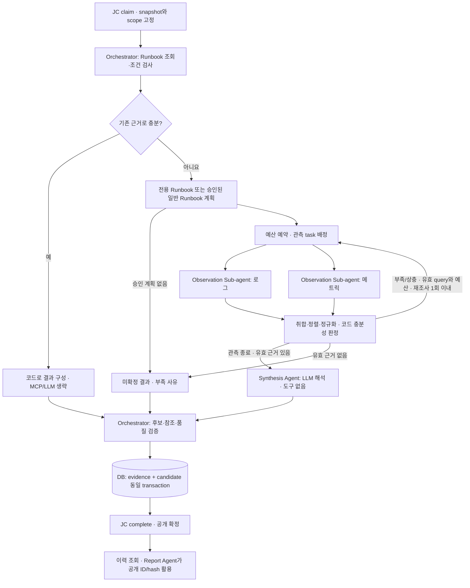

# 11. RCA Agent 모듈 설계서

버전 1.3 · 모듈 rca · 독립 실행·배포 · R01~R09 · NVIDIA NeMo Agent Toolkit(NAT) 적용 설계

## 0. 통합 기준과 구현 상태

2026-09-22 · 코드 대조 기준 `2e269b7`. 2026-09-23에 알람 소스 계약과 사건 단위 확정을 반영하고 `references/`의 runbook 작성 자료를 §6.4.1로 연결했다. 이 문서는 기존 RCA 설계와 `drafts/`의 Runbook-first·지식 매핑 제안을 통합한 **RCA workflow·runbook 개발 기준**이다. 기존 R01~R09 범위를 유지하며 GPU 노드 runbook을 그 안의 조사 지식으로 추가한다. 초안의 GPU 노드 중심 범위를 이유로 GPU–Pod 관계·업무 영향 조사를 제거하지 않는다.

**현재 구현**은 코드로 확인한 동작, **통합 목표**는 이번에 정의한 추가 개발 사항이다. 문서 병합은 기능 구현·운영 검증 완료를 뜻하지 않는다. 현행 모듈 계약은 1.3이다. Incident 중복 제거·전달과 Agent 판단의 역할 분리는 **RCA 접수 계약 1.4의 추가 개발 목표**이며 결과 본문 `result_schema_version=1.1`은 유지한다. 기존 1.3 입력을 조용히 재해석하지 않는다.

2026-09-23 workflow 합의: **Runbook 검색·적용 검사는 DB 조회와 코드로 처리**한다. 기존 증거로 조사 목적을 충족하면 MCP·LLM 없이 결과를 작성한다. 부족하면 **수집 계획 → Grafana MCP → 증거 정리 → LLM 분석 → 검증·재평가 → 필요 시 재조사**를 수행한다. 모든 유효한 분석 결과는 원인 미확정을 포함해 공통 검증·저장·JC 공개를 거친다. 아래 §2의 도식과 계약은 개발 목표이며 현재 코드의 동작과 구분한다.

2026-09-28 보완: [입력·병렬 조사·Synthesis 구현 계획](implementation-plan-20260928.md)을 적용한다. 한 NAT workflow 안에서 Orchestrator가 query별 Observation Sub-agent를 병렬 실행·회수하고, 코드 충분성 판정 후 최대 한 번 재조사한다. 마지막 Synthesis Agent가 근거를 해석한다. 기존 증거 충분 시 MCP·LLM 0회 원칙은 유지한다. Runbook 미일치는 승인·고정된 일반 조사 Runbook으로 대체하며, 그것도 없으면 조사 보류를 결과로 남긴다. 아래 표와 §0.1은 이전 기준 시점의 gap 기록이고 최신 로컬 구현은 §2.4 및 Agent QA를 따른다.

| 구성 | 현재 구현 | 통합 목표·남은 일 |
|---|---|---|
| 알람 전달·조사 선택 | Incident의 alertname 정책이 purpose_ids 지정, 증거 변화로 새 job 생성 가능 | Incident는 관측 에피소드당 최초 1회 전달; Agent가 파싱 후 목적·workflow 선택 |
| 알람 입력 신원 | alertname·labels 기반 target 조립 | Fleet component 로그 기반 `cluster_id`/`machine_id`/`component` 라벨 계약; GPU UUID는 Agent가 관측으로 binding(§1.1) |
| runbook 작성 근거 | drafts의 제안 범위 | `references/` 3종을 작성 자료로 사용하고 검증 상태로 승격(§6.4.1) |
| 실행·저장 | Incident snapshot → JC claim → RCA Worker/NAT → evidence·candidate 저장 → JC 발행 | 기존 경로·소유권 재사용 |
| Runbook 로딩 | scope·고정 revision으로 DB 조회, reviewed hash 검사, source 상위 필드와 compatibility 비교 | scope·무결성 검사와 미확정 장비 호환성 평가를 분리 |
| 검색 | `retrieval.py`의 필드별 BM25 가중 합·Xid/SXid exact boost·결정적 정렬 구현 | workflow 연결, 검색 corpus/설정 고정, 미일치 기준 평가 |
| 적용 검사 | `{field, equals}` 조건의 AND, 필수 fact 존재, 배제·권고 전제 검사 | 증거 품질을 포함한 적용/반박/보류 구분; 필요한 조건만 검토 후 확장 |
| 추가 관측 | D01~D13, 네 procedure, Grafana MCP, attempt 내 캐시·예산·evidence 저장 | runbook의 query ID 연결, 의미·producer binding, 우선순위와 재평가 |
| 가설 | 등록 후속 조회와 일반 증상 후보 작성 | 명시적 bounded hypothesis 검증과 기존 결과 형식으로의 변환 |
| LLM 분석·생략 | 후속 query ID 선택과 마지막 설명용 fact ID 선택 | 충분한 기존 증거에는 LLM 0회; 추가 수집 후 근거 기반 분석·검증·재조사 연결 |
| 원천 action | runbook 권고를 수행하지 않은 제안으로 출력 | 버전 고정 원문·전제·참조 해석; 자동 조치 없음 |

근거: [workflow](../../../rcca-agent/src/rcca_agent/workflow.py), [검색 모듈](../../../rcca-agent/src/rcca_agent/retrieval.py), [관측 실행](../../../shared/python/src/agent_common/observation.py), [저장](../../../shared/python/src/agent_common/store.py). 초안의 example YAML은 `runtime_loadable: false`인 설계 예시이며 배포 설정으로 읽히지 않는다.

### 0.1 후속 개발을 위한 코드 대조

2026-09-23 · 코드 대조 기준 `d391f3d`. 기존 §2.4의 한계와 §7의 P0~P6 순서는 유지한다. 아래는 해당 작업에서 놓치면 안 되는 생산자·공통 런타임·소비자 연결점이다. 신규 기능 실행 검증 기록이 아니다.

| 작업·기존 단계 | 현재 구현·문제 | 업그레이드 목표·완료 조건 |
|---|---|---|
| RCA-01 / P0 접수·목적 선택 | [contracts.py](../../../shared/python/src/agent_common/contracts.py)의 `validate_input()`과 [workflow.py](../../../rcca-agent/src/rcca_agent/workflow.py)는 입력 `purpose_ids`에 의존한다. 입력에서 이 필드만 없애면 신규 경로를 실행할 수 없다 | JC가 전달하는 접수 계약별로 1.3의 입력 목적과 1.4의 Agent 선택 목적을 분리한다. 원본 snapshot을 덮어쓰지 않으며 선택/보류/미적용 근거와 assessments 일치를 검증한다. T45/T47/T48의 양쪽 입력을 Worker 저장·JC 공개까지 확인한다 |
| RCA-02 / P0·P2 이력 확보 | [Store.read_context()](../../../shared/python/src/agent_common/store.py)는 workflow 전에 실행되며 RCA 이력 조회를 입력 R06/R07/R09 유무로 결정한다 | 03 §6의 1.4 단일 DB snapshot을 목적 선택 전에 읽는다. 기간 이력과 검증된 직전 사건 한 건을 상한 내 확보하고 cutoff·ID/hash·잘림을 고정한다. 목적 추가 뒤 DB 재조회나 가짜 입력 목적 주입은 하지 않는다. T56과 Ops의 기존 snapshot 일관성을 검사한다 |
| RCA-03 / P1~P4 Runbook·fact 연결 | 검색 함수는 별도 구현됐지만 workflow에서 호출하지 않는다. 호환성은 source 상위 필드와 비교하고 초기 탈락 후보를 이후 재평가하지 않는다. 실제 조회는 query ID를 set에 모아 정렬한다 | §3/§5/§6의 fact·producer binding·query 계약을 먼저 충족하고 검색·pending 재평가·관측 우선순위를 연결한다. [검색 단위 시험](../../../agents/tests/test_runbook_retrieval.py) 성공과 실제 Grafana alert→Runbook 적용 성공을 별도로 검수한다 |
| RCA-04 / P5·P6 결과 소비 | 공통 `validate_result()`는 결과 필드·근거/수치 참조·상태 등을 검사하지만 새 목적 선택 trace와 계약별 목적 일치 검사는 없다. Backend는 입력 목적을 복사하고 Ops는 공개 원인 후보를 인용한다 | JC-03과 검증 책임을 맞추고 1.4 trace·assessments 불일치의 저장/공개를 차단한다. BE-02·FE-03·OP-04에서 구·신규 결과, 미발행, partial/blocked, 설명 실패를 확인한다. 결과 스키마 1.1을 근거 없이 변경하지 않는다 |

이력 고정 범위는 03 §6, 입력 계약 전달은 14의 추가 개발 계약을 따른다. 공통 Python 변경은 두 Worker 모두에 영향을 준다. 업무별 충분/부족/상충 사례는 [05](../05_테스트_검수_기준서.md) T24/T33~T40/T45~T48/T55/T56 및 §7.3을 따른다. **이번 상태: 위 경로 정적 대조 완료, 신규 구현·제품 테스트·실환경 품질 검수 미실행.**

## 1. 역할·입력

Incident가 생성하고 Job Controller가 배분한 RCA 잡만 실행한다. Backend·GUI·보고서에서 RCA를 직접 접수하는 API는 없다. 자체 업무 큐·달력·레플리카 제어도 없다. 잡 실행 관리는 JC의 register/claim/heartbeat/complete/fail을 사용하는 Worker가 담당하고, 조사 중에는 Runbook·사건 DB, Grafana MCP, 추론 endpoint를 호출한다.

신규 1.4 입력은 incident_id, evidence_version, scope, target 또는 사건 범위, incident_time, time_range와 최초 알람 snapshot 연결이다. Incident는 purpose_ids·analysis_profile_revision을 지정하지 않는다. 실행 profile은 envelope/claim versions에 고정한다. Agent가 알람을 파싱하고 조사 목적과 내부 경로를 정한다. snapshot/hash는 변경하지 않으며 Pod/GPU 신원이 부족하면 확인된 범위와 부족 필드를 보존한다. incident_id가 없는 임의 증상 요청은 거절한다. 기존 1.3 입력은 기존 purpose_ids·analysis_profile_revision 검증과 해석을 유지한다.

R01~R09는 Agent 내부의 조사·평가 항목이다. 신규 경로에서는 Agent가 원문 단서·확인된 대상·관측 근거로 필요한 목적을 선택하고 같은 job 안에서 보완한다. Incident의 alertname→R 매핑과 R01/R02 고정 요청은 제거한다. 반복 알람이나 목적 변경으로 새 job을 만들지 않으며 자동 기술 재시도만 동일 job의 새 attempt로 처리한다. 중복 판정과 사건 단위는 [13](../incident/13_Incident_모듈_설계서.md)을 따른다.

### 1.1 입력 snapshot에서 보장되는 것과 보장되지 않는 것

[13 §1.1](../incident/13_Incident_모듈_설계서.md)의 알람 소스 계약에 따라 Incident는 Grafana 규칙이 라벨·annotation으로 투영한 값만 전달한다. Agent는 아래 구분을 전제로 조사를 시작한다.

| 입력 | 보장 수준 | Agent의 처리 |
|---|---|---|
| `cluster_id` | 필수 라벨이며 Incident가 등록 여부를 검증한 값 | 고정 scope의 기준. 원문에 없는 cluster를 추정하지 않음 |
| `machine_id`, `component` | 제공된 경우 라벨에서 복사한 값; 누락 가능 | 확인된 대상 범위와 조사 단서로 사용. component가 있을 때만 Domain·Category 좁히기에 사용(§3.1.2) |
| `identity_incomplete` | machine/component 누락 시 생명주기별 격리 그룹의 경고·부족 필드 | RCA 접수 실패 사유로 일괄 처리하지 않음. 확인된 scope에서 조사하고 신원을 임의 보충하지 않으며, 부족 필드를 evidence·missing_inputs에 보존 |
| `reason` 원문 | 원문 문자열. **검증된 fact가 아님** | Xid/SXid 코드·장치 식별자는 Agent가 파싱하고 관측으로 확인한다 |
| `k8s_node_name` | 표시용 이름. 재사용·변경 가능 | 신원으로 쓰지 않고 `machine_id`와 교차 확인한다 |
| GPU UUID·PCI BDF | **없음** | Incident가 문자열에서 추출하지 않는다. Agent가 Loki·DCGM 관측으로 binding한다 |
| `occurred_at` / `incident_time` | 검수된 생산자 계약과 시각 검증을 통과한 경우만 발생 시각 사용; 미검수·누락·파싱 실패는 startsAt 기준(13 §3) | snapshot의 기준·선택 사유를 읽고 고정 incident_time/time_range를 사용. annotation으로 조회창 재계산 금지 |
| 로그 본문(`extra_info`, `gpuInfo.gpus`, `suggested_actions` 전문) | snapshot에는 annotation으로 투영된 범위만 | 전체 원문은 Grafana MCP로 Loki를 직접 조회해 확보한다 |
| `prior_incident_id` | 같은 그룹의 직전 에피소드 참조 | 존재하고 직전이 종결이면 **조치 후 재발**로 다룬다. 조치 수행은 사람이며 Agent는 조치 기록을 근거로만 사용한다 |

한 에피소드에는 여러 오류 코드가 함께 귀속될 수 있다. 신원 라벨이 완비되면 Incident는 같은 source/cluster/machine/component로 묶으므로 XID storm의 첫 알람이 snapshot에 고정되고 나머지는 `alert_events`에 남는다. 신원이 부족하면 13 §2.1의 생명주기별 격리를 유지한다. Agent는 snapshot의 첫 코드만으로 원인을 확정하지 않고, 입력 `time_range` 안의 로그를 조회해 같은 기간의 다른 코드·순서를 함께 본다. 반복 webhook 수를 재발 횟수로 사용하지 않는다.

## 2. 처리·저장

여유 슬롯에서 claim → 사건 증거·대상/시각 확인 → 알람 파싱·조사 목적 선택 → DB 조회·코드로 Runbook 검색/적용 검사 순서다. 기존 증거가 충분하면 MCP·LLM 없이 결과를 작성한다. 부족하면 수집 계획 → Grafana MCP → 정규화·품질 확인 → LLM 분석 → 검증·재평가를 거쳐, 유효한 추가 조회와 예산이 있을 때만 반복한다. 두 경로 모두 결과 검증 → evidence·candidate 저장 → JC complete·공개로 끝난다. evidence와 result_candidates는 RCA 소유이며 jobs·사건 상태는 직접 변경하지 않는다.

04의 공통 결과에 incident_id·incident_time·current_checked_at·pod_relations·assessments·cause_candidates·recommendations·missing_inputs·termination_reason을 더한다. 숫자는 measurements 레지스트리에 저장하고 문장에서는 value_refs로 참조한다.

### 2.1 모듈 내부 구성

Worker 프로세스 안에서 NAT 사용자 정의 워크플로를 실행한다. 워크플로는 다음 업무 함수로 구성하며, 단계마다 별도 서비스나 하위 Agent를 배포하지 않는다.

내부 오케스트레이터는 이 단계의 순서·분기·예산을 코드로 조율한다. Runbook을 찾거나 정해진 관측 계획을 구성하기 위해 LLM을 호출하지 않는다. 관측 sub-agent는 같은 프로세스의 asyncio task로 실행하고 Synthesis는 도구 없는 별도 역할로 둔다. 별도 JC job·큐를 만들지 않는다.

| 내부 구성 | 책임 | 사용하는 자료/연결 |
|---|---|---|
| Worker 실행부 | claim·heartbeat·취소·deadline·후보 저장·완료 보고 | JC API, 자기 결과·근거 저장소 |
| 사고 입력 확인·파싱 | 불변 최초 snapshot, 대상·시각 검증, 코드 namespace·증상 단서 추출 | incident_evidence_versions·고정 parser 계약 |
| 목적·경로 선택 | R01~R09 관련성 판정, Runbook·일반 조사·보완 조회 선택과 재평가 | 파싱 근거·등록 선택 규칙·procedure·실행 예산 |
| Runbook 검색·검사 | 호환 발행본 검색, 필수 증거·적용/배제 조건 확인 | knowledge_revisions; 04의 지식 계약 |
| 조사 진행 | 등록 procedure 선택, 부족한 증거에 대한 다음 조사 결정 | NAT 워크플로·LLM·허용된 조회 함수 |
| Observation Sub-agent | 배정된 등록 query의 로그·지표 수집과 품질 기록; 병렬 실행·회수 | NAT MCP 클라이언트 → Grafana MCP → Grafana 데이터소스 |
| Synthesis / Orchestrator 검증 | Synthesis가 후보·근거·한계를 해석하고 Orchestrator 코드가 결과를 검증 | 확보한 증거, 규칙, LLM |

LLM은 수집한 근거를 해석해 원인 후보·지지/반박·추가 확인을 제안한다. 실행 도구 선택은 등록된 다음 조사로 제한한다. 도구 호출을 지원하는 모델을 검증한 뒤 NAT Tool Calling 단계를 조사 진행에 연결한다. 호출 가능한 절차, 대상, 시간창, 횟수와 종료 조건은 Python 코드가 검사한다. 저장·완료·취소 처리는 LLM 도구로 노출하지 않는다.

### 2.2 Runbook 우선 조사와 추가 조회

| 상황 | 처리 |
|---|---|
| 호환 Runbook과 기존 증거로 조사 목적 충족 | 적용·배제 조건과 품질을 코드로 검사한 뒤 근거와 권고 작성. MCP·LLM 0회로 공통 저장 진행 |
| Runbook은 있으나 증거 부족 | 필수 query를 sub-agent에 병렬 배정 → 코드 충분성 검사 → 필요 시 최대 1회 재조사 → Synthesis LLM 해석·검증 |
| 맞는 Runbook이 없음 | 명시한 승인·고정 일반 조사 Runbook을 선택. 일반 Runbook도 없으면 부족 입력을 기록하고 조회를 시작하지 않음 |
| 반박 증거·상충·데이터 부족 | 지지·반박·부족을 보존. 유효한 추가 조회와 예산이 있으면 재조사하고, 없으면 미확정 결과 작성 |
| 유효한 증거가 전혀 없음 | 근거 없는 LLM 분석은 생략. 추가 조회 가능성을 확인하고 불가능하면 부족·실패 사유를 결과에 기록 |

Runbook 검색 성공은 원인 확정이나 장애 복구를 의미하지 않는다. Grafana MCP는 Runbook 실패 시에만 쓰는 보조 경로가 아니라 적용 조건을 확인하는 관측 경로이기도 하다. 알람에 충분한 증거가 있는지 먼저 검사하고, 필요한 범위만 조회한다. 조사의 반복은 procedure의 허용 단계·C07 예산 안에서만 수행한다.

관측은 Loki 로그와 Mimir의 Prometheus 호환 지표를 함께 사용한다. 실제 datasource UID·CPC 필터·원본 시각·조회 제한은 03/14 계약을 따른다. 이번 범위에서 '해결'은 원인 분석과 권고 제시까지이며 GPU reset·Pod 종료 등 실제 조치는 수행하지 않는다.

#### 추가 조사 없는 종료 기준

Runbook 검색 결과나 fact 키의 존재만으로 충분하다고 판정하지 않는다. 아래 조건을 코드로 확인한다.

1. 고정 revision/hash·scope·호환성이 검증되고, 필수 fact의 대상·기간·단위·freshness·품질이 해당 판단에 유효하다.
2. 적용 조건이 충족되며 배제 조건의 미확정이나 상충 증거가 결론을 막지 않는다. 원인 수준과 권고 자격은 각각 근거에 맞게 제한한다.
3. §3.1.2의 목적 선택·관련성 trace와 assessments가 일치하고 필요한 조사가 남지 않는다. R01 Runbook 적용만으로 R02 관계나 R04 영향 조사를 생략하지 않는다.

이 경로에서는 코드로 결과를 구성하고 `narrative_status=omitted`와 LLM 미사용을 실제 실행 기록에 남긴다. `evidence_sufficient`는 해당 평가의 근거 충족이며 `confirmed`·장애 복구·사건 종결과 다르다. 조기 종료도 §2.3의 저장·공개를 생략하지 않는다.

#### 추가 수집 후 충분성 판정과 Synthesis

MCP 수집은 중간 단계다. Orchestrator 코드가 정규화·품질·적용 조건을 검사하고 `sufficient`, `insufficient_actionable`, `insufficient_blocked`, `degraded`, `conflicted`로 내부 진행을 판정한다. 조회 실패·부분 수집을 Runbook 미일치로 바꾸지 않는다. 부족·상충을 좁힐 승인 계획의 미실행 query가 있을 때만 최대 1회 재조사한다. LLM이 후속 query를 고르는 경우에도 허용 목록·중복·예산을 코드로 검사한다.

관측 라운드가 끝나면 유효한 증거에 대해 Synthesis Agent를 한 번 호출한다. 충분한 경우뿐 아니라 부분 근거가 있는 미확정 종료도 대상이다. 관측 자체가 없으면 추론을 생략한다. Synthesis에는 도구를 주지 않으며 추가 query·완료 선언·권고 실행·confirmed 승격을 허용하지 않는다. 모델 출력은 후보와 근거 참조·부족 입력·한계로 제한한다. 숫자는 코드의 검증된 값 레지스트리에서만 사용하고 모델 자유 문장의 숫자 측정값은 거부한다.

LLM 응답 성공만으로 ready가 되지 않는다. 적용 Runbook·목적별 입력·품질·상충·합성 상태를 코드가 검사한다. 모델이 제안한 원인은 candidate이며 문장 의미의 진실성까지 기계적으로 검증됐다고 주장하지 않는다. 모델 미구성·실패·출력 오류는 `quality.analysis`와 부족 입력으로 기록하고 코드가 확인한 사실을 보존한다. 원격 추론 종료 불명·취소·deadline·lease 만료는 기존 14의 fail/격리 계약을 따른다.

### 2.3 결과와 재현 근거

04의 기존 결과 스키마에 확인한 사실, 원인 후보, 지지/반박 근거, 적용 가능한 권고, 미충족 입력과 종료 사유를 기록한다. 사용한 Runbook revision, MCP 조회의 datasource·query revision·대상·기간·수집 시각·완전성은 03의 evidence snapshot으로 보존한다. NAT 실행 기록은 job_id·attempt_no와 연결하되 업무 DB의 결과·상태를 대체하지 않는다.

RCA 후보는 JC가 published_result_id를 확정한 뒤 Backend와 보고서 Agent가 읽는다. 분석 결과를 Runbook으로 자동 발행하거나 Incident를 자동 종결하지 않는다.

Runbook 단독 판단·LLM 분석·미확정 종료 모두 같은 결과 계약과 저장 경로를 사용한다. 사건/대상/기간·job/attempt, 목적별 평가, 원인 후보와 수준, 지지/반박 근거, 권고와 미수행 상태, 부족 입력·종료 사유를 보관한다. 검색/수집/분석 경로·재조사 결정·LLM 사용/실패 사유는 기존 evidence snapshot/quality와 실행 기록에 남긴다. 별도 이력 테이블이나 저장 서비스를 추가하지 않는다.

유효한 결과는 evidence와 candidate를 같은 트랜잭션으로 저장하고, JC가 공개를 확정한 뒤 Backend의 기록 조회와 보고서가 사용한다. Ops는 공개 ID/hash를 고정하고 미확정·부분 분석의 수준을 유지한다. 저장 실패·최종 결과 검증 실패·취소·lease 만료는 정상 분석 결과와 구분해 JC 실행 기록으로 남긴다. 모든 실패 직전의 중간 증거가 자동 영속화된다고 보장하지 않으며 유효 lease 없이 저장·공개하지 않는다.

### 2.4 현재 실행 순서와 확인된 한계

2026-09-28 로컬 개발 상태. 실행 검증 범위는 [Agent QA](../../../agents/QA.md)를 따른다.

1. 기존 1.3 claim 입력과 DB snapshot/hash를 검사한다. alert 원문은 보존하며 reason/component/action은 검색·표시 단서로만 파싱한다.
2. pinned corpus를 읽고 reviewed hash·content hash를 확인한다. schema 없는 legacy와 `gpu-rca-runbook/1.0`을 명시 분리한다. v1은 validator·BM25 검색·pending compatibility·관측 계획을 연결한다.
3. 기존 증거로 모든 요청 목적과 적용 Runbook이 충족되면 MCP·LLM을 생략한다. 부족하면 승인된 계획을 실행하며, 전용 Runbook 미일치는 profile의 `rca.general_runbook_key`에 지정된 일반 Runbook으로 대체한다. 미발행·미고정·invalid content를 하드코딩 조사로 우회하지 않는다.
4. `observation_agents.py`가 query별 독립 Observation task에 예산을 예약·분배한다. 기본 동시성 3, 결과는 완료 순서와 무관하게 정렬한다. 형제 실패를 격리하고 취소 시 task를 모두 회수한다.
5. Orchestrator가 충분성·상충을 검사하고 최대 한 번 재조사한다. 이후 `synthesis.py`가 도구 없이 유효 관측을 해석한다. 모델 후보·추가 필드·참조를 검사하고 모델을 통한 인과 수준 승격을 막는다.
6. Worker가 유효 lease에서 evidence/candidate를 저장하고 JC complete로 공개를 확정한다. Ops의 공개 결과 ID/hash 참조 경로는 유지한다.

v1 fact 승격은 완전한 관측·동일 대상·단일 cluster·등록 freshness에 제한한다. 기본 `health_facts()`는 error_code를 만들지 않고 기본 설정에는 운영 health 계약이 없다. 따라서 Xid/SXid를 reason에서 찾았다는 이유만으로 원인을 supported/confirmed로 만들지 않는다. 실제 Fleet parser·binding·운영 Runbook 발행은 남은 데이터 계약 작업이다. 기본 프로필에 일반 Runbook key를 지정해도 콘텐츠를 자동 생성·발행하지 않는다.

이번 실행부는 **입력 1.3**을 유지한다. 1.4 목적 자동 선택, 목적 선택 전 bounded 이력 snapshot, purpose trace/소비자 검증은 후속 단계다. 새 DB 테이블, Fleet REST 직접 adapter, 시계열 임계값·인과 confirmation rule, 운영 LLM/Grafana 분석 품질 검수는 완료 범위가 아니다.

### 2.5 통합 목표 workflow

아래 단계는 같은 Worker/NAT 프로세스에 통합한다. 별도 검색 서버·관측 서비스·지식 DB를 신설하지 않는다.




정상 분석 흐름의 도식이다. 각 호출·저장 전 취소·lease·deadline을 확인한다. 입력/검색 저장소 오류를 Runbook 미일치로 우회하지 않는다. LLM 오류·출력 검증 실패는 §2.2의 유효 부분 보존 규칙을 따르고, 기술 실패·원격 추론 종료 불명은 §4와 14에 따른다. JC complete가 확인되기 전에는 공개 완료로 표시하지 않는다.

| 단계 | 입력 → 출력 | 진행·중단 기준 |
|---|---|---|
| 입력 고정 | snapshot·scope·target·기간·versions → 조사 컨텍스트 | hash 불일치·허용 scope 위반은 가설 탐색으로 우회하지 않음 |
| 단서 정규화 | 해당 사건의 alertname/summary/message/오류 코드·event → 검색어 | 묶음 alert는 사건 신원별로 분리. 원문·출처 유지; UUID·시각·임의 verified_facts를 검색어에 넣지 않음 |
| 목적·경로 선택 | 파싱 단서·대상·관계 → 내부 목적 목록·procedure·근거 | Incident의 목적 지정 없음. 코드 유무만으로 Runbook/로그를 배타 분기하지 않음; §3.1.2 |
| 후보 검색 | DB의 허용된 pinned runbook corpus → 결정적 검색·후보 revision | LLM 미사용. Xid/SXid 구분. 점수는 관련도이며 진단 확률·원인 근거가 아님 |
| 적용 검사 | 후보·호환성·typed facts → 적용/반박/증거 부족 | 미확정 producer/model은 관측으로 확인할 후보로 보류. 명백한 불일치는 반박 사유 기록 |
| 관측 계획 | 후보의 부족 조건 → 실제 query ID·대상·기간·우선순위 | §5의 선결 조건과 §5.3의 요청 출처별 허용 규칙을 충족해야 실행 |
| 충분성·Synthesis | 정규화 증거·품질·Runbook → 코드 충분성·최대 1회 재조사 → Synthesis 후보·지지/반박 → 코드 검증 | 수집만으로 완료 금지. degraded는 부분 상태 유지, 도구 없는 Synthesis는 관측 라운드 종료 후 1회 |
| 가설 조사 | 검색 미일치 또는 모든 후보의 유효 반박 → 제한된 가설·구분용 조회 | 검색 장애·stale·조회 실패를 runbook 미일치로 취급하지 않음 |
| 결과·발행 | 기존 04 결과 + 추적 evidence → candidate·공개 결과 | 원인 수준·권고 자격·작업 성공은 별도 평가. 저장 실패 시 complete 금지 |

`retrieved`, `applicable`, `rejected`, `insufficient_evidence`는 **추가 개발할 후보 내부 상태**다. 기존 job 상태, `result_status`, `termination_reason`을 대체하지 않는다. 여러 후보 중 하나라도 증거 부족으로 남으면 “모두 반박됨”으로 기록하지 않는다. 승인된 일반 조사 Runbook의 범위에서는 조사할 수 있지만 이 부족을 근거 없는 새 원인으로 채우지 않는다.

현재 검색 함수는 양수 점수의 top-k를 반환하고 동점은 key/revision/id로 정렬한다. 기본 top-k=5·exact boost=12·tokenizer `gpu-lexical-v2`는 구현된 실험값이다. 운영 `min_score`·동점 확대·한국어 검색 품질은 미검증이다. 임계값 없는 현재 함수를 임계값 보정 완료 검색으로 설명하지 않는다.

## 3. 조사 업무·판단

### 3.1 업무별 계약

‘필수’는 해당 주장의 조건이다. 표에 적힌 추가 입력이 없다고 장비 기본 조사 전체를 중단하지 않는다.

| ID | 입력·필수 데이터 | 처리·출력 | 부족 시 |
|---|---|---|---|
| R01 알려진 오류 | 원문·producer/parser 계약·장비, D01/D05/D09·KB | 코드·장비·버전으로 후보 검색 → required_evidence 검사 → 적용 가능한 권고·반박·미충족 조건 | 코드/계약 불명은 원문 보존·일반 조사. 코드 하나로 원인 확정 금지 |
| R02 GPU→Pod | D01/D08, 현재 또는 사건 시각 | 직접 매핑·같은 노드 참고 Pod·현재/당시 관계 분리 | 매핑 미확인 표시. 같은 노드 Pod를 직접 사용자로 지정하지 않음 |
| R03 Pod→GPU | Pod 신원·D08 및 가용 D02~D06/D09 | 관련 GPU와 공통 Node의 증상·활동·상태 비교 | 장치 미확정이면 Pod/배치 근거만 제공 |
| R04 작업 영향 | 사건 당시 D08·D09·D13 | 당시 관계와 실제 중단·재개·원인 연계를 별도 기록 | 현재 관계만 있으면 당시 영향 unknown/not_assessed |
| R05 미등록 증상 | 증상·대상·시각, 가용 D01~D10 | 등록 procedure로 지지/반박 가능한 후보와 추가 확인 | 원인 불명으로 종료해도 사실·부족 정보·다음 확인 제공 |
| R06 재발 위치 | D14 정규화 사건·기간, 필요 시 D08/D12 | 장비 집중/작업 이동 패턴·모델·버전·관측시간 비교 | 작업 이력 없으면 장비 사건 비교만 제공 |
| R07 공통 장애 범위 | 동시 사건·Node·매핑, 필요 시 토폴로지 | 확인된 Node/GPU/연결 범위와 관련 작업 | 토폴로지 없는 장치 영향은 미확정 |
| R08 조치 검토 대상 | 최신 D08·장비/공유/조치 범위·정책 | 현재 관련 작업·원본 시각·조치 전 확인 목록 | 매핑이 비었다고 리셋 안전 확정 금지 |
| R09 조치 후 관측 | D14 실제 조치 시각·D05/D09/D10, 업무 회복은 D13 | 장비 정상 관측·오류 재관측·작업 재개를 분리 | Healthy만 있으면 업무 복구 미확인 |

현재 workflow의 `REQUIRED`는 다음 fact 이름의 충족 여부로 assessment를 계산한다. 이는 위 업무 전체의 구현 완료 판정표가 아니다.

| 목적 | 현재 필수 fact |
|---|---|
| R01 | `producer_contract`, `error_code` |
| R02 / R03 | `incident_mapping` |
| R04 | `incident_mapping`, `workload_evidence` |
| R05 | `observations` |
| R06 | `incident_history` |
| R07 | `incident_history`, `topology` |
| R08 | `current_mapping`, `action_policy` |
| R09 | `action_records`, `device_recovery_evidence`, `workload_evidence` |

현재 추가되는 것은 계약 있는 health fact, 당시 관계가 있을 때의 `incident_mapping`, 성공 관측이 있을 때의 `observations`, 조회된 사건이 있을 때의 `incident_history` 등이다. DB에서 actions를 읽거나 D13을 조회했다고 나머지 fact가 자동 생성되지는 않는다. 현재 Grafana 경로에는 `error_code`, `topology`, `current_mapping`, `action_policy`, `action_records`, `device_recovery_evidence`, `workload_evidence` 생성이 연결되어 있지 않아 R01/R04/R07/R08/R09의 ready 조건을 충족하지 못한다. legacy `verified_facts`를 포함한 모든 입력에서 영구적으로 불가능하다는 의미는 아니다.

### 3.1.1 추가 개발할 fact 데이터 계약

아래는 **Worker 내부에서 사용할 통합 목표**이며 현재 `facts` dict나 공개 결과 1.1에 이미 구현된 구조가 아니다. 새 DB 테이블 없이 기존 evidence에 근거를 보존하고, 기존 `facts`·`assessments`·`cause_candidates` 출력으로 변환한다.

각 fact는 `name`, `value`, `status`, `target`, `time_range`, `evidence_refs`, `rule_revision`, `reason`을 가진다. `name`은 아래 표의 등록명, `rule_revision`은 생성/판정 코드·계약의 고정 식별자다. `target`은 `cluster_id`와 필요한 node/GPU UUID/Pod UID를 담고, `time_range`는 근거가 유효한 RFC3339 시작·종료 시각이다. `evidence_refs`는 해당 attempt가 저장하는 근거 ID 배열이다. DB/지식 원본도 ID·revision/hash를 담은 snapshot evidence로 참조한다.

`status`는 `known / unknown / conflicting / unsupported`다. known은 값·신원·시각·의미가 검증되었음을 뜻하며 원인이 확정되었다는 뜻은 아니다. 나머지는 `value=null`, 비어 있지 않은 `reason`, 확보한 evidence refs를 유지한다. 값이 오래되었으면 unknown/stale, 서로 양립할 수 없으면 conflicting, parser/binding이 없으면 unsupported로 남긴다. **fact 키가 존재한다는 이유만으로 REQUIRED를 충족시키지 않는다.** known 상태에 아래의 목적별 충족 조건까지 맞아야 하며, 미충족 등록명은 기존 `missing_inputs`에 기록한다.

| fact 이름 · value 타입 | 생성기·입력 | 충족 조건 / 반박·미충족 처리 |
|---|---|---|
| `producer_contract` · string | D05/D09 → 등록 health/event parser | 원본 계약 ID와 등록 계약 ID 일치, 대상·시각 유효. 미등록은 unsupported, source 간 불일치는 conflicting |
| `error_code` · 오류 event 배열 | D09/D05 로그 → 추가할 코드 parser | 각 항목은 `namespace`, `code` 문자열, `observed_at`, `target`, `evidence_refs`. 대상 사건의 검증된 event가 1개 이상 있어야 R01 충족. Xid/SXid 구분; 검색어/알람의 코드만으로 생성하지 않음 |
| `incident_mapping` · 관계 배열 | D08+D06 → 기존 allocations/relations 변환 | 항목은 cluster/GPU UUID/namespace/Pod UID, `start`, `end`, refs. 사건 시각을 포함하는 직접 관계가 1개 이상 필요. UID 충돌은 conflicting; 같은 노드만 확인되면 미충족 |
| `observations` · evidence ID 배열 | 기존 Observation 결과 → 품질 검사 | 허용 범위의 `ok` 관측이 1개 이상이면 현재 R05의 최소 조건 충족. empty/partial만 있으면 미충족; 원인 규명 완료를 의미하지 않음 |
| `incident_history` · 사건 참조 배열 | Store의 고정 DB 조회 → 추가할 조회 범위/완전성 판정 | 항목은 incident ID·발생 시각·snapshot evidence ref. 요청 범위/기간의 완전한 조회여야 함. 통합 목표에서는 검증된 빈 이력도 known으로 설명 가능; 현재 코드는 비어 있지 않을 때만 추가 |
| `topology` · object | 검토·고정된 reference 또는 새로 검증한 관측 binding → topology 변환기 | `nodes:[{id,kind}]`, `links:[{from,to,kind,evidence_refs}]`. 요청 대상·당시 연결 범위를 증명해야 R07 충족. 현재 기본 D-query에는 전용 생성기 없음; 누락 edge를 단절 증거로 해석하지 않음 |
| `current_mapping` · 관계 배열 | 허용된 현재 확인 구간의 D08+D06 → 매핑 변환기 | incident_mapping과 같은 항목 구조, 별도 현재 확인 시각·freshness 충족. 빈 배열을 known으로 쓰려면 기대 대상의 수집 완전성을 입증해야 하며 안전 판정과는 별개. 현재 구현은 당시 관계만 생성 |
| `action_policy` · object | pin된 `policy` 지식 → 추가할 정책 loader/validator | `policy_revision_ref`, `action_type`, `preconditions`. 대상·조치·버전에 유효한 정책과 전제 정의가 있어야 함. 전제의 true/false는 별도 평가하며 정책 존재를 조치 허용으로 해석하지 않음. 상충 정책은 conflicting |
| `action_records` · 실제 조치 배열 | Store의 `actions` → 추가할 조치 fact 변환기 | 항목은 `record_id`, `occurred_at`, `target`, `action_type`, refs. 대상·시각·실제 수행 근거가 일치하는 조치가 필요. 권고·계획·취소 기록을 수행 사실로 변환하지 않음 |
| `device_recovery_evidence` · object | 실제 조치 + D05/D09의 유효 health + C08 정상 관측 정책 → 추가할 회복 판정기 | `action_record_id`, `window`, `policy_revision_ref`, `assessment`, `health_evidence_refs`. assessment는 recovery_observed/abnormal_observed/not_established. 정책을 충족한 정상 또는 유효한 비정상 재관측이면 판단 근거 충족; not_established는 미충족. `up=1`, stale Healthy, 공백은 회복 증거가 아님 |
| `workload_evidence` · workload event 배열 | D13/검증된 D09 + 당시 매핑 → 추가할 workload parser | 항목은 `subject`(Pod UID/workload ID), `event`(running/stalled/stopped/resumed/completed), `observed_at`, refs. R04는 당시 관련 workload의 관측, R09는 조치 이후 회복/비회복 판단 근거가 필요. GPU 정상만으로 대체하지 않음 |

배열 항목의 target·기간은 fact 봉투 범위 안이어야 한다. workload 상태나 오류 namespace의 원천 매핑은 parser 계약으로 검토하며 임의 로그 문구를 enum으로 추정하지 않는다. 현재 매핑을 요구하는 R08이나 조치 후 관측을 요구하는 R09의 기간이 job 입력 범위 밖이면 새 조회를 임의 확장하지 않고 부족 입력으로 남긴다. 같은 에피소드의 반복 알람으로 새 job을 만들지 않으므로 해당 후속 시점은 이번 결과의 미평가 범위로 남긴다. 지속적인 조치 후 확인이나 수동 재분석은 별도 요구사항으로 정의해야 한다.

`normalized_health`, `component`, `severity`는 §3.4의 보조 fact로 같은 봉투를 사용한다. 기존 equals 조건에는 known인 scalar value만 전달한다. 오류 배열에는 §6.2.2의 등록 `error_code` 조건 해석을 적용하고, 다른 배열/object 전체의 equals나 임의 경로식은 허용하지 않는다. legacy `verified_facts`는 기존 형식용 adapter로 처리하며 신규 알람에서 같은 이름의 필드를 가져와 신뢰하지 않는다. fact 생성기·adapter·assessment 변경을 함께 회귀 검수한다.

### 3.1.2 Agent의 목적·workflow 선택 목표

신규 입력은 R01/R02 목록으로 조사 범위를 제한하지 않는다. Agent가 원문을 파싱하고 R01~R09의 관련성을 검토한 뒤 필요한 조사를 같은 job 안에서 수행한다. 모든 R을 무조건 실행하거나 모든 로그를 조회한다는 뜻은 아니다.

| 입력·관측 단서 | Agent가 선택할 조사 |
|---|---|
| 입력 `component` 있음 | 담당 모듈 이름으로 Domain·Category 후보를 좁힌다. 이름 자체를 오류 확정·health 판정으로 읽지 않음 |
| 입력 `component` 없음 | Domain·Category 좁히기를 건너뛰고 등록 일반 조사로 시작한다. 확인된 scope·대상·고정 기간·예산 안에서 허용 query만 사용하고, 부족 신원은 evidence·missing_inputs에 보존한다. 새 단서가 확인되면 기존 Runbook 검색·재평가 경로로 이어감 |
| Xid/SXid 등 오류 코드 후보 또는 알려진 증상 | namespace·producer·대상·시각을 구분해 Runbook 검색/R01 검토. 원문 코드만으로 적용 확정하지 않음 |
| GPU 중심 사건 | GPU의 관련 Pod 조사 R02; 관계·영향 단서에 따라 R04 보완 |
| Pod 중심 사건 | Pod에 연결된 GPU 조사 R03; GPU 신원 미확정도 부족 정보를 남기며 조사 |
| 코드 없음·알 수 없는 코드·Runbook 미일치 | 설명 기반 후보 검색 및 등록 로그·지표 일반 조사/R05. 코드 부재만으로 Runbook 검색 금지하지 않음 |
| 재발·동시 다중 장치 단서 | 사건 이력 R06·공통 범위 R07 검토; 반복 webhook 수를 재발 횟수로 사용하지 않음 |
| 구체적 조치 권고 검토 | R08의 현재 관계·조치 전제 확인; 자동 조치 없음 |
| 실제 조치 기록과 범위 안의 후속 관측 | R09 검토; 조치가 없거나 이후 기간이 범위 밖이면 수행 사실·회복을 추정하지 않음 |

입력 `component`는 조사 범위를 좁히는 첫 단서이며 결론이 아니다. component → Domain·Category → 우선 관측 후보의 대응은 [Domain·Category 메트릭 매핑](references/domain-category-metric-mapping.md)을, component와 오류 코드의 정적 정의·기본 action은 [Fleet·GPUd component·오류 카탈로그](references/fleet-gpud-error-catalog.md)를 참고 자료로 사용한다. 두 자료는 `source-verified` 정적 대조이므로 실제 조회에는 §5의 등록 query와 검증 게이트를 통과한 항목만 사용한다. 같은 component에서 정상 상태도 보고되므로 component 이름만으로 장애를 확정하지 않고, `IGNORE_NO_ACTION_REQUIRED`나 action 미정의를 오류 없음으로 해석하지 않는다.

machine_id도 없으면 component만으로 장비를 특정하지 않는다. 등록 일반 조사는 모든 장비의 로그를 무제한 조회하는 경로가 아니며, 허용 query의 필수 대상 인자를 확인할 수 없으면 그 조회·목적을 partial/blocked로 남긴다. component 또는 machine_id를 추정해 채워 넣거나 신원 부족을 not_applicable로 숨기지 않는다.

`prior_incident_id`가 있고 직전 에피소드가 종결됐으면 조치 후 재발 경로로 다룬다. 이 경우 R06 사건 이력과 R09 조치 후 관측을 우선 검토하고, 직전 결과의 권고와 실제 조치 기록·이번 관측을 대조해 같은 원인 재발과 다른 원인을 구분한다. 직전 결과를 그대로 재사용하지 않고 이번 에피소드의 증거로 다시 평가한다. 조치 기록이 없거나 범위 밖이면 수행 사실과 회복을 추정하지 않는다.

선택은 등록된 parser/규칙과 관측 근거로 설명 가능해야 한다. LLM의 제안은 등록 목적·procedure·query·scope·시간창·예산 검사 후에만 실행한다. 단서가 부족하면 일반 조사로 시작하며, 최초 알람의 모호함 때문에 R01/R02로 고정하지 않는다. GPU 외 fault도 접수하되 미지원 producer/대상은 `unsupported_source`와 부족 근거를 남긴다.

Runbook과 로그 분석은 결합할 수 있다. Runbook 적용 조건을 확인하기 위해 로그를 조회하거나 일반 조사 중 새 코드/증상을 확인해 후보 검색으로 돌아갈 수 있다. 같은 대상·기간의 query는 재사용하고 기존 C07 예산 안에서 종료한다. 검색 실패와 “후보 없음”은 구분한다.

목적·procedure의 최초 선택, 추가/변경, 미선택 사유와 parser/선택 규칙 revision을 기존 evidence snapshot에 남긴다. 공개 assessments에는 선택한 목적과 적용되지 않는 것으로 확인한 목적을 기록한다. 미확정 관련성·근거 부족은 partial/blocked로 남기며 not_applicable로 숨기지 않는다. 선택 trace에 R01~R09별 검토 결과를 보존해 누락과 미적용을 구분한다. 신규 결과 validator는 Incident 입력 목록이 아니라 이 trace와 assessments의 일치를 검사한다. 기존 1.3 결과 검사는 요청 purpose_ids 기준을 유지한다.

### 3.2 등록 조사와 종료

기본 procedure는 GPU 접근 이상, GPU 사건과 Pod, 작업 진행 이상, 다중 장치 사건의 네 가지를 제공한다. 각 procedure는 `procedure_id/version, accepted_symptoms, required/optional_queries, allowed_next_steps, stop_conditions, limits`를 가진 등록 함수다. 범용 YAML 해석 엔진을 만들지 않는다.

현재 [procedures.py](../../../rcca-agent/src/rcca_agent/procedures.py)의 등록값은 다음과 같다. 모두 version 1.1이며 required와 optional의 합집합이 각 procedure의 allowlist다.

| procedure_id | 기본 required queries | optional queries |
|---|---|---|
| gpu_access | D09, D05 | D02, D08, D06 |
| gpu_pod | D08, D06 | D09, D02 |
| work_progress | D09, D08, D06 | D02, D13 |
| multi_device | D01, D09 | D08, D06, D05 |

현재 상위 `symptom` 매칭은 legacy `snapshot.evidence.symptom` 경로다. Grafana `snapshot.alert` 경로는 상위 symptom을 만들지 않으므로 R07 → R02/R03/R08 → R04 → 기본 gpu_access 순서로 purpose를 보고 선택한다. 이 규칙은 기존 1.3 입력의 호환 경로에만 유지한다. 신규 1.4 경로는 §3.1.2의 파싱·관측 근거로 목적과 procedure를 선택하도록 변경한다. `incidents.symptom`이나 자유 알람 문구를 별도 검증 없이 끌어오지 않는다. 목적별 별도 조회도 유지하므로 “R01 runbook 적용 성공”만으로 기존 입력에서 요청됐거나 신규 경로에서 선택된 R02 매핑 조사를 생략하지 않는다.

현재와 초기 통합의 관측 기간은 claim 입력의 `time_range` 전체다. C07 limits의 `max_range_seconds`는 허용 길이, `chunk_seconds`는 응답 분할 단위이며 초기 조사 폭·확대 배수가 아니다. `collect(period=...)`는 부분 구간을 받을 수 있으나 현재 RCA workflow는 이를 사용하지 않는다. 단계적 확대는 후속 요구가 확인될 때 입력 범위 내부의 계획으로 정의한다. 전후 10분·최대 전후 60분 같은 초안 값이나 새 확대 설정을 이번 기본값으로 추가하지 않는다. 후속 조사 횟수·조회 건수·응답 크기·deadline은 기존 C07 예산을 따른다.

| 종료 이유 | 의미·필수 출력 |
|---|---|
| evidence_sufficient | 현 단계의 결론을 설명할 근거 충족. 인과 확정을 자동 의미하지 않음 |
| missing_data | 부족 데이터와 수집/조회할 다음 항목 |
| conflicting_evidence | 상충 근거를 모두 보존하고 구분할 다음 검사 |
| unsupported_source | 호환 계약·파서/장비 범위와 미지원 부분 |
| budget_exhausted | 사용한 예산·중단 단계·남은 확인 |
| query_failed | 실패한 도구·범위·이미 확보한 독립 결과 |

취소·작업 마감·영구 실패는 02의 작업 상태/종료 사유로 추가 기록한다. 데이터 부족을 해결하려 무제한 재시도하지 않는다.

### 3.3 관계·영향·원인 판단

| 축 | 값 | 승격 조건 |
|---|---|---|
| relation_scope | current_mapping / incident_time_mapping / same_node_only / unknown | 해당 시각·신원·매핑 근거 |
| impact_status | not_assessed / no_impact_observed / disruption_observed / recovery_observed | 확인한 기간의 작업 상태·로그·진행 근거 |
| causal_status | undetermined / candidate / supported / confirmed | 후보별 지지·반박·확정 조건. confirmed는 검토된 조건과 증거가 있어야 함 |

`no_impact_observed`는 확인한 범위에서 영향을 보지 못했다는 뜻이다. 같은 시각에 Pod가 종료됐다는 사실만으로 GPU가 원인이라고 확정하지 않는다. 임의 확률값을 붙이지 않는다.

### 3.4 장비 상태와 검사 유효성

정규화 입력은 `raw_health,check_status,normalized_health,component,severity,target,observed_at,producer_contract,parser_revision,evidence_refs`다. raw_health는 원문 그대로 또는 null이다. check_status는 valid/unavailable/skipped/initializing/unknown, normalized_health는 healthy/degraded/unhealthy/unknown, severity는 info/warning/critical/unknown을 사용한다. 이 필드들이 Fleet 원문에 실제로 모두 존재한다는 뜻은 아니다. 배포 계약과 표본에서 검증한 것만 도출하고 불명은 unknown으로 둔다.

| 관측·검사 | 정규화·사건 처리 | 회복 근거 |
|---|---|---|
| 유효 검사에서 정상 | valid+healthy. component별 정상 근거로 저장 | C08의 유효 정상 관측 기간/횟수와 대상 일치 조건 충족 시 해당 장비 회복 근거. 업무 복구는 별도 |
| 유효 검사에서 Degraded | valid+degraded, severity는 검증된 계약 매핑 | 회복 근거 아님. C08 알림/사건 정책에 따라 생성·갱신 |
| 유효 검사에서 오류 | valid+unhealthy, 대상별 사건·증거 연결 | 회복 근거 아님 |
| 검사 불가인데 원문 Healthy | unavailable+unknown, raw_health=Healthy 보존 | 채택하지 않음. 수집/검사 문제로 표시 |
| 의도적인 검사 제외 | skipped+unknown, 제외 사유·정책 보존 | 장비 고장으로 자동 생성하지 않으며 회복 근거도 아님 |
| 초기화 중 | initializing+unknown | 초기화 대기와 실제 장애 구분. 제한 초과 판정은 C08 정책 필요 |
| 로그 단절·오래된 정상 | unknown+unknown, 마지막 유효 관측 시각 표시 | 채택하지 않음. 상태 수집 문제로 표시 |
| 미등록 상태·component·검사 의미 | unknown, 원문·미지원 계약 유지 | 정상/장애/회복으로 임의 매핑하지 않음 |

incidents 배열 등 원문에 여러 GPU 항목이 있으면 모든 자식을 각각 파싱하고 원본 위치·대상·의미 revision을 보존한다. 한 항목 실패가 다른 유효 장치의 근거를 소거하지 않는다. 정상 관측 정책값이 미지정이면 자동 회복 판정을 보류하며 운영자가 확인한 근거를 검토해 사건 상태를 변경할 수 있다.

### 3.4.1 health_contracts 입력 계약

현재 [health 정규화 코드](../../../shared/python/src/agent_common/calculations.py)는 실행 profile의 `health_contracts`를 사용하는 parser와 연결되어 있다. 다음 구조는 **현재 코드가 읽는 필드의 명세**이며, 엄격한 설정 validator와 운영 producer별 검증은 추가 개발/검수 대상이다. 계약을 비워 두면 파싱한 원문의 상태는 unknown으로 유지되며 `health_facts()`로 승격되지 않는다.

| 경로 | 타입·필수 조건 | 의미·검증 |
|---|---|---|
| `health_contracts` | object, 계약 ID를 key로 사용 | health 기반 runbook을 활성화하려면 사용 producer에 대한 등록이 필요. 전체 서비스 기동의 무조건 필수 항목은 아님 |
| `[id].producer_contract` | 비어 있지 않은 string, key와 동일 | 원본 JSON의 `producer_contract`와 정확히 일치해야 함 |
| `[id].revision` | 비어 있지 않은 string | parser 의미 매핑의 불변 버전. 변경 시 새 revision과 설정 hash 기록 |
| `[id].checks` | object: 원본 검사 상태 string → 정규화 enum | 값은 valid/unavailable/skipped/initializing/unknown. 미등록 원본은 unknown |
| `[id].health` | object: 원본 health string → object | 각 값에 `normalized_health`(healthy/degraded/unhealthy/unknown), `severity`(info/warning/critical/unknown) 필요. check가 valid일 때만 적용 |

원본 로그에는 `producer_contract`, `check_status`, `health`, `component`, `target`, `observed_at`가 필요하다. target은 job의 cluster/장치 신원과 맞아야 하고 observed_at은 조회 기간·freshness 조건을 충족해야 한다. 필드 누락·미지원 상태는 원문과 사유를 보존하고 판정을 보류한다. `incidents` 자식은 상위 필드를 상속한 뒤 자식 값으로 덮어쓰는 현재 parser 규칙을 따른다. 실장비 필드명이 다르면 검토된 parser adapter가 필요하며 설정 이름만 맞추어 원문 의미를 추정하지 않는다.

아래는 [E2E fixture](../../../agents/tests/test_e2e.py)의 계약 형태를 보여 주는 예시다. **운영 Fleet 계약이나 정상 상태 정의가 아니므로 그대로 배포하지 않는다.**

```json
{
  "health_contracts": {
    "fixture-v1": {
      "producer_contract": "fixture-v1",
      "revision": "health-fixture-v1",
      "checks": {"valid": "valid", "unavailable": "unavailable"},
      "health": {
        "Degraded": {"normalized_health": "degraded", "severity": "warning"}
      }
    }
  }
}
```

운영 계약은 producer 버전·실제 정상/오류/검사 불가 표본을 검토한 뒤 원본 Agent 설정과 Helm 미러에 함께 반영한다. 계약 ID·revision·설정 hash·검증 표본 evidence를 기록한다. 원문 `producer_contract` 필드만 존재하거나 health 조회가 `ok`라는 이유로 검증된 producer fact를 만들지 않는다. health 외 event parser도 자신의 계약을 검증한 뒤에만 producer/error_code fact를 생성한다.


## 4. 실행 실패·운영

Agent가 없으면 JC는 RCA 잡을 queued로 보존한다. 데이터 부족은 목적별 blocked/partial, 설명 실패는 narrative_status로 남긴다. 현 attempt의 lease·취소·deadline을 지키고 종료 불명 LLM 호출을 JC에 보고한다. final은 JC의 complete 확인 전 GUI에 노출하지 않는다.

등록된 procedure만 실행하며 임의 쉘·SQL·PromQL·장비 제어는 허용하지 않는다. 결과의 권고는 수행 사실이 아니다. Grafana resolved·Healthy·로그 부재만으로 업무 복구를 확정하지 않는다.

## 5. 이 파이프라인은 D-쿼리 레지스트리에 의존한다 + 선결 조건

**런북-first는 D-쿼리 위에 얹는 계층이라, D-쿼리(등록·검증·연결)가 선행/정합되지 않으면 런북 계층이 헛돈다.** 런북은 어떤 증거를 어떤 순서로 확인할지 정의하고, 기존 D-쿼리 계층이 실제 관측을 수행한다. “런북만 작성하면 동작한다”는 전제로 개발·발행하지 않는다.

**새 관측 계층을 구축하는 작업이 아니다.** [D01~D13 레지스트리](../../../agents/config.example.json), [Observation 실행](../../../shared/python/src/agent_common/observation.py), [evidence 저장](../../../shared/python/src/agent_common/store.py)을 재사용한다. 필요한 일은 query ID·실제 데이터·의미·실행 계약의 정합을 맞추고, 기존 ID로 표현할 수 없는 관측만 등록 절차에 따라 보완하는 것이다. D14는 [03의 업무 DB 사건·결과 이력](../common/03_데이터_설계서.md)이며 `Observation.collect("D14")`로 호출하는 MCP query가 아니다.

### 5.1 현재 query ID와 실제 조회 범위

아래는 코드 기준 기본 설정의 실제 요청이다. 03의 데이터 항목 전체가 이 단일 metric으로 구현됐다는 뜻은 아니다. 특히 D01의 활용률 표본을 GPU 인벤토리·접근 가능 여부의 완전한 증거로 간주하지 않는다.

| ID | source·기본 요청 | 연결할 판단과 확인 한계 |
|---|---|---|
| D01 | Mimir · `DCGM_FI_DEV_GPU_UTIL` | 관측된 GPU의 활용률/라벨. 미관측 GPU의 존재·접근 불가를 확정하지 못함 |
| D02 | Mimir · `DCGM_FI_DEV_GPU_UTIL` + `gpu_uuid→UUID`, `node→node` 필터 | 특정 대상 활동. 실제 라벨·신원 일치 검증 필요 |
| D03 | Mimir · `DCGM_FI_DEV_FB_USED` | VRAM 사용량. ECC·remap 오류를 대신하지 않음 |
| D04 | Mimir · `DCGM_FI_DEV_GPU_TEMP` | 온도. 모델별 기준·동시 throttle 증거 없이 열 원인 확정 불가 |
| D05 | Loki · scope selector | health 파서 대상. producer 계약이 맞는 JSON 로그인지 별도 확인 |
| D06 | Mimir · `kube_pod_info` | 시점별 Pod 신원. 이것만으로 직접 GPU 할당 관계를 만들지 않음 |
| D07 | Mimir · `gpu_ops_effective_unbound_request` | 검증된 recording rule 또는 동등 원본에 매핑할 정규화 계약 예시 |
| D08 | Mimir · `gpu_ops_allocation_info` | GPU–Pod 정규화 관계. 실제 데이터·UID·유효 구간·공유/MIG 의미 검증 필요 |
| D09 | Loki · scope + 대상 `node` selector | 노드 로그, health 파서 대상. 현재 Xid/event별 LogQL 필터가 구현됐다는 뜻은 아님 |
| D10 | Mimir · `up` | 해당 scrape target 관측. `up=1`을 GPU 정상 상태로 승격하지 않음 |
| D11 | Mimir · `DCGM_FI_DEV_POWER_USAGE` | 전력 W. power violation/throttle 원인과 별개 |
| D12 | Mimir · `kube_node_status_allocatable` | 자원 종류·단위·라벨을 확인한 allocatable. 전체 토폴로지나 실제 잔여 GPU와 다름 |
| D13 | Loki · scope selector | workload 자료 수집 입구. 조회 성공만으로 중단/재개 fact가 생기지 않음 |

현재 D05/D09/D13은 같은 Loki 도구를 selector로 호출한다. query ID가 다르다고 각각 health·Xid·workload 의미가 자동 보장되지 않는다. 현재 health parser가 처리하는 ID는 D05/D09다. 일반 오류 코드, 이벤트 순서, workload fact parser는 필요한 계약과 함께 보완한다.

### 5.2 사용 전 정합·검증 게이트

| 선결 조건 | 확인·개발 내용 | 통과 근거 / 미충족 시 |
|---|---|---|
| 실제 ID 등록 | runbook의 모든 query ID가 실행 profile의 `queries`에 존재하고 해당 procedure의 `allowed_next_steps`에 포함되는지 검사 | ID·query revision·profile 근거 보존. 누락을 조용히 생략하지 않도록 validator 보완 |
| 의미 검증(`validated`) | 대상 producer·metric/log schema·단위·신원·시간 의미와 검증 표본 확인 | 검증 상태와 evidence ref를 함께 관리. `validated:true`만으로 운영 검증 완료 선언 금지 |
| Mimir/Loki 연결 | Grafana MCP 도구, datasource discovery, CPC 라벨, 기존 tenant·접근 설정 확인 | 각 source를 별도 시험. Mimir 성공을 Loki 연결 성공으로 대체하지 않음 |
| 필요한 recording rule·원본 | D07/D08의 실제 시계열 존재, 입력 metric, rule 평가, 라벨/단위·당시 매핑 검증 | 배포된 rule 또는 동등 원본으로 확인. 이름만 맞는 빈 rule을 준비 완료로 보지 않음 |
| 대상·기간·freshness | cluster/node/GPU UUID/Pod UID, namespace, 원본 표본 시각, 사건 기간과 유효 구간 검사 | 당시 관측과 현재 관측 분리. 조회 범위 확대는 승인된 입력 기간/C07 안에서만 수행 |
| parser·조건 입력 | raw → 의미 fact → runbook predicate가 실제로 연결되는지 확인 | query 성공, 빈 결과, parser 미지원, 정상/오류를 분리. R01 error_code 누락도 검사 |
| 예산·저장·재현 | query/시간/크기 제한, 부분 수집, snapshot/checksum·revision 기록 확인 | 동일한 근거로 적용·반박·보류 이유 재현. 저장 실패는 작업 성공으로 처리하지 않음 |

**현재 `validated`는 실행 스위치가 아니다.** `Observation.collect()`는 이 값을 검사하지 않으며 [회귀 테스트](../../../agents/tests/test_discovery.py)의 `test_validated_is_not_a_deployment_switch`가 false여도 조회함을 명시한다. 이 문서의 검증 게이트는 runbook 발행 전 점검과 추가 validator의 개발 요구다. runtime에 갑자기 `validated=false` 차단을 도입하라는 뜻이 아니다. 공통 실행 의미를 바꾸려면 두 Agent와 배포 계약을 함께 검토한다.

일반 배포는 datasource와 cluster selector를 자동 탐색한다. UID와 selector를 모두 지정한 expert override도 지원한다. 따라서 “UID를 수동으로 입력해야만 동작한다”는 전제도 두지 않는다. 탐색 실패 시 tenant·datasource별 접근·도구 응답·cluster 라벨·기간을 점검하고, 무필터 조회로 우회하지 않는다.

현재 미등록 query ID는 `collect()`에서 빈 목록으로 반환되고, procedure 밖의 runbook query도 workflow에서 제외될 수 있다. 이는 데이터가 없다는 증거가 아니다. 통합 validator는 이를 설정 오류로 검출하고 해당 runbook 적용을 보류해야 한다. 기존 D01~D13의 전체 이름 공간을 새 별칭으로 교체하지 않는다.

### 5.3 조회 허용 정책

**procedure allowlist는 특정 조사 경로의 query 선택 범위이며, 제품 인증이나 CPC 접근 권한 모델이 아니다.** 현재 runbook의 `required_queries`는 procedure allowlist로 걸러지고, 목적별 `purpose_queries`는 별도로 더해지며, LLM은 optional query만 선택한다. 서로 다른 규칙을 하나의 보안 경계처럼 설명하지 않는다.

초기 통합에서는 이 선택 범위를 유지하되, 조회 직전에 공통 validator를 거치도록 한다. `R`은 실행 profile에 등록된 query ID 집합, `A`는 선택 procedure의 allowed_next_steps, `P`는 현재 job 목적에 대응하는 코드 등록 목적별 조회의 합집합이다. 전체 실행 상한은 `R ∩ (A ∪ P)`지만 호출자는 아래의 더 좁은 규칙도 통과해야 한다.

| 요청 출처 | 허용 ID·결정 주체 |
|---|---|
| procedure 기본 조사 | 코드의 required_queries ∩ R ∩ A |
| runbook 관측 계획 | runbook의 실제 query ID ∩ R ∩ A. P에만 있다는 이유로 runbook에 허용하지 않음 |
| 목적별 필수 조회 | 부족한 목적 fact를 보완하는 코드 등록 P ∩ R. 해당 purpose가 job에 없으면 실행하지 않음 |
| LLM 후속 조사·가설 | 아직 실행하지 않은 optional_queries ∩ R ∩ A. LLM은 P나 allowlist를 변경할 수 없음 |

현재 목적별 등록은 R02=D08/D06, R03=D08/D06/D02, R04=D08/D06/D13, R07=D01/D08/D06, R09=D05/D09/D13이다. 그 외 목적은 자동 추가 목록이 없다. 예를 들어 gpu_pod와 R09가 함께 선택되면 **코드의 R09 조사**는 D05/D13을 호출할 수 있지만 runbook이나 LLM이 같은 이유로 D13을 임의 선택할 수는 없다. 새 fact용 query를 연결할 때는 목적/절차 등록과 검수를 명시적으로 변경한다.

모든 출처에 등록 ID·대상·CPC/namespace·기간·예산·query/parser 계약 검사를 적용한다. 잘못된 ID를 교집합 연산으로 조용히 삭제하지 않고 거부 사유를 §7.2의 검증 evidence로 남긴다. runbook에서 허용하지 않은 query를 발견하면 해당 관측 계획의 적용을 보류하고 독립적으로 가능한 목적 조사는 보존한다.

### 5.4 Runbook query 연결 방법

| 초안 표현/요구 | 기존 계층 재사용 | 추가 확인·개발 |
|---|---|---|
| `GPU_XID_EVENTS` | D09로 노드 로그 수집 가능 | 해당 문자열은 미등록 ID. D09 관측에서 실제 Xid를 추출·대상/시각 검증하는 parser 필요 |
| `GPU_INVENTORY_STATE` | D01의 관측 GPU 라벨, D05/D09의 계약 있는 상태 로그 참고 | 이 문자열도 미등록. 완전한 인벤토리·접근 상태를 D01로 단순 치환하지 않음 |
| `PCIE_ERROR_COUNTERS` | 대응하는 기본 D-query 없음 | 실제 producer/metric/단위/신원을 확인한 뒤 ID·query/parser·allowlist를 추가 |
| GPU–Pod 당시 관계 | D08 + D06 | allocation 계약과 같은 시점 Pod UID 검증. 같은 노드 관계를 직접 할당으로 바꾸지 않음 |
| collector 상태·열/전력 | D10, D04, D11 | freshness·장비별 조건과 구분용 로그/추가 metric이 필요한지 검토 |
| 과거 사건·실제 조치 | 기존 Store의 DB 읽기 | D14 논리 자료를 사용하며 임의 SQL을 LLM에 제공하지 않음 |

GPU 접근 조사의 첫 연결은 기존 `gpu_access`의 D09/D05로 시작할 수 있다. 그러나 D10·D04·D11을 runbook에 적기만 하면 이 procedure가 실행하는 것은 아니다. 해당 조사 목적에 맞게 allowlist를 명시적으로 검토·보완한다. 새 query의 필요성은 원하는 결론과 실제 부족 증거로 설명하며 이름만 만들어 발행하지 않는다.

## 6. Runbook과 지식 데이터 계약

### 6.1 저장·발행·고정

기존 `knowledge_revisions(kind='runbook')`와 draft → in_review → reviewed → published → retired 흐름을 사용한다. `runbook.official` 같은 새 kind나 별도 runbook 테이블을 만들지 않는다. 원천이 공식 문서인지 팀 지식인지는 source metadata로 구분한다.

현재 JC는 접수 시 scope 조건에 맞는 **published 지식의 revision 집합 전체**를 pin한다. kind나 knowledge_key별 단일 최신 revision만 pin하는 것이 아니다. Store는 이 집합 중 runbook을 읽고, 현재 `compatible_runbooks()`가 무결성·호환성을 통과한 후보에서 key별 최대 revision을 선택한다. 실행 때 임의의 최신 지식으로 교체하지 않으며 pin된 retired revision의 과거 재현을 허용한다.

통합 목표에서도 scope·knowledge ID/revision·reviewed content hash 검사를 먼저 수행한다. 호환성 미확정 revision을 삭제하지 않고 후보로 보존하며, 동일 key의 알려진 호환 revision 중 최신본을 적용 대상으로 선택한다. 더 최신인 미확정 revision은 필요한 관측 후 재평가하고 그 선택/보류 사유를 남긴다. **scope 위반·hash 불일치를 unknown 호환성으로 완화할 수 없다**.

현재 Backend 지식 API가 content를 저장·검토한다고 runbook 내부 필드와 query 의미까지 검증한 것은 아니다. 아래 content validator, query 연결 검사, 원천 참조 해석을 개발하고 검토 기록과 연결해야 한다. 발행된 content는 수정하지 않고 새 revision을 만든다.

### 6.2 작성 필드와 검증 책임

R01~R09는 Agent의 조사 목적이며 모든 Runbook에 필수 R코드 필드가 있다는 뜻이 아니다. D01~D13은 실제 관측 조회 ID다. `required_evidence`의 필요한 fact와 `required_queries`/`observation_plan`의 D코드를 연결해 코드가 수집 계획을 구성한다. D14는 DB 이력이며 MCP 조회 ID가 아니다. 오류·증상 검색어와 실행할 D코드를 혼동하지 않는다.

| 영역 | 유지·정의할 필드 | 현재 지원 / 통합 규칙 |
|---|---|---|
| 외부 봉투 | `knowledge_key`, `kind`, `scope`, `visibility`, `revision`, `compatibility`, `source_refs`, content/reviewed hash | 기존 DB/API 계약 유지. 발행/검토 상태를 content 안에 중복 소유하지 않음 |
| 내용 식별 | `title`, `description`, `claim`; 제안 `schema: gpu-rca-runbook/1.0` | schema는 추가 validator의 content 버전이며 결과 스키마 1.1과 별개. 기존 runbook은 명시적 legacy 경로 유지 |
| 검색 | `search.codes`, `producer_events`, `aliases`, `symptoms`, `classification.category` | 검색 모듈은 읽을 수 있으나 workflow 미연결. code는 Xid/SXid namespace 구분 |
| 호환성 | producer 계약·CPC/GPU 모델·driver/DCGM/Fleet/MIG/NVSwitch 조건 | 확인된 배포/장비 값만 사용. 미확정은 조건 통과가 아니라 추가 확인 대상 |
| 필수 사실·조건 | `required_evidence`, `applicability_conditions`, `exclusion_conditions` | 현재 `required_evidence`는 fact 이름 목록, 조건은 `{field, equals}` AND. 빈 applicability_conditions를 무조건 적용으로 해석하지 않음 |
| 관측 | 기존 `required_queries`; 제안 `observation_plan` | plan은 실제 query ID, priority, 필수/선택, 필요한 fact/meaning, binding, 기간·freshness 요구를 명시. 두 표현이 공존하면 불일치 거부 |
| 권고 | `recommendations[].text`·`preconditions`; 제안 action ID·source action ref | 전제가 확인된 권고만 eligible. 현재 빈 preconditions는 통과하지 않음. 항상 `execution=not_performed` |
| 출처·검토 | 원문 URL·고정 revision/문서 버전·조회일·원문 위치·검증 evidence | 원천 내용, 팀 해석, 장비 적용 조건을 구분하고 content hash로 검토본 연결 |

`observation_plan`은 새 실행 엔진이 아니라 기존 procedure/Observation 호출을 위한 **검증된 순서 목록**으로 변환한다. 첫 구현은 기존 equals 조건과 실제 연결된 fact로 완결되는 runbook부터 적용한다. 이벤트 시간 순서·threshold·counter 증가·source fallback이 필요한 runbook은 해당 typed predicate와 parser를 검증한 뒤 발행한다. 임의 Python/SQL/PromQL 표현식이나 `eval` 조건을 허용하지 않는다.

추가 predicate는 값뿐 아니라 `evidence_refs`, 대상, 관측 시각, 단위, producer/parser revision을 입력으로 받아 충족/반박/미확정을 구분해야 한다. 빈 결과·stale·부분 수집을 false 또는 0으로 변환하지 않는다. 검색 exact code가 일치해도 관측된 `error_code` fact가 생긴 것은 아니다.

### 6.2.1 compatibility 평가 입력과 규칙

추가할 내부 객체 `compatibility_context`는 `{cluster_id, target, as_of, attributes}`다. cluster_id/target은 고정 job 범위의 **한 조사 대상**, as_of는 해당 판단 기준 시각이다. 여러 GPU·producer의 속성을 한 객체로 합치지 않는다. `attributes`의 각 값은 §3.1.1 fact 봉투를 사용한다. 이 객체는 기존 Worker 컨텍스트에서 만들고 snapshot evidence로 남기며 새 API·DB 테이블을 요구하지 않는다.

| attribute · known일 때 value 타입 | 허용할 런타임 출처 | 확보하지 못한 경우 |
|---|---|---|
| `cluster_id` · string | 검증한 claim scope의 대상 cluster | scope 밖은 입력 오류이며 unknown으로 우회하지 않음 |
| `producer_contract` · string | §3.4.1 또는 event parser가 검증한 원본 계약과 고정된 등록 계약 | 알람 라벨만 있으면 검색 단서에만 사용; 속성은 unknown/unsupported |
| `gpu_model` · string | 대상 UUID에 연결된 검증된 inventory/metric label binding | D01에 모델 라벨이 있다고 가정하지 않음; 미검증/미수집이면 unknown |
| `driver_version`, `dcgm_version`, `fleet_version`, `fabric_manager_version` · string | 대상·유효 기간이 명시된 관측 또는 pin된 reference의 검토된 배포 기록 | 현재 C02/discovery에 이 값들이 있다고 가정하지 않음; 출처 없으면 unknown |
| `mig_enabled`, `nvswitch_present` · boolean | 검증된 장비 binding 또는 대상·기간이 일치하는 pin된 장비 reference | 누락을 false로 채우지 않음 |

기존 C02/discovery는 datasource·cluster 연결을 확인하는 자료이며 장비 사양을 자동 증명하지 않는다. 배포 reference를 사용하려면 지식 revision/hash를 pin해 읽는 §6.3 개발이 먼저 필요하다. 따라서 초기에는 검증된 관측으로 얻을 수 있는 속성만 known으로 만들고 나머지는 unknown으로 두어도 된다. 지원하지 않는 하드웨어 속성을 채우려고 별도 인벤토리 계층을 신설하지 않는다.

원천 중 하나를 무조건 우선하지 않는다. 동일 대상·동일 유효 시각의 검증된 값이 같으면 근거를 합치고 다르면 conflicting으로 보류한다. 현재 배포 기록으로 과거 사건의 driver/model 값을 덮어쓰지 않는다. `time_range`가 as_of를 포함하지 않거나 freshness 조건이 없으면 해당 조건을 충족시키지 못한다.

runbook compatibility의 key는 위 등록 attribute만 허용한다. 값은 해당 타입의 scalar 또는 같은 타입의 비어 있지 않은 배열이며 배열은 OR, 서로 다른 key는 AND다. 문자열은 명시적 binding으로 정규화한 값의 exact match, boolean은 타입까지 일치시킨다. null·빈 목록·미등록 key·암묵적 wildcard·버전 범위 문자열은 허용하지 않는다. 버전 범위가 필요하면 별도 검토된 연산자를 정의하기 전까지 정확 버전 목록을 사용한다.

모든 조건이 known이고 일치하면 compatible, known 값이 명시적으로 다르면 incompatible, 하나라도 unknown/unsupported/conflicting이고 확정 불일치가 없으면 pending이다. pending은 검색 후보로 보존하되 적용하지 않는다. 관측 후 **최초 corpus의 보류 후보를 포함해** 다시 평가한다. 호환성 통과 후에도 required fact·적용 조건·배제 조건 검사는 별도로 수행한다. 이 3상태 평가는 추가 개발 사항이며 현재 함수의 필터 결과와 구분한다.

### 6.2.2 발행 검증과 조건 해석

새 schema runbook의 실행 가능 발행에는 다음을 요구한다. 이는 현재 Backend가 이미 검사하는 규칙이 아니라 P1에서 추가할 계약이다.

1. compatibility가 비어 있지 않고 §6.2.1의 key·타입을 만족한다. `applicability_conditions`는 최소 한 개이며 지원하는 조건만 포함한다.
2. `required_evidence`는 등록 fact 이름 목록이다. 실행 시 참조할 모든 fact는 생성기·계약·검증 표본으로 연결되어야 한다. 누락은 초안/검토 상태로 남기고 실행 가능 발행을 보류한다.
3. query/plan은 §5.2~5.3을 통과한다. runbook이 사용할 procedure별로 검사하며 모든 procedure에 모든 runbook을 적용한다고 가정하지 않는다. 대상 배포의 parser/binding/query 검증은 별도 증빙으로 남긴다.
4. `exclusion_conditions`를 생략하면 배제 조건 없음이다. 선언한 배제 조건이 unknown이면 “배제되지 않음”으로 통과시키지 않고 적용을 보류한다. 적용 AND는 모두 true여야 통과하며, 배제 AND가 true면 반박한다.
5. 권고마다 text와 검증 가능한 비어 있지 않은 preconditions를 요구한다. 원천 action ref를 사용하면 고정된 참조가 해석되어야 한다. 미충족/미확정 전제는 withheld이며 항상 execution=not_performed다.

scalar fact의 `{field, equals}`는 known value의 타입·값을 정확 비교한다. 신규 `error_code`는 복수 event를 보존하므로 **등록된 이 필드에 한해** `equals: "xid:79"`처럼 namespace와 code가 있는 문자열을 받아, 동일 대상·유효 시각의 검증 event 중 정확 일치가 있는지 검사한다. 다른 namespace·다른 시각의 event는 지지 근거가 아니다. 일치 event가 없고 로그의 완전성도 확인되지 않았으면 false 대신 unknown으로 보류한다. 이 배열 adapter는 현재 equals 함수에는 없으므로 parser와 함께 구현·검수하기 전 해당 신규 runbook을 실행하지 않는다. legacy scalar error_code의 비교는 legacy adapter에서 유지한다.

현재 Backend는 비어 있는 compatibility와 내부 조건이 없는 content도 저장할 수 있다. 기존 published revision을 조용히 고쳐 새 계약으로 만들지 않는다. legacy 실행을 유지하거나 새 검토 revision을 발행하고, 미지원 schema를 generic equals로 실행하지 않는다.

### 6.2.3 Backend 지식 검색과의 호환성

현재 [목록 API](../../../backend/internal/api/knowledge.go)의 `?code=`는 `content.code` 하나를 정확 비교하고, `?symptom=`은 content 전체의 문자열 검색이다. `search.codes`만 가진 새 runbook은 현재 code 필터에 걸리지 않는다. Agent의 BM25 검색과 Backend 관리 목록 검색은 다른 경로다.

P1에서 code 필터를 기존 `content.code`의 exact match **또는** 신규 `search.codes`의 선언 코드 match로 보완한다. 신규 코드 표기는 `xid:79`/`sxid:...`처럼 namespace가 있는 정규형으로 검증하며 검색 모듈의 Xid/SXid 구분과 맞춘다. 숫자 `79`만으로 두 namespace를 함께 검색하지 않는다. 기존 scalar code 조회는 그대로 유지하고, 본문 설명에 등장한 코드를 선언 코드처럼 조회하지 않는다. symptom의 기존 부분 문자열 필터를 BM25 결과라고 부르지 않는다. Backend 필터 시험과 실제 소비 화면을 함께 확인하며 임시 방편으로 scalar code와 배열을 중복 관리하지 않는다.

### 6.3 의미와 producer binding

`gpu.temperature.celsius` 같은 의미 키와 실제 producer metric/log 필드를 분리한다. 이름의 대소문자만 바꾸거나 Fleet·Exporter 값을 합산해서 같은 관측으로 만들지 않는다. 의미별 binding에는 producer·source version, CPC/model 범위, raw 이름, 단위/type, identity labels, 실제 query ID, 유효 기간, 검증 상태·evidence ref가 필요하다.

우선 기존 `data_dictionary`의 versioned content에 이 정보를 정의한다. Worker의 현재 Store는 runbook만 로딩하므로 data_dictionary/reference를 실행에 쓰려면 **참조한 revision/hash의 pin·읽기·검증**도 추가해야 한다. 검색 category → meaning → binding → query 변환은 현재 자동 실행되지 않는다. 범용 ontology/별도 정규화 테이블은 이번 통합의 선결 과제로 삼지 않는다.

source가 여러 개면 runbook에 검토된 선택 조건을 두고 실제 선택·미선택 사유를 보존한다. source fallback은 같은 대상·시각·단위·의미가 검증된 경우에만 허용한다. 필드 카탈로그에 ID가 있거나 metric 이름이 정적으로 유사하다는 사실은 현재 CPC에서 표본을 수집한다는 증거가 아니다.

### 6.4 초기 runbook 범위와 준비 상태

아래는 초안에서 가져온 **작성 후보**다. NVIDIA/gpud/Fleet 원문의 진단·조치가 이 저장소에서 검증되었다는 목록이 아니며 현재 published runbook 목록도 아니다. A100/V100 등 모델 조건과 원천 버전은 실제 대상별로 확인한다.

| 후보 key | 조사 범위·기존 자료 | 발행 전 부족분 |
|---|---|---|
| RB-COLLECTOR-STALE | 수집 상태, D10·원본 시각 | 기대 target·수집 주기·freshness 조건; 수집 실패와 장비 오류 구분 |
| RB-XID-79 | GPU 접근·Xid 로그, D09/D05 | 오류 코드/PCIe/대상 parser, producer 계약, 실제 구분용 관측 |
| RB-XID-48-63-64 | GPU 메모리 오류 event | 이벤트 순서, ECC/remap 관측 query와 모델별 의미 |
| RB-XID-94-95-A100 | 모델 제한 메모리 오류 | A100 조건·원천 근거, 오류 격리 범위와 추가 query |
| RB-XID-74 | interconnect 관련 로그 | NVLink/PCIe 증거, 토폴로지·구분 조건, source별 query |
| RB-SXID-FABRIC | fabric/SXid 관련 로그 | NVSwitch/Fabric Manager 적용 여부·버전·파서·조회 |
| RB-THERMAL-THROTTLE | 온도/전력, D04/D11 | throttle 구분 증거·장비별 기준·freshness·allowlist |
| RB-IB-PORT-DEGRADED | IB/network 관련 event | port/장치 신원·상태/counter query·구분 조건 |

분류는 COLLECTION, GPU_DEVICE, GPU_MEMORY, GPU_THERMAL_POWER, GPU_INTERCONNECT, DRIVER_CUDA_RUNTIME, NODE_SYSTEM, NETWORK_IB, CONTAINER_RUNTIME을 초안의 도메인 어휘로 사용한다. 분류명을 먼저 골라 관련 runbook을 놓치지 않도록 **검색 후보를 얻은 뒤** 관측 계획을 좁힌다. 첫 배포에서 모든 도메인을 채울 필요는 없다. Container 영역의 GPU 접근 문제를 Kubernetes 스케줄링 원인 전체나 drain/cordon 실행으로 확대하지 않는다.

### 6.4.1 작성 근거 자료와 승격 단계

[references/](references/README.md)는 runbook 작성용 검토 자료이며 실행 가능한 runbook, 확정된 Knowledge DB seed, 새 DB schema가 아니다. 세 자료의 역할은 다음과 같다.

| 자료 | 쓰는 단계 | 한계 |
|---|---|---|
| [런북 근거자료 카탈로그](references/runbook-source-catalog.md) | 증상·코드 의미, 확인할 증거, 진단 전제와 권고의 출처 확정 | 링크 유효성은 절차의 안전·유효를 뜻하지 않음. 1차 근거·조건부·보조 출처를 구분해 사용 |
| [Domain·Category 메트릭 매핑](references/domain-category-metric-mapping.md) | Category별 우선 관측 후보와 조회 순서 설계 | 9 Domain·31 Category는 초기 운영 단위이며 고정 상한이 아님. 이름·단위·label·freshness는 실환경 확정 필요 |
| [Fleet·GPUd component·오류 카탈로그](references/fleet-gpud-error-catalog.md) | component 목록, XID·SXID 정적 정의, 기본 repair action, 조건 기반 오류의 코드 위치 | 분석 커밋의 정적 기본값. 현재 상태 평가 결과나 실행 지시가 아님. 저장소별 172/92개는 중복을 포함한 수치 |

승격 단계는 자료의 검증 상태를 그대로 사용한다. `source-verified`(소스·공식 문서 확인) → `observed`(해당 CPC에서 표본 확인) → `runbook-validated`(승인된 query·판정 조건으로 재현)이며, `candidate`는 노출·지원·판정 조건이 미확인인 후보다. `source-verified`만으로 published runbook을 발행하지 않는다. 데이터 없음은 `healthy`와 구분해 `unknown`·`unsupported`·`not-collected`·`stale` 중 무엇인지 기록한다.

작성 순서는 근거·대상 binding이 확보된 것부터 진행한다. `GPU_ACCESS_LOST`/Xid 79 → `ECC_DBE` → `SXID_ERROR`·`FABRIC_MANAGER_ERROR`(NVSwitch capability 확인 노드만) → `NCCL_NETWORK_ERROR`(설치 NCCL·IB/RoCE 확인 후) → Node CPU·memory·disk(벤더·수집 metric 확인 후)다. 이 순서는 §6.4 표의 작성 후보와 같은 대상을 가리키며 별도 목록을 만들지 않는다.

Fleet와 Exporter가 같은 DCGM Field ID를 읽는 쌍은 하나의 canonical meaning으로 연결하고 source별 시계열은 합산하지 않는다. 두 이름을 서로 다른 장애 증거로 중복 가산하지 않으며 primary/failover를 정해 사용한다. 상세 원칙은 [03 §2.1](../common/03_데이터_설계서.md)과 [Knowledge DB reference](drafts/knowledge-db-reference.md)를 따른다.

XID·SXID 외의 조건 기반 오류(`disk`, `os`, `accelerator-nvidia-infiniband`, `accelerator-nvidia-remapped-rows` 등)도 작성 대상에 포함한다. 오류 번호가 있는 체계만 카탈로그로 다루면 Incident가 접수하는 `component` 중 상당수가 조사 경로 없이 남는다. 권고가 정의되지 않은 component도 Unhealthy를 보고할 수 있으므로 action 부재를 오류 부재로 해석하지 않는다.

### 6.5 원천 action과 가설 경로

원천 action은 ID·문구/구조화 payload·순서·전제·원천 revision·원문 위치를 보존한다. gpud/Fleet의 action을 NVIDIA 공식 권고로 바꾸어 표기하지 않는다. 한국어 설명은 원문과 구분하고, 파괴적 조치의 전제를 생략하지 않는다. `source_action_ref`를 쓸 경우 고정된 reference revision/hash를 해석하고 실패하면 해당 권고를 보류한다. 현재 이 resolver는 없다. Agent는 장비 reset·재부팅·GPU/Pod 제어를 수행하지 않는다.

가설 경로는 §2.5의 진입 조건에서만 추가한다. LLM은 후보와 구분할 등록 query ID를 제안하고, 코드가 procedure·대상·기간·예산을 검증한다. 초안의 최대 3개는 시험 시작값이며 운영 한도로 확정하지 않는다. 원인 수준은 기존 `cause_candidates`에 변환하고 지지/반박 refs·남은 확인을 보존한다. `confirmed`에는 검토된 confirmation rule과 충족 증거가 필요하다. 조사 결과를 `case`로 정리하더라도 자동 runbook 발행은 하지 않는다.

## 7. 개발 상세와 검수 순서

### 7.1 구현 단위·영향 범위

아래는 개발 순서이며 이번 문서 병합에서 코드를 변경한 목록이 아니다. P0의 실제 query 검증이 안 된 runbook은 이후 검색 기능이 구현되어도 운영 준비 완료로 표시하지 않는다.

| 순서 | 변경 지점·책임 | 완료 조건 |
|---|---|---|
| P0 접수·역할 전환 | Incident/JC/shared 계약·Python validator·Backend/Ops 소비자·Helm 설정 | 13/14의 신규 접수 계약, 적격 에피소드당 최초 1회, 기존 1.3 불변/호환 처리. Agent 목적 선택 trace·assessment 검증 및 05 전환 시험 |
| P0a 데이터 계약 정의 | §3.1.1·3.4.1·5.3·6.2.1의 RCA/공통 Python/지식 담당 | fact·health 입력·호환성 컨텍스트·출처별 query 정책을 연결. 초기 runbook마다 실제 생성기/지원 조건/보류 조건을 지정하고 새 저장 계층 없이 구현 범위를 확정 |
| P0b 관측 정합 | `agents/config.example.json`, 배포용 `charts/gpu-ops-advisor/files/agents.json`, 실제 C02/C07 설정·관측 운영 담당 | §5 ID/allowlist·datasource·label·rule·표본·parser gap 목록과 query별 검증 evidence. 필요한 source/health 계약 변경은 원본/Helm 미러 동시 반영 |
| P1 content·참조 검증 | RCA content validator, Backend `internal/api/knowledge.go`의 발행·목록 조회 연계, shared Store | §6.2.2 발행 조건과 legacy/new schema 검사; §6.2.3 scalar code/search.codes 필터 호환; pinned dependency 읽기 |
| P2 fact·호환성 | `contracts.py`의 Incident 입력, `parsers.py`, RCA `compatible_runbooks()` | snapshot 불변; typed fact→기존 결과 adapter·REQUIRED 충족 판정; health 계약·error_code event 정규화; 최초 corpus의 pending 후보 재평가. scope/hash 검사는 항상 선행 |
| P3 검색 연결 | `rcca-agent/src/rcca_agent/retrieval.py`, `workflow.py` | 기존 BM25 재사용; pin된 corpus에서 검색; query hash·tokenizer/검색 설정·corpus 지문·rank·점수·선택/탈락 사유 기록 |
| P4 순서 있는 관측·분석 | `workflow.py`, `procedures.py`, 공통 `Observation` 재사용 | §5.3 출처별 validator와 거부 trace; priority·중복 제거·예산 준수. §2.2의 수집→LLM 분석→코드 검증·재평가→재조사 연결과 증거 없음/모델 실패 처리 |
| P5 결과·원천 권고 | RCA workflow·프롬프트, 공통 `contracts.py`/`store.py` | 기존 증거 충분 시 MCP·LLM 0회; 가설을 기존 cause_candidates로 변환; 모든 유효 경로의 공통 검증·저장·JC 발행·Ops 인용. 분석 생략/실패를 완료로 위장하지 않음 |
| P6 검수·배포 인계 | `agents/tests`, 담당 모듈 QA, 운영 담당 | 아래 시험과 실제 CPC별 query 검증을 분리 기록. 통과한 runbook revision만 검토·발행 |

검색은 현재의 작은 in-process 모듈로 시작한다. 별도 검색 엔진·벡터 DB·BM25 서비스는 요구하지 않는다. time-aware predicate도 실제 초기 runbook에 필요한 것부터 추가한다. 공통 Python/Observation 변경은 보고서 Agent의 수집·계산에 영향을 주므로 RCA만 시험하고 완료하지 않는다. 결과/API 확장은 Backend·Frontend·Ops 소비자와 03/04/14 계약을 같이 검토한다.

### 7.2 관측 계획과 추적 기록

관측 계획의 식별 단위는 query ID와 실제 대상·기간·binding이다. 우선순위가 같은 항목은 안정적인 규칙으로 정렬하고, 동일한 요청만 중복 제거한다. 현재 Observation 캐시는 인스턴스 안에서 `(query_id, start, end)`를 사용하며 target/scope는 그 객체의 고정 입력이다. 한 객체의 target이나 profile을 바꾸어 재사용하지 않는다. 여러 대상 계획을 지원하려면 캐시 키와 실행 컨텍스트를 함께 검토한다.

MCP 실패에 과거 DB evidence를 현재 관측처럼 대입하는 fallback은 정의하지 않는다. 기존 저장 evidence는 원래 사건·대상·기간·revision이 일치하는 재현 근거로만 취급한다. 부분 수집은 확보한 독립 근거를 보존하고 필요한 미수집 구간을 남긴다.

추가할 검색·적용 trace는 기존 evidence 저장 형식의 snapshot/quality를 우선 사용한다. 내부 query ID와 snapshot schema를 명시해 D-query 관측과 구분하고, 값·참조 validator를 통과시킨다. DB 열·공개 결과 최상위 필드를 임의로 추가하지 않는다. 최종 적용 runbook뿐 아니라 검색 후보·보류/반박 사유, 사용 query와 predicate의 근거도 추적할 수 있어야 한다. 현재 `runbook_revisions`는 적용된 runbook 기록이므로 전체 검색 이력으로 간주하지 않는다.

초기 통합의 실행 전 거부 기록은 내부 evidence `query_id=rca_validation`, `query_version=rca-validation/1.0`로 정의한다. D-query로 등록하거나 MCP에 호출하지 않는다. `tool_status=unavailable`, `quality.reason=unregistered_query` 또는 `query_not_allowed`를 기록하고 snapshot에 `requested_query_id`, `origin`(procedure/runbook/purpose/llm), `procedure_id`, 해당 `purpose_id` 또는 runbook revision ref, 허용 목록을 계산한 profile revision을 남긴다. scope·대상·요청 기간과 함께 저장하여 “요청했지만 실행 전 거부됨”을 재현한다. 정상 실행의 `empty` evidence를 만들지 않는다.

이 기록은 **추가 개발할 내부 진단 형식**이다. 현재 `collect()`의 미등록 ID는 evidence 없이 빈 목록으로 반환되므로 호출 전 validator가 반드시 포착해야 한다. 해당 목적은 부족 query를 missing_inputs/limitations에 기록하고 기존 `unsupported_source` 종료 사유로 연결한다. 독립 근거가 있으면 partial을 보존하며 새 공개 결과 상태를 만들지 않는다. 다른 실패·상충이 함께 있으면 기존 종료 사유 우선순위를 적용하고 개별 진단 evidence는 모두 유지한다. 유효 lease 없이 저장을 강제하지 않으며 DB 저장 실패는 기존 Worker fail 규칙을 따른다.

현재 `analysis_profile_revision`과 claim versions가 있다고 실행 파일 전체가 자동으로 해당 revision에 고정·검증된다는 뜻은 아니다. Worker는 실행 시 설정 파일을 읽는다. 배포 profile과 query/parser/binding·검색 설정의 실제 revision/hash를 대조하고 실행 근거에 남기는 연결을 구현·검수한다.

### 7.3 완료 판정 시험

| 시험 | 기대 결과·검증 위치 |
|---|---|
| 기존 증거 충분 / R01 충족이나 R02 부족 | 전자는 MCP·LLM 0회여도 candidate 저장·JC 공개·Ops 인용 완료; 후자는 독립 목적 조사 계속. T33/T36 |
| MCP 유효 증거 확보 / 기존·신규 증거 모두 없음 | 전자는 LLM에 증거·Runbook을 전달하고 분석·검증·재평가 수행; 후자는 근거 없는 LLM 호출 없이 추가 조회 또는 미확정 종료. T34/T35 |
| 추가 조사 필요 / 더 조사할 query·예산 없음 | 등록 query만 계획 보완하고 재수집→분석 반복; 불가능하면 근거·부족·종료 사유 저장. 수집만으로 완료 금지. T34/T46 |
| LLM 미설정·오류·잘못된 refs·원격 종료 불명 | 유효 사실 보존·잘못된 후보 배제·미완료 평가 유지; 한도 내 재생성, 강제 ready 금지. 원격 종료 불명은 14의 fail·격리. T26/T34/T39 |
| 최초/반복/재발 + 목적 없는 신규 입력 | Incident 최초 1회, Agent의 GPU/Pod/코드 없음·알 수 없는 코드 경로 선택; R03~R09가 R01/R02 기본값으로 배제되지 않음 |
| 실제 Incident 입력 + 기존 legacy 입력 | 원본 snapshot/hash 불변, 직접 GUI RCA 접수 없음; Incident/Worker 회귀 시험 |
| scope 밖·hash 변조·미고정 runbook | 검색 corpus에 넣지 않음. 가설로 우회하지 않음; Store/workflow 시험 |
| 정상 pin 후 retired / 같은 key 복수 revision | 고정 revision으로 재현; 범위 안의 호환 revision 선택; 실행 중 최신본 교체 없음 |
| Xid/SXid·설명 속 코드·한국어/영어 단서 | namespace/exact boost 구분, 중복어로 점수 부풀리기 방지, 결정적 순위; 기존 retrieval 시험 + golden incident |
| producer/model unknown → 관측으로 확인 | 검색 후보 보류 후 재검사; unknown을 무조건 적용 또는 최종 반박으로 처리하지 않음 |
| 기본 health 계약 없음 / 잘못된 enum·revision / 정상 fixture 계약 | 미등록은 unknown 유지; 새 validator는 잘못된 설정 거부; 계약·대상·시각이 맞는 경우만 health fact 승격 |
| 대상/시각 다른 compatibility 값·상충 버전 | 서로 섞어 known을 만들지 않음; pending 후보를 관측 후 다시 평가; null을 wildcard로 사용하지 않음 |
| fact 키만 있음·stale·빈 배열·완전한 빈 이력 | 키 존재만으로 REQUIRED 충족 금지; fact별 known/충족 규칙과 missing_inputs 검증; legacy adapter 회귀 |
| Xid/SXid 복수 event와 error_code equals | namespace·대상·시간이 맞는 event만 지지; 불완전 로그의 부재는 unknown; legacy scalar 비교 유지 |
| gpu_pod + R09의 D13 / 같은 query를 runbook·LLM이 요청 | 코드의 목적별 조회만 허용; runbook/LLM 경로는 거부 진단 evidence, 모든 요청에 scope·기간·예산 적용 |
| 빈 compatibility/적용 조건 / 새 search.codes의 Backend 조회 | 추가 발행 validator가 거부; draft 저장과 구분; legacy scalar·신규 선언 코드 조회 유지, 본문 코드·Xid/SXid 오매칭 금지 |
| query ID 오타·procedure 밖 query·plan 불일치 | 발행/실행 validator가 설정 문제를 명시. 빈 데이터나 조사 완료로 위장하지 않음 |
| D09 성공이나 error_code 미생성 | R01 부족 유지. 조회 성공과 의미 fact 충족을 분리 |
| D08 empty·D06 ok / 당시 UID 불일치 | R02 매핑 부족 유지; 같은 노드 Pod를 직접 사용자로 출력하지 않음 |
| Loki 실패·stale·부분 수집·상충 | 근거와 부족 구간 보존; 검색 미일치로 가설 승격 금지; 종료 사유/품질 확인 |
| plan 순서·중복·다중 대상·한도 종료 | priority 보존·동일 요청만 캐시 재사용·scope 누출 없음·무한 재조사 없음 |
| source action ref 누락·전제 불충족 | 권고 보류, 원문 출처 보존, 실행 사실 생성 금지 |
| 가설의 임의 query·확정 근거 없음 | 코드가 거부; 검토된 rule 없는 confirmed 금지; cause_candidates/ref 계약 유지 |
| 저장 실패·lease 만료·cancel·complete 재전송 | 유효 attempt만 저장/발행; 같은 candidate/hash로 완료 멱등; 기존 Worker/JC 시험 |
| 결과 소비·공통 관측 변경 | Ops는 공개 RCA만 인용; Backend/Frontend 부분 결과·기존 1.1 본문 호환; 양쪽 Worker 회귀 |
| CPC-1/CPC-2 운영 표본 | 실제 datasource·producer·model·rule·parser·기간별 성공/실패 evidence. fixture 통과와 별도 기록 |

검색 품질은 golden incident의 recall@k, 적용 정확도, 잘못 적용한 runbook 비율, 보류 적절성, evidence 완결성, 원문 보존으로 평가한다. 코드만 있는 알람·자연어 알람·복합 Xid·producer 차이·stale/missing·장비 모델 차이·시험용 fault injection을 포함한다. 목표 수치와 미일치 임계값은 평가 후 확정하며 임의 PASS 기준을 만들지 않는다. 시험 입력도 Incident 계약을 통하고 synthetic 출처를 운영 사건과 구분한다. 초안 YAML의 `accepted_origins: ui`를 새 제품 API 허용으로 해석하지 않는다.

문서 검사는 저장소 루트의 `python tools/check_links.py`로 수행한다. 구현 후에는 기존 [Agent 실행·시험 안내](../../../agents/README.md), [CI](../../../.github/workflows/tests.yml), [검수 기준](../05_테스트_검수_기준서.md)을 따른다. 검색 단위 시험만 통과한 것을 전체 RCA E2E·운영 모델 품질 검증으로 기록하지 않는다.

## 8. 기존 evidence 보고서의 활용과 해석 보정

2026-09-22의 **사용자 제공 운영 조사 기록**을 검토했다. 원문은 로컬에 보존하며 저장소에는 아래의 해석·점검 요약만 포함한다. 이번 문서 작업에서 운영 DB를 재조회하지 않았다. 관측 상태는 P0 점검의 출발점이며 현재 HEAD의 실행 로그 또는 전체 RCA 품질 증명으로 취급하지 않는다.

| 초안의 관측/결론 | 통합 문서의 판정·다음 확인 |
|---|---|
| D01/D02/D03/D10에 `ok`가 있음 → UID·validated 적용 완료 | 해당 요청에 응답이 있었다는 근거. UID는 discovery일 수 있고 validated는 실행 gate가 아니므로 배포 설정 상태를 역추정하지 않음 |
| D08 `empty` → recording rule 미배포 | 무응답 시계열의 원인은 미확정. rule 존재/평가, 원본 metric, selector·tenant·대상·기간을 각각 점검 |
| D12 `empty` → metric 부재 | 해당 요청 조건의 빈 결과. 전체 metric 부재로 확대하지 않음 |
| D06 `partial`, `row_limit_or_source_warning` → max_rows 초과 | 한도 또는 source 경고 가능. 해당 배포 revision·응답/quality 확인. 현재 코드는 `sample_limit_exceeded`/`source_warning`으로 구분하므로 구버전 기록과 혼용 금지 |
| D09 `datasource_discovery_failed` → Loki UID만 잘못됨 | discovery 내부 예외의 축약 사유. 도구/응답·연결·source별 접근·cluster 라벨 등을 점검; Mimir 성공이 모든 접근 설정의 정상 증명은 아님 |
| D08과 Loki만 복구하면 evidence_sufficient | R02의 당시 매핑, R01의 producer_contract와 error_code 등 목적별 필수 fact를 다시 확인해야 함. parser·적용 조건 미통합도 남아 있음 |
| proc 없는 결과는 report / calls=0은 LLM 직전 차단 | `jobs.kind`, job/attempt, candidate body·LLM/실행 상태로 확인해야 함. 집계 수 일치·호출 수만으로 단정하지 않음 |

후속 점검은 ① 해당 job/attempt·배포/query/parser revision 확인 → ② Mimir/Loki 각각 같은 scope/기간 재현 → ③ D08 원본·rule·매핑 유효성 확인 → ④ R01 fact 경로 확인 → ⑤ 목적별 assessment 재검증 순서로 한다. 성공 job에 partial 결과가 발행될 수 있으므로 JC `succeeded`와 분석 근거 충족을 구분한다. 상태 분포뿐 아니라 query 인자·원본 표본·목적별 missing_inputs를 함께 남긴다.

## 9. 병합 추적과 유지 문서

| 입력 문서 | 반영 위치·결정 |
|---|---|
| 기존 11번 설계서 | §1~4의 Incident 전용 실행, R01~R09, 관계·인과·health 계약 유지; §2에 실제 실행과 통합 목표 분리 |
| [GPU 노드 runbook 설계](drafts/gpu-node-rca-runbook-design.md) | §6의 작성 계약·도메인·8개 후보·원천 action 보존. 모든 runbook의 구현/발행을 완료했다고 간주하지 않음 |
| [Runbook-first 파이프라인](drafts/gpu-node-rca-runbook-first-pipeline.md) | §2.5·6·7에 검색→적용→관측→재검사→조건부 가설 통합. 초안 §6의 “BM25 미구현”은 §9와 현재 코드 기준으로 “검색 모듈 구현, workflow 미연결”로 정리 |
| [Knowledge DB 참고 설계](drafts/knowledge-db-reference.md) | §5~6의 meaning/binding/query 정합에 반영. 별도 ontology·테이블·Fleet 직접 API는 도입하지 않음 |
| RCA evidence 조사(로컬 원문) | §8에서 원인 단정·수정 후 성공 보장을 보정. 원문은 수정하거나 저장소에 포함하지 않고 검토 요약만 공유 |
| [hall architecture 및 실행 구조](../../architecture/architecture-modules-20260917-v1.3/README.md) | CPC 기존 수집 → CSC Mimir/Loki → Agent의 Grafana MCP 조회 경계 유지. CPC 수집기 개발·제품 인증 추가 없음 |

초안은 제안의 출처와 당시 검증 기록으로 보존한다. 새 구현은 이 문서의 현재/목표 구분과 공통 계약을 기준으로 진행하고, 완료된 단계는 코드·QA 근거를 붙여 갱신한다. 외부 진단 자료의 최신 기술 내용·장비별 조치 적합성은 이번 저장소 문서 병합에서 새로 검증하지 않았으며 실제 runbook 발행 전 원천 revision과 표본을 검토한다.

[공통 판단](../common/04_Agent_동작_판단_명세서.md) · [데이터](../common/03_데이터_설계서.md) · [Incident](../incident/13_Incident_모듈_설계서.md) · [실행 계약](../common/14_모듈간_호출과_공통실행_계약.md)
