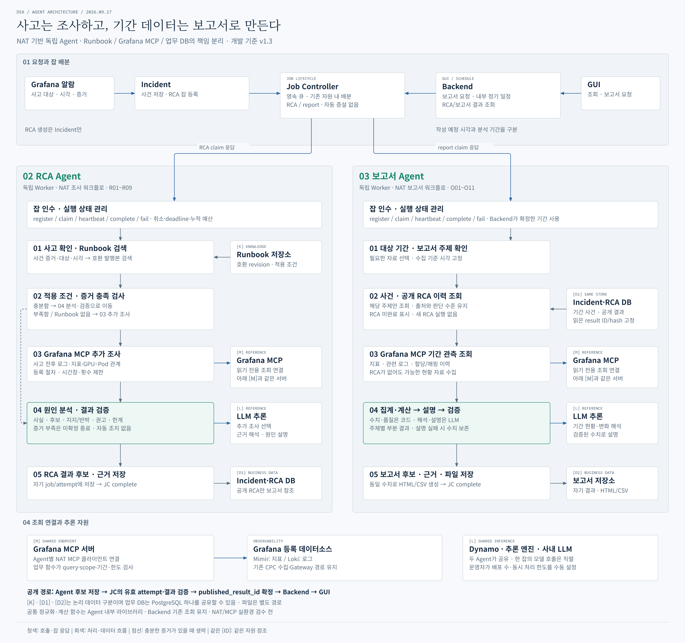

# DSX 전체 개발 구조 v1.3 · NAT Agent 개정

2026-09-17 · [개발 산출물](../deliverables-20260917-v1.3/00_산출물_안내.md) 기준 · NAT/Grafana MCP 실환경 연동 전 목표 구조

## CPC·CSC 전체 환경 — hall architecture

[hall architecture — PNG](hall%20architecture.png) · [HTML 원본](hall%20architecture.html) · [벡터 SVG](hall%20architecture.svg)

2026-09-18 작성. CPC별 Fleet·KSM·Exporter·Alloy 수집부터 CSC의 Ingest Gateway·Mimir·Loki·Object Storage·Grafana, Incident·Job Controller·Backend·두 NAT Agent, GUI·업무 DB·Runbook·보고서 파일·공유 추론까지 한 장에 표시했다. 녹색 경계는 이 레포의 CSC 서비스 범위다. Frontend와 업무 저장·설정도 레포 범위에 포함된다. CPC/CSC는 역할 경계이며 실제 Kubernetes 클러스터나 노드 배치를 확정한 그림은 아니다.

관측 저장소의 기술적인 tenant와 CPC 조회 필터를 포함하되 로그인·인증·권한 흐름은 제외했다. [데이터 설계서](../deliverables-20260917-v1.3/03_데이터_설계서.md)에 기록된 Mimir 공통 tenant `cpc-1` + 대상 `cluster_id` 필터, CPC-2 Loki tenant `cpc2` + `cluster=cpc2`를 구분했다. CPC-1 Loki 값과 정확한 datasource UID·CPC selector는 C02 연결 설정에서 확인한다. 이 값들은 수집 환경 기록으로 현 배포에서 재확인해야 하며, 라벨 필터를 사용자 접근 권한이나 보안 격리로 취급하지 않는다.

CPC-2 직접 scrape 경로의 근거는 [수집 검증 기록](../../docs/evidence/CPC-2_수집검증_20260915.md)이다. CPC-1의 배포 구성을 동일하다고 단정하지 않았다. 첨부된 과거 전체 구조도는 CPC·CSC 관측 환경의 범위를 참고했고, 업무 모듈은 현재 v1.3의 독립 모듈·NAT/MCP 구조로 표시했다. Object Storage의 연결·보존 정책과 추론 모델·자원은 배포 검증 대상이다.

HTML/SVG는 **6624×3504**, PNG는 **13248×7008**이다. 한 장의 그림이며 브라우저에서 확대하거나 SVG 원본으로 확인할 수 있다. 글자 경계·비대상 노드 관통·SVG/HTML 접근성·파일 링크를 검사하고 PNG를 육안 확인했다. PNG는 시스템 대체 글꼴로 렌더링했다. 개발 명세나 구현을 변경한 것이 아니며, NAT/MCP 실환경 통합 시험은 수행하지 않았다.

## CSC 업무 중심 전체 시스템 — full architecture

[full architecture — PNG](full%20architecture.png) · [HTML 원본](full%20architecture.html) · [벡터 SVG](full%20architecture.svg)

Frontend·Backend·Incident·Job Controller·두 NAT Agent, 업무 DB·보고서 파일, Grafana MCP·관측 데이터소스·CPC 수집 기반·공유 추론과 운영자 수동 배포를 한 장에 표시했다. DB 읽기·쓰기, Agent의 MCP/LLM 호출, Backend의 기존 관측 조회·보고서 다운로드를 실제 연결선으로 표현했다. 반복 응답선은 생략하며 반원으로 넘는 교차선은 서로 연결되지 않는다.

HTML/SVG는 3840×2976, PNG는 **7680×5952**다. 브라우저 글자 경계·비대상 노드 관통·접근성 검사를 수행하고 PNG를 육안 확인했다. PNG는 시스템 대체 글꼴로 렌더링했다. 아래 상세 구조도와 동일한 v1.3 설계를 표현하며 새 모듈이나 API를 추가하지 않는다.

## Agent 상세 구조

[상세 구조 PNG](dsx-job-controller.png) · [HTML 원본](dsx-job-controller.html) · [벡터 SVG](dsx-job-controller.svg)

## 실행 경로

| 기능 | 경로·책임 |
|---|---|
| RCA 생성 | Grafana → Incident → Job Controller → RCA Agent |
| RCA 조회 | GUI → Backend → 저장 사건·결과 |
| 즉시 보고서 | GUI → Backend → Job Controller → 보고서 Agent |
| 정기 보고서 | Backend 내부 스케줄러 → 동일 보고서 큐 |
| 잡 배분 | 처리 여유가 있는 Agent가 pull, Job Controller가 한도 내 claim 응답 |
| 용량 변경 | 운영자가 Agent 배포 수·자원·동시성 설정을 수동 조정 |
| RCA 내부 | NAT: 사고 확인 → Runbook 검색·적용 검사 → 필요한 MCP 추가 조회 → 분석·검증 → 후보 저장 |
| 보고서 내부 | NAT: 기간·주제 확인 → 필요한 공개 RCA 이력·MCP 관측 조회 → 계산·설명·검증 → 후보·파일 저장 |

Job Controller는 영속 큐·잡 배분·점유/완료·제한 재시도만 관리한다. CPU/GPU·Pod·레플리카를 생성하지 않는다. 자원이 부족하면 잡을 큐에 보존하고 다음 실행 기회를 기다린다. Chatbot·독립 달력 Scheduler·자동 확장·제품 인증은 이번 구조에 없다.

RCA·보고서 Agent는 독립 실행·배포 모듈이다. Agent가 DB의 jobs를 직접 점유하지 않고 Job Controller API로 인수한다. 결과 후보와 근거는 Agent가 저장하고 공개 final 참조는 Job Controller가 유효 attempt를 확인한 뒤 확정한다.

## Agent별 자료와 책임

| 자료/구성 | RCA | 보고서 |
|---|---|---|
| Runbook [K] | 호환 발행본과 적용 조건·필수 증거 확인 | 기본 흐름에서 직접 조회하지 않음 |
| Incident·RCA DB [D1] | 사고 snapshot 읽기, 자기 분석 후보·근거 저장 | 기간 사건과 공개 RCA 결과만 읽기 |
| Grafana MCP [M] | 사고 전후 지표·로그·GPU–Pod 관계 조사 | 보고서 기간의 지표·관련 로그·매핑 이력 수집 |
| LLM [L] | 등록된 추가 조사 선택, 원인 후보·근거 해석 | 코드로 계산한 수치의 해석·설명 |
| 보고서 저장소 [D2] | 사용하지 않음 | 자기 결과·근거·HTML/CSV 저장 |

Runbook이 있어도 실제 사고의 적용 증거를 확인한다. 증거가 충분할 때만 추가 관측 조회를 생략하며 미일치·부족 시 등록 절차와 예산 안에서 조사한다. 원인 불명도 근거·한계와 함께 저장한다. 권고는 실제 장비 조치가 아니다.

보고서는 주제에 필요한 자료만 읽는다. RCA가 없는 기간에도 가능한 현황·사용량 보고서는 작성하고, 사건은 있으나 분석이 미완료이면 그대로 표시한다. 작성 중 참조한 사건 snapshot·공개 RCA ID/hash를 고정하며 새 RCA를 실행하지 않는다.

Grafana MCP는 각 Agent의 NAT MCP 클라이언트와 Grafana 등록 데이터소스 사이의 조회 연결이다. Mimir/Loki 수집 기반과 Backend 기존 조회 경로는 유지한다. 공통 정규화·계산 코드는 두 Agent 내부에서 재사용하며 중앙 공통 업무 서비스로 배포하지 않는다.

## 표시와 명세 연결

청색은 호출·잡 인수 응답, 회색 실선은 처리·데이터 흐름, 점선은 증거가 충분해 추가 조회를 생략하는 경로다. 단계 번호는 각 Agent 내부 순서이며 별도 서비스가 아니다. 같은 [M]/[L]/[D1] 표시는 동일 자원의 반복 참조로서 중복 배포를 뜻하지 않는다. [K]/[D1]/[D2]는 논리 데이터 구분이며 업무 DB는 PostgreSQL 하나를 공유하고 보고서 파일은 별도 경로에 저장한다.

한 장에서 Agent 내부를 읽기 쉽게 보여주기 위해 Worker의 heartbeat·취소·완료 왕복선, 반복 DB 의존선, GUI 조회 응답선은 생략했다. 실행부 상자와 아래 공개 경로 설명이 해당 계약을 표시한다. RCA 입력의 사건 증거는 [D1]에서 읽고 Runbook은 [K]에서 읽는다. LLM [L]은 RCA 조사 선택과 분석 단계에서 사용한다. 자동 증설 없이 기존 자원 안에서 claim하는 정책은 유지한다.

[Backend·일정](../deliverables-20260917-v1.3/02_백엔드_API_작업명세서.md) · [Job Controller](../deliverables-20260917-v1.3/10_Job_Controller_모듈_설계서.md) · [RCA](../deliverables-20260917-v1.3/11_RCA_Agent_모듈_설계서.md) · [보고서](../deliverables-20260917-v1.3/12_보고서_Agent_모듈_설계서.md) · [Incident](../deliverables-20260917-v1.3/13_Incident_모듈_설계서.md) · [공통 계약](../deliverables-20260917-v1.3/14_모듈간_호출과_공통실행_계약.md)

HTML/SVG는 2640×2480, PNG는 5280×4960이다. 접근성·자체 포함 검사, 브라우저 글자 경계 및 PNG 육안 검사를 수행했다. 이번 PNG 렌더링에서는 원격 웹폰트가 로드되지 않아 시스템 대체 글꼴을 사용했다. 동일 외형으로 공유할 때는 PNG를 사용한다. NAT/MCP·모델·DB 제품 통합 시험은 NOT RUN이다.
