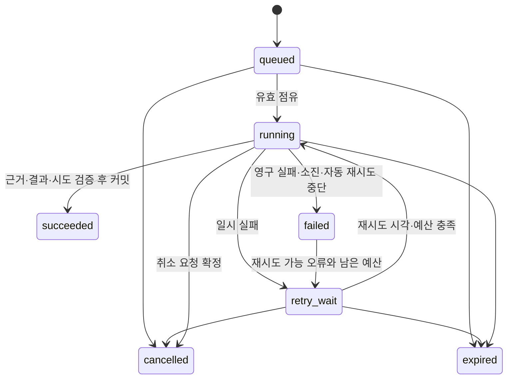

# 02. DSX 백엔드·API 작업 명세서

문서 ID: DSX-BE-001 · 버전: 1.1 · 기준일: 2026-09-16 · 상태: 개발 기준

대응 요구사항: F01~F14, N01~N04. 이 문서의 경로와 DTO는 신규 구현 계약이며 배포된 API 목록이 아니다.

## 1. 실행 단위와 처리 책임

| 실행 단위·모듈 | 책임 | 저장 책임 |
|---|---|---|
| API 서버: 사용자·대화 | 인증·범위·입력 검증, 가벼운 조회·대화, 전문 작업 접수, 결과 조회 | 대화, 요청, 권한·설정 변경 |
| API 서버: Incident | Grafana 수신, 원본 정규화, 중복·재발, 사건 갱신, RCA 접수 | 수신 기록·관측·사건·작업을 같은 트랜잭션으로 처리 |
| API 서버: 작업·일정 | 공통 작업 원장·상태 변경, 정기 발생, 취소·재시도·결과 확정 | jobs, schedules, 결과 참조 |
| RCA Worker | 해당 유형 작업 점유, 근거 조사, 원인 후보·권고 작성 | 공통 저장 모듈을 통해 근거·결과·점유 갱신 |
| 보고서 Worker | 주제별 조회·집계·설명, 결과 출력 | 동일 공통 저장 모듈을 통해 저장 |
| 조회·계산 모듈 | 저장소별 대상 해석, 등록 조회, 식별·시간·품질·계산 | 필요한 관계·관측·근거 저장 |
| Knowledge 모듈 | 호환 지식 검색, 초안·검토·발행 | 불변 발행 revision, 변경 감사 |
| LLM 모듈 | Endpoint 호출, 공유 한도·토큰·timeout, 응답 검증 | 호출 점유·실행 기록 |

Worker는 공통 저장 모듈로 DB의 원자적 점유·완료 함수를 사용한다. Worker→API 내부 HTTP 서버를 별도 필수 구성으로 추가하지 않는다. 공유 코드가 동일 규칙으로 상태를 변경하고 DB 조건으로 경합을 방어한다.

## 2. API 공통 계약

| 항목 | 계약 |
|---|---|
| 기본 경로·형식 | `/api/v1`, JSON UTF-8. 식별자는 불투명 문자열로 전달 |
| 인증 | C01에서 정한 사내 인증과 연계. 서버가 검증한 principal 사용. 브라우저 세션 쿠키 방식이면 HttpOnly/Secure·CSRF 보호 적용 |
| 시간 | RFC3339의 명시적 UTC offset 필수. 저장은 UTC, 기간은 `[start,end)`. `timezone`은 표시·달력 경계 계산용 IANA 이름 |
| 범위 | `scope.clusters`의 CPC별 `{cluster_id,namespaces}` 조합 필수. namespaces=null은 CPC 전체이며 전역 grant 필요, 배열은 그 Namespace만. 빈 배열·중복 CPC·종전 평면 scope는 422, 권한 밖 명시 조합은 403 |
| 자산 | GPU/Pod/Node 식별자의 소속·시점 검증. 배열의 다른 CPC 대상, 외부 결과·근거 참조도 개별 검증 |
| 페이지 | 목록은 `limit` 기본 50·최대 200, 불투명 cursor. 정렬 `(created_at DESC,id DESC)` 또는 API별 명시 정렬 |
| 생성 | 일반 리소스 201, 전문 작업은 커밋 후 202와 `job_id`. DB 저장 실패는 접수 성공으로 응답하지 않음 |
| 멱등성 | 작업 생성·수동 retry/cancel·메시지 제출에 Idempotency-Key, Webhook에 생산자 중복 키 적용. 권한 확인→기존 명령 기록→최초 요청만 If-Match 검사. 같은 키·다른 정규화 본문은 409 |
| 변경 경합 | version/ETag 반환. PATCH와 종결 상태 변경은 `If-Match` 필수. 누락 428, 오래된 버전 412 |
| 검증 | 열거값·날짜·범위·문자열 길이·본문 크기·정렬 필드를 서버 allowlist로 검사. query ID별 매개변수 스키마 적용 |
| 리소스 제한 | 최대 조회 기간·로그량·본문/대화 크기·작업 접수량은 C07 프로필에 양수 상한 필수. 미설정이면 해당 접수 비활성 |
| 보안 응답 | 비밀·내부 원문 스택·타 CPC 라벨을 오류에 포함하지 않음. 존재 자체를 숨겨야 하는 타 사용자 리소스는 404 |

정상 목록은 `{items:[], next_cursor:null}`. 상세 응답은 리소스 객체와 `request_id`를 포함한다. 오류는 다음 형식을 사용한다.

HTML 출력은 원문·모델·사용자 텍스트를 이스케이프하고 허용된 서식만 렌더링한다. CSV는 표준 quoting과 함께 `=`, `+`, `-`, `@` 등으로 수식 해석될 수 있는 문자열 셀을 안전한 텍스트로 출력한다. 실제 숫자 필드는 숫자로 유지한다. 파일명·콘텐츠 타입을 서버에서 정하고 비밀·권한 밖 데이터가 포함되지 않게 한다.

```json
{
  "error": {
    "code": "INVALID_TIME_RANGE",
    "message": "시작 시각은 종료 시각보다 빨라야 합니다.",
    "details": {"field": "time_range"}
  },
  "request_id": "example-request"
}
```

HTTP 400/422는 형식·의미 오류, 401 인증 필요, 403 권한 없음, 404 리소스 없음, 409 멱등/상태 충돌, 413 크기 초과, 429 접수·호출 한도, 503 저장·의존 서비스 불가다. 429는 `Retry-After`를 반환한다. 유효한 조회의 데이터 부재는 200과 결과 품질/도구 상태로 표현하며 서버 오류와 구분한다.

## 3. API 목록

표의 모든 읽기·변경은 범위 검증을 전제로 한다. 개별 ID 상세 조회·파일 출력·재분석에서도 검사한다.

| 구분 | Method·경로 | 입력·처리 | 출력 |
|---|---|---|---|
| 권한 | GET `/me` | 인증 principal | 역할·허용 scope·장비 관측 권한 |
| 권한 관리 | GET/PATCH `/settings/access-grants` | 별도 manage_access 권능, If-Match, grant 목록·변경 사유 | grants 원자적 변경·감사·권한 캐시 무효화 |
| 대상 | GET `/clusters` | 허용 CPC | CPC·수집 상태·기준 시각 |
| 대상 | GET `/assets` | cluster, kind=node/gpu/pod, namespace, cursor | 자산 키·표시명·신원 상태 |
| 대시보드 | POST `/dashboard/query` | scope, time_range | 관측 품질·사건·할당 요약·근거 |
| 매핑 | POST `/mappings/query` | scope, GPU 또는 Pod, at 또는 time_range 중 하나 | 03의 관계·신원·시간·품질 |
| 관측 | POST `/observations/query` | query_id, scope, target, time_range, parameters | 도구 상태·값·단위·품질·근거 |
| 근거 | GET `/evidence/{id}` | 근거 ID | 허용된 요약·스냅샷·원문 접근 가능 상태 |
| 사건 | GET `/incidents` / GET `/incidents/{id}` | scope, 상태·기간·자산, cursor | 사건·관측·관련 분석·version |
| 사건 | PATCH `/incidents/{id}` | If-Match, status, reason | 상태·변경 이력. close에는 종결 이유 필수 |
| 수신 | POST `/webhooks/grafana/{profile_id}` | 검증된 원문·전용 인증 | 커밋 후 수신 ID·사건/작업 참조·중복 여부 |
| RCA | POST `/analyses` | 아래 RCA 요청, Idempotency-Key | 202, job_id=analysis_id, 상태 URL |
| RCA | GET `/analyses` / GET `/analyses/{id}` | scope·기간·대상·cursor 또는 ID | 작업·최종 결과·이전 실행 참조 |
| 보고서 | POST `/reports` | 아래 보고서 요청, Idempotency-Key | 202, job_id=report_id, 상태 URL |
| 보고서 | GET `/reports` / GET `/reports/{id}` | scope·기간·주제·cursor 또는 ID | 작업·주제별 결과·근거·버전 |
| 출력 | GET `/reports/{id}/export?format=html\|csv` | 저장된 보고서 ID | HTML 보고서 또는 집계 CSV. 원본 결과 재계산 없음 |
| 작업 목록 | GET `/jobs` | kind, status, from/to, scope, cursor, limit | 허용 범위의 안전한 작업 DTO 목록·안정 정렬 |
| 작업 | GET `/jobs/{id}` | 해당 분석/보고서 읽기 권한 | 상태·단계·시도·종료 이유·결과 참조·허용 행동 |
| 취소 | POST `/jobs/{id}/cancel` | If-Match, reason, Idempotency-Key | 종결 전이면 cancelled 또는 running의 cancel_requested; 완료 후 최초 취소면 409 |
| 재시도 | POST `/jobs/{id}/retry` | If-Match, reason, Idempotency-Key | 서버가 판단한 재시도 가능 failed만 retry_wait. 임의 단계 건너뛰기 불가 |
| 일정 | GET/POST `/schedules` | 생성 시 보고서 조건·달력 일정 | 목록 또는 201 일정 ID·다음 발생 시각 |
| 일정 상세 | GET `/schedules/{id}` | 소유자 또는 관리 권한 | revision·조건·effective_at·다음 시각·blocked 사유 |
| 일정 이력 | GET `/schedules/{id}/occurrences` | revision/status/from/to/cursor/limit | 발생 시각·고정 기간·accepted/missed/blocked·job_id·사유 |
| 일정 | PATCH `/schedules/{id}` | If-Match, 조건 변경·enabled | 새 revision·다음 시각. 소유자/관리자만 변경 |
| 대화 | GET/POST `/conversations` | 본인 대화 목록 / scope·제목 | 대화 ID·맥락 |
| 대화 | GET/POST `/conversations/{id}/messages` | 질문·허용 맥락·Idempotency-Key | 저장된 메시지 또는 설명·등록 조회 결과·전문 job 참조 |
| 메시지 복구 | GET `/conversations/{id}/messages/{message_id}` | 본인·현재 범위 권한 | 메시지 처리 상태·응답·고정 맥락/모델·전문 job 참조 |
| 기록 | GET/POST `/reviews` | 대상 종류·ID, 의견 또는 실제 조치 | 작성자·발생/입력 시각·근거·수정 전 기록 참조 |
| 지식 | GET `/knowledge` / GET `/knowledge/{id}/revisions/{rev}` | kind·코드·증상·호환 조건 | 발행 목록·상세. 관리자만 초안 조회 |
| 지식 | POST `/knowledge` / POST `/knowledge/{id}/revisions` | 초안 내용·근거·지원 범위 | 새 초안 ID/revision |
| 지식 | PATCH `/knowledge/{id}/revisions/{rev}` | If-Match, 초안 내용 | 초안만 수정. 검토 후 수정 시 재검토 필요 |
| 지식 | POST `/knowledge/{id}/revisions/{rev}/review` | If-Match, action=request/approve/request_changes, comment, evidence_refs? | draft→in_review→reviewed 또는 draft |
| 지식 | POST `/knowledge/{id}/revisions/{rev}/publish` | If-Match, 검토된 revision | 발행 기록·내용 hash. 관리 권한 필수 |
| 지식 | POST `/knowledge/{id}/revisions/{rev}/retire` | If-Match, 사유 | 신규 실행 선택 중단. 기존 실행 참조 유지 |
| 조사 절차 | GET `/knowledge/procedures` | 허용된 증상·procedure ID/version 필터 | 등록 코드 절차의 읽기 전용 메타데이터 |
| 모델 | GET/POST `/models` | 서비스 관리자, 모델 프로필 입력 | 목록 또는 모델 프로필 ID·revision |
| 모델 | GET/PATCH `/models/{id}` | 서비스 관리자, If-Match, 프로필 또는 enabled 변경 | 비밀 제외 모델 설정·revision |
| 연결 검사 | POST `/models/{id}/test-connection` | 관리자, 검사할 revision | transport/schema 각각 상태·검사 시각·오류. 품질 합격을 의미하지 않음 |
| 모델 지정 | GET/PATCH `/model-routes` | 관리자, If-Match, assistant/rca/report별 모델 참조 | 역할별 모델 ID·revision 및 라우팅 revision |
| 운영 | GET `/service-status` | 서비스 관리자 또는 제한된 상태 조회 | 경로별 신선도·큐·Worker·추론 상태 |
| 설정 | GET/PATCH `/settings/{profile_id}` | 관리자, If-Match, 허용 설정 | 비밀값 제외 설정·검증 결과·revision |
| 진단 | GET `/health/live` / GET `/health/ready` | 내부 접근 | 프로세스 생존 / API 핵심 처리 준비 상태 |

## 4. 요청·응답 상세

### 4.1 공통 분석 조건

`scope={clusters:[{cluster_id,namespaces:null|[name,...]}]}`; `target={kind,cluster_id,node_uid?,node?,gpu_uuid?,pod_uid?,namespace?,pod_name?}`. target 생략은 보고서의 명시 scope 전체다. RCA는 target 또는 권한 검증된 incident_id 중 하나 이상이 필요하다. 둘 다 있으면 사건 소속·대상과 일치해야 한다. Pod 조사에서 GPU·Node 미확정은 접수 거절 사유가 아니며 허용된 CPC·Namespace·Pod 식별과 기준 시각으로 시작한다.

`/me`는 `principal,grants:[{role,cluster_id,namespace,asset_observation}],capabilities,access_revision`을 반환한다. 각 행의 role과 scope를 함께 평가한다. namespace=null은 그 행의 CPC 전역 권한이다. “접근 가능한 전체”를 고르면 UI는 이 grants에서 해당 행동의 허용 조합을 명시 scope로 만든다. 여러 행의 역할과 범위를 교차 합성하지 않는다. 저장 결과·지식·근거·모델 입력과 Worker 실행 시에도 현재 권한을 검증한다.

GET 목록의 scope 매개변수는 위 객체를 JSON으로 직렬화한 뒤 URL 인코딩한 값이다. 생략 시 해당 조회 행동의 현재 허용 조합만 서버가 사용한다. from/to는 created_at의 반개구간 필터이며 정렬은 `(created_at DESC,id DESC)`. cursor는 필터·정렬 조건을 포함해 검증한다. schedule occurrences는 `(scheduled_for DESC,id DESC)`다.

`time_range={start,end}`, `timezone`, `parent_job_id?`, `conversation_id?`를 공통 사용한다. 부모·대화는 허용된 동일 목적/범위 맥락만 연결한다. 다른 범위의 결과를 새 scope로 재포장할 수 없다.

RCA는 `incident_id?`, `incident_time?`, `symptom`, `purpose_ids`(R01~R09)를 받는다. 사건이 있으면 사건 시각을 기본으로 사용하고 다른 시각 요청은 조사 범위로 명시한다. 사건 없는 사용자 조사는 Incident를 가짜로 만들지 않는다.

보고서는 `topic_ids`(O01~O11), `group_by`(cluster/model/node/namespace/pod/workload), `comparison_range?`, `action_record_ids?`, `resource_selectors?`를 받는다. action_record_ids는 O10의 실제 조치 review UUID 목록이다. time_range는 조치 후, comparison_range는 비교 전 기간으로 명시한다. 조치 기록이 없으면 기간 비교만 제공하고 인과적인 조치 효과는 보류한다. resource_selectors는 O07의 `{cluster_id,resource_name,unit}` 배열이며 등록된 `resource_catalog` query 결과에서 고른다. 미확인 resource 단위는 0으로 가정하지 않는다. Workload 이력이 없으면 Pod 수준 유효 결과와 집계 제한을 반환한다.

```json
{
  "scope": {"clusters": [{"cluster_id": "cpc-1", "namespaces": ["dev"]}, {"cluster_id": "cpc-2", "namespaces": ["prod"]}]},
  "time_range": {"start": "2026-09-07T00:00:00+09:00", "end": "2026-09-14T00:00:00+09:00"},
  "timezone": "Asia/Seoul",
  "topic_ids": ["O02", "O03", "O05", "O11"],
  "group_by": ["cluster", "namespace", "pod"]
}
```

```json
{
  "job_id": "7af117a4-c4bb-4b57-8f0b-d08fc88bfd1c",
  "report_id": "7af117a4-c4bb-4b57-8f0b-d08fc88bfd1c",
  "status": "queued",
  "status_url": "/api/v1/jobs/7af117a4-c4bb-4b57-8f0b-d08fc88bfd1c",
  "request_id": "example-request"
}
```

GET job는 `id,kind,status,stage,attempt_no,created_at,started_at,deadline_at,cancel_requested_at,termination_reason,result_ref,result_status,narrative_status,can_cancel,can_retry,version`을 반환한다. result가 없으면 result_status와 narrative_status는 null이다. 허용된 결과를 읽는 조회자에게도 안전한 job 상태는 제공하되 원본 요청·Worker 내부·민감 로그는 포함하지 않는다. 취소/retry는 소유 운영자 또는 해당 업무 관리가 허용된 서비스 관리자만 가능하다. can_cancel/can_retry는 UI 안내값이며 변경 시 권한·deadline·version을 다시 검증한다. poll_after_ms는 v1.1 응답에 넣지 않고 UI는 운영 설정의 간격·backoff를 사용한다. 최종 result_status 요약은 04에서 계산·저장하며 FE가 주제 상태를 추정하지 않는다.

`GET /jobs/{id}` 상세에는 `attempts`도 포함한다. 소유 운영자 또는 해당 업무 관리가 허용된 관리자에게만 `attempt_no,started_at,finished_at,stage,termination_reason,error_code`의 안전한 요약 배열을 시도 번호 오름차순으로 반환하고 그 외에는 null이다. finished_at과 stage는 job_attempts의 ended_at과 last_stage를 매핑한다. 원문 오류·Worker 주소·민감한 체크포인트를 노출하지 않으며 목록에는 이 배열을 싣지 않는다.

Knowledge 경로의 `{id}`는 revision별 ID가 아닌 불변 `knowledge_id`이며 `{rev}`는 해당 지식의 revision 번호다. 생성 응답에는 knowledge_id·revision·revision_id를 모두 반환한다. 조회자·일반 대화에서 전문 작업이 필요해도 운영자 권한이 없으면 작업을 생성하지 않고 권한 부족을 안내한다.

### 4.2 정기 일정

입력은 `frequency=daily|weekly|monthly`, `local_time=HH:mm`, `timezone`, 주간이면 `weekday=1..7`, 월간이면 `day=1..31`, `period=previous_complete_day|week|month`, `enabled`, 보고서 조건이다. frequency와 period는 각각 대응하는 값을 사용한다. 월간 실행일이 없는 달은 말일을 사용한다. 주간 기간은 월요일 00:00부터 다음 월요일 00:00까지다.

기간은 일정 시간대의 완료된 달력 구간을 UTC로 변환한다. 서머타임으로 없는 실행 시각은 다음 유효 시각, 중복 시각은 첫 번째 발생을 선택하고 UTC 발생 ID를 저장한다. 중단 복구는 C08의 catch-up 기간·최대 건수 안에서 누락 발생을 접수하고 나머지는 missed 기록으로 남긴다. 자동으로 모든 과거 보고서를 무제한 생성하지 않는다.

일정 소유자의 권한은 생성·수정·실행 시 재확인한다. 권한 상실 시 일정은 차단 상태와 사유를 기록하며, scope를 조용히 바꿔 보고서를 생성하지 않는다.

일정 수정은 schedule 행을 잠그고 커밋 시각 `effective_at`을 기록한다. 그 시각 미만의 예정 발생분은 이전 revision, 해당 시각 이상은 새 revision을 적용한다. accepted occurrence의 조건·범위·기간·job은 불변이다. 아직 접수되지 않은 이전 발생분은 이전 불변 설정 스냅샷과 현재 권한으로 catch-up 또는 missed/blocked를 판정한다. revision 변경이 과거 조건을 소급 변경하지 않는다.

스케줄러와 수정은 같은 schedule 잠금을 사용한다. 동일 `schedule_id + period_start + period_end`의 자동 보고서 접수는 revision·시각 변경과 무관하게 한 번이다. 새 revision이 이미 accepted인 같은 기간을 다시 가리키면 그 job을 참조하는 missed(reason=already_accepted_period) 발생 기록을 남긴다. 다른 시간대 때문에 실제 UTC 기간이 달라지는 경우에는 별도 기간으로 표시한다. 같은 기간을 의도적으로 다시 만들려면 POST reports의 parent_job_id로 새 사용자 작업을 접수한다. 비활성화 기간에는 새 발생을 접수하지 않고 missed를 남기며, 다시 켜도 그 기간을 자동 재생성하지 않는다.

### 4.3 실제 조치·검토

POST reviews는 `subject_type=incident|job|knowledge`, `subject_id`, `kind=comment|review|action`, `text`, `occurred_at?`, `evidence_refs?`, `supersedes_id?`를 받는다. action은 `target`, `occurred_at`, `performed_by`, `action_summary`가 필수다. 운영자가 이미 수행한 조치를 기록하며 Backend가 장비 조치를 실행하지 않는다. 수정은 새 기록으로 추가한다.

### 4.4 사내 모델과 라우팅

모델 프로필은 `name,endpoint_url,model_name,artifact_revision,engine_revision,precision,secret_ref?,enabled,capabilities,limits_profile_id`를 받는다. 문자열·URL·허용 모델 형태를 C06 계약으로 검증한다. API는 기존 service_profiles와 불변 revision 스냅샷을 재사용하며 모델 저장소를 추가하지 않는다. API 모델 ID는 profile ID다. GET에는 비밀값을 반환하지 않는다.

연결 검사는 서버에서 허용된 목적지만 제한된 시간·요청 크기로 검사한다. DNS 해석·리다이렉트 이후 목적지도 allowlist 정책을 적용한다. transport와 schema 상태는 ok/failed/not_checked로 나누고 각각 이유·검사 시각·설정 revision을 반환한다. 실제 GPU 용량·R/O 품질 평가는 C09/T40의 별도 결과다.

라우팅은 assistant/rca/report의 각 `{model_id,model_revision}`과 공통 default 참조를 보존한다. 기본·명시 라우팅에 쓰는 모델의 비활성화는 대체 라우팅을 같은 변경으로 지정하거나 409 사용 중으로 거절한다. API에서 모델을 물리 삭제하지 않는다. 이미 접수된 job·message는 고정 모델/설정 스냅샷을 계속 참조한다. 장애·폐기·보안 사유로 사용할 수 없으면 명시 실패 또는 연결된 새 요청으로 전환하고 조용한 모델 교체는 하지 않는다.

### 4.5 Assistant 메시지 복구

v1.1은 제한 시간 내 동기 JSON 응답을 사용한다. 접수 시 사용자 메시지·정규화 context/scope/time·본문 hash·모델/라우팅 revision을 먼저 저장하고 처리권을 한 번만 점유한다. 같은 `(principal,conversation_id,key)`의 같은 입력 재전송은 저장 응답을 반환하며 처리 중이면 202와 message_id·복구 URL을 반환한다. 질문·맥락·기간·범위가 다르면 409다. API 재시작 후 중단된 일반 메시지는 명시 failed로 복구하며 같은 키로 생성 처리를 자동 중복 실행하지 않는다. 다시 생성은 새 키·이전 메시지 참조를 사용한다.

메시지 상태는 accepted/processing/completed/failed다. GET messages/{id}는 `message_id,status,text,response,context,model_ref,evidence_refs,job_id,error,created_at,completed_at`을 반환한다. response가 없으면 null이다. 전문 job을 만들 때 사용자 메시지와 job의 `source_message_id`를 원자적으로 연결하고 한 메시지당 전문 job은 한 건으로 제한한다. 두 업무가 필요하면 사용자가 별도 요청으로 구분한다. 이미 연결된 job을 재전송 때문에 새로 만들지 않는다.

패널 닫기·응답 대기 중단은 로컬 표시 중단이며 서버 메시지나 전문 job 취소가 아니다. 다시 열면 같은 conversation/message를 조회한다. 전문 작업 취소는 명시적인 jobs/{id}/cancel을 사용한다. 화면 범위 변경은 이후 메시지에만 반영하며 과거 메시지 맥락·근거·모델을 변경하지 않는다.

## 5. 사건·알림 처리

1. profile별 인증·크기·스키마를 검증하고 허용 CPC를 서버 설정에서 확정한다. 원문 cluster 라벨로 권한을 확장하지 않는다.
2. 원문과 원본 시각·수신 시각·parser revision을 보존한다. production 계약에 없는 값은 unknown으로 보존한다.
3. 원본 관측 중복, 알림 재전송, Incident 상관, 분석 멱등을 별도 키로 처리한다.
4. 동일 source_event_key와 동일 의미 hash/원본 revision의 재전송만 receipt_count·last_received_at을 갱신한다. 같은 이벤트 키라도 firing→resolved 등 의미가 바뀌면 별도 관측 revision으로 보존한다.
5. 새로운 의미 있는 증거는 사건 evidence_version을 올리고 새 job을 생성한다. 단순 수신 시각 변경은 증거 변경이 아니다.
6. 사건과 분석 접수를 같은 DB 트랜잭션에서 커밋한 뒤 응답한다. 처리 실패는 Webhook 재전송으로 복구 가능해야 한다.

알림 `firing/resolved`는 생산자 상태다. Incident는 `open→investigating→resolved→closed`를 사용한다. **같은 episode**의 정정·추가 근거는 기존 사건의 evidence_version을 올리고 새 분석으로 연결하며 필요 시 resolved/closed→open으로 재개한다. **새 episode**의 재발은 새 Incident와 recurrence_of로 기록한다. resolved 전환에는 운영 판단 또는 명시적인 검증 정책 근거가 필요하다. Grafana resolved·RCA succeeded만으로 자동 종결하지 않는다.

상관 키는 CPC·해결된 자산·증상·생산자 계약·발생 episode를 사용한다. episode의 시간창은 오류 종류별 C08 정책값이다. 알림 fingerprint만으로 시간상 다른 재발을 영구 합치지 않는다. 별도 재발 사건은 `recurrence_of`로 이전 사건과 연결한다.

episode 경계를 판단할 수 없으면 원본 관측을 correlation_status=unknown으로 보존하고 기존 확정 episode에 임의 합치지 않는다. 사건률 산정에는 확정 episode만 사용하고 미해결 관측 건수를 별도 표시한다. 여러 GPU 항목을 가진 원문은 자식 항목별 식별·의미 hash를 보존해 모두 처리한다.

새 알림 없는 사건의 재확인은 S07의 명시적인 ‘상태 다시 확인’으로 같은 incident_id의 새 RCA(R01/R09) job을 접수하는 방식을 채택한다. 그 시각의 근거와 운영자 판단을 기록한다. 별도 자동 재조회 모니터를 추가하지 않는다. 원문 조회 실패·유효하지 않은 Healthy는 회복 근거가 아니며 04의 검사 유효성 표를 적용한다.

## 6. 영속 작업·동시 실행



- DB 행 잠금과 `SKIP LOCKED`로 실행 가능한 자기 유형 job을 짧은 트랜잭션 안에서 선택·점유한다. 조회·LLM 동안 트랜잭션을 열어 두지 않는다.
- 점유 시 `attempt_no`를 올리고 Worker ID·lease 만료를 기록한다. heartbeat는 현재 attempt에 대해서만 갱신한다.
- 점유와 동시에 job_attempts에 시작을, 종료·회수와 동시에 해당 attempt의 종료 원인·오류·단계·heartbeat를 기록한다. 현재 상태 원장은 jobs 한 곳이며 과거 이력은 덮어쓰지 않는다.
- 완료 시 현재 attempt·lease 유효성·취소 미요청·deadline을 함께 검증한다. 근거와 최종 결과 참조, succeeded 전환을 한 트랜잭션에서 확정한다.
- Worker 장애 후 만료된 점유는 제한된 재시도로 회수한다. 이전 Worker의 늦은 결과는 발행하지 않는다. 외부 호출은 중복될 수 있으므로 ‘추론 exactly once’를 보장하지 않는다.
- 자동/수동 재시도는 같은 job의 attempt이며 전체 deadline·예산을 새로 시작하지 않는다. 새 증거·의도적 재생성은 `parent_job_id`를 가진 새 job이다.
- 성공 결과는 한 job당 하나다. retry용 중간 근거는 final이 아니며 저장된 정상 결과를 덮어쓰지 않는다.
- 취소 요청 자체는 `cancel_requested_at`에 즉시 기록한다. 실행 중에는 Worker/회수기가 취소를 확정하고 결과 발행을 막는다. 완료가 먼저 원자적으로 확정됐으면 취소는 409다.

멱등 키 범위는 `(principal,operation,key)`와 정규화 request hash다. 사건 분석은 `(incident,evidence_version,analysis_profile_version)`, 일정은 `(schedule,revision,scheduled_for_utc)`를 함께 유일하게 관리한다. 동일 키의 보존 기간은 적어도 관련 job 보존 기간을 포함한다.

수동 retry/cancel은 job 생성 키와 별도의 command_receipts에 `(principal,operation,resource_id,key)`·정규화 hash·처리 결과를 저장한다. 현재 인증/권한 검사 후 같은 키 기록을 먼저 조회한다. 같은 본문으로 이미 적용된 명령이면 당시 응답/참조를 반환하고 최신 상태 URL을 제공한다. 재전송에 담긴 오래된 If-Match 때문에 성공했던 명령을 다시 실패로 취급하지 않는다. 최초 요청일 때만 If-Match와 현재 상태를 검사하고 명령 결과·상태 변경을 같은 트랜잭션으로 기록한다.

failed의 수동 재시도는 일시 오류로 자동 진행이 중단됐지만 전체 예산·deadline이 남은 경우만 허용한다. 영구 입력/권한/호환 오류·시도 소진·deadline 초과는 새 요청으로 처리한다. FE가 전송한 임의 stage는 받지 않고 서버가 검증한 체크포인트만 재사용한다. 결과 final을 이미 발행했으면 설명만 다시 만들 때도 parent_job_id를 가진 새 job이다.

## 7. 공유 한도·실패 처리

긴급 RCA 우선순위는 서버에서 검증한 사건 심각도로 정한다. 오래 대기한 보고서는 C07의 최대 우선 대기 정책에 따라 실행 기회를 얻는다. 진행 중인 모델 추론의 즉시 선점을 전제하지 않는다.

LLM 호출은 일반 Assistant·RCA·보고서가 같은 공유 한도를 사용한다. DB 기반 슬롯/호출 점유와 토큰 예산을 확보한 뒤 제출한다. HTTP timeout 뒤 원격 종료가 불명확하면 `unknown` 호출로 기록하고, 종료 확인 또는 C07의 검증된 최대 원격 수명까지 슬롯을 함부로 재사용하지 않는다. 원격 수명 상한을 보장할 수 없는 배포는 조정 절차 전까지 해당 슬롯을 격리한다.

슬롯과 함께 검증된 입력 토큰 추정 상한+출력 상한을 원자적으로 예약한다. C07의 공유 예산 기간·principal·job/message 누적 한도별로 활성 예약+이미 사용한 값을 검사한다. 동시 호출이 같은 잔여량을 각각 사용하지 않도록 동일 예산 키를 잠그고 reservation을 기록한다. 완료 시 실제 사용량으로 정산하고 잔여 예약을 반환한다. token usage가 불명확한 실패/unknown 호출은 예약량을 유지하며 검증된 종료 후에도 사용량을 알 수 없으면 예약 상한을 소비량으로 처리한다. 재시도는 기존 job 누적 예산에 합산한다.

| 실패 | 처리 |
|---|---|
| 입력·권한·호환 설정 오류 | 영구 실패 또는 접수 거절. 자동 반복 안 함 |
| 데이터 없음·품질 부족 | 해당 주제 blocked/partial. 정상적으로 저장했다면 job succeeded 가능 |
| 일부 저장소 실패 | 독립 결과·근거 보존, 실패 입력 명시. 전체 수행 불가면 failed |
| 일시 네트워크·과부하 | deadline 내 제한된 지수 backoff+jitter. 하위 자동 재시도와 합산 |
| LLM 설명 실패 | 계산·근거 보존, narrative_status=failed/omitted. 허용 시 구조화 결과를 final로 발행 |
| 저장 실패 | succeeded 금지. 같은 attempt 또는 회수 후 저장 재시도 |
| 취소·마감 후 응답 | 진단 기록만 보존, 최종 성공 결과로 발행하지 않음 |

일반 대화는 C07의 짧은 대화 timeout 안에서 처리한다. 실패 메시지는 실패 상태로 남기고 같은 메시지 키 재전송으로 이중 저장하지 않는다. 장시간 전문 분석은 job으로 전환한다.

## 8. 구현 완료 확인

각 API는 요청·성공·오류 예시와 인증·범위·멱등 검증을 제공한다. 기존 구조에 맞는 한 언어/프레임워크의 API 서버와 Worker를 사용하고, 공통 DTO·저장 모듈을 공유한다. 런타임/DB 버전·실제 Endpoint·수치 한도는 [06 인계서](<06_배포_운영_인계서.md>)의 C01~C12를 적용한다.

검증은 [05 테스트 기준서](<05_테스트_검수_기준서.md>)를 따른다. 결과·데이터 계약은 [03](<03_데이터_설계서.md>), 판단·출력은 [04](<04_Agent_동작_판단_명세서.md>)를 참조한다.
