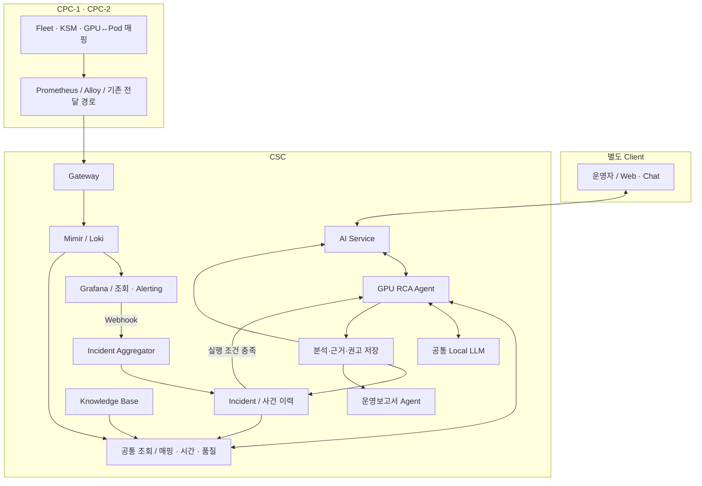

# DSX GPU RCA Agent — 역할, 조사 흐름, 데이터 설계

작성일: 2026-09-15 · 버전: 1.0 (공통 기준 1.0 반영 개정) · 대상: 서비스 기획자, 운영자, 개발자

2026-09-16 개정: 사건·분석 접수의 영속성, 작업 재시도·취소와 Dynamo 호출 경계를 추가했다. 수집 현황의 후속 변경은 공통 기준 문서 상단의 분석 메모를 참고하며, 이번 개정은 작업 실행 설계에 한정한다.

**공통 기준:** 상태·식별·시간·계산·품질·판단 수준의 원본은 [두 Agent 공통 판단 기준과 인사이트 사례 v1.0](<../../share/DSX_Agent_공통판단기준과_인사이트사례_v1.0.md>)이다. 처음 공유할 때는 그 문서를 먼저 읽는다. 본문은 사건 조사에 대한 적용 설명이며 공통 정의를 별도로 변경하지 않는다.

**설계 전제:** CPC-1·CPC-2의 관측 데이터를 CSC에서 조회할 환경이 구축됐으며, 사용자 최신 확인에 따라 Pod↔GPU UUID 매핑을 활용할 수 있는 것으로 본다. 현재 매핑을 출발점으로 작업과 관련된 GPU 사건을 조사한다. 과거 매핑 이력·Pod UID 보완·업무 실패 로그 등은 필요한 판단별로 구분한다.

이 문서는 구현할 서비스의 역할과 계약을 정의한다. Agent 개발·배포·실환경 조회를 수행한 결과가 아니며, 사례의 장치·작업·시각은 설명용 가상 값이다.

수집 경로·메트릭 지원·선택 설정·중앙 수신의 구분은 [공통 데이터 수집·메트릭 조사 문서](<../../share/DSX_공통_데이터수집경로와_메트릭조사_2026-09-15.md>)를 함께 따른다. 참고 소스의 기능 존재를 실제 운영 수신 완료로 간주하지 않는다.

## 1. RCA Agent가 제공할 결과

GPU 오류가 발생하면 운영자는 오류 코드의 뜻뿐 아니라 다음 내용을 알아야 한다.

1. 어느 CPC·노드·GPU에서 무엇이 관측됐는가?
2. 그 GPU와 연결된 Pod는 무엇이며, 사건 당시에도 연결돼 있었는가?
3. 실제로 실패하거나 중단된 작업이 있는가?
4. 어떤 원인 후보가 있고, 이를 지지하거나 반박하는 증거는 무엇인가?
5. 어떤 Runbook을 적용할 수 있으며, 다음에 무엇을 확인해야 하는가?
6. 조치를 검토한다면 현재 관련 작업과 장비 상태는 어떠한가?

**RCA Agent는 사건·장비·작업·근거를 연결한 조사 결과와 다음 점검을 제공한다.** 항상 근본 원인을 확정하는 서비스로 정의하지 않는다. 확보된 근거에 따라 원인 확정, 원인 후보, 판단 보류 중 하나로 종료할 수 있다.

목표 출력 예:

> CPC-1의 GPU G1에서 오류가 관측됐다. 사건 시각의 매핑은 Namespace train의 Pod A를 가리키며, A에서 직후 비정상 종료가 관측됐다. 오류와 작업 종료의 시간적 연관은 확인되지만 원인은 아직 확정되지 않았다. 해당 장비·버전에 맞는 Runbook의 추가 로그 확인 절차를 제안한다. 현재 G1에는 Pod B가 연결돼 있어, 장치 조치를 검토할 때는 B의 상태를 다시 확인해야 한다.

현재 매핑만 있다면 “지금 G1에 B가 연결돼 있다”까지만 제공한다. 과거 Pod A의 관계와 종료 사실을 만들어내지 않는다.

## 2. Pod↔GPU UUID 매핑으로 달라지는 조사 범위

| 조사 질문 | 매핑 활용 시 제공할 결과 | 추가 조건 |
|---|---|---|
| 오류 GPU에 어떤 Pod가 연결돼 있는가? | 해당 관측 시각의 Pod·Namespace·컨테이너 목록 | 실제 매핑에 존재하는 필드까지 표시 |
| 이 Pod는 어떤 GPU들을 할당받았는가? | Pod에서 GPU 목록으로 역방향 조회하여 조사 대상 선정 | 전용/MIG/공유 단위 구분 |
| 같은 노드의 어느 Pod부터 확인할 것인가? | 오류 GPU에 직접 연결된 Pod와 같은 노드의 참고 Pod를 분리 | 직접 연결은 피해 확정이나 원인 책임을 뜻하지 않음 |
| 오류 발생 당시 누가 연결돼 있었는가? | 사건 시각의 매핑 이력으로 관련 Pod 식별 | 해당 시각의 관계와 실행 식별 근거 |
| 여러 Pod의 장애가 공통 장치와 관련되는가? | 같은 GPU·노드·시간대에 겹치는 사건을 조사 후보로 묶음 | 중복 제거 사건·과거 매핑·각 Pod의 증상 |
| 특정 작업이 다른 GPU에서도 같은 증상을 보였는가? | 작업 실행과 장치 변경 이력을 비교 | Workload 식별·실행별 이력·비교 가능한 증상 |
| GPU 점검을 검토할 때 관련 작업은? | 최신 매핑의 Pod 목록과 관측 시각 | 실제 조치 범위·토폴로지·기타 GPU 사용 경로는 별도 확인 |

따라서 첫 RCA 결과부터 **장비와 연결된 Pod·Namespace를 포함**한다. 기간 이력이 없어도 현재 대상 조사와 점검 대상 식별은 가능하다. 기간 이력이 쌓이면 사건 당시 영향 후보와 재발 패턴까지 확장한다.

세 가지 경계를 유지한다.

- **Pod 관계와 Workload·소유권:** 상위 컨트롤러·팀·사람 정보는 별도의 관계가 있어야 연결한다.
- **할당 관계와 실제 영향:** 같은 GPU에 연결된 사실만으로 작업 실패·성능 저하를 확정하지 않는다.
- **관련성과 원인:** 같은 시간에 오류와 실패가 있었다는 사실만으로 인과관계를 확정하지 않는다.

공유 GPU는 여러 Pod가 연결될 수 있다. 하나를 임의로 원인 작업으로 선택하지 않는다. MIG 장치와 부모 GPU도 구분한다.

## 3. 현재 사용할 데이터와 조건부 데이터

| 데이터 | 확인된 기반 | RCA에서의 쓰임과 조건 |
|---|---|---|
| GPU·Node 식별 | Fleet 표본의 `cluster_id`, `node`, `uuid`, 모델·PCI 등 | 장치 선택. 사건에 UUID가 없으면 같은 시점의 Node·PCI 관계로 보완 |
| Pod↔GPU UUID | 사용자 최신 확인에 따라 매핑 활용 가능 | 현재 관련 Pod와 장치 조회. 과거 분석에는 이력 필요 |
| VRAM·CPU | 메트릭 이름·식별 라벨 확인 | 사건 전후 실제 값과 동반 변화 조회. 단위·기간 검증 필요 |
| ECC·클럭 제한 관련 필드 | 이름·GPU 식별 라벨 확인 | 해당 모델의 유효 값·의미·리셋을 확인하여 증거로 사용 |
| Fleet 로그 | Mimir/Loki 수집 환경, 정상 상태 로그 수신 확인 | 사건 전후 상태 조회. 정상 로그 수신만으로 Xid/SXid 원문 계약까지 검증된 것은 아님 |
| KSM 세 종류 | Node condition, Pod info, container resource requests 수집 확인 | Node 상태·Pod 배치. 재시작·실패 이유·owner·전체 scheduler 정보는 별도 |
| GPU 활동·SM·실제 소비전력·온도 | 이번 제공 표본에서 미확인 | 존재와 유효성이 확인된 필드만 조사에 추가 |
| Pod UID·owner | 이전 Exporter 표본의 UID 빈 값. 최신 보완 여부는 별도 | 현재 이름 기반 관계는 표시 가능. 과거 실행 연결·Workload 집계는 안정적인 식별 필요 |
| 작업 로그·종료·진행 상태 | 수집 범위 미확인 | 실제 중단·진행 정체·복구 판단에 필요 |
| Incident·조치 이력 | 아키텍처의 서비스 구성 | 구현·축적된 사건만 사용. 로그 행 수를 Incident 수로 대체하지 않음 |

GPU 요청 시계열이 없어도 실제 장치 매핑으로 관련 Pod를 조사할 수 있다. 반면 배치되지 않은 작업의 GPU 수요는 장치 매핑에 나타나지 않으므로 요청·scheduler 정보를 별도로 사용해야 한다.

SXid와 Fabric 관련 조사는 해당 NVSwitch 구성·세대·소프트웨어 및 실제 오류 경로가 적용되는 장비에서 수행한다. GPU 모델명이나 `fabric_manager_status` 필드 존재만으로 적용 여부를 결정하지 않는다. [NVIDIA Fabric Manager 문서](https://docs.nvidia.com/datacenter/tesla/fabric-manager-user-guide/index.html)

## 4. 지원할 조사 업무와 운영 사례

| ID · 업무 | 구체적인 사례 | 제공할 인사이트 | 필요 데이터 |
|---|---|---|---|
| R01. 알려진 오류 조사 | Xid가 포함된 GPU 로그가 들어옴 | 코드 의미, 적용 가능한 Runbook, 장비·버전·현재 증거에 맞는 다음 점검 | 원문·파서 계약·장비 정보·필수 증거·KB |
| R02. GPU에서 관련 Pod 찾기 | G1 사건을 보고 해당 GPU의 작업을 조회 | 직접 매핑된 Pod와 같은 노드 참고 Pod를 구분 | 매핑·관측 시각·Pod 정보 |
| R03. Pod에서 GPU 조사 | 운영자가 “Pod A의 GPU 쪽 이상을 확인해 달라”고 요청 | A에 연결된 GPU별 상태·사건과 공통 노드 상태 비교 | Pod 식별·매핑·메트릭·로그 |
| R04. 실제 작업 영향 확인 | 사건 직후 Pod A가 종료됨 | 관계만 확인 / 중단 관측 / 원인 연계 근거를 구분 | 사건 당시 매핑·Pod 종료/로그·시간 정합성 |
| R05. 알려지지 않은 증상 조사 | 코드 없는 접근 실패나 진행 정체 신고 | 지지·반박 증거가 있는 후보와 다음 확인, 조사 한계 | 증상별 등록 절차·Mimir/Loki·사용 가능한 작업 근거 |
| R06. 재발 위치 비교 | 서로 다른 작업이 같은 G1에서 유사 증상을 보임 | 장치에 집중된 패턴과 작업에 따라 이동하는 패턴을 구분해 점검 후보 제시 | 정규화 사건·매핑/실행 이력·비교 조건 |
| R07. 공통 장애 범위 조사 | 여러 GPU·Pod에서 비슷한 시각에 이상 발생 | 노드·장치·연결 구조별 공통 범위와 불확실한 영향 대상 | 다중 사건·Node 상태·매핑, 필요 시 토폴로지 |
| R08. 조치 검토 대상 안내 | GPU 리셋이나 노드 점검을 검토 중 | 최신 관련 Pod 목록, 사건 당시와 현재 관계 차이, 권고 전 확인 항목 | 최신 매핑·공유 방식·조치 범위·정책·장치 상태 |
| R09. 조치 후 관측 확인 | 운영자가 점검 완료를 기록함 | 장비 상태 회복, 오류 재관측, 작업 재개를 각각 표시 | 조치 시각·관측 품질·상태/사건·작업 진행 근거 |

### 사례 A. 알려진 Xid와 사건 당시 작업

가상 입력: 14:03에 G1의 Xid 79 원문이 수신됐다. 14:03을 포함하는 매핑 이력은 Pod A를 가리킨다. 14:04의 작업 종료 로그도 확보됐다.

처리 순서:

1. 원문과 파서 버전으로 코드·시각·장치를 확인한다.
2. GPU UUID가 없다면 해당 시점의 PCI·노드 인벤토리로 연결한다.
3. 장비·소프트웨어 조건에 맞는 Runbook 후보를 찾는다.
4. GPU 접근 상태, 관련 로그, 유효한 Node 상태를 조회한다.
5. A의 중단은 사실로 기록하고 원인 후보별 증거를 대조한다.
6. 필수 근거가 부족하면 다음 점검과 함께 후보 상태로 종료한다.

Xid 79는 NVIDIA 문서에서 GPU가 버스에서 이탈한 상태로 설명된다. 코드만으로 전원·PCIe·드라이버 등 특정 원인을 하나로 확정하거나 무조건적인 재부팅을 결정하지 않는다. 적용 절차는 배포 환경에 맞는 문서 버전을 참조한다. [NVIDIA Xid 오류 안내](https://docs.nvidia.com/deploy/xid-errors/latest/index.html)

### 사례 B. 현재는 Pod B, 사건 당시 기록은 없는 경우

가상 입력: 오전의 G1 사건을 오후에 조사한다. 현재 G1에는 Pod B가 매핑돼 있지만 오전의 매핑 이력은 없다.

제공 결과: “현재 G1에 B가 연결돼 있다. 오전 사건의 당시 작업은 이력 부족으로 확인할 수 없다. 장비 사건 분석은 계속 진행하며 B를 과거 영향 작업으로 기록하지 않는다.”

현재 정보의 유효성과 과거 정보의 부족을 따로 표시한다. 반대로 과거 매핑은 충분하지만 현재 수집이 실패한 경우에는 과거 조사를 유지하고 현재 조치 검토만 보류한다.

### 사례 C. 같은 GPU에서 다른 작업이 반복 실패하는 경우

가상 입력: 서로 다른 Pod UID 세 개가 G1을 사용한 기간에 유사 사건이 나타났다. 작업 A는 다른 GPU에서도 실행된 기록이 있다.

제공 결과: 장치별·작업별 사건과 관측 시간을 비교한 표를 제시한다. G1 집중 패턴은 장비 경로 점검을 우선 검토할 근거가 된다. 다만 GPU 모델, 드라이버, 작업 버전, 실행시간이 다르면 함께 표시하며 표본만으로 하드웨어 고장을 확정하지 않는다.

### 사례 D. SXid와 여러 GPU·Pod의 관계

가상 입력: NVSwitch 관련 오류가 관측됐다. 여러 GPU에 Pod가 배치돼 있으나 스위치 포트와 GPU의 연결 정보는 일부만 있다.

제공 결과: 확인된 스위치·링크·GPU 범위와 그 GPU에 매핑된 Pod를 구분해 제시한다. 연결 정보가 없는 GPU는 영향 미확정으로 남긴다. GPU↔Pod 매핑이 가능하다는 이유로 스위치↔GPU 토폴로지까지 추정하지 않는다. 실제 세대별 오류·연결 해석은 공식 가이드를 따른다. [NVIDIA Fabric Manager 문서](https://docs.nvidia.com/datacenter/tesla/fabric-manager-user-guide/index.html)

## 5. 두 Agent와 CSC 구성의 책임

| 구성 | 책임 |
|---|---|
| Fleet·KSM·기존 매핑 경로 | 장비·객체·관계 관측을 생산하고 전달 |
| Mimir·Loki | 시계열·로그 보관과 대상·기간 조회 |
| Grafana | 규칙 감시, 알림 상태·Webhook 전송, 근거 확인 |
| Incident Aggregator | 중복·재전송·상태 전이·재발을 정리하고 분석 실행 조건 판단 |
| RCA Agent | 사건 또는 증상 단위 조사, 원인 후보·근거·다음 점검 작성 |
| 운영보고서 Agent | 여러 사건과 기간별 할당·활동을 비교해 운영 검토 대상 제시 |
| 공통 조회·집계 도구 | 동일한 매핑·시간·식별·품질 규칙으로 두 Agent에 결과 반환 |
| Knowledge Base | 오류 의미·Runbook·조사 절차·정책·데이터 정의와 버전 제공 |
| Local LLM | 근거의 설명, 후보 정리, 허용된 추가 조사 선택 |
| 별도 Client / AI Service | 사용자 요청·권한 확인·분석 결과와 근거 표시 |

운영보고서는 RCA가 만든 Incident·분석 결과를 재사용한다. RCA는 보고서의 수치를 근본 원인 증거로 무조건 수용하지 않고 해당 지표·규칙·시간을 확인한다. 두 Agent가 같은 원본을 각각 인용했다고 독립적인 증거 두 개로 세지 않는다.

다음 그림은 설계 흐름이다. CSC 분석 서비스의 구현 완료를 표시하는 배포도는 아니다.



주 경로는 **알림 → 사건 정리 → 장치·시각 결정 → 매핑·증거 조회 → Runbook 또는 조사 절차 → 분석 저장 → Client와 운영보고서에 제공**이다. Mimir/Loki의 Object Storage 보관은 기존 구조를 따른다. 사용자 요청은 사건 ID 없이도 AI Service에서 분석을 시작할 수 있다.

## 6. 사건 입력과 실행 조건

### 6.1 네 종류의 입력을 구분한다

| 입력 | 의미 | 처리 |
|---|---|---|
| 원본 이벤트 | Fleet·커널 등이 관측한 한 사건 | 원문·출처·관측 시각·생산자 계약 보존 |
| Grafana 알림 | 규칙의 firing/resolved 상태와 통지 | 규칙·fingerprint·상태 구간·재전송 식별 |
| Incident | 관련 이벤트·알림을 묶은 운영 사건 | 상태·최초/최종 관측·재발 관계 관리 |
| AnalysisRequest | 특정 목적·범위·기간의 조사 요청 | Incident 참조는 선택. 사용자·보고서 요청도 허용 |

알림에 GPU UUID나 Fleet 원문이 항상 포함된다고 가정하지 않는다. 빠진 근거는 공통 도구로 조회하며, 해결되지 않은 식별자는 원본과 함께 보존한다.

### 6.2 반복 실행을 통제한다

신규 사건, 재발, 심각도 상승, 판단에 영향을 주는 새 증거가 있을 때 Incident 갱신과 분석 작업 접수를 함께 영속 기록하고, 저장이 커밋된 뒤 실행한다. 단순 재전송은 수신 이력을 갱신한다. 같은 Incident의 동일 입력 버전에 대한 실행은 멱등 키로 중복을 막고, 동시에 갱신되는 사건은 처리 순서를 보장한다.

원본 이벤트 키, 알림 재전송 키, Incident 상관 기준, 분석 멱등 키는 구분한다. 자산·코드가 같다는 이유로 시간상 떨어진 재발을 영원히 하나의 사건으로 합치지 않는다. 반대로 알림 반복 횟수를 재발 횟수로 세지 않는다.

`resolved`는 알림 조건의 해제다. 장비 정상·작업 재개·사건 종결은 별도의 근거와 정책으로 판단한다.

### 6.3 RCA 작업과 개별 추론 요청을 분리한다

백엔드 작업 큐의 단위는 사건/사용자 조사 한 건이다. `analysis_run`과 작업 ID를 연결하고, 로그 조회 → 메트릭 조회 → LLM 호출 → 추가 근거 조회 → LLM 호출 → 결과 저장을 Worker가 수행한다. Incident가 없는 사용자 조사도 같은 큐를 사용한다. 사건 저장 성공 뒤 접수만 누락되는 틈이 없도록 기록하고, 중복 실행이 발생해도 최종 결과는 같은 run에서 한 번 확정한다.

개별 LLM 요청은 RCA·운영보고서 전체의 공유 호출 한도 내에서 Dynamo에 전달한다. Dynamo의 처리 완료를 Incident 해결이나 전체 분석 완료로 사용하지 않는다. 긴급 사건 우선순위는 백엔드에서 결정하며 실행 중 추론의 즉시 선점을 가정하지 않는다.

Worker 점유 만료·재시도·deadline·취소 전파·늦은 응답·결과 확정은 [공통 기준 8.3절](<../../share/DSX_Agent_공통판단기준과_인사이트사례_v1.0.md>)을 따른다. 같은 요청의 기술적 재시도는 attempt로, 새 증거에 의한 재분석은 새 run으로 구분한다. 당시 근거는 보존하고 조치 검토용 현재 관계는 다시 조회한다. 실행 succeeded여도 원인은 미확정이거나 근거가 부족할 수 있다.

## 7. 알려진 오류와 원인 불명 조사의 실행 흐름

### 7.1 공통 시작

1. 요청자의 허용 CPC·Namespace와 조사 범위·기간을 고정한다.
2. 사건 시각, 수신 시각, 분석 기준 시각을 구분한다. 시계 오차·지연이 있으면 시간 관계의 불확실성을 표시한다.
3. 사건 장치와 Pod 관계를 해당 시각 기준으로 조회한다. 현재 관계는 별도 조회한다.
4. 실제 제공되는 메트릭·로그·상태를 확인하고 필요한 증거의 조회 계획을 만든다.
5. 파서·조회 함수·Runbook·정책·모델 버전을 실행에 고정한다.

구조화 이벤트와 알려진 로그 형식은 검증된 파서로 코드·장치를 추출한다. LLM은 비정형 증상 정리를 보조할 수 있으나 추출 결과는 원문 위치·허용 형식·자산 식별을 검증한 뒤 사용한다. 오류 코드 조회에 매번 LLM 토큰화를 필수로 두지 않는다.

### 7.2 알려진 오류: Runbook 조건을 검사한다

```text
원본 이벤트와 생산자 계약 확인
  → 오류 유형·코드·장비 범위로 Runbook 후보 검색
  → 해당 장비·소프트웨어와 호환되는 발행 revision 선택
  → required_evidence를 query_id와 연결해 조회
  → 후보별 적용 조건과 권고별 선행 조건 검사
  → 적용 가능한 점검·권고와 미충족 조건 반환
```

오류 코드 일치만으로 조치를 확정하지 않는다. 호환되는 적용 범위 안에서 최신 발행본을 선택하며, 새 배포용 revision이 나왔다고 다른 CPC의 기존 호환 revision을 후보에서 없애지 않는다.

Runbook 문서의 공급자 권고와 DSX 운영 정책의 권고는 출처를 구분한다. 조건 충돌·필수 증거 부족이면 해당 권고를 보류하고 일반 조사로 이어간다.

### 7.3 Runbook으로 해결되지 않으면 증상 기반 조사로 간다

미등록 코드, 원문 해석 불확실, 조건 불일치, 서로 충돌하는 증거도 조사 입력이다. 다음과 같은 서버 등록 절차를 사용한다. 이름은 설계용 예시다.

| 절차 | 먼저 조회할 범위 | 결과 |
|---|---|---|
| `gpu_access_issue` | 대상 GPU의 식별·접근 관련 로그, Node 상태, 수집 품질 | 실제 접근 이상과 단순 관측 누락을 구분할 근거 |
| `gpu_error_with_pod` | 사건 시점 매핑, GPU 로그, 가능한 Pod 종료·상태 | 관련 Pod와 실제 영향 확인 수준 |
| `workload_progress_issue` | Pod→GPU, 장치·CPU 관측, 제공된 작업 진행 지표 | 장비 이상·업무 대기·입력 부족 등의 후보 |
| `multi_device_issue` | 동일 시간대 GPU·Node 사건, 매핑, 가용한 토폴로지 | 공통 범위와 추가 조사 대상 |

첫 조회는 대상 장치·노드와 사건 주변 시간으로 제한한다. 조회 한도 안에서 반박 가능한 후보를 만든 뒤, 그 후보를 구분할 수 있는 증거만 추가 요청한다.

정책은 초기 시간창, 최대 확대 범위, 호출 횟수, 로그 반환량, 전체 실행시간을 명시한다. 예를 들어 사건 전후 10분, 추가 조사 2회, 최대 전후 60분을 시작 제안값으로 둘 수 있으나 실제 값은 수집 주기와 사건 특성에 맞춰 확정한다. 이 범위를 넘는 조사는 새 요청으로 남긴다.

종료 이유는 `evidence_sufficient`, `missing_data`, `conflicting_evidence`, `unsupported_source`, `budget_exhausted`, `query_failed`처럼 기록한다. 근거 부족이나 조회 실패는 원인 없음이 아니다.

원인 불명으로 종료할 때도 **확인된 사실·후보별 지지/반박 근거·미확인 정보·다음 조회 또는 운영 점검 항목**을 제공한다. 새 데이터가 들어오면 이전 분석을 덮어쓰지 않고 연결된 재분석을 생성한다.

## 8. 공통 조회 도구와 매핑 계약

### 8.1 조회 도구의 역할

| 논리 함수 | 입력 | 출력 |
|---|---|---|
| `resolve_asset` | CPC·Node·UUID/PCI·사건 시각 | 자산 식별과 근거·미해결 필드 |
| `get_gpu_pod_mapping` | CPC·GPU 또는 Pod·시각/기간 | 양방향 관계, 시간 기준·할당 방식·품질 |
| `get_metric_evidence` | 등록 query ID·대상·기간 | 원본/집계 값·단위·시각·누락·근거 |
| `get_log_evidence` | 대상·시간·검증된 필터 | 제한된 로그·출처·파싱 상태 |
| `get_incident_history` | 자산·증상·기간 | 중복 통합 사건과 관련 분석 |
| `get_pod_evidence` | Pod 식별·시간 | 제공되는 객체 상태·종료·진행 근거와 미수집 항목 |
| `lookup_knowledge` | 증상·계약·장비·버전·정책 범위 | 호환 Runbook 또는 조사 절차·문서 revision |

모든 함수는 `status`, `evidence_refs`, `missing_fields`, `time_range`, `source_version`을 포함한다. `partial`, `empty`, `unavailable`, `parse_error`를 구분하고 빈 결과를 정상 상태로 바꾸지 않는다.

Mimir는 공통 tenant `cpc-1`과 허용된 `cluster_id`를 사용한다. Loki는 CPC별 tenant·라벨 설정을 해석한다. 확인된 CPC-2 예는 tenant `cpc2`, `cluster=cpc2`다. 공통 tenant를 접근 권한으로 간주하지 않으며, 모든 조회와 저장 결과 재조회에 허용 범위를 적용한다.

### 8.2 운영보고서와 같은 매핑 계약을 사용한다

`get_gpu_pod_mapping`의 필드·상태·식별·시간·완전성은 [공통 기준 문서](<../../share/DSX_Agent_공통판단기준과_인사이트사례_v1.0.md>)의 4~5절을 사용한다. 이 문서에는 계약 표를 별도로 복제하지 않는다.

RCA는 사건 당시 관계와 현재 관계를 각각 조회한다. 과거 실행은 UID 또는 동등한 실행 신원이 필요하며, 현재 이름 기반 관계를 과거에 소급하지 않는다. Node 객체 재생성은 Node 신원으로, 같은 Pod 내부 컨테이너 재시작은 container 실행 근거로 구분한다. Pod UID 하나로 이 모든 변경을 구분한다고 가정하지 않는다.

매핑 미관측·수집 실패는 해제나 리셋 가능 상태가 아니다. Pod 종료와 GPU 해제도 분리한다. 해제의 정확한 시각을 모르면 마지막 존재와 최초 확인된 부재 사이의 경계 불확실성을 남긴다. 공유 장치에는 여러 정상 matched 관계가 있을 수 있다.

GPU 매핑이 없고 Pod가 미배치 상태라면 해당 Pod가 GPU에 할당되지 않았다는 범위에서 배치 문제를 조사한다. 임의의 같은 노드 GPU에 연결해 장비 장애의 피해 작업으로 지정하지 않는다.

### 8.3 매핑으로 로그 조회 범위를 좁힌다

GPU 사건이면 GPU→Pod를, Pod 신고이면 Pod→GPU를 먼저 조회한다. 이후 각 대상의 같은 시간대 로그·메트릭을 가져온다. Mimir에 있는 모든 메트릭과 Loki의 전체 로그를 LLM에 보내지 않는다.

조회는 사전에 검토한 PromQL·LogQL 템플릿과 매개변수화한 SQL로 구현한다. 실제 라벨 이름·단위·원본 로그 구조가 정해지기 전 실행 쿼리를 확정하지 않는다. 같은 관측이 Fleet·Exporter에 중복 존재하면 대표 소스와 중복 기준을 적용한다.

## 9. Knowledge Base는 무엇을 담는가

| 지식 역할 | 필수 내용 | 사용 시점 |
|---|---|---|
| Runbook | 오류 의미, 호환 장비·계약·버전, 필수 증거, 적용 조건, 점검·권고, 출처 | 알려진 사건 후보와 권고 조건 평가 |
| 조사 절차 | 증상, procedure ID·버전, 필요한 조회, 분기·종료 조건 | 미등록·불충분·상충 사건 조사 |
| 운영 정책 | 조회 범위·한도, 권고 조건·예외·역할, 우선순위 | 조사·권고의 적용 범위 결정 |
| 데이터 사전 | 실제 지표·로그 필드·단위·지원 범위·query ID | 의미·단위·시간을 맞춰 증거 수집 |
| 참고 근거·검증 사례 | 공식 문서, 내부 기록, 검증 상태·출처·버전 | 설명과 후보의 근거 보완 |

논리 역할을 나누되 별도 서비스 다섯 개를 만들 필요는 없다. Runbook·정책의 기준 원본은 한 곳에서 관리한다. PostgreSQL의 불변 발행본을 사용한다면 Git 문서는 그 근거·설명이며 수정 가능한 또 하나의 경쟁 원본이 되지 않도록 한다. 등록 절차·쿼리는 코드와 버전으로 관리할 수 있다.

첫 검색은 오류 유형·코드·장비·버전의 정확 조건을 사용한다. 문서 검색은 의미를 보완하고 조사 절차를 찾는 용도다. 벡터 유사도가 높은 문서를 찾았다는 이유로 해당 문서의 조치를 실행 가능한 권고로 승격하지 않는다.

각 권고는 필요한 근거와 정책 조건을 개별 검사한다. GPU 리셋 조건이 부족해도 로그 확인 권고는 제공할 수 있다. 전체 분석을 일괄 성공/실패로만 처리하지 않는다.

LLM의 분석·권고를 자동으로 검증된 Runbook에 등록하지 않는다. 실제 운영 확인과 검토를 거쳐 새 revision으로 발행한다. 로그와 문서 내용은 분석 자료이며 Agent의 권한이나 실행 규칙을 변경하는 지시로 사용하지 않는다.

## 10. 서비스 DB와 데이터 모델

원본 시계열은 Mimir, 원본 로그는 Loki에 둔다. Incident·관계·분석 이력은 기존 서비스 DB를 재사용하며 제품이 미정이면 PostgreSQL을 기본안으로 한다. 다음은 논리 모델이고, 테이블마다 별도 서비스를 요구하지 않는다.

| 데이터 | 주요 필드·관계 | 설계 이유 |
|---|---|---|
| `incident` | ID, 원본 자산 식별, 해결된 자산 키, 증상, 상태, 최초/최종 시각, recurrence 관계, version | 재발·상태·미해결 식별 보존 |
| `incident_observation` | Incident ID, source 종류·원본 참조/스냅샷, 발생·수신 시각, 중복 키 | 알림과 원본 이벤트를 구분하고 근거 연결 |
| 공통 `identity_history` | 장비·Pod·Workload·소유권 관계와 시각·출처 | 운영보고서와 같은 식별 규칙 사용 |
| 공통 `allocation_observation` | GPU↔Pod 관계, 시각·완전성·품질·할당 방식 | 당시와 현재 관계 대조 |
| `analysis_run` | 요청 목적·트리거·범위·기간, 선택 Incident 참조, parent run, 상태·종료 이유, 버전 | 사건 없는 사용자 조사와 재분석 지원 |
| `analysis_result` | 사실·후보·지지/반박 근거·판단 수준·부족 정보·권고 | 분석 결과를 실행별로 보존 |
| `analysis_evidence` | run ID, query/원본 참조, 입력·기간·결과 요약 또는 스냅샷, 품질 | 근거의 추적·재검토 |
| `analysis_pod_relation` | run ID, 자산·Pod, 관계 시각·근거, 작업 영향 수준, 원인 연계 수준 | 현재 연결·사건 영향·인과 판단 분리 |

운영보고서의 `report_run/report_result`는 Incident·RCA run ID를 참조한다. 사건 원장이나 매핑 이력을 따로 복제해 서로 다른 답을 만들지 않는다. 운영자가 조치를 기록하면 실행자·대상·적용 시각·조치 내용을 별도 운영 이력으로 연결한다.

시간은 UTC로 저장하고 Client에서 요청 시간대로 표시한다. 분석에는 사건 시각·현재 확인 시각·데이터 마감 시각을 보존한다. 근거 스냅샷, 파서·조회·정책·Runbook·모델 버전과 실제 생성 결과도 보존한다. 링크만 남기면 원본 보관 만료 뒤 재현할 수 없으므로 필요한 입력 요약이나 스냅샷을 함께 저장한다.

사건·알림·분석 상태는 별도다. 분석이 끝나도 Incident는 열려 있을 수 있고, Incident가 종료돼도 추가 근거로 재분석할 수 있다. 기존 분석은 덮어쓰지 않는다.

## 11. 결과 형식과 판단 수준

### 11.1 서로 다른 세 가지 판단을 분리한다

아래는 공통 기준 6.4절의 RCA 적용 요약이다. 값의 의미와 승격 조건은 공통 기준을 따른다.

| 축 | 값 예시 | 의미 |
|---|---|---|
| 관계 | current_mapping / incident_time_mapping / same_node_only / unknown | 어느 시점·범위에서 연결됐는가 |
| 작업 영향 | not_assessed / no_impact_observed / disruption_observed / recovery_observed | 확보된 작업 근거에서 무엇이 관측됐는가 |
| 원인 연계 | undetermined / candidate / supported / confirmed | 원인 주장에 어느 수준의 증거가 있는가 |

`no_impact_observed`는 확인한 기간·지표에서 영향을 보지 못했다는 뜻이며 모든 영향이 없다는 보장이 아니다. `confirmed`는 후보별 확정 조건을 충족한 경우만 사용하고 조건·근거를 남긴다. LLM이 임의로 만든 “원인 확률 95%”를 표시하지 않는다.

### 11.2 Client가 보여줄 내용

1. 사건·장치·시각과 확인된 증상.
2. 사건 당시 관련 Pod, 현재 관련 Pod, 같은 노드 참고 Pod를 구분한 목록.
3. 원인 후보별 지지·반박 근거와 미확인 정보.
4. 적용 Runbook·조사 절차와 버전.
5. 다음 점검·권고, 그 권고에 필요한 선행 조건.
6. 판단 한계·관측 품질·근거 링크와 재분석 관계.

### 11.3 구조화 출력 예 — 실측 아님

```json
{
  "analysis_id": "example-rca-001",
  "incident_id": null,
  "trigger": "user",
  "status": "partial",
  "termination_reason": "missing_data",
  "target": {"cluster_id": "cpc-1", "node": "example-node", "gpu_uuid": "GPU-example"},
  "incident_time": "2026-09-15T14:03:00+09:00",
  "pod_relations": [{
    "namespace": "train",
    "pod_name": "pod-b",
    "pod_uid": null,
    "observed_at": "2026-09-15T16:00:00+09:00",
    "relation_scope": "current_mapping",
    "identity_status": "name_only",
    "allocation_mode": "unknown",
    "impact_status": "not_assessed",
    "causal_status": "undetermined",
    "evidence_refs": ["example-mapping-snapshot"]
  }],
  "facts": [{"text": "분석 기준 시각의 GPU와 Pod 연결이 관측됨", "evidence_refs": ["example-mapping-snapshot"]}],
  "cause_candidates": [],
  "missing_inputs": ["incident_time_mapping", "pod_failure_evidence"],
  "recommendations": [{
    "type": "collect_evidence",
    "text": "사건 시간대의 장비 로그와 보존된 작업 상태를 확인한다",
    "execution": "not_performed"
  }],
  "versions": {"query": "example-v1", "procedure": "example-v1", "knowledge": "record-at-runtime", "model": "record-at-runtime"}
}
```

없는 사건을 만들지 않으므로 사용자 조사에서 Incident ID는 null일 수 있다. 도구가 실패하거나 LLM이 응답하지 못해도 확보한 사실·관계·근거와 실패 사유를 반환한다. 생성 설명의 자산·수치·근거 참조가 실제 도구 결과와 일치하는지 저장 전에 검증한다.

## 12. 지원하지 않는 판단과 실행 경계

| 요구 | 기본 RCA 범위 | 더 필요한 것 |
|---|---|---|
| 오류 GPU의 관련 Pod 확인 | 매핑된 시각 기준 지원 | 과거라면 당시 관계 이력 |
| 오류 GPU를 사용한 사람이 누구인지 | 확인된 소유권까지만 표시 | 인증된 사용자·팀·프로젝트 관계 |
| 그 Pod가 GPU를 고장 냈는지 | 증거 기반 후보까지만 | 원인을 입증할 로그·진단·재현 등 |
| GPU 리셋·노드 재부팅·cordon·Pod 종료 | 조건과 검토 대상 안내 | 별도 운영 실행 절차 |
| 능동 DCGM 진단·부하 테스트 | 필요성을 권고하고 기존 결과를 해석 | 작업·장비 조건을 확인한 운영자의 별도 실행 |
| Runbook에 없는 오류의 자동 해결 | 등록된 읽기 조사와 다음 확인 제안 | 추가 근거·검증된 대응 절차 |
| Healthy 로그로 전체 복구 확정 | 관측된 구성요소의 상태만 설명 | 장비 상태·작업 재개·충분한 관측 구간 |

일부 능동 GPU 진단은 작업 실행과 충돌하거나 장치를 점유할 수 있으므로, 저장소 조회와 같은 읽기 작업으로 취급하지 않는다. [NVIDIA DCGM Diagnostics](https://docs.nvidia.com/datacenter/dcgm/latest/user-guide/dcgm-diagnostics.html)

현재 매핑에서 Pod가 없다는 이유만으로 리셋이 안전하다고 판단하지 않는다. 매핑 완전성, 다른 할당·프로세스 경로, 공유·연결 장치의 조치 범위가 영향을 준다. RCA의 최신 관련 Pod 목록은 운영 검토의 입력이다.

## 13. 구현 순서와 완료 기준

| 순서 | 구현 범위 | 완료 기준 |
|---|---|---|
| 1 | 사건·자산·매핑·근거 계약 | 두 CPC에서 같은 의미의 키·시각·품질 사용. 원본·해결된 값 구분 |
| 2 | 현재 GPU↔Pod 양방향 조회와 기본 조사 | GPU 사건과 Pod 신고 모두 올바른 관련 대상을 반환 |
| 3 | Incident 수신·중복·실행 조건 | 재전송은 중복 분석을 만들지 않고 새 증거는 재분석 가능 |
| 4 | 알려진 오류 Runbook과 등록된 기본 조사 | 코드 일치·필수 증거·적용 조건을 분리하여 평가 |
| 5 | 사건 시점 관계·작업 영향·재발 비교 | 과거/현재 매핑과 관계/중단/인과 상태를 구분 |
| 6 | 결과 저장·Client·운영보고서 연결 | 동일 Incident·run·근거로 두 Agent 결과를 추적 가능 |

반드시 확인할 시나리오:

- 두 CPC에 같은 Node·Pod 이름이 있어도 교차 연결하지 않는다.
- 동일 이름 Pod 재생성을 UID로 분리하고 UID 미확인 구간은 숨기지 않는다.
- 같은 Pod 안의 컨테이너 재시작은 container 실행 근거로 구분하고 GPU 할당 해제로 자동 처리하지 않는다.
- 매핑 관측 공백·Pod 종료·확인된 할당 해제를 서로 다른 근거로 처리한다.
- 현재 B가 연결돼 있어도 과거 사건 당시 A의 이력이 없으면 B를 과거 영향 작업으로 기록하지 않는다.
- 사건 당시 관계는 충분하고 현재 조회가 실패한 경우 과거 분석을 유지한다.
- 공유 GPU의 여러 Pod를 모두 표시하고 하나를 임의 원인으로 선택하지 않는다.
- GPU UUID가 없는 로그는 당시 PCI·Node 정보로 유일하게 해결되거나 미해결로 남는다.
- 동일 알림 재전송과 실제 재발을 구분하고 새 증거가 분석 이력을 덮어쓰지 않는다.
- 알려진 코드라도 Runbook 조건 불충족이면 관련 권고를 보류한다.
- 미등록 오류는 원문을 보존하고 일반 조사로 진행하며, 한도에 도달하면 종료 이유와 다음 확인을 남긴다.
- 일부 필드 미지원·데이터 누락이 다른 독립적인 조사 결과까지 모두 막지 않는다.
- 오류 이후 작업 종료가 있어도 증거 없는 원인 확정을 하지 않는다.
- 권고가 생성돼도 장치·Pod 상태를 변경하는 도구를 자동 실행하지 않는다.

### 두 Agent를 함께 정의하는 기준

RCA는 **이 사건의 장비·관련 작업·원인 후보·다음 점검**을 제공한다. 운영보고서는 **기간별 할당·활동·사건을 비교한 운영 검토 대상**을 제공한다. 두 Agent는 같은 매핑·식별·기간·근거 계약을 사용한다.

함께 읽을 문서: [GPU 운영보고서 Agent 역할과 데이터 설계 v1.1](<../../share/DSX_GPU_운영보고서_Agent_역할과_데이터설계_v1.1.md>).

환경의 근거는 2026-09-15 사용자 확인과 이전 수집 표본이다. Pod↔GPU UUID 매핑 가능 확인은 새 설계의 기본 조건으로 반영했다. 공식 문서는 일반적인 오류·장비 기능의 의미를 확인하는 데 사용했으며, 현재 배포에서 모든 코드·지표·이력이 검증됐다는 근거로 사용하지 않았다.
