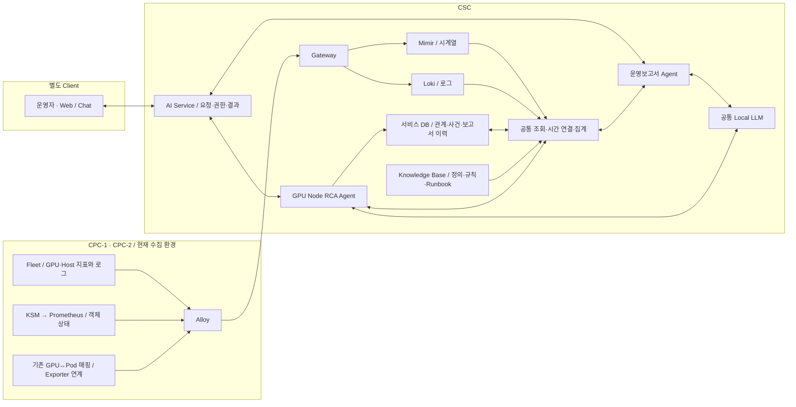

# DSX GPU 운영보고서 Agent — 역할, 운영 사례, 데이터 설계

작성일: 2026-09-15 · 버전: 1.1 (공통 기준 1.0 반영 개정) · 대상: 서비스 기획자, 운영자, 개발자

2026-09-16 개정: 정기·사용자 보고서의 영속 작업 접수와 Dynamo 호출 경계를 추가했다. 수집 현황의 후속 변경은 공통 기준 문서 상단의 분석 메모를 참고하며, 이번 개정은 작업 실행 설계에 한정한다.

**공통 기준:** 상태·식별·시간·계산·품질·판정 규칙의 원본은 [두 Agent 공통 판단 기준과 인사이트 사례 v1.0](<../../share/DSX_Agent_공통판단기준과_인사이트사례_v1.0.md>)이다. 처음 공유할 때는 그 문서를 먼저 읽는다. 본문은 운영보고서 업무에 대한 적용 설명이며, 공통 정의를 별도로 변경하지 않는다.

이 문서는 CPC-1·CPC-2의 GPU 운영 데이터를 CSC에서 분석하여 어떤 결과를 제공할지 설명한다. 현재 수집 환경을 출발점으로 한 설계안이며, Agent 구현 완료나 실측 운영보고서를 뜻하지 않는다. 사례의 숫자와 작업 이름은 모두 설명용 가상 값이다.

**설계 전제:** 사용자 최신 확인에 따라 Pod↔GPU UUID 매핑을 활용할 수 있는 것으로 보고 두 CPC에 적용한다. 첫 제공 범위를 장비 현황에서 **Pod·Namespace와 연결한 GPU 할당·관측 명세**로 넓힌다. 매핑 이력, Pod UID 보완, 상위 Workload·팀 소유권, 활동·전력 지표는 각각 별도 조건이다. 이 문서는 v1.0의 매핑 미완료를 전제로 한 기능 제한을 대체한다.

수집 경로·메트릭 지원·선택 설정·중앙 수신의 구분은 [공통 데이터 수집·메트릭 조사 문서](<../../share/DSX_공통_데이터수집경로와_메트릭조사_2026-09-15.md>)를 함께 따른다. Fleet 참고 소스의 활동·SM·전력 지원 확인은 현재 수신 표본의 검증과 구분한다.

## 1. 운영보고서 Agent가 해결할 문제

운영자는 GPU 사용률 그래프를 보고도 다음 결정을 바로 내리기 어렵다.

- 어느 노드와 작업을 먼저 확인해야 하는가?
- 장시간 할당된 GPU가 실제로 활동하고 있는가?
- 작업이 기다리는 이유가 GPU 부족인가, 배치 조건인가?
- 반복 장애가 어느 작업과 운영 일정에 영향을 주는가?
- 지난주에 한 조치가 자원 사용과 대기를 개선했는가?

**운영보고서 Agent의 역할은 관측 데이터를 이 질문에 답할 수 있는 검토 대상·근거·다음 행동으로 바꾸는 것이다.**

예를 들어 “GPU 평균 사용률 12%” 대신 다음과 같이 제공한다.

> 개발 작업 notebook-a가 전용 GPU 2개를 8시간 할당받았다. 두 GPU 모두 5시간 동안 저활동 기준을 만족하여 저활동 할당시간은 10 GPU-hours다. 개발 세션 유지가 필요한지 담당자에게 확인하고, 불필요한 시간대의 일시중지를 검토한다.

이 결과에는 활동 지표, GPU↔Pod 연결, 할당 이력, 작업 유형이 필요하다. 현재 환경에서 그 입력이 모두 검증됐다는 뜻은 아니다. **서비스가 제공할 목표와 지금 사용할 수 있는 데이터를 연결해서 기능을 단계적으로 연다.**

읽는 순서: 역할과 사례는 1~5절, 데이터와 구현 구조는 6~9절, 실제 출력과 완료 기준은 10~12절을 보면 된다.

## 2. 출발점: 현재 환경과 추가로 필요한 연결

### 2.1 공통 운영 전제

CPC-1과 CPC-2는 동일한 수집·연동 환경을 사용하며, CSC에서 양쪽 데이터를 조회할 환경이 구축된 것으로 본다. 클러스터별로 다른 GPU 모델·지원 기능·실측값은 구분한다.

| 구분 | 현재 근거 | 설계에 반영할 범위 |
|---|---|---|
| Fleet 메트릭·로그 | Fleet → Alloy → CSC Mimir/Loki 전송·조회 환경 구축 | 두 CPC의 장비 관측을 중앙에서 조회 |
| 공통 식별 | `cluster_id`, `node`, `node_group`, `compute_zone`; GPU 표본에 `uuid` 등 존재 | CPC → Node → GPU 단위 분석 |
| Fleet 필드 | CPU, VRAM, ECC, 클럭 제한 관련 메트릭 이름·라벨 확인 | 실제 값·단위·해당 기간을 확인한 필드로 현황·변화 분석 |
| KSM | `kube_node_status_condition`, `kube_pod_info`, `kube_pod_container_resource_requests` 세 종류 중앙 수집 확인 | Node 상태·Pod 배치·실제로 관측된 resource의 요청량 |
| GPU↔Pod | 사용자 최신 확인에 따라 매핑 활용 가능을 설계 전제로 채택 | 같은 시점의 GPU→Pod 역조회와 Pod→GPU 조회, Namespace 연결 |
| 매핑의 세부 계약 | 최신 전송 설정은 이번에 재검증하지 않음. 기존 표본의 빈 `pod_uid`가 보완됐는지와 과거 이력은 별도 확인 | 현재 관계는 사용하고, 이름 재사용·시간 이력·공유 방식이 필요한 계산에만 추가 조건 적용 |
| 활동·전력·기간 | 제공된 목록에서 GPU utilization·SM 활동·실제 소비전력 및 장기 이력 미확인 | 저활동·전력·주간 비교는 각 입력 검증 후 제공 |

메트릭 목록은 전체 목록이라는 보장이 없으므로, 목록에 없는 필드를 “수집 불가능”으로 판단하지 않는다. 반대로 수집 경로가 열렸다는 사실만으로 모든 분석 필드가 존재한다고 가정하지 않는다.

GPU 요청 메트릭은 제공된 Prometheus 조회 시점에 조건에 맞는 시계열이 0건이었다. 이는 그 시점의 조회 결과이며, 실제 GPU 작업 존재 여부·조회 시점·필터·수집 설정을 구분해 해석해야 한다. CPU·메모리 요청 수집을 GPU 요청 수집의 증거로 사용하지 않는다.

**GPU 요청 시계열이 없어도 유효한 실제 장치 매핑으로 현재 할당 장치를 셀 수 있다.** 매핑 이력이 있으면 관측 기반 할당 GPU-hours도 계산할 수 있다. GPU 요청량은 미배치 수요·요청 대비 할당을 분석할 때 필요하며, 이미 할당된 장치의 시간 계산에 필수 입력은 아니다.

### 2.2 기능을 여는 세 단계

| 단계 | 제공할 결과 | 열기 위한 조건 |
|---|---|---|
| A. Pod와 연결한 현재 관측 | Pod별 할당 GPU 목록·수, Namespace별 할당 명세, 연결된 장치의 메모리·상태, 노드 상황 | 같은 시점의 유효한 매핑·Namespace 식별. 수량 단위는 전용/MIG/공유를 구분 |
| B. 기간·활동 분석 | Pod별 관측 기반 GPU-hours, 저활동, 다중 GPU 편차; owner 연결 시 Workload로 집계 | 시간 이력·안정적인 Pod 식별·할당 방식. 저활동·편차에는 활동 지표 추가 |
| C. 운영 의사결정 확장 | 장애 영향, 배치 대기, 용량 검토, 에너지, 조치 효과 | 각 주제에 필요한 사건·스케줄러·전력·업무 지표·조치 이력 확보 |

단계 C 전체를 한꺼번에 기다릴 필요는 없다. 예를 들어 정규화 사건 이력이 먼저 확보되면 반복 장애 분석을 먼저 제공할 수 있다. 단계는 입력 의존관계를 설명하며 개발 순서를 일률적으로 강제하지 않는다.

첫 산출물은 **CPC / Namespace / Pod / 할당 GPU UUID·모델·수 / 할당 방식 / 연결된 GPU의 VRAM·상태 / Node / 관측 시각·품질**이다. 상위 Workload·팀은 확인된 관계만 붙인다. CPU는 노드 지표로 표시한다. 연결된 GPU의 전체 메모리 점유를 Pod 프로세스가 사용한 정확한 메모리 용량으로 표현하지 않는다.

### 2.3 매핑으로 새로 열리는 기능

| 질문 | 매핑 활용으로 제공할 답 | 남는 조건 |
|---|---|---|
| 이 GPU와 연결된 Pod는? | 해당 관측 시각의 Pod·Namespace·노드 목록 | 공유 장치는 여러 Pod를 모두 표시 |
| 이 Pod에 GPU가 몇 개 할당됐나? | 고유 UUID 또는 MIG 장치 목록과 할당 단위 수 | 전용성이 확인된 경우에 물리 GPU 수로 표현 |
| Namespace별 실제 할당 규모는? | 현재 전용 GPU 수 또는 공유/MIG 단위별 규모 | Namespace 간 공유 물리 GPU는 중복 합산하지 않음 |
| 메모리 점유가 높은 GPU의 관련 작업은? | 그 장치와 연결된 Pod를 바로 제시 | 장치 관측과 프로세스별 사용량을 구분 |
| 점검하려는 GPU와 관련된 작업은? | 점검 직전 매핑 시각의 관련 Pod 목록 | 리셋 범위·토폴로지·공유 장치와 다른 실행 경로의 영향은 추가 확인 |
| 이번 주 Pod별 GPU-hours는? | 매핑 이력을 확보한 구간의 할당시간 | 현재 매핑 한 번으로 과거 일주일을 계산하지 않음 |
| 오류 당시 어느 Pod가 있었나? | 사건 시각의 매핑이 있으면 영향 가능 Pod 식별 | 현재 관계만 있으면 현재 연결만 표시 |

이 조건으로 분석 단위가 GPU·Node에서 Pod·Namespace까지 확장된다. Workload·프로젝트·사람 단위로의 확장은 각각 owner·소유권 관계에 달려 있다.

## 3. 두 Agent와 사용자의 역할

| 구성 | 책임 | 결과 예시 |
|---|---|---|
| GPU Node RCA Agent | 개별 사건의 시간대·장비·메트릭·로그를 조사하고 원인 후보와 점검 절차 제시 | “GPU 오류 전후의 상태, 적용 가능한 Runbook, 다음 확인 항목” |
| 운영보고서 Agent | 기간·대상별 활동·할당·상태·사건을 비교하고 운영 검토 대상 제시 | “반복 사건 장비, 장시간 저활동 작업, 데이터가 부족해 판단을 보류한 대상” |
| 공통 조회·집계 도구 | 대상 식별, 데이터 조회, 시간 연결, 수치 계산, 규칙 판정 | 값·단위·기간·누락·근거를 갖춘 구조화 결과 |
| Local LLM | 구조화 결과를 설명하고 검토 항목과 근거를 연결 | 운영자가 읽을 수 있는 설명과 후속 확인 |
| 운영자 | 업무 목적을 확인하고 실제 변경 결정·실행 | 작업 종료, 자원 조정, 점검 일정 결정 |

운영보고서가 새로운 이상 징후를 발견하면 해당 대상과 기간으로 RCA 조사를 요청할 수 있다. RCA 결과는 사건 저장소에 보존하고 보고서에서 참조한다. 정규화 사건과 RCA 결과가 아직 없으면 원본 관측 수준으로 표시한다.

사용자는 CSC 밖의 별도 Client에서 Web/Chat으로 요청하고 결과를 받는다. 자동 중지·리셋·재부팅·스케줄 변경은 두 Agent의 기본 역할에 포함하지 않는다.

## 4. 어떤 인사이트를 제공할 것인가

표의 단계는 2절의 입력 조건을 따른다. 각 기능은 대상과 기간에 따라 `산출 가능 / 부분 산출 / 근거 부족 / 적용 대상 아님` 상태를 갖는다.

| ID · 분석 주제 | 구체적인 사례 | 출력 인사이트 | 필요 데이터 · 단계 |
|---|---|---|---|
| O01. 장비·노드 변화 | 메모리 점유가 높은 GPU가 Pod A와 연결됨 | 관련 Pod를 특정해 장치 상태와 함께 제공. 기간별 변화는 해당 시각의 관계로 설명 | 현재 매핑·VRAM·CPU·Node 상태. 현재 현황 A, 변화 설명은 이력 추가 |
| O02. 할당 명세 | Pod에 전용 GPU 2개가 연결되고 이 관계가 8시간 유지됨 | 현재 할당 2개, 이력 확보 시 관측 기반 16 GPU-hours와 Namespace별 규모 | 현재 명세 A. 안정적 Pod 식별·할당 방식·이력을 갖춘 시간 분석 B. GPU 요청·활동 지표 없이도 할당시간 계산 가능 |
| O03. 장시간 저활동 | 할당된 GPU가 낮은 활동을 오래 유지함 | 저활동 할당시간, 확인할 담당 작업, 예외 조건과 일시중지 검토 | O02 + GPU 활동·VRAM·작업 유형. B |
| O04. 다중 GPU 활동 편차 | 동일 작업의 GPU 4개 중 1개가 지속적으로 낮은 활동 | 편차 구간과 장치, rank·통신·데이터 공급 점검 후보 | 동시점 작업↔GPU 연결·활동 지표. B. 병목 확정에는 프로파일·애플리케이션 지표 추가 |
| O05. 반복 사건·정비 순위 | 한 GPU에 정규화된 사건이 반복됨 | 사건 종류·횟수·재발 간격·RCA 결과와 정비 검토 순서 | 로그·정규화 Incident·관측 기간·RCA 결과. C |
| O06. 사건 당시 작업 | 오류 시각에 특정 GPU에 작업이 할당돼 있었음 | 영향 가능 작업과 확인된 실패·중단을 구분 | O05 + 당시 매핑·작업 상태/로그. C |
| O07. 배치 대기·용량 검토 | 여유 장치는 여러 노드에 분산돼 있고 작업은 한 노드에 GPU 4개를 요구 | 조건에 맞는 배치 가능 공간과 대기 원인 후보, 증설 전에 검토할 제약 | GPU 요청·할당/allocatable·미배치 상태·scheduler 이벤트·affinity/taint/토폴로지. C |
| O08. Namespace·프로젝트 배분 | Namespace별 현재 할당 규모를 비교하고 이력이 쌓이면 대기 변화와 연결 | 현재 배분 명세와 기간별 정책 검토 대상. 프로젝트 연결이 없으면 Namespace 수준에서 종료 | 현재 할당 A, 할당시간 B. 대기·소유권·quota를 연결한 정책 검토 C |
| O09. GPU 에너지 | 같은 모델의 관측 GPU 에너지와 활동 시간대가 기간별로 달라짐 | GPU 단위 kWh와 변화 구간. 작업별 에너지는 귀속 조건 별도 | 실제 소비전력 또는 에너지 계수·기간·모델. C |
| O10. 조치 전후 변화 | 개발 세션 운영시간을 바꾼 뒤 저활동 할당시간이 줄어듦 | 조치 이행 여부와 전후 변화. 업무량 차이를 함께 표기 | 조치 시각·동일 정의의 전후 지표·업무량/처리량. C |
| O11. 관측 품질 | 어떤 GPU는 지표가 정상이나 작업 매핑이 끊김 | 장비 추세는 제공하고 작업 귀속은 보류. 영향 구간·복구할 수집 항목 제시 | 기대 대상·샘플 시각·수집 주기·매핑 상태. A부터 모든 결과에 포함 |

GPU 요청량, 실제 할당량, 연산 활동은 서로 다른 질문에 답한다. 요청량이 높다고 실제 장치를 이미 할당받은 것은 아니며, 장치를 할당받았다고 계속 연산하는 것도 아니다.

Namespace는 Kubernetes의 논리 구획이고 Workload는 작업을 묶는 컨트롤러 단위다. 팀·프로젝트·사람과 연결하려면 명시적인 메타데이터가 필요하다. `node_group`이나 taint 하나로 프로젝트 소유권을 확정하지 않는다.

## 5. 운영자가 받게 될 설명의 예

### 5.1 메모리는 높고 활동률은 모르는 경우 — A단계

가상 관측: 한 GPU의 VRAM 점유가 85%이고, 같은 노드에 Pod 세 개가 있다. 유효한 매핑은 그 GPU와 `dev/notebook-a`의 연결을 보여준다. 활동 지표는 제공되지 않았다.

**제공할 설명:** “메모리 점유가 85%인 GPU가 dev/notebook-a에 연결돼 있다. 해당 Pod를 확인 대상으로 제시한다. 이 수치는 장치 전체의 메모리 관측이며 현재 연산 중인지는 활동 지표가 없어 판단하지 않는다.”

운영자는 같은 노드의 모든 Pod를 뒤지는 대신 매핑된 Pod부터 확인할 수 있다. 이 단계에서 “Pod A가 GPU를 낭비한다”거나 “노드를 줄일 수 있다”는 결론은 만들지 않는다.

### 5.2 할당된 개발 작업이 오래 저활동인 경우 — B단계

가상 관측: `dev/notebook-a`가 전용 GPU 2개를 8시간 할당받았고, UID 기반 매핑 이력은 해당 8시간을 모두 포함한다. 활동까지 필요한 공동 관측 커버리지는 98%다. 두 장 각각 실제 저활동으로 관측된 유효 구간의 합집합이 5시간이며, 관련 시간창은 공통 기준의 저활동 후보 조건을 만족한다.

**산출:** 관측 기반 할당시간 16 GPU-hours, 저활동 할당시간 10 GPU-hours. 결측 구간의 추가 저활동 여부는 미확정이다.

**제공할 설명:** “notebook-a의 야간 세션 유지 필요성을 확인할 대상이다. 불필요한 대기라면 해당 시간대의 일시중지를 검토할 수 있다. 추론 대기나 체크포인트 등 의도된 저활동인지는 작업 담당자의 확인이 필요하다.”

10 GPU-hours는 관측된 저활동 할당 규모다. 회수 가능량·실제 회수량·비용 절감으로 그대로 바꾸지 않는다.

### 5.3 오류 당시 작업이 있었던 경우 — C단계

가상 관측: GPU G1의 사건 시각은 14:03이다. 당시 할당 이력은 작업 A를 가리킨다. A의 컨테이너는 14:04에 비정상 종료했다.

**제공할 설명:** “G1 사건과 시간적으로 겹치는 작업 A에서 비정상 종료가 관측됐다. 종료 로그와 RCA 결과를 연결해 원인을 조사할 대상으로 제시한다.”

할당만 확인하면 ‘영향 가능’이다. 작업 중단이 확인되면 ‘중단 관측’으로 기록한다. GPU 사건이 그 중단의 원인이라는 결론은 별도 근거가 필요하다. 현재 할당 관계를 과거 사건에 소급 적용하지 않는다.

### 5.4 GPU는 남는데 작업이 대기하는 경우 — C단계

가상 관측: 배치 대상 두 노드에 각각 같은 종류의 GPU 잔여 요청 용량이 2개다. 미배치 작업은 한 노드의 GPU 4개를 요구한다. 바인딩된 기존 요청·allocatable·다른 배치 제약과 scheduler 이벤트를 함께 확인했다.

**제공할 설명:** “전체 잔여 요청 용량은 4개지만 이 작업을 배치할 단일 노드 공간이 없다. 실행 중 작업의 종료 일정과 재배치 가능성을 확인하고, 같은 요구가 반복되는지 살펴 노드 구성을 검토한다.”

이 경우 총 GPU 수만 보고 여유가 충분하다고 판단할 수 없다. 반대로 이 한 건만으로 증설 수량을 확정하지도 않는다.

### 5.5 Pending과 미배치 요청을 구분하는 경우

가상 관측: GPU 1단위씩 요청한 Pending Pod 6개 중 4개는 노드 바인딩 후 이미지 준비 중이고 2개만 미배치다. 미배치 두 건의 스케줄링 준비 상태·실패 사유는 아직 확인되지 않았다.

**제공할 설명:** “Pending은 6건이지만 미배치 GPU 요청은 2단위다. 바인딩된 4건은 준비 지연을, 미배치 2건은 스케줄링 준비 상태와 실패 사유를 확인한다. GPU 부족량과 증설 수량은 미확정이다.”

미배치 요청을 GPU 매핑과 inner join하면 UUID 없는 대기 Pod가 집계에서 사라진다. KSM/객체 요청·배치 정보를 기준으로 수요를 계산하고 GPU 매핑은 실제 할당 분석에 사용한다.

공유 GPU 귀속, 반복 사건 발생률, 에너지 변화, 수집 장애를 포함한 12개 사례는 공통 기준 문서 7절에 정리했다.

## 6. 수집부터 보고서까지의 구조

아래는 매핑을 활용하는 운영보고서의 논리도다. GPU↔Pod 관계를 CSC 분석에서 사용할 수 있다는 최신 전제를 반영한다. 매핑의 실제 전송 설정을 새로 검증한 배포도는 아니며, CSC 분석 서비스 내부는 구현할 설계다. Gateway와 보관 계층 등 세부 배치는 아래 설명에 포함한다.



흐름을 글로 읽으면 **CPC에서 수집 → CSC의 Mimir/Loki에 저장 → 같은 대상·시간으로 조회 → 관계를 연결하고 계산 → Agent가 설명 → 별도 Client에 결과 반환**이다.

Mimir/Loki의 장기 저장은 기존 S3 호환 Object Storage를 사용하는 구성을 유지한다. Grafana는 두 저장소의 근거 확인과 직접 Alerting을 담당하며, Webhook → Incident Aggregator → Incident DB → RCA라는 기존 설계 관계도 유지한다. 운영보고서는 정기 실행 또는 사용자 요청으로 생성하며, 모든 보고서를 장애 알림으로 시작할 필요는 없다.

### 6.1 확보된 GPU↔Pod 매핑을 공통 조회 도구에 연결한다

사용자 최신 확인에 따라 매핑 기능을 사용할 수 있는 것으로 설계한다. 기존 Exporter 연계 경로를 재사용하고 **두 Agent가 같은 매핑 결과·시각·품질을 반환받는 공통 계약**을 만든다. 별도 매핑 수집기를 필수로 추가하지 않는다. 실제 전달 방식은 기존 설정에 맞추되 Agent에는 동일한 조회 계약을 제공한다.

Exporter의 `pod`·`namespace`가 사용자 작업을 가리키는지, 수집 대상 Exporter 자신의 라벨과 충돌하지 않는지 확인해야 한다. Fleet의 `uuid`와 Exporter의 실제 UUID 라벨을 공통 키로 정규화한다. 메트릭마다 반복된 동일 매핑은 한 관계로 묶고, 장치 측정값을 매핑 행 수만큼 합산하지 않는다.

NVIDIA의 DCGM Exporter는 Kubernetes 통합에서 kubelet의 pod-resources 정보를 이용해 작업 라벨을 연결하는 방식을 지원한다. 실제 배포 버전의 출력과 설정을 기준으로 적용한다. [NVIDIA DCGM Exporter 설치 설명](https://docs.nvidia.com/datacenter/dcgm/latest/installation/install-dcgm-exporter.html)

기존 경로로 필요한 매핑·완전성·시간 정보를 얻을 수 없을 때만 노드별 PodResources 조회를 보완안으로 선택한다. 이 API는 노드 로컬의 할당 장치 정보를 제공하며, 사용자 ID나 과거 이력을 대신 제공하는 저장소는 아니다. [Kubernetes Device Plugins와 PodResources](https://kubernetes.io/docs/concepts/extend-kubernetes/compute-storage-net/device-plugins/)

### 6.2 CSC에서 연결할 관계

```text
CPC + Node + GPU UUID
            ↕ 같은 시점의 장치 할당
      Namespace + Pod UID + Container
            ↕ 해당 시점의 owner 관계
           Workload UID
            ↕ 명시적인 소유권 메타데이터
       프로젝트 / 팀 / 사용자
```

이전 표본의 `pod_uid`는 빈 값이었고 최신 매핑 가능 확인이 UID 보완까지 의미하는지는 별도다. UID가 없더라도 시각·CPC·Node·Namespace·Pod 이름으로 유일한 현재 관계를 표시할 수 있다. 이때 실행 신원을 확정한 것처럼 과거 구간을 합치지 않는다. 기간 집계는 같은 시점의 KSM 또는 Kubernetes 객체 정보로 UID를 보완하거나 동등하게 재생성을 구분할 수 있을 때 수행한다. 상위 Workload는 검증된 owner 관계를 따르며 사람의 신원과 구분한다. [KSM Pod 지표 정의](https://github.com/kubernetes/kube-state-metrics/blob/main/docs/metrics/workload/pod-metrics.md)

### 6.3 두 Agent의 공통 매핑 계약

논리 조회 함수 `get_gpu_pod_mapping`은 대상 CPC와 GPU 또는 Pod, 기준 시각 또는 과거 기간을 받는다. 필드·상태·시간·완전성 계약은 [공통 기준 문서](<../../share/DSX_Agent_공통판단기준과_인사이트사례_v1.0.md>)의 4~5절을 참조한다. 이 문서에는 계약 표를 별도로 복제하지 않는다.

운영보고서는 현재 관계로 할당 명세를 만들고, 검증된 이력으로 기간을 계산한다. Pod 배치·GPU 관계·활동 상태를 분리하며 `not_observed`를 미할당으로 바꾸지 않는다. Pod 재생성, 같은 Pod의 컨테이너 재시작, Node 객체 재생성, GPU 재할당은 각 식별자·사건·시간 관계로 구분한다.

## 7. 데이터와 저장소를 어떻게 나눌 것인가

### 7.1 저장소의 역할

| 저장소 | 저장 내용 | 설계 선택 |
|---|---|---|
| Mimir | Fleet·KSM 시계열, 중앙 전달을 완료한 장치 매핑 지표 | 원본 관측의 조회 기준. 모든 시계열을 관계형 DB에 복제하지 않음 |
| Loki | Fleet 로그·이벤트, 추가 수집한 운영 로그 | 사건 근거와 시간대 조사 |
| 서비스 관계형 DB | 관계 이력, 정규화 Incident/RCA 참조, 보고서 실행과 계산 결과 | DB 제품이 미정이면 PostgreSQL을 기본안으로 제안. 이미 정한 서비스 DB가 요구를 충족하면 재사용 |
| Knowledge Base | 메트릭 의미·적용 장비, 분석 규칙, 업무 유형별 예외, Runbook | Runbook·정책은 단일 기준의 발행본, 문서·조회 정의는 Git 버전으로 관리. 운영 수치·할당 이력은 넣지 않음 |
| Object Storage | Mimir/Loki 보관 데이터, 필요 시 보고서·근거 스냅샷 파일 | 저장소별 보존 정책을 명시. 영구 보관을 자동으로 가정하지 않음 |

첫 구현에서 별도 벡터 DB나 그래프 DB를 필수로 두지 않는다. 장치·작업 관계는 키와 시간으로 연결하고, 규칙은 식별자와 적용 조건으로 찾는다. 문서의 의미 검색이 필요해지면 Knowledge Base 검색 인덱스를 추가한다.

RCA와 같은 KB를 사용한다. Runbook·정책을 PostgreSQL 발행본으로 관리한다면 Git 문서는 그 근거·설명이며 경쟁하는 수정 원본으로 두지 않는다. 물리 저장 위치보다 중요한 계약은 단일 기준 원본·호환 범위·불변 revision이다.

### 7.2 최소 논리 데이터 모델

다음은 구현할 테이블의 역할을 정하는 설계다. 현재 DB가 존재하거나 적재가 끝났다는 뜻은 아니다.

| 데이터 | 주요 항목 | 필요한 이유 |
|---|---|---|
| `identity_history` | 관계 종류, cluster, node/GPU/Pod/workload 키, 모델·공유 방식·소유권, 관측·유효 구간, 출처 | 같은 이름의 다른 객체와 변경된 소유권을 구분 |
| `allocation_observation` | 수집 시각, 수집 성공·완전성, Pod UID·container·원본 device ID·정규화 GPU 키, 해결 상태 | 할당시간과 매핑 누락의 원본 근거 |
| `report_run` | 요청 범위·기간·권한 범위, 상태, 입력 기준시각, 쿼리·규칙·모델 버전 | 어떤 입력으로 어떤 보고서를 만들었는지 기록 |
| `report_result` | run ID, 주제별 수치·단위·품질, 근거 스냅샷/참조, 설명·권고, 보류 사유 | 읽기 쉬운 결과와 재검토 가능한 근거 보존 |
| 기존 Incident/RCA 영역 | 사건 ID, 자산, 시간, 중복 통합 상태, 원인 후보, 분석 버전 | 보고서가 사건 정규화를 중복 구현하지 않고 재사용 |

조치 효과 분석을 시작할 때는 조치 대상·적용 시각·실제 실행 내용을 운영 이력에 연결한다. 집계 비용이 커지면 GPU/작업별 시간 집계를 캐시하되, 첫 버전부터 별도 대규모 분석 DB를 추가할 필요는 없다.

GPU 기준 키는 `cluster_id + gpu_uuid`이며, 어느 노드 인스턴스에 연결됐는지는 시간 관계로 관리한다. Node·Pod·컨테이너·MIG의 식별과 대체 키 조건은 공통 기준 문서 5.1절을 따른다. GPU index·PCI 주소·Node 이름만으로 과거 실행이나 영구 장치 신원을 확정하지 않는다.

관계는 유효 구간과 관측 시각을 함께 가진다. 원본 로그 보존이 끝나도 설명 당시의 계산 근거가 남도록 결과·품질·입력 요약을 저장한다. 쿼리 문자열과 링크만 저장한 경우에는 원본 만료 뒤 완전 재현을 보장하지 않는다.

## 8. 조회와 계산을 어떻게 수행할 것인가

### 8.1 사용자 요청을 명시적인 분석 조건으로 바꾼다

입력 예: “CPC-1과 CPC-2의 지난주 장시간 저활동 작업과 반복 사건을 보여줘.”

AI Service는 이를 다음 조건으로 변환하고 Client에 표시한다.

| 항목 | 해석 결과 예 |
|---|---|
| 대상 | 사용자가 조회할 권한이 있는 CPC-1·CPC-2 |
| 기간 | 2026-09-07 00:00 이상, 2026-09-14 00:00 미만 |
| 시간대 | Asia/Seoul, 내부 저장은 UTC |
| 주제 | O03 저활동, O05 반복 사건 |
| 묶는 기준 | CPC·GPU 모델·Namespace·Workload, 가능한 수준까지 |
| 규칙 | 작업 유형별 적용 규칙과 버전 |

공통 Mimir tenant는 `cpc-1`이고 데이터 대상은 `cluster_id`로 구분한다. 공통 tenant가 사용자의 양쪽 CPC 접근 권한을 뜻하지 않으므로 서버에서 허용 대상 필터를 적용한다. Loki는 저장소별 매핑을 사용한다. 확인된 CPC-2 예는 tenant `cpc2`, 라벨 `cluster=cpc2`이며 CPC-1 값은 해당 설정을 따른다.

### 8.2 조회 도구는 주제별 고정 절차를 실행한다

```text
요청 범위 확정
  → 해당 주제의 필수 데이터 확인
  → Mimir에서 대상·기간 시계열 조회
  → 필요한 사건만 Loki / Incident DB에서 조회
  → 같은 시점의 GPU·Pod·Workload 관계 연결
  → 중복·미지원 값·오래된 값·관측 공백 처리
  → 수치 계산과 버전이 있는 규칙 적용
  → 결과·품질·근거를 구조화해 반환
```

LLM이 원시 로그 전체를 받아 숫자를 세거나 매번 임의의 PromQL/SQL을 만드는 구조로 시작하지 않는다. 주제별 쿼리 템플릿에 검증된 범위·기간·대상을 넣고, LLM은 필요한 도구와 후속 조사 항목을 선택한다.

현재 확인한 이름으로 작성한 원본 조회 템플릿 예는 다음과 같다. **실행 검증을 마친 쿼리가 아니며**, 실제 라벨·단위·필드 지원을 확인한 뒤 사용한다.

```promql
dcgm_fi_dev_fb_used{cluster_id=~"cpc-1|cpc-2"}

kube_pod_info{cluster_id=~"cpc-1|cpc-2"}

kube_node_status_condition{cluster_id=~"cpc-1|cpc-2"}
```

VRAM 비율은 같은 장치·시점의 유효한 used/total 값으로 계산하거나 검증된 percent 필드를 사용한다. `kube_pod_info`는 관계 정보이며, 모든 Node condition 시계열의 값을 합산해 장애 수로 해석하지 않는다.

기간 조회에는 `start`, `end`, `step`을 고정한다. 평가 간격은 원본 수집 간격과 같지 않을 수 있으므로 반환된 점의 수만으로 원본 수집 성공률을 계산하지 않는다. 누락·최신성 판정에는 원본 샘플 시각과 수집 성공 근거를 사용한다. [Prometheus HTTP API](https://prometheus.io/docs/prometheus/latest/querying/api/)

Loki 조회는 대상 CPC·노드·사건 전후 시간으로 범위를 제한하고 저장된 실제 로그 구조에 맞춰 필터링한다. 정규화 Incident가 있으면 그 저장소에서 사건 목록을 먼저 가져와 필요한 원본만 확인한다. SQL은 보고서 결과·사건·시간 관계 조회에 사용하며 매개변수로 대상과 기간을 전달한다.

### 8.3 숫자는 집계 도구가, 설명은 LLM이 만든다

도구는 주제마다 `status`, `metrics`, `quality`, `evidence`, `missing_inputs`를 반환한다. 값이 없으면 `null`과 이유를 반환한다. `0`은 유효하게 관측된 0일 때만 사용한다.

LLM은 관측 사실·가능한 해석·추가 확인·권고를 분리해 설명한다. 보고서 저장 전에 설명 속 숫자와 대상이 도구 결과에 존재하는지 검사한다. 근거 없는 원인·귀속·절감 수치는 제거한다. LLM 실패 시에도 계산 표와 근거는 반환할 수 있어야 한다.

### 8.4 보고서 생성은 영속 작업으로 실행한다

정기 생성과 사용자 요청은 백엔드의 같은 논리 작업 큐에 접수한다. 접수 저장 후 `job_id`를 반환하고 `report_run`을 연결한다. 정기 작업의 중복 키에는 일정 ID·대상/권한 범위·분석 기간·입력/규칙 버전을 포함한다. 사용자 요청은 요청 키를 사용하며, 의도적인 재생성은 새 run으로 기록한다.

Worker는 집계·근거 조회를 수행하고 필요한 개별 LLM 호출만 공유 한도 내에서 Dynamo에 보낸다. 보고서 생성 업무 전체를 Dynamo의 대기열에 맡기지 않는다. 긴급 RCA가 먼저 실행될 수 있지만 정기 보고서도 대기 시간에 따른 실행 기회를 보장한다. 취소·재시도·deadline·결과 중복 방지·계측은 [공통 기준 8.3절](<../../share/DSX_Agent_공통판단기준과_인사이트사례_v1.0.md>)을 따른다.

보고서 실행 succeeded와 주제별 ready/partial/blocked는 별개다. LLM 설명 생성 실패 시 집계·근거를 보존하고 설명 단계만 재시도할 수 있다. 보고서 산출 수치와 실행 서비스의 대기시간·재시도 지표는 구분해 표시한다. Dynamo는 설계상 추론 경로이며 현재 배포 완료로 간주하지 않는다.

## 9. 지표의 의미와 계산 기준

### 9.1 GPU의 무엇을 측정하는가

| 구분 | 답하는 질문 | 혼동하면 안 되는 것 |
|---|---|---|
| GPU utilization | 샘플 구간에 GPU 커널 실행이 얼마나 관측됐는가? | 최대 연산 성능 달성률, 업무 생산성 |
| SM activity | SM의 활동이 시간과 장치 전체에 걸쳐 얼마나 관측됐는가? | GPU utilization과 동일한 값 |
| SM occupancy | 수용 가능한 warp 대비 활성 warp가 어느 정도인가? | 높으면 반드시 실행이 빠르다는 뜻 |
| VRAM 점유 | 메모리에 데이터가 얼마나 올라가 있는가? | 메모리 대역폭 활동 |
| DRAM activity | 메모리 전송 활동이 얼마나 관측됐는가? | VRAM 사용 용량 |
| 실제 소비전력 | GPU가 해당 시간에 얼마나 전력을 사용하는가? | 설정된 power limit |

이 구분은 NVIDIA의 지표 정의를 따르며, 실제 지원 필드와 단위는 장비·DCGM/Fleet 버전에 맞춰 고정한다. [NVIDIA DCGM Feature Overview](https://docs.nvidia.com/datacenter/dcgm/latest/user-guide/feature-overview.html)

현재 확보한 VRAM 입력은 `dcgm_fi_dev_fb_used/free/total/used_percent`다. `dcgm_fi_dev_enforced_power_limit`를 실제 소비전력으로 사용하지 않는다. ECC 계열도 이름 존재만으로 오류 발생을 단정하지 않고 값·의미·리셋·중복 정의를 확인한다.

### 9.2 시간과 품질을 먼저 정의한다

시간·최신성·공백·커버리지 계산은 공통 기준 5.3절과 6.2절을 사용한다. 보고서에는 기간, 관측 기반 근사 여부, 유효·제외 구간, 분모, 규칙 버전을 표시한다. 할당 이력의 품질과 활동까지 포함한 공동 관측 품질을 구분한다.

Pod/Workload 귀속 가능 비율을 추가로 보여줄 때는 관측된 할당 GPU·시간 중 유일하게 귀속 가능한 부분을 사용하고, 전용·공유 단위를 분리한다. 이 비율을 전체 장비 관측 커버리지로 대신하지 않는다.

### 9.3 산출 지표

할당·저활동·미배치 요청·평균/P95·미할당·사건 발생률·에너지의 산식과 조건은 공통 기준 6.1절을 사용한다. 보고서별로 산식을 다시 정의하지 않는다.

정규화 사건 수와 복구·사용 불가 구간은 Incident/RCA 영역의 같은 정의를 참조한다. 장비 상태 회복과 실제 작업 복구를 분리하고, 복구 조건 미충족이면 미복구 건수·경과시간 또는 근거 부족으로 표시한다. 원본 로그 행 수나 Healthy 한 건을 사건 수·전체 복구로 바꾸지 않는다.

### 9.4 저활동 규칙은 업무 목적에 맞춰 적용한다

공통 기준 6.3절의 수치를 v1 분석 후보 기본값으로 사용한다. 기존 본문의 제안값을 공통 기준으로 옮겼으며, 회수·중지 정책이 확정됐다는 의미는 아니다. 후보 시간창 전체를 저활동 시간으로 계산하지 않고 실제 저활동 유효 구간만 합산한다.

작업 유형·초기화·체크포인트·추론 대기·예약 등 예외를 함께 확인한다. 지원되는 SM은 보조 근거이며 VRAM만으로 저활동을 판단하지 않는다. 활동이 높고 SM이 낮은 패턴은 별도로 보여주되 병목 확정에는 작업 근거를 추가한다.

### 9.5 전용·공유·이기종을 구분한다

| 할당 방식 | 보고 단위·제한 |
|---|---|
| 전용 GPU | 물리 GPU-hours. 독점 할당이 장치 활동 전부가 해당 작업의 유용한 연산이라는 뜻은 아님 |
| MIG | 프로파일·구성별 instance-hours. 부모 GPU 시간과 합산하거나 같은 성능으로 환산하지 않음 |
| Time-slicing | 공유 할당 단위의 시간과 물리 GPU 활동을 별도로 제공. 전체 활동을 Pod마다 복제해 귀속하지 않음 |
| MPS | 할당·설정 제한과 측정된 사용량 구분. 설정 비율을 실사용량으로 대체하지 않음 |
| 방식 미확인 | 장치 관측까지만 제공하고 전용 작업별 시간·활동 귀속은 보류 |

Time-slicing의 공유 수량은 보장된 연산 지분이 아니다. 공유 모드의 의미는 실제 Device Plugin 설정과 공식 정의를 함께 확인한다. [NVIDIA Device Plugin 공유 GPU 설명](https://github.com/NVIDIA/k8s-device-plugin#shared-access-to-gpus)

V100·A100 등 모델별 시간을 함께 표시할 수 있지만 합산 시간이 동일한 연산 성능을 뜻하지 않는다. 비용 배부는 검증된 단가·정책·공유 배분 기준이 생겼을 때 별도 파생 지표로 추가한다.

## 10. 결과는 어떤 형태로 제공할 것인가

### 10.1 보고서와 명세표

첫 화면에는 분석 기간·CPC·대상 모델·데이터 품질과 우선 검토할 항목을 보여준다. 항목을 열면 다음 내용을 확인할 수 있다.

| 항목 | 내용 |
|---|---|
| 대상 | CPC → Node → GPU, 연결 가능한 경우 Namespace → Workload → Pod |
| 관측 사실 | 수치·단위·기간·변화량 |
| 해석 | 데이터로 뒷받침되는 후보와 적용한 규칙 |
| 추가 확인 | 작업 목적, 애플리케이션 지표, 원인 조사 등 |
| 권고 | 운영자가 검토할 구체적인 행동 |
| 품질·한계 | 커버리지, 미식별·미지원·결측 구간, 귀속 수준 |
| 근거 | Grafana 조회 조건, 로그 참조, Incident/RCA ID, KB 문서 버전 |

초기 명세의 열은 `CPC / Namespace / Pod / Node / 할당 GPU UUID·모델·수 / 할당 방식 / 연결 장치의 VRAM·상태 / 관측 시각·품질`이다. UID·Workload는 확인된 값을 표시한다. B단계에서는 `할당 GPU-hours / 활동·저활동 / 기간별 귀속 품질`을 추가한다. 같은 노드의 다른 Pod는 직접 매핑된 Pod와 구분해 참고 영역에 표시한다.

### 10.2 구조화 출력 예

아래는 형식 예시다. 실측 결과가 아니며, 숫자를 임의로 채우지 않은 일부 산출 상황을 보여준다.

```json
{
  "report_id": "example-report",
  "status": "partial",
  "scope": {"clusters": ["cpc-1", "cpc-2"]},
  "period": {
    "start": "2026-09-07T00:00:00+09:00",
    "end": "2026-09-14T00:00:00+09:00",
    "timezone": "Asia/Seoul"
  },
  "findings": [{
    "topic_id": "O03",
    "status": "insufficient_data",
    "target": {"cluster_id": "cpc-2", "node": "example-node"},
    "metrics": {"low_activity_allocated_gpu_hours": null},
    "quality": {"joint_coverage": null},
    "missing_inputs": ["validated_gpu_activity", "historical_allocation_intervals"],
    "evidence_refs": [],
    "recommendations": []
  }],
  "versions": {
    "query": "example-v1",
    "rule": "example-v1",
    "model": "record-at-runtime",
    "knowledge": "record-git-revision"
  }
}
```

Client는 같은 구조화 결과로 Web 표·Chat 설명·다운로드 문서를 만든다. 정기 보고와 사용자 요청도 같은 계산 경로를 사용한다. 부분 실패는 주제별로 남겨, 한 데이터 소스가 실패해도 근거가 있는 다른 결과를 제공한다.

## 11. 구현 순서와 완료 기준

현재는 설계를 확정하는 단계다. 아래 내용은 개발을 재개할 때 사용할 기준이며, 추가 클러스터 설정이나 수집을 수행하라는 즉시 실행 절차가 아니다.

| 순서 | 구현할 내용 | 완료로 인정할 근거 |
|---|---|---|
| 1. 데이터 계약 | 소스별 이름·단위·키·지원 장비·주기·보존·대표 소스 지정 | 두 CPC에서 사용할 필드와 각 미확인 항목이 명시됨 |
| 2. A단계 할당·관측 명세 | 확보된 매핑의 공통 조회, Pod·Namespace와 연결한 장치 현황 | 원본 관계·시각과 명세가 일치하고 공유·미식별 상태를 보존 |
| 3. 매핑 이력·식별 보완 | 필요 시 UID 보완, 공유 방식 구분, 시간 관계 보존 | Pod 재생성·매핑 변경·수집 공백을 구분하고 과거 조회가 가능함 |
| 4. B단계 시간·활동 | 할당시간, 저활동, 다중 GPU 편차 | 알려진 실행 구간과 계산 차이가 관측·경계 정책으로 설명됨 |
| 5. 사건·운영 확장 | Incident/RCA 참조, 대기·전력·조치 등 필요한 주제 | 각 주제의 추가 입력과 적용 조건을 만족한 대상만 산출 |
| 6. 설명과 정기 생성 | Local LLM 설명, 결과 저장, Client 제공 | 같은 계산 입력에서 수치가 유지되고 근거·버전·보류 사유를 재조회 가능 |

핵심 검증 사례는 다음과 같다.

- 동일한 Node 이름이 두 CPC에 있어도 서로 연결되지 않는다.
- Pod 이름이 재사용되면 과거와 새 UID를 분리한다.
- 같은 Pod의 컨테이너 재시작은 UID 재생성으로 오해하지 않는다.
- Pending이지만 바인딩된 Pod를 미배치 요청에서 제외하고 UUID 없는 미배치 Pod는 유지한다.
- 수집 중단 동안 할당 해제·저활동·0 W를 만들어내지 않는다.
- 중복 매핑을 추가해도 물리 GPU-hours가 두 배가 되지 않는다.
- 공유 GPU는 전용 귀속 집계에서 제외되거나 별도 단위로 나온다.
- 일부 장치가 사라지면 전체 커버리지에 반영하거나 분모 미확정으로 표시한다.
- 오류 GPU에 작업이 있었다는 이유만으로 실패 원인을 확정하지 않는다.
- 현재 매핑이 과거 사건과 연결되지 않으며, 근거 부족 주제는 수치 대신 이유를 반환한다.

## 12. 이 설계에서 확정할 범위

**기능 방향:** 운영보고서 Agent는 Pod·Namespace와 연결한 GPU 할당·관측 명세에서 출발해 기간별 할당·활동, 사건·대기, 조치 효과로 확장한다. 모든 결과는 운영자가 확인할 대상과 이유를 갖는다.

**구조:** CPC-1·CPC-2의 기존 수집과 CSC의 Mimir/Loki를 재사용한다. 확보된 매핑을 공통 조회 도구에 연결하고 관계·보고서 이력은 서비스 DB에 둔다. 두 Agent는 같은 매핑 계약·Local LLM·Knowledge Base를 사용하며 사용자는 별도 Client로 접근한다.

**역할 분담:** 집계 도구가 수치·시간 연결·규칙 판정을 책임지고, LLM은 그 결과를 설명한다. RCA는 사건 조사, 운영보고서는 기간·대상 비교를 담당한다.

**첫 제공 범위:** Pod별 GPU 목록·할당 단위 수, Namespace별 배분, 관련 장치의 VRAM·상태다. 시간 이력을 확보하면 GPU 요청 시계열 없이도 할당 GPU-hours를 제공한다. 저활동·대기·전력은 각각 활동·미배치 수요·실제 소비전력 입력이 필요하다.

### 설계 근거

함께 읽을 문서: [GPU RCA Agent 역할과 데이터 설계 v1.0](<../../share/DSX_GPU_RCA_Agent_역할과_데이터설계_v1.0.md>).

환경 판단은 2026-09-15의 CPC 공통 환경 및 후속 Pod↔GPU UUID 매핑 가능 확인, 이전 수집 설명과 첨부 표본을 기준으로 했다. 최신 매핑 활용 전제가 이전 문서의 중앙 매핑 미완료에 따른 기능 제한을 대체한다. 과거 이력·UID·활동률·소비전력까지 새로 확인된 것으로 확대하지 않는다.

본문에 연결한 Kubernetes·KSM·NVIDIA·Prometheus 공식 문서는 API와 지표 의미의 근거다. 최신 공식 문서의 기능이 현재 배포 버전에 모두 존재한다고 가정하지 않으며, 실제 필드·설정·기간 표본으로 데이터 계약을 확정한다. 이 문서 작성 과정에서 클러스터 조회·설정 변경·Agent 개발·배포는 수행하지 않았다.
