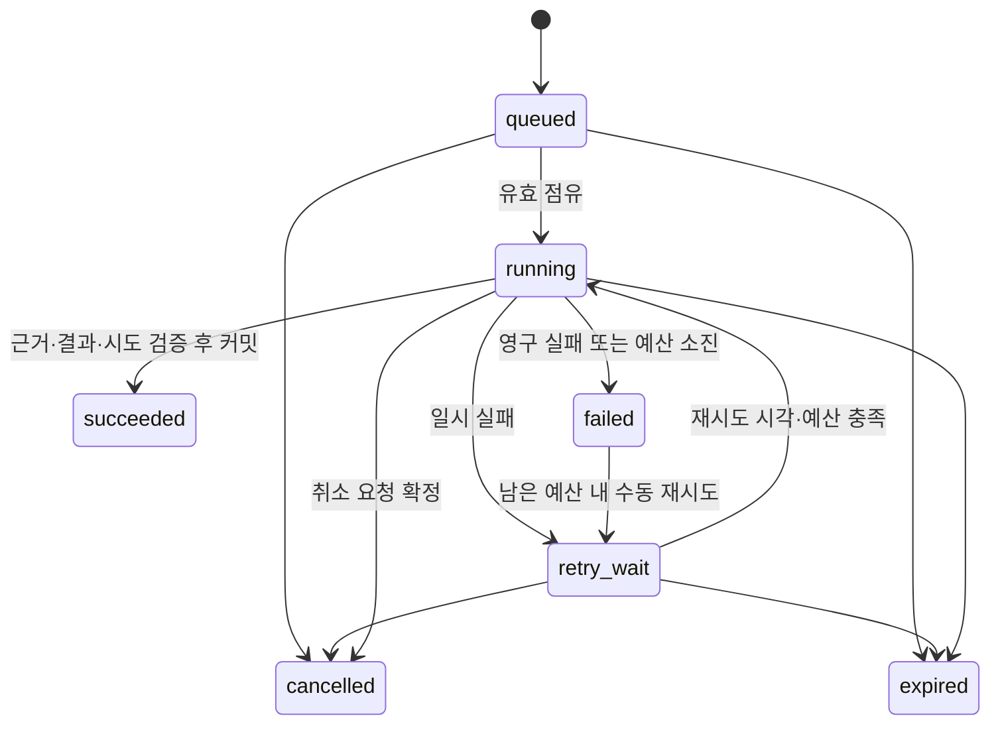

# 02. DSX 백엔드·API 작업 명세서

문서 ID: DSX-BE-001 · 버전: 1.0 · 기준일: 2026-09-16 · 상태: 개발 기준

대응 요구사항: F01~F14, N01~N04. 이 문서의 경로와 DTO는 신규 구현 계약이며 배포된 API 목록이 아니다.

## 1. 실행 단위와 처리 책임

| 실행 단위·모듈 | 책임 | 저장 책임 |
|---|---|---|
| API 서버: 사용자·대화 | 인증·범위·입력 검증, 가벼운 조회·대화, 전문 작업 접수, 결과 조회 | 대화, 요청, 권한·설정 변경 |
| API 서버: Incident | Grafana 수신, 원본 정규화, 중복·재발, 사건 갱신, RCA 접수 | 수신 기록·관측·사건·작업을 같은 트랜잭션으로 처리 |
| API 서버: 작업·일정 | 공통 작업 원장·상태 변경, 정기 발생, 취소·재시도·결과 확정 | jobs, schedules, 결과 참조 |
| RCA Worker | 해당 유형 작업 점유, 근거 조사, 원인 후보·권고 작성 | 공통 저장 모듈을 통해 근거·결과·점유 갱신 |
| 보고서 Worker | 주제별 조회·집계·설명, 결과 출력 | 동일 공통 저장 모듈을 통해 저장 |
| 조회·계산 모듈 | 저장소별 대상 해석, 등록 조회, 식별·시간·품질·계산 | 필요한 관계·관측·근거 저장 |
| Knowledge 모듈 | 호환 지식 검색, 초안·검토·발행 | 불변 발행 revision, 변경 감사 |
| LLM 모듈 | Endpoint 호출, 공유 한도·토큰·timeout, 응답 검증 | 호출 점유·실행 기록 |

Worker는 공통 저장 모듈로 DB의 원자적 점유·완료 함수를 사용한다. Worker→API 내부 HTTP 서버를 별도 필수 구성으로 추가하지 않는다. 공유 코드가 동일 규칙으로 상태를 변경하고 DB 조건으로 경합을 방어한다.

## 2. API 공통 계약

| 항목 | 계약 |
|---|---|
| 기본 경로·형식 | `/api/v1`, JSON UTF-8. 식별자는 불투명 문자열로 전달 |
| 인증 | C01에서 정한 사내 인증과 연계. 서버가 검증한 principal 사용. 브라우저 세션 쿠키 방식이면 HttpOnly/Secure·CSRF 보호 적용 |
| 시간 | RFC3339의 명시적 UTC offset 필수. 저장은 UTC, 기간은 `[start,end)`. `timezone`은 표시·달력 경계 계산용 IANA 이름 |
| 범위 | `scope.cluster_ids` 필수, `namespaces`는 선택. 생략하면 서버의 허용 범위이며 전체 권한 부여가 아님. 권한 밖 명시 요청은 403 |
| 자산 | GPU/Pod/Node 식별자의 소속·시점 검증. 배열의 다른 CPC 대상, 외부 결과·근거 참조도 개별 검증 |
| 페이지 | 목록은 `limit` 기본 50·최대 200, 불투명 cursor. 정렬 `(created_at DESC,id DESC)` 또는 API별 명시 정렬 |
| 생성 | 일반 리소스 201, 전문 작업은 커밋 후 202와 `job_id`. DB 저장 실패는 접수 성공으로 응답하지 않음 |
| 멱등성 | 작업 생성·메시지 제출·Webhook에 요청 키 또는 생산자 중복 키 적용. 같은 키·다른 본문은 409 |
| 변경 경합 | version/ETag 반환. PATCH와 종결 상태 변경은 `If-Match` 필수. 누락 428, 오래된 버전 412 |
| 검증 | 열거값·날짜·범위·문자열 길이·본문 크기·정렬 필드를 서버 allowlist로 검사. query ID별 매개변수 스키마 적용 |
| 리소스 제한 | 최대 조회 기간·로그량·본문/대화 크기·작업 접수량은 C07 프로필에 양수 상한 필수. 미설정이면 해당 접수 비활성 |
| 보안 응답 | 비밀·내부 원문 스택·타 CPC 라벨을 오류에 포함하지 않음. 존재 자체를 숨겨야 하는 타 사용자 리소스는 404 |

정상 목록은 `{items:[], next_cursor:null}`. 상세 응답은 리소스 객체와 `request_id`를 포함한다. 오류는 다음 형식을 사용한다.

HTML 출력은 원문·모델·사용자 텍스트를 이스케이프하고 허용된 서식만 렌더링한다. CSV는 표준 quoting과 함께 `=`, `+`, `-`, `@` 등으로 수식 해석될 수 있는 문자열 셀을 안전한 텍스트로 출력한다. 실제 숫자 필드는 숫자로 유지한다. 파일명·콘텐츠 타입을 서버에서 정하고 비밀·권한 밖 데이터가 포함되지 않게 한다.

```json
{
  "error": {
    "code": "INVALID_TIME_RANGE",
    "message": "시작 시각은 종료 시각보다 빨라야 합니다.",
    "details": {"field": "time_range"}
  },
  "request_id": "example-request"
}
```

HTTP 400/422는 형식·의미 오류, 401 인증 필요, 403 권한 없음, 404 리소스 없음, 409 멱등/상태 충돌, 413 크기 초과, 429 접수·호출 한도, 503 저장·의존 서비스 불가다. 429는 `Retry-After`를 반환한다. 유효한 조회의 데이터 부재는 200과 결과 품질/도구 상태로 표현하며 서버 오류와 구분한다.

## 3. API 목록

표의 모든 읽기·변경은 범위 검증을 전제로 한다. 개별 ID 상세 조회·파일 출력·재분석에서도 검사한다.

| 구분 | Method·경로 | 입력·처리 | 출력 |
|---|---|---|---|
| 권한 | GET `/me` | 인증 principal | 역할·허용 scope·장비 관측 권한 |
| 대상 | GET `/clusters` | 허용 CPC | CPC·수집 상태·기준 시각 |
| 대상 | GET `/assets` | cluster, kind=node/gpu/pod, namespace, cursor | 자산 키·표시명·신원 상태 |
| 대시보드 | POST `/dashboard/query` | scope, time_range | 관측 품질·사건·할당 요약·근거 |
| 매핑 | POST `/mappings/query` | scope, GPU 또는 Pod, at 또는 time_range 중 하나 | 03의 관계·신원·시간·품질 |
| 관측 | POST `/observations/query` | query_id, scope, target, time_range, parameters | 도구 상태·값·단위·품질·근거 |
| 근거 | GET `/evidence/{id}` | 근거 ID | 허용된 요약·스냅샷·원문 접근 가능 상태 |
| 사건 | GET `/incidents` / GET `/incidents/{id}` | scope, 상태·기간·자산, cursor | 사건·관측·관련 분석·version |
| 사건 | PATCH `/incidents/{id}` | If-Match, status, reason | 상태·변경 이력. close에는 종결 이유 필수 |
| 수신 | POST `/webhooks/grafana/{profile_id}` | 검증된 원문·전용 인증 | 커밋 후 수신 ID·사건/작업 참조·중복 여부 |
| RCA | POST `/analyses` | 아래 RCA 요청, Idempotency-Key | 202, job_id=analysis_id, 상태 URL |
| RCA | GET `/analyses` / GET `/analyses/{id}` | scope·기간·대상·cursor 또는 ID | 작업·최종 결과·이전 실행 참조 |
| 보고서 | POST `/reports` | 아래 보고서 요청, Idempotency-Key | 202, job_id=report_id, 상태 URL |
| 보고서 | GET `/reports` / GET `/reports/{id}` | scope·기간·주제·cursor 또는 ID | 작업·주제별 결과·근거·버전 |
| 출력 | GET `/reports/{id}/export?format=html\|csv` | 저장된 보고서 ID | HTML 보고서 또는 집계 CSV. 원본 결과 재계산 없음 |
| 작업 | GET `/jobs/{id}` | 본인 또는 관리 허용 작업 | 상태·단계·시도·종료 이유·결과 참조 |
| 취소 | POST `/jobs/{id}/cancel` | If-Match, reason | 종결 전이면 cancelled 또는 running의 cancel_requested; 완료 후면 409 |
| 재시도 | POST `/jobs/{id}/retry` | If-Match, 실패 단계, Idempotency-Key | 남은 예산·마감 내 failed 작업을 retry_wait로. succeeded는 새 요청 필요 |
| 일정 | GET/POST `/schedules` | 생성 시 보고서 조건·달력 일정 | 목록 또는 201 일정 ID·다음 발생 시각 |
| 일정 | PATCH `/schedules/{id}` | If-Match, 조건 변경·enabled | 새 revision·다음 시각. 소유자/관리자만 변경 |
| 대화 | GET/POST `/conversations` | 본인 대화 목록 / scope·제목 | 대화 ID·맥락 |
| 대화 | GET/POST `/conversations/{id}/messages` | 질문·허용 맥락·Idempotency-Key | 저장된 메시지 또는 설명·등록 조회 결과·전문 job 참조 |
| 기록 | GET/POST `/reviews` | 대상 종류·ID, 의견 또는 실제 조치 | 작성자·발생/입력 시각·근거·수정 전 기록 참조 |
| 지식 | GET `/knowledge` / GET `/knowledge/{id}/revisions/{rev}` | kind·코드·증상·호환 조건 | 발행 목록·상세. 관리자만 초안 조회 |
| 지식 | POST `/knowledge` / POST `/knowledge/{id}/revisions` | 초안 내용·근거·지원 범위 | 새 초안 ID/revision |
| 지식 | PATCH `/knowledge/{id}/revisions/{rev}` | If-Match, 초안 내용 | 초안만 수정. 검토 후 수정 시 재검토 필요 |
| 지식 | POST `/knowledge/{id}/revisions/{rev}/review` | If-Match, 검토 결과·근거 | reviewed 또는 수정 요청 |
| 지식 | POST `/knowledge/{id}/revisions/{rev}/publish` | If-Match, 검토된 revision | 발행 기록·내용 hash. 관리 권한 필수 |
| 지식 | POST `/knowledge/{id}/revisions/{rev}/retire` | If-Match, 사유 | 신규 실행 선택 중단. 기존 실행 참조 유지 |
| 운영 | GET `/service-status` | 서비스 관리자 또는 제한된 상태 조회 | 경로별 신선도·큐·Worker·추론 상태 |
| 설정 | GET/PATCH `/settings/{profile_id}` | 관리자, If-Match, 허용 설정 | 비밀값 제외 설정·검증 결과·revision |
| 진단 | GET `/health/live` / GET `/health/ready` | 내부 접근 | 프로세스 생존 / API 핵심 처리 준비 상태 |

## 4. 요청·응답 상세

### 4.1 공통 분석 조건

`scope={cluster_ids, namespaces?}`; `target={kind,cluster_id,node_uid?,node?,gpu_uuid?,pod_uid?,namespace?,pod_name?}`. target 생략은 보고서의 scope 전체를 의미한다. RCA는 target 또는 권한 검증된 incident_id 중 하나 이상이 필요하다. 둘 다 있으면 사건 소속·대상과 일치해야 한다.

`time_range={start,end}`, `timezone`, `parent_job_id?`, `conversation_id?`를 공통 사용한다. 부모·대화는 허용된 동일 목적/범위 맥락만 연결한다. 다른 범위의 결과를 새 scope로 재포장할 수 없다.

RCA는 `incident_id?`, `incident_time?`, `symptom`, `purpose_ids`(R01~R09)를 받는다. 사건이 있으면 사건 시각을 기본으로 사용하고 다른 시각 요청은 조사 범위로 명시한다. 사건 없는 사용자 조사는 Incident를 가짜로 만들지 않는다.

보고서는 `topic_ids`(O01~O11), `group_by`(cluster/model/node/namespace/pod/workload), `comparison_range?`를 받는다. Workload 이력이 없으면 Pod 수준 유효 결과와 집계 제한을 반환한다.

```json
{
  "scope": {"cluster_ids": ["cpc-1", "cpc-2"]},
  "time_range": {"start": "2026-09-07T00:00:00+09:00", "end": "2026-09-14T00:00:00+09:00"},
  "timezone": "Asia/Seoul",
  "topic_ids": ["O02", "O03", "O05", "O11"],
  "group_by": ["cluster", "namespace", "pod"]
}
```

```json
{
  "job_id": "example-report-001",
  "report_id": "example-report-001",
  "status": "queued",
  "status_url": "/api/v1/jobs/example-report-001",
  "request_id": "example-request"
}
```

GET job는 `id,kind,status,stage,attempt_no,created_at,started_at,deadline_at,cancel_requested_at,termination_reason,result_ref,version`을 반환한다. 예상 진행률을 근거 없이 만들지 않고 단계 텍스트를 사용한다. 최종 결과는 04의 공통 결과 계약을 사용한다.

Knowledge 경로의 `{id}`는 revision별 ID가 아닌 불변 `knowledge_id`이며 `{rev}`는 해당 지식의 revision 번호다. 생성 응답에는 knowledge_id·revision·revision_id를 모두 반환한다. 조회자·일반 대화에서 전문 작업이 필요해도 운영자 권한이 없으면 작업을 생성하지 않고 권한 부족을 안내한다.

### 4.2 정기 일정

입력은 `frequency=daily|weekly|monthly`, `local_time=HH:mm`, `timezone`, 주간이면 `weekday=1..7`, 월간이면 `day=1..31`, `period=previous_complete_day|week|month`, `enabled`, 보고서 조건이다. frequency와 period는 각각 대응하는 값을 사용한다. 월간 실행일이 없는 달은 말일을 사용한다. 주간 기간은 월요일 00:00부터 다음 월요일 00:00까지다.

기간은 일정 시간대의 완료된 달력 구간을 UTC로 변환한다. 서머타임으로 없는 실행 시각은 다음 유효 시각, 중복 시각은 첫 번째 발생을 선택하고 UTC 발생 ID를 저장한다. 중단 복구는 C08의 catch-up 기간·최대 건수 안에서 누락 발생을 접수하고 나머지는 missed 기록으로 남긴다. 자동으로 모든 과거 보고서를 무제한 생성하지 않는다.

일정 소유자의 권한은 생성·수정·실행 시 재확인한다. 권한 상실 시 일정은 차단 상태와 사유를 기록하며, scope를 조용히 바꿔 보고서를 생성하지 않는다.

### 4.3 실제 조치·검토

POST reviews는 `subject_type=incident|job|knowledge`, `subject_id`, `kind=comment|review|action`, `text`, `occurred_at?`, `evidence_refs?`, `supersedes_id?`를 받는다. action은 `target`, `occurred_at`, `performed_by`, `action_summary`가 필수다. 운영자가 이미 수행한 조치를 기록하며 Backend가 장비 조치를 실행하지 않는다. 수정은 새 기록으로 추가한다.

## 5. 사건·알림 처리

1. profile별 인증·크기·스키마를 검증하고 허용 CPC를 서버 설정에서 확정한다. 원문 cluster 라벨로 권한을 확장하지 않는다.
2. 원문과 원본 시각·수신 시각·parser revision을 보존한다. production 계약에 없는 값은 unknown으로 보존한다.
3. 원본 관측 중복, 알림 재전송, Incident 상관, 분석 멱등을 별도 키로 처리한다.
4. 같은 사건 입력 버전의 수신은 receipt_count·last_received_at만 갱신하며 RCA를 중복 생성하지 않는다.
5. 새로운 의미 있는 증거는 사건 evidence_version을 올리고 새 job을 생성한다. 단순 수신 시각 변경은 증거 변경이 아니다.
6. 사건과 분석 접수를 같은 DB 트랜잭션에서 커밋한 뒤 응답한다. 처리 실패는 Webhook 재전송으로 복구 가능해야 한다.

알림 `firing/resolved`는 생산자 상태다. Incident는 `open→investigating→resolved→closed`, 재발·추가 근거에 따라 `resolved/closed→open`을 허용하고 변경 사유·담당 기록을 남긴다. resolved 전환에는 운영 판단 또는 명시적인 검증 정책 근거가 필요하다. Grafana resolved·RCA succeeded만으로 자동 종결하지 않는다.

상관 키는 CPC·해결된 자산·증상·생산자 계약·발생 episode를 사용한다. episode의 시간창은 오류 종류별 C08 정책값이다. 알림 fingerprint만으로 시간상 다른 재발을 영구 합치지 않는다. 별도 재발 사건은 `recurrence_of`로 이전 사건과 연결한다.

## 6. 영속 작업·동시 실행



- DB 행 잠금과 `SKIP LOCKED`로 실행 가능한 자기 유형 job을 짧은 트랜잭션 안에서 선택·점유한다. 조회·LLM 동안 트랜잭션을 열어 두지 않는다.
- 점유 시 `attempt_no`를 올리고 Worker ID·lease 만료를 기록한다. heartbeat는 현재 attempt에 대해서만 갱신한다.
- 완료 시 현재 attempt·lease 유효성·취소 미요청·deadline을 함께 검증한다. 근거와 최종 결과 참조, succeeded 전환을 한 트랜잭션에서 확정한다.
- Worker 장애 후 만료된 점유는 제한된 재시도로 회수한다. 이전 Worker의 늦은 결과는 발행하지 않는다. 외부 호출은 중복될 수 있으므로 ‘추론 exactly once’를 보장하지 않는다.
- 자동/수동 재시도는 같은 job의 attempt이며 전체 deadline·예산을 새로 시작하지 않는다. 새 증거·의도적 재생성은 `parent_job_id`를 가진 새 job이다.
- 성공 결과는 한 job당 하나다. retry용 중간 근거는 final이 아니며 저장된 정상 결과를 덮어쓰지 않는다.
- 취소 요청 자체는 `cancel_requested_at`에 즉시 기록한다. 실행 중에는 Worker/회수기가 취소를 확정하고 결과 발행을 막는다. 완료가 먼저 원자적으로 확정됐으면 취소는 409다.

멱등 키 범위는 `(principal,operation,key)`와 정규화 request hash다. 사건 분석은 `(incident,evidence_version,analysis_profile_version)`, 일정은 `(schedule,revision,scheduled_for_utc)`를 함께 유일하게 관리한다. 동일 키의 보존 기간은 적어도 관련 job 보존 기간을 포함한다.

## 7. 공유 한도·실패 처리

긴급 RCA 우선순위는 서버에서 검증한 사건 심각도로 정한다. 오래 대기한 보고서는 C07의 최대 우선 대기 정책에 따라 실행 기회를 얻는다. 진행 중인 모델 추론의 즉시 선점을 전제하지 않는다.

LLM 호출은 일반 Assistant·RCA·보고서가 같은 공유 한도를 사용한다. DB 기반 슬롯/호출 점유와 토큰 예산을 확보한 뒤 제출한다. HTTP timeout 뒤 원격 종료가 불명확하면 `unknown` 호출로 기록하고, 종료 확인 또는 C07의 검증된 최대 원격 수명까지 슬롯을 함부로 재사용하지 않는다. 원격 수명 상한을 보장할 수 없는 배포는 조정 절차 전까지 해당 슬롯을 격리한다.

| 실패 | 처리 |
|---|---|
| 입력·권한·호환 설정 오류 | 영구 실패 또는 접수 거절. 자동 반복 안 함 |
| 데이터 없음·품질 부족 | 해당 주제 blocked/partial. 정상적으로 저장했다면 job succeeded 가능 |
| 일부 저장소 실패 | 독립 결과·근거 보존, 실패 입력 명시. 전체 수행 불가면 failed |
| 일시 네트워크·과부하 | deadline 내 제한된 지수 backoff+jitter. 하위 자동 재시도와 합산 |
| LLM 설명 실패 | 계산·근거 보존, narrative_status=failed/omitted. 허용 시 구조화 결과를 final로 발행 |
| 저장 실패 | succeeded 금지. 같은 attempt 또는 회수 후 저장 재시도 |
| 취소·마감 후 응답 | 진단 기록만 보존, 최종 성공 결과로 발행하지 않음 |

일반 대화는 C07의 짧은 대화 timeout 안에서 처리한다. 실패 메시지는 실패 상태로 남기고 같은 메시지 키 재전송으로 이중 저장하지 않는다. 장시간 전문 분석은 job으로 전환한다.

## 8. 구현 완료 확인

각 API는 요청·성공·오류 예시와 인증·범위·멱등 검증을 제공한다. 기존 구조에 맞는 한 언어/프레임워크의 API 서버와 Worker를 사용하고, 공통 DTO·저장 모듈을 공유한다. 런타임/DB 버전·실제 Endpoint·수치 한도는 [06 인계서](<06_배포_운영_인계서.md>)의 C01~C12를 적용한다.

검증은 [05 테스트 기준서](<05_테스트_검수_기준서.md>)를 따른다. 결과·데이터 계약은 [03](<03_데이터_설계서.md>), 판단·출력은 [04](<04_Agent_동작_판단_명세서.md>)를 참조한다.
