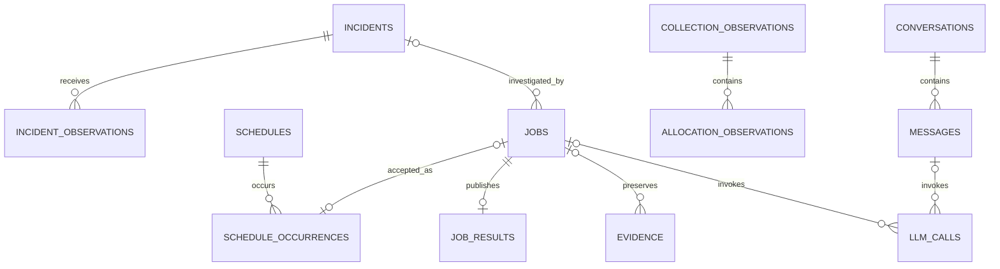

# 03. DSX 데이터 설계서

문서 ID: DSX-DATA-001 · 버전: 1.0 · 기준일: 2026-09-16 · 상태: 개발 기준

대응 요구사항: F01~F13, N01~N03. 수집 데이터의 의미와 조회 계약, 서비스 PostgreSQL의 구현 모델을 함께 정의한다. 아래 테이블은 신규 구현 대상이며 생성·적재 완료 상태가 아니다.

## 1. 저장소와 데이터 소유

| 저장소 | 기준 데이터 | 접근·갱신 |
|---|---|---|
| Mimir | GPU·Host·KSM 시계열, 전달된 매핑 지표 | 기존 수집 경로가 기록, 공통 조회 도구가 읽음 |
| Loki | Fleet 등 실제 수집되는 로그·이벤트 | 기존 수집 경로가 기록, 공통 조회 도구가 읽음 |
| PostgreSQL | 업무·관계·품질·사건·작업·결과·발행 지식·대화·검토 | Backend 공통 저장 모듈 |
| Object Storage 관측 영역 | Mimir/Loki가 관리하는 관측 보관 데이터 | 해당 저장소의 설정·정책에 따름 |
| Object Storage 업무 영역 | 큰 근거 스냅샷·보고서 파일 | Backend 전용 경로·권한·checksum. 관측 내부 블록 직접 조작 금지 |
| Git/배포 아티팩트 | 등록 query/procedure·파서·산식 코드, 지식 근거 원문 | 코드/자료 버전으로 관리. 실행용 Runbook·정책은 PostgreSQL 발행본이 기준 |

SQL에 원시 시계열과 전체 로그를 복제하지 않는다. 실행 결과를 재검토하는 데 필요한 입력 요약·제한된 스냅샷은 보존한다. 원문 URL만 남긴 경우 원문 만료 뒤 완전 재현 가능하다고 표시하지 않는다.

## 2. 수집·조회 경로 기준

| 범위 | 현재 자료 기준 | 적용 원칙 |
|---|---|---|
| 두 CPC 공통 | CSC 중앙 조회와 GPU↔Pod 활용 가능이라는 사용자 확인 | 기능을 두 CPC에 제공하되 대상별 실제 값·권한·기간 검증 |
| CPC-2 KSM/Exporter | Alloy EndpointSlice 발견·직접 scrape → Gateway → Mimir | 신규 GPU Ops 경로. 기존 Prometheus는 별도 모니터링으로 유지 |
| Fleet | Fleet → Alloy → Gateway → Mimir/Loki | 대표 필드와 로그 원문 계약은 각 생산자 기준 |
| CPC-1 직접 수집 | 후속 적용 확인 항목 | CPC-2 전환 완료를 그대로 복제하지 않음 |
| CPC-2 UID | Exporter 작업 라벨 + 같은 시점 KSM uid 조인 성공 기록 | Exporter UID 옵션 false 유지 기록 반영. 별도 Mapper 서비스 필수 아님 |
| 최신 로그 | CPC-2 최종 재배포 뒤 Loki 최신 도착 확인 대기 기록 | 기존 로그 전송 기반과 해당 재배포 검증을 구분 |

Mimir는 공통 tenant `cpc-1`에 대상 `cluster_id` 필터를 적용한다. CPC-2 Loki 표본은 tenant `cpc2`, 라벨 `cluster=cpc2`다. CPC-1 Loki 실제 값은 C02에 등록한다. tenant를 사용자 권한으로 사용하지 않는다.

## 3. 수집 데이터 사전

상태는 실환경 전체의 단정이 아니라 근거 범위다. ‘검증 구간’은 2026-09-15 CPC-2 15:40~15:54 KST 기록이며 장기 이력·실제 부하 반응 검증을 대체하지 않는다.

| ID | 논리 데이터 | 이름·생산자/위치 | 단위·식별·의미 | 근거·추가 확인 | 사용 |
|---|---|---|---|---|---|
| D01 | GPU·Node 신원 | Fleet/Exporter의 cluster_id, node, uuid, 모델 등 | GPU는 cluster+UUID, Node 신원은 별도 | Fleet 라벨·CPC-2 연결 표본. node_uid·인벤토리 완전성 추가 | 전체 |
| D02 | GPU 활동 | CPC-2 direct `DCGM_FI_DEV_GPU_UTIL` | 정규화 %, GPU별 원본 시각 | 중앙 검증 구간·0값 확인. 실제 부하·장기 유효성·원본 주기 확인 | O03/O04, R03/R05 |
| D03 | VRAM | direct `DCGM_FI_DEV_FB_USED/FREE`; Fleet `dcgm_fi_dev_fb_used/free/total/used_percent` | 원본 용량 단위를 사전 등록 후 bytes/% 정규화 | direct used/free 및 Fleet 이름 근거. direct total은 확인 완료로 두지 않음 | O01, RCA 근거 |
| D04 | Host CPU·메모리 등 | Fleet `cpu_used_percent`, `cpu_load_average` 등 실제 등록 필드 | Node 수준, load와 % 구분 | 이름·라벨 근거와 값·기간을 별도 기록 | O01, R03/R05/R07 |
| D05 | GPU 오류·상태 | Fleet ECC·clocks_event_reasons·board_limit_violation 등 | counter/gauge/bitmask 등 실제 계약 지정 | 장비별 지원·단위·리셋·센티널 값 검증 필요 | R01/R06/R09, O05 |
| D06 | Node·Pod 관계 | KSM `kube_node_status_condition`, `kube_pod_info` | condition 상태, namespace/pod/node/uid | 세 종류 중앙 수집 및 CPC-2 동시점 UID 조인 기록 | 매핑·R02/R03·O02 |
| D07 | GPU 유효 요청·배치 | KSM `kube_pod_container_resource_requests` + 필요한 객체 상태 | 실제 resource 이름·단위, 유효 Pod 요청 | GPU resource별 원문·init/sidecar 처리·미배치/gate/scheduler 추가 검증 | O07/O08 |
| D08 | GPU↔Pod 할당 | Exporter namespace/pod/container + KSM uid | 전용/MIG/공유, 원본 장치·부모·Pod UID | 현재 매핑 활용 및 CPC-2 UID 조인. 이력·공유·완전성 별도 | O02~O04/O06/O08, R02~R08 |
| D09 | 로그·원본 이벤트 | Loki Fleet component/event_name/오류 원문 | 발생·수신 시각, producer contract, Node/GPU | 배포 버전별 parser와 최신 수신 검증. Healthy는 사건·업무복구와 별도 | Incident·RCA·O05 |
| D10 | 수집 품질 | up, scrape_duration_seconds, 원본 timestamp·실패/포괄 범위 | target/Node/GPU별 기대 대상·유효시간 | CPC-2 target 정상 근거. up=1은 장비 정상 보장 아님 | O11·모든 주장 |
| D11 | 실제 GPU 전력·에너지 | 활성 생산자의 검증된 실제 W 또는 누적 에너지 필드 | W, J 또는 명시 단위→kWh | 원문 필드·값·단위·기간 확인 필요. power limit 제외 | O09/O10 |
| D12 | owner·소유권·배치 제약 | KSM 추가 필드·자산 메타데이터·scheduler·정책 | Workload UID, 팀/프로젝트, allocatable·제약 | 세 종류 KSM 수집만으로 확보 간주하지 않음 | O07/O08, R06/R07 |
| D13 | 업무 영향·성과 | 실제 Pod 종료/작업 로그·진행·처리량 | container 실행·종료 시각·업무 단위 | 추가 확보 범위. Pod 존재와 업무 성과를 구분 | R04/R09, O06/O10 |
| D14 | 파생 업무 이력 | PostgreSQL Incident·결과·실제 조치·버전 이력 | 사건·job·운영 기록 ID | 서비스 구현 이후 축적. 기존 수집 지표로 간주하지 않음 | O05/O10, R06/R09 |

대표 소스는 의미 ID·모델·CPC·유효 기간별로 선택한다. Fleet/Exporter 어느 한쪽을 전역 우선으로 고정하지 않는다. 대소문자가 다른 이름은 생산자·정의 검증 없이 같은 시계열로 합치지 않는다. 소스 변경 전후의 `collection_path`·전환 시각·revision을 남긴다.

데이터 사전 revision에는 `meaning_id, source_name, source_version, raw_field, raw_unit, normalized_unit, value_type, entity_kind, supported_models, invalid_values, labels, query_id, original_period, max_age, valid_from/to, verification_scope, evidence_refs`를 기록한다. 미검증 원본 이름은 null이며 후보 이름을 실행 템플릿으로 발행하지 않는다.

## 4. 식별·연결·시간

| 대상 | 기준 키 | 제한 |
|---|---|---|
| CPC | cluster_id | tenant 이름과 별개 |
| Node | cluster_id + node_uid 또는 검증된 node instance | 이름 재생성·장비 교체를 이름만으로 합치지 않음 |
| GPU | cluster_id + gpu_uuid | Node 관계는 시간별 관리. index·PCI는 보조 식별 |
| Pod | cluster_id + pod_uid | UID 미확인은 null, namespace/name은 표시·현재 조회용 |
| Container 실행 | Pod UID + container name + container ID/실행 구간 | 같은 Pod 재시작을 별도 Pod나 자동 할당 해제로 해석하지 않음 |
| MIG | 부모 UUID + 실제 instance ID + 구성 유효 구간 | 프로파일을 instance 영구 ID로 사용하지 않음 |
| Workload·소유권 | controller UID·owner chain / 명시 소유권·유효 구간 | Namespace·node_group만으로 팀·사람 추정 금지 |

CPC-2의 동시점 GPU 소스 결합 키는 `cluster_id+node+uuid`; UID 결합 키는 `cluster_id+namespace+pod+node`다. 원본 `uid`를 `pod_uid`로 정규화하고 출처를 보존한다. Exporter 자체 라벨은 `exporter_*`, 작업 라벨은 namespace/pod/container로 구분한다. 활동률 > 0으로 매핑을 사전 필터링하지 않는다.

모든 저장 시각은 timezone-aware UTC이며 기간은 `[start,end)`다. `occurred_at`(발생), `observed_at`(원본 관측), `ingested_at`(수신), `evaluated_at`(조회 평가), `data_cutoff_at`(입력 마감)을 별도 기록한다. 같은 평가 시각이어도 원본 시각·신선도가 맞아야 조인한다.

폴링 이력은 같은 관계가 인접 성공 관측에서 유지되고 간격이 검증된 원본 주기 T의 2배 이내인 구간만 관측 기반으로 연결한다. T 미확인·장기 공백·상충 UID·변경 경계는 기간 귀속 보류다. 마지막 값을 분석 종료까지 연장하지 않는다. `valid_to=null`은 무한히 유효한 할당을 뜻하지 않는다.

## 5. 공통 관계·품질 응답

| 필드 | 타입·값 | 의미 |
|---|---|---|
| cluster_id, node, gpu_uuid | string 또는 확인 불가 시 null | 원본/정규화 신원 분리 |
| node_uid, pod_uid, namespace, pod_name, container | string/null | 이름만 있으면 identity_status=name_only |
| parent_gpu_uuid, device_id, mig_config_id | string/null | MIG/공유 장치 식별 |
| allocation_mode | exclusive/mig/time_slicing/mps/unknown | 여러 정상 공유 관계는 ambiguous가 아님 |
| relation_status | matched/ambiguous/not_observed/unknown | 수집 공백의 not_observed는 미할당 확정 아님 |
| identity_status | uid_resolved/name_only/unknown | 현재 이름 기반 조회와 과거 신원 구분 |
| time_basis | snapshot/observed_interval/authoritative_event_interval | 마지막 값 추정과 실제 이벤트 구분 |
| observed_at, ingested_at, valid_from, valid_to | timestamp/null | 확인된 범위만 기록 |
| boundary_uncertainty | object/null | 마지막 존재·최초 부재·경계 원인 |
| quality | object | 성공·완전성·기대/유효/제외 범위·원본 주기·신선도 |
| evidence_refs, source_versions | array | 원본·파서·수집 계약 참조 |

각 조회는 `tool_status=ok|partial|empty|unavailable|parse_error`를 반환한다. 각 분석 주제는 별도의 `status=ready|partial|blocked|not_applicable`을 사용한다. `job.status`는 02의 작업 실행 상태다. 이 세 상태를 하나의 enum으로 합치지 않는다.

## 6. PostgreSQL 물리 모델

### 6.1 공통 규칙

외부 노출 업무 ID는 UUID 타입으로 저장하고 API에서는 문자열로 직렬화한다. 범위·상태·관계·정렬 필드는 일반 열, 버전 고정된 결과 본문·원본 요약은 JSONB를 사용한다. 모든 시간을 `timestamptz`, 버전·시도를 integer, 횟수를 bigint, 원본/계산 수치를 double precision으로 저장한다. NaN·무한대는 유효값으로 발행하지 않는다.

모든 업무 레코드에 created_at, 필요한 경우 updated_at·version을 둔다. 외부 식별자의 null은 미확인 상태를 의미하며 임의 문자열 키로 영구 신원을 만들지 않는다. UUID 형식만으로 권한을 보장하지 않는다.

### 6.2 계정·설정·지식

| 테이블 | 주요 열·타입 | 키·제약·관리 |
|---|---|---|
| `access_grants` | id uuid; principal text; role text; cluster_id text; namespace text nullable; asset_observation boolean; enabled boolean | 역할·범위 조합 중복 방지. namespace null은 해당 CPC 전역 권한이므로 명시 부여 |
| `service_profiles` | id uuid; kind text; name text; config jsonb; secret_ref text nullable; version integer; enabled boolean | kind+name unique. 비밀 원문 저장 금지. config는 종류별 스키마 검증 |
| `knowledge_revisions` | id uuid; knowledge_id uuid; knowledge_key text; revision integer; kind text; state text; content jsonb; content_hash text; compatibility jsonb; source_refs jsonb; reviewer text nullable; reviewed_at/published_at/retired_at timestamptz nullable | knowledge_id+revision 및 key+revision unique. 같은 knowledge_id의 key/kind는 불변으로 검증. kind=runbook/policy/data_dictionary/reference/case. 발행 content 불변, 변경은 새 revision |

조사 procedure·query·parser는 등록 코드와 버전이 원본이다. 지식 문서는 해당 ID와 버전을 참조하며 DB에 실행 가능한 임의 코드를 넣지 않는다. 정확 조건을 먼저 검색하고 필요한 문서 텍스트 검색은 PostgreSQL 기능을 이용한다. 벡터 검색 저장소를 기본으로 추가하지 않는다.

### 6.3 관계·관측

| 테이블 | 주요 열·타입 | 키·제약·관리 |
|---|---|---|
| `identity_history` | id uuid; cluster_id text; relation_kind text; subject_key/object_key text; subject_kind/object_kind text; valid_from/to timestamptz; observed_at timestamptz; identity_status text; attributes jsonb; evidence_id uuid | GPU→Node, Pod→Workload, 소유권 등 관계 이력. key는 종류별 검증된 정규화 키. 겹치는 모순을 임의 하나로 선택하지 않음 |
| `collection_observations` | id uuid; cluster_id text; source text; observed_at/ingested_at timestamptz; scope jsonb; success boolean; completeness text; expected_count/observed_count bigint nullable; source_revision text; dedup_key text | source+cluster+dedup_key unique. 빈 정상 조회와 실패 조회도 행 저장. count만으로 완전성 보장 안 함 |
| `allocation_observations` | id uuid; collection_id uuid; cluster_id text; node/node_uid/gpu_uuid/parent_gpu_uuid/device_id/mig_config_id text nullable; namespace/pod_name/pod_uid/container/container_run_id text nullable; allocation_mode/relation_status/identity_status/time_basis text; observed_at/ingested_at timestamptz; original_gpu_sample_at/original_pod_sample_at/valid_from/to timestamptz nullable; boundary_uncertainty/raw_labels/evidence_refs jsonb; relation_key text | collection_id FK. collection+relation_key unique. 상충 후보·결합 전 원본 시각·라벨·근거 모두 보존. source 관계키 생성 규칙 revision 고정 |

할당이 0건인 성공 조회는 collection만 있고 allocation은 0행이다. 이 구조로 실패·불완전 조회와 완전한 부재를 구분한다. 기간 계산은 관측을 연결하되 할당해제 원장이 존재하는 것처럼 폴링 결과를 확정하지 않는다.

### 6.4 사건·업무·결과

| 테이블 | 주요 열·타입 | 키·제약·관리 |
|---|---|---|
| `incidents` | id uuid; cluster_id text; asset_key text nullable; raw_asset jsonb; symptom text; status text; first_seen/last_seen timestamptz; correlation_key text; episode_key text; evidence_version/version integer; recurrence_of uuid nullable | correlation+episode unique. recurrence_of 자기 FK. 분석 완료와 사건 종결 별개 |
| `incident_observations` | id uuid; incident_id uuid; source_profile_id uuid; source_event_key text; observation_kind text; occurred_at/received_at/last_received_at timestamptz; receipt_count bigint; producer_contract text; parser_version text; raw_snapshot jsonb; evidence_id uuid nullable | source_profile+source_event_key unique. 실제 공급자 키 없으면 정규화 본문 hash 규칙 사용·revision 고정 |
| `schedules` | id uuid; owner text; scope jsonb; report_request jsonb; calendar jsonb; enabled boolean; revision integer; next_run_at/last_evaluated_at timestamptz; block_reason text nullable | 달력 스키마와 권한 검증. 일정 변경은 revision 증가 |
| `schedule_occurrences` | id uuid; schedule_id uuid; revision integer; scheduled_for timestamptz; period_start/end timestamptz; status text; job_id uuid nullable; reason text nullable | schedule+revision+scheduled_for unique. status=accepted/missed/blocked. 접수 행·job을 같은 트랜잭션으로 생성 |
| `jobs` | id uuid; kind text; principal text; scope/request/versions jsonb; incident_id/parent_job_id uuid nullable; request_operation/idempotency_key/request_hash text; auto_run_key text nullable; status/stage text; priority integer; attempt_no/max_attempts integer; available_at/created_at/started_at/deadline_at/lease_expires_at/cancel_requested_at/completed_at timestamptz nullable; worker_id text nullable; termination_reason text nullable; version integer | kind=rca/report. principal+request_operation+idempotency_key unique. auto_run_key는 사건+증거버전+분석프로필버전의 정규화 키로 non-null unique. 핵심 실행 상태 원장은 이 테이블 하나 |
| `job_results` | job_id uuid; result_schema_version text; body jsonb; narrative_status text; created_at timestamptz; content_hash text | job_id PK/FK. 한 job에 final 하나. 결과 본문 불변. analysis/report 전용 결과는 body 스키마로 구분 |
| `evidence` | id uuid; job_id uuid nullable; attempt_no integer nullable; cluster_id text nullable; scope jsonb; query_id/query_version/source_version text; input jsonb; tool_status text; time_start/end/data_cutoff_at timestamptz nullable; quality jsonb; snapshot jsonb nullable; object_key/checksum text nullable; expires_at timestamptz nullable | 스냅샷 또는 검증된 object 참조. 결과·지식에서 참조한 근거의 보존 관계 검사 |
| `llm_calls` | id uuid; job_id/message_id uuid nullable; attempt_no integer nullable; stage_id/request_id text; profile_id uuid; state text; slot_key text nullable; lease_expires_at timestamptz nullable; submitted_at/finished_at timestamptz nullable; input/output_tokens bigint nullable; error_code text nullable; versions/timings jsonb | 활성/unknown 슬롯은 slot_key 부분 unique. job 또는 message 중 하나에 속함. 실패·불명 원격 호출도 기록 |

`analysis_id`와 `report_id`는 해당 kind의 job ID다. 이전 논리 설계의 analysis_run/report_run은 jobs의 업무별 보기로 구현하고 실행 상태를 중복 저장하지 않는다. 일부 근거·계산 체크포인트는 evidence에 저장하며 final result와 구분한다.

동일 job의 결과 확정은 현재 attempt·lease·취소·마감 조건과 함께 트랜잭션으로 처리한다. 참조 ID가 같은 사용자에게 보인다는 이유만으로 scope 일치를 생략하지 않는다.

### 6.5 대화·운영 기록

| 테이블 | 주요 열·타입 | 키·제약·관리 |
|---|---|---|
| `conversations` | id uuid; owner text; scope/context jsonb; title text; version integer | 본인/명시 관리 권한만 읽기. 맥락 참조는 재조회 시 권한 확인 |
| `messages` | id uuid; conversation_id uuid; sequence bigint; role text; content text; status text; context_refs jsonb; job_id uuid nullable; idempotency_key text nullable | conversation+sequence unique. 사용자 입력 키 중복 방지. 실패 응답 상태 보존 |
| `review_records` | id uuid; subject_type text; subject_id uuid; kind text; author text; occurred_at timestamptz nullable; body jsonb; supersedes_id uuid nullable | append-only. subject_type별 존재·scope 검사. action은 대상·실행자·발생 시각 필수 |
| `audit_events` | id uuid; actor text; action text; resource_type text; resource_id uuid nullable; occurred_at timestamptz; request_id text; scope jsonb; before_ref/after_ref jsonb; outcome text | 권한·설정·지식·상태·조치 변경 기록. 비밀값·전체 프롬프트를 무조건 복제하지 않음 |

## 7. 주요 관계도

그림은 핵심 FK를 표시한다. 결과 body의 지식 revision·근거 참조와 review의 대상 참조는 종류별 검증을 통해 연결한다. polymorphic 참조에 잘못된 다른 종류 ID를 넣지 못하도록 공통 저장 모듈에서 검증하고 시험한다.

## 8. 필수 제약·조회 인덱스

| 영역 | 필수 조건 |
|---|---|
| 시간·수치 | 알려진 기간은 end>start, count≥0, attempts≥0, max_attempts>0. 유효 숫자와 null/품질 사유 동시 검사 |
| FK | 사건·job·일정·collection·대화 등 명시 FK 사용. 보존 대상은 연쇄 삭제 대신 RESTRICT 기본 |
| 열거 | 상태·kind·할당 방식·지식 상태는 CHECK 또는 동등한 DB 제약. JSONB는 버전별 서버 스키마 검증 |
| 큐 | 실행 후보 `(kind,available_at,priority,created_at)`의 queued/retry_wait 부분 인덱스; running lease 만료 조회 인덱스 |
| 사건 | `(cluster_id,asset_key,first_seen DESC)`, `(cluster_id,status,last_seen DESC)`, 관측 incident_id 인덱스 |
| 매핑 | collection `(cluster_id,source,observed_at)`; allocation `(cluster_id,gpu_uuid,valid_from)` 및 `(cluster_id,pod_uid,valid_from)`; collection_id 인덱스 |
| 결과·대화 | jobs `(principal,created_at DESC,id)`와 incident_id/parent_job_id; evidence job_id; messages conversation+sequence |
| 지식 | knowledge_key+revision unique, kind/state 조회. 호환성을 먼저 필터링한 뒤 최신 발행 revision 선택 |
| 보존 참조 | purge 전에 job 결과·지식·근거·파일의 역참조와 만료 정책 확인. 발행 지식은 물리 삭제 대신 retired |

인덱스는 실제 WHERE/JOIN·실행계획으로 검증하고 모두의 JSON 속성에 일괄 인덱스를 만들지 않는다. 최초부터 파티션·별도 분석 DB를 요구하지 않는다. 실측 데이터 크기·조회 시간에 따라 추가한다.

## 9. 근거·버전·보존 계약

각 job에 request/schema/producer/parser/query/identity/calculation/criteria/procedure/knowledge/model/prompt의 실제 사용 버전을 저장한다. 모델은 이름 외 실제 배포 artifact/revision·추론 설정도 연결한다. 스냅샷은 입력 마감과 시점이 고정돼야 한다.

큰 파일은 업로드·checksum 확인 후 final 결과에서 참조한다. DB final 커밋 전 파일 업로드 실패는 성공이 아니다. 취소·실패로 남은 미참조 파일은 안전한 지연 정리 대상으로 기록한다. DB 복원 시 참조 파일의 존재·checksum을 대조한다.

| 데이터 | 보존 설정 원본 | 삭제·만료 시 원칙 |
|---|---|---|
| Mimir/Loki 원본 | C05의 저장소·tenant 보존 설정 | 원문 만료 시 결과에서 원문 접근 불가 표시 |
| 관계·사건·결과·핵심 근거 | C05의 업무 보존값 | 인수 대상 보고 기간·재검토 기간을 충족. 수치만 남기고 근거를 먼저 소거하지 않음 |
| 발행 지식·규칙·코드 revision | 과거 결과 참조 기간 이상 | 폐기는 신규 선택 중지, 과거 인용 유지 |
| 대화·LLM 호출·감사 | C05의 종류별 보존값 | 필요 최소 내용, 비밀 제외, 삭제 권한·실행 이력 유지 |
| 백업 | C05/C10 | 실제 복원 시험과 동일 보존 체계. 파일과 DB 일관성 확인 |

단일 Mimir tenant의 source 라벨만으로 Fleet·Exporter 보존 기간을 서로 다르게 설정한다고 전제하지 않는다. 수집 경로 전환 시 과거 기간까지 최신 `collection_path`로 필터링해 근거를 버리지 않는다.

## 10. 검증과 인계

필수 검증은 T03~T06, T15~T21, T23~T27, T29~T35, T38~T40이다. 데이터 사전에서 아직 값이 없는 항목은 C03/C04에 source·대상·검증 시각·담당·미확인 시 결과를 기록한다. 실제 migration 파일과 실행계획·복원 증거는 구현 단계에 첨부한다.

[01 범위](<01_요구사항_개발범위_정의서.md>) · [02 API](<02_백엔드_API_작업명세서.md>) · [04 판단](<04_Agent_동작_판단_명세서.md>) · [05 검수](<05_테스트_검수_기준서.md>) · [06 인계](<06_배포_운영_인계서.md>)
