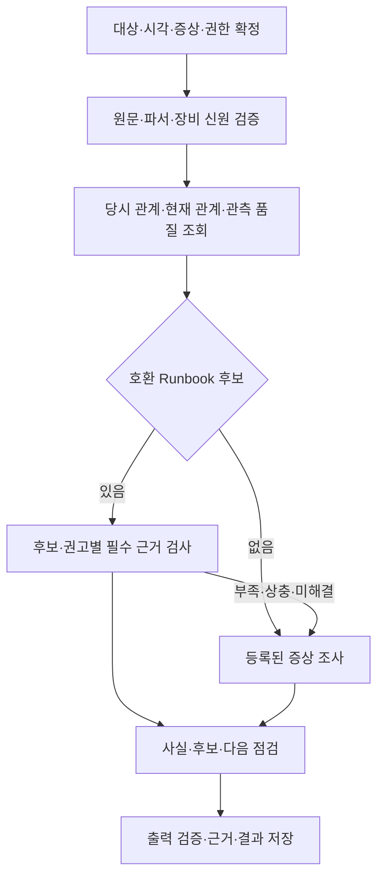

# 04. DSX Agent 동작·판단 명세서

문서 ID: DSX-AGENT-001 · 버전: 1.0 · 기준일: 2026-09-16 · 상태: 개발 기준

대응 요구사항: F05·F06·F09·F10·F11, N01~N04. 공통 데이터·식별은 03, 작업 실행은 02를 따른다. 이 문서는 기존 공통 판단 기준 v1.0의 산식·정책을 유지하고 최신 수집 상태를 반영한 구현 명세다.

## 1. 공통 역할과 상태

공통 도구는 조회·연결·계산·품질·규칙을 결정적으로 수행한다. LLM은 사실 설명·후보 정리·등록된 다음 조사의 선택을 맡는다. 일반 Assistant는 요청 해석과 기존 결과 설명·가벼운 조회를 처리하고 긴 RCA·보고서는 해당 전문 작업으로 접수한다.

| 축 | 값 | 해석 |
|---|---|---|
| 작업 실행 | queued/running/retry_wait/succeeded/failed/cancelled/expired | 접수·실행·저장 상태. 02 기준 |
| 조회 도구 | ok/partial/empty/unavailable/parse_error | 저장소 접근·응답 상태. 03 기준 |
| 분석 주제 | ready/partial/blocked/not_applicable | 근거가 충족하는 산출 범위 |
| Pod 배치 | unbound/bound/unknown | 노드 바인딩. 원래 phase·condition은 별도 보존 |
| GPU 관계 | matched/ambiguous/not_observed/unknown | 실제 장치 관계의 관측·모호성 |
| GPU 활동 | active_observed/low_activity_candidate/insufficient_data/not_applicable | 아래 시간창·품질·규칙에 따른 관측 |

job이 succeeded라도 과거 할당시간은 blocked일 수 있다. 부분 조회가 모든 주제 실패를 뜻하지 않는다. ‘Pending→Mapped→Active→Released’ 하나의 상태 흐름으로 합치지 않는다.

## 2. 공통 실행 순서

1. 요청자의 현재 권한과 scope·target·기간·시간대를 검증하고 입력을 정규화한다.
2. 데이터 마감 시각·등록 query/procedure·파서·산식·정책·지식·모델 버전을 고정한다.
3. 각 주제의 필수/보조 입력을 검사한다. 원본 시각·의미·단위·모델 지원·완전성 조건을 적용한다.
4. 허용된 query ID로 필요한 범위만 조회하고 근거 스냅샷·tool_status를 남긴다.
5. 같은 신원·시간 구간으로 연결하고 중복·공백·상충·센티널 값을 처리한다.
6. 주제별 수치·품질·사실·미확인 정보를 만든다. 실패한 입력에 의존하지 않는 분석은 계속한다.
7. 공유 추론 한도 내에서 LLM이 설명 또는 등록된 추가 조사를 요청한다. 서버가 다시 권한·예산·도구 입력을 검사한다.
8. 구조화 결과와 설명의 대상·숫자·인용·판단 수준을 대조한 뒤 최종 저장한다. 취소·만료·무효 attempt는 결과를 발행하지 않는다.

## 3. RCA 입력과 조사 절차

트리거는 Incident, 사용자 증상, 추가 증거에 따른 재분석, 보고서에서 요청한 후속 조사다. 사건 ID는 선택이며 사건 없는 요청도 동일 작업 관리·근거 계약을 사용한다. 동일 입력의 기술적 재시도는 attempt, 새 근거의 조사는 새 job이다.



### 3.1 업무별 계약

‘필수’는 해당 주장의 조건이다. 표에 적힌 추가 입력이 없다고 장비 기본 조사 전체를 중단하지 않는다.

| ID | 입력·필수 데이터 | 처리·출력 | 부족 시 |
|---|---|---|---|
| R01 알려진 오류 | 원문·producer/parser 계약·장비, D01/D05/D09·KB | 코드·장비·버전으로 후보 검색 → required_evidence 검사 → 적용 가능한 권고·반박·미충족 조건 | 코드/계약 불명은 원문 보존·일반 조사. 코드 하나로 원인 확정 금지 |
| R02 GPU→Pod | D01/D08, 현재 또는 사건 시각 | 직접 매핑·같은 노드 참고 Pod·현재/당시 관계 분리 | 매핑 미확인 표시. 같은 노드 Pod를 직접 사용자로 지정하지 않음 |
| R03 Pod→GPU | Pod 신원·D08 및 가용 D02~D06/D09 | 관련 GPU와 공통 Node의 증상·활동·상태 비교 | 장치 미확정이면 Pod/배치 근거만 제공 |
| R04 작업 영향 | 사건 당시 D08·D09·D13 | 당시 관계와 실제 중단·재개·원인 연계를 별도 기록 | 현재 관계만 있으면 당시 영향 unknown/not_assessed |
| R05 미등록 증상 | 증상·대상·시각, 가용 D01~D10 | 등록 procedure로 지지/반박 가능한 후보와 추가 확인 | 원인 불명으로 종료해도 사실·부족 정보·다음 확인 제공 |
| R06 재발 위치 | D14 정규화 사건·기간, 필요 시 D08/D12 | 장비 집중/작업 이동 패턴·모델·버전·관측시간 비교 | 작업 이력 없으면 장비 사건 비교만 제공 |
| R07 공통 장애 범위 | 동시 사건·Node·매핑, 필요 시 토폴로지 | 확인된 Node/GPU/연결 범위와 관련 작업 | 토폴로지 없는 장치 영향은 미확정 |
| R08 조치 검토 대상 | 최신 D08·장비/공유/조치 범위·정책 | 현재 관련 작업·원본 시각·조치 전 확인 목록 | 매핑이 비었다고 리셋 안전 확정 금지 |
| R09 조치 후 관측 | D14 실제 조치 시각·D05/D09/D10, 업무 회복은 D13 | 장비 정상 관측·오류 재관측·작업 재개를 분리 | Healthy만 있으면 업무 복구 미확인 |

### 3.2 등록 조사와 종료

기본 procedure는 GPU 접근 이상, GPU 사건과 Pod, 작업 진행 이상, 다중 장치 사건의 네 가지를 제공한다. 각 procedure는 `procedure_id/version, accepted_symptoms, required/optional_queries, allowed_next_steps, stop_conditions, limits`를 가진 등록 함수다. 범용 YAML 해석 엔진을 만들지 않는다.

초기 시간창·최대 확대·최대 후속 조사·조회 건수·로그 크기·전체 deadline은 C07에 배포 프로필로 등록한다. 기존 예시의 전후 10분·추가 2회·최대 전후 60분은 시험용 시작안이며 실제 배포 확정값으로 사용하지 않는다.

| 종료 이유 | 의미·필수 출력 |
|---|---|
| evidence_sufficient | 현 단계의 결론을 설명할 근거 충족. 인과 확정을 자동 의미하지 않음 |
| missing_data | 부족 데이터와 수집/조회할 다음 항목 |
| conflicting_evidence | 상충 근거를 모두 보존하고 구분할 다음 검사 |
| unsupported_source | 호환 계약·파서/장비 범위와 미지원 부분 |
| budget_exhausted | 사용한 예산·중단 단계·남은 확인 |
| query_failed | 실패한 도구·범위·이미 확보한 독립 결과 |

취소·작업 마감·영구 실패는 02의 작업 상태/종료 사유로 추가 기록한다. 데이터 부족을 해결하려 무제한 재시도하지 않는다.

### 3.3 관계·영향·원인 판단

| 축 | 값 | 승격 조건 |
|---|---|---|
| relation_scope | current_mapping / incident_time_mapping / same_node_only / unknown | 해당 시각·신원·매핑 근거 |
| impact_status | not_assessed / no_impact_observed / disruption_observed / recovery_observed | 확인한 기간의 작업 상태·로그·진행 근거 |
| causal_status | undetermined / candidate / supported / confirmed | 후보별 지지·반박·확정 조건. confirmed는 검토된 조건과 증거가 있어야 함 |

`no_impact_observed`는 확인한 범위에서 영향을 보지 못했다는 뜻이다. 같은 시각에 Pod가 종료됐다는 사실만으로 GPU가 원인이라고 확정하지 않는다. 임의 확률값을 붙이지 않는다.

## 4. 운영보고서 입력과 처리

입력은 scope·기간·시간대·주제·그룹·선택 비교 기간이다. 요청을 접수할 때 실제 절대 기간과 적용 범위를 화면에 표시한다. 정기 보고서는 완료된 달력 기간을 사용한다.

주제별 조회 → 같은 시각의 신원 연결 → 단위·공백·중복 검증 → 결정적 계산 → 규칙 적용 → 사실·검토 대상·다음 행동을 만든다. 보고서는 RCA의 Incident·결과를 참조하며 별도 사건 원장을 만들지 않는다.

| ID | 주제·필수 데이터 | 결과·판단 | 부족 시 |
|---|---|---|---|
| O01 | 장비·Node 변화: D01/D03/D04/D06, 관련 작업은 D08 | 장치·Node 현황/변화와 연결 Pod. 장치 VRAM과 Pod 메모리 실사용 구분 | 현재 값만 있으면 추세 보류 |
| O02 | 할당 명세·시간: D08·전용/공유, 기간은 UID·이력·D10 | 현재 고유 장치·할당 단위, 관측 기반 GPU-hours/instance-hours | 현재 연결만 있으면 현재 수량만. GPU 요청 없어도 매핑 이력 기반 시간 가능 |
| O03 | 저활동: O02 + D02·품질·업무 예외 | 저활동 후보·실제 저활동 구간·확인할 작업·예외 | 활동 없으면 저활동 null. VRAM으로 대체 금지 |
| O04 | 다중 GPU 편차: 같은 작업·시간의 D02/D08 | 장치별 시간 가중 평균·차이·추가 점검 | 프로파일/업무 근거 없으면 병목·불량 확정 금지 |
| O05 | 반복 사건·정비 순위: D09/D14·사건 관측시간 | 중복 제거 건수·재발 간격·관측시간당 발생률·RCA 참조 | 분모 없으면 건수만, 전체 발생률 순위 보류 |
| O06 | 사건 당시 작업: D09/D14 + 당시 D08, 영향은 D13 | 관련 작업·중단 관측·원인 판단 구분 | 현재 매핑 소급 금지 |
| O07 | 배치 대기·용량: D07/D12·객체 신원/종료·바인딩·scheduler | 미배치 요청·노드별 잔여 용량·배치 제약·단편화 후보 | phase만 있으면 원인/부족량 보류. UUID 없는 미배치 Pod 유지 |
| O08 | Namespace·프로젝트 배분: D08, 프로젝트는 D12 | 현재 할당 명세, 기간 확보 시 시간·정책 검토 | owner/프로젝트 없으면 Pod/Namespace 수준 유지 |
| O09 | GPU 에너지: D11·D01/D10·기간 | 실제 W 적분 또는 검증된 에너지 증가량, 모델별 비교 | power limit만 있으면 kWh null |
| O10 | 조치 전후: D14·동일 정의 지표·기간, 효과는 D13 | 조치 사실·전후 변화·업무량 차이·미확인 원인 | 업무량 없으면 변화만 보고, 인과적 개선 효과 확정 금지 |
| O11 | 관측 품질: D10·기대 대상·주기·각 입력 | 신선도·공백·신원 귀속·생산자 불일치·영향 주제 | 분모 모르면 전체 커버리지 null, 확인한 범위만 |

O04는 v1에서 장치별 값·최대/최소·차이를 제공한다. 별도 ‘이상 편차’ 자동 판정 임계값은 검증된 정책이 있을 때만 사용한다. O05는 동일 정의·모델·관측 범위별 발생률과 건수로 정렬하고 미검증 가중 종합 점수를 만들지 않는다.

## 5. 계산 기준 v1.0

### 5.1 구간·중복·분모

전용 GPU의 같은 할당 대상·시간에 여러 컨테이너/생산자 관측이 있어도 유효 구간 합집합을 한 번 센다. 동일 물리 GPU를 여러 Namespace가 공유하면 물리 합계는 한 번, 공유 관계 수는 따로 표시한다. MIG는 구성·프로파일별 instance-hours이며 물리 GPU-hours와 합산하지 않는다.

필수 입력들의 **동시 유효 구간 교집합**을 공동 관측 구간으로 사용한다. 개별 커버리지 평균·최솟값으로 대체하지 않는다. 분모는 주장별 기대 GPU·시간, 유효 할당 대상·시간, 기대 Node·시간으로 명시한다. 기대 대상/할당 이력 자체가 없으면 분모와 전체 커버리지는 null이다.

0은 관측된 유효 0이다. 수집 실패·미지원·센티널·오래된 값은 null과 이유로 처리한다. counter 리셋·기기 교체·소스 변경 경계는 각각 검증한 구간만 계산한다.

### 5.2 산식

| 지표 | 산식·단위 | 제한 |
|---|---|---|
| 현재 전용 할당 | 기준 시각에 유효한 전용 고유 GPU 수 | 불완전 매핑이면 확인된 수량·범위만 |
| 할당 GPU-hours | Σ(전용 GPU별 유효 할당 구간 합집합 초)/3,600 | 활동값 없어도 계산 가능, 과금 원장으로 보장하지 않음 |
| 저활동 GPU-hours | Σ(할당∩활동 유효∩util<5% 구간의 GPU·초)/3,600 | 선정된 시간창 전체로 대체하지 않음 |
| 평균 활동률 | Σ(util%×유효 GPU·초)/Σ(유효 GPU·초) | 동일 의미·모델/공유 방식, 분모 0이면 null |
| 시간 가중 P95 | 값 오름차순 누적 유효시간이 전체의 95% 이상이 되는 최소 값 | 시간 분포/장치 간 분포를 구분, 샘플 개수 동일 가중 금지 |
| 미배치 요청 | 종료/삭제 아닌 unbound Pod의 검증된 유효 요청 합 | 실제 resource 단위, init/sidecar/overhead 규칙은 배포 버전별 등록 |
| 관측 미배치 요청시간 | Σ(유효 요청량×확인된 미배치 구간 시간) | 처음 관측 전 대기는 미확인. GPU 부족 시간으로 치환 금지 |
| 미할당 GPU-hours | 인벤토리와 완전한 할당 조회에서 부재 확인된 GPU·시간 | mapping 실패/Pod 종료는 충분조건 아님 |
| 사건 발생률 | 중복 제거 사건 수/유효 사건 관측 GPU-hours×1,000 | 총 건수·모델·기간도 함께 표시 |
| GPU 에너지 | Σ(W×유효 초)/3,600,000 kWh | v1 전력 적분은 유효 유지 구간의 좌측 값. 공백·리셋 제외 |

공통 v1의 전력 적분을 구현하기 위해 좌측 유지값 방식을 채택한다. 원본 최대 유효시간을 초과해 연장하지 않는다. 검증된 누적 에너지 계수를 쓰면 구간 증가량·단위·리셋 규칙을 별도 계산 revision에 명시하고 전력 적분과 중복 합산하지 않는다.

### 5.3 품질·저활동 정책

| 항목 | v1 값 |
|---|---|
| 일반 기간 비교·순위 | 공동 커버리지 95% 이상. 핵심 사건/시간대가 빠지면 충족해도 보류 |
| 저활동 대상 | 확인된 전용 GPU 할당. 공유 장치 활동은 별도 보기 |
| 시간창 | 60분 |
| 저활동 임계값 | 정규화 GPU utilization 5% 미만 |
| 후보 조건 | 공동 커버리지 ≥95%, 유효 할당·활동 시간 중 저활동 비율 ≥90% |
| 보조 근거 | VRAM·검증된 SM·업무 유형. SM 부재만으로 일반 활동 분석 차단 안 함 |
| 예외 확인 | 초기화·체크포인트·추론 대기·예약 목적 등. 목적 불명은 일반 검토 후보 |

검증된 5% 이상 활동이 있고 저활동 후보 조건은 충족하지 않으면 active_observed다. 후보가 되면서 일부 활동도 있으면 low_activity_candidate와 활동 구간을 같이 표시한다. 품질 미달은 insufficient_data다. 저활동 후보는 낭비·회수 가능·성능 비효율 확정이 아니다.

### 5.4 고정 계산 예

아래는 시험 데이터이며 실제 CPC 측정 결과가 아니다.

| 입력 | 기대 결과 |
|---|---|
| 전용 GPU 2개, 각 8시간 유효 할당·각 5시간 저활동 | 할당 16 GPU-hours, 저활동 10 GPU-hours |
| 60분 중 공동 관측 58분, 저활동 54분 | 커버리지 96.6667%, 저활동 비율 93.1034%, 후보=true, 저활동 0.9 GPU-hours |
| 같은 정의의 G1 4건/100 GPU-hours, G2 5건/500 | 발생률 각각 40·10건/1,000 GPU-hours, 총 건수 4·5 |
| GPU 4개×10시간, 전 250W/후 200W, 전 구간 유효 | 10kWh→8kWh, 관측 감소 2kWh. 조치 인과는 별도 |
| Pending 6개, 그중 4개 bound, 2개 unbound·각 유효 GPU 요청 1 | 미배치 요청 2단위. GPU 부족량은 scheduler 근거 없으므로 null |
| 공유 G1에 A·B, G1 활동 80% | 물리 GPU 1, 공유 관계 2. A/B 실사용률 각각 null |

## 6. Knowledge 계약

| 역할 | 담을 내용 | 적용 방식 |
|---|---|---|
| Runbook | 의미·producer 계약·모델/버전·필수 증거·조건·권고·출처 | 정확 조건 후보 검색 후 권고별 적용 가능 검사 |
| 조사 procedure | 등록 ID·버전·입력·분기·종료·한도 | 코드 등록 함수. LLM이 임의 절차를 실행 코드로 등록하지 않음 |
| 운영 정책 | 품질·우선순위·조회 예산·권고 예외 | 발행 revision 사용 |
| 데이터 사전 | D 항목·원본 의미·단위·지원·query ID | 해당 source·모델·기간에 적용 |
| 참고·검증 사례 | 공식/내부 원문·실제 검토 결과·출처 | 후보·설명 보완. 검증 수준 명시 |

초안→검토→발행→폐기의 흐름을 사용한다. 검토 후 내용 수정은 검토 상태를 해제하고 재검토한다. 발행 content는 불변이고 신규 revision으로 수정한다. 폐기는 신규 실행 선택만 막으며 과거 실행 인용은 보존한다.

지식 선택은 **호환 계약·모델·소프트웨어·정책 범위로 먼저 제한한 뒤 그 안에서 최신 발행본**을 고른다. 계약 B용 revision 2가 있다고 계약 A용 revision 1을 전역 최신 규칙으로 제거하지 않는다. supplier 권고와 DSX 정책은 출처를 구분한다. 필수 증거가 부족한 특정 권고만 보류하고 가능한 로그 확인 등의 권고는 유지한다.

LLM 결과·사용자 메모·유사도 높은 문서를 자동으로 검증된 지식에 발행하지 않는다. 결과의 근거·실제 운영 확인·검토를 거쳐 새 revision으로 등록한다.

## 7. LLM 입력·도구·출력 검사

LLM 입력에는 요청 scope·시간, 구조화 사실/수치·품질·evidence ID, 호환 발행 지식의 필요한 구간, 허용 도구·예산만 포함한다. 원시 메트릭·전체 Loki 로그를 통째로 전달하지 않는다. 로그·문서 안의 지시문은 분석 데이터로 취급하고 서버 권한·실행 규칙을 바꾸지 않는다.

허용 도구는 자산 해석, 현재/과거 매핑, 등록 메트릭·로그 조회, 사건 이력, 제공되는 Pod 근거, Knowledge 조회다. 임의 SQL/PromQL/LogQL·쉘·장비 변경 도구를 노출하지 않는다. 도구 출력의 숫자를 다시 추정하지 않는다.

저장 전에는 JSON 스키마, 필수 필드, enum, 대상 scope, evidence ID 존재, 값·단위·기간·반올림 일치, 인과 판단 승격, 권고 선행 조건을 검사한다. 사실·수치는 구조화 값에서 렌더링하고 설명에 있는 수치 참조도 해당 필드와 연결한다. 검증 실패는 제한된 재생성 또는 설명 생략으로 처리하며 잘못된 설명을 정상 결과로 저장하지 않는다.

Nemotron 3 Super는 기존 초기 후보를 유지한다. 실제 서빙 가능 여부·모델/엔진·정밀도·GPU·동시 처리 수치는 C06/C07에서 평가·기록한다. 모델 교체 시 아래 동일 사례와 T40을 재검증한다.

## 8. 결과 계약

공통 최종 결과는 `job_id, kind, scope, target?, time_range, timezone, data_cutoff_at, result_schema_version, versions, facts, evidence_refs, quality, narrative_status, limitations`를 포함한다. facts는 `id,text,evidence_refs`를 갖는다. narrative_status는 complete/failed/omitted이며 작업 성공과 별개다.

RCA는 `incident_id?, incident_time?, current_checked_at, pod_relations, cause_candidates, recommendations, missing_inputs, termination_reason`을 추가한다. 후보는 `id,claim,causal_status,supporting_refs,contradicting_refs,missing_inputs,confirmation_rule_ref?`, 권고는 `text,preconditions,eligibility=eligible|withheld,reason,evidence_refs,execution=not_performed`를 가진다.

보고서는 `topics[]`를 추가한다. 각 주제는 `topic_id,status,metrics,facts,findings,missing_inputs,quality,evidence_refs,recommendations`를 가진다. metric은 `id,value,unit,period,denominator,method,quality`를 포함하며 값이 null이면 이유가 필수다.

```json
{
  "job_id": "example-report-001",
  "kind": "report",
  "result_schema_version": "1.0",
  "scope": {"cluster_ids": ["cpc-2"]},
  "time_range": {"start": "2026-09-15T01:00:00Z", "end": "2026-09-15T02:00:00Z"},
  "timezone": "Asia/Seoul",
  "data_cutoff_at": "2026-09-15T02:01:00Z",
  "versions": {"criteria": "1.0", "query": "test-v1", "model": "not_used"},
  "facts": [],
  "evidence_refs": ["example-current-mapping"],
  "quality": {"history_coverage": null},
  "narrative_status": "omitted",
  "limitations": ["기간 이력 없음"],
  "topics": [{
    "topic_id": "O02",
    "status": "partial",
    "metrics": [
      {"id": "current_allocated_gpu", "value": 2, "unit": "physical_gpu", "period": {"at": "2026-09-15T02:00:00Z"}, "denominator": null, "method": "unique_exclusive_devices", "quality": {"scope": "observed_mapping"}},
      {"id": "allocated_gpu_hours", "value": null, "unit": "GPU-hours", "period": {"start": "2026-09-15T01:00:00Z", "end": "2026-09-15T02:00:00Z"}, "denominator": null, "method": "valid_interval_union", "quality": {"reason": "mapping_history_missing"}}
    ],
    "facts": [],
    "findings": [],
    "missing_inputs": ["mapping_history"],
    "quality": {"history_coverage": null},
    "evidence_refs": ["example-current-mapping"],
    "recommendations": []
  }]
}
```

예시의 현재 수량은 기간 집계와 다른 기준 시각을 명시한다. 결과에 실제 evidence·query·모델 revision을 채우는 것은 실행 책임이다. 표·파일도 저장된 값에서 생성하며 화면마다 산식을 다시 적용하지 않는다.

## 9. 합격 기준

R01~R09와 O01~O11은 각각 정상·필수 입력 부족·독립 부분 성공을 검증한다. 알려진 오류만 처리하고 미등록 조사를 빠뜨리거나, 운영보고서를 단순 지표 나열로 끝내지 않는다. 확인된 사실→운영 검토 대상→근거→다음 확인의 연결이 있어야 한다.

정확한 검증 절차·허용 오차·실행 증거는 [05 검수 기준서](<05_테스트_검수_기준서.md>)의 T10~T21·T38~T40을 따른다. 데이터 계약은 [03](<03_데이터_설계서.md>), 작업·호출 예산은 [02](<02_백엔드_API_작업명세서.md>)와 [06](<06_배포_운영_인계서.md>)을 따른다.
