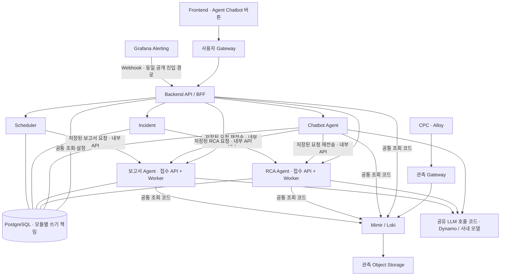

# 00. DSX 모듈 분리 개발 산출물 안내

문서 버전: 1.2 · 기준일: 2026-09-17 · 상태: 개발 기준 / 구현·배포·검수 미실행

이 개정은 사용자가 요청한 **독립 실행·배포 모듈과 Backend의 내부 API 호출 구조**를 반영한다. Backend 안에 있던 대화·Incident·Scheduler를 분리하고 Chatbot, RCA, 보고서를 각각 하나의 Agent 모듈로 설계한다. 이번 산출물은 Markdown 16종이다.

## 1. 개발할 실행 단위

| 모듈 ID | 실행 단위 | 책임 | 설계 원본 |
|---|---|---|---|
| backend | Backend API / BFF | 프론트엔드의 공통 진입점, 권한 확인, 내부 API 중계, 공통 조회·설정 | [02 Backend](02_백엔드_API_작업명세서.md) |
| chatbot | Chatbot Agent | GUI 챗봇 버튼·대화, 화면 맥락, 조회·설명, 전문 작업 요청 전달 | [10 Chatbot](10_Chatbot_Agent_모듈_설계서.md) |
| rca | RCA Agent | RCA 접수 API와 자체 Worker, R01~R09 조사·결과 | [11 RCA](11_RCA_Agent_모듈_설계서.md) |
| report | 보고서 Agent | 보고서 접수 API와 자체 Worker, O01~O11 계산·결과·출력 | [12 보고서](12_보고서_Agent_모듈_설계서.md) |
| incident | Incident | Grafana 수신, 사건·중복·재발 관리, RCA 전달 | [13 Incident](13_Incident_모듈_설계서.md) |
| scheduler | Scheduler | 일정 CRUD, 발생 시각·기간 계산, 보고서 전달 | [14 Scheduler](14_Scheduler_모듈_설계서.md) |

Agent 모듈은 3개이며 그중 장시간 전문 분석은 RCA와 보고서 2개다. RCA Worker와 보고서 Worker는 각각 해당 Agent 모듈의 내부 실행부다. Backend의 자식 프로세스가 아니다. 모듈별 이미지·Endpoint·배포·재시작·검수를 구분한다. 복제 수나 물리 서버 수를 6대로 고정하지 않는다.

## 2. 모듈 구조

실선 호출과 PostgreSQL 저장 연결은 서로 다른 경계다. 공통 조회·계산·Knowledge·LLM 호출·DB 접근 코드는 필요한 모듈에서 재사용하는 라이브러리이며 별도 네트워크 서비스로 늘리지 않는다. LLM 호출 코드는 공유하지만 추론은 별도 계층이고, 호출 예산은 PostgreSQL에서 전체 모듈에 걸쳐 조정한다.

초기 업무 DB는 PostgreSQL 하나를 공유한다. 모듈별 쓰기 소유권과 자격증명을 나누고 다른 모듈의 업무 레코드를 직접 수정하지 않는다. 따라서 **프로세스·배포 분리이며 데이터베이스까지 완전히 분리한 구성은 아니다.** 공통 스키마 변경은 호환 배포가 필요하다.

## 3. 문서와 책임

| 번호 | 문서 | 기준 |
|---|---|---|
| 01 | [요구사항·범위](01_요구사항_개발범위_정의서.md) | F01~F14, N01~N05, 모듈 경계 |
| 02 | [Backend·외부 API](02_백엔드_API_작업명세서.md) | 프론트엔드 계약과 내부 라우팅 |
| 03 | [데이터](03_데이터_설계서.md) | 기존 데이터 모델, 모듈 소유권, 전달 원장 |
| 04 | [Agent 공통 판단](04_Agent_동작_판단_명세서.md) | 산식·관측 품질·지식·결과 계약 |
| 05 | [검수](05_테스트_검수_기준서.md) | T01~T40 유지·개정, T41~T48 모듈 분리 시험 |
| 06 | [배포·인계](06_배포_운영_인계서.md) | 모듈별 배포·연결·복원, C01~C12 |
| 07 | [프론트엔드](07_프론트엔드_개발명세서.md) | Backend만 호출, 전달 중/작업 접수 구분 |
| 08 | [화면](08_GUI_화면설계서.md) | S01~S16/S07B 사용자 흐름 |
| 09 | [변경·추적](09_통합검토_반영내역.md) | v1.1 대비 변경, 영향 문서·시험 |
| 10~14 | 위 모듈별 설계서 | 각 모듈의 API·데이터·실행·실패·완료 조건 |
| 15 | [모듈 간 호출·공통 실행](15_모듈간_호출과_공통실행_계약.md) | 신뢰 경계·멱등·전달 원장·작업·LLM 예산 |

## 4. 변경하지 않은 계약

R01~R09·O01~O11 전체 범위, 일·주·월 정기 보고서 P0, HTML·CSV 출력, CPC/Namespace scope와 기존 판단·산식을 유지한다. 문서 버전은 1.2이지만 **criteria_version과 result_schema_version은 1.1**을 유지한다. 모듈 분리만으로 계산 결과를 새 기준으로 재판정하지 않는다. 인증 제품·site/tenant 전환의 세부 설계는 후속으로 두며, 내부 모듈 간 인증·현재 권한 재검증은 실제 연결 전에 충족해야 한다.

외부 `/api/v1` 경로와 직접 RCA/보고서의 202+`job_id` 계약은 유지한다. Incident·정기 일정·Chatbot의 전문 작업 전달에는 `dispatch_id`와 전달 상태를 추가한다. 전달 저장과 Agent의 실제 job 저장이 서로 다른 커밋임을 화면과 시험에 반영한다.

## 5. 과거 자료와 현재 기준

[이전 v1.1](../deliverables-20260916-v1.1/00_산출물_안내.md)과 그 sources·PDF·ZIP은 이전 구조의 기록이다. [2026-09-16 구조도 v2](../architecture-backend-20260916-v2/구성_설명.md)는 API 서버 안에 Incident·Scheduler·대화 처리를 묶은 이전 구조이며, **이번 실행 경계는 이 문서와 10~15를 따른다.** 기존 PNG를 현재 배포 구조로 사용하지 않는다.

새 PDF·ZIP이나 동작 화면은 생성하지 않았다. 기존 PDF·캡처는 배치 참고이며 v1.2 구현을 증명하지 않는다. 실제 관측 근거는 [CPC-2 기록](../deliverables-20260916-v1.1/sources/CPC-2_Alloy_수집통합_진행공유_2026-09-15.md)의 대상·시점 범위로 한정한다.

## 6. 개발 착수 순서

1. 02·03·15의 외부/내부 DTO, 쓰기 소유권, 전달·작업 상태와 호환 버전을 확정한다.
2. Backend와 보고서 Agent를 독립 실행하고 고정 입력으로 접수·저장·재조회를 연결한다.
3. Chatbot·RCA·Incident·Scheduler를 각각 독립 구현하고 계약 응답으로 병행 검수한다.
4. 요청 유실·중복·모듈 재시작·권한 철회·취소 경합을 T41~T48로 검증한다.
5. 실제 관측·사내 모델 연결 후 CPC별 활성 범위, 전체 업무와 배포·복원을 검수한다.

기술 스택·Endpoint·이미지·가용 인원·기간은 미확정이다. 일정이나 처리량을 임의 확정하지 않는다.
