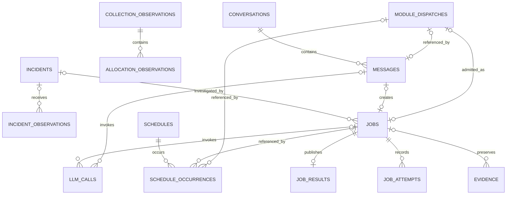

# 03. DSX 데이터 설계서

문서 ID: DSX-DATA-001 · 버전: 1.2 · 기준일: 2026-09-17 · 상태: 개발 기준

대응 요구사항: F01~F13, N01~N03. 수집 데이터의 의미와 조회 계약, 서비스 PostgreSQL의 구현 모델을 함께 정의한다. 아래 테이블은 신규 구현 대상이며 생성·적재 완료 상태가 아니다.

## 1. 저장소와 데이터 소유

| 저장소 | 기준 데이터 | 접근·갱신 |
|---|---|---|
| Mimir | GPU·Host·KSM 시계열, 전달된 매핑 지표 | 기존 수집 경로가 기록, 공통 조회 도구가 읽음 |
| Loki | Fleet 등 실제 수집되는 로그·이벤트 | 기존 수집 경로가 기록, 공통 조회 도구가 읽음 |
| PostgreSQL | 업무·관계·품질·사건·작업·결과·발행 지식·대화·검토 | Backend 공통 저장 모듈 |
| Object Storage 관측 영역 | Mimir/Loki가 관리하는 관측 보관 데이터 | 해당 저장소의 설정·정책에 따름 |
| Object Storage 업무 영역 | 큰 근거 스냅샷·보고서 파일 | Backend 전용 경로·권한·checksum. 관측 내부 블록 직접 조작 금지 |
| Git/배포 아티팩트 | 등록 query/procedure·파서·산식 코드, 지식 근거 원문 | 코드/자료 버전으로 관리. 실행용 Runbook·정책은 PostgreSQL 발행본이 기준 |

SQL에 원시 시계열과 전체 로그를 복제하지 않는다. 실행 결과를 재검토하는 데 필요한 입력 요약·제한된 스냅샷은 보존한다. 원문 URL만 남긴 경우 원문 만료 뒤 완전 재현 가능하다고 표시하지 않는다.

### 1.1 실행 모듈별 변경 책임

| 소유자 | 변경 가능한 업무 데이터 |
|---|---|
| Backend | access_grants, service_profiles, knowledge_revisions, review_records와 해당 감사 |
| Chatbot | conversations, messages, source_module=chatbot의 module_dispatches |
| RCA | kind=rca의 jobs·job_attempts·job_results·명령 receipt |
| Report | kind=report의 jobs·job_attempts·job_results·명령 receipt·출력 |
| Incident | webhook 수신·event 관측·incidents·사건 이력, source_module=incident 전달 |
| Scheduler | schedules·schedule_occurrences, source_module=scheduler 전달 |
| 공통 저장 코드 | 호출 모듈의 scope 내 관계·수집 snapshot·evidence·llm_calls·audit_events. 새 서비스가 아님 |

공유 DB는 임의 교차 쓰기를 허용한다는 뜻이 아니다. 각 모듈 저장 함수·DB 역할로 소유 범위를 제한하고 kind/source_module 조건을 검증한다. 결과 읽기는 공통 권한 적용 어댑터를 사용한다. 전달 접수 경합에서 목적지가 생산자의 module_dispatches 행을 읽고 잠그는 예외는 15 §4.1에 한정한다. 목적지는 그 행을 수정하지 않는다. 접수용 DB 함수에 필요한 전달 행 잠금 권한만 제한적으로 부여하며, 생산자 업무 필드의 교차 변경 권한으로 확대하지 않는다. command_receipts는 변경 대상의 소유 모듈이 기록한다. 전달 취소 receipt는 source_module, job 취소/retry receipt는 해당 Agent 책임이다.

## 2. 수집·조회 경로 기준

| 범위 | 현재 자료 기준 | 적용 원칙 |
|---|---|---|
| 두 CPC 공통 | CSC 중앙 조회와 GPU↔Pod 활용 가능이라는 사용자 확인 | 기능을 두 CPC에 제공하되 대상별 실제 값·권한·기간 검증 |
| CPC-2 KSM/Exporter | Alloy EndpointSlice 발견·직접 scrape → Gateway → Mimir | 신규 GPU Ops 경로. 기존 Prometheus는 별도 모니터링으로 유지 |
| Fleet | Fleet → Alloy → Gateway → Mimir/Loki | 대표 필드와 로그 원문 계약은 각 생산자 기준 |
| CPC-1 직접 수집 | 후속 적용 확인 항목 | CPC-2 전환 완료를 그대로 복제하지 않음 |
| CPC-2 UID | Exporter 작업 라벨 + 같은 시점 KSM uid 조인 성공 기록 | Exporter UID 옵션 false 유지 기록 반영. 별도 Mapper 서비스 필수 아님 |
| 최신 로그 | CPC-2 최종 재배포 뒤 Loki 최신 도착 확인 대기 기록 | 기존 로그 전송 기반과 해당 재배포 검증을 구분 |

Mimir는 공통 tenant `cpc-1`에 대상 `cluster_id` 필터를 적용한다. CPC-2 Loki 표본은 tenant `cpc2`, 라벨 `cluster=cpc2`다. CPC-1 Loki 실제 값은 C02에 등록한다. tenant를 사용자 권한으로 사용하지 않는다.

## 3. 수집 데이터 사전

상태는 실환경 전체의 단정이 아니라 근거 범위다. ‘검증 구간’은 2026-09-15 CPC-2 15:40~15:54 KST 기록이며 장기 이력·실제 부하 반응 검증을 대체하지 않는다.

| ID | 논리 데이터 | 이름·생산자/위치 | 단위·식별·의미 | 근거·추가 확인 | 사용 |
|---|---|---|---|---|---|
| D01 | GPU·Node 신원 | Fleet/Exporter의 cluster_id, node, uuid, 모델 등 | GPU는 cluster+UUID, Node 신원은 별도 | Fleet 라벨·CPC-2 연결 표본. node_uid·인벤토리 완전성 추가 | 전체 |
| D02 | GPU 활동 | CPC-2 direct `DCGM_FI_DEV_GPU_UTIL` | 정규화 %, GPU별 원본 시각 | 중앙 검증 구간·0값 확인. 실제 부하·장기 유효성·원본 주기 확인 | O03/O04, R03/R05 |
| D03 | VRAM | direct `DCGM_FI_DEV_FB_USED/FREE`; Fleet `dcgm_fi_dev_fb_used/free/total/used_percent` | 원본 용량 단위를 사전 등록 후 bytes/% 정규화 | direct used/free 및 Fleet 이름 근거. direct total은 확인 완료로 두지 않음 | O01, RCA 근거 |
| D04 | Host CPU·메모리 등 | Fleet `cpu_used_percent`, `cpu_load_average` 등 실제 등록 필드 | Node 수준, load와 % 구분 | 이름·라벨 근거와 값·기간을 별도 기록 | O01, R03/R05/R07 |
| D05 | GPU 오류·상태 | Fleet ECC·clocks_event_reasons·board_limit_violation 등 | counter/gauge/bitmask 등 실제 계약 지정 | 장비별 지원·단위·리셋·센티널 값 검증 필요 | R01/R06/R09, O05 |
| D06 | Node·Pod 관계 | KSM `kube_node_status_condition`, `kube_pod_info` | condition 상태, namespace/pod/node/uid | 세 종류 중앙 수집 및 CPC-2 동시점 UID 조인 기록 | 매핑·R02/R03·O02 |
| D07 | GPU 유효 요청·배치 | KSM `kube_pod_container_resource_requests` + 필요한 객체 상태 | 실제 resource 이름·단위, 유효 Pod 요청 | GPU resource별 원문·init/sidecar 처리·미배치/gate/scheduler 추가 검증 | O07/O08 |
| D08 | GPU↔Pod 할당 | Exporter namespace/pod/container + KSM uid | 전용/MIG/공유, 원본 장치·부모·Pod UID | 현재 매핑 활용 및 CPC-2 UID 조인. 이력·공유·완전성 별도 | O02~O04/O06/O08, R02~R08 |
| D09 | 로그·원본 이벤트 | Loki Fleet component/event_name/오류 원문 | 발생·수신 시각, producer contract, Node/GPU | 배포 버전별 parser와 최신 수신 검증. Healthy는 사건·업무복구와 별도 | Incident·RCA·O05 |
| D10 | 수집 품질 | up, scrape_duration_seconds, 원본 timestamp·실패/포괄 범위 | target/Node/GPU별 기대 대상·유효시간 | CPC-2 target 정상 근거. up=1은 장비 정상 보장 아님 | O11·모든 주장 |
| D11 | 실제 GPU 전력·에너지 | 활성 생산자의 검증된 실제 W 또는 누적 에너지 필드 | W, J 또는 명시 단위→kWh | 원문 필드·값·단위·기간 확인 필요. power limit 제외 | O09/O10 |
| D12 | owner·소유권·배치 제약 | KSM 추가 필드·자산 메타데이터·scheduler·정책 | Workload UID, 팀/프로젝트, allocatable·제약 | 세 종류 KSM 수집만으로 확보 간주하지 않음 | O07/O08, R06/R07 |
| D13 | 업무 영향·성과 | 실제 Pod 종료/작업 로그·진행·처리량 | container 실행·종료 시각·업무 단위 | 추가 확보 범위. Pod 존재와 업무 성과를 구분 | R04/R09, O06/O10 |
| D14 | 파생 업무 이력 | PostgreSQL Incident·결과·실제 조치·버전 이력 | 사건·job·운영 기록 ID | 서비스 구현 이후 축적. 기존 수집 지표로 간주하지 않음 | O05/O10, R06/R09 |

대표 소스는 의미 ID·모델·CPC·유효 기간별로 선택한다. Fleet/Exporter 어느 한쪽을 전역 우선으로 고정하지 않는다. 대소문자가 다른 이름은 생산자·정의 검증 없이 같은 시계열로 합치지 않는다. 소스 변경 전후의 `collection_path`·전환 시각·revision을 남긴다.

데이터 사전 revision에는 `meaning_id, source_name, source_version, raw_field, raw_unit, normalized_unit, value_type, entity_kind, supported_models, invalid_values, labels, query_id, original_period, max_age, valid_from/to, verification_scope, evidence_refs`를 기록한다. 미검증 원본 이름은 null이며 후보 이름을 실행 템플릿으로 발행하지 않는다.

### 3.1 실제 확인 범위

아래는 확인 기록의 범위를 고정한 표이며 이번 문서 개정에서 실환경을 재시험한 결과가 아니다. 원문·조회 결과·시각·대상은 06 C03/C04의 근거 링크로 연결한다.

| 항목 | 현재 기록으로 확인한 범위 | 추가 확인·활성 조건 |
|---|---|---|
| CPC-2 직접 수집 | KSM 1개·Exporter 2개 target의 중앙 조회 기록 | target 수를 GPU 수로 치환하지 않음. 전체 대상·수집 주기·현재 배포 확인 |
| CPC-2 현재 GPU↔Pod UID | 테스트 Pod·동시점 조인 | 이름 재사용·UID·변경 경계·다른 대상·공유 모드 확인 |
| CPC-2 GPU_UTIL | 검증 구간·0값 확인 기록 | 원본 표본과 C03/C04 연결. 실제 부하 반응·장기 신선도 별도 확인 |
| 기간 할당·저활동 | 현재 매핑 활용 기반 | D08·D02·D10의 기간 이력·원본 시각·공동 관측 구간 확인 전 기간 산출 미확인 |
| CPC-2 Loki | 최종 재배포 후 최신 도착 확인 대기 기록 | 최신 로그를 확인해야 현재 장애 조사 근거로 채택 |
| CPC-1 직접 수집 | 같은 전환 완료를 확인한 기록 없음 | CPC-1의 현재 경로·tenant·라벨·표본 별도 확인 |
| 전력·에너지, 업무 성과 | 추가 입력 검증 대상 | 실제 W/누적 에너지·단위, 업무 진행·처리량 확인. power limit·Healthy로 대체 금지 |
| Alloy 내구성 | 09-15 WAL 영속 볼륨 부재·복제본 장애 검증 대기 기록 | 현재 구성 확인 후 재시작·단절의 공백·중복·품질 표시 검증 |

### 3.2 장비 상태 정규화

`raw_health`는 원문 값 또는 null이며 `check_status=valid|unavailable|skipped|initializing|unknown`, `normalized_health=healthy|degraded|unhealthy|unknown`, `severity=info|warning|critical|unknown`은 등록 parser와 정책이 산출한다. `component`, 대상 키, 원본 시각, producer contract·parser revision·원문 근거를 함께 기록한다. 원문에 없는 필드·검사 성공을 추정하지 않는다. 실제 사건·회복 판정표는 04의 상태 판단 계약을 적용한다.

유효한 Degraded는 경고/이상 근거가 될 수 있으나 검사 불가 Healthy는 정상·회복 근거가 아니다. 의도적 제외·Initializing·로그 단절은 검사·수집 상태로 보존하고 그 사실만으로 장비 장애나 회복을 확정하지 않는다. 회복에는 C08의 승인된 유효 정상 연속 관측 조건이 필요하다.

원본의 `incidents` 등 배열은 전체 원문을 유지하고 모든 하위 GPU/항목을 정규화한다. 첫 항목만 처리하지 않는다. 항목별 식별자·경로와 parser 오류를 남겨 부분 성공도 추적한다.

## 4. 식별·연결·시간

| 대상 | 기준 키 | 제한 |
|---|---|---|
| CPC | cluster_id | tenant 이름과 별개 |
| Node | cluster_id + node_uid 또는 검증된 node instance | 이름 재생성·장비 교체를 이름만으로 합치지 않음 |
| GPU | cluster_id + gpu_uuid | Node 관계는 시간별 관리. index·PCI는 보조 식별 |
| Pod | cluster_id + pod_uid | UID 미확인은 null, namespace/name은 표시·현재 조회용 |
| Container 실행 | Pod UID + container name + container ID/실행 구간 | 같은 Pod 재시작을 별도 Pod나 자동 할당 해제로 해석하지 않음 |
| MIG | 부모 UUID + 실제 instance ID + 구성 유효 구간 | 프로파일을 instance 영구 ID로 사용하지 않음 |
| Workload·소유권 | controller UID·owner chain / 명시 소유권·유효 구간 | Namespace·node_group만으로 팀·사람 추정 금지 |

CPC-2의 동시점 GPU 소스 결합 키는 `cluster_id+node+uuid`; UID 결합 키는 `cluster_id+namespace+pod+node`다. 원본 `uid`를 `pod_uid`로 정규화하고 출처를 보존한다. Exporter 자체 라벨은 `exporter_*`, 작업 라벨은 namespace/pod/container로 구분한다. 활동률 > 0으로 매핑을 사전 필터링하지 않는다.

모든 저장 시각은 timezone-aware UTC이며 기간은 `[start,end)`다. `occurred_at`(발생), `observed_at`(원본 관측), `ingested_at`(수신), `evaluated_at`(조회 평가), `data_cutoff_at`(입력 마감)을 별도 기록한다. 같은 평가 시각이어도 원본 시각·신선도가 맞아야 조인한다.

폴링 이력은 같은 관계가 인접 성공 관측에서 유지되고 간격이 검증된 원본 주기 T의 2배 이내인 구간만 관측 기반으로 연결한다. T 미확인·장기 공백·상충 UID·변경 경계는 기간 귀속 보류다. 마지막 값을 분석 종료까지 연장하지 않는다. `valid_to=null`은 무한히 유효한 할당을 뜻하지 않는다.

### 4.1 기간 이력 생성 책임

이번 구조는 **공통 조회·계산 모듈이 Mimir의 보존된 원본 이력에서 요청 기간의 관계를 복원**한다. Backend·Chatbot·RCA·Report가 같은 라이브러리를 호출하며 화면 접속·현재 매핑 저장 여부에 의존하지 않는다. 별도 주기적 Mapper나 원시 시계열 전량 복제를 추가하지 않는다.

등록 query는 GPU 작업 라벨, KSM UID, 수집 성공·완전성/기대 대상 이력을 같은 허용 scope·기간으로 조회한다. 지원되는 원본 range-vector 구간 조회 등 원본 표본 timestamp를 보존하는 방식을 검증해 등록한다. query_range의 평가 격자 표본 수를 원본 관측 수로 세지 않는다. 평가 시각마다 반복 표시된 값은 새로운 원본 표본으로 세지 않고 원본 timestamp로 중복 제거한다. 수집 성공만으로 전체 관계의 완전성을 확정하지 않는다. 원본 시각·검증된 주기·보존·품질 이력이 부족하면 영향을 받는 과거 구간만 unknown/blocked로 남긴다.

분석 입력 마감 시각과 query/parser/identity revision을 고정하고 사용한 제한된 원본·관계·품질 스냅샷을 evidence와 아래 collection/allocation/identity 테이블에 보존한다. 재조회 시 동일 source·scope·원본 시각·내용·revision의 dedup_key를 재사용한다. 새 원본 정정·계약 변경은 기존 final 근거를 수정하지 않고 새 revision/근거로 보존한다. Mimir 원본이 만료된 뒤 보존된 업무 근거 이상의 전체 과거 이력을 복원할 수 있다고 표시하지 않는다.

### 4.2 계산 해상도

계산 query revision에는 원본 시각 취득 방식·검증된 원본 주기·값 유지 상한·조회 step·다운샘플링 허용 조건을 고정한다. 저활동 경계·짧은 급증·시간 가중 평균·P95를 손상하는 다운샘플 자료는 해당 계산에 사용하지 않는다. 화면 확대·축소용 간격은 저장 수치와 무관하다. 짧은 할당의 실제 관측시간과 장시간 후보 자격, A→B 교체 구간의 분모는 04의 고정 정책으로 각각 계산하고 근거 부족과 후보 미충족을 구분한다.

## 5. 공통 관계·품질 응답

| 필드 | 타입·값 | 의미 |
|---|---|---|
| cluster_id, node, gpu_uuid | string 또는 확인 불가 시 null | 원본/정규화 신원 분리 |
| node_uid, pod_uid, namespace, pod_name, container | string/null | 이름만 있으면 identity_status=name_only |
| parent_gpu_uuid, device_id, mig_config_id | string/null | MIG/공유 장치 식별 |
| allocation_mode | exclusive/mig/time_slicing/mps/unknown | 여러 정상 공유 관계는 ambiguous가 아님 |
| kubernetes_phase | Pending/Running/Succeeded/Failed/Unknown 또는 null | Kubernetes 원본 phase. 배치·GPU 관계·활동 판정과 독립 |
| placement_status | unbound/bound/unknown | 기준 시각의 Node 배치 상태. Pending을 unbound로 치환하지 않음 |
| relation_status | matched/ambiguous/not_observed/unknown | 수집 공백의 not_observed는 미할당 확정 아님 |
| activity_status | active_observed/low_activity_candidate/insufficient_data/not_applicable | 04의 관측·할당 적격성 기준. unbound 장치 활동의 적용 불가는 not_applicable, 근거 부족은 insufficient_data |
| identity_status | uid_resolved/name_only/unknown | 현재 이름 기반 조회와 과거 신원 구분 |
| time_basis | snapshot/observed_interval/authoritative_event_interval | 마지막 값 추정과 실제 이벤트 구분 |
| observed_at, ingested_at, valid_from, valid_to | timestamp/null | 확인된 범위만 기록 |
| boundary_uncertainty | object/null | 마지막 존재·최초 부재·경계 원인 |
| quality | object | 성공·완전성·기대/유효/제외 범위·원본 주기·신선도 |
| evidence_refs, source_versions | array | 원본·파서·수집 계약 참조 |

각 조회는 `tool_status=ok|partial|empty|unavailable|parse_error`를 반환한다. 각 분석 주제는 별도의 `status=ready|partial|blocked|not_applicable`을 사용한다. `job.status`는 02의 작업 실행 상태다. 이 상태들과 상세 `quality` 객체를 하나의 필드로 합치지 않는다. 결과 최상위 `result_status`는 04의 집계 규칙으로 서버가 확정하며 `narrative_status`는 설명 생성 상태를 별도 표시한다.

RCA·공통 도구의 수치는 `measurements`, 보고서 주제별 수치는 `topics[].metrics`에 한 번만 저장한다. 두 배열을 결과 전체에서 ID가 유일한 값 레지스트리로 취급하고 `facts[].value_refs` 등으로 참조한다. 자료형·단위·대상·기간/기준 시각·산식 revision·품질·근거를 함께 저장한다. evidence ID가 존재하는지만 검사하지 않고 문장 주장을 대조한다. 정확한 필드와 예시는 04가 원본이며 화면·파일에서 재계산하지 않는다.

## 6. PostgreSQL 물리 모델

### 6.1 공통 규칙

외부 노출 업무 ID는 UUID 타입으로 저장하고 API에서는 문자열로 직렬화한다. 범위·상태·관계·정렬 필드는 일반 열, 버전 고정된 결과 본문·원본 요약은 JSONB를 사용한다. 모든 시간을 `timestamptz`, 버전·시도를 integer, 횟수를 bigint, 원본/계산 수치를 double precision으로 저장한다. NaN·무한대는 유효값으로 발행하지 않는다.

모든 업무 레코드에 created_at, 필요한 경우 updated_at·version을 둔다. 외부 식별자의 null은 미확인 상태를 의미하며 임의 문자열 키로 영구 신원을 만들지 않는다. UUID 형식만으로 권한을 보장하지 않는다.

모든 업무 scope는 `{"clusters":[{"cluster_id":"cpc-1","namespaces":["dev"]},{"cluster_id":"cpc-2","namespaces":["prod"]}]}` 형식이다. `namespaces:null`은 해당 CPC 전체이며 그 역할의 명시적 전역 grant가 필요하다. 빈 배열·중복 CPC·구형 평면 cluster_ids/namespaces는 422로 거절한다. 역할과 scope를 한 grant 묶음으로 평가하며 다른 역할/다른 CPC의 권한을 교차 합성하지 않는다. 장비 관측 권한도 해당 grant의 CPC/Namespace 안에서 별도로 검사한다.

### 6.2 계정·설정·지식

| 테이블 | 주요 열·타입 | 키·제약·관리 |
|---|---|---|
| `access_grants` | id uuid; principal text; role text; cluster_id text; namespace text nullable; asset_observation boolean; enabled boolean; version integer | namespace null인 `(principal,role,cluster_id)`와 non-null인 `(principal,role,cluster_id,namespace)`에 각각 부분 unique. 명시적 역할·범위별 부여 |
| `service_profiles` | id uuid; kind text; name text; config jsonb; secret_ref text nullable; version integer; enabled boolean | kind+name unique. 종류별 config 스키마 검증. 모델·라우팅도 model/routing 종류로 같은 테이블 사용. 변경 전후 완전 스냅샷은 audit_events에 원자적으로 보존 |
| `knowledge_revisions` | id uuid; knowledge_id uuid; knowledge_key text; revision integer; kind/state text; visibility text; scope jsonb nullable; content jsonb; content_hash text; compatibility jsonb; source_refs jsonb; reviewer text nullable; reviewed_at/published_at/retired_at timestamptz nullable | knowledge_id+revision 및 key+revision unique. visibility=common/scoped; scoped는 scope 필수. 같은 knowledge_id의 key/kind 불변. kind=runbook/policy/data_dictionary/reference/case. 발행 내용·접근 범위 불변, 변경은 새 revision |

조사 procedure·query·parser는 등록 코드와 버전이 원본이다. 지식 문서는 해당 ID와 버전을 참조하며 DB에 실행 가능한 임의 코드를 넣지 않는다. 정확 조건을 먼저 검색하고 필요한 문서 텍스트 검색은 PostgreSQL 기능을 이용한다. 벡터 검색 저장소를 기본으로 추가하지 않는다.

지식 검색·초안/상세·LLM 입력은 데이터 접근 scope를 검사한 다음 기술 호환성을 적용한다. 지식 관리자 역할만으로 근거의 타 CPC/Namespace를 열람할 수 없다. 실제 사건·원문 기반 지식은 scope를 승계하며 common 발행은 내용·인용 자체가 전체 허용 사용자에게 공개 가능하다고 검토된 경우에만 허용한다. 발행본 비공개 전환이 필요하면 신규 선택·접근을 차단하는 운영 통제를 적용하고 과거 내용을 덮어쓰지 않는다.

model config에는 실제 model/artifact revision·허용 Endpoint·지원 기능·추론 제한과 연결 시험 결과의 시각/상태를 기록한다. routing config에는 Assistant/RCA/보고서별 model profile ID·revision을 고정한다. 연결 성공과 T40 품질 검증은 별도 기록이다. 물리 삭제 API는 제공하지 않는다. 기본/명시 routing의 모델 비활성화는 대체 routing을 같은 변경으로 지정하거나 사용 중 409로 거절한다. 과거 실행 스냅샷은 유지하며 비밀은 secret_ref만 보존한다.

### 6.3 관계·관측

| 테이블 | 주요 열·타입 | 키·제약·관리 |
|---|---|---|
| `identity_history` | id uuid; cluster_id text; relation_kind text; subject_key/object_key text; subject_kind/object_kind text; valid_from/to timestamptz; observed_at timestamptz; identity_status text; attributes jsonb; evidence_id uuid | GPU→Node, Pod→Workload, 소유권 등 관계 이력. key는 종류별 검증된 정규화 키. 겹치는 모순을 임의 하나로 선택하지 않음 |
| `collection_observations` | id uuid; cluster_id text; source text; observed_at/ingested_at timestamptz nullable; evaluated_at timestamptz; scope jsonb; success boolean; completeness text; expected_count/observed_count bigint nullable; source_revision/query_revision text; dedup_key text; quality/evidence_refs jsonb | source+cluster+dedup_key unique. 빈 정상 조회와 실패 조회도 행 저장. 원본 시각 미확인은 null. 평가 시각으로 채우지 않음. count만으로 완전성 보장 안 함 |
| `allocation_observations` | id uuid; collection_id uuid; cluster_id text; node/node_uid/gpu_uuid/parent_gpu_uuid/device_id/mig_config_id text nullable; namespace/pod_name/pod_uid/container/container_run_id text nullable; allocation_mode/relation_status/identity_status/time_basis text; observed_at/ingested_at timestamptz nullable; evaluated_at timestamptz; original_gpu_sample_at/original_pod_sample_at/valid_from/to timestamptz nullable; boundary_uncertainty/raw_labels/evidence_refs jsonb; relation_key text; allocation_episode_key text nullable; identity_revision text | collection_id FK. collection+relation_key unique. 상충 후보·결합 전 원본 시각·라벨·근거 모두 보존. source 관계키·episode 생성 규칙 revision 고정 |

할당이 0건인 성공 조회는 collection만 있고 allocation은 0행이다. 이 구조로 실패·불완전 조회와 완전한 부재를 구분한다. 기간 계산은 관측을 연결하되 할당해제 원장이 존재하는 것처럼 폴링 결과를 확정하지 않는다.

`allocation_episode_key`는 전용 할당에서 CPC·GPU UUID·Pod UID·최초 유효 관측 원본 시각·identity revision으로 결정한다. 같은 관계의 인접 유효 관측 연결 규칙을 통과한 구간만 같은 관측 episode로 묶는다. Pod 변경·명시 관계 변경·장기 공백·상충 UID는 새 관측 episode 또는 미확인 경계다. 실제 배치·해제 시각이 확인됐다는 의미로 사용하지 않는다. 같은 고정 입력·revision은 동일 키를 재현한다.

저활동 후보 키는 `(cluster_id,gpu_uuid,pod_uid,allocation_episode_key)`이고 04의 60분 비중첩 창은 해당 episode 최초 유효 관측에 정렬한다. A→B 또는 여러 GPU를 합쳐 60분을 만들지 않는다. 창 안의 품질 공백은 60분 분모에 반영하고 끝의 60분 미만 잔여 구간은 저활동 관측시간만 보존한다. `short_allocation_window` 사유와 경계 불확실성을 함께 저장한다.

### 6.4 사건·업무·결과

| 테이블 | 주요 열·타입 | 키·제약·관리 |
|---|---|---|
| `incidents` | id uuid; cluster_id text; asset_key text nullable; raw_asset jsonb; symptom text; status text; first_seen/last_seen timestamptz; correlation_key/episode_key/correlation_status text; evidence_version/version integer; recurrence_of uuid nullable; last_verified_at timestamptz nullable; verification_status text | correlation+episode unique. recurrence_of 자기 FK. 상관 미확인은 correlation_status=unknown. 분석 완료·알림 해제와 사건 종결 별개 |
| `incident_observations` | id uuid; incident_id uuid nullable; source_profile_id uuid; source_event_key/source_item_key/semantic_hash text; observation_kind text; occurred_at timestamptz nullable; received_at/last_received_at timestamptz; receipt_count bigint; producer_contract/parser_version/semantic_revision text; raw_health/component text nullable; check_status/normalized_health/severity text; raw_snapshot jsonb; evidence_id uuid nullable | source_profile+source_event_key+source_item_key+semantic_revision+semantic_hash unique. 원본 이벤트·하위 항목·의미 변경을 구분. 미상관/정상 관측도 가짜 Incident 없이 보존 |
| `schedules` | id uuid; owner text; scope jsonb; report_request jsonb; calendar jsonb; enabled boolean; revision integer; effective_at/next_run_at/last_evaluated_at timestamptz; block_reason text nullable | 달력 스키마·권한 검증. 일정 변경은 revision 증가와 전후 완전 설정 스냅샷을 audit_events에 원자적으로 기록 |
| `schedule_occurrences` | id uuid; schedule_id uuid; revision integer; scheduled_for timestamptz; period_start/end timestamptz; status text; job_id uuid nullable; reason text nullable; config_snapshot jsonb; config_hash text | schedule+revision+scheduled_for unique. status=pending/accepted/missed/blocked/failed. 적용 revision의 범위·달력·요청·효력 시각 고정. 발생 행·module_dispatches를 같은 트랜잭션으로 생성. job은 Report 접수 후 별도 연결 |
| `jobs` | id uuid; kind text; principal text; scope/request/versions/config_snapshot jsonb; incident_id/parent_job_id/source_message_id uuid nullable; request_operation/idempotency_key/request_hash text; auto_run_key text nullable; status/stage text; priority integer; attempt_no/max_attempts integer; token_budget bigint; available_at/created_at/started_at/deadline_at/lease_expires_at/cancel_requested_at/completed_at timestamptz nullable; worker_id text nullable; termination_reason text nullable; version integer | kind=rca/report. principal+request_operation+idempotency_key unique. auto_run_key non-null unique. 자동 접수는 source_module+dispatch_id에서 파생하고 원래 업무 중복 키는 전달 source_key로 보존. source_message_id FK 및 non-null unique. 핵심 실행 상태 원장은 이 테이블 하나 |
| `job_attempts` | job_id uuid; attempt_no integer; worker_id text; started_at/last_heartbeat_at timestamptz; lease_expires_at timestamptz; ended_at timestamptz nullable; last_stage/outcome/termination_reason/error_code text nullable; checkpoint_refs jsonb | job_id+attempt_no PK; job FK. 점유 때 생성, 종료/회수 때 확정하는 실행 이력. jobs 상태의 대체 원장이 아님. 허용된 상세 조회의 안전한 attempts 요약은 02를 따름 |
| `command_receipts` | id uuid; owner_module/principal/operation text; resource_id uuid; idempotency_key/request_hash text; state text; downstream_key text nullable; command_snapshot jsonb nullable; response_status integer nullable; response_body jsonb nullable; created_at/expires_at timestamptz | owner_module+principal+operation+resource_id+idempotency_key unique. 로컬 변경은 completed 결과와 함께 커밋. 모듈 간 취소 중계는 pending 의도 저장 후 응답 확인 시 completed. 상세는 6.6 |
| `job_results` | job_id uuid; result_schema_version/result_status text; body jsonb; narrative_status text; created_at timestamptz; content_hash text | job_id PK/FK. 한 job에 final 하나. body의 result_status와 동일, body 불변. measurements·value_refs와 RCA/report 종류별 스키마는 04 계약 |
| `evidence` | id uuid; job_id uuid nullable; attempt_no integer nullable; cluster_id text nullable; scope jsonb; query_id/query_version/source_version text; input jsonb; tool_status text; time_start/end/data_cutoff_at timestamptz nullable; quality jsonb; snapshot jsonb nullable; object_key/checksum text nullable; expires_at timestamptz nullable | 스냅샷 또는 검증된 object 참조. 결과·지식에서 참조한 근거의 보존 관계 검사 |
| `llm_calls` | id uuid; job_id/message_id uuid nullable; attempt_no integer nullable; principal/shared_budget_key text; budget_window_start/end timestamptz; stage_id/request_id text; profile_id uuid; state/reservation_state text; slot_key text nullable; reserved_tokens bigint; input/output_tokens/charged_tokens bigint nullable; lease_expires_at/submitted_at/finished_at timestamptz nullable; error_code text nullable; versions/timings jsonb | 활성/unknown 슬롯의 slot_key 부분 unique. job 또는 message 중 정확히 하나에 속함. reservation_state=reserved/unknown/settled. 실제 사용량 불명도 예약·사용량 상한 보존 |

`analysis_id`와 `report_id`는 해당 kind의 job ID다. 이전 논리 설계의 analysis_run/report_run은 jobs의 업무별 보기로 구현하고 실행 상태를 중복 저장하지 않는다. 일부 근거·계산 체크포인트는 evidence에 저장하며 final result와 구분한다.

동일 job의 결과 확정은 현재 attempt·lease·취소·마감 조건과 함께 트랜잭션으로 처리한다. 참조 ID가 같은 사용자에게 보인다는 이유만으로 scope 일치를 생략하지 않는다.

#### 실행·멱등 저장 규칙

점유 트랜잭션은 jobs의 attempt 증가·lease 부여와 job_attempts 생성을 함께 커밋한다. heartbeat·완료·회수는 현재 attempt 조건으로 jobs와 해당 이력을 갱신한다. 과거 Worker의 늦은 응답은 final을 만들지 못하며 진단 기록만 남긴다. 예산·deadline은 같은 job의 자동/수동 retry에서 초기화하지 않는다. 영구 입력 수정·예산 소진·마감 후 의도적 재생성은 parent_job_id를 가진 새 job이다.

retry는 현재 principal의 역할·scope를 먼저 재검증하고 command_receipts의 동일 키를 찾는다. 같은 본문이면 저장 응답을 재사용하고 다른 본문이면 409다. 기존 기록이 없는 최초 명령에만 If-Match·상태·남은 예산·deadline 검증을 적용하며 변경과 receipt를 원자적으로 저장한다. 성공 응답을 잃은 재전송이 오래된 ETag 때문에 다시 실행되거나 실패로 바뀌지 않는다. resource_id는 operation별 종류·존재를 검증한다.

Chatbot은 메시지·전달 의도를 같은 트랜잭션으로 저장한다. RCA/Report는 source_message_id·source_dispatch_id의 유일성을 검사하여 별도 트랜잭션으로 job을 접수한다. Chatbot은 접수 확인 후 메시지의 job_id를 갱신한다. 메시지당 전문 전달·job은 각각 최대 한 건이며 재시작·응답 유실은 같은 전달을 복구한다. 의도적으로 다른 전문 작업을 요청하려면 새 메시지로 제출한다. 자동 접수 키는 source_module+dispatch_id에서 결정적으로 파생하며 15의 경합 규칙을 따른다.

#### 공유 토큰 예약

LLM 제출 전 입력 토큰과 최대 출력 토큰을 포함한 보수적 상한을 reserved_tokens로 계산한다. 지원하지 않는 tokenizer/상한 설정으로 예약을 과소 산정하지 않고 C07의 검증된 산정 규칙을 사용한다. 공유 예산→principal 예산→job 예산 순서로 DB 트랜잭션 잠금을 확보한 뒤 llm_calls의 실제 정산량과 미정산 예약 합계를 조회하여 모두 한도 이내일 때만 호출 예약·슬롯을 커밋한다. 공통 LLM 코드는 등록된 예산 키의 PostgreSQL 트랜잭션 advisory lock과 기존 llm_calls 합계를 사용한다. 공유 예산 키는 모델/프로필 revision 변경에도 같은 실제 예산 영역을 가리켜 한도를 우회하지 못한다. 외부 추론 동안 잠금을 유지하지 않는다.

job 예산은 모든 attempt와 하위 자동 호출의 누적값이다. principal/공유 예산의 기간·리셋 경계는 C07 revision으로 고정하고 호출에 해당 budget window를 저장한다. 일반 Assistant도 같은 principal/공유 예산을 사용한다. 사용량 확정 시 실제 input/output_tokens와 charged_tokens로 정산하며 timeout·원격 종료 불명은 reservation_state=unknown으로 예약을 유지한다. 원격 종료만 확인되고 실제 토큰이 끝내 불명이면 예약 상한을 보수적으로 정산하고 사유를 남긴다. 단순 Worker 재시작·lease 만료로 예약/슬롯을 삭제하지 않는다. window 경계를 넘어 살아 있는 호출의 미정산 예약은 현재 가용 한도 계산에도 이월하여 공백으로 한도를 우회하지 못한다.

#### 사건·일정 revision

source_event_key는 생산자 이벤트 식별, source_item_key는 원문 내 하위 대상 식별, semantic_hash는 상태·의미 있는 증거의 정규화 내용이다. 같은 이벤트의 firing→resolved나 새 증거는 별도 관측이고 수신 시각만 달라진 재전송은 receipt_count만 증가한다. 공급자 키가 없으면 등록 계약의 안정적 키 생성 규칙을 쓰며 규칙 revision을 보존한다. 원본 배열 전체와 모든 하위 정규화 항목의 연결을 보존한다.

같은 episode의 정정·추가 근거는 기존 Incident evidence_version을 증가시키고 새 RCA job으로 연결한다. 새 episode는 새 Incident와 recurrence_of를 사용한다. unknown episode는 확정 재발 횟수에 더하거나 가까운 과거 사건에 임의 병합하지 않는다. 운영자 확인 또는 제한된 원문 재조회 근거의 원본 시각·검사 유효성·실패 사유는 incident_observations에 보존하며 last_verified_at은 유효 확인에만 갱신한다. 구체적인 재개·재발·재확인 정책은 13·11과 C08을 적용한다.

일정 수정의 effective_at은 DB 커밋 기준이며 이전 revision의 효력 구간은 `[이전 effective_at, 새 effective_at)`이다. 각 scheduled_for는 정확히 하나의 효력 구간에 귀속한다. catch-up은 당시 revision의 완전 스냅샷으로만 판정하고 이미 pending인 범위·기간 및 accepted의 job 참조는 수정하지 않는다. 상세 중복 기간 처리·비활성·재개 규칙은 14를 따르며 의도적 재생성은 기존 결과의 parent_job_id를 가진 새 수동 요청으로 남긴다.

### 6.5 대화·운영 기록

| 테이블 | 주요 열·타입 | 키·제약·관리 |
|---|---|---|
| `conversations` | id uuid; owner text; scope/context jsonb; title text; version integer | 본인/명시 관리 권한만 읽기. 맥락 참조는 재조회 시 권한 확인 |
| `messages` | id uuid; conversation_id uuid; sequence bigint; role text; content text; status text; context_refs jsonb; response/error jsonb nullable; job_id uuid nullable; idempotency_key/request_hash text nullable; config_snapshot jsonb nullable; created_at timestamptz; completed_at timestamptz nullable | conversation+sequence unique. 사용자 role의 conversation+idempotency_key 부분 unique와 hash 필수. 동일 키/다른 본문 409. 사용자 메시지 상태는 accepted/processing/completed/failed이며 Chatbot 처리 lease가 만료된 일반 생성만 failed로 보존. Backend 재시작은 메시지 상태를 바꾸지 않음 |
| `review_records` | id uuid; subject_type text; subject_id uuid; kind text; author text; occurred_at timestamptz nullable; body jsonb; supersedes_id uuid nullable | append-only. subject_type별 존재·scope 검사. action은 대상·실행자·발생 시각 필수 |
| `audit_events` | id uuid; actor text; action text; resource_type text; resource_id uuid nullable; resource_revision integer nullable; occurred_at/effective_at timestamptz; request_id text; scope jsonb; before_ref/after_ref jsonb; outcome text | append-only. 권한·설정·지식·상태·조치 변경 기록. 설정·일정 변경은 전후 완전 config 스냅샷과 hash·revision·효력 시각 필수. 비밀 원문 제외 |

Chatbot 일반 대화의 응답은 해당 사용자 메시지 행의 response에 저장하고 상태·error·completed_at과 원자적으로 확정한다. response는 답변 본문과 근거 참조를 담는 JSON이며 확정 전에는 null이다. GET의 text/context는 content/context_refs, model_ref는 고정 config_snapshot, evidence_refs는 저장 response의 근거 목록에서 읽는다. 별도 assistant 행의 순서를 추측해 답변을 연결하지 않는다. 목록도 같은 사용자 행의 질문·응답 쌍을 반환한다. 확정된 응답/실패는 재전송으로 덮어쓰지 않고 새 생성은 새 사용자 메시지 ID·키를 사용한다.

service_profiles·schedules의 최초 생성부터 변경·비활성화까지 audit_events에 완전 스냅샷을 남긴다. 변경 레코드와 현재 행은 같은 트랜잭션에서 커밋한다. before_ref/after_ref는 이 두 리소스에 한해 단순 외부 포인터로 대체하지 않으며 당시 설정을 재구성할 수 있어야 한다. jobs.config_snapshot, messages.config_snapshot, schedule_occurrences.config_snapshot은 실제 사용 설정의 비밀 제외 불변 사본이다. 별도 revision 테이블은 추가하지 않는다. 지식 content는 별도의 knowledge_revisions가 원본이다.

### 6.6 모듈 전달과 추가 필드

| 대상 | 필드·제약 |
|---|---|
| module_dispatches | id uuid PK; source_module/target_module/operation text; source_id uuid; source_revision text; source_key text; principal text; access_revision text; scope/payload/config_snapshot jsonb; request_hash/idempotency_key/contract_version text; status text; target_job_id uuid nullable FK jobs; deadline_at/next_attempt_at timestamptz; delivery_attempts integer; lease_owner text nullable; lease_expires_at timestamptz nullable; version integer; last_error_code text nullable; created_at/updated_at timestamptz |
| command_receipts 추가 | owner_module text; state=pending/completed; downstream_key text nullable; command_snapshot jsonb nullable; response_status/response_body nullable. 전달 후 job 취소 중계는 pending 의도와 고정 downstream 키/If-Match를 먼저 저장하고 응답 확인 후 completed로 확정. 로컬 원자 명령은 곧바로 completed. module+기존 키를 유일 키로 사용 |
| 전달 유일성 | UNIQUE(source_module,source_key), UNIQUE(source_module,target_module,operation,idempotency_key). source_id의 존재·모듈·범위는 해당 소유자가 검사. 고정 payload·hash·scope·설정은 재전송으로 변경 금지 |
| 전달 상태 | CHECK status IN (pending,delivering,accepted,blocked,failed,cancelled). accepted이면 target_job_id NOT NULL. 그 외는 NULL. 대상 job의 source_dispatch_id·kind 일치 검사 |
| jobs 추가 | source_dispatch_id uuid nullable FK module_dispatches UNIQUE. 직접 요청은 NULL, 자동 요청은 필수. source_message_id unique 규칙 유지. 해당 Agent만 쓰기 |
| messages 추가 | dispatch_id uuid nullable FK module_dispatches UNIQUE; job_id uuid nullable FK jobs; processing_owner text nullable; processing_lease_expires_at/heartbeat_at timestamptz nullable. message_deadline_at timestamptz NOT NULL은 C07의 일반 대화 마감. Chatbot만 쓰며 접수 확인 전 job_id는 NULL |
| schedule_occurrences 추가 | dispatch_id uuid nullable FK module_dispatches; canonical boolean NOT NULL DEFAULT false. pending·accepted의 원본 예약은 canonical=true, 중복 missed는 false이며 기존 dispatch 참조 가능 |
| 일정 기간 예약 | UNIQUE(schedule_id,period_start,period_end) WHERE canonical=true. 상태 변경·revision 변경에도 예약은 보존. 같은 UTC 기간 자동 재생성 금지, 의도적 재생성은 사용자 POST reports |
| 메시지 전달 연결 | 메시지와 전달을 같은 생산자 트랜잭션으로 저장. jobs.source_message_id는 RCA/Report 접수 트랜잭션에서 저장하고 메시지 job_id는 Chatbot이 이후 갱신 |
| 조회 인덱스 | module_dispatches(source_module,status,next_attempt_at), lease_expires_at, target_job_id. due/만료 전달만 제한 건수 선택 |

FK 순환은 메시지/발생과 nullable 참조를 먼저 만들고 전달 저장 후 소유자 참조를 채우는 순서로 처리한다. jobs.source_dispatch_id와 module_dispatches.target_job_id도 접수 후 연결 순서를 따른다. 전달 취소/종결과 job 생성은 동일 전달 행 잠금을 사용하며 15 §4.1의 원자적 접수 검사를 생략하지 않는다. 전달·참조 job·source·명령 receipt는 보존 기간을 함께 적용한다.

## 7. 주요 관계도

그림은 핵심 FK를 표시한다. 결과 body의 지식 revision·근거 참조와 review의 대상 참조는 종류별 검증을 통해 연결한다. polymorphic 참조에 잘못된 다른 종류 ID를 넣지 못하도록 공통 저장 모듈에서 검증하고 시험한다.

## 8. 필수 제약·조회 인덱스

| 영역 | 필수 조건 |
|---|---|
| 시간·수치 | 알려진 기간은 end>start, count≥0, attempts≥0, max_attempts>0, token_budget/reserved_tokens>0, 알려진 사용량≥0. 유효 숫자와 null/품질 사유 동시 검사 |
| FK | 사건·job·일정·collection·대화 등 명시 FK 사용. attempt를 가진 evidence/llm_calls는 `(job_id,attempt_no)`로 job_attempts 참조. 메시지 호출의 attempt_no는 null. 보존 대상은 연쇄 삭제 대신 RESTRICT 기본 |
| 열거 | 상태·kind·할당 방식·지식 상태는 CHECK 또는 동등한 DB 제약. JSONB는 버전별 서버 스키마 검증 |
| 큐 | 실행 후보 `(kind,available_at,priority,created_at)`의 queued/retry_wait 부분 인덱스; running lease 만료 조회 인덱스 |
| 사건 | `(cluster_id,asset_key,first_seen DESC)`, `(cluster_id,status,last_seen DESC)`, 관측 incident_id 인덱스 |
| 매핑 | collection `(cluster_id,source,observed_at)`; allocation `(cluster_id,gpu_uuid,valid_from)` 및 `(cluster_id,pod_uid,valid_from)`; collection_id 인덱스 |
| 결과·대화 | jobs `(principal,created_at DESC,id)`와 incident_id/parent_job_id; evidence job_id; messages conversation+sequence |
| 시도·명령 | job_attempts `(job_id,attempt_no)` PK와 ended_at 미확정 조회; command_receipts 요청 키 unique 및 resource_id·보존 만료 인덱스. 같은 명령의 변경과 응답 원자적 저장 |
| 대화 멱등 | 사용자 messages의 `(conversation_id,idempotency_key)` 부분 unique; jobs.source_message_id non-null unique. source_message의 대화·현재 principal·scope 확인 |
| LLM 예약 | llm_calls job/message XOR CHECK, 활성/unknown slot_key 부분 unique. `(shared_budget_key,budget_window_start,reservation_state)`, `(principal,budget_window_start)`, job_id로 실제량·미정산 예약 합산 |
| 일정·설정 이력 | audit_events `(resource_type,resource_id,resource_revision)`의 성공 config_revision 변경 부분 unique와 `(resource_type,resource_id,effective_at)` 조회. 단순 연결 시험·조회 감사는 이 unique 대상이 아님. occurrence `(schedule_id,scheduled_for)`·기간 조회, canonical=true의 `(schedule_id,period_start,period_end)` 부분 unique로 revision 변경 후 같은 기간 중복 접수 방지 |
| 지식 | knowledge_key+revision unique, kind/state 조회. 접근 scope와 기술 호환성을 필터링한 뒤 최신 발행 revision 선택 |
| 보존 참조 | purge 전에 job 결과·지식·근거·파일의 역참조와 만료 정책 확인. 발행 지식은 물리 삭제 대신 retired |

인덱스는 실제 WHERE/JOIN·실행계획으로 검증하고 모두의 JSON 속성에 일괄 인덱스를 만들지 않는다. 최초부터 파티션·별도 분석 DB를 요구하지 않는다. 실측 데이터 크기·조회 시간에 따라 추가한다.

## 9. 근거·버전·보존 계약

각 job에 request/schema/producer/parser/query/identity/calculation/criteria/procedure/knowledge/model/prompt의 실제 사용 버전을 저장한다. 모델은 이름 외 실제 배포 artifact/revision·추론 설정도 연결한다. 스냅샷은 입력 마감과 시점이 고정돼야 한다.

config_snapshot에는 위 버전이 가리키는 실제 실행 설정·예산·routing·정책값과 content hash를 포함한다. version 번호만 저장하고 현재 service_profiles를 다시 읽어 과거 실행을 해석하지 않는다. 등록 코드/모델 artifact를 더는 사용할 수 없으면 과거 결과 조회와 재실행 불가를 구분한다.

큰 파일은 업로드·checksum 확인 후 final 결과에서 참조한다. DB final 커밋 전 파일 업로드 실패는 성공이 아니다. 취소·실패로 남은 미참조 파일은 안전한 지연 정리 대상으로 기록한다. DB 복원 시 참조 파일의 존재·checksum을 대조한다.

| 데이터 | 보존 설정 원본 | 삭제·만료 시 원칙 |
|---|---|---|
| Mimir/Loki 원본 | C05의 저장소·tenant 보존 설정 | 원문 만료 시 결과에서 원문 접근 불가 표시 |
| 관계·사건·결과·핵심 근거 | C05의 업무 보존값 | 인수 대상 보고 기간·재검토 기간을 충족. 수치만 남기고 근거를 먼저 소거하지 않음 |
| 발행 지식·규칙·코드 revision | 과거 결과 참조 기간 이상 | 폐기는 신규 선택 중지, 과거 인용 유지 |
| 설정·일정 변경 스냅샷 | 참조 schedule·occurrence·job·message 보존 기간 이상 | 재구성에 필요한 최초/변경 audit는 일반 감사 만료만으로 삭제 금지. 해당 효력 구간의 catch-up 판정이 끝나기 전 삭제 금지 |
| job_attempts·command_receipts·메시지 멱등키 | 해당 job·메시지 및 응답 재전송 보장 기간 이상 | 결과만 남긴 채 중복 방지·시도 추적 근거를 먼저 삭제하지 않음 |
| 대화·LLM 호출·감사 | C05의 종류별 보존값 | 필요 최소 내용, 비밀 제외, 삭제 권한·실행 이력 유지 |
| 백업 | C05/C10 | 실제 복원 시험과 동일 보존 체계. 파일과 DB 일관성 확인 |

단일 Mimir tenant의 source 라벨만으로 Fleet·Exporter 보존 기간을 서로 다르게 설정한다고 전제하지 않는다. 수집 경로 전환 시 과거 기간까지 최신 `collection_path`로 필터링해 근거를 버리지 않는다.

LLM 미정산/unknown 예약과 아직 사용 중인 예산 기간의 호출은 purge 대상이 아니다. 복원 후 기존 lease를 무효화해도 원격 호출의 종료·정산을 확인하기 전 예약을 해제하지 않는다. 06 C05에는 요청 가능한 기간과 Mimir 원본·품질 이력 보존의 교집합을 표시하고 04의 기간 계산 활성 조건에 연결한다.

## 10. 검증과 인계

필수 검증은 T01~T06, T08~T09, T14~T35, T38~T40의 관련 데이터 사례다. 특히 T22의 일정 변경·catch-up, T23/T27/T28의 retry·메시지 멱등, T24의 이전 시도 이력, T26의 토큰 예약 경합·unknown·재시작, T29의 scope 제한 지식, T16/T21의 짧은 할당·원본 시각·화면과 계산 해상도 분리를 포함한다.

C03/C04에는 `CPC / R·O ID / 필요한 D ID / 실제 근거·시각 / 정상 산출 또는 부족 처리 / 실환경 산출 필수 여부 / 관련 T / 담당 / 상태`를 기록한다. 모의 데이터 PASS·실환경 정상 산출 PASS·부족 처리 PASS·입력 미확보 BLOCKED를 구분한다. 이번 개정은 문서 계약 점검이며 실제 migration·실행계획·복원·수집 시험의 PASS가 아니다. 해당 실행 증거는 구현·인계 단계에 첨부한다.

[01 범위](<01_요구사항_개발범위_정의서.md>) · [02 API](<02_백엔드_API_작업명세서.md>) · [04 판단](<04_Agent_동작_판단_명세서.md>) · [05 검수](<05_테스트_검수_기준서.md>) · [06 인계](<06_배포_운영_인계서.md>)
