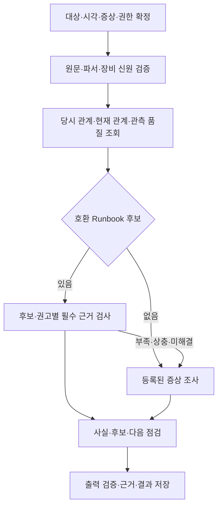

# 11. RCA Agent 모듈 설계서

문서 버전: 1.2 · 모듈 ID: rca · 대응: F05, R01~R09 · 독립 실행·배포

## 1. 실행 경계와 책임

RCA Agent는 자체 내부 접수 API와 RCA Worker를 가진다. Backend는 사용자 요청을 이 API로 전달한다. Incident와 Chatbot도 각자의 저장된 전달 요청으로 같은 API를 호출한다. 접수와 실행은 분리하며, 내부 API가 장시간 추론 종료를 기다리지 않는다.

초기에는 같은 모듈 이미지의 HTTP 처리부와 Worker 루프를 함께 실행할 수 있다. 필요 시 rca-api/rca-worker 실행 모드로 복제 수를 나누되 같은 모듈 계약·쓰기 책임을 유지한다. Backend 프로세스 안에서 RCA Worker를 시작하지 않는다.

## 2. 내부 API와 저장

경로 접두사는 `/internal/v1`이다. 내부 요청 신뢰·멱등·전달 ID는 15를 따른다.

| Method·경로 | 책임 | 응답 |
|---|---|---|
| POST /analyses | purpose_ids·target/incident_id·범위·시각 검증, jobs 저장 | 커밋 후 202, job_id=analysis_id |
| GET /analyses, /analyses/{id} | 허용 RCA 작업·결과 조회 | jobs+final result, 근거 참조 |
| GET /jobs/{id} | kind=rca 검증 후 상태·안전한 시도 이력 | 02 공통 job DTO |
| POST /jobs/{id}/cancel, /retry | 현재 권한·If-Match·명령 receipt·예산 검사 | 저장한 명령 결과 |
| GET /dispatch-receipts/{dispatch_id} | 이 Agent의 전달 접수 결과 조회 | 알려진 동일 job 또는 404 |
| GET /health/live, /health/ready | 모듈 상태 | live/접수 준비 상태 |

소유 데이터는 kind=rca인 jobs·job_attempts·job_results·command_receipts다. Incident의 사건 상태와 Chatbot 메시지는 RCA가 직접 갱신하지 않는다. 사건 입력은 Incident의 고정 evidence_version과 범위를 공통 읽기 어댑터로 검증하여 스냅샷에 고정한다. 사건 없는 직접 조사는 Incident를 생성하지 않는다.

Backend 직접 요청은 Idempotency-Key로 한 job을 생성한다. Incident/Chatbot 요청은 dispatch_id도 저장하여 재전송에 같은 job을 반환한다. 완료 결과와 사용한 근거는 유효 attempt·lease·deadline 조건을 확인한 하나의 RCA 저장 트랜잭션으로 확정한다.

## 3. 입력과 조사 업무

트리거는 Incident, 사용자 증상, 추가 증거에 따른 재분석, 보고서에서 요청한 후속 조사다. 사건 ID는 선택이며 사건 없는 요청도 동일 작업 관리·근거 계약을 사용한다. 동일 입력의 기술적 재시도는 attempt, 새 근거의 조사는 새 job이다.

### 3.1 업무별 계약

‘필수’는 해당 주장의 조건이다. 표에 적힌 추가 입력이 없다고 장비 기본 조사 전체를 중단하지 않는다.

| ID | 입력·필수 데이터 | 처리·출력 | 부족 시 |
|---|---|---|---|
| R01 알려진 오류 | 원문·producer/parser 계약·장비, D01/D05/D09·KB | 코드·장비·버전으로 후보 검색 → required_evidence 검사 → 적용 가능한 권고·반박·미충족 조건 | 코드/계약 불명은 원문 보존·일반 조사. 코드 하나로 원인 확정 금지 |
| R02 GPU→Pod | D01/D08, 현재 또는 사건 시각 | 직접 매핑·같은 노드 참고 Pod·현재/당시 관계 분리 | 매핑 미확인 표시. 같은 노드 Pod를 직접 사용자로 지정하지 않음 |
| R03 Pod→GPU | Pod 신원·D08 및 가용 D02~D06/D09 | 관련 GPU와 공통 Node의 증상·활동·상태 비교 | 장치 미확정이면 Pod/배치 근거만 제공 |
| R04 작업 영향 | 사건 당시 D08·D09·D13 | 당시 관계와 실제 중단·재개·원인 연계를 별도 기록 | 현재 관계만 있으면 당시 영향 unknown/not_assessed |
| R05 미등록 증상 | 증상·대상·시각, 가용 D01~D10 | 등록 procedure로 지지/반박 가능한 후보와 추가 확인 | 원인 불명으로 종료해도 사실·부족 정보·다음 확인 제공 |
| R06 재발 위치 | D14 정규화 사건·기간, 필요 시 D08/D12 | 장비 집중/작업 이동 패턴·모델·버전·관측시간 비교 | 작업 이력 없으면 장비 사건 비교만 제공 |
| R07 공통 장애 범위 | 동시 사건·Node·매핑, 필요 시 토폴로지 | 확인된 Node/GPU/연결 범위와 관련 작업 | 토폴로지 없는 장치 영향은 미확정 |
| R08 조치 검토 대상 | 최신 D08·장비/공유/조치 범위·정책 | 현재 관련 작업·원본 시각·조치 전 확인 목록 | 매핑이 비었다고 리셋 안전 확정 금지 |
| R09 조치 후 관측 | D14 실제 조치 시각·D05/D09/D10, 업무 회복은 D13 | 장비 정상 관측·오류 재관측·작업 재개를 분리 | Healthy만 있으면 업무 복구 미확인 |

### 3.2 등록 조사와 종료

기본 procedure는 GPU 접근 이상, GPU 사건과 Pod, 작업 진행 이상, 다중 장치 사건의 네 가지를 제공한다. 각 procedure는 `procedure_id/version, accepted_symptoms, required/optional_queries, allowed_next_steps, stop_conditions, limits`를 가진 등록 함수다. 범용 YAML 해석 엔진을 만들지 않는다.

초기 시간창·최대 확대·최대 후속 조사·조회 건수·로그 크기·전체 deadline은 C07에 배포 프로필로 등록한다. 기존 예시의 전후 10분·추가 2회·최대 전후 60분은 시험용 시작안이며 실제 배포 확정값으로 사용하지 않는다.

| 종료 이유 | 의미·필수 출력 |
|---|---|
| evidence_sufficient | 현 단계의 결론을 설명할 근거 충족. 인과 확정을 자동 의미하지 않음 |
| missing_data | 부족 데이터와 수집/조회할 다음 항목 |
| conflicting_evidence | 상충 근거를 모두 보존하고 구분할 다음 검사 |
| unsupported_source | 호환 계약·파서/장비 범위와 미지원 부분 |
| budget_exhausted | 사용한 예산·중단 단계·남은 확인 |
| query_failed | 실패한 도구·범위·이미 확보한 독립 결과 |

취소·작업 마감·영구 실패는 02의 작업 상태/종료 사유로 추가 기록한다. 데이터 부족을 해결하려 무제한 재시도하지 않는다.

### 3.3 관계·영향·원인 판단

| 축 | 값 | 승격 조건 |
|---|---|---|
| relation_scope | current_mapping / incident_time_mapping / same_node_only / unknown | 해당 시각·신원·매핑 근거 |
| impact_status | not_assessed / no_impact_observed / disruption_observed / recovery_observed | 확인한 기간의 작업 상태·로그·진행 근거 |
| causal_status | undetermined / candidate / supported / confirmed | 후보별 지지·반박·확정 조건. confirmed는 검토된 조건과 증거가 있어야 함 |

`no_impact_observed`는 확인한 범위에서 영향을 보지 못했다는 뜻이다. 같은 시각에 Pod가 종료됐다는 사실만으로 GPU가 원인이라고 확정하지 않는다. 임의 확률값을 붙이지 않는다.

### 3.4 장비 상태와 검사 유효성

정규화 입력은 `raw_health,check_status,normalized_health,component,severity,target,observed_at,producer_contract,parser_revision,evidence_refs`다. raw_health는 원문 그대로 또는 null이다. check_status는 valid/unavailable/skipped/initializing/unknown, normalized_health는 healthy/degraded/unhealthy/unknown, severity는 info/warning/critical/unknown을 사용한다. 이 필드들이 Fleet 원문에 실제로 모두 존재한다는 뜻은 아니다. 배포 계약과 표본에서 검증한 것만 도출하고 불명은 unknown으로 둔다.

| 관측·검사 | 정규화·사건 처리 | 회복 근거 |
|---|---|---|
| 유효 검사에서 정상 | valid+healthy. component별 정상 근거로 저장 | C08의 유효 정상 관측 기간/횟수와 대상 일치 조건 충족 시 해당 장비 회복 근거. 업무 복구는 별도 |
| 유효 검사에서 Degraded | valid+degraded, severity는 검증된 계약 매핑 | 회복 근거 아님. C08 알림/사건 정책에 따라 생성·갱신 |
| 유효 검사에서 오류 | valid+unhealthy, 대상별 사건·증거 연결 | 회복 근거 아님 |
| 검사 불가인데 원문 Healthy | unavailable+unknown, raw_health=Healthy 보존 | 채택하지 않음. 수집/검사 문제로 표시 |
| 의도적인 검사 제외 | skipped+unknown, 제외 사유·정책 보존 | 장비 고장으로 자동 생성하지 않으며 회복 근거도 아님 |
| 초기화 중 | initializing+unknown | 초기화 대기와 실제 장애 구분. 제한 초과 판정은 C08 정책 필요 |
| 로그 단절·오래된 정상 | unknown+unknown, 마지막 유효 관측 시각 표시 | 채택하지 않음. 상태 수집 문제로 표시 |
| 미등록 상태·component·검사 의미 | unknown, 원문·미지원 계약 유지 | 정상/장애/회복으로 임의 매핑하지 않음 |

incidents 배열 등 원문에 여러 GPU 항목이 있으면 모든 자식을 각각 파싱하고 원본 위치·대상·의미 revision을 보존한다. 한 항목 실패가 다른 유효 장치의 근거를 소거하지 않는다. 정상 관측 정책값이 미지정이면 자동 회복 판정을 보류하며 운영자가 확인한 근거를 검토해 사건 상태를 변경할 수 있다.

## 4. Worker 처리와 결과

1. 자기 kind의 queued/retry_wait job만 원자적으로 점유한다.
2. 현재 요청자 권한과 저장된 scope의 교집합을 확인한다. 범위가 달라져 일부가 불허되면 조용히 축소하지 않고 명시 차단한다.
3. 고정된 query/procedure/parser/Knowledge/model revision으로 근거를 조사한다.
4. 04의 수치 레지스트리·근거·원인 후보·지지/반박·종료 이유를 구성한다.
5. 설명을 구조화 결과와 대조하고 유효 attempt만 최종 저장한다.

공통 실행·취소·retry·추론 예산은 15, 공통 결과 JSON은 04 §8이 원본이다. result_schema_version과 criteria_version은 1.1을 유지한다. 설명 실패만으로 유효 근거를 삭제하지 않는다. 결과 성공을 사건 종결이나 실제 업무 복구로 바꾸지 않는다.

## 5. 장애·운영·완료

RCA 접수 API 불가 시 Backend 직접 요청은 503/timeout과 같은 요청 키로 재확인하도록 응답한다. Incident/Chatbot은 이미 저장한 dispatch를 보존한다. Worker만 불가하면 유효 접수는 queued로 남고 모듈 상태에서 실행 지연을 표시한다. 접수 API 응답 성공과 Worker 처리 가능 상태를 각각 노출한다.

T10~T14·T39·T40의 전체 R 업무, T23~T27의 점유·취소·복구, T42의 별도 프로세스 접수·재조회, T44의 Incident 전달 중복을 검증한다. T41에서 Backend만 재시작해도 RCA의 저장 작업이 유지됨을 확인한다. 전체 NOT RUN.

[04 공통 판단](04_Agent_동작_판단_명세서.md) · [13 Incident](13_Incident_모듈_설계서.md) · [15 공통 실행](15_모듈간_호출과_공통실행_계약.md)
