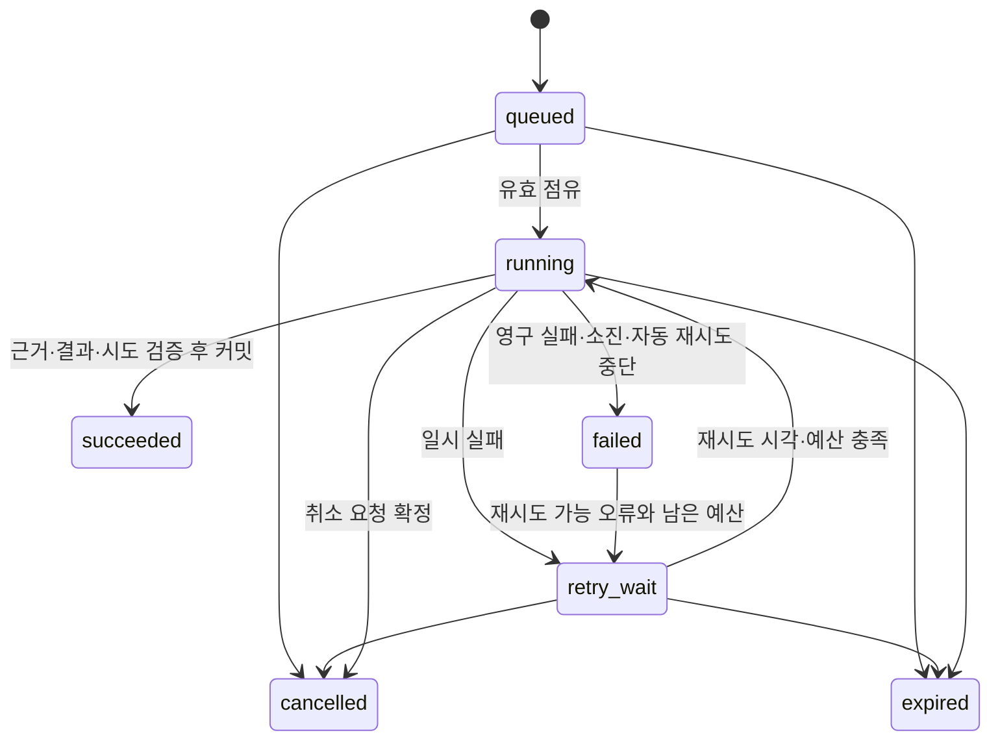

# 15. 모듈 간 호출과 공통 실행 계약

문서 버전: 1.2 · 기준일: 2026-09-17 · 상태: 신규 구현 계약

## 1. 통신 경계

외부 클라이언트는 Backend의 /api/v1만 호출한다. Backend는 Chatbot·RCA·Report·Incident·Scheduler의 /internal/v1을 호출한다. Chatbot→RCA/Report, Incident→RCA, Scheduler→Report의 자동 전달은 각 생산 모듈이 수행한다. Backend를 다시 경유하지 않는다. 공통 조회·계산·Knowledge·LLM·저장 코드는 라이브러리이며 별도 서비스가 아니다.

| 호출 | 소유 모듈 | 방식 |
|---|---|---|
| 대화 생성·조회 | Chatbot | 동기 내부 HTTP, 장시간은 메시지 상태 조회 |
| 수동 RCA/보고서 접수 | RCA/Report | 동기 내부 접수 HTTP → 202 job_id → 각 모듈 Worker |
| 사건 원문·상태 | Incident | 원문 보존 중계, Incident가 검증·저장 |
| 일정 CRUD | Scheduler | 내부 HTTP, 달력 실행은 Scheduler 자체 루프 |
| 자동 전문 작업 | 각 생산 모듈 → RCA/Report | 저장된 전달 의도 + 동일 키 재전송 |
| 작업 취소·retry·보고서 출력 | jobs.kind의 RCA/Report | 소유 모듈 내부 API |
| 통합 목록·상태·근거 | Backend | 공통 권한 적용 읽기 어댑터, 도메인 변경 금지 |

공유 PostgreSQL을 사용하므로 독립 배포에도 DB 스키마 호환성이 필요하다. RCA와 Report는 자기 kind의 작업만 점유·변경한다. Backend는 jobs를 직접 생성·취소·완료하지 않는다.

## 2. 내부 요청과 신뢰

공통 봉투는 contract_version=1.2, request_id, trace_id, caller_module, delegation, idempotency_key, payload, dispatch_id?(자동 전달만)다. payload는 02의 정규화 입력과 고정 scope·기간·목적/주제·설정 참조를 사용한다. 변경 API는 If-Match와 원래 키를 보존한다. 읽기 요청은 동일한 검증된 신원 메타데이터와 외부 필터를 사용하며 불필요한 JSON 본문을 만들지 않는다. 외부 본문은 내부 payload로 대응하고 외부 Idempotency-Key와 If-Match는 의미를 보존한다. Webhook 원문은 봉투 JSON으로 재직렬화하지 않고 원래 bytes와 검증 가능한 서비스 메타데이터를 전달한다. 응답은 02의 오류 형식과 안전한 리소스 DTO를 사용한다. 지원하지 않는 계약은 409 CONTRACT_VERSION_UNSUPPORTED로 거절한다.

caller_module·delegation은 문자열을 신뢰하는 헤더가 아니다. C01에서 정한 검증 가능한 서비스 자격과 위임 증명에 결합한다. 목적지 모듈은 호출 서비스 허용 목록, 위임 principal, 현재 권한, 고정 scope, 요청 hash를 다시 확인한다. Backend는 브라우저의 내부 인증 헤더를 제거한다. Incident 자동 분석은 수신 profile에 설정된 제한된 실행 principal, Scheduler는 일정 소유자, Chatbot은 메시지 작성자를 사용한다. 임의 관리자 principal 대체는 금지한다.

내부 경로는 브라우저에 공개하지 않는다. 구체 인증 제품·테넌트 확장은 이번 범위 밖이나 서비스 신뢰 검증은 운영 활성 전 C01 필수값이다. 로컬 고정 신원은 테스트 전용이다. 내부 비밀·서비스 주소는 외부 DTO에서 제외한다.

## 3. 직접 요청의 접수

Backend가 RCA/Report에 전달한 사용자 요청은 목적지의 job 커밋 뒤에만 202 job_id를 반환한다. 연결 실패 시 성공을 꾸미지 않는다. 응답이 유실됐으면 클라이언트와 Backend는 동일 멱등 키·본문으로 재요청한다. 목적지는 권한 검사 후 같은 접수 결과를 반환한다. Backend 메모리에만 장기 작업을 보관하지 않는다.

## 4. 영속 전달

분리된 모듈 사이의 HTTP를 하나의 DB 트랜잭션으로 취급하지 않는다. 메시지·사건·일정 발생과 module_dispatches를 생산 모듈의 한 트랜잭션으로 저장한다. RCA/Report는 자기 접수 트랜잭션으로 jobs를 만든다. 메시지 브로커는 추가하지 않는다.

1. 생산 모듈은 업무 변경과 pending 전달 행을 함께 커밋한다. 업무별 source_key를 유일하게 관리한다.
2. 생산 모듈 전달 루프는 만료되지 않은 행을 짧게 점유하고 HTTP 동안 DB 잠금을 해제한다. 복제본 경합은 lease·version으로 방어한다.
3. 목적지 접수 API는 고정 dispatch_id를 검사하고 jobs.source_dispatch_id unique로 동일 job만 만든다.
4. 생산 모듈은 응답 job_id를 자기 전달 행과 업무 참조에 저장하고 accepted로 변경한다.
5. 응답 유실은 같은 요청을 재전송하거나 목적지 GET /internal/v1/dispatch-receipts/{id}로 접수 결과를 조회한다. receipt 조회의 404만으로 전달을 종결하지 않는다.

| 전달 상태 | 의미·다음 행동 |
|---|---|
| pending | 업무와 전달 의도가 저장됨, job은 아직 확인되지 않음 |
| delivering | 점유·전송·접수 여부 확인 중. lease 만료 후 동일 키로 복구 |
| accepted | job_id 확인. 분석 완료와 다름 |
| blocked | 현재 권한 또는 설정 오류. 자동 반복하지 않음 |
| failed | 접수되지 않았음을 원자적으로 확인한 영구 오류·예산/마감 소진 |
| cancelled | 접수 전 취소를 원자적으로 확정함 |

blocked/failed/cancelled는 같은 전달의 자동 재개 대상이 아니다. 원인 해소 후 명시적인 새 사용자 요청으로 실행하며 원본 참조를 남긴다. HTTP timeout 자체는 실패 확정 근거가 아니다. 재전송 횟수는 job attempt가 아니며 deadline·고정 입력·모델을 새로 시작하거나 바꾸지 않는다. 전달 deadline은 최초 의도 저장 시 C07로 확정하고 자동 job도 이 절대 deadline을 이어받는다. 전송 대기 시간을 제외하여 실행 가능 시간을 늘리지 않는다. 직접 요청의 deadline은 최초 Agent 접수 시 확정한다.

### 4.1 접수·취소·마감 경합

공유 DB의 전달 행 잠금을 접수 경계로 사용한다. 목적지는 서비스·현재 권한을 검증한 후 해당 전달 행을 잠그고 기존 source_dispatch_id job을 먼저 찾는다. 없으면 목적지·hash·source·상태·deadline을 검사한 뒤 같은 트랜잭션 안에서 job을 생성한다. 닫힌 전달이나 지난 마감에는 새 job을 만들지 않는다. 목적지는 생산 모듈의 전달 행을 수정하지 않고 검증을 위한 읽기·잠금만 한다.

생산 모듈도 취소/blocked/failed 확정 전에 같은 전달 행을 잠그고 커밋된 job을 확인한다. 이미 접수됐다면 accepted와 job 참조를 복구한다. 취소는 그 Agent의 job cancel API로 위임하며 결과를 별도로 반환한다. job이 없을 때만 전달을 닫는다. 이 순서로 HTTP 응답 유실 뒤 늦은 접수와 취소의 경합을 방어한다. 완료된 job의 취소는 409다.

POST /dispatches/{id}/cancel은 현재 권한·If-Match·별도 명령 멱등 키를 검증한다. 접수 전이면 cancelled, 접수 후이면 accepted 전달 참조와 Agent의 cancelled/cancel_requested 결과를 반환한다. 생산자는 전달 취소 의도와 downstream 명령 키·최초 기대 job version을 command_receipts에 영속 기록한 뒤 호출한다. 아직 응답이 없으면 receipt의 response_status/response_body는 NULL이고 완료 상태로 응답하지 않는다. 최초 로컬 If-Match 검사와 의도 저장을 원자적으로 처리하며, 재전송은 현재 권한 검사 후 이 의도를 복구한다. 위임 취소 응답이 유실되면 같은 명령 키·고정 본문·최초 기대 version으로 다시 호출한다. Agent의 기존 receipt 조회가 ETag 검사보다 우선하므로 이미 적용한 취소를 중복 적용하지 않는다. 전달 accepted를 취소 성공으로 표시하지 않는다.

### 4.2 전달 DTO와 오류

GET /dispatches/{id}는 id, source_module, target_module, status, source_ref, job_id?, deadline_at, next_attempt_at?, last_error_code?, can_cancel, version을 반환한다. payload·신원 증명·내부 URL은 제외한다. GET /internal/v1/dispatch-receipts/{id}는 권한 범위 내 기존 job_id·status_url 또는 404를 반환한다. 기존 job이 있더라도 현재 권한이 없으면 공개하지 않는다.

429/503/연결 불명은 C07 범위에서 동일 키 backoff+jitter로 복구한다. 400/422·hash 충돌은 영구 오류, 401/403은 차단 사유다. 어떤 종결도 4.1의 접수 확인을 먼저 거친다. 전달·작업·접수 키는 관련 결과의 보존 기간보다 먼저 삭제하지 않는다.

## 5. Agent 공통 실행 커널

아래 규칙은 RCA/Report가 공유 코드로 재사용하며 Backend의 실행 루프가 아니다.

- DB 행 잠금과 `SKIP LOCKED`로 실행 가능한 자기 유형 job을 짧은 트랜잭션 안에서 선택·점유한다. 조회·LLM 동안 트랜잭션을 열어 두지 않는다.
- 점유 시 `attempt_no`를 올리고 Worker ID·lease 만료를 기록한다. heartbeat는 현재 attempt에 대해서만 갱신한다.
- 점유와 동시에 job_attempts에 시작을, 종료·회수와 동시에 해당 attempt의 종료 원인·오류·단계·heartbeat를 기록한다. 현재 상태 원장은 jobs 한 곳이며 과거 이력은 덮어쓰지 않는다.
- 완료 시 현재 attempt·lease 유효성·취소 미요청·deadline을 함께 검증한다. 근거와 최종 결과 참조, succeeded 전환을 한 트랜잭션에서 확정한다.
- Worker 장애 후 만료된 점유는 제한된 재시도로 회수한다. 이전 Worker의 늦은 결과는 발행하지 않는다. 외부 호출은 중복될 수 있으므로 ‘추론 exactly once’를 보장하지 않는다.
- 자동/수동 재시도는 같은 job의 attempt이며 전체 deadline·예산을 새로 시작하지 않는다. 새 증거·의도적 재생성은 `parent_job_id`를 가진 새 job이다.
- 성공 결과는 한 job당 하나다. retry용 중간 근거는 final이 아니며 저장된 정상 결과를 덮어쓰지 않는다.
- 취소 요청 자체는 `cancel_requested_at`에 즉시 기록한다. 실행 중에는 Worker/회수기가 취소를 확정하고 결과 발행을 막는다. 완료가 먼저 원자적으로 확정됐으면 취소는 409다.

멱등 키 범위는 `(principal,operation,key)`와 정규화 request hash다. 자동 전달은 source_dispatch_id를 job 유일 키로 사용한다. 생산 측 사건 source_key는 `(incident,evidence_version,analysis_profile_version)`, 일정 발생 키는 `(schedule,revision,scheduled_for_utc)`이며 정확한 UTC 보고기간의 예약 중복은 Scheduler가 별도로 방지한다. 동일 키의 보존 기간은 적어도 관련 job 보존 기간을 포함한다.

수동 retry/cancel은 job 생성 키와 별도의 command_receipts에 `(owner_module,principal,operation,resource_id,key)`·정규화 hash·처리 결과를 저장한다. 현재 인증/권한 검사 후 같은 키 기록을 먼저 조회한다. 같은 본문으로 이미 적용된 명령이면 당시 응답/참조를 반환하고 최신 상태 URL을 제공한다. 재전송에 담긴 오래된 If-Match 때문에 성공했던 명령을 다시 실패로 취급하지 않는다. 최초 요청일 때만 If-Match와 현재 상태를 검사하고 명령 결과·상태 변경을 같은 트랜잭션으로 기록한다. 이 절은 Agent 안의 로컬 변경이며, 생산 모듈에서 Agent로 취소를 위임할 때는 §4.1의 pending 의도·응답 복구를 적용한다.

failed의 수동 재시도는 일시 오류로 자동 진행이 중단됐지만 전체 예산·deadline이 남은 경우만 허용한다. 영구 입력/권한/호환 오류·시도 소진·deadline 초과는 새 요청으로 처리한다. FE가 전송한 임의 stage는 받지 않고 서버가 검증한 체크포인트만 재사용한다. 결과 final을 이미 발행했으면 설명만 다시 만들 때도 parent_job_id를 가진 새 job이다.

## 6. 공유 한도와 오류

긴급 RCA 우선순위는 서버에서 검증한 사건 심각도로 정한다. 오래 대기한 보고서는 C07의 최대 우선 대기 정책에 따라 실행 기회를 얻는다. 진행 중인 모델 추론의 즉시 선점을 전제하지 않는다.

LLM 호출은 일반 Assistant·RCA·보고서가 같은 공유 한도를 사용한다. DB 기반 슬롯/호출 점유와 토큰 예산을 확보한 뒤 제출한다. HTTP timeout 뒤 원격 종료가 불명확하면 `unknown` 호출로 기록하고, 종료 확인 또는 C07의 검증된 최대 원격 수명까지 슬롯을 함부로 재사용하지 않는다. 원격 수명 상한을 보장할 수 없는 배포는 조정 절차 전까지 해당 슬롯을 격리한다.

슬롯과 함께 검증된 입력 토큰 추정 상한+출력 상한을 원자적으로 예약한다. C07의 공유 예산 기간·principal·job/message 누적 한도별로 활성 예약+이미 사용한 값을 검사한다. 동시 호출이 같은 잔여량을 각각 사용하지 않도록 동일 예산 키를 잠그고 reservation을 기록한다. 완료 시 실제 사용량으로 정산하고 잔여 예약을 반환한다. token usage가 불명확한 실패/unknown 호출은 예약량을 유지하며 검증된 종료 후에도 사용량을 알 수 없으면 예약 상한을 소비량으로 처리한다. 재시도는 기존 job 누적 예산에 합산한다.

| 실패 | 처리 |
|---|---|
| 입력·권한·호환 설정 오류 | 영구 실패 또는 접수 거절. 자동 반복 안 함 |
| 데이터 없음·품질 부족 | 해당 주제 blocked/partial. 정상적으로 저장했다면 job succeeded 가능 |
| 일부 저장소 실패 | 독립 결과·근거 보존, 실패 입력 명시. 전체 수행 불가면 failed |
| 일시 네트워크·과부하 | deadline 내 제한된 지수 backoff+jitter. 하위 자동 재시도와 합산 |
| LLM 설명 실패 | 계산·근거 보존, narrative_status=failed/omitted. 허용 시 구조화 결과를 final로 발행 |
| 저장 실패 | succeeded 금지. 같은 attempt 또는 회수 후 저장 재시도 |
| 취소·마감 후 응답 | 진단 기록만 보존, 최종 성공 결과로 발행하지 않음 |

일반 대화는 C07의 짧은 대화 timeout 안에서 처리한다. 실패 메시지는 실패 상태로 남기고 같은 메시지 키 재전송으로 이중 저장하지 않는다. 장시간 전문 분석은 job으로 전환한다.

## 7. 배포·검수

공통 DTO·계산·저장 코드 revision과 DB migration version을 각 이미지 manifest에 기록한다. 새 필드 추가 → 호환 소비자 배포 → 생산자 배포 순서로 변경하고, 읽지 못하는 계약은 명시 거절한다. 장기 실행이 남아 있는 동안 이전 스냅샷·결과 스키마를 읽을 수 있어야 한다. 파괴적 컬럼 제거는 구버전 중단·백업·복구 검증 이후 별도 변경으로 처리한다.

T41~T48에서 독립 재시작, 응답 유실, 동시 전달, 권한 철회, 취소/마감 경합을 검증한다. 실제 구현과 실행 결과는 아직 없다.

[02 외부 API](02_백엔드_API_작업명세서.md) · [03 데이터](03_데이터_설계서.md) · [05 검수](05_테스트_검수_기준서.md) · [06 배포](06_배포_운영_인계서.md)
