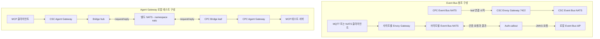

# DSX 구성·연동 기록

- 작성자: **[이름] — 미확인**. 로컬 사용자 계정명으로 작성자를 추정하지 않았다.
- 기록 작성일: **2026-09-08**.
- 대상 작업일 또는 기간: **미확인**. 참고 원고의 기준일은 2026-08-21, 보존된 문구 수정 기록의 폴더명은 2026-08-24다. 이를 작성자의 전체 작업 기간으로 확정하지 않는다. 이번 자료 재검토는 2026-09-08에 수행했다.
- 대상 환경: **실제 클러스터·서버명 미확인**. 확인한 것은 Windows의 DSX 작업 폴더와 그 안의 `dsx-exchange-upstream` 소스 사본이다. 저장소에 정의된 참조 실험 환경명은 Kind `dsx-exchange`이며, 실제 생성 여부는 미확인이다.
- 문서 목적: 팀별 기록을 취합할 때 **개념 구조, 저장소의 배포 정의, 실제 운영 상태를 혼동하지 않도록** 구성과 연결의 근거를 남긴다.

> **현재 확실한 결론:** DSX 설명 원고와 DSX Exchange 배포 소스가 존재하며, 로컬 참조 구성의 연결을 정적으로 추적할 수 있다. 그러나 이번에 확보한 자료에는 우리 클러스터의 적용 결과·Pod 목록·통신 로그가 없다. 아래 설정 기반 구조를 “우리 환경에서 구축·연동 완료된 구조”로 옮겨 적으면 안 된다.

### 실제 참고한 자료와 확인하지 못한 범위

현재 모델에 제공된 대화에는 이번 정리 요청 이전의 DSX 조사·설치 대화 본문이 없다. 따라서 과거 대화 전체를 복원했다거나, 폴더 안의 작업을 모두 이 작성자가 수행했다고 간주하지 않았다. 다른 팀원의 대화는 참고하지 않았다.

실제로 읽은 자료는 아래의 원고·작업 메모·저장소 문서·YAML·Helm 템플릿이다. PDF/PPTX 산출물은 파일의 존재와 이름만 확인했으며, 이번 기록에서는 본문을 직접 검토한 근거로 사용하지 않았다. `source-notes.txt`의 외부 URL은 기존 조사 출처 기록으로 확인했으며, 이번에는 웹 원문을 다시 조회하지 않았다. 아래 제품 설명은 당시 원고 또는 로컬 저장소에 기록된 설명이지, 2026-09-08의 최신 제품 사양을 새로 검증한 결과가 아니다.

| 근거 ID | 실제 참고 자료 | 이 기록에서의 용도 |
|---|---|---|
| S01 | [DSX 통합 원고 검토본 v0.1](<https://github.com/uclix-nvidia-sw/gpu-ops-advisor/blob/c2dd94ecfb1c31b5a8c84cea008888f8fb03d70c/review/DSX_%ED%86%B5%ED%95%A9%EC%9B%90%EA%B3%A0_%EA%B2%80%ED%86%A0%EB%B3%B8_v0.1.md>) | 상위 개념, 조사 범위, 구축 전·후 역할 및 구현 후보 |
| S02 | [2026-08-24-001 문구 기록](<../../../../references/source-notes/_workspace/2026-08-24-001/final.md>), [002 문구 기록](<../../../../references/source-notes/_workspace/2026-08-24-002/final.md>) | v0.7·v0.8 설명 문구 변경 |
| S03 | [Component v0.2 출처 메모](<../../../../references/source-notes/tmp/final-authoring/component-v02/source-notes.txt>), [Understanding v1.1 출처 메모](<../../../../references/source-notes/tmp/final-authoring/beginner-v11/source-notes.txt>), [8월 24일 출처 메모](<../../../../references/source-notes/tmp/review_260824/source-notes.txt>) | 조사 기준일·참고 URL·편집 이력 |
| S04 | [Exchange README](https://github.com/dsx-ai-factory/dsx-exchange/blob/cf933149bad9e0f96722ae2c4b013f4f91ec0570/README.md), [AGENTS.md](https://github.com/dsx-ai-factory/dsx-exchange/blob/cf933149bad9e0f96722ae2c4b013f4f91ec0570/AGENTS.md) | 저장소 정체, 모듈 구분, 문서화된 검증 절차 |
| S05 | [Architecture](https://github.com/dsx-ai-factory/dsx-exchange/blob/cf933149bad9e0f96722ae2c4b013f4f91ec0570/docs/architecture.md), [Authentication](https://github.com/dsx-ai-factory/dsx-exchange/blob/cf933149bad9e0f96722ae2c4b013f4f91ec0570/docs/authentication.md) | Event Bus 개념·인증 흐름과 설정의 대조 |
| S06 | [Local README](https://github.com/dsx-ai-factory/dsx-exchange/blob/cf933149bad9e0f96722ae2c4b013f4f91ec0570/local/README.md), [루트 Skaffold](https://github.com/dsx-ai-factory/dsx-exchange/blob/cf933149bad9e0f96722ae2c4b013f4f91ec0570/skaffold.yaml), [Kind 정의](https://github.com/dsx-ai-factory/dsx-exchange/blob/cf933149bad9e0f96722ae2c4b013f4f91ec0570/local/infra/kind/dsx-exchange.yaml) | 단일 Kind 환경과 배포 의존성 |
| S07 | [Event Bus Chart](https://github.com/dsx-ai-factory/dsx-exchange/blob/cf933149bad9e0f96722ae2c4b013f4f91ec0570/deploy/nats-event-bus/Chart.yaml), [기본 values](https://github.com/dsx-ai-factory/dsx-exchange/blob/cf933149bad9e0f96722ae2c4b013f4f91ec0570/deploy/nats-event-bus/values.yaml) | 의존 Chart 버전, NATS·mTLS·인증·저장 설정 |
| S08 | [Event Bus Skaffold](https://github.com/dsx-ai-factory/dsx-exchange/blob/cf933149bad9e0f96722ae2c4b013f4f91ec0570/local/event-bus/skaffold.yaml), [local-dev values](https://github.com/dsx-ai-factory/dsx-exchange/blob/cf933149bad9e0f96722ae2c4b013f4f91ec0570/local/event-bus/k8s/local-dev-values.yaml) | 릴리스·Namespace·이미지 우선순위·JWKS |
| S09 | [CSC values](https://github.com/dsx-ai-factory/dsx-exchange/blob/cf933149bad9e0f96722ae2c4b013f4f91ec0570/local/event-bus/k8s/csc/values.yaml), [CPC 공통 values](https://github.com/dsx-ai-factory/dsx-exchange/blob/cf933149bad9e0f96722ae2c4b013f4f91ec0570/local/event-bus/k8s/cpc/values.yaml), [CPC-1](https://github.com/dsx-ai-factory/dsx-exchange/blob/cf933149bad9e0f96722ae2c4b013f4f91ec0570/local/event-bus/k8s/cpc/cpc-1.yaml), [CPC-2](https://github.com/dsx-ai-factory/dsx-exchange/blob/cf933149bad9e0f96722ae2c4b013f4f91ec0570/local/event-bus/k8s/cpc/cpc-2.yaml) | 사이트별 계정·연합·토픽·경유 Gateway |
| S10 | [Event Bus Gateway 템플릿](https://github.com/dsx-ai-factory/dsx-exchange/blob/cf933149bad9e0f96722ae2c4b013f4f91ec0570/deploy/nats-event-bus/templates/gateway.yaml), [leaf 설정 템플릿](https://github.com/dsx-ai-factory/dsx-exchange/blob/cf933149bad9e0f96722ae2c4b013f4f91ec0570/deploy/nats-event-bus/templates/nats-leafnodes-config.yaml) | Service 목적지·포트·CPC 발신 연결 |
| S11 | [공유 Gateway](https://github.com/dsx-ai-factory/dsx-exchange/blob/cf933149bad9e0f96722ae2c4b013f4f91ec0570/local/infra/sites/gateway-base/gateway.yaml), [CSC Gateway 오버레이](https://github.com/dsx-ai-factory/dsx-exchange/blob/cf933149bad9e0f96722ae2c4b013f4f91ec0570/local/infra/sites/csc/gateway/kustomization.yaml) | Envoy Listener·TLS·Namespace 연결 |
| S12 | [CSC 주소 풀](https://github.com/dsx-ai-factory/dsx-exchange/blob/cf933149bad9e0f96722ae2c4b013f4f91ec0570/local/infra/sites/csc/address-pools.yaml), [CPC-1 주소 풀](https://github.com/dsx-ai-factory/dsx-exchange/blob/cf933149bad9e0f96722ae2c4b013f4f91ec0570/local/infra/sites/cpc-1/address-pools.yaml), [CPC-2 주소 풀](https://github.com/dsx-ai-factory/dsx-exchange/blob/cf933149bad9e0f96722ae2c4b013f4f91ec0570/local/infra/sites/cpc-2/address-pools.yaml) | 설정상 외부 진입 주소 |
| S13 | [Agent Gateway Chart](https://github.com/dsx-ai-factory/dsx-exchange/blob/cf933149bad9e0f96722ae2c4b013f4f91ec0570/deploy/dsx-agent-gateway/Chart.yaml), [기본 values](https://github.com/dsx-ai-factory/dsx-exchange/blob/cf933149bad9e0f96722ae2c4b013f4f91ec0570/deploy/dsx-agent-gateway/values.yaml) | Agentgateway·Valkey·Bridge·관측 기본값 |
| S14 | [Agent Gateway Skaffold](https://github.com/dsx-ai-factory/dsx-exchange/blob/cf933149bad9e0f96722ae2c4b013f4f91ec0570/local/agent-gateway/skaffold.yaml), [테스트 구성 Skaffold](https://github.com/dsx-ai-factory/dsx-exchange/blob/cf933149bad9e0f96722ae2c4b013f4f91ec0570/local/agent-gateway/skaffold.fixtures.yaml), [CRD 배포](https://github.com/dsx-ai-factory/dsx-exchange/blob/cf933149bad9e0f96722ae2c4b013f4f91ec0570/local/agent-gateway/skaffold.infra.yaml) | 사이트별 배포와 별도 테스트 NATS |
| S15 | [Agent 공통 values](https://github.com/dsx-ai-factory/dsx-exchange/blob/cf933149bad9e0f96722ae2c4b013f4f91ec0570/local/agent-gateway/values/values.local-common.yaml), [CSC values](https://github.com/dsx-ai-factory/dsx-exchange/blob/cf933149bad9e0f96722ae2c4b013f4f91ec0570/local/agent-gateway/values/values.local.yaml), [CPC-1 values](https://github.com/dsx-ai-factory/dsx-exchange/blob/cf933149bad9e0f96722ae2c4b013f4f91ec0570/local/agent-gateway/values/values.local-leaf.yaml), [CPC-2 오버레이](https://github.com/dsx-ai-factory/dsx-exchange/blob/cf933149bad9e0f96722ae2c4b013f4f91ec0570/local/agent-gateway/values/values.local-leaf-cpc-2.yaml), [정적 upstream](https://github.com/dsx-ai-factory/dsx-exchange/blob/cf933149bad9e0f96722ae2c4b013f4f91ec0570/local/agent-gateway/values/values.local-static.yaml) | Bridge 역할·NATS 목적지·JWT·MCP 경로 |
| S16 | [Bridge README](https://github.com/dsx-ai-factory/dsx-exchange/blob/cf933149bad9e0f96722ae2c4b013f4f91ec0570/dsx-agentgateway-bridge/README.md), [Bridge 템플릿](https://github.com/dsx-ai-factory/dsx-exchange/blob/cf933149bad9e0f96722ae2c4b013f4f91ec0570/deploy/dsx-agent-gateway/templates/dsx-agentgateway-bridge.yaml), [이름·목적지 helper](https://github.com/dsx-ai-factory/dsx-exchange/blob/cf933149bad9e0f96722ae2c4b013f4f91ec0570/deploy/dsx-agent-gateway/templates/_helpers.tpl) | 요청 방향·Service·환경변수·상태 없는 MCP 처리 |
| S17 | [Agent Gateway 템플릿](https://github.com/dsx-ai-factory/dsx-exchange/blob/cf933149bad9e0f96722ae2c4b013f4f91ec0570/deploy/dsx-agent-gateway/templates/gateway.yaml), [인증·권한 정책](https://github.com/dsx-ai-factory/dsx-exchange/blob/cf933149bad9e0f96722ae2c4b013f4f91ec0570/deploy/dsx-agent-gateway/templates/agentgatewaypolicy.yaml), [요청 제한 템플릿](https://github.com/dsx-ai-factory/dsx-exchange/blob/cf933149bad9e0f96722ae2c4b013f4f91ec0570/deploy/dsx-agent-gateway/templates/ratelimit.yaml) | NodePort·JWT·요청 제한·Valkey 연결 |
| S18 | [MCP 테스트 values](https://github.com/dsx-ai-factory/dsx-exchange/blob/cf933149bad9e0f96722ae2c4b013f4f91ec0570/local/agent-gateway/charts/test-backends/values.yaml), [배포 템플릿](https://github.com/dsx-ai-factory/dsx-exchange/blob/cf933149bad9e0f96722ae2c4b013f4f91ec0570/local/agent-gateway/charts/test-backends/templates/backends.yaml), [NetworkPolicy](https://github.com/dsx-ai-factory/dsx-exchange/blob/cf933149bad9e0f96722ae2c4b013f4f91ec0570/local/agent-gateway/charts/test-backends/templates/networkpolicy.yaml) | 테스트 서버 이름·포트·접근 허용 정의 |
| S19 | [IdP HTTPRoute](https://github.com/dsx-ai-factory/dsx-exchange/blob/cf933149bad9e0f96722ae2c4b013f4f91ec0570/local/idp/httproute.yaml), [Demo IdP 배포 템플릿](https://github.com/dsx-ai-factory/dsx-exchange/blob/cf933149bad9e0f96722ae2c4b013f4f91ec0570/local/idp/chart/templates/demoidp.yaml) | 로컬 인증 서버의 연결·리소스 종류 |
| S20 | [OTel 리소스](https://github.com/dsx-ai-factory/dsx-exchange/blob/cf933149bad9e0f96722ae2c4b013f4f91ec0570/local/infra/observability/resources.yaml), [Collector values](https://github.com/dsx-ai-factory/dsx-exchange/blob/cf933149bad9e0f96722ae2c4b013f4f91ec0570/local/infra/observability/values.collector.yaml), [관측 배포](https://github.com/dsx-ai-factory/dsx-exchange/blob/cf933149bad9e0f96722ae2c4b013f4f91ec0570/local/infra/observability/skaffold.yaml) | trace 전달 경로와 수신·출력 방식 |
| S21 | [Prometheus values](https://github.com/dsx-ai-factory/dsx-exchange/blob/cf933149bad9e0f96722ae2c4b013f4f91ec0570/local/infra/prometheus/values.yaml), [Prometheus 배포](https://github.com/dsx-ai-factory/dsx-exchange/blob/cf933149bad9e0f96722ae2c4b013f4f91ec0570/local/infra/prometheus/skaffold.yaml), [Agent 모니터 템플릿](https://github.com/dsx-ai-factory/dsx-exchange/blob/cf933149bad9e0f96722ae2c4b013f4f91ec0570/deploy/dsx-agent-gateway/templates/monitoring.yaml) | metrics 수집 정의·Grafana 설정 |
| S22 | [Auth-callout Deployment](https://github.com/dsx-ai-factory/dsx-exchange/blob/cf933149bad9e0f96722ae2c4b013f4f91ec0570/auth-callout/deploy/templates/deployment.yaml) | 설정·권한 ConfigMap 마운트 |
| S23 | 이번 파일 조회·Git 조회 결과 | 소스 HEAD `cf933149bad9e0f96722ae2c4b013f4f91ec0570`, 소스 사본의 `git status --short` 출력 없음. HEAD의 커밋 시각은 2026-08-17 17:43:50 -0700. 작성자의 작업 시각이나 설치 버전 증거는 아님 |

근거 수준은 **[문서]** 원고·README 설명, **[설정]** values·템플릿에 있는 선언, **[실행]** 이 작업에서 실제 얻은 명령 결과, **[추정]** 확인된 값으로부터 도출한 해석, **[향후]** 추가 확인 제안, **[미확인]** 증거가 없는 항목으로 구분한다. 여기서 [설정]은 클러스터 적용 완료를 뜻하지 않는다.

인증 토큰·비밀번호·개인키·NKey seed·kubeconfig 인증정보는 본문에서 제외했다. 주소는 가명으로 바꾸지 않았다. 기재된 사설 주소는 **로컬 참조 설정의 값**이며, 회사의 실제 운영 주소라는 증거는 없다.

## 1. 이번에 다룬 범위와 목적

### 기존 자료에서 확인되는 조사 범위

- DSX를 단일 설치 프로그램이 아니라 설계·검증·구축·운영을 연결하는 기술 체계로 설명하는 원고를 정리했다는 기록이 있다. DSX Sim·OS·Exchange·MaxLPS·Flex와 Hardware/Facilities/Reference Designs를 구분한다. [문서: S01–S03]
- Omniverse/OpenUSD의 역할, CFD와 PhysicsNeMo 기반 Surrogate Model의 관계, 운영 데이터 수집과 실제 제어의 차이를 다뤘다. [문서: S01]
- 고객 자체 구축에 연계 가능한 Mission Control·BCM·DCGM 등을 DSX 최상위 공식 모듈과 같은 수준으로 혼합하지 않도록 설명 기준을 정리했다. 이는 당시 원고의 분류이며 실제 도입 목록은 아니다. [문서: S01]

### 이번에 새로 확인한 범위

- 저장소의 고정된 소스 시점과 로컬 배포 정의를 읽고, Event Bus·Agent Gateway·인증·관측 경로를 추적했다.
- 개념 문서의 별도 CSC/CPC 클러스터와 단일 Kind 로컬 구성을 구분했다.
- Agent Gateway Bridge가 별도 테스트용 NATS를 사용한다는 설정을 확인했다.
- 기존 설정은 수정하지 않았으며, 새로 작성한 산출물은 이 기술 기록이다.

**작성자의 실제 담당 범위, 과거 설치·코드 작성·배포·테스트 수행 여부는 미확인이다.** 소스가 작업 폴더에 존재한다는 사실만으로 작성자가 해당 소스를 작성하거나 실행했다고 기록하지 않는다.

## 2. 구성 요소와 역할

### 설정까지 확인한 Exchange 관련 구성

아래의 “이번 확인 범위”는 이번 자료 재검토의 수준이다. 모든 구성의 **우리 환경 설치·실행·실제 업무 사용 여부는 미확인**이다. 버전은 Chart·이미지 설정을 구분해서 적었으며, 실행 중 이미지 버전을 뜻하지 않는다.

| 정식 명칭 / 모듈 | 확인된 버전·저장소 | 일반 역할 / 이번 참조 설정에서의 역할 | 분류·확인 수준·근거 |
|---|---|---|---|
| DSX Exchange | 로컬 HEAD는 S23. README가 가리키는 저장소: [dsx-ai-factory/dsx-exchange](https://github.com/dsx-ai-factory/dsx-exchange) | 운영 신호 교환과 MCP 연결 구성 / Event Bus·Agent Gateway·테스트 도구를 포함한 모노레포 | DSX 관련 프로젝트. [문서·설정: S04] |
| DSX Event Bus / `nats-event-bus` | Chart·appVersion `0.2.0` | NATS 기반 메시징 / CSC·CPC-1·CPC-2별 이벤트 버스 배포 정의 | Exchange 구성. [설정: S07–S10] |
| NATS — Event Bus 측 | 의존 NATS Chart `2.12.6`, 동일 Chart를 `nats`·`nats-mtls` 별칭으로 사용 | 메시지 전달·leaf 연합·MQTT / main 3 replicas, mTLS 1 replica 설정 | Exchange의 기반 오픈소스 의존성. 서버 이미지 버전 별도 미확인. [설정: S07] |
| NATS — Agent Gateway 테스트 측 | 별도 NATS Chart 파일 `nats-2.14.2.tgz` | Bridge request/reply 전달 / Namespace `nats`의 공유 테스트 버스. cluster·JetStream 비활성 설정 | 로컬 테스트 의존성. 위 Event Bus와 별도 인스턴스 정의. [설정: S14–S15] |
| DSX Auth-Callout Service / `auth-callout` | 하위 Chart `0.1.1`; Skaffold 지정 이미지 `localhost:5001/auth-callout:local` | 인증 후 계정·pub/sub 권한 결정 / 각 Event Bus의 main·mTLS 인증 처리 정의 | Exchange 구성. [문서·설정: S04, S07–S09, S22] |
| AsyncAPI schemas | 저장소 `schemas` 모듈. 적용된 schema 버전 미확인 | 토픽·payload 계약 / 외부 연동 데이터 계약 설명 | Exchange 구성. 본문 스키마 전수 검토·실제 메시지 검증은 미확인. [문서: S04] |
| DSX Agent Gateway / `dsx-agent-gateway` | Chart·appVersion `0.3.0`; upstream agentgateway Chart `v1.4.1`, controller/proxy 이미지 태그에 `v1.4.1` 및 digest 지정 | MCP 진입·인증·권한·라우팅 / CSC 입구와 CPC별 MCP Gateway | Exchange 구성과 upstream 의존성을 구분. [설정: S13–S17] |
| `dsx-agentgateway-bridge` | 동일 모노레포. 이미지 repository/tag를 빌드 산출물 변수로 주입 | MCP 원격 discovery·요청 전달 / CSC hub와 CPC leaf 2종 역할 | Exchange 구성. 최종 빌드 이미지 digest 미확인. [문서·설정: S14–S16] |
| Envoy Gateway | 컨트롤러 버전 미확인 | Gateway API 기반 진입 / Event Bus용 TCP·TLS·HTTP Listener 제공 | 주변 네트워크 인프라. Agentgateway와 다른 구성. [설정: S10–S11] |
| MetalLB | 버전 미확인 | LoadBalancer 주소 할당 / 사이트별 Envoy 주소 풀 정의 | 주변 네트워크 인프라. [설정: S12] |
| 로컬 Demo IdP / `demoidp` | 저장소의 `local/idp` 참조 구현 | JWT 발급·JWKS 제공 / Event Bus용 경유 주소와 Agent Gateway용 내부 IdP 주소 정의 | 테스트 인증 인프라. Keycloak 배포로 확정할 수 없음. [설정: S08, S15, S19] |
| NATS NACK controller | 의존 Chart `0.33.2` | JetStream 선언 관리 / 같은 사이트 NATS의 `4222`에 접속하도록 설정 | Event Bus 운영 의존성. [설정: S07] |
| NATS Surveyor | 의존 Chart `0.20.7` | NATS 지표 조회·노출 / SYS 계열 관측 및 ServiceMonitor 설정 | Event Bus 관측 의존성. [문서·설정: S05, S07] |
| Envoy Rate Limit Service | 이미지 `envoyproxy/ratelimit`, `master` 태그와 digest 고정 | 테넌트별 요청 제한 / Gateway 정책에서 `8081` Service 호출 | Agent Gateway 의존성. [설정: S13, S17] |
| Valkey | Chart `0.9.4`; 이미지 `docker.io/valkey/valkey:9.0.2` | 요청 제한 상태 저장 / RLS가 `6379`에 접속 | Agent Gateway 의존성. [설정: S13, S17] |
| OpenTelemetry Operator / Collector | Operator Chart `0.119.0`, Collector Chart `0.164.1` | trace 수집 / Pod sidecar에서 중앙 Collector로 전달 후 debug 출력 | 주변 관측 인프라. [설정: S20] |
| Prometheus / Prometheus Operator | `kube-prometheus-stack` Chart `86.1.0`, 별도 CRD Chart `30.0.1` | metrics 수집 / Namespace `monitoring`; Monitor 리소스 선택 설정 | 주변 관측 인프라. [설정: S21] |
| Grafana | 실행 제품 버전 미확인 | 대시보드 / 일부 dashboard 생성 값은 켜져 있으나 로컬 Prometheus values의 `grafana.enabled=false` | 대시보드 정의와 서버 배포를 구분. 실제 Grafana 존재 여부 미확인. [설정: S09, S15, S21] |
| MCP 테스트 서버 | 이미지 기본명 `dsx-agent-gateway/test-mcp-backend`; 최종 태그는 빌드 변수로 주입 | MCP 동작 시험 / `mcp-backend-a`, `mcp-backend-b`, `legacy-sse` | 실제 설비 연동 서버로 확인되지 않은 테스트 대상. [설정: S14, S18] |
| Kind·Skaffold·Helm | Kind 노드 이미지 `kindest/node:v1.34.8` 및 digest 지정. 기타 도구 설치 버전 미확인 | 로컬 클러스터·빌드·배포 정의 | 개발·평가 도구. [설정: S06, S08, S14] |

Chart의 `appVersion`을 해당 구성 전체의 실행 버전으로 간주하지 않는다. 특히 NATS `2.12.6`과 `2.14.2`는 이 기록에서 **Helm Chart 버전**이다.

### 개념 조사·원고에서만 확인한 구성

다음은 S01–S03의 조사 주제다. 이 표에 있는 구성의 버전·이미지·Helm 릴리스·실제 설치 위치는 모두 미확인이다. 실제 역할 역시 미확인이며, 표의 역할은 원고가 설명한 역할이다.

| 제품·모듈명 | 원고에서 다룬 역할 | 분류의 한계 |
|---|---|---|
| NVIDIA DSX Sim / DSX Air | 물리·논리 인프라 설계와 사전 검증 | DSX 조사 범위. 실행한 시뮬레이션 환경은 미확인 |
| NVIDIA DSX OS | 인프라·워크로드 운영 소프트웨어 영역 | 하나의 설치 릴리스로 취급하지 않음 |
| NVIDIA DSX MaxLPS / DSX Flex | 전력 제약 내 최적화 / 전력 신호에 따른 부하 조정 | 제어 구현·제품별 도입 여부 미확인 |
| NVIDIA Omniverse / Omniverse AIF-DT / OpenUSD | 3D 애플리케이션 기반·Digital Twin·공통 자산 표현 | 제품·프로젝트·데이터 규격을 구분. “AIF-DT”의 실제 설치 모듈명과 버전 미확인 |
| NVIDIA PhysicsNeMo / Surrogate Model / CFD Solver | 고정밀 데이터 생성→대리모델 학습·추론→결과 시각화 | PhysicsNeMo는 제품·프레임워크명, Surrogate Model은 모델 방식. 실제 학습 모델과 Solver 제품 미확인 |
| NVIDIA Mission Control / Base Command Manager / DCGM | 클러스터 운영 / 관리·프로비저닝 / GPU 관측 | 자체 구축 시 연계 후보로 조사. 우리 환경의 DSX 내부 구성으로 확정하지 않음 |
| KAI Scheduler / Run:ai / NVCF / Grove / Dynamo | 스케줄링·서비스·추론 운영 | 원고에 제시된 DSX OS 관련 후보. 설치·연결 미확인 |
| GPU Operator / Network Operator / AICR / NVSentinel / NICo / DPF / Switch Infrastructure Config Manager | 인프라 운영·복구·네트워크 관리 | 원고 표기 기준. 약어와 실제 설치 프로젝트의 대응 관계는 추가 확인 필요 |
| NMX 계열 / UFM / NetQ / NVUE | 네트워크·NVLink 관리와 관측 | 외부 운영 제품 연계 후보. 실제 endpoint 미확인 |
| Kubernetes / Slurm | 워크로드 실행·스케줄링 | Kind의 Kubernetes 정의와 실제 업무 클러스터·Slurm 설치를 구분 |
| BMS / EPMS / DCIM / 전력망·시설 제어 시스템 | 시설 상태·전력·냉각 신호와 제어 | 외부 시스템의 종류를 뜻하며, 실제 공급사·제품명·주소 미확인 |
| CAD/BIM/PLM / 2D 운영 화면 / 데이터 어댑터 / 시계열 저장소 | 자산 입력·표현·변환·운영 화면·저장 | 실제 프로젝트명과 구현물 미확인. 상용 제품으로 임의 대응하지 않음 |

**Alloy와 Fleet의 식별:** 이번에 검토한 자료에서는 Alloy의 정확한 제품·저장소를 확인하지 못했다. Grafana Alloy로 확정하지 않는다. S01에는 `Fleet Intelligence`라는 이름과 GPU fleet 상태 가시성 설명이 있으며, 그 원고의 상위 출처는 [NVIDIA DSX Documentation](https://docs.nvidia.com/dsx)로 기록되어 있다. 그러나 짧은 이름 `Fleet`가 이 제품을 뜻한다는 연결 근거와 개별 제품 URL·저장소는 미확인이다. Rancher Fleet 등 다른 제품으로도 임의 해석하지 않는다.

## 3. 실제 배치 구조

### 실제 관측 상태와 참조 정의의 경계

**실제로 관측한 클러스터·노드·Pod·Service 목록은 없다.** 아래는 실행 중 리소스 목록이 아니라 저장소를 읽어 재구성한 **로컬 참조 배포 정의**다. Helm 렌더링도 이번에 실행하지 않았으므로, 하위 Chart나 컨트롤러가 생성할 최종 리소스명·kind는 확인 범위를 따로 적었다.

- Kind 정의: `name: dsx-exchange`, control-plane 역할 노드 **1개**. 노드 이미지 `v1.34.8`에 digest 지정. [설정: S06]
- API 접근 설정: `127.0.0.1:16443`; Pod CIDR `10.244.0.0/16`, Service CIDR `10.96.0.0/12`. 실제 API 응답·도달 가능성 미확인. [설정: S06]
- CSC·CPC-1·CPC-2는 이 로컬 구성에서 **Namespace로 나뉜 논리 사이트**다. S05의 별도 Kubernetes 클러스터 참조 아키텍처와 동일한 배치가 아니다. [문서·설정: S05–S06]

| 논리 구성 | Namespace / 릴리스 | 확인한 리소스 정의·이름 | 실제 Pod·배치 노드 |
|---|---|---|---|
| CSC Event Bus | `csc-event-bus` / `nats-event-bus-csc` | Service 참조 `nats`, `nats-mtls`; Auth-callout Deployment 이름은 override에 따라 `auth-callout`. NATS workload kind·최종 이름은 하위 Chart 렌더링 미확인 | 모두 미확인 |
| CPC-1 Event Bus | `cpc-1-event-bus` / `nats-event-bus-cpc-1` | 위와 동일한 이름을 해당 Namespace에서 사용하도록 정의 | 모두 미확인 |
| CPC-2 Event Bus | `cpc-2-event-bus` / `nats-event-bus-cpc-2` | 위와 동일한 이름을 해당 Namespace에서 사용하도록 정의 | 모두 미확인 |
| Event Bus 외부 Gateway | `csc-gateway`, `cpc-1-gateway`, `cpc-2-gateway` | 사이트 Gateway 참조 `shared-gateway`; 공통 정의는 Gateway·EnvoyProxy·BackendTrafficPolicy. 생성될 Envoy Deployment/Service 이름 미확인 | 모두 미확인 |
| CSC Agent Gateway | `csc-dsx-agentgateway` / 동명 릴리스 | Gateway 이름 `csc-dsx-agentgateway`; 컨트롤러 생성 Service는 같은 이름을 사용하도록 설정. Bridge Deployment·hub Service `csc-dsx-agentgateway-bridge` | 모두 미확인 |
| CPC Agent Gateways | `cpc-1-dsx-agentgateway`, `cpc-2-dsx-agentgateway` / 동명 릴리스 | 사이트별 Gateway와 `<릴리스>-bridge` Deployment. leaf용 MCP Service는 Bridge 템플릿에서 생성하지 않음 | 모두 미확인 |
| Bridge 테스트용 NATS | `nats` / `nats` | 별도 NATS Chart; 목적 Service `nats`. workload kind·최종 이름 렌더링 미확인 | 모두 미확인 |
| MCP 테스트 서버 | `csc-mcp-backends`, `cpc-1-mcp-backends`, `cpc-2-mcp-backends` | 각 Namespace의 Deployment/Service `mcp-backend-a`, `mcp-backend-b`, `legacy-sse` | 모두 미확인 |
| 로컬 IdP | `idp` | Demo IdP Deployment/Service 템플릿. 목적 Service `event-bus`, `human-oidc`, `service-oidc`, `svid-issuer` 확인 | 모두 미확인 |
| 관측 | `dsx-obs`, `opentelemetry-operator-system`, `monitoring` | `Instrumentation/default-instrumentation`, `OpenTelemetryCollector/default-sidecar`; Collector `mode: deployment`, 이름 override `otel-collector`. Prometheus 릴리스 `prometheus` | 모두 미확인 |

근거: Event Bus S07–S10·S22, Agent Gateway S13–S18, IdP S15·S19, 관측 S20–S21.

### 외부 접근 경로와 배치 조건

| 구분 | 설정에서 확인한 값 | 해석 한계 |
|---|---|---|
| CSC Event Bus 진입 주소 | `172.18.200.1` | MetalLB `csc-envoy-pool`의 `/32` 주소. 실제 할당된 IP 조회 결과 아님 |
| CPC-1 / CPC-2 진입 주소 | `172.18.201.1` / `172.18.202.1` | 사이트별 주소 풀 정의. 실제 Gateway 상태 미확인 |
| Event Bus Listener | TCP `1883`, `4222`, `7422`; TLS `8883` passthrough; HTTP `80` | 참조 Gateway 설정. 일반 TCP `1883`을 TLS 연결로 기록하지 않음 |
| CSC Agent Gateway 외부 진입 | 호스트 TCP `18180`→Kind 노드 `30180`→NodePort Service `80` | Kind 매핑·values·AgentgatewayParameters를 조합한 설정 해석. 실제 호출 미확인 |
| CPC Agent Gateway 진입 | 기본 Service 타입 `ClusterIP`, HTTP `80` | 로컬 leaf가 내부 접근. 외부 공개 주소 미확인 |
| NATS 배치 제약 | `topologySpreadConstraints`, 기준 `kubernetes.io/hostname`, `maxSkew: 1`, `DoNotSchedule` | 특정 노드 고정 설정이 아님. 실제 분산·스케줄링 결과 미확인 |
| Bridge·Gateway 노드 지정 | 검토한 기본 `nodeSelector: {}` | 확인한 오버레이에 노드 고정값 없음. 실제 클러스터의 admission·추가 오버라이드는 미확인 |

근거: S06–S07, S11–S13, S15–S17. 한 노드 정의에 여러 replica를 배치하는 것과 여러 물리 노드에 장애 내성을 확보하는 것은 다르다. 실제 Pod 노드명과 노드 장애 시 가용성은 모두 미확인이다.

### 연결에 영향을 주는 설정

- **Event Bus 계정·연합:** ConfigMap `nats-accounts-config`를 `/etc/nats-accounts`, `nats-leafnodes-config`를 `/etc/nats-leafnodes`에 읽기 전용 마운트한다. `nats-env-config`에서 NATS cluster name과 JetStream domain을 가져오도록 정의한다. [설정: S07, S10]
- **인증 권한:** `auth-callout-config`와 `auth-callout-permissions` 계열 ConfigMap을 `/etc/config`, `/etc/auth-callout`에 마운트하는 템플릿이 있다. 토픽 권한은 `global.eventBus.auth.permissions`로 지정한다. Secret 내용은 기록하지 않았다. [설정: S07, S09, S22]
- **mTLS:** 서버 인증서·CA를 참조하는 `nats-mtls-server-tls` Secret과 `/etc/nats-certs` 경로가 정의되어 있다. 인증서 발급·적용·유효성 검증은 미확인이다. [설정: S07]
- **저장:** main NATS는 JetStream memory store 활성·file store 비활성 설정이다. 디스크 영속 저장이나 재시작 후 보존을 확인한 것이 아니다. Bridge 테스트용 NATS는 JetStream 비활성이다. Valkey에는 replica persistence 크기 `1Gi`가 지정되어 있으나 실제 PVC·StorageClass·바인딩 결과는 미확인이다. [설정: S07, S13–S14]
- **MCP 발견·접근:** `discoveryNamespaceSelectors`, `upstreams.*.namespace`, Service label과 `appProtocol`로 대상 선택을 정의한다. 테스트 backend NetworkPolicy는 해당 사이트 Gateway Namespace에서 TCP `3001`로 들어오는 접근을 허용한다. 실제 CNI의 정책 집행 여부는 미확인이다. [설정: S13, S15, S18]
- **Bridge 권한:** `automountServiceAccountToken: false`, non-root·읽기 전용 root filesystem 등의 Pod 정의가 있다. 실제 생성된 Pod의 security context 확인은 미수행이다. [설정: S16]

## 4. 구성 요소 간 연결 관계 — 가장 중요

### 설정상 큰 구조

아래 화살표는 **참조 설정 또는 README에 정의된 흐름**이다. 실제 패킷·메시지 전달 성공을 표시하지 않는다. 두 NATS 구성을 별도 영역으로 유지한다.

**두 영역을 잇는 Bridge→사이트 Event Bus 연결은 검토한 로컬 설정에 정의되어 있지 않다.** 실제 환경의 추가 연결 여부는 미확인이다. 근거는 `bridge.nats.endpoint`가 `serviceName: nats`, `namespace: nats`, `port: 4222`이고, 테스트 Skaffold가 그 Namespace에 별도 NATS를 정의한다는 점이다. [설정: S14–S15]

### C01. MQTT/NATS 클라이언트 → 사이트 Event Bus

- **유형·목적:** 네트워크 통신·메시지 전달. 상태값·이벤트·명령을 publish/subscribe하기 위한 경로.
- **시작 주체·방향:** 클라이언트가 접속을 시작한다. 메시지 데이터는 publisher→broker→subscriber 방향이며, subscriber에도 broker로의 접속이 필요하다. 요청 연결 방향만으로 메시지 방향을 단방향으로 단정하지 않는다.
- **경유·포트:** 사이트 주소→`shared-gateway`→TCPRoute `nats-mqtt`→같은 Event Bus Namespace의 Service `nats:1883`. NATS 클라이언트는 `nats-client` Route→`nats:4222`.
- **설정:** `global.eventBus.gateway.routes.mqtt/natsClient`의 Gateway Namespace와 Route backendRefs. [S07, S09–S12]
- **검증:** [설정] 경로 정의 확인. 실제 클라이언트·payload·접속·인증·pub/sub 성공은 미확인.

### C02. mTLS MQTT 클라이언트 → mTLS NATS → main NATS

- **유형·목적:** 인증된 네트워크 통신·메시지 전달.
- **시작 주체·방향:** 클라이언트가 MQTT TLS 연결 시작. `nats-mtls`가 main NATS로 leaf 연결 시작. 메시지는 계정·구독 설정에 따라 왕복 가능.
- **경유·포트:** 사이트 주소 `:8883`→Gateway TLS passthrough→Route `nats-mqtt-mtls`→Service `nats-mtls:1883`. 이 내부 `1883`은 mTLS broker의 TLS 수신 포트다. 이후 `nats-mtls`→같은 Namespace `nats:7422`.
- **설정:** `global.eventBus.mtls.enabled`, `gateway.routes.mqttMtls`, `nats-mtls.config.mqtt.merge.tls`, `nats-mtls.config.merge.leafnodes.remotes`. [S07, S10–S11]
- **검증:** [설정] TLS 종료 위치와 leaf 목적지 확인. 실제 인증서 handshake·CN 권한·메시지 전달 미확인.

### C03. CPC Event Bus → CSC Event Bus의 leaf 연합

- **유형·목적:** 네트워크 통신·사이트 간 메시지 전달.
- **시작 주체:** CPC NATS가 CSC에 outbound leaf 연결을 시작하도록 정의되어 있다.
- **경유·포트:** CPC NATS→`nats://172.18.200.1:7422`→CSC `shared-gateway`→`nats-leafnode` Route→`csc-event-bus`의 `nats:7422`.
- **데이터 방향:** 설정 의도상 CPC `sensor.>`→CSC `cpc.<id>.sensor.>`; CSC `broadcast.>`→각 CPC; CSC의 `cpc.<id>.command.>`→해당 CPC `command.>`. TCP 연결 시작 방향과 메시지 방향은 다르다.
- **설정:** `global.eventBus.clusterType`, `clusterId`, `cscEndpoint`, `crossLayer.cpcExports/cscExports/cscPrefixedExports`; `nats-leafnodes-config`의 remotes. [S05, S09–S10]
- **검증:** [문서·설정] 목적지와 토픽 변환 규칙 확인. 최종 계정 import/export 렌더링·연합 접속·토픽별 전달은 미확인. 토픽 규칙의 존재가 클라이언트 ACL 허용까지 보장하지는 않는다.

### C04. NATS ↔ Auth-callout

- **유형·목적:** 인증·접속 권한 제어. 일반 업무 데이터를 저장·시각화하는 연결이 아니다.
- **시작 주체:** 프로세스 네트워크 연결은 Auth-callout이 `nats://nats:4222`로 시작한다. 클라이언트 인증이 필요할 때 인증 요청은 NATS가 발생시킨다.
- **데이터 방향:** NATS→`$SYS.REQ.USER.AUTH` 인증 요청→Auth-callout; Auth-callout→서명된 사용자 JWT/계정·pub/sub 권한 결과→NATS. AUTH/AUTHX 계정 import/export가 정의되어 있다.
- **설정:** `auth-callout.serviceConfig.nats.url`, `nats.config.merge.authorization.auth_callout`, 계정 설정, `global.eventBus.auth.permissions`. [S05, S07, S09]
- **검증:** [문서·설정] 연결·권한 처리 방식 확인. 실제 인증 성공·실패·권한 차단 결과는 미확인. Auth-callout의 HTTP 관리·health 포트를 이 인증 경로로 오인하지 않는다.

### C05. Auth-callout → Event Bus용 IdP

- **유형·목적:** 네트워크 통신·JWT 검증용 공개 키 조회.
- **시작 주체·데이터:** Auth-callout이 JWKS를 요청하고 IdP가 키 집합을 반환하도록 설정. 토큰 자체의 검증 결과와 네트워크 키 조회를 구분한다.
- **경유·포트·경로:** `http://172.18.200.1/jwks.json`→CSC Gateway HTTP `80`→`HTTPRoute/idp`→`idp` Namespace의 Service `event-bus:5556`.
- **설정:** `auth-callout.serviceConfig.jwks.url/issuer/audience`; `httproute.yaml`의 Exact path·backendRefs. issuer는 `http://172.18.200.1`, audience는 `dsx-exchange`로 기록되어 있다. [S08, S19]
- **검증:** [설정] CSC·CPC에 공통으로 적용할 IdP 경로 확인. JWKS 응답·발급·검증 성공 미확인. 같은 Route의 `/token`, `/healthz`도 정의되어 있으나 호출 결과는 없다.

### C06. MCP 클라이언트 → CSC Agent Gateway

- **유형·목적:** MCP HTTP 요청·인증·권한 제어.
- **시작 주체·데이터 방향:** 클라이언트→Gateway에 JSON-RPC/MCP 요청; 결과·stream은 반대 방향.
- **경유·포트·경로:** Kind 호스트 `:18180`→노드 `:30180`→CSC Gateway Service `:80`; 공개 MCP 경로 `/mcp`는 Bridge README의 구조 설명에서 확인했다.
- **설정:** Kind `extraPortMappings`; `gateway.service.type: NodePort`, `nodePort: 30180`; Gateway Listener HTTP `80`; JWT 정책은 Strict, tenant별 CEL 권한식 사용. [S06, S15–S17]
- **검증:** [문서·설정] 접근 경로와 정책 정의 확인. HTTP 상태 코드·인증·MCP initialize·도구 호출 결과 미확인.

### C07. CSC Agent Gateway → Bridge hub

- **유형·목적:** 원격 shard discovery·MCP 요청 전달.
- **시작 주체·데이터 방향:** Gateway가 hub target을 호출. hub가 shard 목록·MCP 결과를 반환.
- **경유·포트:** `csc-dsx-agentgateway` Namespace의 Service `csc-dsx-agentgateway-bridge:3001`; Service `appProtocol: agentgateway.dev/mcp`.
- **설정:** `bridge.enabled: true`, `bridge.role: hub`; Bridge template의 Deployment/Service와 helper의 hub target 추가 로직. [S15–S16]
- **검증:** [문서·설정] hub가 Gateway 뒤의 target이라는 구조 확인. discovery 목록·실제 라우팅·세부 target URL의 런타임 값 미확인.

### C08. Bridge hub ↔ 별도 테스트 NATS ↔ CPC Bridge leaf

- **유형·목적:** 네트워크 통신·discovery·MCP request/reply 전달.
- **시작 주체:** hub와 leaf 모두 NATS 연결을 시작한다. discovery·도구 요청은 hub가 발행하고 leaf가 응답하며, leaf 시작 알림도 문서화되어 있다.
- **경유·포트:** 모든 Bridge의 목적지는 Service `nats`, Namespace `nats`, TCP `4222`. Event Bus Gateway나 CSC `csc-event-bus/nats`를 경유하도록 설정되어 있지 않다.
- **데이터:** shard 목록·카탈로그·선택 shard의 요청·결과. Bridge README는 기본 subject prefix `dsx.agentgateway.bridge.v1`, `shard_id` 기반 전달, JSON 및 SSE 처리 방식을 설명한다.
- **설정:** `bridge.nats.endpoint`, `bridge.nats.auth.mode: noauth`; `bridge.role`, `bridge.shardId: cpc-1/cpc-2`; 템플릿의 `NATS_URL`, `NATS_AUTH_MODE`, `SHARD_ID`. [S14–S16]
- **검증:** [설정] 테스트 NATS 목적지와 역할 확인. [문서] request/reply 동작 설명 확인. 실행·도구 반환·stream 무결성·재시도 동작 미확인. noauth는 이 NATS 구간의 설정이며, 외부 MCP JWT 인증까지 없다는 뜻은 아니다.

### C09. CPC Bridge leaf → CPC Agent Gateway

- **유형·목적:** 원격 전달받은 MCP 요청을 해당 사이트의 Gateway 정책에 통과시킴.
- **시작 주체·데이터:** leaf가 stateless HTTP 요청을 시작하고 Gateway가 JSON 또는 stream 결과를 반환한다. README는 caller header 전달과 MCP session ID 비전달을 설명한다.
- **경유·포트·경로:** `http://<CPC Gateway 이름>.<같은 Namespace>.svc:80/mcp`.
- **설정:** leaf 템플릿의 `LOCAL_GATEWAY_ORIGIN`; `bridge.role: leaf`, `shardId`. [S15–S16]
- **검증:** [문서·설정] 내부 호출 목적지 확인. leaf용 MCP Service가 없다는 사실은 연결 누락 증거가 아니다. 실제 HTTP 호출·권한 재평가 결과 미확인.

### C10. 각 Agent Gateway → 해당 사이트 MCP 테스트 서버

- **유형·목적:** 네트워크 통신·MCP 도구/목록 호출.
- **시작 주체·데이터 방향:** Gateway→backend에 요청, backend→Gateway에 결과 또는 SSE.
- **경유·포트:** 각 `*-mcp-backends` Namespace의 `mcp-backend-a/b:3001`. CSC 정적 항목은 `http://mcp-backend-b.csc-mcp-backends.svc:3001/mcp`, `http://legacy-sse.csc-mcp-backends.svc:3001/legacy-sse`이며 후자는 `protocol: SSE`.
- **설정:** `upstreams.*`의 selector 또는 static address, `discoveryNamespaceSelectors`; backend Service·NetworkPolicy. [S15, S18]
- **검증:** [설정] 테스트 backend 연결 정의 확인. 이 서버를 BMS·GPU 제어·실제 업무 API로 사용할 근거는 없다. 실제 MCP 호환성·접근 차단 시험 미확인.

### C11. Agent Gateway → JWT IdP

- **유형·목적:** 인증 키 조회·JWT 정책 적용.
- **시작 주체·데이터 방향:** Gateway의 JWT 처리 측이 IdP에서 JWKS를 조회하도록 정의. 응답은 공개 키 집합.
- **경유·포트·경로:** Namespace `idp`의 `human-oidc`, `service-oidc`, `svid-issuer` Service; HTTP `5556`, `/jwks.json`. `auth.jwt.providers.*.issuer`, `audiences: [dsx-agent-gateway]` 설정.
- **설정·근거:** S15의 common values와 S17의 JWT Strict 정책.
- **검증:** [설정] 세 provider와 tenant ID 변환식 확인. 실제 JWT 발급·issuer/audience 검증·권한 처리 미확인. Event Bus용 JWKS 외부 주소와는 별도 설정이다.

### C12. Agent Gateway → Rate Limit Service

- **유형·목적:** 요청 제한 정책 판단.
- **시작 주체·데이터:** Gateway가 검증된 tenant ID를 descriptor로 전달; RLS가 제한 판단 결과 반환.
- **경유·포트:** 같은 Namespace의 `<릴리스>-ratelimit` Service, gRPC `8081`.
- **설정:** `traffic.rateLimit.global.backendRef`, `domain: dsx-agent-gateway`, `rateLimit.tenantRequestsPerSecond: 30`, `failureMode: FailOpen`; 로컬 테스트 tenant 예외는 unlimited. [S13, S15, S17]
- **검증:** [설정] 정책 정의 확인. 실제 제한 횟수·동시성·장애 시 FailOpen 동작 미확인.

### C13. Rate Limit Service → Valkey

- **유형·목적:** 요청 제한 상태·카운터 접근.
- **시작 주체·방향:** RLS가 읽기·갱신 요청, Valkey가 응답.
- **경유·포트:** 템플릿이 산출하는 같은 Namespace Valkey Service, TCP/Redis 호환 연결 `6379`.
- **설정:** `valkey.enabled`, `valkey.service.port`, RLS의 `REDIS_URL`; 제한 ConfigMap을 `/data/ratelimit/config`에 마운트. [S13, S17]
- **검증:** [설정] Service 주소 생성과 연결 변수 확인. 저장·복제·failover·PVC 상태 미확인.

### C14. NACK → 사이트 main NATS

- **유형·목적:** 설정·제어. JetStream 리소스 관리.
- **시작 주체·데이터:** NACK가 NATS에 접속해 stream 제어 요청을 보내고 결과를 받도록 정의.
- **경유·포트:** 같은 Namespace `nats://nats:4222`.
- **설정:** `nack.jetstream.nats.url`, NKey Secret 참조, `controlLoop: true`. [S07]
- **검증:** [설정] 제어 연결 정의만 확인. 실제 Stream CR 반영·생성 결과 미확인.

### C15. Surveyor → 사이트 main NATS

- **유형·목적:** 관측 데이터 조회.
- **시작 주체·방향:** Surveyor가 NATS를 조회하고 관측 결과를 받아 exporter로 노출하도록 정의.
- **경유·포트:** `surveyor.config.servers: nats://nats:4222`, 계정 및 JetStream 관측 설정.
- **설정:** `surveyor.config.accounts`, `jsz: all`, NKey 참조·ServiceMonitor. [S07]
- **검증:** [설정] 수집 대상·모니터 정의 확인. 실제 exporter 출력·서버 수 관측 미확인.

### C16. Prometheus → metrics 대상

- **유형·목적:** 관측 데이터 수집.
- **시작 주체·방향:** Prometheus가 scrape 요청을 시작하고 대상이 metrics를 반환하는 구조. 애플리케이션이 Prometheus로 push한다는 근거는 없다.
- **경유·포트·경로:** ServiceMonitor/PodMonitor가 가리키는 Service·Pod. 확인값은 Auth-callout `/metrics`, NACK `8080`, Bridge exporter `9464`, Valkey exporter `9121`; 그 외 최종 scrape endpoint는 미확인.
- **설정:** S07의 모니터, S13·S15의 metrics 활성값, S21의 Monitor 템플릿·Prometheus selector.
- **검증:** [설정] 수집 정의 확인. 실제 targets UP·샘플 저장·대시보드 표시 미확인. Agent Gateway metrics 허용 Namespace 기본값은 `dsx-obs`인데 Prometheus 배포 Namespace는 `monitoring`이므로 관련 정책과 함께 도달 가능성을 확인해야 한다. 이 차이만으로 실패했다고 단정하지 않는다.

### C17. 애플리케이션 → OTel sidecar → 중앙 Collector

- **유형·목적:** trace 데이터 전달.
- **시작 주체·방향:** 애플리케이션/SDK→Pod 내 collector sidecar→중앙 Collector→debug exporter 출력.
- **경유·포트:** SDK 주입 설정과 Agentgateway 기본 경로는 `http://127.0.0.1:4318` OTLP/HTTP; sidecar→`otel-collector.dsx-obs.svc:4317` OTLP/gRPC. sidecar에는 gRPC `4317` receiver도 정의되어 있다.
- **설정:** `Instrumentation/default-instrumentation`, `OpenTelemetryCollector/default-sidecar`, Collector의 traces pipeline와 `debug` exporter; 앱별 `observability.tracing`·주입 annotation. [S13, S15–S16, S20]
- **검증:** [설정] 주입·전달·출력 정의 확인. 실제 sidecar 주입·span 수신·로그는 미확인. 중앙 Collector에 장기 trace 저장소가 연결됐다는 근거는 없다. CPC-2 Agent Gateway 오버레이는 tracing 비활성 설정이다.

### D01–D03. 배포 의존성 — 통신선으로 표시하면 안 되는 관계

| ID | 출발→도착 / 목적 | 정의·전달 내용·실행 주체 | 검증 범위 |
|---|---|---|---|
| D01 | 루트 Skaffold→Event Bus·Agent Gateway | `requires`로 두 배포 구성을 포함. 로컬 배포 도구가 실행 주체이며 API 트래픽 흐름이 아님. 프로토콜·포트 해당 없음 | 루트 설정 확인. 배포 수행 미확인. S06 |
| D02 | Event Bus 배포→이미지·Secret·인프라·관측·IdP | `requires` 및 before hook, Helm release valuesFiles·setValues. `prepare-secrets.sh`가 hook으로 참조됨 | 작성된 배포 의존성 확인. 스크립트 실행·Secret 생성·클러스터 적용 미확인. S08 |
| D03 | Agent Gateway 배포→CRD·테스트 NATS·MCP backend·IdP·관측 | `skaffold.fixtures.yaml`·`skaffold.infra.yaml`과 Chart 의존성. 빌드 image 변수를 release에 전달 | 설정 확인. 설치·기동 미확인. S13–S14 |

### 확인하지 못한 연결

- 실제 BMS/EPMS/DCIM→DSX Exchange의 장비·프로토콜 변환기·토픽·자산 ID 매핑.
- GPU/DCGM·네트워크 관리 제품→Exchange 또는 시계열 저장소.
- Exchange→DPS/MaxLPS/Flex·스케줄러·시설 제어기. 원고의 활용 시나리오를 실제 제어 경로로 확정할 수 없다.
- Exchange→Omniverse 운영 Digital Twin, OpenUSD 자산과 실측 telemetry의 매핑.
- CFD→PhysicsNeMo 학습→추론 API→Omniverse. 원고에는 개념 흐름이 있으나 우리 환경의 모델·데이터·API 실행 증거가 없다.
- Alloy·Fleet의 제품 식별 및 설치·수집·제어 연결.
- Agent Gateway Bridge→사이트 Event Bus. **검토한 로컬 프로필은 별도 테스트 NATS를 사용**하며, 실환경 연결은 미확인.

## 5. 직접 수행한 작업과 변경 사항

### 기존 기록에서 확인되는 작업

| 항목 | 변경 전 → 변경 후 / 이유 | 수행 수준과 한계 |
|---|---|---|
| DSX·Omniverse 설명 정리 | Omniverse의 범위를 DSX 전체가 아닌 구축 전·후 Digital Twin 공통 기반으로 한정; DSX 정의를 구축 전·후 역할 중심으로 재작성 | S02가 보존한 문구 수정 기록. 시스템 설정 변경이 아님 |
| PhysicsNeMo·Surrogate Model 설명 | 원고는 발열 예측과 반복 레이아웃 검증의 권장 핵심 구성으로 재정의했다고 기록 | 변경 후 원고 S01 확인. 정확한 이전 문장·사용자 작성 여부는 미확인 |
| v1.1 문서 구성 | 출처 메모에 섹션 구분 슬라이드 추가와 기존 `구축 전` 구분 제거 기록 | 편집 이력 S03. 이번에 PPTX 본문 검증은 미수행 |
| 설명 자료 산출물 | `DSX_Component_Guide_Review`, `DSX_Understanding_Review`, `DSX_Omniverse_Adoption_Review` 등 파일 존재 | 파일 존재 확인. 생성 주체·전체 생성 과정·모든 버전의 정확성은 미확인 |
| Exchange 소스 사본 | 로컬 HEAD 및 수정 상태 확인 | 소스 존재와 Git 상태만 확인. 누가 clone·작성·실행했는지 미확인 |

### 이번 기록 작성 과정에서 실제 수행한 작업

1. DSX 작업 폴더의 자료 목록을 조회하고, 원고·출처 메모·관련 설정을 읽었다.
2. 소스 사본에서 `git rev-parse HEAD`, `git status --short`, `git log -1`로 참조 시점과 변경 상태를 확인했다. HEAD는 S23과 같고 short status 출력은 없었다. 이것이 과거에 수정한 적 없다는 뜻은 아니다.
3. Helm 기본값→로컬 공통값→사이트별 값→Skaffold override를 대조했다.
4. 이 Markdown 기록을 새로 작성했다. 기존 코드·values·클러스터를 변경한 작업은 이번 기록 작성 중 수행하지 않았다.

### 설정을 읽을 때 확인한 우선순위 — 실제 변경 이력과 구분

| 항목 | 기본값 → 로컬 설정에서 덮어쓰는 값 | 확인한 의미 |
|---|---|---|
| Bridge 활성 | Chart `false` → 로컬 공통 `true` | 로컬 평가에서 Bridge를 포함하도록 정의 |
| CSC Agent Gateway Service | `ClusterIP` → `NodePort: 30180` | Kind 호스트 `18180` 접근 정의와 연결 |
| Bridge 역할 | 기본 hub → CPC leaf, shard `cpc-1` / `cpc-2` | 사이트별 역할 분리 |
| Auth-callout 이미지 | local-dev의 `auth-callout:latest`, `Never` → Skaffold의 `localhost:5001/auth-callout:local`, `IfNotPresent` | 최종 이미지 의도를 읽을 때 values 파일 한 개만 보면 안 됨 |
| Agent metrics·tracing | 기본 metrics·tracing 활성 → CPC-1 metrics 비활성; CPC-2 metrics 활성·tracing 비활성 | CPC-2는 CPC-1 값 위에 추가 오버레이를 적용 |

근거: S08, S13–S15. 이는 **같은 배포에서 값이 합쳐지는 순서**다. 사용자가 어느 날짜에 값을 바꿨다는 변경 전·후 이력으로 기록하지 않는다. 같은 실환경의 실제 변경 전 값·변경 후 값·rollout 시각·변경 이유는 미확인이다.

### 설치·적용·실행·실패 이력

- 저장소에는 `make local-up`, `make test`, `make test-dev`, `make dummy-bms` 등의 명령이 문서화되어 있다. **이번에 실행하지 않았으며, 작성자가 과거 실행했다는 증거도 확보하지 못했다.** [S04, S06]
- 파일 작성·수정, Helm 렌더링, `kubectl apply`, 기동 완료, 통신 성공, 인증 성공, 실제 기능 검증은 서로 다른 단계다. 현재 확보된 증거는 소스·설정의 존재와 이번 정적 검토까지다.
- AGENTS.md의 Docker buildx 권한·호스트 네트워크 실패 설명은 저장소의 주의사항이다. 이를 작성자가 겪은 실패 이력으로 옮겨 적지 않는다.
- 작성자 본인이 겪은 설치 실패, 재시도, 최종 채택한 설치 방식은 **미확인**이다. 코드가 있는 것과 실행한 것은 다르며, 시험 코드가 있는 것과 시험이 통과한 것도 다르다.

## 6. 검증 결과와 현재 이해

### 확인 방법과 결과

| 확인 항목 | 방법·관측 결과 | 도달한 검증 수준 |
|---|---|---|
| 자료·소스 존재 | 원고·메모·Chart·values·템플릿 조회 성공 | [실행] 파일 확인 |
| 소스 기준점 | HEAD `cf933149bad9e0f96722ae2c4b013f4f91ec0570`; short status 출력 없음 | [실행] 로컬 Git 상태 확인. 배포 버전 확인 아님 |
| 로컬 토폴로지 | Kind 노드 1개, 사이트별 Namespace·릴리스 정의 | [설정] 클러스터 생성·적용은 미확인 |
| Event Bus 진입·연합 | Gateway→Service, CPC의 CSC endpoint와 토픽 규칙 대조 | [설정] 통신·인증·pub/sub 미확인 |
| Bridge 연결 | 세 Bridge가 별도 `nats` Namespace를 가리킴 | [설정] 테스트 버스 분리 확인. 실제 연결 성공 미확인 |
| 인증 | Auth-callout·JWKS·Agent JWT provider·CEL·noauth 구간 확인 | [문서·설정] 토큰 발급·인증·차단 시험 미확인 |
| 관측 | Prometheus Monitor·OTel sidecar/Collector 경로 확인 | [설정] metrics·trace 실제 수신 미확인 |
| 업무 연동 | 실제 BMS·GPU·Omniverse·스케줄러 실행 로그 미확보 | [미확인] 기능 연동을 확정할 수 없음 |

**설치 / 기동 / 통신 / 인증 / 실제 기능 중, 우리 대상 클러스터에 대해 실행으로 검증됐다고 기록할 단계는 아직 없다.** 이는 “설치하지 않았다”는 결론이 아니라 현재 접근한 증거의 한계다.

### 서로 맞지 않거나 추가 해석이 필요한 부분

1. **별도 클러스터와 단일 Kind의 차이:** S05는 CSC·CPC별 Kubernetes 클러스터를 설명하지만 S06은 하나의 Kind 클러스터에 논리 사이트를 나눈다. 배포 대상이 다른 설명으로 관리해야 하며, 실환경이 어느 쪽인지는 팀 확인이 필요하다.
2. **Bridge의 DSX Event Bus 사용 설명과 로컬 endpoint:** S16의 개념도는 DSX Exchange NATS를 그리지만 S14–S15는 별도 테스트 NATS를 사용한다. 로컬 시험 구조를 현장 Event Bus와의 통합 완료로 해석할 수 없다.
3. **Keycloak과 Demo IdP:** S05 개념도에는 Keycloak이 있으나 로컬 설정은 Demo IdP와 다른 Service 이름을 사용한다. 실제 Keycloak 도입 여부는 미확인이다.
4. **MQTT `1883`의 TLS 설명:** S05 포트 표에는 Envoy TLS 종료 설명이 있으나 S11의 로컬 Listener는 TCP `1883`이다. 로컬 참조 구조는 이 설정을 기준으로 기록하며, `8883` mTLS passthrough 경로를 따로 구분한다.
5. **QoS 설명의 내부 차이:** S05의 설명에는 QoS 0/1과 QoS 2 지원 문구가 함께 있다. 실제 NATS 서버 이미지와 동작 시험 없이 지원 수준을 확정하지 않는다.
6. **메모리 저장과 영속 저장 표현:** 일반 설명의 persistence를 디스크 내구성으로 해석하면 안 된다. S07에서 확인한 main NATS는 memory store이고 file store는 비활성이다.
7. **Grafana dashboard와 Grafana 실행:** dashboard 생성 설정은 있어도 S21은 Grafana 배포를 비활성화한다. 실제 외부 Grafana의 존재·연결은 미확인이다.
8. **관측 Namespace 차이:** Agent metrics 접근 허용값 `dsx-obs`와 Prometheus 배포 `monitoring`의 관계는 최종 NetworkPolicy·CNI·targets 상태와 함께 확인해야 한다.
9. **저장소 URL 잔존 차이:** README는 `dsx-ai-factory/dsx-exchange`, Agent Gateway Chart의 home/sources는 `NVIDIA/dsx-exchange`를 가리킨다. 문서 재현 기준은 URL 하나만이 아니라 로컬 HEAD와 파일 경로를 함께 사용한다.
10. **3 replicas와 가용성:** 여러 NATS replica를 선언했더라도 Kind 노드 정의는 하나다. 다중 물리 노드 장애 대응이나 운영 HA 검증 결과로 기록하지 않는다.

### 다른 팀원에게 받아야 할 연결 정보

| 필요한 정보 | 목적 |
|---|---|
| 작성자·작업 기간·클러스터 context·서버명·관측 시각 | 누가 어떤 환경에서 확인했는지 식별 |
| Helm 릴리스·실제 병합 values·적용 manifest·이미지 digest | 참조 코드와 실배포 차이를 확인 |
| Namespace별 workload·Pod·Service·Gateway·EndpointSlice 상태 | 최종 리소스명·실제 backend·Pod 배치 노드 확인 |
| nodeSelector·affinity·taint/toleration·실제 node 목록 | 우연한 배치와 노드 고정·분산 정책 구분 |
| Event Bus leaf 상태·계정/토픽 규칙·테스트 pub/sub 출력 | C01–C03의 실제 도달성과 양방향 전달 확인 |
| 인증 성공·실패·권한 거절 결과, 비밀값을 제거한 IdP 설정 | C04–C05·C11 인증 경계 확인 |
| Bridge의 최종 NATS endpoint·MCP initialize/list/call 결과 | 테스트 NATS와 실제 Event Bus의 관계 확인 |
| BMS·GPU·시설·스케줄러의 실제 제품명·어댑터·자산 ID·토픽·API | 개념 수준 연결을 실환경 연결로 승격 |
| OTel 수신 로그·Prometheus targets·시계열·대시보드 주소 | 관측 데이터의 실제 흐름과 저장 위치 확인 |
| PVC·StorageClass·재시작/장애 시험 결과 | 저장 내구성·복구·가용성 판단 |
| Alloy·Fleet의 정확한 문서 URL·저장소·이미지·릴리스 | 동명이제품 오인 방지 |

이 항목은 **[향후] 통합 검토에 필요한 증거 목록**이다. 이미 수행한 작업이나 승인된 배포 계획으로 기록하지 않는다.

### 1. 전체 아키텍처에 확실히 반영할 수 있는 구성과 연결

- **조사·참조 구조 층에 반영:** DSX 상위 개념을 정리한 원고가 존재하고, Exchange 소스에는 Event Bus·Auth-callout·AsyncAPI·Agent Gateway·Bridge·로컬 테스트 구성이 구분되어 있다.
- **저장소 설정 층에 반영:** 단일 Kind `dsx-exchange`의 논리 사이트별 Event Bus·Gateway·MCP backend 정의, Event Bus의 Envoy 진입·CPC→CSC leaf 연결 정의, 인증·요청 제한·OTel·Prometheus 설정.
- **반드시 분리해 반영:** Agent Gateway 로컬 Bridge의 NATS 목적지는 별도 `nats` Namespace다. 사이트 Event Bus와 하나의 버스로 합쳐 그리지 않는다.
- **확정한 실행 사실:** 로컬 파일과 소스 HEAD를 확인했고 이 기록을 작성했다. **우리 클러스터에서 동작이 입증된 연결은 현재 자료만으로 확정할 수 없다.**

### 2. 추가 확인 전에는 확정하면 안 되는 구성과 연결

- 실제 서버·클러스터 수, 설치 여부, 최종 리소스·Pod 이름과 노드 위치, 외부 도달 가능성.
- Event Bus 연합·mTLS·OAuth/JWT·토픽 ACL·MCP 호출·stream·metrics·trace의 성공 여부.
- Bridge와 현장 Event Bus의 통합, BMS/GPU/Omniverse/PhysicsNeMo/MaxLPS/Flex/스케줄러 사이의 실제 연동·제어.
- Alloy·Fleet의 제품 정체, Keycloak·Grafana의 실제 배포, 디스크 영속성·QoS·HA 수준.
- 작성자의 과거 설치·설정 변경·실패·재시도 이력. 저장소 예제와 AI가 제안한 명령을 사용자 실행 이력으로 취급하지 않는다.

