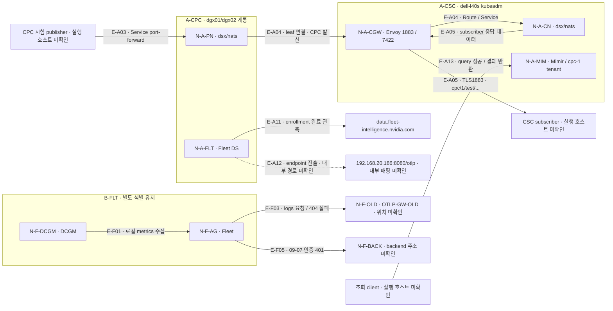
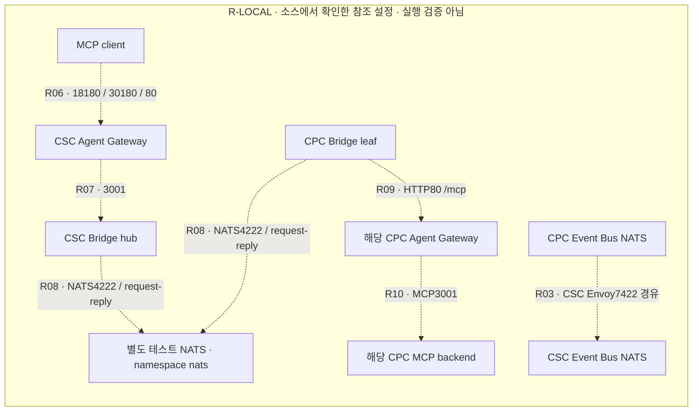

# DSX 통합 아키텍처 복원 기록

작성일: 2026-09-08 · 대상: 팀원 기록 3종 · 성격: **관측·설정·조사 기록의 통합본**

> **복원 결과:** 하나의 완성된 DSX 운영 시스템이 확인된 것은 아니다. 현재 증거는 ① 실제 메시지 전달이 검증된 CSC–CPC Event Bus, ② GPU 수집과 일부 저장·외부 전송 실패가 관측된 Fleet 계통, ③ Pod 배치만 확인된 Agent Gateway 실험 환경, ④ 연결 정의를 읽은 로컬 참조 소스로 나뉜다. 이들을 구분해 그리는 것이 현재 자료로 재구성할 수 있는 전체 아키텍처다.

원본 보존: 행 링크는 원본과 SHA-256이 동일한 근거 사본을 가리킨다. [원본 파일·해시 목록](<DSX_통합_근거_2026-09-08/source-manifest.json>)에서 작성 자료를 추적할 수 있다.

도식 편집 원본: [관측 데이터 흐름](<DSX_통합_근거_2026-09-08/관측_데이터_흐름.mmd>) · [참조 설정 구조](<DSX_통합_근거_2026-09-08/참조_설정_구조.mmd>)

## 1. 전체 시스템의 목적과 확인된 범위

### 1.1 목적과 범위

기록들이 공유하는 목적은 AI Factory의 GPU·호스트 상태를 수집하고, DSX Exchange로 시스템 간 이벤트를 전달하며, MCP 기반 접근 및 관측 저장·조회 경로를 이해·검증하는 것이다. Omniverse Digital Twin과 시설·전력 제어 연동은 조사·구상 범위이며, 운영 연동이 검증된 범위는 아니다. [O:39–61](<DSX_통합_근거_2026-09-08/sources/dsx-구성연동-기록_오수경.md?plain=1#L39>) [B:71–131](<DSX_통합_근거_2026-09-08/sources/DSX%20구성·연동%20기록-최보현.md?plain=1#L71>) [J:49–62](<DSX_통합_근거_2026-09-08/sources/DSX_구성_연동_기술기록_이주원.md?plain=1#L49>)

이번 통합에서는 **첨부된 세 Markdown 파일만 증거로 사용**했다. 파일 안의 인용 로그·조회 결과·설정과 작성자의 판정을 검토했으며, 클러스터에 새로 접속하거나 웹 문서를 다시 조회하지 않았다. 따라서 이 문서의 “실행 확인”은 **원본 기록에 보존된 실행 관측**을 뜻한다. 원시 로그·전체 manifest·대시보드 JSON 등은 이번에 별도 첨부되지 않아 원본 시스템과 다시 대조하지 못했다.

문서 안의 명령·권고·“추가 조치”는 분석 대상이다. 새 명령 실행이나 설정 변경 지시로 취급하지 않았다. 원문에서 증거보다 강하게 표현한 판정은 아래에서 제한을 명시했다.

### 1.2 출처와 시간 기준

| 출처 ID | 원본 파일 | 작성자·기간 | 주요 관측 기준 |
|---|---|---|---|
| O | [dsx-구성연동-기록_오수경.md](<DSX_통합_근거_2026-09-08/sources/dsx-구성연동-기록_오수경.md>) | 오수경. 2026-09-01~09-04 | 실제 CSC/CPC 조회, MQTT 전송, Fleet enrollment, Mimir 쿼리, Grafana 설치. 모든 항목의 개별 관측 시각이 보존된 것은 아님 |
| B | [DSX 구성·연동 기록-최보현.md](<DSX_통합_근거_2026-09-08/sources/DSX%20구성·연동%20기록-최보현.md>) | 최보현. 2026-08-29~09-08; 2026-04-16 주변 인프라 기록 일부 참고 | Exchange 배치 08-31; Fleet 로그 09-04·09-07·09-08 |
| J | [DSX_구성_연동_기술기록_이주원.md](<DSX_통합_근거_2026-09-08/sources/DSX_구성_연동_기술기록_이주원.md>) | 파일명상 이주원. 본문 작성자는 `[이름] — 미확인` 상태로 남아 있음 | 09-08 정적 검토. 소스 HEAD `cf933149bad9e0f96722ae2c4b013f4f91ec0570`; 원고 기준 08-21·편집 기록 08-24. 실제 클러스터 관측 없음 |

출처 표기는 `[O:258–278](<DSX_통합_근거_2026-09-08/sources/dsx-구성연동-기록_오수경.md?plain=1#L258>)`처럼 **원본 행 범위**를 뜻하며, 링크는 해당 시작 행으로 이동한다. 날짜를 따로 적지 않은 O의 실행 항목은 09-01~09-04 관측 범위, B의 Exchange 실행 항목은 08-31, J의 설정 검토는 09-08로 읽는다. 원문 시간대가 없는 시각은 임의로 UTC나 KST로 변환하지 않았다. [O:3–5](<DSX_통합_근거_2026-09-08/sources/dsx-구성연동-기록_오수경.md?plain=1#L3>) [B:3–14](<DSX_통합_근거_2026-09-08/sources/DSX%20구성·연동%20기록-최보현.md?plain=1#L3>) [J:3–6](<DSX_통합_근거_2026-09-08/sources/DSX_구성_연동_기술기록_이주원.md?plain=1#L3>)

주소는 O·J의 실제 표기를 유지했다. B의 `[OTLP-GW-OLD]`는 그대로 유지하며, O의 `192.168.20.186:8080`과 같다고 복원하지 않는다. 토큰·JWT 원문·비밀번호·개인키·kubeconfig 인증정보는 포함하지 않는다.

### 1.3 근거 수준

| 표시 | 의미 | 도식에서의 취급 |
|---|---|---|
| **실행-성공** | 구체적인 결과를 반환한 실행 기록 | 해당 기능·방향·시점에 한해 실선 |
| **실행-실패** | 요청·응답 또는 동작은 관측됐으나 기능 실패 | 실패 라벨을 붙인 선. 정상 연결과 구분 |
| **실행-존재** | Pod Running, Service, 프로세스·파일 존재 | 구성 상자는 표시 가능. 이것만으로 통신선 추가 불가 |
| **설정-실환경** | 실제 Helm computed values·리소스 설정을 확인한 기록 | 설정선. 통신 성공과 구분 |
| **설정-참조** | 소스·Chart·템플릿에 정의된 구조 | 별도 참조 도식에서만 사용 |
| **진술 / 설정안** | 사용자 진술 또는 적용 결과 없는 명령·JSON | 보조 표·계획 도식. 정상 운영선으로 사용 불가 |
| **문서 / 미확인** | 제품 설명 또는 연결을 판단할 증거 부족 | 개념 영역으로 분리하거나 연결선을 생략 |

### 1.4 환경 식별부 — 이 ID를 구성 요소 이름의 앞에 붙인다

아래는 **확정된 물리 클러스터 개수**가 아니라 서로 합치지 않고 보관하는 식별 단위다. 이후 동일 환경임을 증명하면 통합할 수 있다.

| 환경 ID | 확인된 위치·범위 | 근거와 병합 제한 |
|---|---|---|
| **A-CSC** | `dell-l40s`, `192.168.20.186`, 단일 노드 kubeadm. Event Bus Namespace `dsx` | O의 CSC 관측. 호스트 안의 Kind와 별도 Kubernetes 환경. [O:165–203](<DSX_통합_근거_2026-09-08/sources/dsx-구성연동-기록_오수경.md?plain=1#L165>) |
| **A-CPC** | O가 CPC로 지칭한 `vessl-k8s-master-01` 클러스터. GPU 노드 `dgx01` `.100`, `dgx02` `.101`; Event Bus `dsx`, Fleet `fleet-intelligence` | 실제 cluster UID/context 미확인. 들은 주소 `.171~174`와 관측 목록 불일치. 물리 CPC 번호를 메시지 접두어 `cpc/1`만으로 확정하지 않음. [O:191–252](<DSX_통합_근거_2026-09-08/sources/dsx-구성연동-기록_오수경.md?plain=1#L191>) |
| **K-OBS** | A-CSC 호스트의 Docker 컨테이너 `dsx-exchange-control-plane`; API `127.0.0.1:16443`, 호스트 `18180→30180` | Kind 노드 컨테이너 존재 확인. 내부 Namespace·배포 내용 미확인. [O:165–180](<DSX_통합_근거_2026-09-08/sources/dsx-구성연동-기록_오수경.md?plain=1#L165>) |
| **B-EX** | 08-31에 관측한 `csc-*`, `cpc-1-*`, `cpc-2-*` Namespace 집합 | 실제 cluster/context·호스트·Pod 노드 미확인. A-CSC/A-CPC 또는 K-OBS라고 단정하지 않음. [B:35–46](<DSX_통합_근거_2026-09-08/sources/DSX%20구성·연동%20기록-최보현.md?plain=1#L35>) [B:654–736](<DSX_통합_근거_2026-09-08/sources/DSX%20구성·연동%20기록-최보현.md?plain=1#L654>) |
| **B-FLT** | `fleet-intelligence` Namespace, `vessl-k8s-worker-01/02`에 Fleet Pod | B-EX와 동일 환경이라는 근거 없음. `dgx01/02`와의 대응·이름 변경 여부도 미확인. [B:129–131](<DSX_통합_근거_2026-09-08/sources/DSX%20구성·연동%20기록-최보현.md?plain=1#L129>) [B:523–533](<DSX_통합_근거_2026-09-08/sources/DSX%20구성·연동%20기록-최보현.md?plain=1#L523>) [B:740–799](<DSX_통합_근거_2026-09-08/sources/DSX%20구성·연동%20기록-최보현.md?plain=1#L740>) |
| **R-LOCAL** | J가 읽은 소스의 Kind `dsx-exchange`, control-plane 1개, 논리 사이트 3개 | 설정 사본. K-OBS와 이름·포트가 유사하고 B-EX와 Namespace가 유사하지만 배포 동일성은 미확인. [J:120–151](<DSX_통합_근거_2026-09-08/sources/DSX_구성_연동_기술기록_이주원.md?plain=1#L120>) |

**제품 식별에서 통합할 수 있는 부분:** O·B의 Fleet는 `dsx-ai-factory/fleet-intelligence-agent` 계열로 식별된다. Alloy는 O·B에서 **Grafana Alloy로 조사·검토한 대상**이다. 다만 제품 정체 확인은 설치 확인과 다르다. J의 “제품 식별 미확인”은 해당 자료 범위의 한계이므로, 팀 전체에서도 제품을 모른다는 뜻으로 유지할 필요는 없다. [O:88–105](<DSX_통합_근거_2026-09-08/sources/dsx-구성연동-기록_오수경.md?plain=1#L88>) [O:182–185](<DSX_통합_근거_2026-09-08/sources/dsx-구성연동-기록_오수경.md?plain=1#L182>) [B:446–451](<DSX_통합_근거_2026-09-08/sources/DSX%20구성·연동%20기록-최보현.md?plain=1#L446>) [B:561–583](<DSX_통합_근거_2026-09-08/sources/DSX%20구성·연동%20기록-최보현.md?plain=1#L561>) [J:114–114](<DSX_통합_근거_2026-09-08/sources/DSX_구성_연동_기술기록_이주원.md?plain=1#L114>)

## 2. 구성 요소별 역할과 실제 배치 위치

### 2.1 A-CSC / A-CPC: 실제 Event Bus와 관측 저장 구성

아래 `N-` ID는 7절 도식 목록에서도 동일하게 사용한다. 복수 항목은 논리 그룹이며 실제 Kubernetes 리소스 종류·개수와 구분한다.

| 구성 ID | 구성 요소·역할 | 실제 배치·버전·리소스 | 확인 범위·원본 근거 |
|---|---|---|---|
| **N-A-CN** | CSC DSX Event Bus / NATS | A-CSC `dsx`; StatefulSet `nats`, Pod `nats-0/1/2`; Service `nats` `4222/7422/1883`, `nats-headless`. 릴리스 `dsx`, Chart `nats-event-bus-0.2.0`, app `0.2.0`; 09-01 15:50 revision 4 | 메시징 기능 확인. Chart/appVersion을 NATS 서버 이미지 버전으로 치환하지 않음. [O:67–84](<DSX_통합_근거_2026-09-08/sources/dsx-구성연동-기록_오수경.md?plain=1#L67>) [O:205–219](<DSX_통합_근거_2026-09-08/sources/dsx-구성연동-기록_오수경.md?plain=1#L205>) |
| **N-A-PN** | CPC DSX Event Bus / NATS | A-CPC `dsx`, Pod `nats-0/1/2`, 릴리스 `dsx`의 computed values 기록. workload kind는 O 표가 혼합 표기 | 3개 Pod leaf 연결·CPC→CSC 전송 확인. 각 Pod 노드는 미확인. [O:231–236](<DSX_통합_근거_2026-09-08/sources/dsx-구성연동-기록_오수경.md?plain=1#L231>) [O:258–312](<DSX_통합_근거_2026-09-08/sources/dsx-구성연동-기록_오수경.md?plain=1#L258>) |
| **N-A-CA**, **N-A-PA** | 사이트별 Auth-callout / 인증·토픽 권한 | 각 `dsx`, `dsx-auth-callout`. CSC Deployment; Service `8000`, metrics `9090`. ConfigMap `auth-callout-permissions`, `dsx-auth-callout-config` | OAuth2·NKey 검증 기록. CSC 권한 출력 `mtls: {}`, `noauth: null`; mTLS 실행 성공을 추가하지 않음. [O:79–84](<DSX_통합_근거_2026-09-08/sources/dsx-구성연동-기록_오수경.md?plain=1#L79>) [O:205–215](<DSX_통합_근거_2026-09-08/sources/dsx-구성연동-기록_오수경.md?plain=1#L205>) [O:484–517](<DSX_통합_근거_2026-09-08/sources/dsx-구성연동-기록_오수경.md?plain=1#L484>) |
| **N-A-CNACK**, **N-A-PNACK** | NACK / JetStream 선언 관리 역할 | 각 `dsx/nack`; CSC Deployment. 실제 개별 이미지 버전 미확인 | CSC NACK NKey 인증 성공 관측. `$MQTT_*` 스트림 존재만으로 NACK가 그것을 생성했다고 단정하지 않음. [O:79–84](<DSX_통합_근거_2026-09-08/sources/dsx-구성연동-기록_오수경.md?plain=1#L79>) [O:209–215](<DSX_통합_근거_2026-09-08/sources/dsx-구성연동-기록_오수경.md?plain=1#L209>) [O:517–521](<DSX_통합_근거_2026-09-08/sources/dsx-구성연동-기록_오수경.md?plain=1#L517>) |
| **N-A-CSUR**, **N-A-PSUR** | Surveyor / NATS 지표 exporter | 각 `dsx/dsx-surveyor`, CSC Deployment·Service `7777` | 기동 확인. Prometheus scrape 실제 등록·성공 미확인. [O:79–84](<DSX_통합_근거_2026-09-08/sources/dsx-구성연동-기록_오수경.md?plain=1#L79>) [O:209–215](<DSX_통합_근거_2026-09-08/sources/dsx-구성연동-기록_오수경.md?plain=1#L209>) |
| **N-A-CGW** | CSC Envoy Event Bus 진입 | `csc-gateway/Gateway shared-gateway`, class `eg`, PROGRAMMED True. LB Service `envoy-csc-gateway-shared-gateway-e059d0eb`, Namespace `envoy-gateway-system`, IP `.186`, `1883/4222/7422`; `dsx`의 TCPRoute 3종 | 외부 MQTT TLS와 leaf 경유 확인. 제어 plane controller와 데이터 plane Service를 하나의 Pod로 표현하지 않음. [O:211–220](<DSX_통합_근거_2026-09-08/sources/dsx-구성연동-기록_오수경.md?plain=1#L211>) [O:258–295](<DSX_통합_근거_2026-09-08/sources/dsx-구성연동-기록_오수경.md?plain=1#L258>) |
| **N-A-PGW** | CPC Envoy Gateway | `dsx-envoy-gateway-system`, `envoy-cpc-1-gateway-shared-gateway-dd5d3866-*`와 `envoy-gateway-*` Pod가 `dgx01`에 관측 | 해당 노드 고정 설정 미확인. CPC 발행 시험은 Service port-forward였으므로 CPC 외부 Gateway를 검증한 시험이 아님. [O:235–236](<DSX_통합_근거_2026-09-08/sources/dsx-구성연동-기록_오수경.md?plain=1#L235>) [O:301–307](<DSX_통합_근거_2026-09-08/sources/dsx-구성연동-기록_오수경.md?plain=1#L301>) |
| **N-A-KC** | Keycloak / OAuth2 IdP | A-CSC `keycloak`, Pod `dsx-keycloak-0`, `keycloak-operator`, realm `dsx`; 정확한 StatefulSet 이름은 원문 혼용으로 미확인 | 토큰 발급 성공. 제품 버전 미확인. [O:128–135](<DSX_통합_근거_2026-09-08/sources/dsx-구성연동-기록_오수경.md?plain=1#L128>) [O:216–220](<DSX_통합_근거_2026-09-08/sources/dsx-구성연동-기록_오수경.md?plain=1#L216>) |
| **N-A-KGW** | Keycloak용 Envoy 진입 | LB `envoy-keycloak-keycloak-gateway-997ad362`, `.186`, `443:31263`; `keycloak-gateway`, hostname `dsxkeycloak.uclick.ai.kr`, routes from Same | Keycloak의 인증 진입 경로. Event Bus용 Gateway와 별도 객체. [O:217–220](<DSX_통합_근거_2026-09-08/sources/dsx-구성연동-기록_오수경.md?plain=1#L217>) [O:280–295](<DSX_통합_근거_2026-09-08/sources/dsx-구성연동-기록_오수경.md?plain=1#L280>) |
| **N-A-FLT** | Fleet Intelligence Agent / GPU·호스트 telemetry 생산자 | A-CPC `fleet-intelligence`, DaemonSet `fleet-intelligence-agent`, desired 2, `dgx01/02` 각 1개. Chart·image `1.5.0-rc.1`; image `ghcr.io/dsx-ai-factory/fleet-intelligence-agent:1.5.0-rc.1` | enrollment 완료·본 컨테이너 기동 기록. Exchange 자체 내장 모듈로 합치지 않음. [O:88–105](<DSX_통합_근거_2026-09-08/sources/dsx-구성연동-기록_오수경.md?plain=1#L88>) [O:233–250](<DSX_통합_근거_2026-09-08/sources/dsx-구성연동-기록_오수경.md?plain=1#L233>) [O:390–419](<DSX_통합_근거_2026-09-08/sources/dsx-구성연동-기록_오수경.md?plain=1#L390>) |
| **N-A-GPU1**, **N-A-GPU2** | GPU 노드·장비 | `dgx01` `.100`: A100-SXM4-80GB×8. `dgx02` `.101`: A100-SXM4-40GB×8 | Mimir GPU series 16개·UUID로 구분. 두 노드의 개별 driver/DCGM 버전을 동일하게 확장하지 않음. [O:193–201](<DSX_통합_근거_2026-09-08/sources/dsx-구성연동-기록_오수경.md?plain=1#L193>) [O:554–582](<DSX_통합_근거_2026-09-08/sources/dsx-구성연동-기록_오수경.md?plain=1#L554>) |
| **N-A-MIM** | Grafana Mimir / metrics 저장·쿼리 | A-CSC `mimir-test`, 릴리스 `mimir`, Chart `mimir-distributed-6.2.0`, app `3.2.0`, 09-04 15:20. `mimir-gateway` ClusterIP `10.36.172.150`, `80/8080` | Helm failed이지만 query 응답 성공. 전체 기능·장기 내구성 성공과 구분. [O:107–117](<DSX_통합_근거_2026-09-08/sources/dsx-구성연동-기록_오수경.md?plain=1#L107>) [O:221–227](<DSX_통합_근거_2026-09-08/sources/dsx-구성연동-기록_오수경.md?plain=1#L221>) [O:525–543](<DSX_통합_근거_2026-09-08/sources/dsx-구성연동-기록_오수경.md?plain=1#L525>) |
| **N-A-GRAF** | Grafana / 시각화 UI | A-CSC `monitoring`, Deployment·릴리스 `my-grafana`; Chart `13.2.0`, app `13.2.1`; image `grafana/grafana:13.2.1-distroless`; NodePort `31891` | 09-04 16:31 deployed, UI 접근. 데이터소스 저장·쿼리 성공·dashboard import 미확인. [O:119–126](<DSX_통합_근거_2026-09-08/sources/dsx-구성연동-기록_오수경.md?plain=1#L119>) [O:431–439](<DSX_통합_근거_2026-09-08/sources/dsx-구성연동-기록_오수경.md?plain=1#L431>) [O:595–599](<DSX_통합_근거_2026-09-08/sources/dsx-구성연동-기록_오수경.md?plain=1#L595>) |
| **N-A-TRI** | Trident / Mimir PVC 스토리지 | A-CSC `trident`; default StorageClass `ontap-nas-economy-sc`, provisioner `csi.trident.netapp.io` | Mimir PVC에 해당 SC 기록. CSI 서버·스토리지 장비 주소 미확인. [O:224–229](<DSX_통합_근거_2026-09-08/sources/dsx-구성연동-기록_오수경.md?plain=1#L224>) [O:431–437](<DSX_통합_근거_2026-09-08/sources/dsx-구성연동-기록_오수경.md?plain=1#L431>) |
| **N-A-RPROM** | Run:ai Prometheus / 별도 metrics 계통 | A-CPC 기존 계통. 특정 CR·Service 이름 및 Namespace는 인용 범위에서 미확인. retention `2h`, Run:ai remoteWrite 설정, 관측 대상 Prometheus에 Thanos sidecar 없음 | targets·metric 이름·rule 조회. Event Bus 입력으로 연결한 증거 없음. [O:603–630](<DSX_통합_근거_2026-09-08/sources/dsx-구성연동-기록_오수경.md?plain=1#L603>) |
| **N-A-LEGACY** | 기존 Run:ai·GPU Operator·monitoring 등 | A-CPC `runai`, `runai-backend`, `runai-rca`, `gpu-operator`, `monitoring`의 Prometheus/Thanos/Loki/MinIO, Knative·Dynamo 등 | 존재·AGE 기반 분류. Fleet→Loki, Prometheus→DSX, 자동 cordon 연결을 추가하지 않음. [O:30–35](<DSX_통합_근거_2026-09-08/sources/dsx-구성연동-기록_오수경.md?plain=1#L30>) [O:252–252](<DSX_통합_근거_2026-09-08/sources/dsx-구성연동-기록_오수경.md?plain=1#L252>) |

Fleet의 `nodeSelector: nvidia.com/gpu.deploy.dcgm=true`는 **조건에 맞는 노드 집합을 제한하는 정책**이다. 특정 두 노드명에 영구 고정했다는 뜻이 아니다. A-CPC에서는 DaemonSet spec까지 기록되며, B-FLT는 기본값과 실제 노드 라벨·배치가 일치한다는 증거까지다. [O:237–250](<DSX_통합_근거_2026-09-08/sources/dsx-구성연동-기록_오수경.md?plain=1#L237>) [B:512–533](<DSX_통합_근거_2026-09-08/sources/DSX%20구성·연동%20기록-최보현.md?plain=1#L512>)

A-CPC Fleet는 `hostPID: true`, privileged/root, `runtimeClassName: nvidia`, `/dev`, `/sys`, `/etc/machine-id`, `/var/lib/fleetint` 등의 hostPath를 사용한다. `/var/lib/fleetint`는 agent identity/state 위치로 기록되어 있다. 이 설정을 B-FLT의 미확인 전체 Pod spec에 복사하지 않는다. [O:103–105](<DSX_통합_근거_2026-09-08/sources/dsx-구성연동-기록_오수경.md?plain=1#L103>) [O:245–250](<DSX_통합_근거_2026-09-08/sources/dsx-구성연동-기록_오수경.md?plain=1#L245>) [B:49–56](<DSX_통합_근거_2026-09-08/sources/DSX%20구성·연동%20기록-최보현.md?plain=1#L49>)

Mimir는 distributor·ingester/store-gateway zone a/b/c·querier·query-frontend/scheduler·compactor·ruler·alertmanager·gateway·MinIO·Kafka 등으로 기록된다. zone 이름이 여러 개여도 A-CSC는 단일 노드로 기록되어 있으므로 물리 장애 도메인 분산을 뜻하지 않는다. PVC는 ingester/store-gateway/compactor 2Gi, alertmanager 1Gi, Kafka/MinIO 5Gi로 기록되며 장기 보존 기간은 확정되지 않았다. [O:117–117](<DSX_통합_근거_2026-09-08/sources/dsx-구성연동-기록_오수경.md?plain=1#L117>) [O:195–195](<DSX_통합_근거_2026-09-08/sources/dsx-구성연동-기록_오수경.md?plain=1#L195>) [O:221–227](<DSX_통합_근거_2026-09-08/sources/dsx-구성연동-기록_오수경.md?plain=1#L221>)

### 2.2 B-EX: 08-31에 확인한 Exchange 실험 환경

`s`는 `csc`, `cpc-1`, `cpc-2` 중 하나다. 아래 각 행은 사이트마다 **별도 구성 요소**다. 실제 workload kind·image·Helm version·배치 노드는 미확인이다. R-LOCAL의 Chart 값을 이 표의 실행 버전으로 채우지 않는다.

| 구성 ID | 구성 요소 | 관측 배치·역할의 한계 | 근거 |
|---|---|---|---|
| **N-B-{s}-GW** | DSX Agent Gateway | `{s}-dsx-agentgateway` Namespace. CSC·CPC-1 gateway Pod×3; CPC-2 동종 계열 확인. MCP routing은 제품 역할, 실제 요청 성공 미확인 | [B:160–205](<DSX_통합_근거_2026-09-08/sources/DSX%20구성·연동%20기록-최보현.md?plain=1#L160>) [B:672–709](<DSX_통합_근거_2026-09-08/sources/DSX%20구성·연동%20기록-최보현.md?plain=1#L672>) |
| **N-B-{s}-BR** | `dsx-agentgateway-bridge` | 동일 Namespace bridge Pod×2를 CSC·CPC-1에서 확인. CPC-2 동종 계열. 실제 NATS_URL·role·auth mode 미확인 | [B:174–186](<DSX_통합_근거_2026-09-08/sources/DSX%20구성·연동%20기록-최보현.md?plain=1#L174>) [B:209–231](<DSX_통합_근거_2026-09-08/sources/DSX%20구성·연동%20기록-최보현.md?plain=1#L209>) |
| **N-B-{s}-CTL** | Agent Gateway controller | 동일 Namespace에 Running. CSC·CPC-1 각 1개 명시 | [B:174–184](<DSX_통합_근거_2026-09-08/sources/DSX%20구성·연동%20기록-최보현.md?plain=1#L174>) [B:674–680](<DSX_통합_근거_2026-09-08/sources/DSX%20구성·연동%20기록-최보현.md?plain=1#L674>) |
| **N-B-{s}-RL** | Rate Limit Service | 동일 Namespace `*-ratelimit-*`, CSC·CPC-1 각 2개. 제한 정책 미확인 | [B:174–184](<DSX_통합_근거_2026-09-08/sources/DSX%20구성·연동%20기록-최보현.md?plain=1#L174>) [B:352–365](<DSX_통합_근거_2026-09-08/sources/DSX%20구성·연동%20기록-최보현.md?plain=1#L352>) |
| **N-B-{s}-VK** | Valkey | 동일 Namespace `*-valkey-0/1/2`. RLS의 상태 저장 backend라는 실설정은 미확인 | [B:352–365](<DSX_통합_근거_2026-09-08/sources/DSX%20구성·연동%20기록-최보현.md?plain=1#L352>) [B:674–680](<DSX_통합_근거_2026-09-08/sources/DSX%20구성·연동%20기록-최보현.md?plain=1#L674>) |
| **N-B-{s}-NATS** | Event Bus NATS | `{s}-event-bus`, `nats-0/1/2` Running. leaf 연결은 미확인 | [B:250–289](<DSX_통합_근거_2026-09-08/sources/DSX%20구성·연동%20기록-최보현.md?plain=1#L250>) [B:682–709](<DSX_통합_근거_2026-09-08/sources/DSX%20구성·연동%20기록-최보현.md?plain=1#L682>) |
| **N-B-{s}-MTLS** | NATS mTLS 계열 | `{s}-event-bus`, `nats-mtls-0` 계열 Running. mTLS 인증 시험 결과 없음 | [B:250–274](<DSX_통합_근거_2026-09-08/sources/DSX%20구성·연동%20기록-최보현.md?plain=1#L250>) |
| **N-B-{s}-AUTH** | Auth-callout | `{s}-event-bus`, `auth-callout-*` Running. 실제 JWT/JWKS/계정 정책 미확인 | [B:293–323](<DSX_통합_근거_2026-09-08/sources/DSX%20구성·연동%20기록-최보현.md?plain=1#L293>) |
| **N-B-{s}-NACK**, **N-B-{s}-SUR** | NACK / Surveyor | `{s}-event-bus`, `nack-*`, `nats-event-bus-*-surveyor-*` Running | [B:250–274](<DSX_통합_근거_2026-09-08/sources/DSX%20구성·연동%20기록-최보현.md?plain=1#L250>) [B:327–348](<DSX_통합_근거_2026-09-08/sources/DSX%20구성·연동%20기록-최보현.md?plain=1#L327>) |
| **N-B-{s}-MCPA**, **N-B-{s}-MCPB**, **N-B-{s}-SSE** | MCP backend / legacy SSE | `{s}-mcp-backends`, `mcp-backend-a-*`, `mcp-backend-b-*`, `legacy-sse-*`; CPC-1 backend-a×2 명시 | 실제 route·업무용 API 기능 미확인. [B:369–381](<DSX_통합_근거_2026-09-08/sources/DSX%20구성·연동%20기록-최보현.md?plain=1#L369>) [B:689–709](<DSX_통합_근거_2026-09-08/sources/DSX%20구성·연동%20기록-최보현.md?plain=1#L689>) |
| **N-B-EGW** | Envoy Gateway 계열 | `envoy-gateway-system`, 각 사이트 Envoy와 controller Running. LB 주소·Listener·Route 미확인 | [B:385–407](<DSX_통합_근거_2026-09-08/sources/DSX%20구성·연동%20기록-최보현.md?plain=1#L385>) |
| **N-B-IDP** | IdP 이름을 가진 workload 집합 | `idp`: `event-bus-*`, `human-oidc-*`, `service-oidc-*`, `svid-issuer-*`, `svid-wrong-key-*`, `unconfigured-issuer-*` | 이름만으로 제품·인증 관계 확정 불가. [B:411–426](<DSX_통합_근거_2026-09-08/sources/DSX%20구성·연동%20기록-최보현.md?plain=1#L411>) |
| **N-B-OTEL** | OTel Collector | `dsx-obs/otel-collector-6754b6b7bc-vq6dt` Running | distribution·receiver/exporter·실수신 미확인. [B:430–442](<DSX_통합_근거_2026-09-08/sources/DSX%20구성·연동%20기록-최보현.md?plain=1#L430>) |

CSC Service 조회에서는 `csc-dsx-agentgateway` NodePort `80→30180/TCP`, Bridge `3001/9464`, controller `9978/9093/9092`, RLS `8080/8081…`가 확인됐다. **외부 접속에 성공했다는 기록은 아니며**, 호스트 `18180`을 B-EX에 붙일 근거도 없다. [B:192–205](<DSX_통합_근거_2026-09-08/sources/DSX%20구성·연동%20기록-최보현.md?plain=1#L192>) [B:889–906](<DSX_통합_근거_2026-09-08/sources/DSX%20구성·연동%20기록-최보현.md?plain=1#L889>)

### 2.3 B-FLT: GPU 수집과 실패가 확인된 Fleet 환경

| 구성 ID | 구성 요소 | 위치·관측·역할 | 근거 |
|---|---|---|---|
| **N-F-AG** | Fleet Intelligence Agent | `fleet-intelligence`; 이전 Pod `6xsvp`→worker-02, `fw4mx`→worker-01. 09-07 로그 `279kg`, 09-08 enroll `kfstv`; 후자 두 Pod의 노드 미확인 | [B:740–778](<DSX_통합_근거_2026-09-08/sources/DSX%20구성·연동%20기록-최보현.md?plain=1#L740>) |
| **N-F-GPU** | GPU·driver·NVML | 관측한 Fleet 런타임에서 8 GPU·6 NVSwitch, driver `580.173.02`, Ampere. 두 노드 각각 동일 사양이라는 증거는 아님 | [B:455–510](<DSX_통합_근거_2026-09-08/sources/DSX%20구성·연동%20기록-최보현.md?plain=1#L455>) [B:797–799](<DSX_통합_근거_2026-09-08/sources/DSX%20구성·연동%20기록-최보현.md?plain=1#L797>) |
| **N-F-DCGM** | DCGM HostEngine | Fleet의 실제 GPU health/metrics 수집 backend; 관측 버전 `4.2.3`. Pod·Service·socket·포트 미확인 | [B:479–510](<DSX_통합_근거_2026-09-08/sources/DSX%20구성·연동%20기록-최보현.md?plain=1#L479>) [B:986–999](<DSX_통합_근거_2026-09-08/sources/DSX%20구성·연동%20기록-최보현.md?plain=1#L986>) |
| **N-F-KERNEL** | kernel message / XID·SXID 입력 | 일반 message skip 처리, 09-07 events 0·Healthy. 실제 장애 이벤트 전송 검증은 아님 | [B:1003–1020](<DSX_통합_근거_2026-09-08/sources/DSX%20구성·연동%20기록-최보현.md?plain=1#L1003>) |
| **N-F-ATTEST** | nvattest | binary 검출 성공. 09-04 code 608, device `0x20b2` unsupported, evidence 실패·exit 96 | [B:537–557](<DSX_통합_근거_2026-09-08/sources/DSX%20구성·연동%20기록-최보현.md?plain=1#L537>) |
| **N-F-OLD** | 기존 OTLP HTTP endpoint | 원본 가명 `[OTLP-GW-OLD]`, `/otlp`; 별도 절에서 `:8080` 표기. 서버 제품·배치·O의 Mimir와 동일성 미확인 | [B:1024–1067](<DSX_통합_근거_2026-09-08/sources/DSX%20구성·연동%20기록-최보현.md?plain=1#L1024>) [B:1238–1254](<DSX_통합_근거_2026-09-08/sources/DSX%20구성·연동%20기록-최보현.md?plain=1#L1238>) |
| **N-F-BACK** | Fleet inventory/attestation backend | 09-04 응답 필드 누락, 09-07 JWT expired/401. 실제 hostname·API path 미확인 | [B:1124–1148](<DSX_통합_근거_2026-09-08/sources/DSX%20구성·연동%20기록-최보현.md?plain=1#L1124>) |
| **N-F-ENROLL** | 09-08 enrollment 대상 | 원래 endpoint 미확인. `/signout`으로 향하는 redirect 거절 | 성공한 A-CPC enrollment endpoint로 대체하지 않음. [B:1150–1166](<DSX_통합_근거_2026-09-08/sources/DSX%20구성·연동%20기록-최보현.md?plain=1#L1150>) |
| **N-P-ALLOY**, **N-P-MIM**, **N-P-LOKI**, **N-P-GRAF** | Grafana Alloy·Mimir·Loki·Grafana의 검토 대상 | Alloy endpoint 설정안·Mimir/Loki dashboard 산출물 설명만 확인. 배포 위치·datasource import·실수신 미확인 | [B:561–648](<DSX_통합_근거_2026-09-08/sources/DSX%20구성·연동%20기록-최보현.md?plain=1#L561>) [B:1071–1120](<DSX_통합_근거_2026-09-08/sources/DSX%20구성·연동%20기록-최보현.md?plain=1#L1071>) [B:1390–1407](<DSX_통합_근거_2026-09-08/sources/DSX%20구성·연동%20기록-최보현.md?plain=1#L1390>) |

### 2.4 호스트 Docker·참조 코드·개념 구성의 분리

- **N-K-NODE:** K-OBS의 Kind 노드 컨테이너. R-LOCAL이 실제 이 컨테이너에 적용됐다는 증거는 없다. [O:178–180](<DSX_통합_근거_2026-09-08/sources/dsx-구성연동-기록_오수경.md?plain=1#L178>) [J:120–124](<DSX_통합_근거_2026-09-08/sources/DSX_구성_연동_기술기록_이주원.md?plain=1#L120>)
- **N-H-OMCP:** A-CSC 호스트 Docker의 `omni-ui-mcp:9901`, `kit-mcp:9902`, `usd-code-mcp:9903`, `isaacsim-mcp:9904`. **N-H-NIM:** 같은 호스트의 `mcp-embedder:8001`, `mcp-reranker:8002`. 존재·이미지 표시는 확인되지만 상호 호출·Agent Gateway 등록·Omniverse 본체 접속은 미확인이다. NIM 모델 이미지명은 O 원문에 보존되어 있다. [O:163–176](<DSX_통합_근거_2026-09-08/sources/dsx-구성연동-기록_오수경.md?plain=1#L163>)
- **R-LOCAL:** Event Bus Chart `0.2.0`, Agent Gateway Chart `0.3.0`, upstream agentgateway Chart `v1.4.1`, Event Bus NATS Chart `2.12.6`, 별도 Bridge 테스트 NATS Chart `2.14.2`, Valkey Chart `0.9.4`/image `9.0.2` 등은 **소스 설정 버전**이다. 적용된 실행 버전으로 다른 환경에 전파하지 않는다. [J:70–93](<DSX_통합_근거_2026-09-08/sources/DSX_구성_연동_기술기록_이주원.md?plain=1#L70>)
- **개념 목록:** DSX Sim/Air·OS·MaxLPS/Flex, Omniverse/OpenUSD·PhysicsNeMo/CFD, NVSentinel·MongoDB/PostgreSQL, BMS/EPMS/DCIM, 시설·전력 제어는 해당 연결의 설치·실행을 확인하지 못했다. O가 별도로 관측한 GPU Operator·Run:ai·Dynamo 존재 사실까지 부정하는 것은 아니다. [O:137–161](<DSX_통합_근거_2026-09-08/sources/dsx-구성연동-기록_오수경.md?plain=1#L137>) [O:252–252](<DSX_통합_근거_2026-09-08/sources/dsx-구성연동-기록_오수경.md?plain=1#L252>) [J:95–114](<DSX_통합_근거_2026-09-08/sources/DSX_구성_연동_기술기록_이주원.md?plain=1#L95>)

## 3. 구성 요소 간 연결 관계 표

화살표는 표에 적은 **연결 시작 또는 데이터의 주방향**이다. 응답·반대 방향 데이터는 별도 설명한다. `localhost`·Pod-local API 읽기는 서로 다른 네트워크 공간일 수 있으므로 주소를 임의로 같게 보지 않는다.

### 3.1 A-CSC / A-CPC: 실행·설정·진술을 구분한 연결

| 연결 ID | 출발 → 도착 / 시작 주체 | 목적·데이터 방향·경유 경로 | 확인 상태·설정 근거·한계 |
|---|---|---|---|
| **E-A01** | 시험 클라이언트 → N-A-KGW → N-A-KC; client 시작 | client_credentials 토큰 요청·JWT 응답. HTTPS `dsxkeycloak.uclick.ai.kr/realms/dsx/protocol/openid-connect/token`; LB `443` | **실행-성공** 토큰 발급. client `mqtt-client`, realm `dsx`. secret 제외. [O:217–220](<DSX_통합_근거_2026-09-08/sources/dsx-구성연동-기록_오수경.md?plain=1#L217>) [O:280–295](<DSX_통합_근거_2026-09-08/sources/dsx-구성연동-기록_오수경.md?plain=1#L280>) |
| **E-A02** | 시험 MQTT client → N-A-CGW → N-A-CN; client 시작 | MQTT 3.1.1/TLS `dsxcsc.uclick.ai.kr:1883`→Envoy TLS 종단→TCPRoute `nats-mqtt`→Service `nats`. publish와 subscribe를 위해 각각 접속 | **실행-성공** CSC `test/topic`, payload 21B 수신. MQTT username `oauthtoken`, JWT 인증. [O:280–295](<DSX_통합_근거_2026-09-08/sources/dsx-구성연동-기록_오수경.md?plain=1#L280>) |
| **E-A03** | CPC 시험 publisher → N-A-PN; publisher 시작 | `127.0.0.1:1884`→`kubectl -n dsx port-forward svc/nats 1884:1883`; `test/cpc2csc/ping` 발행 | **실행-성공** 시험 입력 구간. CPC 외부 Envoy를 통과한 경로로 그리지 않음. [O:301–307](<DSX_통합_근거_2026-09-08/sources/dsx-구성연동-기록_오수경.md?plain=1#L301>) |
| **E-A04** | N-A-PN → N-A-CGW → N-A-CN; CPC 시작 | NATS leaf `tls://dsxcsc.uclick.ai.kr:7422`, Route `nats-leafnode`, Service `nats:7422`. 계정 `CSC`; 통신은 양방향 가능 | **실행-성공** 3개 CPC Pod 연결 보고·leafz/varz·nats-2 로그. 실제 응용 payload 성공은 다음 E-A05의 CPC→CSC 방향만 입증. [O:258–278](<DSX_통합_근거_2026-09-08/sources/dsx-구성연동-기록_오수경.md?plain=1#L258>) |
| **E-A05** | N-A-PN → N-A-CN → CSC subscriber; subscriber의 접속은 반대 방향 | 데이터 `test/cpc2csc/ping`→`cpc/1/test/cpc2csc/ping`; `federation test`, QoS 0, 15B 수신. E-A03·04·02 경유 | **실행-성공**, 기능 연결선. E-A04와 별도 물리 회선이 아님. `cpcExports=[test.cpc2csc.>]`. [O:297–312](<DSX_통합_근거_2026-09-08/sources/dsx-구성연동-기록_오수경.md?plain=1#L297>) [O:454–468](<DSX_통합_근거_2026-09-08/sources/dsx-구성연동-기록_오수경.md?plain=1#L454>) |
| **E-A06** | N-A-CN → N-A-PN; publisher 미관측 | `test.broadcast.>` 및 prefixed `test.csc2cpc.>`를 CSC→CPC 전달하도록 설정 | **설정-실환경**, 역방향 메시지 시험 결과 없음. E-A05 성공으로 승격 금지. [O:454–468](<DSX_통합_근거_2026-09-08/sources/dsx-구성연동-기록_오수경.md?plain=1#L454>) |
| **E-A07** | 사이트 NATS ↔ 사이트 Auth-callout | 인증 요청·계정/pub-sub 권한 반환. RPC의 정확한 topic·socket은 O 실설정에 충분히 보존되지 않음 | **실행-성공/설정** OAuth2·NKey 인증 기록, `auth-callout-permissions/permissions.json`. O에서 확인하지 않은 J의 모든 내부 경로를 이식하지 않음. [O:79–84](<DSX_통합_근거_2026-09-08/sources/dsx-구성연동-기록_오수경.md?plain=1#L79>) [O:284–295](<DSX_통합_근거_2026-09-08/sources/dsx-구성연동-기록_오수경.md?plain=1#L284>) [O:484–517](<DSX_통합_근거_2026-09-08/sources/dsx-구성연동-기록_오수경.md?plain=1#L484>) |
| **E-A08** | Auth-callout → Keycloak JWKS | JWT 키 조회라는 제품상의 관계; 키 데이터는 Keycloak→Auth-callout | **문서·부분** OAuth 인증 전 구간 성공과 구분. 정확한 실환경 JWKS URL·fetch 로그 미확인. token endpoint를 JWKS endpoint로 대체하지 않음. [O:128–135](<DSX_통합_근거_2026-09-08/sources/dsx-구성연동-기록_오수경.md?plain=1#L128>) [O:280–295](<DSX_통합_근거_2026-09-08/sources/dsx-구성연동-기록_오수경.md?plain=1#L280>) [B:973–982](<DSX_통합_근거_2026-09-08/sources/DSX%20구성·연동%20기록-최보현.md?plain=1#L973>) |
| **E-A09** | N-A-CNACK → N-A-CN / 인증 처리 N-A-CA | NACK 제어 접속·NKey 인증; 원문 계정 `nack-controller` | **실행-성공** 20~30초 주기 인증 성공 로그. stream CRUD 성공은 별도 미확인. [O:484–517](<DSX_통합_근거_2026-09-08/sources/dsx-구성연동-기록_오수경.md?plain=1#L484>) |
| **E-A10** | N-A-CSUR → N-A-CN | SYS 계정 관측이 의도된 구조; CSC Surveyor `:7777` exporter 존재 | **설정·부분** 계정·기동 확인. 실제 exporter 결과·scrape 성공 미확인. CPC 측 상세 연결을 CSC 증거만으로 확정하지 않음. [O:79–84](<DSX_통합_근거_2026-09-08/sources/dsx-구성연동-기록_오수경.md?plain=1#L79>) [O:486–506](<DSX_통합_근거_2026-09-08/sources/dsx-구성연동-기록_오수경.md?plain=1#L486>) |
| **E-A11** | N-A-FLT의 enroll → `https://data.fleet-intelligence.nvidia.com`; agent 시작 | 외부 HTTPS enrollment 요청·등록 결과. Helm `enroll.endpoint`, token Secret 참조 | **실행-성공** endpoint 변경 후 init Completed/exit 0, 본 컨테이너 기동. inventory·attestation 정상화까지 의미하지 않음. [O:330–352](<DSX_통합_근거_2026-09-08/sources/dsx-구성연동-기록_오수경.md?plain=1#L330>) [O:390–419](<DSX_통합_근거_2026-09-08/sources/dsx-구성연동-기록_오수경.md?plain=1#L390>) |
| **E-A12** | N-A-FLT → 원문 지목 OTLP endpoint `http://192.168.20.186:8080/otlp` | OTLP HTTP metrics 전달 의도, tenant `cpc-1`; `FLEETINT_COLLECTOR_ENDPOINT` 사용자 진술 | **진술+수신측 부분 증거** Mimir 데이터는 확인됐지만 env 출력·외부8080→ClusterIP 내부 경로 미확인. 중간 Gateway/Collector를 추가하지 않음. [O:354–365](<DSX_통합_근거_2026-09-08/sources/dsx-구성연동-기록_오수경.md?plain=1#L354>) [O:221–222](<DSX_통합_근거_2026-09-08/sources/dsx-구성연동-기록_오수경.md?plain=1#L221>) |
| **E-A13** | 조회 client → N-A-MIM; 조회 client 시작 | port-forward `127.0.0.1:18080`; `X-Scope-OrgID: cpc-1`, `/prometheus/api/v1/query?query=fleetint_agent_up`; 시계열은 Mimir→client | **실행-성공** 값 1, GPU series 16개 등. 수신·조회 성공이며 E-A12의 전체 전송 경로 증명은 아님. [O:536–584](<DSX_통합_근거_2026-09-08/sources/dsx-구성연동-기록_오수경.md?plain=1#L536>) |
| **E-A14** | 사용자 브라우저 → N-A-GRAF | HTTP `192.168.20.186:31891`; UI 응답 | **실행-성공** UI 접근. Mimir datasource 성공과 분리. [O:595–599](<DSX_통합_근거_2026-09-08/sources/dsx-구성연동-기록_오수경.md?plain=1#L595>) |
| **E-A15** | N-A-GRAF → N-A-MIM | 입력 화면의 `http://mimir-gateway.mimir-test.svc.cluster.local/prom...`; Grafana가 query 시작하고 metrics 응답을 받는 의도 | **설정안/UI 입력만** 저장·tenant header·정확한 최종 URL·query 성공 미확인. [O:595–599](<DSX_통합_근거_2026-09-08/sources/dsx-구성연동-기록_오수경.md?plain=1#L595>) |
| **E-A16** | N-A-CA → Pod-local `127.0.0.1:4317` | OTLP trace export 시도 | **실행-실패** `connect: connection refused`. Collector 존재를 만들어 넣지 않음. [O:517–517](<DSX_통합_근거_2026-09-08/sources/dsx-구성연동-기록_오수경.md?plain=1#L517>) |
| **E-A17** | N-A-FLT → inventory/attestation 처리 대상 | inventory upsert 응답 `nodeGroup` 누락 반복; attestation payload validation 경고 | **실행-실패/경고** endpoint·개별 요청 성공 범위 미확인. enrollment 성공과 양립 가능. [O:644–659](<DSX_통합_근거_2026-09-08/sources/dsx-구성연동-기록_오수경.md?plain=1#L644>) |
| **E-A18** | N-A-RPROM → Run:ai backend | remoteWrite 설정; metrics는 Prometheus→backend | **설정-실환경** `retention:2h`, remoteWrite `name:runai`, TLS/인증 참조. 원문에 최종 URL·수신 로그 미보존. DSX 연결 아님. [O:603–630](<DSX_통합_근거_2026-09-08/sources/dsx-구성연동-기록_오수경.md?plain=1#L603>) |

### 3.2 B-FLT: 성공한 로컬 수집과 실패한 export/auth

| 연결 ID | 출발 → 도착 / 시작 주체 | 데이터·프로토콜·경로 | 확인 상태·시점·근거 |
|---|---|---|---|
| **E-F01** | N-F-AG → N-F-DCGM; Fleet 조회 시작 | health/metrics 데이터는 DCGM→Fleet. clock·power·thermal·NVLink 등. IPC/네트워크 방식·포트는 미확인 | **실행-성공** 09-04/07 수집. 09-07 480 metrics·24 component data는 로컬 수집량. [B:986–999](<DSX_통합_근거_2026-09-08/sources/DSX%20구성·연동%20기록-최보현.md?plain=1#L986>) [B:1512–1526](<DSX_통합_근거_2026-09-08/sources/DSX%20구성·연동%20기록-최보현.md?plain=1#L1512>) |
| **E-F02** | N-F-KERNEL → Fleet watcher; watcher가 읽음 | kernel message·XID/SXID 분류. 네트워크 통신선 아님 | **실행-성공(분류만)** 09-04 skip 로그, 09-07 events 0. 장애 이벤트 end-to-end 시험 미확인. [B:1003–1020](<DSX_통합_근거_2026-09-08/sources/DSX%20구성·연동%20기록-최보현.md?plain=1#L1003>) |
| **E-F03** | N-F-AG → N-F-OLD; Fleet export 시작 | HTTP OTLP `http://[OTLP-GW-OLD]/otlp/v1/logs`, 원문 별도 절의 포트 `8080` | **실행-실패** 09-04/07 HTTP 404, retry 3회 후 Export failed. HTTP 응답은 확인됐으나 어느 서버가 반환했는지·logs 저장 성공은 미확인. [B:1024–1067](<DSX_통합_근거_2026-09-08/sources/DSX%20구성·연동%20기록-최보현.md?plain=1#L1024>) [B:1238–1254](<DSX_통합_근거_2026-09-08/sources/DSX%20구성·연동%20기록-최보현.md?plain=1#L1238>) |
| **E-F04** | N-F-AG → N-F-BACK | inventory upsert 요청·응답 | **실행-실패** 09-04 `nodeGroup` 응답 필드 누락. API hostname/path 미확인. [B:1124–1135](<DSX_통합_근거_2026-09-08/sources/DSX%20구성·연동%20기록-최보현.md?plain=1#L1124>) |
| **E-F05** | N-F-AG → N-F-BACK | inventory·attestation 요청, JWT 인증 | **실행-실패** 09-07 `401 Unauthorized`, `JWT assertion is expired`. 로컬 metrics 수집 실패를 뜻하지 않음. [B:1137–1148](<DSX_통합_근거_2026-09-08/sources/DSX%20구성·연동%20기록-최보현.md?plain=1#L1137>) [B:1411–1434](<DSX_통합_근거_2026-09-08/sources/DSX%20구성·연동%20기록-최보현.md?plain=1#L1411>) |
| **E-F06** | N-F-AG → N-F-ATTEST; 로컬 도구 실행 | GPU evidence 수집·반환 | **실행-실패** 09-04 code608·exit96. 09-08 binary 검출만 성공. [B:537–557](<DSX_통합_근거_2026-09-08/sources/DSX%20구성·연동%20기록-최보현.md?plain=1#L537>) |
| **E-F07** | N-F-AG의 09-08 enroll → N-F-ENROLL | HTTPS backend 요청 과정에서 `https://ngc.nvidia.com/signout` redirect 거절 | **실행-실패** Pod `kfstv`. 원래 endpoint 미확인. A-CPC의 수정 완료를 적용하지 않음. [B:765–770](<DSX_통합_근거_2026-09-08/sources/DSX%20구성·연동%20기록-최보현.md?plain=1#L765>) [B:1150–1166](<DSX_통합_근거_2026-09-08/sources/DSX%20구성·연동%20기록-최보현.md?plain=1#L1150>) |
| **E-F08** | N-F-AG → N-P-ALLOY | `env.FLEETINT_COLLECTOR_ENDPOINT=http://alloy.alloy.svc.cluster.local:4318/otlp`, `otelGateway.enabled=false` | **설정안** 적용 결과 없음. 09-07 관측 프로세스는 여전히 OLD 사용. receiver의 `/otlp` prefix 수용 여부도 미확인. [B:1071–1099](<DSX_통합_근거_2026-09-08/sources/DSX%20구성·연동%20기록-최보현.md?plain=1#L1071>) |
| **E-F09**, **E-F10** | N-P-ALLOY → N-P-MIM / N-P-LOKI | metrics / logs·events 전달 의도 | **설정안·산출물 방향** 실제 exporter·destination·ingestion 미확인. [B:1103–1120](<DSX_통합_근거_2026-09-08/sources/DSX%20구성·연동%20기록-최보현.md?plain=1#L1103>) |
| **E-F11**, **E-F12** | N-P-GRAF → N-P-MIM / N-P-LOKI | PromQL / LogQL query 의도. 응답 데이터는 저장소→Grafana | **산출물만** dashboard JSON 작성 기록. import·datasource·query 실행 미확인. [B:587–648](<DSX_통합_근거_2026-09-08/sources/DSX%20구성·연동%20기록-최보현.md?plain=1#L587>) [B:1390–1407](<DSX_통합_근거_2026-09-08/sources/DSX%20구성·연동%20기록-최보현.md?plain=1#L1390>) |

### 3.3 B-EX의 연결과 R-LOCAL의 연결은 서로 대신 증명하지 않는다

| 연결 ID | 관계 | B-EX에서 확인한 것 | 한계·원본 |
|---|---|---|---|
| **E-B01** | 외부 MCP client→CSC Gateway | NodePort `30180`, Service `80` 존재 | `/mcp`는 제품 경로. 실제 호출·인증 성공 없음. [B:889–906](<DSX_통합_근거_2026-09-08/sources/DSX%20구성·연동%20기록-최보현.md?plain=1#L889>) |
| **U-B01(s)** | 사이트 Gateway→특정 local MCP backend | 양쪽 Pod 존재, 제품 역할 | 실route·endpoint·호출 미확인. **현재 연결선 목록에서 보류**. [B:910–919](<DSX_통합_근거_2026-09-08/sources/DSX%20구성·연동%20기록-최보현.md?plain=1#L910>) |
| **U-B02(s)** | 사이트 Bridge→어떤 NATS | Bridge와 Event Bus Pod 존재 | 실제 `NATS_URL` 없음. CSC Event Bus인지 별도 테스트 NATS인지 목적지조차 확정 불가. [B:209–231](<DSX_통합_근거_2026-09-08/sources/DSX%20구성·연동%20기록-최보현.md?plain=1#L209>) [B:923–936](<DSX_통합_근거_2026-09-08/sources/DSX%20구성·연동%20기록-최보현.md?plain=1#L923>) |
| **U-B03(p)** | CPC NATS→CSC NATS | 양쪽 Pod·Envoy 존재 | active leaf·실endpoint 미확인. A-CPC의 성공 기록을 복사하지 않음. [B:940–953](<DSX_통합_근거_2026-09-08/sources/DSX%20구성·연동%20기록-최보현.md?plain=1#L940>) |
| **U-B04(s)** | NATS↔Auth-callout | 양쪽 Pod 존재 | 사용 auth profile·RPC·권한 미확인. [B:957–969](<DSX_통합_근거_2026-09-08/sources/DSX%20구성·연동%20기록-최보현.md?plain=1#L957>) |
| **U-B05** | Auth-callout→관측 IdP workload | 양쪽 Pod 존재 | issuer·JWKS 대상 매핑 미확인. [B:973–982](<DSX_통합_근거_2026-09-08/sources/DSX%20구성·연동%20기록-최보현.md?plain=1#L973>) |
| **U-B06(s)** | RLS→Valkey | 같은 Namespace의 Running Pod | 실설정·접속 미확인. [B:352–365](<DSX_통합_근거_2026-09-08/sources/DSX%20구성·연동%20기록-최보현.md?plain=1#L352>) |
| **U-B07** | 애플리케이션→`dsx-obs` Collector | 애플리케이션과 Collector 존재 | receiver/exporter·trace 수신 미확인. [B:430–442](<DSX_통합_근거_2026-09-08/sources/DSX%20구성·연동%20기록-최보현.md?plain=1#L430>) |

R-LOCAL에서만 확인한 설정 연결은 7.3절에 별도 등록한다. 특히 R-LOCAL Bridge는 `nats` Namespace의 **별도 테스트 NATS**를 사용한다. 이를 B-EX의 실연결로 채택할 수도, 반대로 B-EX 개념도를 근거로 R-LOCAL Bridge를 사이트 Event Bus에 연결할 수도 없다. [J:190–190](<DSX_통합_근거_2026-09-08/sources/DSX_구성_연동_기술기록_이주원.md?plain=1#L190>) [J:249–256](<DSX_통합_근거_2026-09-08/sources/DSX_구성_연동_기술기록_이주원.md?plain=1#L249>)

## 4. 데이터 흐름과 설정·제어 흐름

### 4.1 실행 결과가 있는 데이터 흐름

**Event Bus 시험:** A-CPC의 시험 publisher가 port-forward로 CPC `nats`에 발행 → CPC가 시작한 leaf 연결을 통해 CSC Envoy `7422` 경유 → CSC `nats` → 정확한 토픽을 구독한 CSC client에 payload 도착. 확인된 데이터는 시험 문자열이며 GPU telemetry나 시설 제어 명령은 아니다. [O:258–312](<DSX_통합_근거_2026-09-08/sources/dsx-구성연동-기록_오수경.md?plain=1#L258>)

**GPU 관측:** B-FLT에서 DCGM·kernel 데이터를 Fleet가 수집한 것은 확인됐다. logs export는 OLD endpoint에서 404로 실패했다. A-CSC Mimir에서는 Fleet 계열 metrics가 조회됐지만, B-FLT와 동일 생산자인지, 어떤 외부8080 경로가 Mimir에 전달했는지는 확인하지 못했다. **로컬 수집 성공, 저장소 조회 성공, 전송 경로 성공을 각각 별개 사실로 유지한다.** [B:986–1067](<DSX_통합_근거_2026-09-08/sources/DSX%20구성·연동%20기록-최보현.md?plain=1#L986>) [O:354–365](<DSX_통합_근거_2026-09-08/sources/dsx-구성연동-기록_오수경.md?plain=1#L354>) [O:536–584](<DSX_통합_근거_2026-09-08/sources/dsx-구성연동-기록_오수경.md?plain=1#L536>)

**요약 도식:** 상자·선은 대표 논리 단위이며 리소스 개수나 새 중간 서버를 뜻하지 않는다. 괄호의 ID는 3절 근거를 가리킨다. 점선은 진술만 있는 경로이며 실패선에는 실패를 명시했다.

도식에서 **A의 OTLP endpoint와 Mimir 사이, A와 B Fleet 사이, Fleet와 Event Bus 사이에는 선을 그리지 않았다.** 내부 경로 또는 동일성 증거가 없기 때문이다. B-EX는 배치 상자는 그릴 수 있으나 통신선 대부분이 U-B 항목이므로 이 실행 흐름 도식에서 제외했다.

### 4.2 인증·설정·제어 흐름

- **MQTT 인증:** 시험 client가 Keycloak 토큰을 발급받고 MQTT 접속에 제시한다. Auth-callout/NATS가 계정·pub/sub 허용을 처리한다. 토큰 발급 성공과 실제 ACL 범위는 테스트 계열에 한정되며, 임의 telemetry 토픽 권한은 증명되지 않았다. [O:280–295](<DSX_통합_근거_2026-09-08/sources/dsx-구성연동-기록_오수경.md?plain=1#L280>) [O:484–515](<DSX_통합_근거_2026-09-08/sources/dsx-구성연동-기록_오수경.md?plain=1#L484>)
- **배포 제어:** A-CPC에서 `enroll.endpoint` 변경과 log level 변경이 적용됐다는 기록이 있다. B-FLT의 Alloy·nodeGroup·listenAddress 명령은 **설정안**이며 적용 결과가 없다. 설정안과 과거 실제 상태를 한 개 “현재 values”로 합치지 않는다. [O:390–419](<DSX_통합_근거_2026-09-08/sources/dsx-구성연동-기록_오수경.md?plain=1#L390>) [B:1258–1368](<DSX_통합_근거_2026-09-08/sources/DSX%20구성·연동%20기록-최보현.md?plain=1#L1258>)
- **버스 제어:** NACK는 JetStream 제어 역할이며 인증 성공은 확인됐다. 관측된 내장 스트림이 NACK의 생성 동작 때문인지까지는 미확인이다. [O:79–84](<DSX_통합_근거_2026-09-08/sources/dsx-구성연동-기록_오수경.md?plain=1#L79>) [O:517–521](<DSX_통합_근거_2026-09-08/sources/dsx-구성연동-기록_오수경.md?plain=1#L517>)
- **Fleet backend 제어·인증:** enrollment 완료, inventory upsert 성공, attestation evidence 성공, metrics/logs 저장은 각각 별도 결과다. 하나가 성공했다고 다른 것을 성공으로 채우지 않는다. [O:417–419](<DSX_통합_근거_2026-09-08/sources/dsx-구성연동-기록_오수경.md?plain=1#L417>) [O:644–659](<DSX_통합_근거_2026-09-08/sources/dsx-구성연동-기록_오수경.md?plain=1#L644>) [B:537–557](<DSX_통합_근거_2026-09-08/sources/DSX%20구성·연동%20기록-최보현.md?plain=1#L537>) [B:1124–1166](<DSX_통합_근거_2026-09-08/sources/DSX%20구성·연동%20기록-최보현.md?plain=1#L1124>)
- **노드·설비 제어:** `action: cordon` 알림 라벨과 자동 cordon 실행은 다르다. 기록에는 DSX 메시지를 소비해 실제 노드·워크로드·전력·냉각 장치를 제어한 성공 결과가 없다. [O:621–630](<DSX_통합_근거_2026-09-08/sources/dsx-구성연동-기록_오수경.md?plain=1#L621>) [J:338–346](<DSX_통합_근거_2026-09-08/sources/DSX_구성_연동_기술기록_이주원.md?plain=1#L338>)
- **소스 배포 의존성:** R-LOCAL의 Skaffold→Chart·CRD·Secret·IdP·관측 의존 관계는 통신선이 아니다. 실제 클러스터에 적용된 배포 이력으로 승격하지 않는다. [J:330–336](<DSX_통합_근거_2026-09-08/sources/DSX_구성_연동_기술기록_이주원.md?plain=1#L330>)

### 4.3 개념·설정안만 있는 흐름 — 현재 운영 도식과 분리

| 개념/계획 | 기록상 제시된 흐름 | 확인 한계·근거 |
|---|---|---|
| Fleet 관측 전환 | Fleet→Grafana Alloy→Mimir(metrics)/Loki(logs)→Grafana 조회 | Alloy 실제 배포·exporter·OTLP prefix·저장·import 미확인. Grafana는 저장소에 query를 시작하는 방향으로 그려야 함. [B:1071–1120](<DSX_통합_근거_2026-09-08/sources/DSX%20구성·연동%20기록-최보현.md?plain=1#L1071>) [B:1390–1407](<DSX_통합_근거_2026-09-08/sources/DSX%20구성·연동%20기록-최보현.md?plain=1#L1390>) |
| DSX 입력 확장 | Alertmanager webhook→MQTT 발행 또는 Fleet 데이터→DSX | 제안 단계. 새 adapter·bridge를 현재 구성으로 추가하지 않음. [O:376–383](<DSX_통합_근거_2026-09-08/sources/dsx-구성연동-기록_오수경.md?plain=1#L376>) [O:621–630](<DSX_통합_근거_2026-09-08/sources/dsx-구성연동-기록_오수경.md?plain=1#L621>) |
| NVSentinel | Health Monitor→Platform Connector→datastore·node condition→조치 모듈 | O의 문서 조사. 클러스터 배포·연결 미확인. MongoDB와 PostgreSQL 중 실제 선택 없음. [O:137–161](<DSX_통합_근거_2026-09-08/sources/dsx-구성연동-기록_오수경.md?plain=1#L137>) |
| 운영 Digital Twin | telemetry·asset ID→Omniverse/OpenUSD 운영 화면 | MCP 컨테이너 존재는 본체 위치나 데이터 연결 성공을 뜻하지 않음. [O:163–176](<DSX_통합_근거_2026-09-08/sources/dsx-구성연동-기록_오수경.md?plain=1#L163>) [J:338–346](<DSX_통합_근거_2026-09-08/sources/DSX_구성_연동_기술기록_이주원.md?plain=1#L338>) |
| 사전 검증 | CFD→학습 데이터→PhysicsNeMo Surrogate→추론 API→시각화 | 원고의 개념 흐름. 실제 모델·dataset·API 배포 미확인. [J:95–112](<DSX_통합_근거_2026-09-08/sources/DSX_구성_연동_기술기록_이주원.md?plain=1#L95>) [J:340–344](<DSX_통합_근거_2026-09-08/sources/DSX_구성_연동_기술기록_이주원.md?plain=1#L340>) |

## 5. 실제 검증 범위 및 실패·미확인 구간

### 5.1 기능별 판정

| 환경·기능 | 확보된 결과 | 아직 확정하면 안 되는 내용 | 근거 |
|---|---|---|---|
| A-CSC↔A-CPC leaf 연결 | CPC 3개 NATS Pod의 세션 존재·로그 | 두 방향의 모든 topic 전달, failover·HA | [O:258–278](<DSX_통합_근거_2026-09-08/sources/dsx-구성연동-기록_오수경.md?plain=1#L258>) |
| A-CPC→A-CSC 시험 메시지 | `federation test`, 15B, QoS0, `cpc/1/` 접두어 | GPU/BMS 실측 데이터, QoS1/2 전달·보존, 역방향 제어 | [O:297–312](<DSX_통합_근거_2026-09-08/sources/dsx-구성연동-기록_오수경.md?plain=1#L297>) |
| A-CSC MQTT 인증 | Keycloak 발급·정확한 topic pub/sub 성공 | 운영 topic 전체 권한, mTLS 인증, 영구 유효 토큰 | [O:280–295](<DSX_통합_근거_2026-09-08/sources/dsx-구성연동-기록_오수경.md?plain=1#L280>) [O:484–515](<DSX_통합_근거_2026-09-08/sources/dsx-구성연동-기록_오수경.md?plain=1#L484>) |
| A-CSC wildcard 구독 | `test/#`, `cpc/1/test/#`, `cpc/+/test/#`: SUBACK128 | 모든 wildcard 실패·거절 원인·`+` 단독 실패를 일반화 | [O:314–326](<DSX_통합_근거_2026-09-08/sources/dsx-구성연동-기록_오수경.md?plain=1#L314>) |
| A-CSC JetStream | `$MQTT_*` 5개, 주요 message stream 0건·session 2건; memory/3h/64MiB 설정 | 과거에 실데이터가 한 번도 없었다는 결론, 디스크 보존·재시작 복구 보장 | [O:472–482](<DSX_통합_근거_2026-09-08/sources/dsx-구성연동-기록_오수경.md?plain=1#L472>) [O:519–523](<DSX_통합_근거_2026-09-08/sources/dsx-구성연동-기록_오수경.md?plain=1#L519>) |
| A-CPC Fleet enrollment | endpoint 수정 후 Completed/exit0·본 컨테이너 기동 | 모든 노드·모든 후속 inventory/attestation 정상, 09-08까지 정상 유지 | [O:390–419](<DSX_통합_근거_2026-09-08/sources/dsx-구성연동-기록_오수경.md?plain=1#L390>) [O:644–659](<DSX_통합_근거_2026-09-08/sources/dsx-구성연동-기록_오수경.md?plain=1#L644>) |
| A-CSC Mimir | tenant `cpc-1` metrics query 성공, GPU temperature series16개 | 전체 OTLP 전달 경로·logs 수신·장기 보존·설치 전체 정상 | [O:525–584](<DSX_통합_근거_2026-09-08/sources/dsx-구성연동-기록_오수경.md?plain=1#L525>) |
| A-CSC Mimir 설치 | Helm failed, bucket job Complete, post-job Failed | post-job 실패 원인이나 다른 기능에 영향 없음을 단정 | [O:525–534](<DSX_통합_근거_2026-09-08/sources/dsx-구성연동-기록_오수경.md?plain=1#L525>) |
| A-CSC Grafana | deployed·NodePort UI 접근, datasource URL 입력 화면 | 설정 저장·헤더·query·dashboard import 성공 | [O:431–439](<DSX_통합_근거_2026-09-08/sources/dsx-구성연동-기록_오수경.md?plain=1#L431>) [O:595–599](<DSX_통합_근거_2026-09-08/sources/dsx-구성연동-기록_오수경.md?plain=1#L595>) |
| B-EX 배치 | 08-31 각 사이트 gateway·bridge·NATS·backend 등 Running, CSC Service 존재 | Running을 Ready·기능 정상·실제 링크 성공으로 치환 | [B:160–205](<DSX_통합_근거_2026-09-08/sources/DSX%20구성·연동%20기록-최보현.md?plain=1#L160>) [B:654–736](<DSX_통합_근거_2026-09-08/sources/DSX%20구성·연동%20기록-최보현.md?plain=1#L654>) |
| B-FLT 로컬 수집 | 09-07 480 metrics·24 component data·8GPU 관측 | downstream metrics 저장 성공·모든 노드 정상 | [B:986–999](<DSX_통합_근거_2026-09-08/sources/DSX%20구성·연동%20기록-최보현.md?plain=1#L986>) [B:1512–1532](<DSX_통합_근거_2026-09-08/sources/DSX%20구성·연동%20기록-최보현.md?plain=1#L1512>) |
| B-FLT XID/SXID | watcher skip 분류·Healthy·events0 | 장애 탐지→전송→저장→알림 end-to-end 성공 | [B:1003–1020](<DSX_통합_근거_2026-09-08/sources/DSX%20구성·연동%20기록-최보현.md?plain=1#L1003>) [B:1372–1386](<DSX_통합_근거_2026-09-08/sources/DSX%20구성·연동%20기록-최보현.md?plain=1#L1372>) |
| B-FLT logs export | 09-04·07 HTTP404, 재시도 후 실패 | metrics endpoint도 실패했다고 단정, OLD=Mimir라고 확정 | [B:1024–1067](<DSX_통합_근거_2026-09-08/sources/DSX%20구성·연동%20기록-최보현.md?plain=1#L1024>) |
| B-FLT inventory/attestation | 09-04 필드·evidence 실패; 09-07 JWT401; 09-08 enroll redirect 실패 | GPU/DCGM prerequisite 실패로 해석하거나 A의 성공으로 덮어쓰기 | [B:537–557](<DSX_통합_근거_2026-09-08/sources/DSX%20구성·연동%20기록-최보현.md?plain=1#L537>) [B:1124–1166](<DSX_통합_근거_2026-09-08/sources/DSX%20구성·연동%20기록-최보현.md?plain=1#L1124>) |
| R-LOCAL 소스 | 고정 HEAD와 설정 읽기 | 설치·통신·인증·기능 실행 검증 | [J:388–401](<DSX_통합_근거_2026-09-08/sources/DSX_구성_연동_기술기록_이주원.md?plain=1#L388>) |

### 5.2 metrics 데이터 품질과 저장 경계

- A-CSC Mimir에서 `dcgm_fi_dev_gpu_temp`는 16 series이고 GPU UUID로 구별됐다. 원문이 초기에 우려한 **GPU 전체 데이터 혼합·손상**으로 확장하지 않는다. [O:554–582](<DSX_통합_근거_2026-09-08/sources/dsx-구성연동-기록_오수경.md?plain=1#L554>)
- `fleetint_agent_up`는 `job`만 붙은 1 series로 기록되며, 노드 단위 값을 구분하기 어렵다. `target_info`에는 `host_name`, `machine_id`, `node_group`, `compute_zone` 등이 있으나, 모든 metrics에 같은 라벨이 보존되는 것은 아니다. [O:564–584](<DSX_통합_근거_2026-09-08/sources/dsx-구성연동-기록_오수경.md?plain=1#L564>)
- `target_info` 9 series와 `gpuInfo_gpus` JSON 순서 변동이 기록되어 있다. 이 시점의 cardinality 문제는 확인 대상으로 유지한다. 원문의 “에이전트 계열 4개” 표에는 예시 이름이 그보다 많으므로 **약95종**은 엄밀한 최종 카탈로그 개수로 사용하지 않는다. [O:545–551](<DSX_통합_근거_2026-09-08/sources/dsx-구성연동-기록_오수경.md?plain=1#L545>) [O:572–584](<DSX_통합_근거_2026-09-08/sources/dsx-구성연동-기록_오수경.md?plain=1#L572>)
- Mimir 조회로 samples 존재는 확인됐지만 timestamp freshness·수집 시작/종료 시각·retention·장기 장애 복구 시험은 보존되지 않았다. “현재까지 계속 수집 중”이라는 상태로 연장하지 않는다. [O:536–584](<DSX_통합_근거_2026-09-08/sources/dsx-구성연동-기록_오수경.md?plain=1#L536>)
- Grafana의 `persistence.enabled:false`, EmptyDir 설정은 **Pod가 삭제·재생성될 때 저장 유지가 보장되지 않는 구조**로 해석한다. 원문의 “Pod 재시작마다 유실”은 container 재시작과 Pod 교체를 구분하지 않은 표현이므로 그대로 일반화하지 않는다. [O:227–229](<DSX_통합_근거_2026-09-08/sources/dsx-구성연동-기록_오수경.md?plain=1#L227>) [O:595–599](<DSX_통합_근거_2026-09-08/sources/dsx-구성연동-기록_오수경.md?plain=1#L595>)

### 5.3 같은 식별 범위 안의 이전 상태 → 이후 상태

| 식별 범위·시점 | 이전 상태 → 이후 관측 또는 목표 | 원인·작업·적용 수준 | 근거 |
|---|---|---|---|
| A-CPC, 09-01~04 중 | enroll UI 호스트 사용·Init CrashLoopBackOff → `data.fleet-intelligence.nvidia.com`·Completed/exit0 | 실제 `enroll.endpoint` 변경 기록. redirect 거절 해소. 정확한 두 관측 시각은 미보존 | [O:390–417](<DSX_통합_근거_2026-09-08/sources/dsx-구성연동-기록_오수경.md?plain=1#L390>) |
| A-CPC, 09-04 16:24 | `logLevel:warn` → `debug` | Helm revision2 적용 기록. 전송 로그 확인 목적. 이전 run 인자가 warn인 기록은 이전 관측으로 유지 | [O:369–374](<DSX_통합_근거_2026-09-08/sources/dsx-구성연동-기록_오수경.md?plain=1#L369>) [O:419–419](<DSX_통합_근거_2026-09-08/sources/dsx-구성연동-기록_오수경.md?plain=1#L419>) |
| A-CSC, 09-04 | Mimir 15:20 설치→Helm failed이지만 query 성공 관측; Grafana16:31 deployed | Mimir 실패가 해소됐다는 후속 기록은 없음. 데이터소스 provisioning·영속성·Mimir 노출 Gateway는 작성/논의만 | [O:431–448](<DSX_통합_근거_2026-09-08/sources/dsx-구성연동-기록_오수경.md?plain=1#L431>) [O:525–599](<DSX_통합_근거_2026-09-08/sources/dsx-구성연동-기록_오수경.md?plain=1#L525>) |
| B-FLT, 09-04 →09-07 | OLD logs endpoint404 → 같은 endpoint404 재관측 | **실패 상태 지속 관측**. Alloy 전환안이 실제 적용됐다는 증거 없음 | [B:1024–1099](<DSX_통합_근거_2026-09-08/sources/DSX%20구성·연동%20기록-최보현.md?plain=1#L1024>) |
| B-FLT, 09-04 →09-07 | inventory 응답 `nodeGroup` 누락 → inventory/attestation401 expired JWT | 서로 다른 시점·Pod의 오류 관측. 단일 변경으로 원인이 바뀌었다고 확정하지 않음 | [B:1124–1148](<DSX_통합_근거_2026-09-08/sources/DSX%20구성·연동%20기록-최보현.md?plain=1#L1124>) [B:748–772](<DSX_통합_근거_2026-09-08/sources/DSX%20구성·연동%20기록-최보현.md?plain=1#L748>) |
| B-FLT, 09-08 | 이전 본 컨테이너 수집 기록 → 새 관측 Pod `kfstv`의 enroll 실패 | 이미지·values·배포 원인 미확인. 이전 Pod 기능 전체가 중지됐다고도 단정하지 않음 | [B:748–772](<DSX_통합_근거_2026-09-08/sources/DSX%20구성·연동%20기록-최보현.md?plain=1#L748>) [B:1438–1457](<DSX_통합_근거_2026-09-08/sources/DSX%20구성·연동%20기록-최보현.md?plain=1#L1438>) |
| B-FLT, 적용 시각 없음 | OLD endpoint → Alloy `:4318/otlp` 목표 | Helm 명령만 확인. nodeGroup/computeZone·listenAddress 변경도 적용 미확인 | [B:1258–1323](<DSX_통합_근거_2026-09-08/sources/DSX%20구성·연동%20기록-최보현.md?plain=1#L1258>) [B:1343–1368](<DSX_통합_근거_2026-09-08/sources/DSX%20구성·연동%20기록-최보현.md?plain=1#L1343>) |
| R-LOCAL, 09-08 정적 검토 | Chart default → 공통값 → 사이트값 → Skaffold override | 같은 배포의 값 병합 순서. 사용자의 시간순 변경 이력이 아님 | [J:367–384](<DSX_통합_근거_2026-09-08/sources/DSX_구성_연동_기술기록_이주원.md?plain=1#L367>) |

**기존/신규 분류도 환경에 한정한다.** O에서는 Run:ai·GPU Operator·기존 monitoring 등은 이전부터 존재하고 DSX·Fleet·Mimir·Grafana 등은 조사 기간의 신규 구성으로 기록한다. B-EX는 08-31 조사 당시 이미 Running이었다. 이를 하나의 클러스터에서 08-31 설치→09-01 재설치한 이력으로 만들지 않는다. [O:30–35](<DSX_통합_근거_2026-09-08/sources/dsx-구성연동-기록_오수경.md?plain=1#L30>) [B:98–111](<DSX_통합_근거_2026-09-08/sources/DSX%20구성·연동%20기록-최보현.md?plain=1#L98>)

### 5.4 알려진 미연결·미확인 경계

- Fleet→DSX MQTT: O의 범위에서는 연결되지 않았다고 기록되며, 어댑터 배포·메시지 증거도 없다. 제품 전체·모든 버전에 대한 “MQTT 기능이 절대 없다”는 결론보다 **이 관측 환경에서 발행 경로가 확인되지 않음**을 통합 결론으로 사용한다. [O:101–105](<DSX_통합_근거_2026-09-08/sources/dsx-구성연동-기록_오수경.md?plain=1#L101>) [O:376–383](<DSX_통합_근거_2026-09-08/sources/dsx-구성연동-기록_오수경.md?plain=1#L376>)
- A-CPC Fleet local API: 관측 run 인자는 `127.0.0.1:15133`, Namespace에 Service 없음. 일반적인 다른 Pod 접근 경로는 확인되지 않았다. port-forward·동일 network namespace 접근까지 모두 불가능하다는 뜻은 아니다. B-FLT의 `0.0.0.0:15133` 변경안으로 이 상태를 갱신하지 않는다. [O:367–374](<DSX_통합_근거_2026-09-08/sources/dsx-구성연동-기록_오수경.md?plain=1#L367>) [B:1343–1368](<DSX_통합_근거_2026-09-08/sources/DSX%20구성·연동%20기록-최보현.md?plain=1#L1343>)
- Surveyor/Auth-callout의 Monitor 존재는 실제 scrape 성공을 뜻하지 않는다. A의 OTel connection refused를 B-EX Collector나 R-LOCAL sidecar가 처리한다고 연결할 근거도 없다. [O:215–215](<DSX_통합_근거_2026-09-08/sources/dsx-구성연동-기록_오수경.md?plain=1#L215>) [O:517–517](<DSX_통합_근거_2026-09-08/sources/dsx-구성연동-기록_오수경.md?plain=1#L517>) [B:430–442](<DSX_통합_근거_2026-09-08/sources/DSX%20구성·연동%20기록-최보현.md?plain=1#L430>)
- `action:cordon` 라벨·GPU health 기록·NVSentinel 문서만으로 노드 drain·복구·냉각 제어가 작동한다고 판단하지 않는다. [O:137–161](<DSX_통합_근거_2026-09-08/sources/dsx-구성연동-기록_오수경.md?plain=1#L137>) [O:621–630](<DSX_통합_근거_2026-09-08/sources/dsx-구성연동-기록_오수경.md?plain=1#L621>)

## 6. 서로 충돌하는 기록과 추가 확인 질문

아래 질문은 기록 통합을 완료하기 위해 남기는 **증거 요청 목록**이다. 새 아키텍처 설계나 배포 권고가 아니다.

| 쟁점 ID | 기록 A ↔ 기록 B 또는 해석 문제 | 현재 통합 판정 | 추가 확인 질문·필요 자료 |
|---|---|---|---|
| **Q01** | O: `dell-l40s` kubeadm+Kind 공존 ↔ B: 사이트 Namespace 배치 ↔ J: 같은 이름·포트의 Kind 정의 | 동일 환경 가능성만 있음. A-CSC/K-OBS/B-EX/R-LOCAL을 별도 유지. [O:178–201](<DSX_통합_근거_2026-09-08/sources/dsx-구성연동-기록_오수경.md?plain=1#L178>) [B:654–736](<DSX_통합_근거_2026-09-08/sources/DSX%20구성·연동%20기록-최보현.md?plain=1#L654>) [J:120–151](<DSX_통합_근거_2026-09-08/sources/DSX_구성_연동_기술기록_이주원.md?plain=1#L120>) | B의 08-31 kube context/API server·cluster UID·node 목록은 무엇이며 K-OBS와 동일한가? J의 commit/values를 적용한 release 증거가 있는가? |
| **Q02** | O: Fleet `dgx01/02` ↔ B: Fleet `vessl-k8s-worker-01/02` | 같은 GPU 개수·driver·DaemonSet 이름만으로 노드를 병합하지 않음. [O:193–201](<DSX_통합_근거_2026-09-08/sources/dsx-구성연동-기록_오수경.md?plain=1#L193>) [B:523–533](<DSX_통합_근거_2026-09-08/sources/DSX%20구성·연동%20기록-최보현.md?plain=1#L523>) [B:748–778](<DSX_통합_근거_2026-09-08/sources/DSX%20구성·연동%20기록-최보현.md?plain=1#L748>) | node UID·machine-id·GPU UUID의 비밀값 없는 대응표가 있는가? 노드 rename 또는 서로 다른 cluster인가? |
| **Q03** | O의 enrollment 성공 ↔ B의 09-08 redirect 실패 | 모순을 해소했다고 판단하지 않음. 환경·Pod·시점별 결과 유지. [O:390–419](<DSX_통합_근거_2026-09-08/sources/dsx-구성연동-기록_오수경.md?plain=1#L390>) [B:1150–1166](<DSX_통합_근거_2026-09-08/sources/DSX%20구성·연동%20기록-최보현.md?plain=1#L1150>) | B의 최종 image digest·Helm revision·`enroll.endpoint`는 무엇인가? A의 수정이 B에 적용됐는가? |
| **Q04** | O: `http://.186:8080/otlp` 진술·Mimir 조회 성공 ↔ B: OLD `/otlp/v1/logs`404 | endpoint 동일성 미확인; metrics query 성공과 logs404는 양립 가능. [O:354–365](<DSX_통합_근거_2026-09-08/sources/dsx-구성연동-기록_오수경.md?plain=1#L354>) [O:536–584](<DSX_통합_근거_2026-09-08/sources/dsx-구성연동-기록_오수경.md?plain=1#L536>) [B:1024–1067](<DSX_통합_근거_2026-09-08/sources/DSX%20구성·연동%20기록-최보현.md?plain=1#L1024>) | OLD는 어느 호스트/포트인가? A의 외부8080은 어떤 Service·포워더·Route에 연결되는가? metrics와 logs별 receiver 결과가 있는가? |
| **Q05** | O: Alloy를 대안으로 거론·미적용 ↔ B: Alloy 목적지 Helm 명령 존재 | Grafana Alloy 제품 식별은 가능, 설치·전환 완료는 미확인. [O:182–185](<DSX_통합_근거_2026-09-08/sources/dsx-구성연동-기록_오수경.md?plain=1#L182>) [O:441–448](<DSX_통합_근거_2026-09-08/sources/dsx-구성연동-기록_오수경.md?plain=1#L441>) [B:561–583](<DSX_통합_근거_2026-09-08/sources/DSX%20구성·연동%20기록-최보현.md?plain=1#L561>) [B:1071–1099](<DSX_통합_근거_2026-09-08/sources/DSX%20구성·연동%20기록-최보현.md?plain=1#L1071>) | Alloy Pod/Service/ConfigMap·receiver 경로·exporter, 적용 후 Fleet env와 rollout 결과는 있는가? |
| **Q06** | B 개념도: Bridge→사이트 Event Bus ↔ J 로컬값: 별도 `nats` Namespace | B는 실NATS_URL 미확인, J는 참조 설정. 어느 쪽도 다른 환경을 덮어쓰지 않음. [B:209–231](<DSX_통합_근거_2026-09-08/sources/DSX%20구성·연동%20기록-최보현.md?plain=1#L209>) [B:805–847](<DSX_통합_근거_2026-09-08/sources/DSX%20구성·연동%20기록-최보현.md?plain=1#L805>) [J:249–256](<DSX_통합_근거_2026-09-08/sources/DSX_구성_연동_기술기록_이주원.md?plain=1#L249>) | 사이트별 Bridge NATS_URL·role·shard·connection log와 실제 NATS Service Namespace는 무엇인가? |
| **Q07** | O: agentgateway 계획/제품 미확인 ↔ B: 08-31 Agent Gateway Pod Running | 환경 차이로 보류. B에서의 제품/Pod 존재는 확인되지만 A의 설치 증거는 아님. [O:182–185](<DSX_통합_근거_2026-09-08/sources/dsx-구성연동-기록_오수경.md?plain=1#L182>) [O:376–383](<DSX_통합_근거_2026-09-08/sources/dsx-구성연동-기록_오수경.md?plain=1#L376>) [B:160–231](<DSX_통합_근거_2026-09-08/sources/DSX%20구성·연동%20기록-최보현.md?plain=1#L160>) | A에서 말한 gateway는 Envoy인지 DSX Agent Gateway인지? 설치 Namespace·Helm release가 있는가? |
| **Q08** | O: “MCP는 버스에 태우면 안 됨” ↔ B/J: NATS를 사용하는 MCP Bridge 문서 | O의 설계 해석과 Bridge 기능 기록이 충돌. 금지 원칙이나 현장 직결로 확정하지 않음. [O:632–642](<DSX_통합_근거_2026-09-08/sources/dsx-구성연동-기록_오수경.md?plain=1#L632>) [B:144–154](<DSX_통합_근거_2026-09-08/sources/DSX%20구성·연동%20기록-최보현.md?plain=1#L144>) [J:249–264](<DSX_통합_근거_2026-09-08/sources/DSX_구성_연동_기술기록_이주원.md?plain=1#L249>) | 인용한 문서 버전과 적용 범위는 무엇인가? 실제 배치의 Bridge 기능·유스케이스와 어떻게 구분했는가? |
| **Q09** | O: MQTT/TLS1883·Keycloak ↔ J: TCP1883·Demo IdP·mTLS8883 | 실환경과 참조 프로필 차이. A의1883 TLS를 R로 복사하거나 R의noauth/mTLS를 A로 복사하지 않음. [O:280–295](<DSX_통합_근거_2026-09-08/sources/dsx-구성연동-기록_오수경.md?plain=1#L280>) [O:484–506](<DSX_통합_근거_2026-09-08/sources/dsx-구성연동-기록_오수경.md?plain=1#L484>) [J:145–149](<DSX_통합_근거_2026-09-08/sources/DSX_구성_연동_기술기록_이주원.md?plain=1#L145>) [J:225–231](<DSX_통합_근거_2026-09-08/sources/DSX_구성_연동_기술기록_이주원.md?plain=1#L225>) | 각 실환경 Gateway Listener/TLS termination·Auth-callout JWKS/issuer·현재 권한은 무엇인가? |
| **Q10** | O의 `crossLayer.cscEndpoint` 표기 ↔ O YAML은 `cscEndpoint`와 `crossLayer`가 형제 ↔ J는 `global.eventBus.cscEndpoint` | 값의 존재·runtime 목적지는 확인되지만 실제 Helm key 전체 경로가 불명확. [O:258–269](<DSX_통합_근거_2026-09-08/sources/dsx-구성연동-기록_오수경.md?plain=1#L258>) [O:454–468](<DSX_통합_근거_2026-09-08/sources/dsx-구성연동-기록_오수경.md?plain=1#L454>) [J:208–215](<DSX_통합_근거_2026-09-08/sources/DSX_구성_연동_기술기록_이주원.md?plain=1#L208>) | 루트까지 포함한 비밀값 제거 computed values와 실제 NATS rendered config를 제공할 수 있는가? |
| **Q11** | O: CPC `.171~174` 안내 ↔ 실제 `.100/.101/.172~176` 관측 | 클러스터·노드·VIP·역할의 관계 미확인. `.181` proxy도 식별만 유지. [O:21–28](<DSX_통합_근거_2026-09-08/sources/dsx-구성연동-기록_오수경.md?plain=1#L21>) [O:191–203](<DSX_통합_근거_2026-09-08/sources/dsx-구성연동-기록_오수경.md?plain=1#L191>) | 각 IP의 node/VIP/proxy 역할과 CPC 번호 대응은 무엇인가? |
| **Q12** | O: Grafana 설치·입력 화면 ↔ B: dashboard JSON ↔ J: Grafana disabled | 서로 다른 증거·환경. 운영 datasource 완성으로 합치지 않음. [O:595–599](<DSX_통합_근거_2026-09-08/sources/dsx-구성연동-기록_오수경.md?plain=1#L595>) [B:1390–1407](<DSX_통합_근거_2026-09-08/sources/DSX%20구성·연동%20기록-최보현.md?plain=1#L1390>) [J:89–89](<DSX_통합_근거_2026-09-08/sources/DSX_구성_연동_기술기록_이주원.md?plain=1#L89>) | 실제 Grafana instance·datasource UID·tenant header·import 결과는 무엇인가? B JSON이 A Grafana에 들어갔는가? |
| **Q13** | O: Helm failed이지만 Mimir query 성공 | 부분 동작·post-job 실패 동시 보존. [O:525–543](<DSX_통합_근거_2026-09-08/sources/dsx-구성연동-기록_오수경.md?plain=1#L525>) | 실패 post-job의 로그·목적·이후 Helm 상태 및 ingestion/query 장애 여부는 무엇인가? |
| **Q14** | O: node_group/compute_zone 라벨 존재·inventory 응답 누락 ↔ B: 필드 설정안·JWT 실패 | telemetry resource metadata와 backend 등록 응답은 별도다. [O:572–584](<DSX_통합_근거_2026-09-08/sources/dsx-구성연동-기록_오수경.md?plain=1#L572>) [O:644–659](<DSX_통합_근거_2026-09-08/sources/dsx-구성연동-기록_오수경.md?plain=1#L644>) [B:1258–1283](<DSX_통합_근거_2026-09-08/sources/DSX%20구성·연동%20기록-최보현.md?plain=1#L1258>) | 각 시점 backend nodeGroup 등록 상태·agent identity·실제 enroll values·응답은 무엇인가? |
| **Q15** | O: 빈 메시지 stream→“테스트 전 실데이터 발행된 적 없음” | 증거보다 강한 결론. 관측 순간의 저장 상태만 채택. QoS0·보존기간·메모리 초기화 여부를 배제할 수 없음. [O:472–482](<DSX_통합_근거_2026-09-08/sources/dsx-구성연동-기록_오수경.md?plain=1#L472>) [O:519–523](<DSX_통합_근거_2026-09-08/sources/dsx-구성연동-기록_오수경.md?plain=1#L519>) | 시간 범위를 덮는 publish/consumer 로그·stream 설정·재시작 이력이 있는가? |
| **Q16** | O: NACK가 `$MQTT_*`5개 생성 ↔ 증거는 stream 존재·NKey 인증 | 생성 주체·CRUD 경로는 미확인. [O:79–84](<DSX_통합_근거_2026-09-08/sources/dsx-구성연동-기록_오수경.md?plain=1#L79>) [O:517–521](<DSX_통합_근거_2026-09-08/sources/dsx-구성연동-기록_오수경.md?plain=1#L517>) | Stream CR·NACK reconcile 로그·생성 이벤트로 생성 주체를 확인했는가? |
| **Q17** | O: StatefulSet 이름 `dsx-keycloak-0`; CPC는 workload와 Pod 이름 혼용 | Keycloak Pod `dsx-keycloak-0` 존재는 채택, owner workload 이름은 보류. [O:128–135](<DSX_통합_근거_2026-09-08/sources/dsx-구성연동-기록_오수경.md?plain=1#L128>) [O:205–235](<DSX_통합_근거_2026-09-08/sources/dsx-구성연동-기록_오수경.md?plain=1#L205>) | ownerReferences 또는 Deployment/StatefulSet/DaemonSet 조회 결과가 있는가? |
| **Q18** | O: 라벨 기반 “고정” ↔ B: 배치 일치, 수동 pinning 아님 | nodeSelector는 대상 집합 제한. 관측된 노드와 이름 고정은 별개. [O:243–250](<DSX_통합_근거_2026-09-08/sources/dsx-구성연동-기록_오수경.md?plain=1#L243>) [B:512–533](<DSX_통합_근거_2026-09-08/sources/DSX%20구성·연동%20기록-최보현.md?plain=1#L512>) | 적용된 DS nodeSelector·affinity·toleration과 노드 라벨 변경 정책은 무엇인가? |
| **Q19** | B host debug의 `nvidia-smi:not found` ↔ Fleet GPU/DCGM 정상 | shell에서 실행파일을 찾지 못한 결과. GPU 부재·driver 부재·호스트 전체 파일 부재로 확장하지 않음. [B:780–799](<DSX_통합_근거_2026-09-08/sources/DSX%20구성·연동%20기록-최보현.md?plain=1#L780>) | 검사한 PATH·컨테이너/host filesystem 범위가 무엇이었는가? |
| **Q20** | `nvattest detected` ↔ evidence608/exit96·401 | binary 존재·로컬 evidence·원격 인증을 별도 결과로 유지. [B:455–475](<DSX_통합_근거_2026-09-08/sources/DSX%20구성·연동%20기록-최보현.md?plain=1#L455>) [B:537–557](<DSX_통합_근거_2026-09-08/sources/DSX%20구성·연동%20기록-최보현.md?plain=1#L537>) [B:1137–1148](<DSX_통합_근거_2026-09-08/sources/DSX%20구성·연동%20기록-최보현.md?plain=1#L1137>) | 성공한 attestation result/evidence와 backend 수락 결과가 있는가? |
| **Q21** | wildcard ACL 허용 패턴이 있어도 `#` SUBACK128 | 거부는 확인, 주체·원인 미확인. [O:314–326](<DSX_통합_근거_2026-09-08/sources/dsx-구성연동-기록_오수경.md?plain=1#L314>) [O:484–506](<DSX_통합_근거_2026-09-08/sources/dsx-구성연동-기록_오수경.md?plain=1#L484>) | 동일 token·account에서 exact/`+`/`#`별 SUBACK·server 로그·권한 결과를 확보했는가? |
| **Q22** | 공개/참조 Chart 버전 ↔ 실Pod 존재·O의 Helm 버전 | 배포 버전을 J 또는 공개 changelog로 채우지 않음. J 파일의 작성자 필드도 미완성 | B-EX 및 B-FLT의 실제 Chart/image digest·release revision과 J의 작성자·대상 기간을 확인할 수 있는가? [B:156–156](<DSX_통합_근거_2026-09-08/sources/DSX%20구성·연동%20기록-최보현.md?plain=1#L156>) [B:337–348](<DSX_통합_근거_2026-09-08/sources/DSX%20구성·연동%20기록-최보현.md?plain=1#L337>) [B:1595–1618](<DSX_통합_근거_2026-09-08/sources/DSX%20구성·연동%20기록-최보현.md?plain=1#L1595>) [J:3–6](<DSX_통합_근거_2026-09-08/sources/DSX_구성_연동_기술기록_이주원.md?plain=1#L3>) |

## 7. 아키텍처 도식에 사용할 구성 요소 목록과 연결선 목록

### 7.1 현재 관측 구성 요소 목록

**등록 기준:** 2절의 `N-` ID와 이 표가 node registry다. 표의 제품 그룹을 합쳐도 되지만 환경 ID를 제거하면 안 된다. `{s}`는 `csc/cpc-1/cpc-2`로 각각 확장하며, 같은 이름의 요소를 단일 노드로 병합하지 않는다.

| 그릴 영역 | 사용할 구성 ID | 위치·표시 규칙 | 원본 근거 |
|---|---|---|---|
| A-CSC Event Bus | N-A-CN, N-A-CA, N-A-CNACK, N-A-CSUR | `dsx`; NATS3개·인증·제어·관측을 별도 상자 또는 한 그룹의 하위 목록으로 표시 | [O:67–84](<DSX_통합_근거_2026-09-08/sources/dsx-구성연동-기록_오수경.md?plain=1#L67>) [O:205–215](<DSX_통합_근거_2026-09-08/sources/dsx-구성연동-기록_오수경.md?plain=1#L205>) |
| A-CSC 진입/인증 | N-A-CGW, N-A-KGW, N-A-KC | Event Bus Envoy와 Keycloak Envoy를 분리. DNS/IP/port는 2.1절 사용 | [O:203–220](<DSX_통합_근거_2026-09-08/sources/dsx-구성연동-기록_오수경.md?plain=1#L203>) |
| A-CSC 관측 저장 | N-A-MIM, N-A-GRAF, N-A-TRI | `mimir-test`, `monitoring`, `trident`. Mimir에 “Helm failed / query 성공” 병기 | [O:221–229](<DSX_통합_근거_2026-09-08/sources/dsx-구성연동-기록_오수경.md?plain=1#L221>) [O:431–439](<DSX_통합_근거_2026-09-08/sources/dsx-구성연동-기록_오수경.md?plain=1#L431>) [O:525–543](<DSX_통합_근거_2026-09-08/sources/dsx-구성연동-기록_오수경.md?plain=1#L525>) |
| A-CPC Event Bus | N-A-PN, N-A-PA, N-A-PNACK, N-A-PSUR, N-A-PGW | `dsx`와 `dsx-envoy-gateway-system` 분리. leaf 연결은 NATS에서 시작 | [O:231–252](<DSX_통합_근거_2026-09-08/sources/dsx-구성연동-기록_오수경.md?plain=1#L231>) [O:258–278](<DSX_통합_근거_2026-09-08/sources/dsx-구성연동-기록_오수경.md?plain=1#L258>) |
| A-CPC GPU/Fleet | N-A-GPU1, N-A-GPU2, N-A-FLT | 노드 dgx01/02 각각 표시; Fleet DS label selector를 주석으로 표기 | [O:193–201](<DSX_통합_근거_2026-09-08/sources/dsx-구성연동-기록_오수경.md?plain=1#L193>) [O:237–250](<DSX_통합_근거_2026-09-08/sources/dsx-구성연동-기록_오수경.md?plain=1#L237>) |
| A-CPC 기존 관측 | N-A-RPROM, N-A-LEGACY | 별도 기존 인프라 그룹. DSX 방향선 없음. 기존 monitoring의 Loki와 계획 N-P-LOKI를 병합하지 않음 | [O:252–252](<DSX_통합_근거_2026-09-08/sources/dsx-구성연동-기록_오수경.md?plain=1#L252>) [O:603–630](<DSX_통합_근거_2026-09-08/sources/dsx-구성연동-기록_오수경.md?plain=1#L603>) |
| 같은 호스트의 별도 실행 환경 | N-K-NODE, N-H-OMCP, N-H-NIM | K-OBS Kind·호스트 Docker는 A-CSC kubeadm Namespace 내부에 넣지 않음 | [O:163–180](<DSX_통합_근거_2026-09-08/sources/dsx-구성연동-기록_오수경.md?plain=1#L163>) |
| B-EX 각 사이트 | N-B-{s}-GW/BR/CTL/RL/VK, N-B-{s}-NATS/MTLS/AUTH/NACK/SUR, N-B-{s}-MCPA/MCPB/SSE | `{s}-dsx-agentgateway`, `{s}-event-bus`, `{s}-mcp-backends`. 각 항목에 “08-31 Running / 연결 미확인” | [B:160–381](<DSX_통합_근거_2026-09-08/sources/DSX%20구성·연동%20기록-최보현.md?plain=1#L160>) [B:672–709](<DSX_통합_근거_2026-09-08/sources/DSX%20구성·연동%20기록-최보현.md?plain=1#L672>) |
| B-EX 공유 | N-B-EGW, N-B-IDP, N-B-OTEL | 각각 `envoy-gateway-system`, `idp`, `dsx-obs`; 물리 cluster 외곽은 “미확인” | [B:385–442](<DSX_통합_근거_2026-09-08/sources/DSX%20구성·연동%20기록-최보현.md?plain=1#L385>) [B:711–736](<DSX_통합_근거_2026-09-08/sources/DSX%20구성·연동%20기록-최보현.md?plain=1#L711>) |
| B-FLT | N-F-AG, N-F-GPU, N-F-DCGM, N-F-KERNEL, N-F-ATTEST | worker01/02 배치와 09-07/08 Pod의 node 미확인을 구분. DCGM 위치·포트 임의 추가 금지 | [B:455–557](<DSX_통합_근거_2026-09-08/sources/DSX%20구성·연동%20기록-최보현.md?plain=1#L455>) [B:740–799](<DSX_통합_근거_2026-09-08/sources/DSX%20구성·연동%20기록-최보현.md?plain=1#L740>) |
| 관측된 외부/원격 대상 | N-F-OLD, N-F-BACK, N-F-ENROLL; A의 data.fleet-intelligence.nvidia.com | OLD·backend·enroll은 서로 같은 서버로 확정하지 않음. 실패 endpoint도 실패 라벨과 함께 표시 | [O:330–352](<DSX_통합_근거_2026-09-08/sources/dsx-구성연동-기록_오수경.md?plain=1#L330>) [B:1024–1067](<DSX_통합_근거_2026-09-08/sources/DSX%20구성·연동%20기록-최보현.md?plain=1#L1024>) [B:1124–1166](<DSX_통합_근거_2026-09-08/sources/DSX%20구성·연동%20기록-최보현.md?plain=1#L1124>) |
| 진술만 있는 endpoint | A의 `192.168.20.186:8080/otlp` | 실제 Service/서버 제품이 아닌 “진술된 URL” 노드. Mimir까지 점프하는 선 없음 | [O:354–365](<DSX_통합_근거_2026-09-08/sources/dsx-구성연동-기록_오수경.md?plain=1#L354>) |
| 시험·조회 주체 | MQTT publisher/subscriber, OAuth client, Mimir query client, Grafana browser | 테스트 시점 외의 상시 배포 애플리케이션으로 표현하지 않음 | [O:280–312](<DSX_통합_근거_2026-09-08/sources/dsx-구성연동-기록_오수경.md?plain=1#L280>) [O:536–543](<DSX_통합_근거_2026-09-08/sources/dsx-구성연동-기록_오수경.md?plain=1#L536>) [O:595–599](<DSX_통합_근거_2026-09-08/sources/dsx-구성연동-기록_오수경.md?plain=1#L595>) |

Alloy·미확인 Grafana datasource·NVSentinel·Omniverse 본체·시설/전력 제어기는 **현재 배치 확정 목록에 추가하지 않는다.** N-P-*는 아래 계획 목록에서만 사용한다.

### 7.2 현재 연결선 목록과 그리지 않을 연결

3절 표가 endpoint·포트·데이터·근거를 가진 상세 edge registry다. 아래는 도식에 사용할 선의 선택표다.

| 연결 ID | 도식상의 선 | 스타일·범위 | 원본 근거 |
|---|---|---|---|
| E-A01 | OAuth client→Keycloak Envoy→Keycloak | 성공 실선, 토큰 반환 반대 방향 | [O:280–295](<DSX_통합_근거_2026-09-08/sources/dsx-구성연동-기록_오수경.md?plain=1#L280>) |
| E-A02 | MQTT client→CSC Envoy→CSC NATS | 성공 실선, TLS1883·정확한 test topic 범위 | [O:280–295](<DSX_통합_근거_2026-09-08/sources/dsx-구성연동-기록_오수경.md?plain=1#L280>) |
| E-A03 | CPC publisher→port-forward→CPC NATS | 성공 실선. port-forward는 임시 시험 경유 표시 | [O:301–307](<DSX_통합_근거_2026-09-08/sources/dsx-구성연동-기록_오수경.md?plain=1#L301>) |
| E-A04 | CPC NATS→CSC Envoy→CSC NATS | 성공 실선, leaf 세션·7422. CPC가 접속 시작 | [O:258–278](<DSX_통합_근거_2026-09-08/sources/dsx-구성연동-기록_오수경.md?plain=1#L258>) |
| E-A05 | CPC NATS→CSC NATS→subscriber | 성공 데이터선; E-A02~04 위의 논리 흐름으로만 중첩 | [O:297–312](<DSX_통합_근거_2026-09-08/sources/dsx-구성연동-기록_오수경.md?plain=1#L297>) |
| E-A06 | CSC NATS→CPC NATS | 설정선, 역방향 전달 미시험 | [O:454–468](<DSX_통합_근거_2026-09-08/sources/dsx-구성연동-기록_오수경.md?plain=1#L454>) |
| E-A07 | 사이트 NATS↔Auth-callout | 인증 성공 범위 표기; 내부 세부 port/subject는 미확인 | [O:79–84](<DSX_통합_근거_2026-09-08/sources/dsx-구성연동-기록_오수경.md?plain=1#L79>) [O:484–517](<DSX_통합_근거_2026-09-08/sources/dsx-구성연동-기록_오수경.md?plain=1#L484>) |
| E-A08 | Auth-callout→JWKS IdP | **실행 도식에서는 생략**. 개념 관계로만 주석 | [O:280–295](<DSX_통합_근거_2026-09-08/sources/dsx-구성연동-기록_오수경.md?plain=1#L280>) [B:973–982](<DSX_통합_근거_2026-09-08/sources/DSX%20구성·연동%20기록-최보현.md?plain=1#L973>) |
| E-A09 | CSC NACK→NATS | NKey 인증 성공선, stream CRUD는 미확인 | [O:517–517](<DSX_통합_근거_2026-09-08/sources/dsx-구성연동-기록_오수경.md?plain=1#L517>) |
| E-A10 | CSC Surveyor→NATS | 설정·부분선; 지표 조회·scrape 미검증 | [O:79–84](<DSX_통합_근거_2026-09-08/sources/dsx-구성연동-기록_오수경.md?plain=1#L79>) [O:486–506](<DSX_통합_근거_2026-09-08/sources/dsx-구성연동-기록_오수경.md?plain=1#L486>) |
| E-A11 | A Fleet enroll→data.fleet-intelligence.nvidia.com | 성공 실선, 09-01~04 관측 범위 | [O:330–352](<DSX_통합_근거_2026-09-08/sources/dsx-구성연동-기록_오수경.md?plain=1#L330>) [O:390–419](<DSX_통합_근거_2026-09-08/sources/dsx-구성연동-기록_오수경.md?plain=1#L390>) |
| E-A12 | A Fleet→`.186:8080/otlp` | 진술 점선; Mimir까지 내부 연결선은 추가하지 않음 | [O:354–365](<DSX_통합_근거_2026-09-08/sources/dsx-구성연동-기록_오수경.md?plain=1#L354>) |
| E-A13 | query client→Mimir | 성공 실선; 값·series 응답을 반대 방향으로 표시 | [O:536–584](<DSX_통합_근거_2026-09-08/sources/dsx-구성연동-기록_오수경.md?plain=1#L536>) |
| E-A14 | browser→Grafana | UI 접근 성공선 | [O:595–599](<DSX_통합_근거_2026-09-08/sources/dsx-구성연동-기록_오수경.md?plain=1#L595>) |
| E-A15 | Grafana→Mimir | 계획/입력선, 운영 도식에서는 보류 가능 | [O:595–599](<DSX_통합_근거_2026-09-08/sources/dsx-구성연동-기록_오수경.md?plain=1#L595>) |
| E-A16 | Auth-callout→Pod-local4317 | 실패선, connection refused. 수신 Collector 상자를 만들지 않음 | [O:517–517](<DSX_통합_근거_2026-09-08/sources/dsx-구성연동-기록_오수경.md?plain=1#L517>) |
| E-A17 | A Fleet→backend 처리 | 실패/경고선, hostname 미확인 표기 | [O:644–659](<DSX_통합_근거_2026-09-08/sources/dsx-구성연동-기록_오수경.md?plain=1#L644>) |
| E-A18 | Run:ai Prometheus→Run:ai backend | 설정선, DSX와 별도 영역 | [O:603–630](<DSX_통합_근거_2026-09-08/sources/dsx-구성연동-기록_오수경.md?plain=1#L603>) |
| E-F01 | DCGM→B Fleet(데이터), B Fleet→DCGM(요청) | 수집 성공선; 네트워크 port를 지정하지 않음 | [B:986–999](<DSX_통합_근거_2026-09-08/sources/DSX%20구성·연동%20기록-최보현.md?plain=1#L986>) |
| E-F02 | kernel→B Fleet watcher | 로컬 데이터선, “장애 events0” 주석 | [B:1003–1020](<DSX_통합_근거_2026-09-08/sources/DSX%20구성·연동%20기록-최보현.md?plain=1#L1003>) |
| E-F03 | B Fleet→OLD OTLP endpoint | 실패선 HTTP404, 09-04/07 | [B:1024–1067](<DSX_통합_근거_2026-09-08/sources/DSX%20구성·연동%20기록-최보현.md?plain=1#L1024>) |
| E-F04 | B Fleet→inventory backend | 실패선, 09-04 response field 누락 | [B:1124–1135](<DSX_통합_근거_2026-09-08/sources/DSX%20구성·연동%20기록-최보현.md?plain=1#L1124>) |
| E-F05 | B Fleet→inventory/attestation backend | 실패선401, 09-07 | [B:1137–1148](<DSX_통합_근거_2026-09-08/sources/DSX%20구성·연동%20기록-최보현.md?plain=1#L1137>) |
| E-F06 | B Fleet→nvattest | 로컬 실행 실패선, evidence608/exit96 | [B:537–557](<DSX_통합_근거_2026-09-08/sources/DSX%20구성·연동%20기록-최보현.md?plain=1#L537>) |
| E-F07 | B Fleet enroll→미확인 원래 endpoint | 실패선, 09-08 redirect 거절; `/signout`을 원설정 endpoint로 쓰지 않음 | [B:1150–1166](<DSX_통합_근거_2026-09-08/sources/DSX%20구성·연동%20기록-최보현.md?plain=1#L1150>) |
| E-B01 | MCP client→CSC Agent Gateway | Service 노출 설정선. 기능 성공 실선 금지 | [B:889–906](<DSX_통합_근거_2026-09-08/sources/DSX%20구성·연동%20기록-최보현.md?plain=1#L889>) |
| U-B01~07 | B-EX MCP routing·Bridge/NATS·leaf·auth·RLS/Valkey·OTel | **확정 연결선에서 제외**. 3.3절의 미확인 관계 표로 보존 | [B:889–982](<DSX_통합_근거_2026-09-08/sources/DSX%20구성·연동%20기록-최보현.md?plain=1#L889>) [B:352–365](<DSX_통합_근거_2026-09-08/sources/DSX%20구성·연동%20기록-최보현.md?plain=1#L352>) [B:430–442](<DSX_통합_근거_2026-09-08/sources/DSX%20구성·연동%20기록-최보현.md?plain=1#L430>) |

**실제로 선을 그리지 않는 주요 관계:** A↔B 환경 동일성, K-OBS↔B-EX 배포 동일성, R-LOCAL→실환경 적용, Fleet→DSX MQTT, Omniverse MCP→Kit/Isaac 본체, `.186:8080`→Mimir 내부 Service, OLD→O의 Mimir, DSX→자동 cordon/전력·냉각 제어. 해당 관계는 6절 질문 또는 4.3절 개념 목록에 남긴다.

### 7.3 R-LOCAL 참조 구성 요소와 연결선 — 실제 관측 도식과 별도

**참조 노드 목록**

| 참조 ID | 구성·위치 | 근거 |
|---|---|---|
| N-R-KIND | Kind `dsx-exchange`, control-plane1; host18180→node30180 | [J:120–151](<DSX_통합_근거_2026-09-08/sources/DSX_구성_연동_기술기록_이주원.md?plain=1#L120>) |
| N-R-{s}-NATS/MTLS/AUTH/NACK/SUR | `{s}-event-bus`의 사이트별 Event Bus 구성. 릴리스 `nats-event-bus-{s}` | [J:70–84](<DSX_통합_근거_2026-09-08/sources/DSX_구성_연동_기술기록_이주원.md?plain=1#L70>) [J:126–139](<DSX_통합_근거_2026-09-08/sources/DSX_구성_연동_기술기록_이주원.md?plain=1#L126>) |
| N-R-{s}-EGW | `{s}-gateway/shared-gateway`; 참조 MetalLB 주소 CSC172.18.200.1, CPC-1 .201.1, CPC-2 .202.1 | [J:128–148](<DSX_통합_근거_2026-09-08/sources/DSX_구성_연동_기술기록_이주원.md?plain=1#L128>) |
| N-R-{s}-GW/BR/RL/VK | `{s}-dsx-agentgateway`의 Gateway·Bridge·RLS·Valkey | [J:78–86](<DSX_통합_근거_2026-09-08/sources/DSX_구성_연동_기술기록_이주원.md?plain=1#L78>) [J:132–133](<DSX_통합_근거_2026-09-08/sources/DSX_구성_연동_기술기록_이주원.md?plain=1#L132>) |
| N-R-{s}-MCPA/MCPB/SSE | `{s}-mcp-backends`의 테스트 backend | [J:135–135](<DSX_통합_근거_2026-09-08/sources/DSX_구성_연동_기술기록_이주원.md?plain=1#L135>) [J:266–272](<DSX_통합_근거_2026-09-08/sources/DSX_구성_연동_기술기록_이주원.md?plain=1#L266>) |
| **N-R-TESTNATS** | Namespace `nats`, Service `nats`, **모든 Bridge가 사용하는 별도 테스트 NATS** | [J:75–75](<DSX_통합_근거_2026-09-08/sources/DSX_구성_연동_기술기록_이주원.md?plain=1#L75>) [J:134–134](<DSX_통합_근거_2026-09-08/sources/DSX_구성_연동_기술기록_이주원.md?plain=1#L134>) [J:249–256](<DSX_통합_근거_2026-09-08/sources/DSX_구성_연동_기술기록_이주원.md?plain=1#L249>) |
| N-R-IDP | `idp` Namespace Demo IdP·human/service/svid issuer | [J:82–82](<DSX_통합_근거_2026-09-08/sources/DSX_구성_연동_기술기록_이주원.md?plain=1#L82>) [J:136–136](<DSX_통합_근거_2026-09-08/sources/DSX_구성_연동_기술기록_이주원.md?plain=1#L136>) [J:274–280](<DSX_통합_근거_2026-09-08/sources/DSX_구성_연동_기술기록_이주원.md?plain=1#L274>) |
| N-R-SIDECAR, N-R-COLLECTOR, N-R-PROM | 앱 Pod sidecar→`dsx-obs/otel-collector`; Prometheus `monitoring` | [J:87–89](<DSX_통합_근거_2026-09-08/sources/DSX_구성_연동_기술기록_이주원.md?plain=1#L87>) [J:314–328](<DSX_통합_근거_2026-09-08/sources/DSX_구성_연동_기술기록_이주원.md?plain=1#L314>) |
| N-R-DEPLOY | Skaffold/Helm·CRD·Secret 생성·빌드 정의 | 배포 도구, 업무 데이터 서버가 아님. [J:330–336](<DSX_통합_근거_2026-09-08/sources/DSX_구성_연동_기술기록_이주원.md?plain=1#L330>) |

**참조 연결 목록:** 모두 `설정-참조`다. 실환경 연결선 스타일과 구분한다. `p`는 CPC-1/2, `s`는 세 사이트 각각이다.

| 참조 연결 ID | 출발 → 도착 / 데이터·경유·포트 | 근거 |
|---|---|---|
| R01(s) | client→N-R-{s}-EGW→N-R-{s}-NATS; TCP1883 MQTT /4222 NATS | [J:192–198](<DSX_통합_근거_2026-09-08/sources/DSX_구성_연동_기술기록_이주원.md?plain=1#L192>) |
| R02(s) | mTLS client→EGW8883 passthrough→N-R-{s}-MTLS1883→main NATS7422 | [J:200–206](<DSX_통합_근거_2026-09-08/sources/DSX_구성_연동_기술기록_이주원.md?plain=1#L200>) |
| R03(p) | CPC NATS→CSC EGW `172.18.200.1:7422`→CSC NATS; sensor/broadcast/command 규칙 | [J:208–215](<DSX_통합_근거_2026-09-08/sources/DSX_구성_연동_기술기록_이주원.md?plain=1#L208>) |
| R04(s) | NATS↔Auth-callout; Auth-callout이 NATS4222에 접속, 인증 요청·결과 왕복 | [J:217–223](<DSX_통합_근거_2026-09-08/sources/DSX_구성_연동_기술기록_이주원.md?plain=1#L217>) |
| R05(s) | Auth-callout→`172.18.200.1/jwks.json`→EGW80→`idp/event-bus:5556` | [J:225–231](<DSX_통합_근거_2026-09-08/sources/DSX_구성_연동_기술기록_이주원.md?plain=1#L225>) |
| R06 | MCP client→host18180→node30180→CSC Gateway80 `/mcp` | [J:233–239](<DSX_통합_근거_2026-09-08/sources/DSX_구성_연동_기술기록_이주원.md?plain=1#L233>) |
| R07 | CSC Gateway→CSC Bridge hub Service3001 | [J:241–247](<DSX_통합_근거_2026-09-08/sources/DSX_구성_연동_기술기록_이주원.md?plain=1#L241>) |
| **R08(s)** | **hub/leaf Bridge→N-R-TESTNATS `nats.nats.svc:4222`**, noauth, request/reply | [J:249–256](<DSX_통합_근거_2026-09-08/sources/DSX_구성_연동_기술기록_이주원.md?plain=1#L249>) |
| R09(p) | CPC Bridge leaf→같은 사이트 Gateway HTTP80 `/mcp` | [J:258–264](<DSX_통합_근거_2026-09-08/sources/DSX_구성_연동_기술기록_이주원.md?plain=1#L258>) |
| R10(s) | Gateway→MCP backend3001; CSC `/mcp`, `/legacy-sse` 정적 대상 | [J:266–272](<DSX_통합_근거_2026-09-08/sources/DSX_구성_연동_기술기록_이주원.md?plain=1#L266>) |
| R11(s) | Gateway→IdP human/service/svid HTTP5556 `/jwks.json` | [J:274–280](<DSX_통합_근거_2026-09-08/sources/DSX_구성_연동_기술기록_이주원.md?plain=1#L274>) |
| R12(s) | Gateway→RLS gRPC8081, tenant 요청 제한 | [J:282–288](<DSX_통합_근거_2026-09-08/sources/DSX_구성_연동_기술기록_이주원.md?plain=1#L282>) |
| R13(s) | RLS→Valkey6379, 제한 카운터 | [J:290–296](<DSX_통합_근거_2026-09-08/sources/DSX_구성_연동_기술기록_이주원.md?plain=1#L290>) |
| R14(s) | NACK→NATS4222, JetStream 제어 | [J:298–304](<DSX_통합_근거_2026-09-08/sources/DSX_구성_연동_기술기록_이주원.md?plain=1#L298>) |
| R15(s) | Surveyor→NATS4222, 관측 조회 | [J:306–312](<DSX_통합_근거_2026-09-08/sources/DSX_구성_연동_기술기록_이주원.md?plain=1#L306>) |
| R16 | Prometheus→ServiceMonitor/PodMonitor 대상, metrics scrape | 실제 scrape 성공 없음. [J:314–320](<DSX_통합_근거_2026-09-08/sources/DSX_구성_연동_기술기록_이주원.md?plain=1#L314>) |
| R17 | 애플리케이션→Pod sidecar4318→Collector4317→debug 출력 | 실제 trace 수신 없음. CPC-2 tracing 비활성 overlay. [J:322–328](<DSX_통합_근거_2026-09-08/sources/DSX_구성_연동_기술기록_이주원.md?plain=1#L322>) |
| RD01~03 | Skaffold→Event Bus/Agent Gateway→CRD·이미지·Secret·IdP·관측 | **배포 의존성**, 네트워크 선과 별도. [J:330–336](<DSX_통합_근거_2026-09-08/sources/DSX_구성_연동_기술기록_이주원.md?plain=1#L330>) |

이 참조 도식에서도 TESTNATS와 사이트 Event Bus NATS 사이에는 선이 없다. J의 기록에 그러한 연결이 없기 때문이다. 또한 이 다이어그램을 B-EX의 실제 route 도식으로 이름만 바꿔 사용하면 안 된다.

### 7.4 계획·개념 도식 전용 목록

| 노드/연결 ID | 사용할 내용 | 상태·근거 |
|---|---|---|
| N-P-ALLOY / N-P-MIM / N-P-LOKI / N-P-GRAF | B-FLT 설정안의 Grafana Alloy·Mimir·Loki·Grafana | 실제 위치 미확인. A-CSC의 Mimir/Grafana와 같은 인스턴스로 그리지 않음. [B:561–648](<DSX_통합_근거_2026-09-08/sources/DSX%20구성·연동%20기록-최보현.md?plain=1#L561>) |
| E-F08 | Fleet→Alloy4318 `/otlp` | 적용 미확인. [B:1071–1099](<DSX_통합_근거_2026-09-08/sources/DSX%20구성·연동%20기록-최보현.md?plain=1#L1071>) |
| E-F09 / E-F10 | Alloy→Mimir(metrics) / Loki(logs·events) | exporter·endpoint 미확인. [B:1103–1120](<DSX_통합_근거_2026-09-08/sources/DSX%20구성·연동%20기록-최보현.md?plain=1#L1103>) |
| E-F11 / E-F12 | Grafana→Mimir / Loki 조회 | JSON 산출물에 있는 query 의도. [B:1390–1407](<DSX_통합_근거_2026-09-08/sources/DSX%20구성·연동%20기록-최보현.md?plain=1#L1390>) |
| C-NVS | NVSentinel의 HealthEvent→datastore→조치 모듈 | 문서에만 있는 구조. 현재 설치·연결 ID와 구분. [O:137–161](<DSX_통합_근거_2026-09-08/sources/dsx-구성연동-기록_오수경.md?plain=1#L137>) |
| C-DT / C-SIM | DSX 운영 Digital Twin / CFD·PhysicsNeMo 사전 검증 | J의 원고 개념. 실제 장비 연결선 없음. [J:95–112](<DSX_통합_근거_2026-09-08/sources/DSX_구성_연동_기술기록_이주원.md?plain=1#L95>) [J:338–346](<DSX_통합_근거_2026-09-08/sources/DSX_구성_연동_기술기록_이주원.md?plain=1#L338>) |

### 통합 결론

**현재 관측 구조에 확실히 넣을 수 있는 것:** 환경이 구분된 리소스·프로세스 존재, A-CPC→A-CSC 시험 메시지 전달과 인증, A-CPC의 특정 enrollment 성공, A-CSC Mimir query 성공, B-FLT의 로컬 GPU 수집과 기록된 export/auth 실패다.

**확정하면 안 되는 것:** 세 기록이 모두 하나의 동일 클러스터·배포를 말한다는 가정, 모든 Bridge의 실NATS 목적지, Fleet→DSX/Alloy→Mimir·Loki의 운영 완료, Grafana datasource·dashboard 완료, Omniverse 본체·시설·전력 제어 연동이다. 증거가 없는 부분을 중간 구성 요소나 연결선으로 메우지 않았다.

