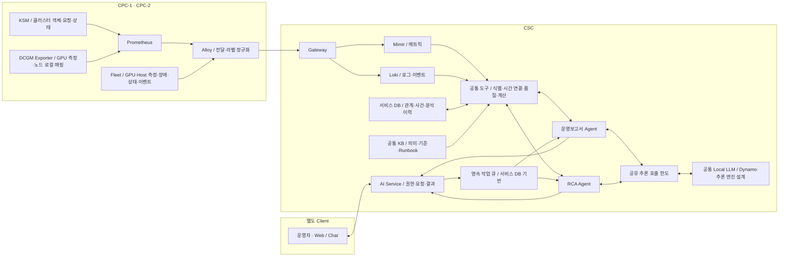
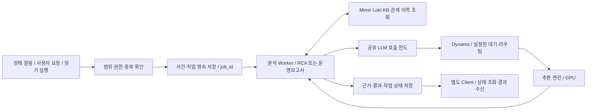

# DSX 두 Agent — 공통 판단 기준과 운영 인사이트 사례

작성일: 2026-09-15 · 기준 버전: 1.0 · 용도: 기획·운영·개발 공통 합의 및 외부 공유

2026-09-16 개정: 8.3절에 작업 실행·Dynamo 추론 경계 계약 1.0을 추가했다. 데이터 판정 기준 1.0은 유지한다. 수집 환경 설명은 작성 당시 설계 기준이며, 이후 Alloy 직접 수집·UID 조인 및 카탈로그 검토 기록은 [추가 자료 분석 메모](<../../review/2026-09-15_Alloy_진행자료와_카탈로그_분석메모.md>)에 구분해 보존한다.

이 문서는 **어떤 데이터를 근거로, 어느 수준까지 판단하고, 운영자에게 무엇을 제공할지** 정의한다. 실제 개발·배포 결과가 아니다. 사례의 수치·장치·작업 이름은 모두 가상이다. 분석 기준을 확정하는 것과 현재 환경의 모든 필드가 수집됐음을 확인하는 것은 별개다.

2026-09-16 사이트 권한 후속: 하나의 CSC에서 사이트별 접근 범위를 유지하는 [사이트 권한·Mimir Tenant 설계](<DSX_사이트권한과_Mimir_Tenant_설계_2026-09-16.md>)를 추가했다. 요청자·허용 사이트·정책 버전을 작업에 보존하고 실행·조회·결과 열람에서 권한을 확인한다. 사이트별 tenant는 목표 설계안이며 현행 수집 변경·tenant 전환·인증 배포를 뜻하지 않는다. 사이트와 CPC/cluster, 인증 토큰과 tenant ID를 구분한다.

처음 읽는 사람은 1~3절에서 구조와 기준을, 7절에서 실제 인사이트를 보면 된다. 개발자는 4~6절과 8~10절을 함께 본다.

**문서의 역할:** 이 문서가 두 Agent의 상태·식별·시간·집계·판단 기준 원본이다. [운영보고서 Agent 문서](<DSX_GPU_운영보고서_Agent_역할과_데이터설계_v1.1.md>)는 기간 분석 업무를, [RCA Agent 문서](<DSX_GPU_RCA_Agent_역할과_데이터설계_v1.0.md>)는 사건 조사 업무를 상세히 설명한다. [수집·메트릭 조사 문서](<DSX_공통_데이터수집경로와_메트릭조사_2026-09-15.md>)는 지원 기능과 실제 수집 근거를 관리한다. 공통 판단 정의가 충돌하면 이 문서를 기준으로 맞춘다.

## 1. 두 Agent가 답할 질문

| Agent | 답할 질문 | 대표 결과 | 기본 범위 밖 |
|---|---|---|---|
| 운영보고서 Agent | 어느 자원·작업·정책을 먼저 검토해야 하는가? | 할당·저활동·배치 대기·반복 사건을 비교한 검토 대상, 근거, 다음 행동 | 지표만으로 증설 수량·절감액 확정, 자동 회수·재배치 |
| RCA Agent | 이 사건에서 무엇이 일어났고, 어느 작업과 관련되며, 무엇을 더 확인해야 하는가? | 사건 시점의 관련 작업, 원인 후보, 지지·반박 근거, 적용 가능한 Runbook과 다음 점검 | 관계만으로 원인·피해 확정, 자동 리셋·재부팅 |

운영보고서는 RCA의 사건·분석 결과를 참조한다. RCA는 공통 집계 결과를 조사 근거로 사용할 수 있다. 같은 할당 이력과 사건 원장을 재사용하므로 두 Agent가 서로 다른 GPU 수나 사건 횟수를 만들지 않는다.

예를 들어 운영보고서가 “G1에서 반복 사건이 많아 점검 우선순위가 높다”고 제시하면, RCA는 “G1의 각 사건 당시 어떤 작업과 장비 증상이 있었는가”를 조사한다. 점검·작업 종료·구성 변경은 운영자가 결정한다.

## 2. 수집 책임과 데이터 흐름



이는 역할을 설명하는 논리도다. GPU 매핑 활용 가능은 최신 사용자 확인을 반영한다. Exporter의 모든 필드가 이 경로로 중앙 전송되는지 새로 검증한 배포도가 아니다. 수집 경로 변경 기록은 상단의 추가 자료 분석 메모를 참고한다. Grafana → Webhook → Incident Aggregator → 사건·작업 접수 저장 → 작업 큐 → RCA로 실행 경계를 명시한다. Mimir/Loki의 Object Storage 보관 설계는 유지한다. 작업 큐·Dynamo 경로는 구현할 구조이며 현재 배포 완료를 뜻하지 않는다.

| 구성 | 맡을 일 | 경계 |
|---|---|---|
| KSM·Prometheus | 클러스터 전체 Pod 객체·요청·배치·노드 상태 수집 | GPU의 실제 연산량을 측정하지 않음. 필요한 KSM 지표를 실제로 수집해야 함 |
| DCGM Exporter | 선택한 GPU 지표와 kubelet PodResources 기반 작업 매핑 제공 | 미배치 Pod의 대기 요청·이유를 GPU 측정값으로 알 수 없음 |
| Fleet | 노드별 GPU·Host 측정, 장비 상태·장애·이벤트 제공 | 클러스터 전체 대기열의 기준 원장으로 사용하지 않음 |
| Alloy | 전달·필터·라벨 정규화 | 소유권이나 미확인 상태를 추론해 라벨로 만들지 않음 |
| CSC 공통 도구 | 같은 대상·시점으로 연결, 중복 제거, 수치·품질 계산 | 원본에 없는 과거 상태·업무 성과를 생성하지 않음 |
| LLM | 계산된 사실을 설명하고 등록된 후속 조사 선택 | 원시 시계열을 임의 계산하거나 없는 근거를 채우지 않음 |

각 Fleet에 클러스터 전체 Pod 수집을 중복시키는 것을 기본 설계로 삼지 않는다. KSM의 HA·샤딩·중복 제거는 별도 수집 설정으로 처리하며, “Fleet마다 전역 수집을 하지 않는다”는 원칙과 “KSM을 반드시 단일 인스턴스로 운영한다”는 주장은 다르다.

Exporter는 미할당 GPU의 측정값도 제공할 수 있다. Pod 매핑이 없다는 사실만으로 미할당을 확정하지는 않는다. PodResources는 노드 로컬 정보를 제공하므로 미배치 Pod 수요는 클러스터 객체 정보와 결합한다. [NVIDIA Exporter 해당 버전 설명](https://github.com/NVIDIA/dcgm-exporter/tree/4.4.2-4.7.0), [Kubernetes Device Plugins·PodResources](https://kubernetes.io/docs/concepts/extend-kubernetes/compute-storage-net/device-plugins/)

## 3. 현재 환경에서 인정할 근거

### 3.1 확인된 기반과 남은 조건

| 구분 | 채택할 사실·전제 | 이 사실만으로 확정하지 않을 것 |
|---|---|---|
| CPC-1·CPC-2 | 동일한 수집 환경이며 CSC에서 양쪽을 조회할 환경이 구축됐다는 사용자 확인 | 모든 GPU 모델·필드·기간의 유효 값 확보 |
| GPU↔Pod | 매핑 활용 가능이라는 최신 사용자 확인 | Pod UID 보완, 과거 매핑, 공유 방식, 해제 시각까지 검증 완료 |
| Fleet 표본 | 18개 고유 메트릭 이름·라벨 확인, GPU VRAM·ECC 등 포함 | 숫자·기간이 없는 표본으로 추세·장애 발생 판정 |
| KSM | `kube_node_status_condition`, `kube_pod_info`, `kube_pod_container_resource_requests` 중앙 수집 확인 | GPU resource 값, Pending·owner·allocatable·cordon까지 모두 수집 |
| GPU 활동·SM·전력 | 참고 소스·공식 기능에서 제공 경로 확인 | 현재 CPC의 유효 값이 CSC에 수신됐다고 확정 |
| 최신 운영 계획·표 | node_group 분석, KSM 역할, 이력 설계의 참고 자료 | 문서 속 설정·쿼리를 실행 완료 증거로 사용 |

이 기준은 CPC-2에만 기능을 한정하지 않는다. 두 CPC에 같은 검증 조건을 적용하며, 실제 분석 가능 여부는 대상·필드·기간별로 판단한다.

### 3.2 기능 결과의 네 가지 상태

| 상태 | 의미 | 출력 |
|---|---|---|
| `ready` / 산출 가능 | 필요한 데이터·의미·기간·단위가 검증되고 해당 분석의 품질 조건 충족 | 수치·근거·판단 범위. 결측이 허용 범위 내라도 그 양을 함께 표시 |
| `partial` / 부분 산출 | 독립적인 일부 사실이나 관측 구간만 유효 | 유효 부분과 제외 범위. 전체 기간·전체 자산으로 확대하지 않음 |
| `blocked` / 근거 부족 | 해당 판단의 필수 입력 부족 | 판단 값은 null, 부족 항목·이유·다음 확인 |
| `not_applicable` / 적용 대상 아님 | 공유 방식·장비·업무 유형상 해당 지표를 적용할 수 없음 | 적용 불가 이유와 가능한 대체 보기 |

한 보고서 안에서 현재 매핑은 `ready`, 과거 할당시간은 `blocked`, 장비 활동은 `partial`일 수 있다. 도구 실행 오류는 별도 실행 상태로 기록한다. LLM이 데이터 판정 상태를 임의로 올리지 않는다.

## 4. Pod·GPU 상태는 세 축으로 구분한다

`Pending → Scheduled → Mapped → Active → Idle → Released`를 단일 상태 머신으로 만들지 않는다. Kubernetes 상태, 장치 연결, 활동 관측은 서로 다른 정보다.

| 축 | 값 | 판정 기준 |
|---|---|---|
| Pod 배치 | `unbound`, `bound`, `unknown` | 같은 시점 객체의 노드 바인딩 여부. `bound`는 spec.nodeName 등으로 배치 대상 노드가 확인됨 |
| GPU 매핑 | `matched`, `ambiguous`, `not_observed`, `unknown` | 장치↔Pod 관계의 실제 관측. 여러 관계가 정상인 공유 모드와 모순되는 관계를 구분 |
| GPU 활동 | `active_observed`, `low_activity_candidate`, `insufficient_data`, `not_applicable` | 명시된 시간창·활동 지표·품질·규칙으로 판단 |

Kubernetes의 원래 `phase`, `PodScheduled` condition, 종료·삭제 상태는 별도 필드로 보존한다. `Pending`은 노드 배치 후 준비 중인 경우도 포함한다. 컨테이너 재시작은 같은 Pod UID 안에서도 발생할 수 있다. [Kubernetes Pod 생명주기](https://kubernetes.io/docs/concepts/workloads/pods/pod-lifecycle/)

다음처럼 표현한다.

| 관측 | 표시할 상태 | 하지 않을 해석 |
|---|---|---|
| GPU 요청 2, 노드 바인딩 없음 | 미배치 GPU 요청 2단위, 매핑 미관측 | GPU 2장 부족으로 확정 |
| Pending이지만 노드 바인딩 존재 | 배치 완료·준비 중, 매핑은 별도 표시 | 미배치 수요에 합산 |
| Pod와 G1 연결, 활동 값 없음 | 매핑 확인·활동 확인 불가 | Idle 또는 Active로 추정 |
| 전용 G1 연결, 저활동 규칙 충족 | 할당 확인·저활동 후보 | 회수 가능 확정 |
| 공유 G1에 A·B 연결, 장치 활동 높음 | 공유 장치 활동 관측·A/B 연결 | A와 B 각각의 실사용 비율 확정 |
| 매핑 수집 중단 | 매핑 확인 불가 | 해제·미할당·사용량 0 |

### 4.1 미할당과 해제

**미할당**은 특정 장치·시점에 유효한 인벤토리와 완전한 할당 조회가 있고, 적용 범위 내 연결이 없다고 확인한 상태다. Kubernetes 할당만 확인했다면 “Kubernetes 매핑상 미할당”으로 범위를 표시한다. GPU 사용 프로세스·예약·장애까지 확인하지 않았다면 “즉시 사용 가능”으로 확대하지 않는다.

**Released**는 상태 사슬의 마지막 값이 아니라 특정 할당 관계가 끝난 사건이다. 권위 있는 해제 이벤트가 있으면 그 시각을 사용한다. 연속된 완전한 조회에서 기존 관계가 사라졌다면 마지막 존재 관측과 최초 부재 관측 사이에 해제된 것으로 기록한다. Pod 종료만으로 정확한 GPU 해제 시각을 만들지 않는다.

### 4.2 미배치 수요와 GPU 부족

미배치 GPU 요청은 다음 조건을 함께 만족하는 객체를 대상으로 한다.

1. 실제 Pod 객체와 신원을 확인했다.
2. 종료·삭제 대상이 아니며 유효 GPU 요청량이 양수다.
3. 노드에 바인딩되지 않았다.
4. resource 종류와 수량 단위가 확인됐다.

여기에서 스케줄링 준비 여부·gate·실패 사유를 추가해 “스케줄링 대상 대기”, “의도적 보류”, “상태 미확인”을 구분한다. GPU 부족·affinity·taint·다른 자원 부족 등은 동시점 scheduler 근거로 표시하며 복수 사유를 허용한다. KSM만으로 모든 실패 이유를 얻을 수 있다고 가정하지 않는다.

Pod가 아직 생성되지 않은 Run:ai 대기 작업·승인 전 요청·미래 예약은 이 집계 밖이다. 해당 수요까지 포함하려면 플랫폼 대기열·예약 데이터가 추가로 필요하다. 배치되지 않은 Pod에는 실제 node_group이 없으므로 selector·플랫폼 정책으로 확인한 희망/허용 풀만 표시하고, 불명확하면 `pool_unresolved`로 남긴다.

## 5. 공통 식별·매핑·시간 계약

### 5.1 식별 원칙

| 대상 | 기준 | 보완 조건 |
|---|---|---|
| Cluster | `cluster_id` | 공통 Mimir tenant와 분석 대상 Cluster는 별개 |
| Node | `cluster_id + node_uid` | UID가 없으면 검증된 노드 인스턴스 식별자를 사용. 이름만 있으면 재생성 구간 귀속 제한 |
| GPU | `cluster_id + gpu_uuid` | Node와의 관계는 시각·노드 인스턴스와 함께 관리. GPU index·PCI 주소만을 영구 키로 쓰지 않음 |
| Pod | `cluster_id + pod_uid` | namespace·pod_name은 표시·현재 조회용. UID 미확인은 null |
| Container 실행 | Pod UID + container 이름 + 실행 식별자 | 재시작 구분에는 container ID·시작/종료 시각·재시작 횟수 등 추가 |
| MIG | 부모 GPU UUID + 실제 instance 식별·구성 유효 구간 | 프로파일만으로 instance를 식별하지 않음. 재구성 전후 구분 |
| Workload | Cluster + controller 종류·UID와 owner 관계 | Deployment는 Pod→ReplicaSet→Deployment 등 상위 관계 확인 |

Node UID는 Kubernetes 노드 객체 신원이며, 모든 재부팅이나 물리 장비 교체를 자동으로 식별하는 값은 아니다. 필요하면 machine ID·boot ID·장비 인벤토리를 별도로 연결한다. Pod UID도 같은 Pod 내부 컨테이너 재시작을 구분하는 값은 아니다.

`node_group`, `compute_zone`, GPU 모델은 분석 차원이다. 하나가 다른 하나를 항상 포함하는 계층으로 고정하지 않는다. Namespace·node_group을 프로젝트·사용자 소유권으로 자동 치환하지 않는다. Alloy 주입값은 실제 노드별 소속과 변경 이력을 반영해야 한다.

### 5.2 `get_gpu_pod_mapping` 공통 계약

입력은 허용된 Cluster, GPU 또는 Pod 식별자, 기준 시각 또는 `[start, end)`다. 두 Agent가 같은 논리 함수를 사용한다.

| 필드 묶음 | 내용 |
|---|---|
| 대상 | `cluster_id`, `node`, `node_uid`, `gpu_uuid`, 필요 시 `parent_gpu_uuid`, `device_id`, MIG 구성 식별 |
| 작업 | `namespace`, `pod_name`, `pod_uid`, 확인 가능한 `container`, 필요 시 container 실행 식별자 |
| 시간 | `observed_at`, `ingested_at`, `valid_from`, `valid_to`, `time_basis`, `boundary_uncertainty` |
| 방식 | `allocation_mode`: exclusive / mig / time_slicing / mps / unknown |
| 관계 | `relation_status`: matched / ambiguous / not_observed / unknown |
| 신원 | `identity_status`: uid_resolved / name_only / unknown |
| 품질 | 수집 성공·완전성·포괄 범위·원본 시각·최신성·공백 |
| 출처 | 원본 생산자·실제 라벨·설정/파서 버전·`evidence_refs` |

미확인 필드는 null이며, `valid_to=null`을 영구적인 유효 할당으로 해석하지 않는다. `time_basis`는 snapshot / observed_interval / authoritative_event_interval로 구분한다. 마지막 유형은 실제 권위 있는 할당·해제 이벤트가 확보됐을 때만 사용한다.

여러 메트릭에 반복된 같은 매핑은 하나로 정규화한다. `matched`는 독점 할당을 뜻하지 않는다. 동일 GPU의 여러 정상 공유 관계를 `ambiguous`로 만들지 않는다. 전용이라고 확인한 장치가 동시에 서로 다른 Pod에 연결되는 등 상충 근거가 있으면 귀속을 보류한다.

### 5.3 시간 연결 규칙

- 시간은 UTC 저장, Client는 요청 시간대 표시. 분석은 `[start, end)`로 통일한다.
- 사건 시각, 관측 시각, 수신 시각을 분리한다. 지연 수신 로그를 현재 사건으로 바꾸지 않는다.
- 폴링 매핑은 인접한 성공 관측에서 같은 관계가 유지되는 구간만 근사한다. 기본 허용 간격은 해당 생산자의 검증된 관측 주기 T의 2배다. T가 미확인이면 기간 추정은 보류한다.
- 메트릭의 기본 최대 유효시간도 해당 원본 관측 주기의 2배로 두되, 필드별 예외는 버전에 기록한다. Prometheus 평가 간격을 원본 관측 주기로 대신하지 않는다.
- 관계 변경 경계·긴 공백·시계 이상 구간은 제외한다. 마지막 값은 기간 끝까지 연장하지 않는다.
- 현재 이름 기반 관계는 현재 관측으로 제공할 수 있다. 과거 실행 귀속은 UID 또는 동등하게 재생성을 구분하는 검증된 신원이 있어야 한다.
- 해제와 재할당 사이 경계가 불명확하면 경계 구간을 A 또는 B에게 임의 배정하지 않는다.

이 기준은 관측 기반 분석을 위한 것이다. 폴링 사이에 끝난 작업을 놓칠 수 있으므로 정밀 과금 원장을 보장하지 않는다. 원본 이벤트 기반 계산과 관측 근사는 결과에 구분해 표시한다.

## 6. 계산과 판정 기준 v1.0

### 6.1 보고서에서 사용할 지표

| 지표 | 산출 기준 | 반드시 함께 표시할 조건 |
|---|---|---|
| 현재 할당 | 같은 시점의 유효 관계를 고유 장치/할당 단위로 집계 | 전용 물리 GPU, MIG instance, 공유 단위를 분리 |
| 관측 기반 할당 GPU-hours | 전용 물리 GPU별 유효 할당 구간 합집합의 초 ÷ 3,600 | 기간·신원·공백·경계 불확실성. 중복 컨테이너·생산자 제거 |
| 저활동 할당 GPU-hours | 할당 구간 중 유효 활동 값이 저활동 임계값 미만인 GPU·초 ÷ 3,600 | 후보 시간창 전체가 아니라 실제 저활동으로 관측된 구간만 합산 |
| 평균 활동률 | Σ(정규화 활동률 × 유효 GPU·초) ÷ Σ(유효 GPU·초) | 동일 의미·단위, 모델·공유 방식별 분리 |
| 활동·VRAM P95 | 지정 대상·기간의 유효 값과 지속시간을 사용한 가중 95백분위 | 시간 분포인지 GPU 간 분포인지 표시. GPU별 주간 평균의 P95와 구분 |
| 미배치 GPU 요청량 | 4.2절 조건을 만족하는 Pod의 유효 요청량 합 | 요청 resource·단위·gate·사유·pool 해석 수준 |
| 미배치 요청시간 | 해당 요청량 × 미배치 관측 구간 | 이미 대기 중인 작업을 처음 발견했다면 그 이전 대기시간은 미확인 |
| 관측 기반 미할당 GPU-hours | 인벤토리와 완전한 할당 조회로 미할당을 확인한 GPU·시간 | 즉시 배치 가능량·회수량과 구분 |
| GPU 사건 발생률 | 중복 제거 사건 수 ÷ 유효 사건 관측 GPU-hours × 1,000 | 같은 사건 정의·GPU 범위·관측 시간. 총 건수도 함께 표시 |
| GPU 에너지 kWh | Σ(실제 소비전력 W × 유효 초) ÷ 3,600,000 | 적분 방식·공백. power limit는 사용하지 않음 |

요청량은 단순한 모든 컨테이너 요청 합으로 고정하지 않는다. 배포 버전의 init container·sidecar·Pod overhead 등 스케줄링 유효 요청 규칙을 반영한다. 가능하면 scheduler가 제공하는 Pod 유효 요청 지표를 사용하고, KSM 컨테이너 지표로 계산하면 필요한 객체 정보와 계산 정책을 함께 검증한다. GPU resource 값은 실제 수신 라벨로 확정한다. `nvidia_com_gpu`는 흔한 Prometheus 표현의 예이며 현재 환경 값으로 단정하지 않는다. [KSM Pod 지표 정의](https://github.com/kubernetes/kube-state-metrics/blob/main/docs/metrics/workload/pod-metrics.md)

`quantile_over_time` 등 Prometheus 시간 집계는 샘플 간격이 불균일해도 샘플을 같은 가중치로 다룰 수 있다. 따라서 시간 가중 기준을 충족하도록 공통 도구에서 유효 구간을 처리한다. query_range 점 수 × step을 실제 할당시간·수집 성공률로 사용하지 않는다. [Prometheus 집계 함수](https://prometheus.io/docs/prometheus/latest/querying/functions/)

### 6.2 품질과 결측

**0은 유효하게 관측된 0에만 사용한다.** 미수집·미지원·오래된 값·연결 실패는 null과 이유다. GPU 인벤토리가 불완전하면 전체 GPU 수와 전체 커버리지의 분모를 확정하지 않는다.

커버리지는 주장 단위마다 분모를 고정한다. 전체 장비 지표는 기대 GPU·시간, 특정 Pod 활동은 유효 할당 대상·시간, 노드 매핑 수집은 기대 노드·시간을 사용한다. 할당 이력 자체가 없으면 Pod 할당시간의 전체 커버리지도 미확정이다.

필수 입력들의 **동시 유효 구간 교집합**으로 공동 커버리지를 계산한다. 개별 커버리지의 평균·최솟값으로 대체하지 않는다. 결과에는 대상 수, 기대 구간, 유효 구간, 제외 구간, 제외 이유를 남긴다.

일반 기간 비교·순위는 공동 커버리지 95% 이상을 v1 기본 진입 기준으로 한다. 이는 결측이 결과에 영향을 주지 않는다는 보장이 아니다. 사건 시각이 누락되거나 특정 시간대가 집중 누락되는 등 질문의 핵심 근거가 빠지면 95% 이상이어도 해당 주장은 보류한다. 미달이면 관측 부분만 제공하고 전체 기간 대표 순위는 보류한다.

### 6.3 저활동 후보 규칙

다음 수치는 **v1 분석 후보 생성 기본값**으로 채택한다. 실제 워크로드에 최적화된 운영 정책이나 자동 회수 조건은 아니다. 검증 후 바뀌면 새 규칙 버전을 발행한다.

| 항목 | v1 기준 |
|---|---|
| 적용 대상 | 전용 GPU 할당이 확인된 장치. 공유 장치 활동은 별도 보기 |
| 분석 시간창 | 60분 |
| 공동 커버리지 | 95% 이상 |
| 저활동 임계값 | 정규화 GPU utilization 5% 미만 |
| 후보 조건 | 유효 할당·활동 시간의 90% 이상이 저활동 |
| SM | 검증된 SM 활동이 있으면 추가 근거. 없다고 일반 GPU 활동 분석까지 막지 않음 |
| 제외·확인 | 초기화·체크포인트·추론 대기·예약 목적 등 확인. 목적 불명은 일반 검토 후보 |

활동 축의 `active_observed`는 이 시간창에서 유효한 5% 이상 활동이 관측되고 저활동 후보 조건은 충족하지 않은 경우다. 성능 효율·유용한 연산·충분한 처리량을 뜻하지 않는다. 후보 조건을 충족하면서 일부 활동도 있었으면 `low_activity_candidate`와 실제 활동 구간을 함께 표시한다. 품질 미달이면 `insufficient_data`다.

예를 들어 60분 중 공동 관측 58분, 그중 저활동 54분이면 커버리지 96.7%, 저활동 비율 93.1%로 후보 조건을 만족한다. 저활동 시간은 60분이 아니라 관측한 54분, 즉 GPU 1개 기준 0.9 GPU-hours다.

### 6.4 용량·귀속·인과 판단의 한계

미할당 물리 GPU 수와 스케줄러의 잔여 요청 가능량은 구분한다. 후자는 allocatable과 이미 바인딩된 작업의 유효 요청을 같은 resource 단위로 비교하며 예약·장애·정책의 영향을 추가 확인한다. 물리 GPU가 아직 매핑되지 않아도 바인딩된 Pod가 요청 용량을 선점한 상태일 수 있다.

단편화는 노드별 잔여 용량과 개별 작업 요구를 비교해 설명한다. 다른 배치 제약까지 확인하지 않았다면 “단편화 후보”다. cordon 노드 수는 GPU 수가 아니며, 사용 가능한 GPU 용량과 연결해 별도 집계한다.

공유 GPU는 Pod 매핑이 있어도 전체 장치 활동·VRAM·전력을 각 Pod의 실사용으로 복제하지 않는다. MIG는 프로파일별 instance-hours, time-slicing/MPS는 검증된 공유 할당 단위의 시간으로 구분한다. 균등 배부를 원하면 실측이 아닌 정책 배부로 표시한다. [NVIDIA GPU 공유 제약](https://docs.nvidia.com/datacenter/cloud-native/gpu-operator/latest/gpu-sharing.html)

RCA의 판단은 관계 / 실제 작업 영향 / 원인 연계 세 축이다. 관계는 current_mapping / incident_time_mapping / same_node_only / unknown, 영향은 not_assessed / no_impact_observed / disruption_observed / recovery_observed, 원인 연계는 undetermined / candidate / supported / confirmed를 사용한다. `confirmed`에는 검토된 확정 조건과 증거가 필요하다. Healthy 한 건, 오류 코드 하나, 사건 직후 종료만으로 전체 복구·물리 고장·인과관계를 확정하지 않는다.

## 7. Agent가 제공할 구체적인 인사이트

아래는 실제 측정 결과가 아니다. 각 사례는 적힌 입력이 모두 확보됐다고 가정하며, 빠진 경우의 출력도 함께 정의한다. O/R 번호는 두 Agent 상세 문서의 업무 ID다.

### 사례 1. 메모리가 높은 GPU의 확인 대상을 좁힌다 — 운영보고서 O01

**입력:** CPC-1의 G1 VRAM 점유율 85%, 현재 유효 매핑은 `dev/notebook-a`. 활동 메트릭은 없음.

**출력:** “VRAM 점유가 높은 G1은 notebook-a와 연결돼 있다. 해당 세션의 모델·데이터 유지 목적을 확인할 대상으로 제시한다. 연산 중인지 대기 중인지는 현재 입력으로 알 수 없다.”

**운영 가치:** 같은 노드의 모든 Pod를 조사하는 대신 관련 세션부터 확인한다. 사용량 85%를 Pod 프로세스 메모리로 단정하거나 메모리 병목·낭비라고 표현하지 않는다.

**필수 입력 / 현재 적용:** 유효 VRAM 값·의미와 현재 매핑. 현재 매핑 기반 첫 제공 범위에 포함하며, 실제 분석 시 값·최신성을 검증한다.

### 사례 2. 야간 저활동 할당을 검토한다 — 운영보고서 O02·O03

**입력:** notebook-a의 전용 GPU 2개가 8시간 할당됨. UID 기반 관측 이력은 해당 8시간을 모두 포함한다. 활동 공동 커버리지는 98%이며, 두 장 각각 유효 저활동 구간의 합집합이 5시간이다. 해당 구간은 후보 규칙으로 검토 대상으로 선정됐다.

**산출:** 할당 16 GPU-hours, 관측 저활동 할당 10 GPU-hours. 활동 결측 구간은 저활동으로 계산하지 않는다.

**출력:** “notebook-a의 저활동 할당 10 GPU-hours가 야간에 집중됐다. 다음 주부터 야간 세션 유지가 필요한지 담당자에게 확인하고, 불필요한 시간대 중지 정책을 검토한다.”

**운영 가치:** 회수 검토 대상과 시간대를 구체화한다. 10 GPU-hours를 그대로 절감액·확정 회수량으로 바꾸지 않는다.

**필수 입력 / 부족 시:** 전용성·UID·할당 이력·GPU 활동·품질. 이력이 없으면 현재 할당 2개만, 활동이 없으면 할당시간만 제공한다. 현재 자료만으로 이 기간 분석이 이미 가능하다고 확정하지 않는다.

### 사례 3. GPU가 남는데 작업이 못 들어가는 이유를 설명한다 — 운영보고서 O07

**입력:** prod-b의 N1·N2에 각각 같은 종류의 GPU 잔여 요청 용량이 2개다. 활성 대기 Pod train-b는 한 노드에 GPU 4개를 요청한다. 두 노드만 배치 대상이며 관련 scheduler 실패 사유와 다른 제약도 확인했다.

**출력:** “전체 잔여 용량은 4개지만 train-b를 수용할 단일 노드 공간이 없다. 현재 대기는 노드별 GPU 배치 공간의 분산과 관련된다. 실행 작업 종료 예정 시각과 이후 배치 가능성을 먼저 검토한다.”

**운영 가치:** ‘GPU가 4개 남는다’는 합계와 실제 배치 가능성이 다름을 설명한다. 같은 요구가 반복되는지 확인한 뒤 노드 구성·정책을 검토한다.

**필수 입력 / 부족 시:** GPU 유효 요청·미배치 상태·allocatable·기존 바인딩 요청·대상 풀·scheduler 근거. 할당 수와 총량만 있으면 배치 원인은 `blocked`; 다른 제약이 미확인이면 단편화 후보로 제한한다.

### 사례 4. Pending을 증설 근거로 오해하지 않는다 — 운영보고서 O07

**입력:** Pending Pod 6개. GPU 유효 요청은 각 1개. 4개는 노드 바인딩 완료 후 이미지 준비 중이고, 2개는 미배치다. 두 미배치 Pod의 gate·실패 사유는 아직 없다.

**산출:** Pending 6개, 미배치 GPU 요청 2단위, 바인딩 완료·준비 중 4개. 두 요청이 GPU 부족으로 대기하는지는 미확인이다.

**출력:** “Pending 6건 전체를 GPU 부족으로 볼 수 없다. 우선 4건의 준비 지연을 확인하고, 미배치 2건의 스케줄링 사유를 확보한다.”

**운영 가치:** 증설 검토 대상과 이미지·초기화 점검 대상을 분리한다.

**필수 입력 / 부족 시:** Pod UID·phase·바인딩·GPU 요청·컨테이너 상태. 사유가 없으면 정확한 부족량이나 증설 수량을 제시하지 않는다.

### 사례 5. 같은 작업의 GPU 활동 편차를 찾는다 — 운영보고서 O04

**입력:** 학습 Pod의 전용 GPU 4개가 같은 30분 동안 완전하게 관측됨. 시간 가중 평균 활동은 82%, 79%, 81%, 9%다. 작업 단계는 확인됐지만 rank별 진행·통신 정보는 없음.

**출력:** “G4의 활동이 나머지 세 장보다 현저히 낮다. 같은 시간대의 rank 배치, 입력 공급, 통신 대기와 오류를 우선 확인한다.”

**운영 가치:** 프로파일링할 장치와 시간대를 좁힌다. 데이터 로더 병목·NVLink 장애·GPU 불량 중 하나로 확정하지 않는다.

**필수 입력 / 부족 시:** 동시점 전용 매핑·활동 시계열·비교 기간·단계 정보. 단계 정보가 없으면 그 차이도 추가 확인 항목으로 표시한다. SM·DRAM·통신 지표는 추가 증거다.

### 사례 6. 공유 GPU의 Namespace 집계를 과대 계산하지 않는다 — 운영보고서 O08

**입력:** 물리 G1을 Namespace A의 Pod와 Namespace B의 Pod가 공유한다. 장치 활동은 80%다. 각각의 프로세스 활동은 측정하지 않았다.

**출력:** “물리 GPU 1개에 두 Namespace의 공유 할당 관계가 있다. G1의 전체 활동은 80%이며 Namespace별 실사용 비율은 확인할 수 없다.”

**운영 가치:** 물리 GPU 2개 사용이나 Namespace별 80% 사용이라는 중복 집계를 막는다. 공유 장치 목록·관계 수·할당 방식은 보고할 수 있다.

**필수 입력 / 부족 시:** 공유 방식·매핑·장치 활동. 비율 배부는 추가 측정 또는 명시적인 배부 정책이 있어야 하며, 정책 배부는 실측과 분리한다.

### 사례 7. 단순 사건 건수 대신 관측 시간을 함께 비교한다 — 운영보고서 O05, RCA R06 연계

**입력:** 동일 모델·동일 사건 정의에서 G1은 100 관측 GPU-hours 동안 사건 4건, G2는 500 GPU-hours 동안 5건이다. 사건 관측 경로와 중복 제거 기준이 같고 관측 공백은 제외했다.

**산출:** 1,000 관측 GPU-hours당 G1 40건, G2 10건. 실제 건수는 각각 4건·5건이다.

**출력:** “총 건수는 G2가 많지만 관측 시간 대비 발생률은 G1이 높다. G1의 작업·드라이버·장치 경로를 RCA 우선 확인 대상으로 제시한다. 표본은 작아 추세를 추가 관찰한다.”

**운영 가치:** 오래 관측한 장비가 무조건 문제 장비로 선정되는 오류를 줄인다. 장애 원인이나 교체 필요성을 확정하지 않는다.

**필수 입력 / 부족 시:** 정규화 사건·같은 범위의 사건 관측 시간·모델·비교 조건. 분모가 없으면 건수만 표시하고 발생률 순위는 보류한다.

### 사례 8. GPU 에너지와 운영 정책 변화의 관계를 본다 — 운영보고서 O09·O10

**입력:** 같은 GPU 4개의 10시간 비교. 전에는 각 GPU 시간 가중 평균 250 W, 후에는 200 W이며 전력 관측은 완전하다. 조치 시각은 있지만 업무량은 미확인이다.

**산출:** 전 10 kWh, 후 8 kWh, 관측 GPU 에너지 2 kWh 감소.

**출력:** “조치 후 같은 대상·시간의 GPU 에너지가 2 kWh 감소했다. 업무량·처리량 차이를 확인한 뒤 조치 효과를 평가한다.”

**운영 가치:** 관측 변화와 인과적인 조치 효과를 분리한다. 시설 전체 에너지 절감이나 성능 유지, 비용 절감을 확정하지 않는다.

**필수 입력 / 부족 시:** 실제 전력·시간·동일 대상·조치 이력. power limit만 있으면 kWh 계산은 보류한다. 업무 성능 평가는 처리량·지연·완료시간이 추가로 필요하다.

### 사례 9. 오류 당시 작업과 현재 작업을 구분한다 — RCA R01·R02·R04·R08

**입력:** 14:03 G1의 오류 사건, 당시 매핑 Pod A, 14:04 A 비정상 종료. 16:00 현재 매핑은 Pod B다. 오류 원문과 적용 조건에 맞는 Runbook이 있다.

**출력:** “사건 당시 A가 연결돼 있었고 직후 A의 중단이 관측됐다. GPU 사건이 중단 원인인지는 추가 근거가 필요하다. 현재는 B가 연결돼 있으므로 점검 검토 대상은 B의 현 상태를 포함한다.”

**운영 가치:** 과거 영향 조사와 현재 조치 검토를 혼동하지 않는다. RCA가 당시 로그·장치·작업 근거를 Runbook 조건과 대조해 다음 점검을 제시한다.

**필수 입력 / 부족 시:** 사건 시각·당시 매핑·작업 종료 증거·현재 매핑·KB. 과거 이력이 없으면 “당시 작업 미확인, 현재 B 연결”로 반환하고 장비 조사는 계속한다.

### 사례 10. Runbook에 없는 진행 정체를 조사한다 — RCA R03·R05

**입력:** 운영자가 Pod A의 진행 정체를 신고했다. A↔G1 매핑이 있고, 유효 기간에 VRAM 90%·GPU 활동 2%가 관측됐다. 등록된 오류 코드는 없고 애플리케이션 진행·스토리지·통신 자료도 없다.

**출력:** “A와 연결된 G1에서 높은 메모리 점유와 낮은 활동이 관측됐다. 데이터 공급 대기·동기화·의도적 대기 등을 구분할 추가 근거가 필요하다. 해당 시간대 작업 로그와 입력·통신 상태 확인을 제안한다.”

**운영 가치:** 코드 일치에 실패해도 증상·대상·시간 기반의 등록된 읽기 조사로 이어진다. Mimir/Loki 조회 범위를 제한하고, 필요한 자료가 없으면 조사 결과·부족 근거·다음 확인을 남긴다.

**필수 입력 / 부족 시:** 신고 증상·현재 또는 당시 매핑·관측 값·증상별 조사 절차. Runbook 자동 생성·미검증 조치 실행·근거 없는 원인 확정은 하지 않는다.

### 사례 11. 정상 로그와 실제 작업 복구를 구분한다 — RCA R09

**입력:** 운영자가 15:00 점검 완료를 기록했다. 이후 관측 구간에서 장비 Healthy와 오류 미재관측이 확인됐다. 작업 진행·처리량 정보는 없다.

**출력:** “확인한 장비 상태는 정상이며 관측 구간에 같은 오류가 다시 나타나지 않았다. 작업 처리 재개는 미확인이다. 작업 로그·진행 지표로 서비스 복구를 추가 확인한다.”

**운영 가치:** 장비 상태 회복과 업무 복구를 나눠 후속 확인 대상을 제공한다.

**필수 입력 / 부족 시:** 조치 시각·유효 상태/사건 관측·기간. 작업 자료가 없으면 업무 복구시간을 계산하지 않는다. 수집 누락이면 오류 미재관측 자체도 판단을 보류한다.

### 사례 12. 수집 장애를 운영 개선으로 착각하지 않는다 — 운영보고서 O11, RCA 공통

**입력:** 10:00~11:00 G1 활동은 정상 수신됐지만 GPU↔Pod 매핑 조회가 중단됐다.

**출력:** “이 시간대 장치 활동은 제공할 수 있지만 작업별 귀속은 보류한다. 할당 해제나 미할당 시간 증가로 계산하지 않는다. 매핑 수집 경로 복구가 우선이다.”

**운영 가치:** ‘사용량 감소’로 보이는 수집 장애를 구분하고, 누락된 입력 하나 때문에 독립적인 장비 관측까지 숨기지 않는다.

**필수 입력 / 부족 시:** 수집 성공·원본 시각·기대 대상·매핑 완전성. 누락 원인을 확정할 수 없으면 영향 범위와 관측 공백만 제시한다.

## 8. 저장·조회·LLM의 구현 기준

현재는 설계 단계이며 아래는 구현 계약이다. 기존 Mimir·Loki와 서비스 DB를 재사용한다. 서비스 DB 제품이 미정이면 PostgreSQL을 기본안으로 한다. 별도 시계열 DB·그래프 DB·벡터 DB를 추가하는 것을 기본 요건으로 두지 않는다.

| 위치 | 보관·처리할 것 |
|---|---|
| Mimir | 원본 GPU·Host·KSM 시계열과 전달된 매핑 지표 |
| Loki | 원문 로그·이벤트. scheduler·작업 로그는 실제 수집 범위만 사용 |
| 공통 서비스 DB | `identity_history`, `allocation_observation`, 필요한 객체 관측/관계 이력, Incident 및 분석·보고서 실행/결과 |
| 공통 KB | 의미 ID·단위·적용 조건, 판정 규칙·쿼리/조사 절차, 발행된 Runbook revision |
| 기존 Object Storage | 저장소 보관 데이터와 필요한 근거 스냅샷·공유 보고서 파일 |

KSM은 현재 객체 상태를 노출하는 수집원이며, 과거 상태는 Mimir 시계열이나 보존한 객체 관측 이력에서 얻는다. SQL에는 모든 원시 시계열을 복제하지 않고 관계·분석 결과·필요한 근거를 보존한다.

### 8.1 대표 소스와 라벨

물리 GPU 측정의 대표 소스는 메트릭 의미·장비·분석 기간별로 하나를 고정한다. **Exporter 우선·Fleet 우선을 전역 규칙으로 확정하지 않는다.** 필요한 필드의 중앙 유효 값·단위·기간 품질을 확인해 선택한다. 최신 운영 계획의 Exporter 대표안은 이를 충족하면 채택할 수 있다. Fleet의 GPU 측정 기능을 제거한다는 의미는 아니다.

중복 소스를 합산하거나 매 시점 임의로 높은 값을 선택하지 않는다. 대체 소스 전환은 호환성 검증·유효 시점·버전 이력을 남기며 비교 불가능한 구간은 나눠 표시한다.

`UUID/uuid`, `Hostname/node`, 작업용 `namespace/pod`와 `exported_namespace/exported_pod`는 실제 충돌·relabel 결과를 대조해 공통 키로 정규화한다. 항상 `exported_*`가 존재한다고 가정하지 않는다. Exporter 작업 라벨과 Exporter 자신을 가리키는 scrape 라벨을 구분한다.

Mimir 공통 tenant `cpc-1`과 `cluster_id`를 분리한다. Loki는 Cluster별 tenant·실제 라벨의 대응표를 사용한다. Client의 접근 권한을 서버에서 적용하며 공통 tenant를 전체 CPC 접근 권한으로 사용하지 않는다.

### 8.2 조회 흐름과 입력·출력

```text
Client: 대상·기간·질문
  → AI Service: 권한 범위·시간대·분석 주제 확정
  → 백엔드: 작업을 영속 저장하고 job_id 반환, 처리 여유에 따라 Worker가 실행
  → 공통 도구: 필수 입력 검증
  → Mimir 기간 조회 + 필요한 Loki/Incident/객체 이력 조회
  → 동일 신원·시점 연결, 대표 소스 선택, 결측·중복 처리
  → 공통 규칙으로 계산, 상태·품질·근거 반환
  → Agent: 필요한 LLM 호출만 공유 한도 내에서 Dynamo·추론 엔진에 요청
  → Agent/LLM: 사실·해석·다음 행동 설명
  → 수치·대상·근거 일치 검사 후 DB 보존 및 Client 반환
```

원시 입력 전체를 LLM에 보내는 대신 `get_allocation_summary`, `get_low_activity_candidates`, `get_unbound_gpu_demand`, `get_incident_history` 등 주제별 논리 도구를 사용한다. 별도 마이크로서비스를 뜻하지 않는다. 조회는 검증된 query ID와 매개변수화한 PromQL·LogQL·SQL로 수행한다.

미배치 수요 조회는 Pod UID로 phase·바인딩·유효 요청을 먼저 연결한 뒤 집계한다. GPU 매핑 결과와 inner join하면 UUID 없는 미배치 Pod가 사라지므로 그렇게 구현하지 않는다. 모든 조인에는 Cluster와 적절한 실행 신원·시간 범위를 포함한다.

다음은 사례 4의 **구조화 출력 예**다. 계약 필드 이름을 설명하기 위한 가상 결과이며 실행된 쿼리 결과가 아니다.

```json
{
  "analysis_id": "example-demand-001",
  "topic_id": "O07",
  "status": "partial",
  "scope": {"cluster_id": "cpc-1", "node_group": null},
  "as_of": "2026-09-15T10:00:00Z",
  "metrics": {
    "pending_gpu_pods": 6,
    "bound_pending_gpu_pods": 4,
    "unbound_gpu_request_units": 2,
    "request_unit": "exclusive_gpu",
    "gpu_shortage_units": null
  },
  "facts": ["미배치 GPU 요청 2단위가 관측됨"],
  "interpretation": "GPU 부족 여부는 판단 보류",
  "missing_inputs": ["scheduling_readiness", "scheduler_failure_reason"],
  "next_action": "두 미배치 Pod의 스케줄링 준비 상태와 실패 사유 확인",
  "quality": {"basis": "snapshot", "history_coverage": null},
  "evidence_refs": ["example-pod-snapshot", "example-request-snapshot"],
  "versions": {"criteria": "1.0", "query": "example-v1"}
}
```

보고서 실행에는 대상·기간·시간대·입력 마감 시각·query/정규화/계산/규칙/KB/모델 버전과 실제 결과를 저장한다. 원본 만료 뒤에도 검토할 수 있도록 필요한 입력 요약·근거 스냅샷을 보존한다. 재분석은 기존 결과를 덮어쓰지 않고 새 실행으로 연결한다.

### 8.3 백엔드 작업 큐와 Dynamo 추론 대기 — 실행 계약 1.0

**결정:** 분석·보고서 업무를 보존하는 백엔드 큐 하나와 Dynamo의 추론 대기·라우팅을 구분한다. Dynamo 앞에 별도 추론 메시지 브로커를 기본으로 추가하지 않는다. 기존 영속 작업 처리 수단이 있으면 재사용하고, 없다면 서비스 관계형 DB의 공통 작업 레코드와 Worker로 시작한다. 현재 Dynamo의 설치·버전·활성 설정은 확인되지 않았으며 아래는 채택할 설계다.

| 구분 | 백엔드 영속 작업 큐 | Dynamo의 추론 대기·라우팅 |
|---|---|---|
| 단위 | RCA 조사 1건, 정기/사용자 보고서 생성 1건 | 해당 작업 안의 개별 LLM 호출 |
| 책임 | 접수·실행 순서·권한 범위·진행·재시도·복구·결과 보존 | 모델/추론 Worker 선택과 처리 여유에 따른 요청 배분 |
| 보존 | 재시작 후 미완료 작업을 복구하는 업무 원장 | 업무의 영속 원장으로 사용하지 않음 |
| 대기 | 오래 기다릴 업무, 재시도 시각이 아직 안 된 업무 | 이미 제출한 추론 요청의 단기 대기 |
| 완료 | 계산·근거·결과가 저장되고 작업 상태가 확정됨 | 한 추론 요청의 응답 또는 실패. 전체 업무 완료는 아님 |



#### 8.3.1 접수·상태·장애 후 복구

접수 성공은 작업이 영속 저장된 뒤 반환한다. Client는 `job_id`로 대기·진행·결과를 조회한다. 사건 갱신과 분석 작업 접수는 같은 DB를 사용하면 한 트랜잭션에서 기록하고, Worker는 커밋된 작업만 가져간다. 이렇게 사건만 저장되고 작업 접수가 사라지는 틈을 막는다. 이미 외부 브로커를 쓰는 환경에서는 DB 기록과 메시지 전달의 누락을 복구하는 기존 방식을 확인해 재사용한다.

공통 작업 레코드는 작업 ID·유형·요청자/허용 범위·대상·입력 버전·우선순위·생성/실행 가능/마감 시각·실행 상태·시도 횟수·Worker 점유 만료·취소 요청·최종 결과 참조를 보존한다. 대용량 로그나 토큰 스트림 전체를 작업 큐 본문에 복제하지 않고 근거 참조와 필요한 스냅샷을 사용한다. `analysis_run/report_run`은 이 작업에 연결한다. 이름만 다른 실행 원장을 중복 신설하지 않는다.

| 실행 상태 | 의미 |
|---|---|
| queued | 접수 저장 완료, 실행 대기 |
| running | Worker가 유효한 점유권을 가지고 처리 중 |
| retry_wait | 일시 실패 후 다음 시도 시각 대기 |
| succeeded | 해당 실행의 결과 저장 완료. 결과의 데이터 품질과는 별개 |
| failed | 재시도 불가 또는 허용 횟수 소진 |
| cancelled | 취소를 확정하고 해당 실행의 결과 발행을 중지 |
| expired | 전체 업무 마감 시각 초과 |

실행 상태와 3.2절의 `ready/partial/blocked/not_applicable`은 별개다. 실행은 성공했지만 일부 주제는 근거 부족일 수 있다. 실행 중 세부 단계는 조회·집계·추론 한도 대기·추론·저장 등으로 표시한다.

Worker 점유에는 만료와 갱신을 두고, Worker 장애 후 만료된 작업을 재시도 정책에 따라 회수한다. 회수 전 Worker가 늦게 돌아와도 현재 시도의 권한/버전이 아니면 최종 상태와 결과를 덮어쓰지 못하게 한다. 처리 중에는 긴 DB 트랜잭션을 유지하지 않는다.

처리는 중복될 수 있다는 전제로 설계한다. 유일한 접수 키와 조건부 결과 확정으로 최종 산출물의 중복 발행을 막으며, 추론 자체가 반드시 한 번만 실행됐다고 보장하지 않는다. 재시도는 같은 작업의 새 attempt, 새로운 증거·정책으로 재분석하는 것은 새 run/job으로 구분한다. 유효하게 저장된 단계 결과는 재사용하고, 재조회 시 입력 마감·시점이 달라지면 기록한다. 조치 검토용 현재 매핑은 새 시각으로 갱신한다.

#### 8.3.2 동시 실행·우선순위·과부하

분석 Worker 수와 전체 동시 LLM 호출 수를 별도로 제한한다. RCA·보고서 Worker 전체가 같은 추론 용량을 공유하므로 프로세스별 한도만으로 전체 한도를 대신하지 않는다. 한도는 호출을 제출하기 전에 확보하고 호출 종료·실패·취소 처리 시 반환한다. Worker가 여러 개면 공유된 한도 관리와 점유 만료 처리가 필요하다. 메트릭·로그 조회에도 별도 동시성·조회 범위 제한을 적용한다.

추론 처리 여유가 없으면 다음 업무를 무제한으로 실행하거나 모든 LLM 요청을 Dynamo에 미리 밀어 넣지 않는다. 긴 대기는 백엔드에 남긴다. 호출 수 외에도 입력·출력 토큰 한도를 정해 대형 보고서 요청 하나가 전체 추론 용량을 점유하는 상황을 통제한다.

긴급 사건 분석을 정기 보고서보다 우선하되, 대기 시간이 길어진 보고서에도 실행 기회가 돌아오도록 정책을 둔다. 우선순위는 서버가 검증한 사건 심각도·업무 유형에 따라 정하며 사용자가 임의로 최고 우선순위를 지정하지 못하게 한다. 이미 실행 중인 추론을 즉시 선점할 수 있다고 가정하지 않는다. 백엔드 접수에도 저장 한도·최대 대기/업무 마감 정책을 두고, 저장 실패나 한도 초과를 접수 성공으로 반환하지 않는다.

공식 Frontend 참조에서 `--router-queue-threshold`의 기본값은 null이며, 0 이상 수치를 설정하면 대기를 활성화한다. 값은 **prefill 용량에 대한 비율**이며 요청 개수 한도가 아니다. 문서상의 priority hints는 이 큐에서 기다리는 요청에 적용된다. 따라서 이 옵션으로 백엔드의 전역 호출 제한·업무 우선순위·영속 복구를 대신하지 않는다. 실제 router 모드·버전·엔진 조합의 지원 조건을 확인한 뒤 설정한다. [Dynamo Frontend 공식 설정](https://docs.nvidia.com/dynamo/reference/components/frontend-configuration)

#### 8.3.3 재시도·시간 제한·취소

- 전체 작업의 재시도 책임은 백엔드에 둔다. HTTP 클라이언트와 하위 계층의 자동 재시도는 초기에는 끄거나 명시적으로 제한하고, 실제 요청 수를 하나의 예산에 포함한다. 엔진 migration/recovery도 업무 재시도와 구분해 기록한다.
- 일시적인 네트워크·과부하 오류는 남은 deadline과 허용 횟수 내에서 간격을 늘리고 무작위 지연을 넣어 재시도한다. 잘못된 입력·권한·호환되지 않는 설정·근거 부족을 무한 재시도로 해결하지 않는다.
- 전체 업무 deadline과 조회/추론별 timeout을 나눈다. 추론 timeout에는 Dynamo 대기와 실행이 포함된다. 각 재시도가 전체 deadline을 새로 시작하지 않는다.
- 통신 timeout은 원격 추론 종료 확인과 다르다. 요청 ID·attempt·단계 ID를 기록하고, 응답을 잃은 상태에서 새 호출을 무제한 중첩하지 않는다. 하위 취소·상태 확인이 지원되는 범위를 사용하고 불명확한 실행은 별도 기록한다.
- 취소 요청은 큐 대기 작업, 분석 Worker, 진행 중인 조회·추론까지 전달한다. 스트림 종료·취소 API의 실제 전파는 설치 조합에서 검증하며, 백엔드 cancelled가 GPU의 즉시 중단을 보장하지 않는다고 구분한다.
- 취소·만료 이후 늦게 도착한 응답은 최종 성공 결과로 발행하지 않는다. 완료 확정과 취소가 경합하면 DB의 조건부 상태 변경으로 먼저 확정된 종결 상태를 유지한다. 이미 저장된 정상 결과를 취소로 소급 삭제하지 않는다.

LLM 응답 실패로 확보된 근거·계산 결과까지 버리지 않는다. 가능한 구조화 결과와 실패 사유를 보존하고, 설명 생성만 다시 시도할 수 있게 한다.

#### 8.3.4 시간 측정과 구체적인 실행 사례

| 지표 | 측정 경계 |
|---|---|
| 백엔드 큐 대기 | 접수/재실행 가능 시각 → Worker 점유. 최초 대기와 재시도 지연 분리 |
| 추론 한도 대기 | Worker의 추론 필요 시각 → 공유 호출 한도 획득 |
| 추론 요청 전체 시간 | Dynamo 제출 → 응답 완료/실패 |
| Dynamo 라우터 대기 | 라우터 계측이 제공하는 대기 구간. 미노출이면 미확인 |
| 엔진 내부 대기·실행 | 엔진/trace가 제공하는 각 구간. prefill·decode 구분 가능 범위 표시 |
| 전체 업무 시간 | 접수 → 결과 저장 또는 실패/취소/만료 확정 |

첫 토큰 응답시간(TTFT)을 순수 큐 대기시간으로 사용하지 않는다. 네트워크·라우터·엔진 대기·prefill 등이 섞일 수 있다. 서버 계측이 없으면 추론 전체 응답시간만 제공하고 대기/실행 시간을 임의로 나누지 않는다. 병렬 단계 시간은 단순 합산해 전체 업무 시간으로 표시하지 않는다.

가상 사례: 같은 사건 버전의 알림이 20번 재전송되면 수신 이력은 보존하되 RCA 작업은 한 건 접수한다. 이 작업은 로그·메트릭 조회 뒤 첫 LLM 호출, 추가 근거 조회 뒤 두 번째 호출을 수행할 수 있다. 큐에는 업무 한 건, 호출 기록에는 두 개의 논리 추론 단계가 남는다. 그 사이 Worker가 중단되면 저장된 단계 근거에서 복구하고 최종 보고서는 한 번 확정한다. 새 사건 증거가 도착하면 재전송으로 버리지 않고 새 분석 버전으로 접수한다.

가상 사례: 정기 보고서가 대기 중에 긴급 RCA가 접수되면 아직 시작하지 않은 업무/추론 제출의 우선순위를 조정한다. 이미 실행 중인 긴 추론의 즉시 중단을 약속하지 않는다. 보고서가 끝없이 밀리지 않도록 대기 시간과 업무별 한도를 함께 적용한다.

#### 8.3.5 개발 전 결정값과 완료 조건

설치 Dynamo·추론 엔진·모델 버전, queue 활성 설정, 전역 동시 호출·토큰 한도, 업무별 deadline·재시도 예산·공정성 정책은 실제 용량 시험 후 운영 설정으로 고정한다. 임의의 숫자를 이 문서에서 배포값으로 확정하지 않는다. 별도 영속 추론 브로커는 여러 서비스의 독립적인 추론 보관·재생·격리 요구가 기존 방식으로 해결되지 않을 때 검토한다.

완료 검증은 중복 접수, 사건 저장과 접수 사이 장애, Worker 중단·늦은 복귀, 다중 Worker 전역 한도, 과부하 재시도 상한, 큐/추론 중 취소, timeout 후 늦은 응답, 결과 저장 직후 재전달, 보고서 장기 대기, 각 대기시간 계측을 포함한다. 이는 구현 시 확인할 조건이며 이번 문서 개정에서 실행 시험을 한 것은 아니다.

## 9. 제공 범위와 검증 순서

| 범위 | 제공할 것 | 활성화 조건 |
|---|---|---|
| 첫 제공 | 현재 GPU↔Pod·Namespace 명세, 장치 VRAM·상태, 데이터 품질 | 확보된 매핑을 사용하고 조회 시 값·시각·단위·관계 검증 |
| 기간 분석 | 할당시간·저활동·GPU 간 편차 | UID/실행 신원·관측 이력·공유 방식. 활동 분석에는 활동 메트릭 추가 |
| 대기·용량 | 미배치 GPU 요청·배치 제약·단편화 검토 | 실제 GPU 요청·Pod 배치/phase·노드 용량·scheduler 및 정책 근거 |
| 사건·정비 | 당시 관련 작업·반복 사건·원인 후보·복구 관측 | 원문 계약·정규화 사건·동시점 관계·필요한 작업 증거 |
| 효과 평가 | 에너지·처리량·조치 전후 변화 | 실제 전력·업무 성과·조치 이력·비교 조건 |

위 범위는 일괄 단계 승인 방식이 아니다. 필요한 입력을 먼저 확보한 주제부터 제공한다. 미확인 항목은 데이터 사전에 남기며 미지원으로 단정하지 않는다.

개발 시 확인해야 할 대표 시나리오:

1. 두 CPC의 같은 Node/Pod 이름이 교차 연결되지 않는다.
2. Pod 재생성은 다른 UID로 나뉘고, 같은 Pod의 컨테이너 재시작은 별도 실행으로 구분된다.
3. Pending이지만 바인딩된 Pod는 미배치 요청에 포함되지 않는다.
4. UUID 없는 미배치 Pod도 수요 집계에 남는다.
5. 공유 매핑이나 중복 메트릭을 추가해도 물리 GPU 수·시간이 증가하지 않는다.
6. 매핑 실패가 미할당·해제로 바뀌지 않으며 장비 관측은 독립적으로 유지된다.
7. 해제 시각이 불명확하면 관계 경계와 GPU-hours에 불확실성이 남는다.
8. 사례 2의 할당 16·저활동 10 GPU-hours, 사례 7의 발생률 40·10, 사례 8의 10·8 kWh가 재현된다.
9. 활동 결측·미지원 값은 0으로 계산되지 않으며 원본 주기와 평가 주기를 혼동하지 않는다.
10. 사건 당시 A와 현재 B를 구분하고, 관계·중단·원인 판단이 분리된다.
11. 대표 소스를 바꾸면 버전·적용 구간이 기록되고 중복 합산되지 않는다.
12. LLM 설명의 숫자·대상·판단 수준이 공통 도구 결과와 일치한다.

## 10. 이번에 고정한 기준과 후속 확인 항목

**고정한 설계:** 수집 책임, 세 축 상태, UID 기반 시간 관계, 미배치와 GPU 부족의 구분, 공유 장치 귀속 제한, 결측 처리, v1 후보·품질 기준, 두 Agent의 출력·역할 분담, 단일 공통 계약 참조.

**실환경 근거로 채워야 할 항목:** 실제 배포 버전·선택 필드·중앙 이름/라벨·원본 주기·GPU 요청 resource·UID 보완·공유 방식·과거 보존·완전성 신호·scheduler/작업 로그·메트릭별 대표 소스. 이 항목이 미확인이라고 전체 설계가 미정인 것은 아니며, 해당 입력이 필요한 판단만 제한한다.

**후속 규칙 변경:** 메트릭 추가는 데이터 사전의 지원·검증 상태를 갱신한다. 판정식·임계값·귀속·시간 처리 변경은 공통 기준의 새 버전으로 관리한다. 두 Agent가 개별 문서에서 공통 정의를 따로 바꾸지 않는다.

함께 공유할 자료는 이 공통 기준 문서와 운영보고서·RCA 상세 문서 세 개다. 수집 설정을 검토하는 담당자에게는 수집·메트릭 조사 문서와 참고 대조 목록을 추가한다.
