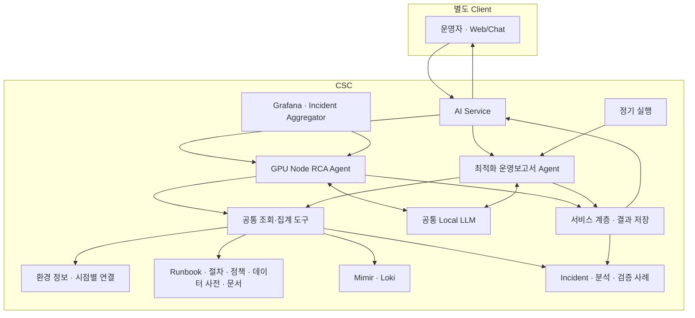

# DSX Knowledge Base — 설계 및 구현 제안

| 항목 | 내용 |
|---|---|
| 문서 버전 | 1.0 |
| 작성일 | 2026-09-14 |
| 대상 | DSX 개발팀, 아키텍처 검토자, Claude 사용자 |
| 목적 | 기존 RCA Runbook 설계를 검토하고, 두 Agent가 공유할 KB의 구성과 구현 계약을 제안한다. |
| 비교 대상 | `dsx-gpu-rca-runbook-design.md`, 「DSX GPU RCA 런북 — 설계 및 구현 가이드」 v1.0 |
| 범위 | Runbook, 조사·분석 절차, 정책, 데이터 사전, 참고 문서, 환경 정보 및 검증 사례 연결 |
| 상태 | 설계 제안. 아래 스키마·입출력·정책값은 구현 예시이며 배포·실환경 검증 결과가 아니다. |

## 1. 제안의 핵심

**DSX의 KB는 두 Agent가 어떤 증거를 수집하고, 어떤 조건으로 판단하며, 무엇을 권고할지 정하는 공통 지식 기반으로 구성한다.**

기존 설계의 장점인 PostgreSQL, 장비별 적용 조건, Fleet/GPUd 권고 재사용은 유지한다. 여기에 다음 세 가지를 보완한다.

1. **Runbook으로 판단하지 못할 때 실행할 조사 절차**를 준비한다.
2. **운영 최적화 분석에 필요한 정책·계산 정의·데이터 의미**를 함께 관리한다.
3. **출처·적용 조건·발행 버전·사용 증거**를 저장해 과거 판단을 설명할 수 있게 한다.

초기 구성은 PostgreSQL과 Git, 기존 Mimir·Loki, 공통 조회 도구면 충분하다. 별도 벡터 DB, 그래프 DB, 범용 온톨로지, 지식 종류별 마이크로서비스는 초기 요구에 포함하지 않는다.

## 2. 전제와 확인 수준

### 2.1 현재 DSX의 설계 기준

| 영역 | 이 문서가 따르는 기준 |
|---|---|
| Client | 사용자와 Web/Chat은 CSC 외부의 별도 Client 영역에 둔다. |
| CPC | GPU·Host 관측, Fleet Agent, KSM·Prometheus, Alloy 수집·전송 영역이다. |
| CPC → CSC | 사용자 설명상 전송 경로 구성은 완료된 상태다. 이 문서에서 다시 구축 대상으로 잡지 않는다. |
| CSC 관측 저장 | Mimir는 메트릭, Loki는 로그·이벤트를 조회한다. Object Storage 보존 정책은 별도 설정이다. |
| 장애 진입 | Grafana → Incident Aggregator → 저장 성공 후 신규·재발·심각도 상승 등 조건에 따라 RCA를 호출한다. |
| 사용자 요청 | Client → CSC의 AI Service → 목적에 맞는 Agent로 전달한다. |
| Agent | GPU Node RCA Agent와 최적화 운영보고서 Agent 두 개다. |
| 공통 기반 | 두 Agent는 조회·집계 도구, KB, Local LLM을 공유한다. |
| 조치 | Agent는 분석·권고를 제공한다. 운영 환경의 실제 변경은 운영자가 수행한다. |
| 자체 결과 저장 | 사건·분석·보고서 저장은 서비스 계층에서 수행한다. 인프라 읽기 전용과 자체 DB 저장은 양립한다. |

### 2.2 확인된 것과 확인해야 할 것

- 기존 설계 문서의 SQL·도구·Agent 예제는 검토했다. 문서에 있는 설치·조회·조치 명령을 실행한 것은 아니다.
- 로컬에 확보된 Fleet 소스의 특정 스냅샷에서는 Xid 이벤트에 `SuggestedActionsByGPUd`를 담는 코드를 확인했다. 이것이 현재 CPC 배포 버전과 일치하는지는 별도 확인이 필요하다.
- 기존 문서의 A100/V100 구성, 드라이버·DCGM 버전, IB 구성과 Pod 주소는 **첨부 문서가 보고한 환경 정보**다. 이 문서 작성 과정에서 실환경에 접속해 재검증하지 않았다.
- 코드에 기능이 존재하는 것, 배포된 수집기가 그 기능을 사용하는 것, CSC까지 필요한 필드가 도착하는 것은 서로 다른 확인 항목이다.
- SM 활동, GPU↔Pod 연결, 애플리케이션 처리량, 작업 수행 시간, K8s 이벤트·애플리케이션 로그는 실제 수집을 확인하기 전에는 사용할 수 있다고 가정하지 않는다.

## 3. 기존 설계의 채택·수정 사항

| 기존 제안 | 판단 | DSX 적용 방향 |
|---|---|---|
| PostgreSQL의 구조화된 Runbook | 채택 | 코드·조건 검색과 버전 관리의 중심으로 사용한다. |
| 장비 프로필로 적용 가능한 항목 필터링 | 채택·보완 | 하드웨어 외에 소프트웨어 버전, 관측 시각, 정보 부족 상태를 반영한다. |
| Fleet/GPUd의 권고 재사용 | 채택·보완 | 원본 권고·출처 버전을 보존하고 내부 운영 조건과 함께 검토한다. |
| 코드 미일치 시 전문검색 | 보완 | 증상별 조사 절차와 Mimir/Loki 조회까지 연결한다. |
| `(component, signature_code)`를 유일하게 유지 | 수정 | 동일 코드에 여러 적용 조건과 개정 버전이 존재하도록 한다. |
| `matched=false`인 GPU를 미존재 장비로 설명 | 수정 | 실제 불일치, 오래된 정보, 사건 당시 장비, 현재 접근 불가를 구분한다. |
| 검색에 안 나온 Runbook은 적용 불가 | 수정 | 미등록·검색 누락·조건 불일치·정보 부족·조회 실패를 구분한다. |
| 네 가지 `repair_actions`로 대응 표현 | 부분 채택 | 공급자 원본 분류로 보존하되 상세 점검·운영 권고의 표현을 그 네 가지로 제한하지 않는다. |
| `BLOCKED_BUILTIN_TOOLS`로 읽기 전용 보장 | 보완 | 도구 허용 목록, 조회 권한, 서버 입력 검증이 함께 보장해야 한다. SDK 설정 하나에 의존하지 않는다. |
| 두 소비자가 생기면 HTTP 서비스 분리 | 선택 | 기존 서비스 내 공통 모듈로 시작할 수 있다. 배포·권한·언어 경계가 필요하면 분리한다. |
| Claude Agent SDK와 강의 코드 재사용 | 조건부 | 실제 저장소·런타임을 먼저 확인한다. DSX의 공통 Local LLM 계약에 맞는 부분만 재사용한다. |
| Incident DB 연동은 후속 단계 | 수정 | 최초 실행부터 근거와 지식 버전을 저장한다. |
| 벡터 검색은 후속 단계 | 채택 | 실제 검색 실패 사례를 평가한 뒤 도입한다. 문서 수만으로 결정하지 않는다. |

기존 문서는 KSM 영역을 범위에서 제외했다. 따라서 운영 최적화 지식이 부족하다는 점은 해당 문서의 구현 결함이라기보다 **DSX 공통 KB로 확장할 때 추가해야 할 범위**다.

## 4. KB를 구성하는 다섯 가지 지식

| 지식 | 답하는 질문 | 예시 | 기준 저장 위치 |
|---|---|---|---|
| Runbook | 이 증상에 어떤 대응을 검토하는가? | Xid/SXid, DCGM 연결 불가, ECC 관련 점검·복구 확인 | PostgreSQL 발행 버전 |
| 조사·분석 절차 | 무엇부터 조회하고 다음에 무엇을 확인하는가? | GPU 접근 불가 조사, 저활동 분석, 반복 장애 비교 | Git의 YAML·코드 |
| 운영 정책 | 어느 조건에서 판단·권고하는가? | 관찰 기간, 반복 기준, 제외 대상, 점유 유지 예외 | PostgreSQL 버전별 설정 |
| 데이터 사전·조회 정의 | 데이터의 의미와 조회 방법은 무엇인가? | 실제 메트릭·라벨, 단위, PromQL·LogQL, 식별자 연결 | Git의 설정·코드 |
| 참고 문서 | 판단의 근거와 배경은 무엇인가? | NVIDIA 문서, 코드 설명, 내부 운영 지침 | Git 원문 + PostgreSQL 검색 인덱스 |

**환경 정보와 검증 사례는 이 지식에 연결하는 사실 데이터다.** 같은 PostgreSQL에 두어도 되지만, 일반 지식과 갱신 주기가 다르므로 논리적으로 구분한다.

- 환경 정보: 장비 구성, 버전, 데이터 수집 상태, 해당 시점의 Pod·GPU 관계.
- 검증 사례: 사건, 운영자 조치, 이후 상태, 확인된 결과.
- Agent의 미확정 원인 후보는 분석 이력으로 남긴다. 검증된 사례로 자동 승격하지 않는다.

### 4.1 기준 원본을 하나로 정한다

- Runbook과 정책은 PostgreSQL의 발행 버전이 실행 기준이다. SQL·JSON 시드는 초안 입력 수단이다.
- 절차·조회 정의·데이터 사전은 Git commit을 기준으로 배포한다.
- 참고 문서의 검색 인덱스는 Git 원문에서 재생성할 수 있어야 한다. 검색 인덱스를 직접 수정해 원문과 다른 지식으로 만들지 않는다.
- Runbook의 사람이 읽는 단계 설명과 실행 절차가 연결될 때에는 `procedure_id`와 해당 버전을 명시한다.
- 이 분류 때문에 별도 저장 서비스나 범용 워크플로 엔진을 추가할 필요는 없다.

## 5. 전체 동작 흐름



도식은 논리적 호출 관계다. 양쪽 Agent가 필요에 따라 도구와 LLM을 반복 호출하며, 조회 결과는 호출자에게 반환된다. 원시 메트릭·로그 저장은 기존 수집 경로를 사용한다.

## 6. 환경 정보: 적용 조건 판단의 기준

### 6.1 자산 식별과 시점

| 대상 | 권장 식별·관리 방식 |
|---|---|
| 클러스터 | `cluster_id` |
| 노드 | `cluster_id + node_id`; 가능하면 안정적인 machine 식별자를 사용하고 hostname은 별칭으로 보존 |
| 물리 GPU | GPU UUID와 노드 연결 이력. PCI 주소는 노드 범위의 보조 식별자 |
| GPU index | 관측 당시 번호로 보존. 영구적인 장비 식별자로 사용하지 않음 |
| MIG | 물리 GPU UUID와 인스턴스 식별자·유효 시점을 연결 |
| Pod | `cluster_id + pod_uid`; 이름만으로 재생성 전후를 합치지 않음 |
| Workload | 소유 관계를 따라 연결하고 당시 관계를 보존 |
| 프로젝트·팀 | Namespace와 별도 매핑. Namespace 이름만으로 조직 소유를 단정하지 않음 |

기존 `(node_id, gpu_index)`의 현재 값만 덮어쓰는 모델은 과거 사건을 설명하기 어렵다. 장비 교체·재배치 시 변경 이력을 보존한다. 모든 시계열을 복제할 필요는 없으며, 변경 시점별 스냅샷과 분석에 사용한 환경 스냅샷부터 시작할 수 있다.

### 6.2 프로필에 필요한 정보

```text
cluster_id, node_id, hostname
observed_at, valid_from, valid_to, source_ref
GPU 모델·아키텍처·개수, NVSwitch·NVLink 등 기능 지원 여부
driver_version, dcgm_version, fleet_version
GPU UUID·PCI 주소와 노드 연결
데이터별 수집 상태·최근 관측 시각·조회 범위
```

기능 지원과 관측 상태는 별도 필드로 둔다.

- 지원 여부: `supported / unsupported / unknown`
- 관측 상태: `available / stale / not_collected / query_failed / unknown`

값이 없다는 이유로 `false`나 `0`을 채우지 않는다. 기존 문서의 DCGM exporter 별도 수집 경로 역시 실제 Mimir 조회로 대상 노드와 시각을 확인한 뒤 `available`로 기록한다.

### 6.3 장비 확인 결과

`verify_device_identity`는 다음과 같이 응답한다.

| 상태 | 의미 | 다음 행동 |
|---|---|---|
| matched | 요청 시점의 식별 정보와 일치 | 해당 장비 조건으로 조사 |
| mismatch | 신뢰할 수 있는 동시점 정보와 충돌 | 식별 경로·원본 이벤트 확인 |
| unknown | 판정할 정보가 부족 | 정보 보완, 장비 특정 권고 보류 |
| stale | 보유 정보가 오래됨 | 사건 당시 정보 또는 최신 관측 확인 |

현재 장비 목록에서 GPU가 사라졌다는 사실은 접근 불가 사건의 단서일 수 있다. 이를 곧바로 테스트 이벤트나 오탐으로 분류하지 않는다.

## 7. PostgreSQL 데이터 모델

아래는 구현할 테이블의 계약 초안이다. 기존 Incident·환경 정보 모델이 있으면 해당 모델을 확장한다. 이 문서만을 위해 동일 데이터를 저장하는 테이블을 중복 생성하지 않는다.

### 7.1 최소 테이블 구성

| 논리 테이블 | 핵심 필드 | 제약·운영 방식 |
|---|---|---|
| `runbook_revision` | runbook_id, revision, status, component, signature_code, subcode, tags, applicability, required_evidence, recommendations, verification, sources | 기본키 `(runbook_id, revision)`. 발행 본문은 수정하지 않고 새 revision 생성 |
| `policy_revision` | policy_id, revision, scope, effective_from/to, parameters, exceptions, rationale | 기본키 `(policy_id, revision)`. 동일 범위·시점의 충돌을 발행 시 검증 |
| `document_section` | document_id, git_commit, section_id, title, text, tags, source_ref | 원문 버전과 절 위치가 식별돼야 함. 재생성 가능한 검색 데이터 |
| `asset_snapshot` | cluster_id, node_id, observed_at, valid_from/to, facts, source_ref | 과거 분석이 참조한 스냅샷을 보존 |
| `analysis_run` | run_id, incident_id 또는 report_id, target, period, status, evidence, findings, recommendations, knowledge_refs, runtime_versions | 결과는 서비스 계층에서 저장. 사용한 버전을 배열·JSONB로 보존 가능 |
| `case_review` | case_id, run_id, actual_action, observed_outcome, verification_status, reviewer, verified_at | 실제 조치와 효과가 확인된 사례를 구분 |

검색·연결에 반복 사용하는 값은 일반 컬럼으로 두고, 적용 조건·증거·권고처럼 형태가 다른 내용은 검증된 JSONB로 시작한다. JSONB 내부 값에도 애플리케이션 스키마 검증을 적용한다.

별도 GPU 연결 테이블이나 Pod 배치 테이블은 기존 데이터 모델을 우선 사용한다. 스냅샷 JSON으로 필요한 시점 조회·검증을 감당하기 어려워질 때 구조화한다.

### 7.2 Runbook 식별과 검색 인덱스

다음은 테이블 생성 후 적용할 인덱스 형태의 예시다. 전체 마이그레이션 파일은 아니다.

```sql
-- 기본키: PRIMARY KEY (runbook_id, revision)
-- 동일 오류 코드에 여러 Runbook·적용 조건·개정 버전이 존재할 수 있다.
CREATE INDEX runbook_lookup_idx
    ON knowledge.runbook_revision (component, signature_code, status);

-- document_section.search_vector는 원문 적재 과정에서 생성·갱신한다.
CREATE INDEX document_search_idx
    ON knowledge.document_section USING gin (search_vector);
```

`UNIQUE(component, signature_code)`는 사용하지 않는다. 최신 revision 번호만 고르는 대신, 실행 시작 시 발행 상태와 적용 시점을 기준으로 사용할 버전을 선택하고 고정한다.

### 7.3 Runbook 레코드 예시

아래는 Xid 79 조사용 **초안의 형식 예시**다. 실제 원인·조치의 확정 카탈로그가 아니다.

```json
{
  "runbook_id": "RB-GPU-XID-79",
  "revision": 1,
  "status": "draft",
  "component": "gpu.xid",
  "signature_code": "79",
  "title": "GPU 접근 불가 사건 조사",
  "tags": ["gpu_access_lost", "pcie"],
  "applicability": {
    "required_capabilities": ["nvidia_gpu"],
    "software_constraints": []
  },
  "required_evidence": ["event_identity", "gpu_access_state", "nearby_logs"],
  "procedure_id": "P-GPU-ACCESS-LOST",
  "recommendations": [
    {
      "type": "operator_check",
      "text": "대상 GPU와 발생 시각을 확인한다."
    }
  ],
  "verification": {
    "required_evidence": ["fresh_scoped_health_observation"],
    "policy_id": "POL-GPU-RECOVERY"
  },
  "sources": [
    {
      "kind": "vendor_document",
      "url": "https://docs.nvidia.com/deploy/xid-errors/analyzing-xid-catalog.html",
      "revision": "발행 전 확보한 원문 버전 또는 해시를 기록"
    }
  ]
}
```

실제 발행 시에는 필수 출처 버전, 절차 버전, 지원 범위, 증거와 권고 조건을 검토한다. 버전이 비어 있거나 자리표시자가 남은 초안은 발행하지 않는다.

### 7.4 발행 버전의 불변성

- 초안은 수정 가능하다.
- 발행 이후 본문·조건·출처를 바꾸려면 새 revision을 만든다.
- 발행 취소·폐기는 감사 이력을 남기며, 과거 분석에서 사용한 본문은 조회할 수 있어야 한다.
- DB 권한·트랜잭션·필요한 제약으로 발행 규칙을 강제한다. 프롬프트에만 규칙을 적지 않는다.
- 결과에는 Runbook ID만 저장하지 않고 revision과 내용 해시 또는 보존된 버전 참조를 저장한다.

## 8. 조회 API와 적용 조건 판정

### 8.1 공통 도구 계약

아래 명칭은 제안이다. 현재 프로젝트의 동일 기능이 있으면 재사용한다.

| 도구 | 입력 | 출력 |
|---|---|---|
| `get_asset_context` | 대상, 사건 시각 또는 기간 | 환경 스냅샷, 최신성, 데이터 가용성 |
| `verify_device_identity` | 대상 노드, 장비 참조, 사건 시각 | matched/mismatch/unknown/stale, 근거 |
| `lookup_runbooks` | 사건 특성, 환경 참조, 고정된 지식 버전 | 후보와 적용 상태, 부족한 증거 |
| `get_procedure` | 증상 또는 분석 주제, 버전 | 필요한 조회·분기·종료 조건 |
| `get_policy` | 정책 ID, 대상 범위, 기준 시점 | 선택된 정책 revision과 값 |
| `query_evidence` | query_id, 제한된 대상·기간·인자 | 검증된 수치·로그, 단위, 품질, 출처 |
| `search_knowledge` | 코드·태그·검색어, 범위 | 참고 문서·검증 사례, 버전·절 위치 |

Agent가 호출하는 저장소별 함수를 이 계약 아래 묶을 수 있다. 처음부터 일곱 개 HTTP 엔드포인트로 분리할 필요는 없다.

### 8.2 요청 예시

```json
{
  "purpose": "rca",
  "target": {"cluster_id": "cpc-example", "node_id": "node-example"},
  "event_time": "2026-09-14T01:00:00Z",
  "device_ref": {"type": "gpu_uuid", "value": "GPU-example"},
  "symptom": {"component": "gpu.xid", "signature_code": "79"},
  "run_id": "run-example-001"
}
```

호출자의 접근 가능 클러스터·Namespace는 인증된 서버 문맥에서 결정한다. LLM이 입력한 target만으로 접근 범위를 승인하지 않는다.

### 8.3 응답 예시

```json
{
  "query_status": "ok",
  "candidates": [
    {
      "runbook_id": "RB-GPU-XID-79",
      "revision": 1,
      "applicability": "unknown",
      "matched_conditions": ["component", "signature_code"],
      "missing_information": ["event_time_asset_identity"],
      "next_evidence": ["Q-ASSET-AT-TIME", "Q-GPU-ACCESS-STATE"]
    }
  ],
  "search_complete": true,
  "warnings": ["장비 식별을 확인하기 전에는 장비를 특정한 조치를 확정하지 않음"]
}
```

발행 검토가 끝난 뒤의 응답 형태를 보여주는 예시다. 앞 절의 초안 레코드를 실제로 반환했다는 뜻은 아니다.

### 8.4 상태를 구분한다

- 요청 상태: `ok / partial / failed`
- 후보 적용 상태: `applicable / inapplicable / unknown`
- 후보 없음의 이유: `no_registered_candidate / no_search_match`
- 관측 최신성: 응답의 증거별로 별도 표시

빈 배열 하나로 모든 상태를 표현하지 않는다. 부적합한 Runbook의 상세 실행 절차를 전달하지 않더라도, 제외 이유는 반환할 수 있다.

### 8.5 쿼리 방식

```sql
-- 값은 서버에서 바인딩한다. LLM이 SQL 문자열을 작성하지 않는다.
SELECT runbook_id, revision, applicability, required_evidence, procedure_id
FROM knowledge.runbook_revision
WHERE status = 'published'
  AND component = $1
  AND signature_code = $2;
```

이 SQL은 후보 검색만 담당한다. 서버가 실행에 고정한 버전과 비교하고, 장비·버전·증거 조건을 판정한다. 단순 조건은 SQL 뷰로 처리해도 된다. 다만 복잡한 버전 비교와 정보 부족 사유까지 하나의 뷰에 억지로 넣을 필요는 없다.

**강제할 것은 특정 뷰의 사용 자체보다, 모든 권고 경로가 같은 적용 조건 검사를 통과한다는 점이다.**

## 9. Runbook을 찾은 경우의 RCA 흐름

```text
Incident 또는 사용자 조사 요청
  → 대상·시각·원본 이벤트 정규화
  → 사건 당시 환경과 장비 식별 확인
  → 코드·하위 코드·조건으로 Runbook 후보 검색
  → 필수 증거 조회
  → 적용 조건 판정
  → 원인 후보·원본 공급자 권고·DSX 권고를 구분해 작성
  → 근거·한계·사용 버전과 함께 저장
```

형식이 정해진 Xid/SXid 로그는 결정적인 파서를 우선 사용한다. LLM은 자유로운 질문과 비정형 증상 해석에 사용하며 파싱 결과는 스키마로 검증한다.

### 9.1 `SuggestedActions`의 위치

1. 수집한 원본 필드와 Fleet 버전을 보존한다.
2. KB에 가져온 공급자 카탈로그의 출처·commit을 보존한다.
3. 두 내용이 다르면 원문과 차이를 표시하고 원인을 확인한다.
4. 내부 운영 정책은 수행 시점·영향 범위·사전 확인 조건을 보완한다.
5. LLM이 원본 값을 덮어쓰거나 출처 불일치를 숨기지 못하도록 출력 검증을 적용한다.

`is_upstream_hardcoded` 하나로 진실의 우선순위를 결정하지 않는다. 공급자 권고의 출처와 당시 배포 버전, 관측 상태가 함께 필요하다. Fleet와 GPUd가 같은 로직을 공유하면 두 개의 독립 근거로 세지 않는다.

### 9.2 복구 판정

`Healthy`, 알림 resolved, 데이터 없음만으로 사건을 복구 완료로 처리하지 않는다. 사건과 같은 대상·범위에 대해 최신 관측, 의미 있는 PASS 근거, 정책에서 정한 연속 충족 조건을 확인한다. 이 판정은 기존 Incident 상태 관리와 하나의 규칙으로 연결한다.

## 10. Runbook으로 판단하지 못하는 경우

이 흐름이 기존 Runbook 검색 설계에서 가장 우선적으로 보완할 부분이다.

### 10.1 조사 시작 조건

- 정확히 맞는 Runbook이 없음.
- 후보는 있으나 장비·버전 조건을 확인할 수 없음.
- 필수 증거가 부족하거나 서로 충돌함.
- Runbook의 예상 현상과 실제 관측이 다름.
- 최초 대응 이후에도 증상이 반복됨.

### 10.2 조사 절차 예시

다음 YAML은 조사 순서의 계약 예시다. 범용 DSL 엔진을 만들 필요는 없다. 초기에는 해당 ID의 등록 함수가 같은 흐름을 수행해도 된다.

```yaml
procedure_id: P-GPU-ACTIVITY-DROP
revision: 1
purpose: rca
trigger_tags: [gpu_activity_drop, cause_unknown]
steps:
  - id: coverage
    query_id: Q-OBSERVATION-COVERAGE
    on_insufficient: finish_with_missing_evidence
  - id: activity
    query_id: Q-GPU-ACTIVITY-WINDOW
  - id: workload_context
    query_id: Q-WORKLOAD-AT-TIME
    on_unavailable: record_missing_and_continue
  - id: nearby_logs
    query_id: Q-NODE-LOG-WINDOW
  - id: interpret
    handler: explain_supported_hypotheses
budget_policy_id: POL-RCA-QUERY-BUDGET
```

`Q-*`는 등록해야 할 논리 조회 ID이며 현재 환경의 메트릭명이나 구현 완료 도구가 아니다. 실제 수집 데이터와 연결하지 못한 조회는 `unavailable`을 반환한다.

### 10.3 Mimir/Loki 조회 범위

| 항목 | 제한 방식 |
|---|---|
| 대상 | 인증 범위 안의 클러스터·노드·장비·Pod |
| 시간 | 사건 전후 범위부터 시작하고 필요할 때 정책 한도 내 확대 |
| 결과량 | 시계열 수, 포인트 수, 로그 바이트·라인 수 제한 |
| 반복 | 실행 전체 조회 횟수·시간·토큰 예산 제한 |
| 추가 조회 | 어떤 후보의 어떤 부족한 증거를 확인하는지 이유 기록 |
| 종료 | 증거 충족, 데이터 확보 불가, 더 구분할 근거 없음, 예산 소진 |

초기 조회 한도는 실데이터 비용과 지연을 측정해 정한다. 고정된 횟수나 기간을 본 문서에서 운영 확정값으로 제시하지 않는다.

### 10.4 결과 예시

> GPU 활동 감소는 확인됐다. 같은 시간의 Pod 재시작은 확인되지 않았다. 메모리 점유는 유지됐으나 애플리케이션 요청량과 입출력 지표는 확보하지 못했다. 작업 대기 또는 실행 중 정체가 후보이며, 병목 위치는 확정하지 않는다. 다음 확인 항목은 요청 유입과 작업 진행 로그다.

이런 결과도 유효한 조사 산출물이다. 원인을 확정할 수 없는 경우 **무엇을 배제했고 무엇이 부족한지**를 남겨 운영자의 다음 확인을 줄인다.

## 11. 운영 최적화 Agent에서의 사용

### 11.1 초기 분석 주제와 KB 연결

| 분석 주제 | 구체적인 사례 | 출력 인사이트 | 필요한 데이터·지식 |
|---|---|---|---|
| 저활동 구간 | 특정 CPC의 야간 GPU 활동이 낮음 | 시간대별 사용·예약 정책 검토 대상 | GPU 활동, 관측 품질, 예약·대기 예외 |
| 할당과 활동 차이 | GPU를 할당받은 작업의 활동이 장기간 낮음 | 점유 유지 필요성 확인 대상 | GPU 요청·할당, 당시 연결, 활동, 작업 목적 |
| 배치 제약 | 여유 GPU가 있어도 GPU 요청 Pod가 미배치 | 용량과 배치 조건을 함께 점검 | GPU 자원, Pod 조건·상태, 가용한 스케줄링 증거 |
| 기간 변화 | 전주보다 활동이나 전력이 달라짐 | 비교 가능한 대상에서 변화와 추가 확인 요인 제시 | 동일 장비 집단, 관측 누락, 작업량·구성 변경 |
| 반복 장애 | 특정 노드·GPU에 사건이 집중 | 예방 점검 우선순위 | 중복 제거된 Incident, 노출 기간, 검증된 RCA |
| Namespace·Workload 점유 | 일부 Workload가 장기간 자원을 점유 | 대상별 점유 패턴과 운영 확인 사항 | 요청·할당 이력, 소유 관계, 팀·프로젝트 매핑 |
| GPU 간 활동 편차 | 동일 작업에 연결된 GPU의 활동이 다름 | 병렬 처리·작업 분배 추가 점검 | 실제 작업 연결, GPU별 활동, 필요 시 프로파일링 |
| 고활동과 미배치 동시 발생 | 바쁜 GPU 집단과 GPU 요청 Pending Pod가 함께 존재 | 용량·배치 제약 분석 후보 | 활동, 요청량, 자원 적합성·스케줄링 조건 |
| 저활동 중 전력 | 활동이 낮은 동안 전력 사용이 지속 | 전력 운영 검토 대상과 적용 조건 | 전력 시계열, 활동, 예약, 장비 전력 특성 |
| 관측 품질 | 특정 노드의 장시간 결측 | 분석 신뢰 범위와 수집 개선 대상 | 시계열 최신성·커버리지, 수집기 상태 |

관측 품질은 모든 분석의 선행 조건이다. 표의 필요 데이터가 없으면 해당 주제의 결과 범위를 줄이거나 실행 불가 사유를 반환한다.

### 11.2 반드시 구분할 의미

- GPU utilization, SM 활동, 메모리 점유, 메모리 읽기·쓰기 활동은 구분한다.
- 할당 GPU 시간은 실제 연산량이나 낭비량과 같지 않다.
- 높은 GPU 활동만으로 효율적 실행·정상 처리·용량 포화를 확정하지 않는다.
- 낮은 활동만으로 자원 회수나 replica 축소를 권고하지 않는다. 작업·예약·서비스 조건을 확인한다.
- 처리량·지연·작업 완료 시간이 없으면 성능 개선 효과를 수치로 확정하지 않는다.
- MIG·시간 공유 집계에서는 물리 GPU 중복 계산을 피한다.
- 결측은 0으로 바꾸지 않는다. 기간 비교는 관측 가능한 동일 집단을 기준으로 한다.

### 11.3 정책과 계산의 분리

```text
계산 코드: 데이터 유효 시간, 기간 평균, 분포, 증가량, 대상별 집계
정책 설정: 관찰 기간, 비교 기준, 예외 대상, 권고 전 확인 조건
LLM: 확인된 수치와 정책·사례를 연결해 설명과 권고 작성
```

예를 들어 예약형 추론 서비스는 요청이 없어도 모델을 상주시킬 수 있다. KB에는 이런 예외를 기록하고, 요청량 정보가 없으면 '회수 가능' 대신 '점유 유지 필요성 확인 대상'으로 출력한다.

## 12. 데이터 사전과 조회 정의

각 조회 정의에는 다음 정보를 둔다.

| 필드 | 내용 |
|---|---|
| query_id / revision | 안정적인 ID와 변경 버전 |
| purpose | 어떤 증거 또는 계산을 얻는가 |
| backend | Mimir, Loki, PostgreSQL |
| required_inputs | 대상·기간·집계 수준 |
| actual_query | 검증된 PromQL·LogQL 또는 SQL 템플릿 |
| identity | 라벨과 실제 자산·Pod 식별자의 연결 방식 |
| value_semantics | 단위, gauge/counter, 물리 GPU/인스턴스 범위 |
| quality_rules | 결측, 오래된 샘플, counter reset, 부분 결과 처리 |
| limits | 조회 기간·결과량·실행 시간 상한 |
| output_schema | 결과 구조·단위·출처·품질 |

Mimir에는 메트릭을, Loki에는 로그·이벤트를 조회한다. 검색하고 싶은 로그가 실제로 Loki에 들어오는지 먼저 확인한다. 'Prometheus까지 올라가 조사한다'는 사용자 의도는 중앙 장기 조회가 가능한 경우 Mimir의 제한된 기간 조회로 구현할 수 있다. 현장 Prometheus 직접 조회는 중앙 데이터의 공백을 보완해야 하고 접근이 허용된 경우에 별도 정의한다.

쿼리 템플릿은 운영 라벨과 샘플 데이터로 검증한 뒤 등록한다. 그 전에 익숙한 DCGM 메트릭 이름을 문서에 적었다는 이유로 수집 가능하다고 처리하지 않는다.

## 13. 검색과 참고 자료 관리

### 13.1 검색 순서

1. 코드·하위 코드·component의 정확 검색.
2. 증상 태그와 별칭 검색.
3. 장비·버전 적용 조건 판정.
4. 문서 전문검색과 검증 사례 검색.
5. 평가에서 의미 검색의 필요가 확인되면 벡터 검색 추가.

`simple` 전문검색 사전은 한국어 형태소 분석기 역할을 하지 않는다. 예를 들어 표현이나 띄어쓰기가 달라지는 실제 운영 질문을 평가 세트에 넣고 검색 누락을 확인한다. 벡터 검색을 추가하더라도 장비·버전 조건 검사는 유지한다. 임베딩 차원은 선택한 모델에 맞춰 정하며 미리 특정 숫자로 고정하지 않는다.

### 13.2 출처 관리

| 출처 | 보존할 정보 |
|---|---|
| 공식 문서 | URL, 문서 버전 또는 확보 시각·내용 해시, 절 위치 |
| Fleet/GPUd 코드 | 저장소, commit, 파일·함수·카탈로그 위치 |
| 내부 운영 지침 | 작성자·검토자, 개정 이력, 적용 조직·환경 |
| 검증 사례 | 관련 사건, 실제 조치, 결과, 검증자·시각 |

원문이 바뀌면 기존 내용을 덮어쓰지 않고 새 초안을 만든다. 라이선스·접근 범위에 맞게 확보한 원문 또는 발췌를 보존한다. 검색 인덱스에는 그 출처를 연결한다.

## 14. 결과 저장과 지식 개선

### 14.1 실행 결과 계약

```json
{
  "run_id": "run-example-001",
  "status": "completed_with_limitations",
  "target": {"cluster_id": "cpc-example", "node_id": "node-example"},
  "period": {"start": "2026-09-14T00:45:00Z", "end": "2026-09-14T01:15:00Z"},
  "facts": [],
  "hypotheses": [],
  "recommendations": [],
  "missing_evidence": ["application_request_rate"],
  "evidence_refs": [],
  "knowledge_refs": {
    "runbooks": [{"id": "RB-GPU-XID-79", "revision": 1}],
    "policies": [],
    "procedure_git_commit": "example-commit",
    "documents": []
  },
  "runtime_versions": {
    "model": "selected-local-model-version",
    "prompt": "rca-prompt-v1",
    "query_definitions": "example-commit",
    "service": "example-build"
  }
}
```

이 예시는 구조만 보여준다. 실제 결과의 사실·후보·권고에는 각각의 증거 ID와 판정 이유가 있어야 한다. 근거 없는 숫자 확률을 신뢰도로 붙이지 않는다.

### 14.2 남겨야 할 증거

- 실제 조회 ID·버전·인자, 조회 시각과 데이터 대상 기간.
- 판단에 사용한 핵심 수치·단위·커버리지, 필요한 로그 발췌.
- 원본 Mimir/Loki 조회 링크 또는 재조회 조건.
- 환경 스냅샷과 지식 버전.
- 상충하는 근거, 데이터 누락, 조사 종료 이유.

원시 관측 데이터는 기존 저장소에서 보존한다. 분석 결과에는 핵심 증거 스냅샷을 남겨 원천 보존 기간 이후에도 판단을 설명할 수 있게 한다. 동일 버전만 기록한다고 비결정적인 LLM 출력까지 완전히 재현되는 것은 아니므로 실제 출력도 보존한다.

### 14.3 지식 개선 흐름

```text
Agent 분석·권고
  → 운영자 검토
  → 실제 수행 내용과 이후 상태 기록
  → 결과 검증
  → 재사용 사례 등록
  → 필요하면 Runbook·절차·정책 개정 초안
  → 검토·발행
```

Agent가 새 Runbook 초안을 제안할 수는 있다. 자신의 추론 결과를 발행 지식으로 자동 등록하지 않는다.

## 15. 구현 배치와 책임

### 15.1 기존 코드에 우선 배치

```text
기존 서비스
  ├─ KB 조회·적용 조건 판정 함수
  ├─ 등록된 메트릭·로그·사례 조회 함수
  ├─ RCA 절차 실행
  ├─ 운영 분석 절차 실행
  └─ 결과 검증·저장

Git 관리 자료
  ├─ 조사·분석 절차
  ├─ 데이터 사전·쿼리 정의
  └─ 참고 문서

기존 PostgreSQL
  ├─ KB 발행 버전·검색 인덱스
  ├─ 환경 정보 또는 기존 인벤토리 참조
  └─ Incident·분석·검증 사례
```

실제 저장소와 언어를 확인한 뒤 경로를 정한다. 위 구조를 그대로 새 모노레포나 서비스로 생성하라는 의미는 아니다.

### 15.2 책임 경계

| 구성 요소 | 책임 |
|---|---|
| 공통 조회 도구 | 권한·대상·기간 검증, 쿼리 실행, 단위·품질 반환 |
| 적용 조건 판정 | 장비·버전·필수 증거 검사, 적용 상태와 사유 반환 |
| 절차 실행 코드 | 순서·분기·조회 한도·종료 관리 |
| 계산 코드 | 수치 집계·비교·명시적인 정책 조건 판정 |
| Local LLM | 질문 해석, 허용된 조사 선택 보조, 후보별 증거 해석, 설명·권고 작성 |
| 결과 서비스 | 출력 스키마·근거 연결 검증, 저장·조회 |
| 운영자 | 지식 발행 검토, 실제 운영 조치, 결과 확인 |

조회 계정은 필요한 읽기 권한만 부여한다. 결과 저장과 KB 발행에는 별도 서비스 권한을 사용한다. KB 본문에 운영자용 명령 예시가 있더라도 Agent가 실행할 수 있는 도구 권한으로 해석하지 않는다.

## 16. 구현 순서와 완료 조건

| 단계 | 작업 | 완료 조건 |
|---|---|---|
| 1. 계약 확인 | 실제 이벤트 필드·Fleet 버전·자산 식별·Mimir/Loki 샘플 확인 | 입력 예시와 수집 가능 항목 목록 확보 |
| 2. 최소 저장 | Runbook·정책 버전, 분석 결과·증거 저장 | 발행 버전을 고정한 결과를 저장·조회 가능 |
| 3. 알려진 오류 | 대표 Xid와 장비 조건이 다른 사례 연결 | 매칭·정보 부족·조건 불일치가 구분됨 |
| 4. 원인 불명 조사 | 증상 절차 하나와 제한된 조회 연결 | Runbook 미일치 이후 실제 증거 조회와 종료까지 동작 |
| 5. 운영 분석 | 저활동과 관측 품질부터 연결 | 데이터 부족 시 한계를 표시하고 근거 있는 검토 대상 출력 |
| 6. 사례 피드백 | 운영자 처리 결과와 지식 개정 연결 | 미확정 분석과 검증 사례가 구분됨 |
| 7. 지원 확대 | 반복 장애·배치·전력 등 순차 추가 | 주제별 필수 데이터와 평가 사례 충족 |

구현 일정은 실제 저장소 재사용 범위와 데이터 접근 상태를 확인한 뒤 산정한다. 문서만으로 분·시간 단위 완료를 약속하지 않는다.

## 17. 최소 평가 시나리오

| 시나리오 | 기대 결과 |
|---|---|
| 알려진 코드 + 조건·증거 충족 | 맞는 발행 버전과 근거를 연결해 권고 |
| 같은 코드 + 서로 다른 장비 조건 | 대상에 맞는 후보만 적용 가능으로 판정 |
| 미등록 코드 | 무응답으로 끝나지 않고 증상 절차 또는 정보 부족 결과로 연결 |
| 필요한 기능·드라이버 정보 없음 | 적용 가능으로 추정하지 않고 unknown 반환 |
| 현재 GPU 미조회 + 과거 사건 존재 | 사건 시점의 장비 연결을 확인하고 현재 미조회 이유 조사 |
| 동명 노드가 다른 CPC에 존재 | 서로의 환경·사건이 섞이지 않음 |
| 메트릭 결측 | 0% 활동이나 정상 상태로 해석하지 않음 |
| Runbook과 Fleet 권고 충돌 | 원본·버전·차이를 보존해 보고 |
| 이전 분석 뒤 Runbook 개정 | 이전 결과가 이전 revision을 계속 참조 |
| 예약형 서비스의 저활동 | 자원 회수를 확정하지 않고 예약·요청 조건 확인 |
| 지원하지 않는 GPU↔Pod 연결 | Workload별 사용량을 임의로 배분하지 않음 |
| 조회 실패·부분 결과·예산 소진 | 상태·사용한 증거·미확인 사항을 저장 |
| LLM이 허용 밖 도구·대상을 요청 | 서버에서 거부하고 허용된 범위로 처리 |
| 미검증 분석의 사례 검색 | 검증 완료 사례와 구분돼 반환 |

평가 지표는 정확 검색 성공률, 적용 조건 오판정, 근거 없는 권고, 부족한 정보 표시, 조회 비용·지연으로 시작한다. 수치 목표는 초기 사례 세트로 기준선을 측정한 뒤 정한다.

## 18. 후속 검토에서 결정할 사항

이 문서를 전달받은 검토자가 다음을 확인하면 구현안을 확정할 수 있다.

1. **기존 코드 재사용:** 실제 저장소의 언어·DB·공통 도구·Agent 실행기를 확인하고 재사용 위치를 제시한다.
2. **데이터 계약:** 배포 Fleet 버전과 CSC 도착 이벤트의 필드, 대상 식별자·시각·권고 필드를 대조한다.
3. **지식 저장:** 기존 Incident·인벤토리 모델과 제안 테이블 중 중복되는 부분을 정리한다.
4. **조건 판정:** SQL로 처리할 조건과 코드에서 처리할 조건, 정보 부족 표현을 확정한다.
5. **대표 흐름:** 알려진 오류·원인 불명 조사·운영 분석 각각 한 건의 실제 입력과 기대 출력을 만든다.
6. **운영 설정:** 정책 우선순위, 조회 한도, 보존 기간, 지식 발행 담당자를 정한다.
7. **검증 결과:** 확인된 사항, 설계 제안, 아직 데이터가 없어 확인할 수 없는 사항을 구분해 기록한다.

후속 구현은 이 검토 결과에 맞춰 진행한다. 특정 SDK·웹 프레임워크·새 서비스 분리를 먼저 확정할 필요는 없다.

## 19. 참고 자료

- 비교 문서: `dsx-gpu-rca-runbook-design.md` — 「DSX GPU RCA 런북 — 설계 및 구현 가이드」 v1.0, 2026-09-14. 별도로 전달받은 문서다.
- 내부 설계 근거: DSX의 Client/CPC/CSC 분리, 두 Agent·공통 Local LLM·공통 조회 도구, KB 구성에 대한 2026-09-14 논의. 필요한 전제는 본 문서 §2에 포함했다.
- [NVIDIA Xid 카탈로그](https://docs.nvidia.com/deploy/xid-errors/analyzing-xid-catalog.html): 장비별 적용 여부, 즉시 대응·조사 대응·발생 조건을 구분한다.
- [NVIDIA GPU Node Triage](https://docs.nvidia.com/deploy/gpu-debug-guidelines/gpu-node-triage.html): GPU 장애 조사 지침의 원천 자료다.
- [Fleet Intelligence Agent](https://github.com/dsx-ai-factory/fleet-intelligence-agent): 수집·진단 구현을 확인할 원천 저장소다.
- [검토한 Fleet 소스 스냅샷의 Xid 이벤트 구성](https://github.com/dsx-ai-factory/fleet-intelligence-agent/blob/1ba38d09c10252bc7b243ced9034825e660d5183/third_party/fleet-intelligence-sdk/components/accelerator/nvidia/xid/component.go#L471): 로컬 확보 소스에서 권고 필드 연결을 확인한 위치다. 현재 배포본과 동일하다는 뜻은 아니다.
- [GPUd](https://github.com/leptonai/gpud): 공급자 카탈로그·권고 로직의 출처 관계를 확인할 자료다.
- [Mimir HTTP API](https://grafana.com/docs/mimir/latest/references/http-api/): 시점·기간 메트릭 조회 계약의 근거다.
- [Loki HTTP API](https://grafana.com/docs/loki/latest/reference/loki-http-api/): 로그 조회 계약의 근거다.
- [PostgreSQL JSON](https://www.postgresql.org/docs/current/datatype-json.html): 구조화된 가변 내용 저장을 검토할 문서다.
- [PostgreSQL 전문검색 사전](https://www.postgresql.org/docs/current/textsearch-dictionaries.html): `simple` 사전의 동작과 검색 구성의 근거다.

웹 문서는 바뀔 수 있다. 실제 KB 발행 시 사용한 버전·확보 시각·내용 해시를 별도로 남긴다.
