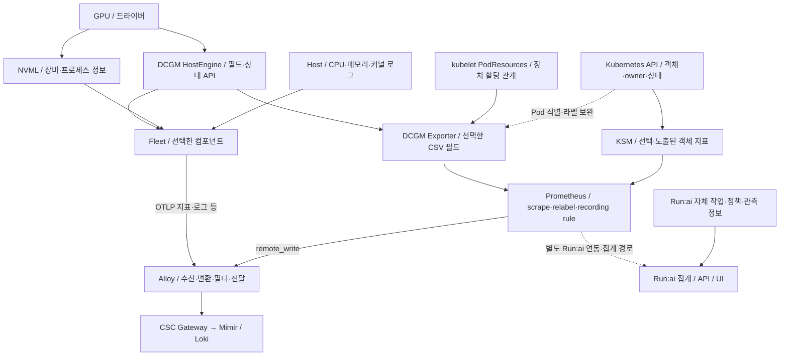

# DSX 공통 데이터 기반 — 수집 경로, 메트릭, 객체 정보 조사

**적용 기준:** 이 문서는 지원 기능과 수집 근거를 관리한다. 상태·식별·시간·집계·판정 및 운영 사례는 [두 Agent 공통 판단 기준 v1.0](<DSX_Agent_공통판단기준과_인사이트사례_v1.0.md>)을 따른다. 최신 운영 계획과 KSM 역할 자료는 설계 참고로 반영하며 실제 추가 수집 완료 증거로 사용하지 않는다.

기준일: 2026-09-15 · 대상: CPC-1·CPC-2 / CSC · 용도: 운영보고서 Agent와 RCA Agent의 공통 데이터 설계

이 문서는 제공된 설정·조회 표본, 프로젝트 기술기록, NVIDIA·Run:ai 공식 문서와 Fleet 참고 소스를 대조한 조사 결과다. 운영 클러스터의 설정 변경·추가 수집·원격 조회는 수행하지 않았다. 두 CPC의 CSC 조회 환경과 Pod↔GPU UUID 매핑 활용 가능은 사용자 최신 확인을 전제로 유지한다.

## 1. 조사 결과: 무엇이 무엇에서 데이터를 가져오는가

**Fleet가 DCGM Exporter의 전체 지표 중 일부를 골라 읽는 구조로 이해하면 정확하지 않다.** 확인한 Fleet 구현은 DCGM HostEngine에 직접 연결하여 컴포넌트별로 지정한 필드를 조회한다. DCGM Exporter도 DCGM을 사용하는 별도 경로다.

Run:ai는 하나의 GPU 센서가 아니라 관측·스케줄링·작업 메타데이터를 연결하는 플랫폼이다. 공식 문서에서 확인한 GPU profiling 경로는 **DCGM Exporter → Prometheus → Run:ai recording rule 집계 → API/UI**다. 이 경로를 모든 Run:ai 지표의 수집 방식으로 일반화하지 않는다.

따라서 다음 세 가지는 동시에 성립한다.

- DCGM이 지원하지만 Exporter 설정에서 선택하지 않은 필드가 있다.
- Exporter의 기본 파일에는 없지만 Fleet 컴포넌트에서 조회하는 필드가 있다.
- 원본 지표가 Prometheus에 있어도 Run:ai 집계나 화면에는 나타나지 않을 수 있다.

근거: [Fleet 공식 설정](https://docs.nvidia.com/fleet-intel/agent/configuration/), [Fleet 서버 초기화 코드](https://github.com/NVIDIA/fleet-intelligence-agent/blob/8dd8826b7604386ad667125298156ddb1d1a7865/internal/server/server.go#L277), [Run:ai profiling 수집·집계 설명](https://run-ai-docs.nvidia.com/saas/platform-management/monitor-performance/gpu-profiling-metrics).

## 2. ‘수집 가능한 전체 지표’는 한 목록으로 결정되지 않는다

| 단계 | 무엇을 뜻하는가 | 확정에 필요한 근거 |
|---|---|---|
| ① DCGM 기능 범위 | 해당 DCGM 버전이 정의한 필드·API | 버전별 Field Identifiers / API 명세 |
| ② 장비 지원 범위 | GPU·MIG·NVSwitch·드라이버·권한에서 실제 읽을 수 있는 항목 | 대상 장비의 지원 여부·유효 반환 값 |
| ③ 수집기 선택 범위 | Exporter CSV, Fleet 컴포넌트 등이 조회하도록 선택한 항목 | 실행 중 설정·버전·실제 선택 파일 |
| ④ 수집기 출력 범위 | `/metrics`, OTLP, 이벤트에 실제로 나온 항목 | 이름·HELP/TYPE·라벨·값·시각을 포함한 출력 |
| ⑤ 중앙 저장 범위 | scrape·relabel·전송·수신을 통과해 Mimir/Loki에 남은 항목 | 중앙 조회와 원본 대조 |
| ⑥ 분석·화면 제공 범위 | 집계 규칙·API·UI 또는 Agent가 사용할 수 있는 항목 | 단위·시간·관계·권한·품질을 맞춘 결과 |

**①이나 ③ 목록을 ⑤의 실제 수집 완료 목록으로 사용하면 안 된다.** 한 장비에서 성공한 필드가 다른 GPU 모델에서도 유효하다는 보장도 없다.

DCGM 전체 필드의 공식 목록은 존재한다. 다만 숫자뿐 아니라 버전·식별자·토폴로지·구조화 정보도 포함하며, 그 목록 전체가 동일한 방식의 Prometheus 숫자 메트릭은 아니다. 최신 명세의 이름과 배포 버전의 이름이 다를 수도 있다. [NVIDIA DCGM Field Identifiers](https://docs.nvidia.com/datacenter/dcgm/latest/dcgm-api/dcgm-api-field-ids.html)

이번 조사에서는 현재 Exporter 이미지 태그에 대응하는 기본 CSV와, 버전을 고정한 Fleet 소스의 숫자 메트릭 선언을 별도로 대조했다. **107개 이름의 참고 대조표**를 [별첨 목록](<DSX_GPU_메트릭_참고대조목록_2026-09-15.md>)으로 제공한다. 이 107개는 전체 DCGM 지원 개수나 현재 수집 개수가 아니다.

## 3. 실제 경로와 별도 정보를 함께 본 구조

아래는 소스 역할을 설명하는 논리도다. Run:ai 경로는 공식 문서상 지원 구조이며 현재 DSX 중앙 연동 완료를 뜻하지 않는다. 기존 구성요소 안에서 어떤 경로가 활성화됐는지는 실행 설정을 기준으로 한다.



핵심은 **공통 원천인 DCGM에서 Exporter와 Fleet로 갈라진다**는 점이다. Fleet의 Host·커널 이벤트, KSM의 객체 정보, Run:ai의 quota·작업 정책은 DCGM Exporter의 부분집합이 아니다.

DSX에서는 사용자 확인에 따라 두 CPC의 Fleet·KSM 정보를 CSC에서 조회하고 매핑도 활용한다. Run:ai 데이터가 같은 Mimir tenant에 도착한다고는 아직 확인하지 않았다. 이전 기록의 Run:ai Prometheus remote_write는 별도 계통이며 현재 연동·보존 설정의 확정 근거로 소급 사용하지 않는다.

## 4. DCGM Exporter는 무엇을 선택하고 무엇을 출력하는가

### 4.1 이번 환경에서 확인한 설정

제공 표본에는 두 워커의 Exporter와 다음 항목이 있다.

| 항목 | 표본 값 | 의미 |
|---|---|---|
| 이미지 | `nvcr.io/nvidia/k8s/dcgm-exporter:4.4.2-4.7.0-distroless` | 이번 기본 설정 대조의 버전 기준 |
| 포트 | 9400 / metrics | Prometheus 형식의 노출 경로 |
| Kubernetes 매핑 | `DCGM_EXPORTER_KUBERNETES=true` | PodResources 관계 연결 기능 활성 설정 |
| HostEngine | `DCGM_REMOTE_HOSTENGINE_INFO=nvidia-dcgm:5555` | Exporter의 DCGM 연결 대상. HTTP 메트릭 서버가 아님 |
| 소켓 마운트 | `/var/lib/kubelet/pod-resources` | 로컬 장치 할당 관계 조회 기반 |

실제 연결 대상의 노드 대응과 HostEngine 버전은 해당 실행 환경에서 확인해야 한다. Exporter 이미지 태그만으로 원격 HostEngine의 실행 버전을 확정하지 않는다.

### 4.2 선택은 collectors 파일에서 이루어진다

대조한 버전의 실행 옵션은 `--collectors` 또는 `-f`, 환경변수는 `DCGM_EXPORTER_COLLECTORS`다. 기본 파일 경로는 `/etc/dcgm-exporter/default-counters.csv`이며 별도 ConfigMap 입력도 지원한다. 기본 수집 간격은 30,000ms로 선언돼 있으나 실제 간격은 실행 설정을 따른다. [Exporter 4.4.2-4.7.0 실행 옵션](https://github.com/NVIDIA/dcgm-exporter/blob/4.4.2-4.7.0/pkg/cmd/app.go)

**제공된 설정 조회는 실제 선택 파일을 확정하기에 부족하다.** 첨부 명령의 환경변수 필터는 `DCGM_EXPORTER_KUBERNETES*`, `DCGM_EXPORTER_POD_RESOURCES*`, `DCGM_EXPORTER_CONFIG*`, `DCGM_REMOTE_HOSTENGINE_INFO`만 선택한다. 그래서 중요한 `DCGM_EXPORTER_COLLECTORS`와 `DCGM_EXPORTER_INTERVAL`이 출력에서 제외된다.

또 이 버전의 소켓 경로 환경변수는 `DCGM_POD_RESOURCES_KUBELET_SOCKET`으로, 첨부 필터의 `DCGM_EXPORTER_POD_RESOURCES*`와 다르다. `args=null`도 이미지 기본 실행 인자·내장 설정까지 없다는 뜻은 아니다. 이 자료만 보고 기본 CSV를 그대로 사용 중이라고 확정할 수 없다.

### 4.3 해당 버전의 기본 CSV에서 확인한 차이

| 항목 | 4.4.2-4.7.0 기본 CSV | 해석 |
|---|---|---|
| GPU utilization | 활성 | 기본 선택 대상 |
| VRAM used/free/reserved | 활성 | 메모리 용량 관측 |
| GPU·메모리 온도, 실제 전력·누적 에너지 | 활성 | 대상 장비 지원·유효 값은 별도 |
| GR engine, Tensor, DRAM activity | 활성 | 일부 profiling 항목은 기본 선택 |
| SM activity / SM occupancy | **주석 처리** | 기본 파일 기준으로 별도 선택 필요 |
| FP16 / FP32 / FP64 activity | 주석 처리 | 추가 profiling 후보 |
| ECC 4종, retired pages, 일부 NVLink 오류 | 주석 처리 | 지원 여부와 별개로 기본 선택에서 제외 |
| Xid 값 | 활성 gauge | 마지막 오류 코드이며 사건 횟수가 아님 |
| 드라이버 버전 | 활성 label | 숫자 지표가 아니라 라벨 보강 |

해당 파일은 **활성 숫자 지표 25개 + 활성 라벨 필드 1개**다. 주석 항목까지 포함한 고유 식별자는 61개이며, 이것은 Exporter가 지원하는 전체 필드 수가 아니다. 다른 CSV나 사용자 설정을 사용하면 목록이 바뀐다. [버전을 고정한 기본 CSV](https://github.com/NVIDIA/dcgm-exporter/blob/4.4.2-4.7.0/etc/default-counters.csv)

### 4.4 Pod 연결과 Pod UID는 별도 옵션이다

같은 버전에서 `DCGM_EXPORTER_KUBERNETES_ENABLE_POD_UID`는 별도 옵션이며 기본값은 false다. 따라서 GPU↔Pod 이름 매핑이 성공해도 UID가 비어 있을 수 있다. 이전 표본의 빈 UID를 곧바로 매핑 전체 실패로 해석하지 않는다. 실제 UID 수집을 적용하려면 해당 버전의 옵션·객체 조회·권한을 함께 확인한다. 이 조사에서는 설정을 변경하지 않았다. [동일 버전 실행 옵션](https://github.com/NVIDIA/dcgm-exporter/blob/4.4.2-4.7.0/pkg/cmd/app.go)

## 5. Fleet Intelligence Agent는 어떻게 수집하는가

### 5.1 DCGM에 직접 연결하는 구현

참고 소스 commit `8dd8826b7604386ad667125298156ddb1d1a7865`에서는 다음 흐름을 확인했다. 운영 중 이미지와 이 commit의 동일성까지 확인한 것은 아니다.

```text
NVML instance와 DCGM instance 생성
  → 활성 컴포넌트 등록
  → 컴포넌트가 요구하는 DCGM 필드 watch 구성
  → 지원 필드 조회·지표/상태/사건 생성
  → 로컬 metrics/event store
  → lookback 범위의 데이터를 export payload로 구성
  → OTLP 등 설정된 전송 경로
```

DCGM 연결은 `DCGM_URL`을 해석해 `dcgm.Init(dcgm.Standalone, ...)`을 호출한다. exporter collector는 DCGM Exporter HTTP endpoint를 스크랩하는 대신 Fleet의 metrics store에서 데이터를 읽는다. [DCGM 연결 구현](https://github.com/NVIDIA/fleet-intelligence-agent/blob/8dd8826b7604386ad667125298156ddb1d1a7865/third_party/fleet-intelligence-sdk/pkg/nvidia-query/dcgm/instance.go#L250), [전송 데이터 구성 구현](https://github.com/NVIDIA/fleet-intelligence-agent/blob/8dd8826b7604386ad667125298156ddb1d1a7865/internal/exporter/collector/collector.go#L205)

### 5.2 Fleet에서도 선택과 제외가 일어난다

| 위치 | 무엇이 달라지는가 |
|---|---|
| `--components` / Helm `components` | 전체 또는 명시된 컴포넌트 활성화, 특정 컴포넌트 제외 |
| 컴포넌트 소스의 필드 목록 | 그 컴포넌트가 요청하는 DCGM 필드 선택 |
| 하드웨어 검증·초기화 | 미지원 필드, 초기화 실패 등에 따른 실제 watch 차이 |
| `FLEETINT_INCLUDE_METRICS/EVENTS/...` | 전송 payload에 포함할 데이터 종류 |
| check / collect interval과 lookback | 측정·상태 확인·전송 시각과 포함 구간 |
| 후단 Alloy·Mimir | 필터·변환·라벨·수신 제한에 따른 중앙 데이터 차이 |

공식 문서의 `components: all,-accelerator-nvidia-dcgm-prof`는 profiling을 제외하는 **설정 예시**다. 현재 DSX가 그 설정이라는 뜻은 아니다. [Fleet 설정과 컴포넌트 선택](https://docs.nvidia.com/fleet-intel/agent/configuration/)

### 5.3 소스에서 확인한 메트릭 범위

이번 참고 소스의 DCGM 컴포넌트 `metrics.go`에서 고정 문자열 이름으로 선언된 지표는 다음과 같다.

| 컴포넌트 | 선언 이름 수 | 주요 범위 |
|---|---:|---|
| clock | 3 | SM·메모리 클럭, 클럭 이벤트 사유 |
| cpu | 5 | DCGM이 지원하는 CPU 관련 필드. 일반 Host CPU 지표와 구분 |
| inforom | 1 | InfoROM |
| mem | 21 | VRAM, ECC, row remap |
| nvlink | 19 | 링크 오류·상태 등 |
| pcie | 1 | PCIe replay |
| power | 5 | 실제 전력·제한·위반 관련 값 |
| prof | 16 | SM·Tensor·DRAM·FP 계열·PCIe/NVLink 전송 |
| thermal | 5 | 온도·열 관련 필드 |
| utilization | 2 | GPU 활동, memory copy 활동 |
| **합계** | **78** | 참고 소스 선언 목록. 실제 활성·출력 수가 아님 |

이 숫자는 Host 메트릭·이벤트·상태·API 전용 정보·동적 이름을 포함한 Fleet 전체 목록이 아니다. 예를 들어 NVSwitch 컴포넌트의 상태·사건 경로는 위 숫자 선언 목록과 별개다. [소스 내 DCGM 컴포넌트](https://github.com/NVIDIA/fleet-intelligence-agent/tree/8dd8826b7604386ad667125298156ddb1d1a7865/third_party/fleet-intelligence-sdk/components/accelerator/nvidia/dcgm)

특히 다음 이름은 참고 소스에 실제 선언돼 있다.

- `dcgm_fi_dev_gpu_util`
- `dcgm_fi_prof_sm_active`, `dcgm_fi_prof_sm_occupancy`
- `dcgm_fi_prof_dram_active`, Tensor·FP 계열 활동
- `dcgm_fi_dev_power_usage`

따라서 현재 첨부 목록에 이 이름들이 없다는 이유만으로 Fleet가 해당 기능을 제공하지 못한다고 판단할 수 없다. **소스 지원은 확인했고, 실제 배포 활성·유효 값·중앙 도착은 아직 항목별 대조가 필요하다.**

## 6. Run:ai에서 지표가 선택·변환되는 지점

### 6.1 공식 문서에서 확인한 profiling 경로

```text
DCGM Exporter에 필요한 profiling 필드 선택
  → Run:ai가 사용하는 Prometheus의 scrape
  → advancedMetricsEnabled에 따른 recording rule 집계
  → Pod / Workload / Node 등으로 보강된 지표
  → GPU profiling 화면 설정
  → API / UI 제공
```

Run:ai 문서는 원본 `DCGM_FI_PROF_SM_ACTIVE`와 보강 지표 예 `runai_gpu_sm_active_per_pod_per_gpu`를 구분한다. API에서는 `GPU_SM_ACTIVITY_PER_GPU` 같은 이름으로 제공한다. **API 이름, recording rule 결과, 원본 센서 이름은 서로 다른 계층이다.** [Run:ai GPU Profiling Metrics](https://run-ai-docs.nvidia.com/saas/platform-management/monitor-performance/gpu-profiling-metrics), [Run:ai Metrics and Telemetry](https://run-ai-docs.nvidia.com/saas/platform-management/monitor-performance/metrics)

화면에서 SM이 보이지 않는 원인은 원천 미지원뿐 아니라 Exporter 선택, scrape, recording rule, 화면 설정 중 하나일 수 있다. 화면에서 안 보인다고 원본 저장소에도 없다고 판단하지 않는다.

### 6.2 Run:ai 전체를 Exporter 필터라고 볼 수 없는 이유

Run:ai는 GPU 활동·메모리 외에도 allocation, quota, workload 대기, 프로젝트·부서 단위 정보를 제공한다. 이는 하드웨어 센서만으로 만들 수 없다. Kubernetes 객체, 스케줄링·정책·소유권 정보와 플랫폼 집계가 필요하다. [Run:ai 지표 범위](https://run-ai-docs.nvidia.com/saas/platform-management/monitor-performance/metrics)

현재 사용자가 말한 ‘Run:ai monitor’가 정확히 `runai-node-exporter`, `metrics-exporter`, Prometheus, recording rule, API/UI 중 무엇인지는 실행 구성으로 식별해야 한다. 공개 문서의 profiling 경로를 근거로 모든 Run:ai 컴포넌트가 Exporter를 읽는다고 단정하지 않는다. 세부 프로세스의 NVML 직접 사용 여부도 현재 자료로는 확정하지 않는다.

Run:ai의 내부 집계가 유용하더라도 DSX의 기본 수집을 반드시 Run:ai에 종속시킬 필요는 없다. 기존 Fleet·Exporter·KSM으로 필요한 원본을 확보하고, Run:ai 고유 정보가 필요한 분석에만 그 연동을 별도로 정의하는 구성을 권한다.

## 7. Agent별로 필요한 메트릭과 정보

### 7.1 GPU 숫자 지표

Fleet 열은 참고 소스 지원이며 현재 수신 완료를 뜻하지 않는다. Exporter 기본 상태는 앞서 고정한 버전의 CSV 기준이다.

| 정보 | Exporter/DCGM 이름 예 | Fleet 소스 이름 예 | Exporter 기본 | 주요 사용처 |
|---|---|---|---|---|
| 커널 실행 활동 | `DCGM_FI_DEV_GPU_UTIL` | `dcgm_fi_dev_gpu_util` | 활성 | 운영 저활동, 사건 전후 비교 |
| SM 활동 | `DCGM_FI_PROF_SM_ACTIVE` | `dcgm_fi_prof_sm_active` | 주석 | 연산 활용 패턴 |
| SM occupancy | `DCGM_FI_PROF_SM_OCCUPANCY` | `dcgm_fi_prof_sm_occupancy` | 주석 | 병렬성 조사 근거 |
| VRAM 용량 | `DCGM_FI_DEV_FB_USED/FREE/RESERVED` | `dcgm_fi_dev_fb_used/free/total` | used/free/reserved 활성 | 장치 메모리 점유 |
| VRAM 비율 | 기본 파일에는 별도 비율 필드 없음 | `dcgm_fi_dev_fb_used_percent` | 파일에 없음 | 정의된 분모와 단위로 정규화 |
| 메모리 전송 활동 | `DCGM_FI_DEV_MEM_COPY_UTIL`, `DCGM_FI_PROF_DRAM_ACTIVE` | 대응 소문자 지표 | 활성 | 메모리 활동과 용량 구분 |
| Tensor·FP 활동 | `DCGM_FI_PROF_PIPE_*_ACTIVE` | 대응 prof 컴포넌트 지표 | Tensor 활성, FP 일부 주석 | 연산 유형·병목 후보 |
| 실제 소비전력 | `DCGM_FI_DEV_POWER_USAGE` | `dcgm_fi_dev_power_usage` | 활성 | GPU 에너지·전력 변화 |
| 누적 에너지 | `DCGM_FI_DEV_TOTAL_ENERGY_CONSUMPTION` | 이번 DCGM 선언 대조에 없음 | 활성 | 유효 counter 차분으로 에너지 산출 |
| 온도·클럭 | GPU/MEM TEMP, SM/MEM CLOCK | thermal·clock 지표 | 대표 항목 활성 | RCA의 동반 변화 |
| ECC·row remap | ECC, REMAPPED_ROWS 계열 | mem 지표 | ECC 주석, 대표 remap 활성 | 오류 근거·재발 조사 |
| PCIe·NVLink | replay·오류·전송 계열 | pcie·nvlink·prof 지표 | 항목별 다름 | 통신·접근 이상 조사 |
| Xid | `DCGM_FI_DEV_XID_ERRORS` | 오류 이벤트 및 별도 xid 컴포넌트 경로 | 마지막 코드 gauge 활성 | 원문 기반 사건 조사 |

이 표는 이름 대응을 돕는다. 단위·타입·의미까지 동일하다는 주장은 아니다. 개별 전체 이름과 기본 상태는 [참고 대조 목록](<DSX_GPU_메트릭_참고대조목록_2026-09-15.md>)에 있다.

### 7.2 DCGM 숫자만으로 얻을 수 없는 정보

| 정보 | 원천·수집 방법 | 현재 DSX 판단 |
|---|---|---|
| GPU UUID·모델·PCI·드라이버 | DCGM/NVML 인벤토리, Exporter/Fleet 라벨 | 식별 표본 있음. 실행 버전·완전성 별도 |
| Pod↔GPU 할당 | kubelet PodResources, 기존 Exporter 매핑 등 | 사용자 확인에 따라 활용 가능 |
| Pod UID·실행 생명주기 | Exporter의 별도 UID 기능 또는 KSM/Kubernetes API | 최신 UID 보완 여부와 이력 별도 |
| Namespace·Node 배치 | KSM `kube_pod_info` 등 | 지정 메트릭 수집 확인, 실제 라벨 사용 |
| Workload owner | Pod→ReplicaSet→Deployment, Pod→Job 등 객체 관계 | 필요한 owner 수집 별도 |
| GPU 요청·미배치 수요 | KSM/스케줄러의 resource requests·상태 | 요청 메트릭 종류 확인, GPU 요청은 표본 0건 |
| Node 상태 | KSM `kube_node_status_condition` | 수집 확인 |
| allocatable·taint·affinity·실패 사유 | 추가 KSM·Kubernetes API·scheduler 이벤트 | 현재 세 메트릭만으로 확보됐다고 볼 수 없음 |
| 컨테이너 CPU·메모리 실제 사용 | kubelet/cAdvisor 등 런타임 지표 | 노드 CPU·KSM requests와 별개 |
| 사용자·팀·프로젝트·quota | 인증된 제출 시스템·Run:ai 정책/API·메타데이터 | 명시적 연동 필요. Namespace에서 임의 추정 금지 |
| Xid/SXid 원문·커널 사건 | Fleet 이벤트·커널/서비스 로그 → Loki | 로그 경로는 있음. 코드별 원문 계약 별도 |
| 처리량·학습 step·추론 latency | 애플리케이션 계측/로그 | 별도 수집 필요 |
| 조치·정비 기록 | 운영 서비스/티켓·Incident DB | 실제 기록된 정보만 사용 |

KSM은 Kubernetes 객체 상태를 지표화하는 도구다. GPU 커널 실행률이나 실제 컨테이너 CPU 사용을 KSM의 요청량에서 계산하지 않는다. [KSM 공식 설명과 Pod 메트릭](https://github.com/kubernetes/kube-state-metrics/blob/main/docs/metrics/workload/pod-metrics.md)

## 8. 지표 이름만 맞추면 생기는 해석 오류

### 8.1 `_percent`가 항상 0~100은 아니다

Fleet 참고 소스의 `dcgm_fi_dev_fb_used_percent`는 HELP에서 `Used / (Total - Reserved)`, 범위 0~1로 정의하고, 수집 코드도 floating-point 값을 그대로 기록한다. 따라서 0.85는 이 정의에서는 85%이며, raw 값을 다시 100으로 나누면 틀린다. `used/total`과도 분모가 다르다. [Fleet 메모리 지표 정의](https://github.com/NVIDIA/fleet-intelligence-agent/blob/8dd8826b7604386ad667125298156ddb1d1a7865/third_party/fleet-intelligence-sdk/components/accelerator/nvidia/dcgm/mem/metrics.go#L112)

이 정의를 운영 배포에 적용하기 전에는 해당 이미지의 HELP와 실제 값으로 확인한다. 중앙의 이름 접미사·단위 변환도 함께 본다.

### 8.2 메모리 용량·전송 활동·SM 활동을 분리한다

VRAM used/free는 용량이다. MEM_COPY_UTIL·DRAM_ACTIVE는 전송 활동이며 SM_ACTIVE는 연산 장치 활동의 한 지표다. 서로 대체할 수 없다. SM·DRAM 등 비율을 화면에서 %로 표시하더라도 원본 0~1을 0~100으로 한 번만 변환해야 한다. [DCGM 지표 의미](https://docs.nvidia.com/datacenter/dcgm/latest/user-guide/feature-overview.html)

### 8.3 이름에 BYTES가 있어도 누적 counter는 아닐 수 있다

대조한 Exporter 기본 파일의 `DCGM_FI_PROF_PCIE_TX_BYTES/RX_BYTES` 활성 정의는 **bytes/s gauge**다. 같은 파일의 오래된 주석 행에는 counter 표현도 있어, 주석을 포함해 이름만 추출하면 잘못 분류할 수 있다. 이를 다시 `rate()`로 처리하지 않는다. 타입·단위는 해당 활성 설정과 생산자 정의를 따른다. [버전별 기본 CSV](https://github.com/NVIDIA/dcgm-exporter/blob/4.4.2-4.7.0/etc/default-counters.csv)

### 8.4 power limit와 소비전력, 오류 코드와 사건 수를 구분한다

`enforced_power_limit`는 실제 W 소비량이 아니다. `XID_ERRORS`의 값은 마지막 코드이며, 숫자가 커졌다고 사건이 그만큼 증가한 것이 아니다. ECC 계열도 aggregate·volatile·device·total을 무조건 더하지 않는다. 사건 수는 원문·시각을 정규화한 Incident 또는 의미를 확인한 사건 counter로 계산한다.

미지원 sentinel, 수집 오류, 오래된 값, 누락은 0과 다르다. 거대한 sentinel 숫자를 메모리 용량·온도 최대값으로 집계하지 않는다.

## 9. 현재 자료로 확정할 수 있는 범위

| 대상 | 근거 수준 | 현재 결론 |
|---|---|---|
| CPC-1·CPC-2 → CSC | 사용자 최신 환경 확인 | 공통 조회 환경으로 사용 |
| Pod↔GPU UUID | 사용자 후속 확인 | 매핑 활용 가능을 유지 |
| Fleet 20행 표본 | 고유 이름 18개, 값·시각 없음 | CPU 2종 + GPU 계열 16종의 이름·라벨 관측 |
| Fleet 활동·SM·전력 | 참고 코드에 선언·조회 경로 있음 | 수집 기능 후보 확인. 현 배포·중앙 수신은 아직 별도 |
| Exporter 기본 목록 | 해당 이미지 태그의 공식 CSV 확인 | 기본 선택을 설명할 수 있음. 실행 중 선택 파일은 미확정 |
| KSM 세 종류 | 중앙 수집 사용자 확인 | Node 상태·Pod 정보·요청 종류 활용 |
| 대문자 GPU_UTIL 0건 | 특정 Prometheus·특정 조회 시점의 결과 | Fleet의 소문자 지표나 다른 Prometheus의 실패를 뜻하지 않음 |
| Run:ai 지표 | 공식 지원·집계 경로 확인 | 현 설치 버전·활성 rule·CSC 수신은 미확정 |

제공 Fleet 목록은 CPU와 일부 DCGM 이름으로 끝난다. 전체 metric name 응답인지 정렬·선택·출력 제한이 있는 발췌인지 확인해야 한다. 지금은 18개만 수집한다고 확정하지 않는다.

## 10. 실제 수집 목록을 확정하는 방법

추가 작업 재개 시 아래 순서로 **같은 장치·같은 시간대**를 대조한다. 설정 변경이나 전체 필드 활성화를 먼저 할 필요는 없다.

| 순서 | 확보할 자료 | 확인할 질문 |
|---|---|---|
| 1. 실행 신원 | CPC·Node·GPU 모델, Fleet/Exporter/HostEngine/Run:ai 버전·image digest | 어느 코드·기본값과 비교해야 하는가? |
| 2. 선택 설정 | Exporter 실제 collectors 내용·관련 env/args, Fleet components·interval·include·lookback | 생산자가 무엇을 선택했는가? |
| 3. 원본 출력 | Exporter `/metrics`, Fleet 지표·상태·이벤트 표본의 이름·HELP/TYPE·라벨·값·시각 | 선택한 항목이 실제로 유효하게 나오는가? |
| 4. scrape·전송 | 대상 Prometheus targets·설정, ServiceMonitor/PodMonitor, relabel·remote_write, Alloy pipeline | 어디에서 선택·제외·변환되는가? |
| 5. 중앙 대조 | Mimir의 대상·기간별 이름·값·라벨, Loki 관련 로그 | 원본 중 어떤 데이터가 CSC에 도착했는가? |
| 6. Run:ai 대조 | 실제 Prometheus rule·advanced 설정, 보강 지표, API·UI 설정 | 원본은 있는데 집계/화면만 빠진 것인가? |
| 7. 이력·품질 | 샘플 간격·최신성·결측·매핑 이력·보존 | Agent가 요청한 기간과 단위로 계산할 수 있는가? |

환경변수는 관련 항목만 수집하되 앞선 collectors 누락을 바로잡는다. 인증 토큰·Secret 원문은 조사 자료에 포함할 필요가 없다. 이미지 태그·Pod spec만으로 파일의 실내용이나 이미지 내 기본 환경을 대신하지 않는다.

필드별 중앙 조회 예는 확인된 대상 라벨을 적용한다.

```promql
dcgm_fi_dev_gpu_util{cluster_id=~"cpc-1|cpc-2"}
dcgm_fi_prof_sm_active{cluster_id=~"cpc-1|cpc-2"}
dcgm_fi_dev_power_usage{cluster_id=~"cpc-1|cpc-2"}
```

이는 조사할 이름의 예이며 실행 검증 결과가 아니다. 대문자 Exporter 지표는 해당 생산자 경로에서 별도로 조회한다. Prometheus의 `metadata`, `series`, label values는 목록 확인에 유용하지만, 과거 이름 존재와 현재 유효 샘플을 구분해야 한다. 최종 판정은 기간별 값·시각까지 확인한다. [Prometheus 조회 API](https://prometheus.io/docs/prometheus/latest/querying/api/)

다음 대조를 하면 누락 위치를 구분할 수 있다.

```text
선택 설정에 없음       → 수집기 선택 문제
선택됐지만 원본 없음   → 지원·초기화·권한·수집 시각 문제 조사
원본 있음 / 로컬 없음  → scrape·relabel·대상 연결 조사
로컬 있음 / 중앙 없음  → remote_write·Alloy·tenant·수신 문제 조사
중앙 있음 / UI 없음    → 집계 rule·API·화면·권한 조사
이름 있음 / 유효값 없음 → 타입·단위·sentinel·최신성 조사
```

각 단계가 원인 확정은 아니며 다음 조사 위치를 뜻한다. Fleet의 OTLP 직접 경로에는 로컬 Prometheus 단계가 없을 수 있으므로 실제 경로에 맞춰 건너뛴다.

## 11. 두 Agent가 공통으로 사용할 데이터 사전

하나의 메트릭마다 다음 정보를 등록한다. 시작은 버전을 관리하는 표나 설정 파일로 충분하다.

| 항목 | 기록할 내용 |
|---|---|
| 의미 ID | 예: gpu.compute_activity, gpu.vram_used, gpu.sm_activity |
| 원천·버전 | DCGM field / Fleet component / KSM / Run:ai, image digest |
| 선택 설정 | collectors 파일·행 또는 component·rule ID |
| 원본·중앙 이름 | 대소문자·접미사·이름 변경을 포함한 실제 대응 |
| 단위·타입 | ratio / percent / MiB / bytes / W / mJ, gauge / counter / enum / bitmask |
| 대상 단위 | GPU / MIG / Node / Pod / Workload / Project |
| 연결 키 | cluster_id·node·uuid·Pod UID·관계 시각 |
| 유효 조건 | 장비 지원·공유 방식·sentinel·범위·리셋 처리 |
| 시간 조건 | 측정 간격·scrape/전송 간격·최대 유효시간·보존·관측 공백 |
| 검증 상태 | 소스 지원 / 설정 선택 / 원본 확인 / 중앙 확인 / 기간 검증 |
| 대표 소스 | 같은 의미가 중복 도착할 때 사용할 소스와 전환 규칙 |
| 사용 기능 | 운영보고서 O01~O11, RCA R01~R09 중 필요한 업무 |
| 근거 | 설정·표본·조회 조건·확인일 |

예를 들어 SM 활동은 **소스 지원 확인 → 현재 컴포넌트 선택 확인 → 원본 유효 값 확인 → 중앙 수신 확인**을 모두 거친 뒤 저활동·병렬성 분석에 연결한다. 매핑이 있다는 이유만으로 SM 측정도 존재한다고 처리하지 않는다.

대표 소스 선택은 공통 판단 기준 8.1절을 따른다. 기존의 Fleet 우선 확인 순서를 모든 메트릭의 고정 대표 소스로 해석하지 않는다.

- 장비 측정은 의미·장비·기간별 중앙 유효 값과 품질을 검증해 Fleet 또는 Exporter 중 하나를 선택한다. 최신 계획의 Exporter 대표안도 이 조건을 만족하면 채택할 수 있다.
- GPU↔Pod 관계는 확보된 매핑 경로를 공통 도구에서 사용한다.
- Kubernetes 객체·요청·owner는 KSM/Kubernetes 정보로 보완하며 클러스터 전체 미배치 수요를 노드별 Fleet 매핑에서 계산하지 않는다.
- 프로젝트·quota·Pod 생성 전 대기열 등 Run:ai 고유 정보는 필요한 기능에 한해 별도 연동한다.

두 생산자의 동일 장치 지표를 합산하지 않는다. 단위·시각·유효성을 맞춘 후 대표 소스를 고정하고 대체 소스 전환도 이력에 남긴다. 설정을 단순화하려고 profiling 필드를 무조건 전부 활성화하지 말고 장비 지원·필요한 조합·관측 부하를 확인한다.

## 12. 이번 조사로 확정한 설계 판단

**수집 구조:** DCGM Exporter는 전체 데이터의 유일한 출발점이 아니다. Fleet는 DCGM 직접 조회와 Host·이벤트 경로를 가지며, Run:ai는 지원되는 원본에 플랫폼 집계를 더한다.

**메트릭 범위:** 공식 전체 필드 참조는 존재하지만 실제 목록은 배포 버전·장비·선택 설정·출력·중앙 전송을 대조해야 한다. 참고 소스에는 활동·SM·전력 기능이 존재하므로 기존 18개 표본을 전체 수집 한계로 사용하지 않는다.

**우선 확인:** Exporter의 실제 collectors와 Fleet 활성 컴포넌트, 같은 GPU의 원본·중앙 값을 먼저 확인한다. 특히 기존 첨부에서 collectors 환경변수가 필터로 빠진 점을 보완한다.

**Agent 적용:** Pod↔GPU 매핑은 활용 가능 조건을 유지한다. 운영보고서는 할당·관측·활동을, RCA는 관계·사건·업무 영향을 구분하고, 필요한 입력의 검증 상태를 이 공통 데이터 사전에서 확인하도록 설계한다.

함께 전달할 문서:

- [메트릭 참고 대조 목록 — 107개 이름](<DSX_GPU_메트릭_참고대조목록_2026-09-15.md>)
- [운영보고서 Agent 역할과 데이터 설계 v1.1](<DSX_GPU_운영보고서_Agent_역할과_데이터설계_v1.1.md>)
- [RCA Agent 역할과 데이터 설계 v1.0](<DSX_GPU_RCA_Agent_역할과_데이터설계_v1.0.md>)

### 근거와 검증 범위

환경 사실은 사용자 최신 확인 및 두 첨부 텍스트를 사용했다. Exporter 기본값은 `4.4.2-4.7.0` 태그의 공식 파일을, Fleet 구현은 로컬에 보존된 공식 저장소 commit `8dd8826b7604386ad667125298156ddb1d1a7865`를 사용했다. Run:ai 내용은 공식 SaaS 문서의 지원 구조이며 현 설치 버전과의 일치는 별도다. 소스·문서상 지원을 현 운영 배포의 수집 성공으로 확대하지 않았다.
